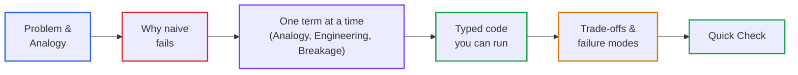

# AI Curriculum Refactoring Skill

This skill is the **single source of truth** for how the AI Engineering curriculum is audited, written and validated. The agent `ai-curriculum-architect` decides *when* to do what; this skill defines *how* and *what good looks like*. Detailed specifications live in `references/`. This file holds the rules that apply to every task.

---

## 🏛️ Core Educational Axiom

> **"Do not teach less. Teach better."**

<pedagogy_baseline>
  <target_reader>
    A working senior software engineer (backend, systems, cloud, distributed systems) who knows software terms deeply,
    but is completely new to every AI term. They want pragmatic, high-signal engineering truth, not hype or academic jargon.
  </target_reader>
  
  <voice_and_register>
    Principal Systems Engineer at Stripe or Cloudflare explaining an architecture on a whiteboard to a smart backend
    colleague over coffee. Direct, conversational, punchy, active, and zero academic pretension.
  </voice_and_register>
  
  <depth_contract>
    Depth is: memory math (VRAM/RAM), latency budgets (ms), failure modes (timeouts, silent drift),
    hardware physics, wire protocols, and typed runnable code.
    Depth is NEVER: academic ML paper vocabulary, statistical mechanics jargon, or ArXiv preprint phrasing.
  </depth_contract>

  <prose_mechanics>
    <rule id="one_concept_per_sentence">Max 1 new AI concept per sentence. Never stack unfamiliar terms.</rule>
    <rule id="sentence_length_ceiling">Hard ceiling: 28 words per sentence. Target average: 12-18 words.</rule>
    <rule id="action_verbs">Use plain Anglo-Saxon verbs (build, run, guess, drop, check, save) over Latinate abstractions (instantiate, execute, hypothesize, evict, verify, persist).</rule>
    <rule id="active_voice">Target 80%+ active voice: Subject -> Verb -> Object ("The engine drops the cache", NOT "The cache is evicted by the engine").</rule>
    <rule id="ban_jargon_stacking">Never stack 2+ abstract AI adjectives before a noun (NO "probabilistic autoregressive next-token prediction model"; write "an AI that predicts the next word based on odds").</rule>
  </prose_mechanics>

  <canonical_jargon_translations>
    <entry from="probabilistic autoregressive model" to="an AI that predicts words based on odds, not deterministic code" />
    <entry from="autoregressive next-token prediction" to="predicting words one by one based on probabilities" />
    <entry from="stochastic decoding trajectory" to="random variations in what the model outputs" />
    <entry from="high-dimensional semantic vector embedding" to="a list of numbers that captures what text means" />
    <entry from="parametric knowledge" to="what the model learned during training" />
    <entry from="non-parametric knowledge" to="the fresh documents you feed it at runtime" />
    <entry from="deterministic adjudication" to="standard code / if-statements" />
    <entry from="heterogeneous agent topology" to="multiple agents working together" />
    <entry from="prefix KV cache eviction under VRAM pressure" to="discarding saved prompt calculations when GPU memory runs out" />
    <entry from="utilize" to="use" />
    <entry from="commence / initiate" to="start" />
    <entry from="ascertain / elucidate" to="check / explain" />
    <entry from="necessitate" to="require" />
  </canonical_jargon_translations>
</pedagogy_baseline>

Refactoring never means stripping engineering depth. It means:
- **Demystifying before formalizing**: a plain-English mental model first, then mechanics, then code.
- **Enforcing the "Coffee Test"**: write like a Senior Principal Engineer explaining an architecture on a whiteboard to a backend peer. Depth is proven through failure modes, memory bottlenecks, latency budgets, and runnable code—never through dense academic adjectives or ML jargon stacking.
- **Showing why the naive approach fails** before introducing the production solution.
- **Anchoring every concept in a trade-off** (latency, cost, memory, quality, determinism).
- **Bridging from software the learner already knows** to the AI concept, without letting the bridge replace the explanation.
- **Ending with a Quick Check** that tests understanding with a concrete scenario.

---

## 🎯 Learner Baseline

The learner is a **working software engineer of any seniority who is new to AI engineering**.

| | Assumed | Treatment |
|---|---|---|
| **Software engineering terms** (cache, index, RPC, idempotency, tracing, CI/CD) | Known | Use freely as bridges. Never re-teach. |
| **AI engineering terms** (token, embedding, context window, attention, KV cache, RAG, agent, eval, hallucination, quantization, temperature) | Unknown, for everyone | Teach every one from zero: **definition → analogy → tiny example → formal name → math or code**. |

**Term Ledger (mandatory)**: every lesson header lists `New AI terms introduced` and `AI terms assumed from earlier lessons` (linked). No AI term may be used before the lesson that teaches it. Details: [terminology-guidelines.md](references/terminology-guidelines.md), [lesson-template.md](references/lesson-template.md).

---

## 🏷️ One Tier System

| Tier | Badge | Prose words | Scope |
|---|---|---|---|
| 1 | `🟢 Core` | 800–1,500 | One core idea with intuition, naive failure, working baseline. |
| 2 | `🟡 Engineering Depth` | 1,200–2,500 | Production concerns: edge cases, failure modes, scale, telemetry. |
| 3 | `🔵 Advanced` | 1,500–3,000 | Specialised patterns. |
| 4 | `⚫ Deep Dive` | 1,500–3,000 | Internal mechanics, hardware, wire protocols. |

Budgets count prose only (not code, diagrams or tables) and are hard limits: over budget means split. Legacy labels (`HIGH ROI / CORE` and similar) are migrated when a lesson is touched. See [lesson-template.md](references/lesson-template.md).

---

## 📐 Core Pedagogical Arc

1. **Problem & Analogy**: a concrete scenario, then a plain-English mental model.
2. **Why naive fails**: the obvious approach and where it breaks.
3. **One term at a time**: for each of the 2–4 core mechanisms, give the analogy, the engineering, and what breaks if you skip it.
4. **Typed code**: Python 3.12+, Pydantic v2, offline, executed.
5. **Trade-offs & failure modes**: honest costs, labelled numbers.
6. **Quick Check**: a scenario with a hidden answer.

---

## 🧩 Structural Flexibility

The template is a default, not a checklist. **Six invariants are mandatory**: (1) header block with term ledger, (2) plain-English mental model with its "where this analogy breaks" note, (3) systems depth with typed, executed code, (4) trade-offs and failure modes, (5) Quick Check, (6) navigation footer. Everything else is omittable.

Editorial test for every section: *"Does this help the learner understand, decide, navigate a trade-off, or avoid a production failure?"* If not, remove or merge it.

---

## 🧭 Content Transformation Taxonomy

Classify each element as one of: **KEEP**, **REWRITE**, **REORGANIZE**, **SIMPLIFY**, **MOVE**, **MERGE**, **REMOVE**. Prefer restructuring over deletion.

---

## 🚦 Guardrails (Violations Block Merge)

These are the only copy of the guardrails. The agent and always-on rules refer here.

1. **Beginner-first AI terms**: rules above. Tripartite rhythm (🧒 Analogy → ⚙️ Engineering → ⚠️ What happens if you skip this?) for each core mechanism, not every paragraph. Every analogy states where it breaks. Zero academic jargon stacking (strictly obey `<prose_mechanics>` and `<canonical_jargon_translations>`). Must pass the "Coffee Test". Max 28 words per sentence.
2. **Accuracy & verifiability**: every number sourced, derived or marked *(illustrative)*; model and product names verified in the current session and dated; no invented citations, URLs or API fields; every code block executed. See [accuracy-policy.md](references/accuracy-policy.md).
3. **Zero-LaTeX**: no `$$`, `$...$`, `\frac`, `\text`. Use `text` code blocks and Unicode (`→ ⟷ Σ ≈ α ≤ ≥`). GFM pipe tables only.
4. **Zero meta-directive leaks**: no `(Zero-LaTeX)`, `(Refactored)`, `[MUST-HAVE]`, `[GOOD-TO-KNOW]` or any authoring-checklist tags in learner-facing text.
5. **Plain-language titles**: plain descriptor first, acronym in parentheses, plus a Core Concept callout. Expand every abbreviation on first use. No more than two new acronyms per paragraph.
6. **Navigation**: every lesson ends with `## 🧭 Navigation` (Previous, Phase Hub, Next, Capstone Lab). Every phase README has a Master Lesson Navigation Table and a Direct Chapter & Lesson Directory. See [phase-template.md](references/phase-template.md).
7. **Diagrams**: 4–8 nodes each (hard ceiling 10), split when larger; transparent subgraphs, no `fill` overrides, semantic border colours; no subgraph-to-subgraph edges; numbered walkthrough under every diagram. Palette and layout rules live only in [diagram-guidelines.md](references/diagram-guidelines.md).
8. **Code**: Python 3.12+, typed Pydantic v2, real error handling, no pseudo-code, runs offline by default. Introduce a technology only when it explains a concept or trade-off (concept → why it matters → how it works → example → technology).
9. **Working tree policy**: never run `git commit` or `git push`. Leave changes in the working tree for the user to review.

---

## 📡 Research & Conflict Resolution

- Research uses the controlled protocol `Research → Verify → Classify → Evaluate → Recommend → Human Approval → Integrate`. See [research-guidelines.md](references/research-guidelines.md).
- When audit and research disagree, use [conflict-resolution-checklist.md](references/conflict-resolution-checklist.md) and record material conflicts.

---

## 📚 Golden Examples

Quality references, not structural clones. Start with the first.

- **Beginner Tier 1 lesson (canonical)**: [examples/golden-lesson.md](examples/golden-lesson.md)
- **Foundational concept**: [examples/golden-concept-lesson.md](examples/golden-concept-lesson.md)
- **System architecture**: [examples/golden-architecture-lesson.md](examples/golden-architecture-lesson.md)
- **Production engineering**: [examples/golden-engineering-lesson.md](examples/golden-engineering-lesson.md)

---

## 🗂️ Reference Index

| Reference | Scope |
|---|---|
| [audit-protocol.md](references/audit-protocol.md) | The 10-step audit protocol. |
| [refactor-protocol.md](references/refactor-protocol.md) | The 12-step refactoring protocol with human checkpoints. |
| [quality-gates.md](references/quality-gates.md) | 15-point quality gate, dual-lens review, severity triage. |
| [accuracy-policy.md](references/accuracy-policy.md) | Numbers, models, citations, code execution, analogies, freshness. |
| [lesson-template.md](references/lesson-template.md) | Tier system, budgets, header block, default anatomy, split/merge rules. |
| [phase-template.md](references/phase-template.md) | Phase README specification. |
| [terminology-guidelines.md](references/terminology-guidelines.md) | Learner baseline, first-mention rule, title rules, banned buzzwords. |
| [diagram-guidelines.md](references/diagram-guidelines.md) | Mermaid standards, theme-adaptive palette, layout stability. |
| [curriculum-principles.md](references/curriculum-principles.md) | Pedagogy, Software 2.0 → 3.0 bridges, anti-patterns, trade-off matrices. |
| [research-guidelines.md](references/research-guidelines.md) | Controlled web research and freshness rules. |
| [conflict-resolution-checklist.md](references/conflict-resolution-checklist.md) | Resolving conflicting evidence. |
| [report-templates.md](references/report-templates.md) | Report formats and the `.curriculum-reports/` location. |
