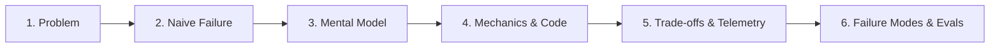

# AI Curriculum Refactoring Skill

This skill defines the pedagogical methodology, structural guidelines, editorial rules, and quality verification gates for designing, auditing, and refactoring the AI Engineering curriculum in this repository.

---

## 🏛️ Core Educational Axiom

> **"Do not teach less. Teach better."**

Refactoring does not mean dumbing down content or stripping away advanced systems engineering. It means:
- Replacing raw documentation dumps with **guided conceptual progressions**.
- Explaining the **failure mode of naive implementations** before introducing complex distributed solutions.
- Anchoring every concept in **concrete engineering trade-offs** (latency, cost, throughput, recall, determinism).
- Giving experienced engineers clear **mental models** that bridge traditional systems engineering (ACID, CRUD, RPC, deterministic state machines) to Software 3.0 (probabilistic outputs, semantic routing, KV cache physics, event-sourced WALs).

---

## 🎯 Target Learner Profile

The learner is a **Senior / Staff Software Engineer or Solutions Architect (7–10+ years experience)**:
- **Assumed Background**: Deep expertise in distributed systems, networking, caching tiers, relational & NoSQL databases, microservices, Linux internals, CI/CD, and telemetry.
- **Cognitive Barrier**: Disoriented by probabilistic LLM outputs, opaque non-deterministic failures, vector math, and transient framework hype.
- **Instructional Rule**: Never teach basic programming, Git, basic REST APIs, or introductory SQL. Introduce AI-specific primitives with architectural rigor.

---

## 🏷️ The 4-Tier Lesson Depth Model

Every lesson across all phases must declare its target depth tier in its header metadata:

| Tier | Badge | Scope & Word Budget | Target Audience |
|---|---|---|---|
| **Tier 1** | `🟢 Core` | Foundational entry point; primary mental model; failure of naive approach; working baseline. (~800–1,500 words). | All learners. Foundational phase entry. |
| **Tier 2** | `🟡 Engineering Depth` | Production systems view; edge cases; failure modes; scale limits; OTel telemetry. (~1,200–2,500 words). | Engineers deploying to production. Architectural core. |
| **Tier 3** | `🔵 Advanced` | Specialized high-scale patterns (e.g., speculative decoding, GraphRAG, multi-agent sagas). (~1,500–3,000 words). | Senior & Staff engineers tackling specialized domains. |
| **Tier 4** | `⚫ Deep Dive` | Internal mechanics; mathematical proofs; hardware memory layouts; wire protocols. (~1,500–3,000 words). | Architects needing zero-abstraction clarity. |

*Detailed tier parameters and split/merge thresholds are specified in [references/lesson-template.md](references/lesson-template.md).*

---

## 📐 Core Pedagogical Arc

Every concept follows this natural engineering progression:



See [references/curriculum-principles.md](references/curriculum-principles.md) for pedagogical principles and [references/lesson-template.md](references/lesson-template.md) for the 11-part lesson anatomy.

---

## 🧩 Structural Flexibility Rule

The lesson template is a **default structure, not a rigid checklist**. Template compliance does not equal good teaching.

Apply this **editorial decision test** to every section:
> *"Does this section help the learner understand the concept, make an architectural decision, navigate a trade-off, or avoid a production failure?"*

If not, remove or merge it.

---

## 🧭 Content Transformation Taxonomy

When auditing or refactoring existing content, classify every element into one of seven actions:

| Action | Definition | When to Use |
|---|---|---|
| **KEEP** | Preserve as-is | High-quality explanations with clear diagrams, code, and trade-offs. |
| **REWRITE** | Rewrite with standard arc | Buzzword-heavy, passive, or undigested text dumped from docs. |
| **REORGANIZE** | Shift position | Advanced concepts introduced before foundational prerequisites. |
| **SIMPLIFY** | Condense without losing depth | Verbose text taking 500 words to explain a 50-word concept. |
| **MOVE** | Transfer to another phase/appendix | Content belonging to an earlier or later phase. |
| **MERGE** | Combine redundant sections | Repetitive explanations scattered across multiple headings. |
| **REMOVE** | Delete entirely | Generic AI fluff, vendor hype, and duplicate cheat sheets. |

---

## 🚦 Mandatory Enforcement Guardrails

These rules are strictly enforced during refactoring and validation. Violations block merge approval:

### 1. Zero-LaTeX & Clean GFM Standard
- **Forbidden**: Never use LaTeX math delimiters (`$$...$$`, `$...$`, `\text{...}`, `\frac{...}{...}`, `\begin{array}`).
- **Required**: Clean text code blocks (```text), native Unicode (`→`, `⟷`, `Σ`, `≈`, `α`, `≤`, `≥`), standard `O(N)` monospace text, and GFM pipe tables. Avoid unescaped multiple dollar signs (`$$`, `$$$`).

### 2. Zero Meta-Directive Leaks
- **Forbidden**: Internal refactoring directives, compliance labels, or checklist tags in learner-facing text (e.g., `### Section (Zero-LaTeX):`, `(Pure Markdown)`, `(Refactored)`, `[MUST-HAVE]`).
- **Required**: Clean, professional, authoritative headings and prose without exposing the authoring checklist.

### 3. Plain-Language Titles (No Isolated Acronyms)
- **Forbidden**: Isolated abbreviations in titles/headings (e.g., `# BM25 and HNSW`).
- **Required**: Plain-language systems descriptor first, acronym in parentheses (e.g., `# Hybrid Search: Lexical Keyword Matching (BM25), Vector Proximity Graphs (HNSW) & Memory Physics`), plus a 1–2 sentence `Core Concept` callout below the title. See [references/terminology-guidelines.md](references/terminology-guidelines.md).

### 4. Mandatory Navigation & Wayfinding
- **Lessons**: Every lesson file must conclude with `## 🧭 Navigation` containing reciprocal links (`[← Previous]`, `[Phase Hub]`, `[Next →]`, `[Capstone Lab]`).
- **Phase Hubs**: Every phase `README.md` must contain a **Master Lesson Navigation Table** and a **Direct Chapter & Lesson Directory** in its navigation footer. See [references/phase-template.md](references/phase-template.md).

### 5. Diagram Stability & Dagre Rules
- **Forbidden**: Subgraph ID chaining (`subgraphA --> subgraphB`) and asymmetric rank links (`RightNode ~~~ LeftNode`).
- **Required**: `flowchart TD` with symmetric column pinning (`~~~`) for multi-column layouts, node-to-node wiring, and mandatory step-by-step prose walkthroughs directly below every diagram. See [references/diagram-guidelines.md](references/diagram-guidelines.md).

### 6. Production Code Standards
- **Required**: Python 3.12+, typed Pydantic v2 schemas, type annotations, real error handling, and zero framework magic or pseudocode.

---

## 📡 Controlled Research & Conflict Resolution

When evaluating emerging topics or industry updates:
1. Follow the **Controlled Research Protocol**: `Research → Verify → Classify → Evaluate → Recommend → Human Approval → Integrate`. See [references/research-guidelines.md](references/research-guidelines.md).
2. When audit and research findings conflict, apply [references/conflict-resolution-checklist.md](references/conflict-resolution-checklist.md). Record material conflicts rather than silently discarding them.

---

## 📚 Quality References (Golden Examples)

Golden examples in `examples/` demonstrate target quality, narrative pacing, and technical rigor (they are quality references, not rigid structural clones):
- **Foundational Concept**: [examples/golden-concept-lesson.md](examples/golden-concept-lesson.md)
- **System Architecture**: [examples/golden-architecture-lesson.md](examples/golden-architecture-lesson.md)
- **Production Engineering**: [examples/golden-engineering-lesson.md](examples/golden-engineering-lesson.md)
- **End-to-End Lesson**: [examples/golden-lesson.md](examples/golden-lesson.md)

---

## 🗂️ Single Source of Truth (SSOT) Reference Index

For detailed specifications, consult the authoritative references:

| Reference Document | Canonical Scope & Purpose |
|---|---|
| **[references/quality-gates.md](references/quality-gates.md)** | **The 13-Point Quality Gate Checklist**, Dual-Lens Review, and Defect Severity Triage. |
| **[references/lesson-template.md](references/lesson-template.md)** | **11-Part Default Lesson Anatomy**, word budgets, split/merge rules, and navigation footers. |
| **[references/phase-template.md](references/phase-template.md)** | **Phase README Specification**, Master Lesson Navigation Table, and Direct Chapter Directory. |
| **[references/terminology-guidelines.md](references/terminology-guidelines.md)** | **Title & Terminology Rules**, First-Mention rule, concept-before-acronym, and banned buzzwords. |
| **[references/diagram-guidelines.md](references/diagram-guidelines.md)** | **Mermaid Standards**, Dagre layout stabilization, symmetric column pinning, and walkthroughs. |
| **[references/curriculum-principles.md](references/curriculum-principles.md)** | **Senior Pedagogy**, Software 2.0 to 3.0 bridging, 9 anti-patterns, and decision matrices. |
| **[references/research-guidelines.md](references/research-guidelines.md)** | **Controlled Web Research**, classification taxonomy, freshness criteria, and update workflows. |
| **[references/conflict-resolution-checklist.md](references/conflict-resolution-checklist.md)** | **Evidence Verification**, distinguishing facts from trends, and resolving analytical conflicts. |
