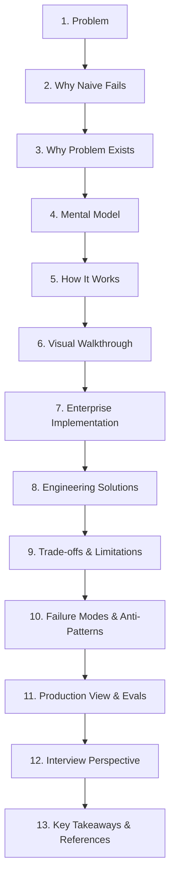

# AI Curriculum Refactoring Skill

This skill defines the pedagogical methodology, structural guidelines, editorial rules, and quality verification gates for designing, auditing, and refactoring the AI Engineering curriculum in this repository.

---

## 🏛️ Core Educational Axiom

> **"Do not teach less. Teach better."**

Refactoring does not mean dumbing down content or stripping away advanced systems engineering. It means:
- Replacing raw documentation dumps with **guided conceptual progressions**.
- Explaining the **failure mode of naive implementations** before introducing complex distributed solutions.
- Anchoring every concept in **concrete engineering trade-offs** (latency, cost, throughput, recall, determinism).
- Giving experienced engineers clear **mental models** that bridge traditional systems engineering (ACID, CRUD, RPC, deterministic state machines) to Software 3.0 (probabilistic outputs, semantic routing, KV cache physics, event-sourced WALs).

---

## 🎯 Target Learner Profile

The learner is a **Senior / Staff Software Engineer or Solutions Architect (7–10+ years experience)**:
- **Existing Strengths**: High proficiency in data structures, distributed systems, caching tiers, relational & NoSQL databases, microservices, Linux internals, network protocols, CI/CD, and telemetry.
- **Learning Barrier**: May be disoriented by the probabilistic nature of LLMs, opaque non-deterministic failures, vector geometry, and the barrage of transient framework buzzwords.
- **Rule**: Do not teach basic programming, Git, basic REST APIs, or introductory SQL. Introduce AI-specific primitives with architectural rigor.

---

## 🏷️ The 4-Tier Lesson Depth Model

Every lesson across all phases must declare its target depth tier in its metadata or header:

| Tier | Badge | Definition & Scope | Target Audience & Pacing |
|---|---|---|---|
| **Tier 1** | `🟢 Core` | Essential foundation every engineer must master. Teaches the primary mental model, basic mechanics, failure of the naive approach, and a working implementation. | All learners. Foundational entry point for the phase. (~800–1,500 words). |
| **Tier 2** | `🟡 Engineering Depth` | Production systems view. Explores edge cases, failure modes, scalability limits, concurrency, memory budgeting, and OpenTelemetry instrumentation. | Engineers deploying to production. Architectural core. (~1,200–2,500 words). |
| **Tier 3** | `🔵 Advanced` | Cutting-edge, specialized, or high-scale production patterns (e.g., speculative decoding, GraphRAG, multi-agent sagas, custom kernel optimizations). | Senior & Staff engineers tackling scale, performance, or specialized domains. (~1,500–3,000 words). |
| **Tier 4** | `⚫ Deep Dive` | Internal mechanics, underlying math, hardware physics, wire protocol specifications, and memory layouts (e.g., PagedAttention block tables, BPE merge trees, RRF harmonic rank distributions). | Architects and infrastructure specialists needing zero-abstraction clarity. (~1,500–3,000 words). |

---

## 📐 The 12/13-Stage Standard Pedagogical Arc

When presenting any concept, follow this natural engineering arc:



1. **The Problem**: What real-world capability, traffic load, or failure scenario creates the need for this pattern?
2. **Why the Naive Approach Fails**: Why can't we just use a basic SQL query, a simple prompt, or an off-the-shelf vector search?
3. **Why the Problem Exists**: The root physics or mathematical constraints (e.g., quadratic attention complexity, memory bandwidth wall, vector dimensional collapse, non-deterministic token sampling).
4. **Mental Model**: Intuitive systems metaphor bridging traditional engineering to Software 3.0 (e.g., *Inverted Index is like a book index; KV Cache is like hardware-level memoization; Agent loop is like a bounded actor*).
5. **How It Works**: The mechanical data flow, state transitions, and algorithmic steps.
6. **Visual Representation**: A crisp Mermaid flowchart or sequence diagram with an accompanying step-by-step prose walkthrough.
7. **Concrete Scenario & Implementation**: Realistic enterprise case (finance, healthcare, legal, devtools) with type-annotated Python 3.12+ and Pydantic v2 schemas.
8. **Engineering Solutions**: Battle-tested production patterns (e.g., hybrid RRF, WAL event persistence, dual-LLM quarantine).
9. **Trade-offs & Limitations**: Honest, quantifiable trade-offs (latency vs. precision, compute cost vs. accuracy, token spend vs. context window size).
10. **Common Failure Modes & Anti-Patterns**: Real-world landmines, root causes, and production remedies.
11. **Production View & Evaluation**: OpenTelemetry GenAI semantic conventions, distributed tracing, latency/cost budgets, and evaluation gates.
12. **Interview Perspective (Optional / Recommended)**: 3–5 architectural design questions testing deep trade-off justification.
13. **Key Takeaways & Verified Resources**: 3–4 foundational principles and primary source references (arXiv papers, official protocol specs).

---

## 🛠️ The 12-Step Per-Lesson Refactoring Protocol

When creating or refactoring an individual lesson, follow this deterministic sequence:

1. **Identify Core Concept**: Strip away buzzwords, vendor hype, and transient framework abstractions to locate the durable engineering primitive.
2. **Assign Depth Tier**: Classify as `🟢 Core`, `🟡 Engineering Depth`, `🔵 Advanced`, or `⚫ Deep Dive`.
3. **Verify Prerequisites**: Ensure required foundational concepts are introduced in earlier lessons or phases.
4. **Frame the Senior Problem**: Formulate the production engineering challenge without treating the reader as a novice.
5. **Demonstrate Naive Failure**: Pinpoint exactly where and why basic implementations break under production load.
6. **Bridge Mental Model**: Map the AI primitive to a known distributed systems or software engineering equivalent.
7. **Detail Technical Mechanics**: Provide algorithmic steps, data transformations, and wire protocol formats.
8. **Construct Diagram & Walkthrough**: Create a Mermaid diagram accompanied by a numbered prose explanation.
9. **Write Enterprise Code**: Provide runnable, type-annotated Python 3.12+ code with Pydantic v2 validation.
10. **Analyze Trade-offs & Limitations**: Include a structured decision matrix comparing alternatives across latency, cost, and recall.
11. **Codify Production Operations**: Detail failure modes, OTel telemetry spans, and automated evaluation criteria.
12. **Run Zero-LaTeX & Quality Checks**: Validate against the 13-point quality gate and ensure zero unrendered LaTeX syntax.

---

## 🧩 Structural Flexibility Rule

The lesson template is a **default structure, not a rigid checklist**. Template compliance does not equal good teaching.

For each lesson:
1. Determine the learning objective.
2. Determine what the learner actually needs to understand.
3. Select sections that contribute directly to that objective.
4. Remove sections that add no meaningful value.
5. Merge overlapping sections.
6. Add deep-dive sections when the technical complexity demands it.
7. Reorder sections when it enhances logical comprehension.
8. Never create empty or superficial sections.

Always apply this **editorial decision test**:
> *"Does this section help the learner understand the concept, make an architectural decision, navigate a trade-off, or avoid a production failure?"*

If not, remove it.

---

## 🌐 The 9 Curricular Domains (Universal Phase Archetypes)

The standard pedagogical arc applies uniformly across all 9 curriculum phases:

| Phase | Domain Archetype | Problem / Naive Failure | Systems Mental Model | Engineering Solution |
|---|---|---|---|---|
| **00** | **Token & Hardware Physics** | OOM crashes from uncontrolled context; GPU memory bandwidth starvation. | Hardware memoization & paging | KV cache budgeting, chunked prefill, tensor parallelism. |
| **01** | **Prompt & Context ASTs** | Brittle regex parsing; model ignoring negative prompt constraints. | Compiler AST & typed schema marshaling | Constrained grammar decoding, JSON Schemas, few-shot anchors. |
| **02** | **Retrieval & Knowledge (RAG)** | Dense search misses exact hex IDs; semantic drift on technical terms. | Inverted index + Spatial ANN graph | Hybrid BM25 + HNSW search, Reciprocal Rank Fusion, cross-encoders. |
| **03** | **Tools & Protocols (MCP)** | Custom brittle API glue code; security risks from unvalidated tools. | Foreign Function Interface (FFI) & OS syscalls | Model Context Protocol JSON-RPC, ABAC access control, schema validation. |
| **04** | **Stateful Agent Loops** | Unbounded loops burning budgets; state loss on network disconnects. | Distributed actor state machine & Saga pattern | Event-sourced Write-Ahead Log (WAL), checkpoints, max-turn gates. |
| **05** | **AI Security & Guardrails** | Prompt injection subverting instructions; sensitive data exfiltration. | DMZ perimeter & privilege separation | Dual-LLM quarantine, semantic firewalls, PII masking. |
| **06** | **Evals & Observability** | "Vibe check" testing; silent regressions undetected in production. | Property-based testing & APM telemetry | LLM-as-a-judge (faithfulness/groundedness), OpenTelemetry GenAI spans. |
| **07** | **Serving & LLMOps** | GPU idle bubbles; high TTFT under concurrent traffic loads. | Event-loop multiplexing & memory compaction | vLLM continuous batching, AWQ quantization, speculative decoding. |
| **08** | **SDLC & Leadership** | Shadow AI sprawl; unreviewed AI-generated code creating technical debt. | Architecture Review Board (ARB) & RFCs | Spec-driven code gen, eval CI/CD gates, architectural review criteria. |

---

## 🚫 Pure Markdown & Zero-LaTeX Standard

To ensure all documentation renders flawlessly across all preview environments (VS Code preview, GitHub web, Antigravity IDE, offline viewers):
- **NEVER use LaTeX math formatting**: Do not use `$$...$$`, `$...$`, `\text{...}`, `\mathbf{...}`, `\frac{...}{...}`, `\alpha`, `\sum`, or `\begin{array}...\end{array}`.
- **Formulas & Math**: Format formulas using clean fenced code blocks (language: `text`) or inline monospace code:
  ```text
  RRF_Score(d) = Σ [ 1 / (k + rank_m(d)) ]  for each ranking m in M
  ```
- **Mathematical & Directional Symbols**: Use native Unicode characters (`→`, `⟷`, `Σ`, `≈`, `α`, `≤`, `≥`, `×`, `Δ`).
- **Complexity Notation**: Write standard Big-O notation as clean text (`O(N)`, `O(log N)`), never LaTeX `$\mathcal{O}(N)$`.
- **Tables**: Always use standard GitHub Flavored Markdown (GFM) pipe tables (`| Col 1 | Col 2 |`), never LaTeX array blocks.
- **Cost / Pricing**: Never write raw unescaped multiple dollar signs (`$$`, `$$$`) inside text or tables as preview engines interpret them as block math. Use descriptive terms (`Very Low`, `Low`, `Medium`, `High`) or backticked text.

---

## 🎯 Whiteboard Delivery Stems & Tone Guidelines

Maintain the voice of a Principal AI Systems Architect conducting a technical whiteboard session with a Staff Software Engineer:

### Active Sentence Stems:
- *"The problem is..."*
- *"The simple approach works until..."*
- *"Under the hood, what actually happens is..."*
- *"The trade-off you are accepting is..."*
- *"In production, this breaks when..."*
- *"To evaluate this, measure..."*

### ⚠️ The 9 Anti-Patterns ("It should NOT feel like..."):
1. **A vendor marketing brochure**: No uncritical promotion of proprietary APIs or hype cycles.
2. **A beginner programming tutorial**: Do not re-explain loops, Git, basic JSON, or HTTP methods.
3. **A superficial bullet-point listicle**: Avoid shallow summaries that lack mechanical depth.
4. **An uncurated documentation dump**: Do not copy-paste raw API reference tables without narrative context.
5. **Transient framework API guides**: Avoid teaching wrapper libraries (e.g. LangChain syntax) over underlying protocols.
6. **A disconnected recipe book**: Every pattern must fit into the overarching architecture of production AI systems.
7. **An unrendered math paper**: Avoid dense academic formulas without code, diagrams, and systems intuition.
8. **A happy-path-only demo**: Never present AI components without discussing error handling, rate limits, and failure modes.
9. **An unedited LLM essay**: Avoid repetitive platitudes, passive voice, and fluff paragraphs.

---

## Golden Examples

Golden examples are quality references, not templates.

Use the files under:

`examples/`

to understand the expected quality of curriculum content.

Golden examples demonstrate:

- clarity
- teaching flow
- appropriate depth
- terminology usage
- paragraph length
- explanation style
- example quality
- diagram complexity
- engineering perspective
- trade-off discussion
- appropriate use of sections

IMPORTANT:

Do NOT copy the structure of a golden example mechanically.

A golden example does not define a mandatory lesson structure.

Different topics require different teaching approaches.

When creating or refactoring a lesson:

1. Identify the learning objective.
2. Determine what the learner needs to understand.
3. Select an appropriate structure.
4. Use golden examples as quality references.
5. Remove sections that do not add value.
6. Add sections when the topic requires them.
7. Preserve the appropriate level of technical depth.

The question is not:

> "Does this lesson look like the golden example?"

The question is:

> "Does this lesson demonstrate the same level of clarity,
> depth, progression, and engineering quality?"

### Golden Example Selection

When refactoring or creating a lesson, select the golden example that most
closely matches the nature of the topic.

| Lesson type | Preferred reference |
|---|---|
| Foundational concept | `golden-concept-lesson.md` |
| Architecture / system design | `golden-architecture-lesson.md` |
| Production / engineering decision | `golden-engineering-lesson.md` |

A lesson may use more than one example as a reference.

Do not force a lesson into one category when the topic naturally spans
multiple categories.

For example, a RAG lesson may use the architecture example for structure
and the engineering example for evaluation and production concerns.

The golden examples define the expected **quality of teaching**, not the
required headings, section count, word count, or diagram count.

---

## 🧭 Content Transformation Taxonomy

When auditing or refactoring existing content, classify every paragraph, diagram, or table into one of these actions:

| Action | Definition | When to Use |
|---|---|---|
| **KEEP** | Preserve exactly as-is | High-quality explanations with clear diagrams, code, and trade-offs. |
| **REWRITE** | Rewrite from scratch with the standard arc | Buzzword-heavy, passive, or undigested text dumped from documentation. |
| **REORGANIZE** | Shift position within the lesson or phase | Advanced concepts introduced before foundational prerequisites. |
| **SIMPLIFY** | Condense without losing technical substance | Verbose explanations that take 500 words to explain a 50-word concept. |
| **MOVE** | Transfer to another phase or appendix | Material that belongs to an earlier prerequisite phase or a later advanced phase. |
| **MERGE** | Combine multiple redundant sections | Repetitive explanations scattered across multiple headings. |
| **REMOVE** | Delete entirely | Generic AI fluff, empty marketing buzzwords, and duplicate cheat sheets. |

---

## 📡 Controlled Web Research & Freshness Gate

AI engineering evolves rapidly, but **new does not mean important**. 

When using web search tools (`search_web`) to research emerging topics, the agent must adhere to the **Controlled Research Protocol**:

```text
Research → Verify → Classify → Evaluate → Recommend → Human Approval → Integrate
```

1. **Source Preference**: Prioritize official documentation, published research papers (arXiv), and upstream source code over social media threads or marketing announcements.
2. **Evaluation Criteria**: Is the topic durable engineering knowledge or a short-lived vendor feature? Does it fill an identified curriculum gap?
3. **Approval Checkpoint**: Document proposed additions in `CURRICULUM_RESEARCH.md` with explicit classification (`KEEP_EXISTING`, `UPDATE_EXISTING`, `NEW_TOPIC`, `MOVE_TOPIC`, `ADVANCED_TOPIC`, `REFERENCE_ONLY`, `REJECT`). Never silently rewrite lessons based on raw search results.

---

## Report Conflict Resolution

When audit and research findings conflict, use the
`references/conflict-resolution-checklist.md` reference.

Do not blindly follow either report. Verify evidence, distinguish
facts from recommendations, check prerequisites and curriculum
placement, and make an explicit architectural decision.

Record material conflicts and uncertainty rather than silently
discarding contradictory findings.

---

## 🗂️ Skill References & Reusable Assets

Refer to these specialized sub-guidelines for detailed rules and templates:

- **[Pedagogical Principles](references/curriculum-principles.md)**: Deep dive into senior-engineer pedagogy, failure-mode teaching, and cognitive load management.
- **[Lesson Template](references/lesson-template.md)**: The standard 11-part anatomy for lessons, with section-by-section guidelines.
- **[Phase Template](references/phase-template.md)**: Architectural pattern for clean phase READMEs, navigation, and prerequisites.
- **[Terminology Guidelines](references/terminology-guidelines.md)**: Rules for expanding acronyms, mental models, and framework independence.
- **[Diagram Guidelines](references/diagram-guidelines.md)**: Standards for Mermaid flowcharts, sequence diagrams, and required prose walkthroughs.
- **[Research Guidelines](references/research-guidelines.md)**: Full evaluation matrix, classification taxonomy, and freshness auditing workflow.
- **[Quality Gates](references/quality-gates.md)**: 13-point pre-merge checklist for verifying refactored curriculum.
- **[Golden Lesson Example](examples/golden-lesson.md)**: The gold-standard benchmark lesson (*Hybrid Search & Reciprocal Rank Fusion*).
