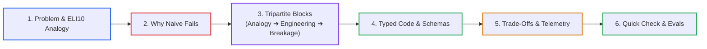

# AI Curriculum Refactoring Skill

This skill defines the pedagogical methodology, structural guidelines, editorial rules, and quality verification gates for designing, auditing, and refactoring the AI Engineering curriculum in this repository.

---

## 🏛️ Core Educational Axiom

> **"Do not teach less. Teach better."**

Refactoring does not mean dumbing down content or stripping away advanced systems engineering. It means:
- **Demystifying before formalizing**: Lead with a vivid, intuitive real-world mental model or analogy (Explain Like I'm 10) before introducing formal mathematics or algorithms.
- **Following the Tripartite Pedagogy Rhythm**: For every major block, explain (1) 🧒 **The Analogy**, (2) ⚙️ **The Engineering Mechanics**, and (3) ⚠️ **What happens if you skip this?**
- **Contrasting evolution**: Provide "Old/Naive vs Modern Production" tables to show *why* modern patterns were invented.
- **Explaining the failure mode of naive implementations** before introducing complex distributed solutions.
- **Anchoring every concept in concrete engineering trade-offs** (latency, cost, throughput, recall, determinism).
- **Giving experienced engineers clear mental models** that bridge traditional systems engineering (ACID, CRUD, RPC, deterministic state machines) to Software 3.0 (probabilistic outputs, semantic routing, KV cache physics, event-sourced WALs).
- **Calibrating intuition**: Ending with a "Quick Check to See if it Clicked" scenario.

---

## 🎯 Target Learner Profile

The learner is a **Senior / Staff Software Engineer or Solutions Architect (7–10+ years experience)**:
- **Assumed Background**: Deep expertise in distributed systems, networking, caching tiers, relational & NoSQL databases, microservices, Linux internals, CI/CD, and telemetry.
- **Cognitive Barrier**: Disoriented by probabilistic LLM outputs, opaque non-deterministic failures, vector math, and transient framework hype.
- **Instructional Rule**: Never teach basic programming, Git, basic REST APIs, or introductory SQL. Introduce AI-specific primitives with architectural rigor, using accessible mental models to remove cognitive gatekeeping.

---

## 🏷️ Effort vs ROI Depth Alignment

Every lesson across all phases must declare its target depth tier in its header metadata, categorizing topics by their true enterprise ROI:

| Tier | Badge | Scope & Word Budget | Target Audience |
|---|---|---|---|
| **Tier 1** | `HIGH ROI / CORE` | Essential concepts providing the highest practical ROI for enterprise applications (e.g., LLM APIs, prompt design, tokens/context, RAG, tool calling, MCP). Master these first. (~800–1,500 words). | All learners. Foundational phase entry. |
| **Tier 2** | `IMPORTANT / NEXT` | Next-level production concerns like stateful agents, context/session management, security guardrails, evaluation, and observability. (~1,200–2,500 words). | Engineers deploying to production. Architectural core. |
| **Tier 3** | `ADVANCED / SPECIALIZED` | Complex architectures, multi-agent sagas, vector search optimization, scale limits, and platform-specific enterprise implementations. (~1,500–3,000 words). | Senior & Staff engineers tackling specialized domains. |
| **Tier 4** | `REFERENCE / AWARENESS` | Foundational hardware physics, memory hierarchy, mathematical proofs, and internal wire protocol details—good to know, but not strictly required for daily engineering. (~1,500–3,000 words). | Architects needing zero-abstraction clarity. |

*Detailed tier parameters and split/merge thresholds are specified in [references/lesson-template.md](references/lesson-template.md).*

---

## 📐 Core Pedagogical Arc

Every concept follows this natural, beginner-accessible yet systems-deep engineering progression:



See [references/curriculum-principles.md](references/curriculum-principles.md) for pedagogical principles and [references/lesson-template.md](references/lesson-template.md) for the 11-part lesson anatomy.

---

## 🧩 Structural Flexibility Rule

The lesson template is a **default structure, not a rigid checklist**. Template compliance does not equal good teaching.

> [!TIP]
> **Not All Sections Are Mandatory!**  
> Tailor each lesson to its depth tier and topic. Never force artificial filler into a lesson just to satisfy all 11 template sections.  
> - **Tier 1 Core Primers**: Keep them tight (800–1,500 words). Focus on intuition, failure of naive, and baseline code; omit distributed system diagrams or extensive interview trees if they dilute reading momentum.  
> - **Algorithmic Utilities**: When explaining a formula (like BM25 or BPE), omit full distributed architecture blocks and focus on byte-level math and failure modes.  
> - **Only 5 Invariants Are Mandatory**: (1) Title + Core Concept, (2) Intuitive Mental Model, (3) Systems Depth & Typed Code, (4) Failure Modes & Trade-offs, and (5) Reciprocal Navigation. All other sections are modular and omittable.

Apply this **editorial decision test** to every section:
> *"Does this section help the learner understand the concept, make an architectural decision, navigate a trade-off, or avoid a production failure?"*

If not, remove or merge it.

---

## 🧭 Content Transformation Taxonomy

When auditing or refactoring existing content, classify every element into one of seven actions:

| Action | Definition | When to Use |
|---|---|---|
| **KEEP** | Preserve as-is | High-quality explanations with clear diagrams, code, and trade-offs. |
| **REWRITE** | Rewrite with standard arc | Buzzword-heavy, passive, or undigested text dumped from docs. |
| **REORGANIZE** | Shift position | Advanced concepts introduced before foundational prerequisites. |
| **SIMPLIFY** | Condense without losing depth | Verbose text taking 500 words to explain a 50-word concept. |
| **MOVE** | Transfer to another phase/appendix | Content belonging to an earlier or later phase. |
| **MERGE** | Combine redundant sections | Repetitive explanations scattered across multiple headings. |
| **REMOVE** | Delete entirely | Generic AI fluff, vendor hype, and duplicate cheat sheets. |

---

## 🚦 Mandatory Enforcement Guardrails

These rules are strictly enforced during refactoring and validation. Violations block merge approval:

### 1. Intuition-First Teaching & Tripartite Pedagogy
- **Required**: Lead with an accessible, plain-English mental model or analogy (Explain Like I'm 10) before formal jargon. For every core block or mechanism, apply the Tripartite Pedagogy rhythm:
  - 🧒 **The Analogy**: Relatable real-world metaphor.
  - ⚙️ **The Engineering**: Production systems mechanics, schemas, code, and text formulas.
  - ⚠️ **What happens if you skip this?**: Concrete failure mode / outage scenario.
- **Required**: Provide "Old vs Modern" evolution tables and conclude with a "Quick Check to See if it Clicked" scenario.
- **Forbidden**: Academic cognitive gatekeeping, dense jargon dumps, and unanchored acronym soup.

### 2. Zero-LaTeX & Clean GFM Standard
- **Forbidden**: Never use LaTeX math delimiters (`$$...$$`, `$...$`, `\text{...}`, `\frac{...}{...}`, `\begin{array}`).
- **Required**: Clean text code blocks (```text), native Unicode (`→`, `⟷`, `Σ`, `≈`, `α`, `≤`, `≥`), standard `O(N)` monospace text, and GFM pipe tables. Avoid unescaped multiple dollar signs (`$$`, `$$$`).

### 3. Zero Meta-Directive Leaks
- **Forbidden**: Internal refactoring directives, compliance labels, or checklist tags in learner-facing text (e.g., `### Section (Zero-LaTeX):`, `(Pure Markdown)`, `(Refactored)`, `[MUST-HAVE]`).
- **Required**: Clean, professional, authoritative headings and prose without exposing the authoring checklist.

### 4. Plain-Language Titles (No Isolated Acronyms)
- **Forbidden**: Isolated abbreviations in titles/headings (e.g., `# BM25 and HNSW`). Do not introduce multiple unexplained abbreviations in the same section.
- **Required**: Plain-language systems descriptor first, acronym in parentheses (e.g., `# Hybrid Search: Lexical Keyword Matching (BM25), Vector Proximity Graphs (HNSW) & Memory Physics`), plus a 1–2 sentence `Core Concept` callout below the title. Expand every important abbreviation on first meaningful use.

### 5. Mandatory Navigation & Wayfinding
- **Lessons**: Every lesson file must conclude with `## 🧭 Navigation` containing reciprocal links (`[← Previous]`, `[Phase Hub]`, `[Next →]`, `[Capstone Lab]`).
- **Phase Hubs**: Every phase `README.md` must contain a **Master Lesson Navigation Table** and a **Direct Chapter & Lesson Directory** in its navigation footer. See [references/phase-template.md](references/phase-template.md).

### 6. Theme-Adaptive Light & Dark Mode Contrast, Low Node Budget & Modular Splitting
- **Theme-Adaptive Contrast (Light & Dark Mode)**: Diagrams must render with high contrast and zero visual breakage across both Light Mode and Dark Mode (GitHub, VS Code, web docs):
  - **Subgraphs**: Always transparent (`fill:none,stroke:#...,stroke-width:2px`). Never apply opaque pastel fills (`#f0f7ff`) to subgraphs.
  - **Nodes**: Do not override `fill` with light pastel colors (`#ffffff`, `#f0f7ff`). Leaving node fills to Mermaid's native theme engine ensures node cards and text automatically invert with high contrast in dark mode (dark slate card + white text) and light mode (light card + dark text).
  - **Semantic Borders**: Apply meaning through vibrant, accessible borders:
    - Primary/Ingestion/Pipeline: `stroke:#2563eb,stroke-width:2px` (Blue)
    - Success/Runtime/Verified Output: `stroke:#16a34a,stroke-width:2px` (Green)
    - Decision Gates/Rerank/Warning: `stroke:#d97706,stroke-width:2px` (Amber)
    - Quarantine/Error/Hazard/Legacy: `stroke:#dc2626,stroke-width:2px` (Red)
    - LLM/Reasoning Engine/Synthesis Core: `stroke:#7c3aed,stroke-width:2px` (Purple)
    - Container/Framework Boundary: `stroke:#64748b,stroke-width:2px` (Slate)
- **Low Node Count**: Aim for **4 to 8 nodes per diagram (strict ceiling of 10 nodes)**. Keep diagrams lightweight, focused, and immediately grokkable. Never build 20-node labyrinths.
- **Modular Splitting**: If a flow or architecture has multiple phases (e.g. Ingestion vs. Query, Prefill vs. Decode, The Problem vs. The Modern Solution), **split it into separate, focused diagrams** rather than a single monolithic diagram. Each diagram gets its own heading, clear purpose, and step-by-step prose walkthrough.
- **Forbidden**: Subgraph ID chaining (`subgraphA --> subgraphB`) and asymmetric rank links (`RightNode ~~~ LeftNode`). Multi-column subgraphs must use symmetric column pinning (`~~~`) to guarantee flush vertical stacking. See [references/diagram-guidelines.md](references/diagram-guidelines.md).

### 7. Production Code Standards & Technology Noise Reduction
- **Required**: Python 3.12+, typed Pydantic v2 schemas, type annotations, real error handling, and zero framework magic or pseudocode.
- **Rule**: Introduce a technology only when it helps explain a concept/implementation approach/architectural decision/real production trade-off. Prefer: Concept -> Why it matters -> How it works -> Example -> Technology implementation. Avoid unnecessary lists of frameworks, vendors, libraries, model providers.

### 8. Strict Working Tree Policy: Do Not Commit Directly
- **Forbidden**: Never run `git commit` or `git push` directly or autonomously after refactoring.
- **Required**: Leave all modified and newly generated files in the git working tree for the user to inspect (`git diff`), run evaluation harnesses on, and review.
- **Handoff**: Present a clear summary of changes and test verification results, and let the user review and commit when ready.

---

## 📡 Controlled Research & Conflict Resolution

When evaluating emerging topics or industry updates:
1. Follow the **Controlled Research Protocol**: `Research → Verify → Classify → Evaluate → Recommend → Human Approval → Integrate`. See [references/research-guidelines.md](references/research-guidelines.md).
2. When audit and research findings conflict, apply [references/conflict-resolution-checklist.md](references/conflict-resolution-checklist.md). Record material conflicts rather than silently discarding them.

---

## 📚 Quality References (Golden Examples)

Golden examples in `examples/` demonstrate target quality, narrative pacing, and technical rigor (they are quality references, not rigid structural clones):
- **Foundational Concept**: [examples/golden-concept-lesson.md](examples/golden-concept-lesson.md)
- **System Architecture**: [examples/golden-architecture-lesson.md](examples/golden-architecture-lesson.md)
- **Production Engineering**: [examples/golden-engineering-lesson.md](examples/golden-engineering-lesson.md)
- **End-to-End Lesson**: [examples/golden-lesson.md](examples/golden-lesson.md)

---

## 🗂️ Single Source of Truth (SSOT) Reference Index

For detailed specifications, consult the authoritative references:

| Reference Document | Canonical Scope & Purpose |
|---|---|
| **[references/quality-gates.md](references/quality-gates.md)** | **The 13-Point Quality Gate Checklist**, Dual-Lens Review, and Defect Severity Triage. |
| **[references/lesson-template.md](references/lesson-template.md)** | **11-Part Default Lesson Anatomy**, word budgets, split/merge rules, and navigation footers. |
| **[references/phase-template.md](references/phase-template.md)** | **Phase README Specification**, Master Lesson Navigation Table, and Direct Chapter Directory. |
| **[references/terminology-guidelines.md](references/terminology-guidelines.md)** | **Title & Terminology Rules**, First-Mention rule, concept-before-acronym, and banned buzzwords. |
| **[references/diagram-guidelines.md](references/diagram-guidelines.md)** | **Mermaid Standards**, Dagre layout stabilization, symmetric column pinning, and walkthroughs. |
| **[references/curriculum-principles.md](references/curriculum-principles.md)** | **Senior Pedagogy**, Software 2.0 to 3.0 bridging, 9 anti-patterns, and decision matrices. |
| **[references/research-guidelines.md](references/research-guidelines.md)** | **Controlled Web Research**, classification taxonomy, freshness criteria, and update workflows. |
| **[references/conflict-resolution-checklist.md](references/conflict-resolution-checklist.md)** | **Evidence Verification**, distinguishing facts from trends, and resolving analytical conflicts. |
