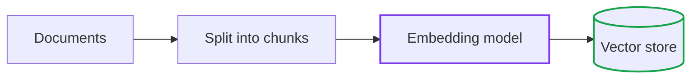
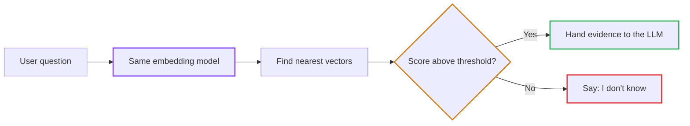

<!--
WHAT MAKES THIS LESSON GOLDEN — FOR AGENT AND AUTHOR EYES ONLY

This is the canonical Tier 1 (Core) quality reference. Five specific decisions make it work:

1. TERM LEDGER IN THE HEADER (Rule: lesson-template.md § Required Header Block)
   The header lists exactly which AI terms are new here (embedding, vector, cosine similarity,
   relevance threshold) and which are assumed from earlier (token, linked back). No AI term
   appears in the prose before it appears in this ledger. This is the "import statement" pattern
   for the reader's mental model.

2. ANALOGY WITH A BREAK-NOTE (Rule: SKILL.md guardrail #1; quality-gates.md gate #04 — CRITICAL)
   The "map of ideas" analogy is vivid and instantly grounded. But immediately after it, the
   lesson says: "real embeddings do not have 2 or 3 directions. They have hundreds or thousands,
   nobody labelled them, and 'close' means 'pointing in a similar direction'." This prevents the
   learner from over-applying the spatial metaphor. EVERY analogy must have this note. Omitting
   it is a Critical defect that blocks merge.

3. TRIPARTITE RHYTHM ON EACH MECHANISM (Rule: curriculum-principles.md Rule 2)
   Every mechanism (embeddings, cosine similarity, relevance threshold) follows the same
   three-part block: Analogy → Engineering mechanics → What happens if you skip this.
   The rhythm is applied only to the 2-4 core mechanisms, not every paragraph.

4. CODE IS OFFLINE, TYPED, AND THE OUTPUT WAS PASTED (Rule: SKILL.md guardrail #8; gate #08)
   The code uses Python 3.12+ and Pydantic v2 with field annotations. It runs with zero
   network calls or API keys. The expected output block shows the REAL output and states
   which Python and Pydantic versions produced it. Code that was not run is not finished.

5. OPTIONAL SECTIONS ARE OMITTED ON PURPOSE (Rule: lesson-template.md § Structural Flexibility)
   The evolution table, telemetry section, and interview perspective are all absent. This is
   deliberate: this is a Tier 1 lesson with a clear, bounded scope. Padding with empty
   boilerplate to hit a template checklist is an anti-pattern. The six mandatory invariants
   (header, analogy with break-note, depth with code, trade-offs, Quick Check, navigation)
   are all present. Everything else was evaluated and cut.
-->

# Lesson 03: Embeddings: Searching by Meaning Instead of Exact Words

> **Tier**: `🟢 Core` | **Read time**: ~10 min | **Prerequisites**: [Tokens and Tokenization](../../../../00-foundations-and-token-mechanics/01-tokenization-and-bpe-mechanics.md)  
> **Core Concept**: An embedding turns a piece of text into a list of numbers so that texts with similar meaning get similar numbers. That lets software find "refund policy" when a user types "money back".  
> **New AI terms introduced**: embedding, embedding model, vector, cosine similarity, relevance threshold  
> **AI terms assumed from earlier lessons**: [token](../../../../00-foundations-and-token-mechanics/01-tokenization-and-bpe-mechanics.md)

---

## 🎯 What You Will Learn

- Explain why keyword search returns nothing for "How do I get my money back?" when the policy says "refund".
- Describe what an embedding is and compute cosine similarity by hand in Python.
- Avoid the two classic failures: exact identifiers and "least bad" matches.
- Decide when to pair embeddings with keyword search.

---

## 1. The Problem

A customer types:

> *How do I get my money back?*

Your knowledge base contains:

> *Customers can request a refund within 30 days.*

A SQL `LIKE '%money back%'` query or any exact-word match returns **zero results**. The two sentences share no words, yet they mean the same thing. You know this problem well from search engines: synonyms break keyword matching. The question is how to make a computer compare **meaning**.

## 2. The Mental Model

🧒 **Think of a map of ideas.** Imagine a giant room where every sentence is placed at a spot on the floor. Sentences about refunds sit in one corner. Sentences about shipping sit in another. "Money back" lands right next to "refund" because they are about the same thing, even though the words differ. To search, you place the question on the floor and look at what is standing closest.

A tiny example: if the room had only two directions (refund-ness and shipping-ness), "refund within 30 days" might sit at `(0.9, 0.1)` and "shipping takes 3 days" at `(0.1, 0.9)`. "How do I get my money back?" would land near `(0.8, 0.2)`, close to the refund corner.

**Where this analogy breaks**: real embeddings do not have 2 or 3 directions. They have hundreds or thousands, nobody labelled them, and "close" means "pointing in a similar direction", not "near on a flat floor".

## 3. How It Works, One Term at a Time

### Embeddings and vectors

* 🧒 **The Analogy**: A street address for a sentence on the map of ideas.
* ⚙️ **The Engineering**: An **embedding model** is a neural network that reads text (as tokens) and outputs a fixed-length list of numbers called a **vector**. The list is the **embedding**. You run the same model on your documents once, store the vectors, and run it again on each incoming query.
* ⚠️ **What happens if you skip this?** You stay locked to literal string matches. Typos, synonyms and other languages all return nothing.

Rule you must not break: documents and queries must be embedded by the **same model**. Vectors from two different models live on two different maps and cannot be compared.

### Cosine similarity

* 🧒 **The Analogy**: Two people point flashlights from the same spot. Same direction means the same idea. Perpendicular beams mean unrelated ideas.
* ⚙️ **The Engineering**: **Cosine similarity** measures the angle between two vectors. It ignores their length, so a long document is not favoured over a short one.

```text
cosine_similarity(A, B) = dot(A, B) / (length(A) × length(B))
result near 1 → same direction   result near 0 → unrelated
```

* ⚠️ **What happens if you skip this?** Comparing raw distances instead of angles can favour chunks simply because their vectors are longer.

### Relevance threshold

* 🧒 **The Analogy**: A librarian who says "we don't have that" instead of handing you the nearest book about cooking when you asked about rockets.
* ⚙️ **The Engineering**: A **relevance threshold** is a minimum similarity score. Below it, return nothing and let the application say "I don't know" or route to a human. Pick the value by measuring on your own questions, not by copying a number.
* ⚠️ **What happens if you skip this?** A vector search always returns its top results, even when none are relevant. The LLM then writes a confident answer from unrelated text.

### Diagram 1: Preparing the library



1. **Documents**: your policies and articles.
2. **Split into chunks**: short passages so each vector captures one idea.
3. **Embedding model**: converts each chunk into a vector.
4. **Vector store**: saves vectors next to their original text.

### Diagram 2: Answering a question



1. **User question**: arrives as plain text.
2. **Same embedding model**: produces a query vector.
3. **Find nearest vectors**: rank stored chunks by cosine similarity.
4. **Threshold gate**: weak matches are discarded.
5. **Outcome**: strong matches go to the LLM as evidence. Otherwise the system abstains.

## 4. Try It (Runnable, Offline)

This example uses hand-made 4-number vectors so it runs with only Python 3.12+ and Pydantic v2. No model, key or network is needed. Real embedding models produce much longer vectors.

```python
import math

from pydantic import BaseModel, Field


class Chunk(BaseModel):
    id: str
    text: str
    vector: list[float] = Field(description="Hand-made 4-number 'meaning' vector (illustrative)")


class Match(BaseModel):
    id: str
    text: str
    similarity: float = Field(ge=-1.0, le=1.0)


def cosine_similarity(a: list[float], b: list[float]) -> float:
    if len(a) != len(b):
        raise ValueError(f"dimension mismatch: {len(a)} vs {len(b)}")
    norm_a = math.sqrt(sum(x * x for x in a))
    norm_b = math.sqrt(sum(x * x for x in b))
    if norm_a == 0.0 or norm_b == 0.0:
        return 0.0
    return sum(x * y for x, y in zip(a, b)) / (norm_a * norm_b)


def find_nearest(query: list[float], chunks: list[Chunk], min_score: float = 0.80) -> list[Match]:
    scored = [
        Match(id=c.id, text=c.text, similarity=round(cosine_similarity(query, c.vector), 3))
        for c in chunks
    ]
    return sorted((m for m in scored if m.similarity >= min_score), key=lambda m: -m.similarity)


chunks = [
    Chunk(id="refund", text="Customers can request a refund within 30 days.", vector=[0.9, 0.1, 0.0, 0.1]),
    Chunk(id="shipping", text="Standard shipping takes 3 to 5 business days.", vector=[0.1, 0.9, 0.1, 0.0]),
    Chunk(id="warranty", text="Hardware is covered by a 2 year warranty.", vector=[0.2, 0.1, 0.9, 0.1]),
]
query_vector = [0.8, 0.2, 0.1, 0.1]  # pretend an embedding model produced this for "How do I get my money back?"

print("Words shared with the refund chunk:", {"money", "back"} & set(chunks[0].text.lower().split()))
for match in find_nearest(query_vector, chunks):
    print(match.id, match.similarity)
print("Out-of-domain query:", find_nearest([0.0, 0.1, 0.1, 0.9], chunks))
```

Expected output (verified by running the block with Python 3.14 and Pydantic 2.13):

```text
Words shared with the refund chunk: set()
refund 0.984
Out-of-domain query: []
```

The query shares no words with the refund chunk, yet scores 0.984 against it. An unrelated query returns an empty list instead of the "least bad" chunk.

## 5. Trade-Offs

| Choice | Benefit | Cost |
|---|---|---|
| Embeddings only | Finds paraphrases and synonyms | Weak on exact identifiers and negation |
| Keyword search only | Exact and predictable | Misses every paraphrase |
| Both combined (hybrid search) | Covers both failure types | Two indexes to build and keep in sync |
| Higher threshold | Fewer wrong answers | More "I don't know" replies |

## 6. Failure Modes

- **Exact identifiers**: a search for `INV-2024-9981` or error `0x80070002` can return a similar-looking but wrong record. An embedding captures topic, not character-exact codes. **Fix**: add keyword search alongside.
- **Negation**: "cards with no annual fee" is topically close to "card with a $550 annual fee". **Fix**: apply a hard filter on a structured field where one exists.
- **Mixed models**: re-indexing with a new embedding model but querying with the old one makes every score meaningless. **Fix**: store the model name with the index and refuse mismatches.

## 🧠 7. Quick Check to See if it Clicked

> A user searches an IT portal for: *"dock_v2 firmware error 404"*. Why might embeddings-only search return the manual for `dock_v1`, and what would you add?

<details>
<summary><b>View answer</b></summary>

Embeddings capture the topic ("docking station firmware problem"), so `dock_v1` and `dock_v2` sit close together. The exact characters `dock_v2` and `404` carry little weight. Add a keyword index so exact tokens match, and merge both result lists (covered in the hybrid search lesson).
</details>

## 8. Key Takeaways

- An embedding is a list of numbers placed so that similar meanings end up close.
- Always embed documents and queries with the same model.
- Use a relevance threshold so the system can say "I don't know".
- Pair embeddings with keyword search when exact identifiers matter.

**Sources** (abstract pages opened and checked when this example was written): Kusupati et al., *Matryoshka Representation Learning* (arXiv:2205.13147), for embeddings that stay useful at several sizes; Malkov and Yashunin, *Efficient and robust approximate nearest neighbor search using Hierarchical Navigable Small World graphs* (arXiv:1603.09320), for how large vector stores are searched quickly. Both are covered in later lessons.

---

## 🧭 Navigation
- **[← Previous Lesson: Document Parsing and Chunking](../../../../02-rag-and-knowledge-systems/01-document-parsing-and-chunking.md)**
- **[Phase 02 Hub](../../../../02-rag-and-knowledge-systems/README.md)**
- **[Next Lesson: Hybrid Search →](../../../../02-rag-and-knowledge-systems/03-hybrid-search-bm25-and-hnsw.md)**
- **[Capstone Lab: Enterprise RAG Pipeline](../../../../02-rag-and-knowledge-systems/labs/capstone-enterprise-rag-pipeline.md)**
