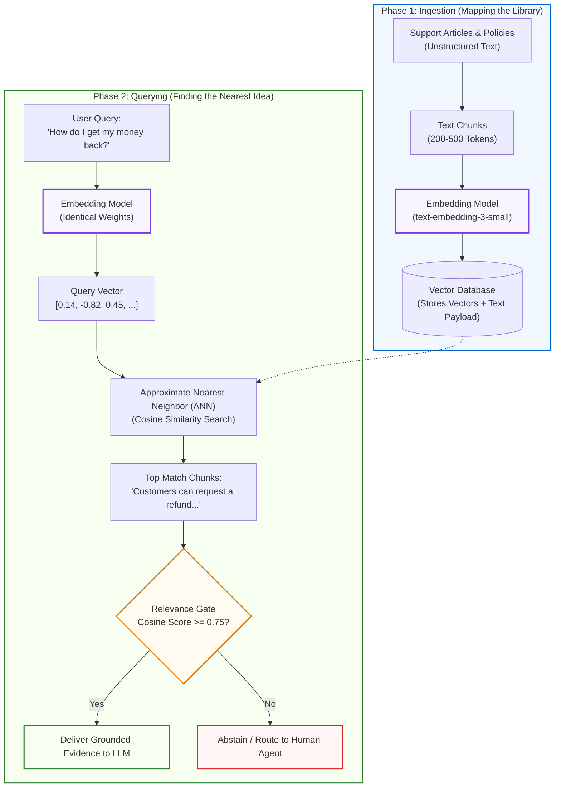

# Golden Lesson Example: Embeddings & Semantic Vector Proximity

> **Tier**: `🟢 Core` | **Estimated Read Time**: 15 min  
> **Core Concept**: Embeddings map high-dimensional text concepts into geometric coordinate vectors, allowing machines to search documents by semantic meaning rather than literal keyword matches.

---

## 🎯 What You Will Learn

By the end of this lesson, you will be able to:
- Diagnose why lexical matching fails on conceptual queries (*"money back"* vs. *"refund policy"*).
- Convert unstructured text into dense floating-point vectors and measure directional alignment using Cosine Similarity.
- Avoid the "Dense Vector Blindspot" where embedding models hallucinate matches on exact product IDs, serial numbers, or negated clauses.
- Architect a dual-coordinate search strategy that pairs dense semantic vectors with exact-word inverted indexes.

---

## 1. The Problem & The Real-World Intuition

### The Problem Scenario
Imagine a customer on your e-commerce support portal typing:
> *"How do I get my money back?"*

Your knowledge base contains this exact policy clause:
> *"Customers can request a refund within 30 days of purchase."*

If your system relies solely on traditional SQL `LIKE` queries or exact lexical keyword matching, this lookup returns **0 results**.
- The customer typed **"money back"**.
- The manual says **"refund"**.
- They share **zero common vocabulary**, yet express the exact same human intent.

### 🧒 The Mental Model (Explain Like I'm 10)
Imagine a massive library organized not by book title, but by a 3D **Idea Galaxy**:
* In one corner of the room, all books about **dogs, puppies, and golden retrievers** float right next to each other.
* Across the room, books about **bicycles and skateboards** float together.
* If you throw a paper airplane labeled *"cute little animals that bark"*, it naturally lands right inside the puppy cluster—even though you never wrote the word "dog"!

An **embedding model** is simply the GPS engine that calculates the exact `(X, Y, Z)` coordinates of any sentence and places it into this Idea Galaxy.

---

## 2. The Architectural Blueprint (Modern Visual Flowchart)



### Visual Architecture Walkthrough:
1. **Ingestion (Phase 1)**: Documentation is chunked and passed through the embedding model, transforming text strings into dense floating-point arrays stored in a vector index.
2. **Query Vectorization (Phase 2)**: The user query is transformed into a vector using the *exact same* embedding model and token weights.
3. **Spatial Proximity Search**: The vector database computes the cosine angle between the query vector and candidate document vectors.
4. **Relevance Gating**: A strict similarity threshold prevents irrelevant documents from being injected into the LLM context window.

---

## 3. Explaining Every Block (The Tripartite Pedagogy)

### Block 1: The Vector Transformation (Text to Coordinates)
* 🧒 **The Analogy**: Converting words into an address on a world map. "Paris" and "Eiffel Tower" are at almost the exact same GPS coordinates, even though their spellings are totally different.
* ⚙️ **The Engineering**: A neural transformer reads token sequence embeddings and outputs a dense 1D vector (e.g. 1536 dimensions for `text-embedding-3-small`). Each dimension captures latent statistical properties learned during training.
* ⚠️ **What happens if you skip this?**: Your application remains locked to literal string equality. Typos, synonyms, and multilingual queries fail completely.

### Block 2: Cosine Similarity (Measuring Angle, Not Length)
* 🧒 **The Analogy**: Two hikers standing at the base of a mountain pointing their flashlights. If their beams point in the exact same direction, their similarity is 1.0. If one points North and the other points East, their similarity is 0.0.
* ⚙️ **The Engineering**: Cosine similarity measures the inner product of two normalized vectors:
  ```text
  Similarity(A, B) = dot(A, B) / (norm(A) * norm(B))
  ```
  Normalized vectors allow SIMD-accelerated dot products with `O(D)` complexity.
* ⚠️ **What happens if you skip this?**: Using Euclidean distance (`L2`) on unnormalized vectors skews results toward longer chunks that contain more words rather than higher semantic alignment.

### Block 3: The Relevance Barrier Gate
* 🧒 **The Analogy**: A bouncer at the library door. If the student asks for an alien recipe and the closest book in the library is a Mexican cookbook with a 12% match, the bouncer says: *"We don't have that book,"* instead of handing them taco recipes!
* ⚙️ **The Engineering**: Enforcing a strict cutoff (e.g., `similarity >= 0.72`) before passing retrieved context into downstream prompt templates.
* ⚠️ **What happens if you skip this?**: When a user asks an unanswerable or out-of-domain question, the vector database returns the "least bad" 3 documents anyway. The LLM then hallucinates a bogus answer based on irrelevant snippets.

---

## 4. Evolution: Old/Naive vs. Modern Production

| Feature / Dimension | Naive Vector Prototype (2023) | Modern Production Architecture (2026) |
|---|---|---|
| **Search Engine** | Dense vector search only | **Hybrid Search**: Dense Vectors (Meanings) + BM25 (Exact Words) |
| **Rank Fusion** | Heuristic distance cutoff | **Reciprocal Rank Fusion (RRF)** (`k = 60`) |
| **Precision Filter** | None (returns raw top-k) | **Cross-Encoder Reranker** for token-to-token cross-attention |
| **Dimensionality** | Fixed 1536-dim vectors | **Matryoshka Representation Learning (MRL)** for dynamic 256/512-dim truncation |
| **Out-of-Domain Safety** | Blind LLM generation | **Relevance barrier gating** with explicit abstention |

---

## 5. Concrete Production Implementation (Runnable Python)

Here is a production-grade, type-annotated vector comparison service using **Pydantic v2** and pure Python vector math:

```python
import math
from pydantic import BaseModel, Field

class TextVector(BaseModel):
    id: str = Field(..., description="Unique document or chunk ID")
    text: str = Field(..., description="Original raw text payload")
    vector: list[float] = Field(..., description="Dense embedding vector")

class MatchResult(BaseModel):
    id: str
    text: str
    similarity: float = Field(..., ge=-1.0, le=1.0)

class VectorScorer:
    @staticmethod
    def cosine_similarity(v1: list[float], v2: list[float]) -> float:
        """Calculates cosine similarity between two dense vectors."""
        if len(v1) != len(v2):
            raise ValueError(f"Vector dimension mismatch: {len(v1)} vs {len(v2)}")
        
        dot_product = sum(a * b for a, b in zip(v1, v2))
        norm_v1 = math.sqrt(sum(a * a for a in v1))
        norm_v2 = math.sqrt(sum(b * b for b in v2))
        
        if norm_v1 == 0.0 or norm_v2 == 0.0:
            return 0.0
            
        return dot_product / (norm_v1 * norm_v2)

    def find_nearest(
        self, 
        query_vector: list[float], 
        candidates: list[TextVector], 
        min_threshold: float = 0.70
    ) -> list[MatchResult]:
        """Filters and ranks documents above the relevance barrier."""
        results = []
        for candidate in candidates:
            score = self.cosine_similarity(query_vector, candidate.vector)
            if score >= min_threshold:
                results.append(
                    MatchResult(id=candidate.id, text=candidate.text, similarity=round(score, 4))
                )
        return sorted(results, key=lambda x: x.similarity, reverse=True)
```

## 6. Decision-Oriented Trade-Off Matrix

When evaluating embedding models for production search and RAG systems, use this architectural decision matrix:

| Model Architecture | Latency (p95) | Memory / Storage Footprint | Precision / Recall | Best For | Production Failure Mode |
|---|---|---|---|---|---|
| **Small Dense (384–768 dim)** | Very Low (<10ms) | Low (~1.5–3KB/vector) | Medium | Mobile, local edge, high-throughput search | Lacks nuance on deep domain legal/medical jargon |
| **Large Dense (1536–3072 dim)** | Medium (~25–50ms) | High (~6–12KB/vector) | High | Enterprise RAG knowledge bases | Higher memory cost; still blind to exact IDs |
| **Matryoshka (MRL Dynamic)** | Low (~15ms) | Configurable (256–1024 dim) | High (>98% retention) | Massive-scale vector indexes | Requires MRL-trained model weights |
| **Cross-Encoder (Reranker)** | High (~100–250ms) | No vector storage (computed online) | Very High | Final top-25 reranking stage | Latency bottleneck if called on >50 candidates |

---

## 7. Common Failure Modes & Anti-Patterns

### Anti-Pattern 1: The Exact Identifier Blindspot
* **Symptom**: User searches for invoice `INV-2024-9981` or error code `0x80070002`. The vector search returns an invoice for a completely different client or a generic Windows article.
* **Root Cause**: BPE tokenizers split alphanumeric identifiers into arbitrary subword tokens (`INV`, `-`, `20`, `24`, `-`, `99`, `81`), scattering their latent meaning.
* **Production Fix**: Implement **Hybrid Search** with a sparse inverted index (BM25) and merge results with Reciprocal Rank Fusion (RRF).

### Anti-Pattern 2: Negation Amnesia
* **Symptom**: User searches *"credit cards with NO annual fee"*. The top retrieved document is *"Premium Platinum Card with $550 Annual Fee"*.
* **Root Cause**: Vector embeddings measure topical affinity, not logical Boolean operators. Both texts share intense semantic clustering around "credit card" and "annual fee".
* **Production Fix**: Pre-query intent classification or LLM query rewriting with hard metadata filters (`annual_fee == 0`).

---

## 8. OpenTelemetry Tracing & Telemetry View

In production, measure embedding generation latency and vector retrieval duration using standard GenAI semantic conventions:

```python
from opentelemetry import trace

tracer = trace.get_tracer("rag.retrieval")

def traced_retrieval(query: str, scorer: VectorScorer, index: list[TextVector]):
    with tracer.start_as_current_span("gen_ai.retrieval") as span:
        span.set_attribute("gen_ai.retrieval.query", query)
        span.set_attribute("gen_ai.retrieval.candidate_count", len(index))
        
        # 1. Measure embedding generation
        with tracer.start_as_current_span("gen_ai.embeddings.create") as embed_span:
            embed_span.set_attribute("gen_ai.request.model", "text-embedding-3-small")
            # query_vector = model.embed(query)
            query_vector = [0.12] * 1536  # Mock vector
            
        # 2. Measure vector nearest-neighbor search
        with tracer.start_as_current_span("vector_db.search") as search_span:
            search_span.set_attribute("db.system", "vector_index")
            matches = scorer.find_nearest(query_vector, index, min_threshold=0.70)
            search_span.set_attribute("db.vector.matches_found", len(matches))
            
        return matches
```

---

## 🧠 9. Quick Check to See if it Clicked

Test your architectural intuition:

> **Scenario**: A customer searches your corporate IT portal:
> *"Why is laptop docking station dock_v2 failing with firmware error 404?"*
> 
> 1. Why will a pure **Dense Vector Search** likely retrieve the wrong docking station manual?
> 2. Which companion index and merging strategy solves this in modern production RAG?

<details>
<summary><b>View Solution</b></summary>

1. **Why Vector Search Struggles**: Dense embeddings excel at broad conceptual intent (e.g. *"docking station not working"*), but compress exact alphanumeric part codes (`dock_v2`) and status codes (`404`) into fuzzy subword tokens. It is likely to return manuals for `dock_v1` or general USB errors because they are conceptually adjacent.
2. **The Production Fix**: A **Sparse BM25 Index** matches the exact tokens `"dock_v2"` and `"404"`. Pairing BM25 with Dense Vectors via **Reciprocal Rank Fusion (RRF)** ensures candidates that match both exact tokens and broad semantic intent rank at the absolute top.
</details>

---

## 💡 10. Senior Architectural Interview Perspective

**Interview Question**: *"We have 50 million documents. Calculating cosine similarity across all vectors at query time takes 4 seconds. How do you scale this retrieval system to sub-30ms p99 latency without losing significant recall?"*

**Architectural Defense**:
1. **Approximate Nearest Neighbor (ANN) Graphs**: Replace brute-force linear scan with an **HNSW (Hierarchical Navigable Small World)** graph or **DiskANN**, trading <1% recall for logarithmic `O(log N)` search time.
2. **Quantization & Matryoshka Representation Learning (MRL)**: Compress vectors from 32-bit floats to 8-bit integers (`int8` scalar quantization) or binary vectors, reducing RAM bandwidth bottlenecks by 4x to 32x.
3. **Two-Stage Retrieval**: Perform fast ANN search over the top 1,000 candidates on SSD with DiskANN, followed by in-memory reranking of the top 50 with a cross-encoder.

---

## 11. Key Takeaways & Verified Resources

* **Vectors Represent Coordinates in Meaning**: Embeddings enable fuzzy semantic similarity where traditional keyword matching returns zero results.
* **The Dual-Catalog Rule**: Never use dense vectors alone for enterprise systems. Always pair them with sparse lexical inverted indexes (BM25) to catch exact IDs.
* **The Relevance Gate**: Enforce similarity thresholds to abstain when queries fall outside the knowledge corpus, preventing downstream hallucinations.

### Verified Primary Sources
* **MRL Paper**: Kusupati et al., *"Matryoshka Representation Learning"*, NeurIPS (arXiv:2205.13147).
* **Anthropic Research**: *"Contextual Retrieval in Enterprise Search"* (2024).
* **HNSW Paper**: Malkov & Yashunin, *"Efficient and robust approximate nearest neighbor search using Hierarchical Navigable Small World graphs"* (IEEE TPAMI).

---

## 🧭 Navigation
- **[← Previous Lesson: Foundations Hub](../00-foundations-and-token-mechanics/README.md)**
- **[Phase 02: Enterprise Retrieval Hub](../02-rag-and-knowledge-systems/README.md)**
- **[Next Lesson: Document Parsing & Structural Chunking](../02-rag-and-knowledge-systems/01-document-parsing-and-chunking.md) →**
- **[Capstone Lab: Enterprise Multi-Tenant Hybrid RAG](../02-rag-and-knowledge-systems/labs/capstone-enterprise-rag-pipeline.md)**
