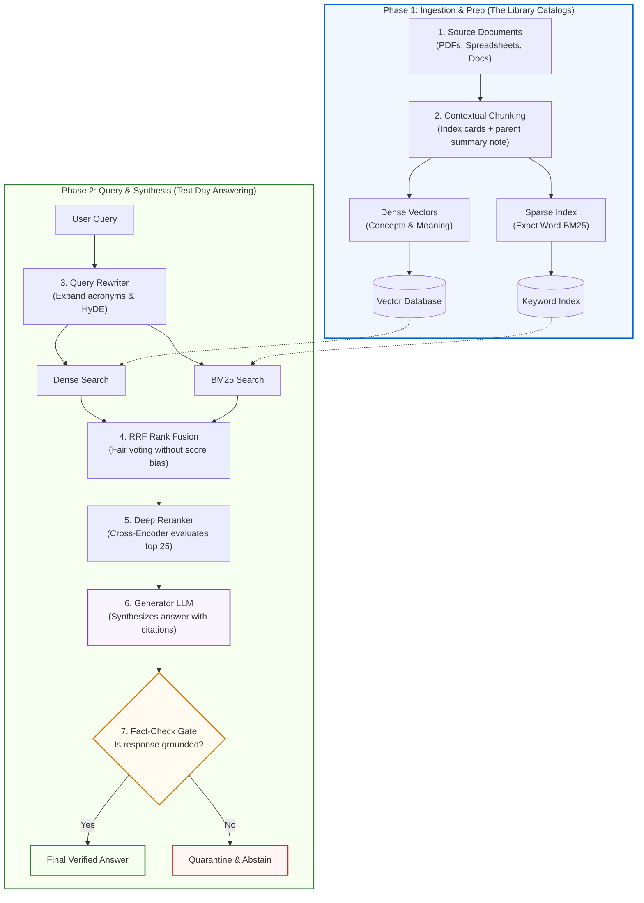
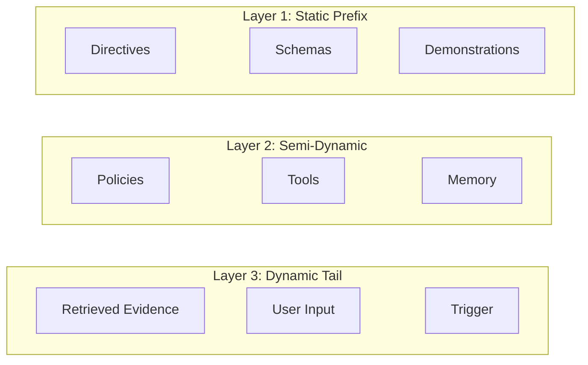
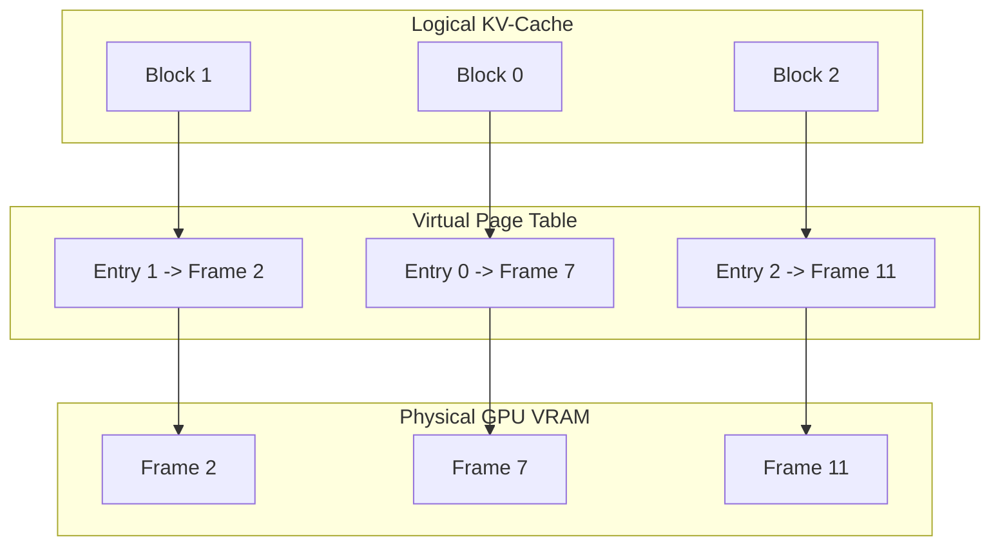

# Diagram Architecture & Mermaid Standards

This document establishes the design, syntax, and explanation rules for diagrams across the curriculum.

---

## 1. The Core Diagram Rule

> **Never place a diagram in a lesson without an accompanying step-by-step prose explanation.**

A diagram is a visual anchor, not a replacement for clear instruction. If a reader cannot follow the flow of data or understand what occurs at each boundary, the diagram has failed.

---

## 2. Supported Diagram Types & Visual Topologies

Use native Mermaid syntax within standard markdown code blocks, complemented by markdown tables and ASCII charts:

| Intent | Diagram / Visual Type | Best Practices |
|---|---|---|
| **Data Ingestion & Pipelines** | `flowchart TD` or `flowchart LR` | Clear phase separation; distinct colors for ingestion vs. querying. |
| **Multi-Stage Decision Trees** | `flowchart TD` | Top-down decision branches; clearly labeled condition edges (`-- "Yes" -->`, `-- "No" -->`). |
| **Tool Calling & Wire Protocols** | `sequenceDiagram` | Show client, gateway, agent runtime, and MCP server actors with request/response payloads. |
| **Agent State Lifecycles** | `stateDiagram-v2` | State transitions (`Idle` → `Planning` → `ToolExecution` → `Quarantine`). |
| **Latency/Throughput Curves** | `xychart-beta` or ASCII bar | Show empirical trade-offs (e.g. KV Cache batch size vs. TTFT latency). |
| **Architectural Trade-Offs** | GFM Comparison Tables | Side-by-side matrices contrasting Naive vs. Modern production approaches. |

---

## 3. Modern Color & UI Styling System

To make diagrams clean, professional, and visually engaging, always apply semantic color coding to subgraphs and key nodes:

### Semantic UI Palette

```text
┌────────────────────────────────────────────────────────────────────────┐
│ Ingestion / Prep Tier (Blue)      : fill:#f0f7ff, stroke:#0066cc, 2px  │
│ Query / Execution Tier (Green)    : fill:#f6fff0, stroke:#2e7d32, 2px  │
│ Decision / Rerank Gate (Amber)    : fill:#fffbf0, stroke:#d97706, 2px  │
│ Guardrail / Quarantine / Dropped  : fill:#fff5f5, stroke:#dc2626, 2px  │
│ Foundation Model / Synthesis Core : fill:#f8f5ff, stroke:#7c3aed, 2px  │
│ Highlight / Winning Candidate     : fill:#fef3c7, stroke:#b45309, 2px  │
└────────────────────────────────────────────────────────────────────────┘
```

### Modern Flowchart Example with Semantic Styling



---

## 4. Structural Rules & Clean Typography

1. **Node Limit**: Keep diagrams under 10–14 nodes. If a system is more complex, break it into a macro-architecture blueprint followed by focused component diagrams.
2. **Subgraphs**: Use `subgraph` blocks to indicate logical phases (e.g. *Phase 1: Ingestion*, *Phase 2: Querying*) or infrastructure boundaries (*Client Tier*, *Agent Runtime*, *MCP Tool Sandbox*).
3. **Typography & Labeling**:
   - Always enclose labels in double quotes: `node["**Step Title**<br>(Helpful 1-line detail)"]`.
   - Use `<br>` inside quoted labels for clean vertical hierarchy (Bold title on line 1, short description on line 2). Avoid raw unquoted tags or complex HTML attributes (`style=...`).
4. **Node Shapes**:
   - Cylinders for storage and databases: `VDB[("Vector Database")]`
   - Diamonds for decision gates and guardrails: `Gate{"Score >= 0.70?"}`
   - Dotted arrows for asynchronous or read lookups: `VDB -.-> SearchNode`
   - Solid arrows for sequential data pipelines: `NodeA --> NodeB`
5. **Accompanying Visuals**:
   - Pair complex flowcharts with **"Old vs Modern" Evolution Tables** or **ASCII memory maps** (e.g. showing KV-cache block allocation or PagedAttention frame tables).

---

## 5. Required Prose Walkthrough Pattern

Immediately following any diagram, provide a structured, numbered walkthrough explaining the flow of data:

```markdown
### Visual Architecture Walkthrough:
1. **Source Ingestion (Phase 1)**: Documents are pre-processed and enriched with contextual summaries before being dual-indexed into dense vector and sparse keyword stores.
2. **Parallel Retrieval (Phase 2)**: The rewritten user query dispatches simultaneous searches across lexical and semantic indexes.
3. **Rank Harmonization**: The two candidate lists are merged via Reciprocal Rank Fusion (RRF) to eliminate score distribution biases.
4. **Cross-Attention Reranking**: High-scoring candidates are inspected token-by-token by a cross-encoder model to filter out irrelevant false positives.
5. **Grounded Synthesis & Verification**: The LLM generates citations directly from retrieved snippets, subject to an automated fact-checking gate before delivery.
```

---

## 6. Subgraph Layout Stability & Preventing the Diagonal "Staircase" Defect

### The Dagre Layout Engine Mechanics
Mermaid relies on the Dagre directed graph layout engine. When a diagram defines multiple `subgraph` blocks (e.g., sequential execution phases, comparative "Cold vs. Warm" flows, or layered systems architectures), Dagre balances edge length minimization and rank ordering.

Without explicit layout constraints, Dagre triggers two common layout failures:
1. **Unpredictable Horizontal Blowout**: When subgraphs are completely disconnected, Dagre places them side-by-side along the X-axis, stretching diagrams across wide viewports and breaking readability on mobile or standard monitors.
2. **The Diagonal "Staircase" Defect ("Cascading Cluster Skew")**:
   When subgraphs are connected sequentially or with unconstrained links, they frequently render staggered diagonally down and to the right:
   ```text
   [ First Subgraph ]
         └───► [ Second Subgraph ]
                     └───► [ Third Subgraph ]
   ```
   **Is this intentional?**
   **No. This is an engine layout defect, NOT intentional design.** In professional technical architecture, multi-stage subgraphs must render flush, stacked vertically (top-to-bottom) or aligned in a clean grid. The diagonal staircase breaks visual hierarchy, produces ugly whitespace, and forces horizontal scrolling.

---

### Root Causes of the Diagonal Staircase

1. **Anti-Pattern 1: Subgraph ID Chaining (`subgraphA --> subgraphB --> subgraphC`)**
   - Subgraphs in Mermaid are syntactic clustering scopes (namespaces), not true graph vertices.
   - Drawing an edge directly between subgraph identifiers causes Dagre to anchor the edge to the bounding box perimeters. The default exit anchor attaches to the bottom-right corner of the parent cluster, and the entry anchor attaches to the top-left corner of the child cluster.
   - Chaining three clusters (`A --> B --> C`) compounds this horizontal displacement at each stage, sliding each successive subgraph further to the right.

2. **Anti-Pattern 2: Asymmetric Cross-Subgraph Links (`RightNode ~~~ LeftNode`)**
   - If an invisible rank link (`~~~`) connects an outer node on the right flank of Subgraph 1 to an outer node on the left flank of Subgraph 2:
     ```mermaid
     subgraph S1
       L1  M1  R1
     end
     subgraph S2
       L2  M2  R2
     end
     R1 ~~~ L2  %% ❌ Anti-pattern: Displaces S2 entirely to the right of S1
     ```
   - Dagre forces `L2` directly underneath `R1`. Because `L2` is the leftmost element of `S2`, the entire bounding box of `S2` shifts rightward by the width of `S1`.
   - Repeating this between Subgraphs 2 and 3 compounds the translation, creating the cascading staircase.

---

### The Three Golden Rules to Guarantee Flush Vertical Alignment

#### Rule 1: Symmetrical Column Pinning (For Multi-Column Subgraphs)
When subgraphs contain multiple parallel columns or horizontal nodes (e.g., 3-layer architectures where each layer has 2–3 cards), **pin every corresponding column symmetrically** using invisible links (`~~~`):


*Why this works*: By anchoring the left, center, and right columns simultaneously, Dagre cannot slide `Layer2` or `Layer3` horizontally. They are locked flush directly beneath each other.

#### Rule 2: Explicit Semantic Data Wiring (Ban Cluster-to-Cluster Arrows)
Never connect cluster names (`Logical --> PageTable --> Physical`). Instead, connect the actual internal nodes representing the data pipeline:



#### Rule 3: Centerline / Median Pinning (For Single-Column Subgraphs)
When comparing single-column linear subgraphs (e.g., "Cold Cache Request" vs. "Warm Cache Request"), connect only the **median/centerline terminal node** to the **median/centerline initial node**:

```mermaid
flowchart TD
    subgraph ColdRequest["Cold Cache Request (Miss)"]
        P1["Input Prompt<br>(10,000 Tokens)"] --> GPU1["GPU Tensor Cores<br>(Execute Full Attention)"]
        GPU1 --> VRAM1["Write KV Tensors to HBM<br>(Latency: ~1,800ms)"]
        VRAM1 --> Out1["First Output Token Emitted"]
    end

    subgraph WarmRequest["Subsequent Request (Warm Hit)"]
        P2["Input Prompt<br>(Identical 10,000 Prefix)"] --> Match["Prefix Hash Check<br>(Hit at Token 10,000)"]
        Match --> Bypass["Bypass Matrix Math<br>(Read Tensors from HBM)"]
        Bypass --> Out2["First Output Token Emitted<br>(Latency: ~180ms)"]
    end

    Out1 ~~~ P2  %% Connect center exit to center entry
```

---

### Layout & Styling Verification Checklist
Before approving any Mermaid diagram containing two or more subgraphs:
- [ ] **No Subgraph ID Edges**: Are all edges drawn between concrete internal nodes, never cluster IDs?
- [ ] **Symmetric Column Pinning**: In multi-column subgraphs, are all parallel columns symmetrically pinned (`Col1 ~~~ Col1`, `Col2 ~~~ Col2`)?
- [ ] **Flush Vertical Stack**: In `flowchart TD`, do the subgraphs stack flush vertically without cascading diagonally into a staircase?
- [ ] **Modern Color & UI Styling**: Are subgraphs styled using the semantic color palette (Blue for Ingestion/Prep, Green for Query/Runtime, Amber for Decision/Rerank, Rose for Quarantine/Abstain, Purple for LLM/Model)?
- [ ] **Clean Typography**: Are labels enclosed in quotes with bold titles and subtitles separated by `<br>`?
- [ ] **Walkthrough Mandatory**: Does the diagram include a complete step-by-step prose walkthrough directly beneath it?
- [ ] **Multi-Format Visuals**: Are complex systems complemented with comparison tables, evolution summaries, or ASCII/xy charts where helpful?


