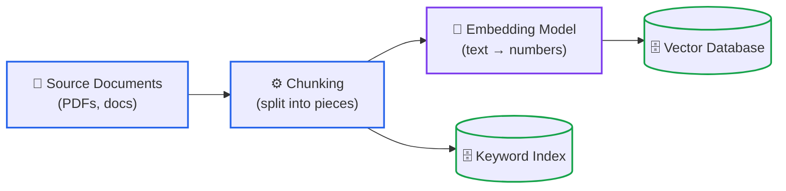
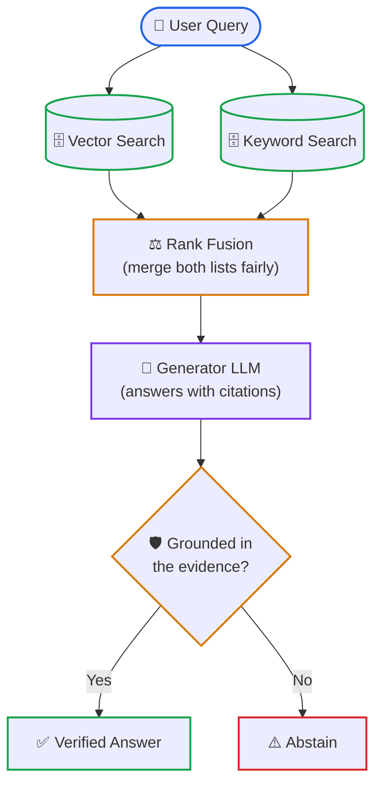
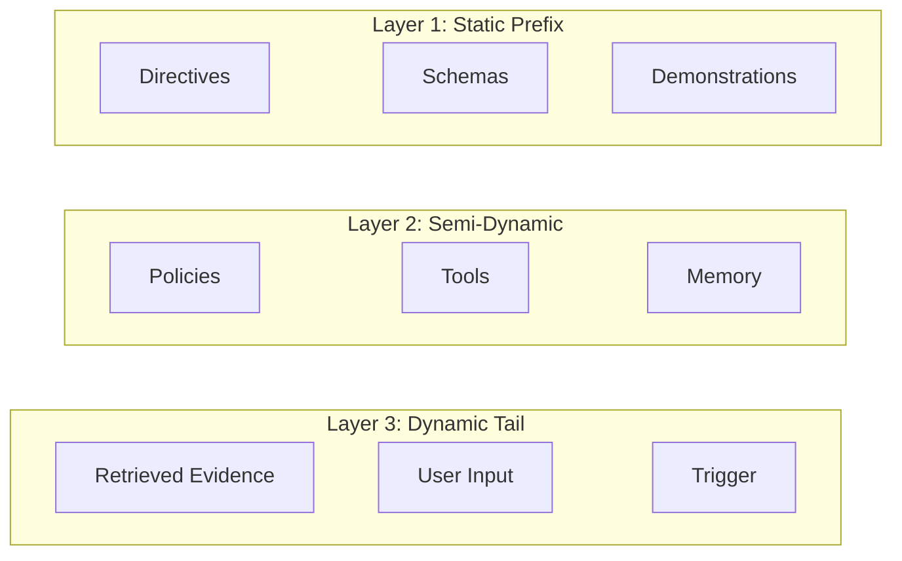
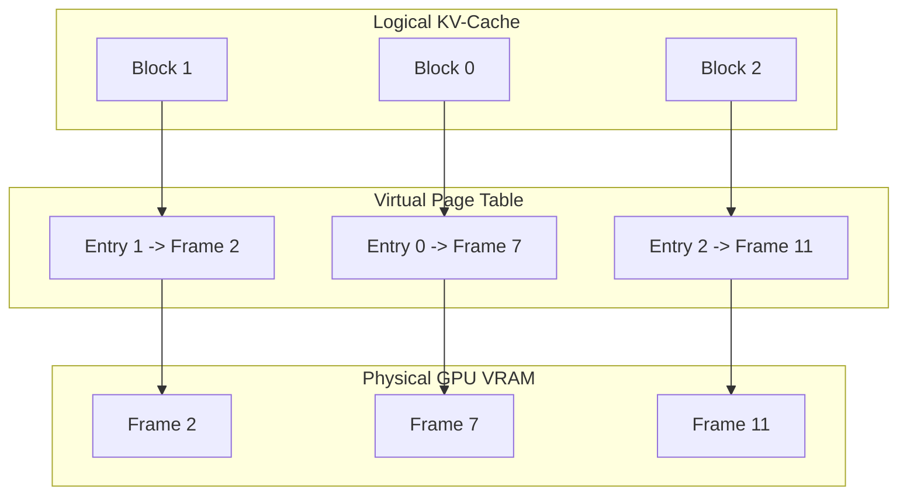

# Diagram Architecture & Mermaid Standards

This document establishes the design, syntax, and explanation rules for diagrams across the curriculum.

---

## 1. The Core Diagram Rule

> **Never place a diagram in a lesson without an accompanying step-by-step prose explanation.**

A diagram is a visual anchor, not a replacement for clear instruction. If a reader cannot follow the flow of data or understand what occurs at each boundary, the diagram has failed.

---

## 2. Supported Diagram Types & Visual Topologies

Use native Mermaid syntax within standard markdown code blocks, complemented by markdown tables and ASCII charts:

| Intent | Diagram / Visual Type | Best Practices |
|---|---|---|
| **Data Ingestion & Pipelines** | `flowchart TD` or `flowchart LR` | Clear phase separation; distinct colors for ingestion vs. querying. |
| **Multi-Stage Decision Trees** | `flowchart TD` | Top-down decision branches; clearly labeled condition edges (`-- "Yes" -->`, `-- "No" -->`). |
| **Tool Calling & Wire Protocols** | `sequenceDiagram` | Show client, gateway, agent runtime, and MCP server actors with request/response payloads. |
| **Agent State Lifecycles** | `stateDiagram-v2` | State transitions (`Idle` → `Planning` → `ToolExecution` → `Quarantine`). |
| **Latency/Throughput Curves** | `xychart-beta` or ASCII bar | Show empirical trade-offs (e.g. KV Cache batch size vs. TTFT latency). |
| **Architectural Trade-Offs** | GFM Comparison Tables | Side-by-side matrices contrasting Naive vs. Modern production approaches. |

---

## 3. Theme-Adaptive Light & Dark Mode Contrast Standard

A critical requirement for all technical documentation diagrams is **universal readability across both Light Mode and Dark Mode** (GitHub, VS Code, and browser readers).

### The Dark Mode Failure Mechanism
When you hardcode light pastel fills (e.g. `fill:#f0f7ff`, `fill:#ffffff`, `fill:#f6fff0`) on nodes or subgraphs:
1. **The Inverted Text Trap**: In dark mode, Mermaid automatically renders node text in white or light gray (`#c9d1d9`). When placed over a hardcoded white or pastel fill, **the text becomes completely invisible** (contrast ratio < 1.2:1).
2. **The "Flashbang" Glare**: Giant opaque light boxes clash violently against dark reader backgrounds, looking visually broken and jarring.
3. **The Light Mode Washout**: Setting `fill:#ffffff` on a white page makes cards look border-only and flat, losing component hierarchy.

---

### The Universal Dual-Mode Styling Rules

1. **Subgraphs: Always Transparent (`fill:none`)**:
   - Never apply opaque background fills to subgraphs.
   - Use `fill:none` with a 2px colored or slate stroke:
     ```mermaid
     style SUBGRAPH_ID fill:none,stroke:#2563eb,stroke-width:2px
     ```
   - This ensures the subgraph background stays transparent, cleanly inheriting the reader's background theme in both light and dark modes while framing internal nodes.

2. **Nodes: Stroke-Based Semantic Accenting (Do Not Override `fill`)**:
   - Let Mermaid's native theme engine manage node background cards and text colors. In light mode it generates light cards with dark text; in dark mode it generates dark slate cards with light text.
   - Apply semantic meaning using **vibrant, high-contrast borders (`stroke`) and 2px border width**:
     ```mermaid
     style NODE_ID stroke:#2563eb,stroke-width:2px
     ```

3. **High-Contrast Dual-Mode Color Palette**:
   Every color in this palette is specifically calibrated to provide >= 3.5:1 contrast against both pure white (`#ffffff`) and dark slate (`#0d1117`):

| Semantic Role | Border Stroke Hex | Recommended Line Width | Usage |
|:---|:---|:---|:---|
| **Primary / Ingestion / Data Pipeline** | `stroke:#2563eb` (Blue) | `2px` | Source documents, chunking, queues, inputs |
| **Success / Runtime / Verified Output** | `stroke:#16a34a` (Green) | `2px` | Passed gates, final outputs, durable commits |
| **Decision Gate / Rerank / Warning** | `stroke:#d97706` (Amber) | `2px` | Evaluation diamonds, RRF ranking, thresholds |
| **Quarantine / Error / Hazard / Fallback** | `stroke:#dc2626` (Red) | `2px` | Blocked payloads, rate limits (429), alerts |
| **LLM / Reasoning Engine / Synthesis Core** | `stroke:#7c3aed` (Purple) | `2px` | Foundation models, thinking loops, transformers |
| **Container / System Boundary / Framework** | `stroke:#64748b` (Slate) | `2px` | Subgraphs, external tiers, hardware boundaries |

4. **Explicit Pairing Rule (If Fills Are Used)**:
   - If an edge case requires a custom fill (e.g., a solid callout badge), **you MUST explicitly specify the text color (`color:#...`)** alongside the fill. Never specify `fill` without `color`.

---

### Clean Theme-Adaptive Flowchart Examples (Split Into Two Diagrams)

A retrieval system has two phases, so it gets two small diagrams instead of one large one.

**Diagram 1: Ingestion (5 nodes)**



**Diagram 2: Query and answer (8 nodes)**



Each diagram gets its own heading and its own numbered walkthrough. Neither needs subgraph wrappers, because the heading already names the phase.

---

## 4. Structural Rules: Low Node Budget & Modular Splitting

1. **Low Node Budget (Simplicity & Readability First)**:
   - **Target 4 to 8 nodes per diagram (strict ceiling of 10 nodes)**. Count every node, including nodes inside subgraphs, storage cylinders and decision diamonds.
   - **Sequence diagrams**: at most 5 participants and 12 messages. **State diagrams**: at most 8 states.
   - Do not copy any example in this repository that exceeds the ceiling. If you find one, split it and record it in the report.
   - A diagram with 15–20 nodes is visually overwhelming, unreadable on mobile screens, and prone to routing spaghetti.
   - Prioritize high-signal, clean visualizations over trying to cram an entire system into a single chart.

2. **Modular Splitting Rule**:
   - If an architecture, pipeline, or lifecycle has more than 8–10 steps or multiple distinct phases, **do NOT create a single massive diagram**.
   - **Split into separate, sequential, or modular diagrams**:
     - *Diagram 1: Macro Architecture / Overview Flow (4–6 nodes)*
     - *Diagram 2: Component Deep-Dive / Detailed Mechanism (4–6 nodes)*
     - *Diagram 3: Error / Backtracking / Edge Case Flow (3–5 nodes)*
   - Each diagram must have its own dedicated heading, focused purpose, and direct step-by-step prose walkthrough.

3. **Subgraphs**: Use lightweight `subgraph` blocks to group 2–4 related nodes indicating logical boundaries (*Client Tier*, *Agent Runtime*, *Ingestion*, *Synthesis*). Avoid nesting subgraphs more than 1 level deep.

4. **Typography & Labeling**:
   - Always enclose labels in double quotes: `node["**Step Title**<br>(Helpful 1-line detail)"]`.
   - Use `<br>` inside quoted labels for clean vertical hierarchy (Bold title on line 1, short description on line 2). Avoid raw unquoted tags or complex HTML attributes.

5. **Mermaid + Unicode Structural Iconography Standard**:
   - Use native Mermaid structural node shapes paired with universal Unicode/emoji icons.
   - **Why Unicode emojis over FontAwesome (`fa:fa-...`)**:
     - GitHub's native viewer blocks external FontAwesome CDN stylesheets via its Content Security Policy (CSP), rendering raw text strings (`fa:fa-database`) or broken glyph boxes.
     - Unicode emojis (`🗄️`, `🔌`, `⚡`, `🧠`, `🛡️`, `👤`) are native system glyphs on Windows, macOS, Linux, iOS, and Android. They render 100% reliably offline, in VS Code, and across Light and Dark themes with zero external dependencies.
   - **Standard Component Icon & Shape Palette**:
     | Component Type | Node Shape Syntax | Icon + Label Pattern | Semantic Border Stroke |
     |---|---|---|---|
     | **Database / Storage** | `[("...")]` (Cylinder) | `DB[("🗄️ Database / Vector Store")]` | `stroke:#16a34a` (Green) |
     | **API / Ingress / Gateway** | `["..."]` (Rectangle) | `GW["🔌 API Gateway / ALB"]` | `stroke:#2563eb` (Blue) |
     | **MCP Server / Tool Service** | `["..."]` (Rectangle) | `MCP["⚡ MCP Server / Microservice"]` | `stroke:#2563eb` (Blue) |
     | **Foundation Model / LLM** | `["..."]` (Rectangle) | `LLM["🧠 Foundation Model / Generator"]` | `stroke:#7c3aed` (Purple) |
     | **Security Guard / Eval Gate**| `{"..."}` (Diamond) | `SEC{"🛡️ AST Guard / Decision Gate"}` | `stroke:#d97706` (Amber) |
     | **Human Operator / User** | `(["..."])` (Stadium) | `User(["👤 Human Operator / Client"])` | `stroke:#64748b` (Slate) |
     | **Resource / Document Schema**| `["..."]` (Rectangle) | `RES["📄 schema://resource/uri"]` | `stroke:#16a34a` (Green) |
     | **Local Subprocess / Pipe** | `(["..."])` (Stadium) | `PIPE(["💻 OS Pipe (stdio)"])` | `stroke:#64748b` (Slate) |
     | **Alert / Quarantine / Error** | `["..."]` (Rectangle) | `ERR["⚠️ Quarantine / Rate Limit"]` | `stroke:#dc2626` (Red) |
    - **Edge Connectors**:
      - Dotted arrows for asynchronous lookups, token exchanges, or read-only references: `VDB -.-> SearchNode`
      - Solid arrows for sequential execution pipelines: `NodeA --> NodeB`
      - Double-stem arrows for bidirectional framed local channels: `Client <==> Pipe` (restricted to local, intra-subgraph duplex pipes; never stretched across multiple subgraphs)

6. **Accompanying Visuals**:
   - Pair complex flowcharts with **"Old vs Modern" Evolution Tables** or **ASCII memory maps** (e.g. showing KV-cache block allocation or PagedAttention frame tables).

---

## 5. Required Prose Walkthrough Pattern

Immediately following any diagram, provide a structured, numbered walkthrough explaining the flow of data:

```markdown
### Visual Architecture Walkthrough:
1. **Source Ingestion (Phase 1)**: Documents are pre-processed and enriched with contextual summaries before being dual-indexed into dense vector and sparse keyword stores.
2. **Parallel Retrieval (Phase 2)**: The rewritten user query dispatches simultaneous searches across lexical and semantic indexes.
3. **Rank Harmonization**: The two candidate lists are merged via Reciprocal Rank Fusion (RRF) to eliminate score distribution biases.
4. **Cross-Attention Reranking**: High-scoring candidates are inspected token-by-token by a cross-encoder model to filter out irrelevant false positives.
5. **Grounded Synthesis & Verification**: The LLM generates citations directly from retrieved snippets, subject to an automated fact-checking gate before delivery.
```

---

## 6. Layout Stability, Anti-Bloat & Edge Cleanliness

### The Dagre Layout Engine Mechanics
Mermaid relies on the Dagre directed graph layout engine. When a diagram defines multiple `subgraph` blocks (e.g., execution phases, comparative flows, or layered architectures), Dagre balances edge length minimization and rank ordering.

Without explicit layout constraints, Dagre triggers three major layout defects:
1. **Unpredictable Horizontal Blowout**: Disconnected subgraphs render side-by-side along the X-axis, stretching across wide viewports and breaking readability.
2. **The Diagonal "Staircase" Defect**: Sequential subgraphs render staggered diagonally down and to the right.
3. **Spaghetti Edge Collisions**: Multiple cross-subgraph edges in horizontal graphs (`flowchart LR`) criss-cross intervening nodes and clusters in sweeping curves.

---

### Anti-Bloat & Clean Edge Routing Standards

1. **Ban Spaghetti Routing**:
   - Never run multiple cross-cutting edges horizontally across 3 or more subgraphs (`flowchart LR`). Dagre stretches clusters and routes curved lines across neighboring nodes, producing visual chaos.
   - *Fix*: Switch to top-down (`flowchart TD`) so layers stack naturally, or split the multi-subgraph pipeline into two separate focused diagrams (e.g., Ingestion vs. Query).

2. **Ban Single-Node Subgraph Wrappers**:
   - Never wrap an isolated single node inside a `subgraph ... end` block. Subgraphs group 2–4 related nodes under a logical boundary. Wrapping a single node creates redundant double borders, wastes horizontal canvas, and adds zero architectural information.
   - *Fix*: If a component is singular (e.g., `LLM`, `User`), place it directly in the root graph with its semantic border and Unicode icon.

3. **Ban Backwards Loops Across Subgraphs**:
   - Never route return edges from downstream subgraphs back into upstream subgraphs (e.g., from an evaluation gate in Subgraph C back into a planner in Subgraph A). Dagre routes backwards edges around the diagram perimeter in massive, overlapping sweeping loops that intersect other edges and nodes.
   - *Fix*: Model cyclic feedback or multi-turn interactions using a `sequenceDiagram`, or unroll into an acyclic forward progression (`Draft` → `Eval` → `Revise` → `Final`).

4. **Ban Cross-Cluster Bidirectional Thick Rails (`<-->`, `<==>`)**:
   - Avoid double-headed or thick rail connectors across cluster boundaries. They overpower the visual hierarchy and obscure data directionality.
   - *Fix*: Use clean single-directed arrows (`-->`) with concise, active edge labels. Reserve `<==>` strictly for local, intra-subgraph duplex channels (such as an OS stdio pipe).

5. **Ban Arbitrary Invisible Link Hacks**:
   - Do not use invisible links (`~~~`) as positioning bandaids to arbitrarily shove nodes around.
   - *Rule*: Use `~~~` strictly for mathematically symmetric column pinning across multi-column layers, or for median centerline entry/exit alignment.

---

### Root Causes of the Diagonal Staircase & How to Prevent Them

1. **Anti-Pattern 1: Subgraph ID Chaining (`subgraphA --> subgraphB --> subgraphC`)**
   - Subgraphs are syntactic clustering scopes (namespaces), not true graph vertices.
   - Drawing an edge directly between subgraph identifiers causes Dagre to anchor to cluster bounding box corners (bottom-right of parent to top-left of child), compounding horizontal displacement at each stage.
   - *Fix*: Draw edges strictly between concrete internal nodes.

2. **Anti-Pattern 2: Asymmetric Cross-Subgraph Links (`RightNode ~~~ LeftNode`)**
   - Connecting an outer node on the right flank of Subgraph 1 to an outer node on the left flank of Subgraph 2 forces the child subgraph entirely to the right of the parent.
   - *Fix*: Pin all columns symmetrically (`Col1 ~~~ Col1`, `Col2 ~~~ Col2`).

---

### The Three Golden Rules for Flush Vertical Alignment

#### Rule 1: Symmetrical Column Pinning (For Multi-Column Subgraphs)
When subgraphs contain multiple parallel columns or horizontal nodes (e.g., 3-layer architectures where each layer has 2–3 cards), **pin every corresponding column symmetrically** using invisible links (`~~~`):



#### Rule 2: Explicit Semantic Data Wiring (Ban Cluster-to-Cluster Arrows)
Never connect cluster names (`Logical --> PageTable --> Physical`). Instead, connect the actual internal nodes representing the data pipeline:



#### Rule 3: Centerline / Median Pinning (For Single-Column Subgraphs)
When comparing single-column linear subgraphs (e.g., "Cold Cache Request" vs. "Warm Cache Request"), connect only the **median/centerline terminal node** to the **median/centerline initial node**:

```mermaid
flowchart TD
    subgraph ColdRequest["Cold Cache Request (Miss)"]
        P1["Input Prompt<br>(10,000 Tokens)"] --> GPU1["GPU Tensor Cores<br>(Execute Full Attention)"]
        GPU1 --> VRAM1["Write KV Tensors to HBM<br>(Latency: ~1,800ms)"]
        VRAM1 --> Out1["First Output Token Emitted"]
    end

    subgraph WarmRequest["Subsequent Request (Warm Hit)"]
        P2["Input Prompt<br>(Identical 10,000 Prefix)"] --> Match["Prefix Hash Check<br>(Hit at Token 10,000)"]
        Match --> Bypass["Bypass Matrix Math<br>(Read Tensors from HBM)"]
        Bypass --> Out2["First Output Token Emitted<br>(Latency: ~180ms)"]
    end

    Out1 ~~~ P2  %% Connect center exit to center entry
```

---

### Layout & Styling Verification Checklist
Before approving any Mermaid diagram containing two or more subgraphs:
- [ ] **No Spaghetti Lines**: Are cross-subgraph links minimal, clean, and non-overlapping?
- [ ] **No Single-Node Wrappers**: Does every subgraph contain 2 or more related nodes?
- [ ] **No Backwards Cross-Cluster Loops**: Are feedback loops modeled as sequence diagrams or unrolled forward pipelines?
- [ ] **No Subgraph ID Edges**: Are all edges drawn between concrete internal nodes, never cluster IDs?
- [ ] **Symmetric Column Pinning**: In multi-column subgraphs, are all parallel columns symmetrically pinned (`Col1 ~~~ Col1`, `Col2 ~~~ Col2`)?
- [ ] **Theme-Adaptive Contrast (Light & Dark Mode)**: Are subgraphs transparent (`fill:none`)? Are node backgrounds un-overridden with semantic border strokes (`stroke:#2563eb`, `stroke:#16a34a`, `stroke:#d97706`, `stroke:#dc2626`, `stroke:#7c3aed`) so text remains 100% readable in both Light and Dark modes?
- [ ] **Clean Typography & Icons**: Are labels enclosed in quotes with bold titles, subtitles separated by `<br>`, and native structural shapes with Unicode icons?
- [ ] **Walkthrough Mandatory**: Does the diagram include a complete step-by-step prose walkthrough directly beneath it?
- [ ] **Budget Compliance**: Is the diagram within 4–8 nodes (ceiling 10), and sequence participants <= 5?


