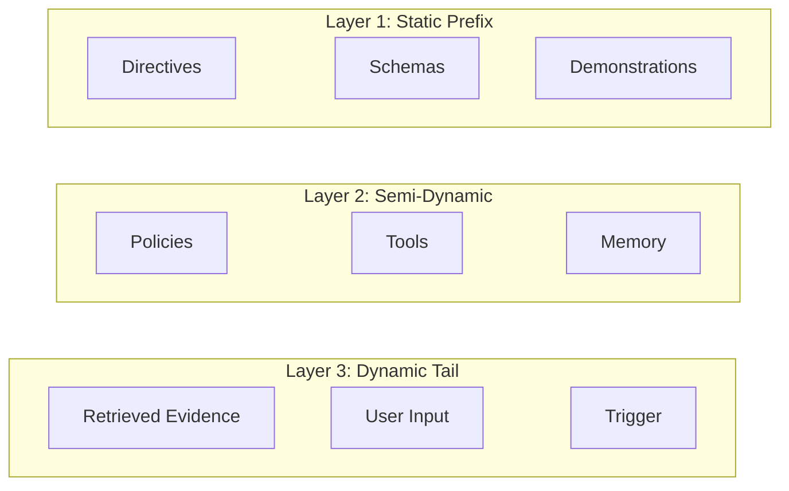
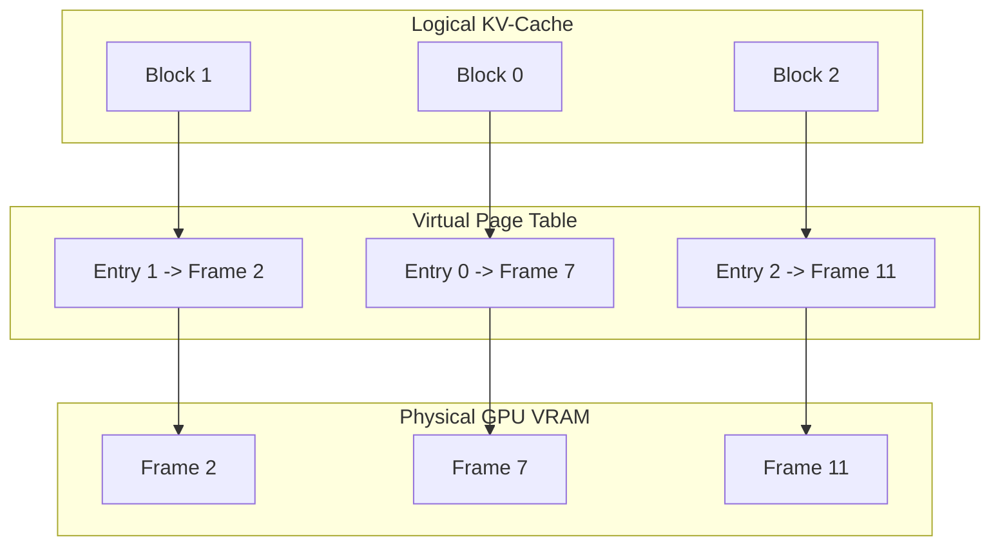

# Diagram Architecture & Mermaid Standards

This document establishes the design, syntax, and explanation rules for diagrams across the curriculum.

---

## 1. The Core Diagram Rule

> **Never place a diagram in a lesson without an accompanying step-by-step prose explanation.**

A diagram is a visual anchor, not a replacement for clear instruction. If a reader cannot follow the flow of data or understand what occurs at each boundary, the diagram has failed.

---

## 2. Supported Diagram Types & Topologies

Use native Mermaid syntax within standard markdown code blocks:

| Intent | Diagram Type | Best Practices |
|---|---|---|
| **Data Ingestion & Pipelines** | `flowchart LR` | Left-to-right flow; clean separation between stages. |
| **Multi-Stage Decision Trees** | `flowchart TD` | Top-down decision branches; clearly labeled condition edges. |
| **Tool Calling & Wire Protocols** | `sequenceDiagram` | Show client, gateway, agent runtime, and MCP server actors with request/response payloads. |
| **Agent State Lifecycles** | `stateDiagram-v2` | State transitions (`Idle` → `Planning` → `ToolExecution` → `Quarantine`). |

---

## 3. Structural Rules & Clean Layouts

1. **Node Limit**: Keep diagrams under 10–12 nodes. If a system is more complex, break it into a macro-architecture diagram followed by focused micro-architecture diagrams in subsequent sections.
2. **Subgraphs**: Use `subgraph` blocks to indicate trust boundaries, process boundaries, or infrastructure tiers (e.g., *Client Tier*, *Gateway Tier*, *GPU Inference Engine*).
3. **Escaping**: Always quote labels containing parentheses, brackets, or colons:
   ```mermaid
   nodeA["Client (gRPC / HTTP)"] --> nodeB["Gateway Tier: Token Bucket (100 req/s)"]
   ```
4. **No HTML**: Avoid inline `<br>`, `<b>`, or `<span>` tags inside labels whenever possible to ensure universal rendering across IDEs and GitHub.

---

## 4. Required Prose Walkthrough Pattern

Immediately following any diagram, provide a structured walkthrough using this pattern:

```markdown
### Visual Data Flow Breakdown (Example A: Hybrid Retrieval):
1. **Request Ingestion (Steps 1–2)**: The client query arrives at the Gateway. The token bucket rate limiter reserves tokens against tenant quotas before routing.
2. **Parallel Retrieval (Step 3)**: The query is simultaneously dispatched to the sparse BM25 index (lexical search) and the dense HNSW index (vector search).
3. **Reciprocal Rank Fusion (Step 4)**: Individual ranking scores are merged using the RRF constant k = 60 to yield a single calibrated candidate list.
4. **Cross-Encoder Reranking (Step 5)**: The top 25 candidates are evaluated by a cross-encoder model to determine semantic relevance before passing context to the LLM.
5. **Telemetry & Tracing (Step 6)**: Spans recording retrieval latency, candidate counts, and token costs are emitted to the OpenTelemetry collector.

### Visual Data Flow Breakdown (Example B: Stateful Agent WAL Loop):
1. **Client Event Ingestion**: An incoming task payload enters the agent runtime and is assigned a unique idempotency key.
2. **Pre-Execution Write**: The orchestrator appends a `TaskStarted` event to the Write-Ahead Log (WAL) event store before initiating reasoning.
3. **Bounded Reasoning Loop**: The model proposes a tool call. The orchestrator checks the turn counter (max 10) and budget decay.
4. **ABAC Policy Verification**: The requested MCP tool and arguments are checked against the tenant policy server. If denied, a quarantine event is logged.
5. **Tool Execution & State Commit**: The tool runs, output is captured, and a `ToolCompleted` event is persisted to disk before returning results to the client.
```

---

## 5. Subgraph Layout Stability & Preventing the Diagonal "Staircase" Defect

### The Dagre Layout Engine Mechanics
Mermaid relies on the Dagre directed graph layout engine. When a diagram defines multiple `subgraph` blocks (e.g., sequential execution phases, comparative "Cold vs. Warm" flows, or layered systems architectures), Dagre balances edge length minimization and rank ordering.

Without explicit layout constraints, Dagre triggers two common layout failures:
1. **Unpredictable Horizontal Blowout**: When subgraphs are completely disconnected, Dagre places them side-by-side along the X-axis, stretching diagrams across wide viewports and breaking readability on mobile or standard monitors.
2. **The Diagonal "Staircase" Defect ("Cascading Cluster Skew")**:
   When subgraphs are connected sequentially or with unconstrained links, they frequently render staggered diagonally down and to the right:
   ```text
   [ First Subgraph ]
         └───► [ Second Subgraph ]
                     └───► [ Third Subgraph ]
   ```
   **Is this intentional?**
   **No. This is an engine layout defect, NOT intentional design.** In professional technical architecture, multi-stage subgraphs must render flush, stacked vertically (top-to-bottom) or aligned in a clean grid. The diagonal staircase breaks visual hierarchy, produces ugly whitespace, and forces horizontal scrolling.

---

### Root Causes of the Diagonal Staircase

1. **Anti-Pattern 1: Subgraph ID Chaining (`subgraphA --> subgraphB --> subgraphC`)**
   - Subgraphs in Mermaid are syntactic clustering scopes (namespaces), not true graph vertices.
   - Drawing an edge directly between subgraph identifiers causes Dagre to anchor the edge to the bounding box perimeters. The default exit anchor attaches to the bottom-right corner of the parent cluster, and the entry anchor attaches to the top-left corner of the child cluster.
   - Chaining three clusters (`A --> B --> C`) compounds this horizontal displacement at each stage, sliding each successive subgraph further to the right.

2. **Anti-Pattern 2: Asymmetric Cross-Subgraph Links (`RightNode ~~~ LeftNode`)**
   - If an invisible rank link (`~~~`) connects an outer node on the right flank of Subgraph 1 to an outer node on the left flank of Subgraph 2:
     ```mermaid
     subgraph S1
       L1  M1  R1
     end
     subgraph S2
       L2  M2  R2
     end
     R1 ~~~ L2  %% ❌ Anti-pattern: Displaces S2 entirely to the right of S1
     ```
   - Dagre forces `L2` directly underneath `R1`. Because `L2` is the leftmost element of `S2`, the entire bounding box of `S2` shifts rightward by the width of `S1`.
   - Repeating this between Subgraphs 2 and 3 compounds the translation, creating the cascading staircase.

---

### The Three Golden Rules to Guarantee Flush Vertical Alignment

#### Rule 1: Symmetrical Column Pinning (For Multi-Column Subgraphs)
When subgraphs contain multiple parallel columns or horizontal nodes (e.g., 3-layer architectures where each layer has 2–3 cards), **pin every corresponding column symmetrically** using invisible links (`~~~`):


*Why this works*: By anchoring the left, center, and right columns simultaneously, Dagre cannot slide `Layer2` or `Layer3` horizontally. They are locked flush directly beneath each other.

#### Rule 2: Explicit Semantic Data Wiring (Ban Cluster-to-Cluster Arrows)
Never connect cluster names (`Logical --> PageTable --> Physical`). Instead, connect the actual internal nodes representing the data pipeline:



#### Rule 3: Centerline / Median Pinning (For Single-Column Subgraphs)
When comparing single-column linear subgraphs (e.g., "Cold Cache Request" vs. "Warm Cache Request"), connect only the **median/centerline terminal node** to the **median/centerline initial node**:

```mermaid
flowchart TD
    subgraph ColdRequest["Cold Cache Request (Miss)"]
        P1["Input Prompt<br>(10,000 Tokens)"] --> GPU1["GPU Tensor Cores<br>(Execute Full Attention)"]
        GPU1 --> VRAM1["Write KV Tensors to HBM<br>(Latency: ~1,800ms)"]
        VRAM1 --> Out1["First Output Token Emitted"]
    end

    subgraph WarmRequest["Subsequent Request (Warm Hit)"]
        P2["Input Prompt<br>(Identical 10,000 Prefix)"] --> Match["Prefix Hash Check<br>(Hit at Token 10,000)"]
        Match --> Bypass["Bypass Matrix Math<br>(Read Tensors from HBM)"]
        Bypass --> Out2["First Output Token Emitted<br>(Latency: ~180ms)"]
    end

    Out1 ~~~ P2  %% Connect center exit to center entry
```

---

### Layout Verification Checklist
Before approving any Mermaid diagram containing two or more subgraphs:
- [ ] **No Subgraph ID Edges**: Are all edges drawn between concrete internal nodes, never cluster IDs?
- [ ] **Symmetric Column Pinning**: In multi-column subgraphs, are all parallel columns symmetrically pinned (`Col1 ~~~ Col1`, `Col2 ~~~ Col2`)?
- [ ] **Flush Vertical Stack**: In `flowchart TD`, do the subgraphs stack flush vertically without cascading diagonally into a staircase?
- [ ] **Walkthrough Mandatory**: Does the diagram include a complete step-by-step prose walkthrough directly beneath it?


