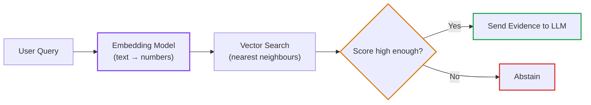

# Standard Lesson Anatomy & Template Guide

This document defines the **single tier system**, word budgets, split and merge rules, the required lesson header block, and the default lesson anatomy.
Remember: **this is a default structure, not a rigid checklist.** Omit or merge sections that do not add value for a specific topic.

The reader is a software engineer who knows software terms but is **new to every AI term**. Teach each AI term from zero (see [terminology-guidelines.md](./terminology-guidelines.md)).

---

## 🏷️ The Single Tier System & Word Budgets

Every lesson declares exactly one of these four tiers. No other badge format is valid.

| Tier | Badge | Prose Word Budget | Focus & Scope |
|---|---|---|---|
| **1** | `🟢 Core` | 800–1,500 | One core idea. Intuition, why the naive approach fails, a working baseline. Highest practical value for everyone. |
| **2** | `🟡 Engineering Depth` | 1,200–2,500 | Production concerns: edge cases, failure modes, scale, concurrency, telemetry. |
| **3** | `🔵 Advanced` | 1,500–3,000 | Specialised patterns: sagas, GraphRAG, speculative decoding, multi-agent coordination. |
| **4** | `⚫ Deep Dive` | 1,500–3,000 | Internal mechanics, hardware layouts, wire-protocol details, proofs. Useful to know; not needed daily. |

**Prose word count** excludes fenced code blocks, diagrams, and tables. The budgets are hard limits: a lesson over budget must be split (see below).

**Legacy labels (migrate when touched):**

| Legacy | Canonical |
|---|---|
| `HIGH ROI / CORE`, `Tier 1: Core Systems Concept` | `🟢 Core` |
| `IMPORTANT / NEXT`, `Tier 2: Engineering Depth` | `🟡 Engineering Depth` |
| `ADVANCED / SPECIALIZED`, `Tier 3/4: Advanced`, `Frontier` | `🔵 Advanced` |
| `REFERENCE / AWARENESS`, `Deep Dive`, `Systems Deep Dive` | `⚫ Deep Dive` |

---

## ✂️ Split & Merge Rules

### Split a lesson when
- Prose exceeds the tier budget.
- It teaches two or more major mechanisms (for example BM25, HNSW and cross-encoders in one file).
- **Strategy**: a short `🟢 Core` lesson that teaches the idea, followed by `🟡`/`⚫` lessons for the mechanics. Keep the depth; move it.

### Merge lessons when
- Adjacent files are under about 500 words and cover fragments of one idea.
- Theory and code for the same idea live in separate disconnected files.

---

## 🧱 Required Header Block

Every lesson starts with exactly this block, directly under the title:

```markdown
# Lesson <XX>: <Plain-Language Title (Acronym)>

> **Tier**: `🟢 Core` | **Read time**: ~12 min | **Prerequisites**: [Lesson name](./path.md)  
> **Core Concept**: One or two plain sentences saying what this lesson lets you do or understand.  
> **New AI terms introduced**: token, tokenizer, context window  
> **AI terms assumed from earlier lessons**: [prompt](../01-x/01-y.md)
```

Rules:
- The ledger lists **AI terms only**. Software terms are not listed.
- Every AI term used in the lesson appears in one of the two ledger lines. Assumed terms link to where they are taught.
- Write `None` if a line is empty. Do not delete the line.

---

## 📋 The Default Anatomy

> [!TIP]
> **Six invariants are always required**: (1) header block with term ledger, (2) plain-English mental model with its "where this analogy breaks" note, (3) systems depth with typed, executed code, (4) trade-offs and failure modes, (5) Quick Check, (6) navigation footer.
> Everything else is omittable. Never pad a lesson to fill a heading.

```markdown
## 🎯 What You Will Learn
3–4 outcomes: one capability, one failure avoided, one trade-off understood.

## 1. The Problem
A concrete scenario with a number or a symptom the reader can picture. What goes wrong with the obvious approach?

## 2. The Mental Model (Explain Like I'm 10)
A vivid analogy in plain English, a tiny example, then:
**Where this analogy breaks**: one sentence.

## 3. How It Works, One Term at a Time
For each of the 2–4 core mechanisms:
### <Mechanism name>
* 🧒 **The Analogy**: ...
* ⚙️ **The Engineering**: mechanics, data structures, formulas in `text` blocks
* ⚠️ **What happens if you skip this?**: the concrete production failure

(Diagram here if it helps. 4–8 nodes. Numbered walkthrough directly beneath.)

## 4. Try It (Runnable, Offline)
Typed Python 3.12+ with Pydantic v2. Show the command and the real output.

## 5. Trade-Offs
A small table: latency, cost, memory, quality, complexity. Every number labelled per the accuracy policy.

## 6. Failure Modes & Anti-Patterns
Symptom → root cause → fix.

## 7. Evolution: Naive vs. Modern (optional)
Only when the concept replaced a real predecessor.

## 8. Telemetry (optional)
Only for production-service lessons. Use attribute names verified against the current OpenTelemetry GenAI conventions.

## 🧠 9. Quick Check to See if it Clicked
A scenario question and a collapsible answer.

## 10. Interview Perspective (optional)
Only for Tier 2–3 lessons not covered by the phase capstone.

## 11. Key Takeaways & Verified Sources
3–4 bullets. Only sources that were actually opened and read.

## 🧭 Navigation
```

### Navigation footer (mandatory)

```markdown
## 🧭 Navigation
- **[← Previous Lesson: <Title>](./<prev>.md)**
- **[Phase <XX> Hub](./README.md)**
- **[Next Lesson: <Title> →](./<next>.md)**
- **[Capstone Lab: <Title>](./labs/<lab>.md)**
```

---

## 🖼️ Diagram Sample (within budget)

A correct diagram is small. This one has 6 nodes. Bigger flows are split into several diagrams (see [diagram-guidelines.md](./diagram-guidelines.md)).



### Visual Walkthrough
1. **User Query**: the raw question arrives.
2. **Embedding Model**: turns the question into a list of numbers that represents its meaning.
3. **Vector Search**: finds stored items whose numbers are closest.
4. **Score gate**: only confident matches move on.
5. **Outcome**: evidence goes to the LLM, or the system says it doesn't know.

---

## ✂️ Structural Flexibility Guidelines

| Section | Can be omitted when... | Can be merged when... |
|---|---|---|
| **Evolution table** | The concept has no real naive predecessor. | Folded into Trade-Offs. |
| **Diagram** | The lesson is a small algorithm or formula. | Replaced by a `text` walkthrough. |
| **Telemetry** | The component is a pure utility (for example a token counter). | Merged into Failure Modes. |
| **Interview Perspective** | Tier 1 lessons, or covered by the capstone. | Not applicable. |
| **Tripartite blocks** | Never omit for core mechanisms; do not apply to every paragraph. | Merge minor mechanisms into one block. |

---

## 🚫 Formatting & Math Guidelines (Zero LaTeX)

All lesson files must render without KaTeX or MathJax:
- **No LaTeX**: never use `$$...$$` or `$...$`.
- **Formulas**: place in fenced `text` blocks.
- **Symbols**: use Unicode (`→`, `⟷`, `Σ`, `≈`, `α`, `≤`, `≥`, `×`, `Δ`).
- **Complexity**: write `O(N)` and `O(log N)` as monospace text.
- **Tables**: GFM pipe tables only. Avoid unescaped `$$` cost indicators.
- **Zero meta-directive leaks**: never include internal directives, quality-gate reminders, or refactoring tags in learner-facing titles or prose (do not write `### The Attention Formula (Zero-LaTeX):`).
