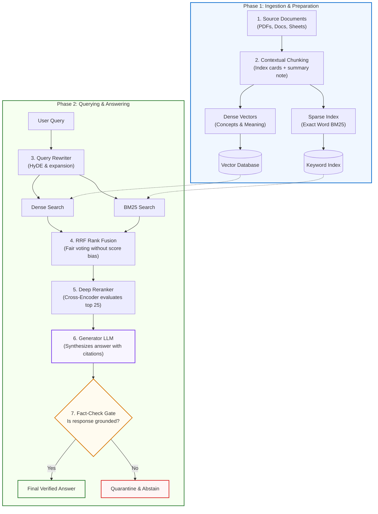

# Standard Lesson Anatomy & Template Guide

This document defines the **11-Part Default Lesson Structure**, depth tier parameters, word count budgets, and split/merge rules.  
Remember: **This is a default structure, not a rigid checklist.** Omit or merge sections that do not add value for a specific topic.

---

## 🏷️ Depth Tier Parameters & Word Count Budgets

Every lesson must target a specific depth tier and respect its cognitive word budget:

| Tier | Badge | Word Budget | Focus & Scope |
|---|---|---|---|
| **Tier 1** | `🟢 Core` | ~800–1,500 words | Single core concept, intuition, failure of naive approach, working baseline implementation. |
| **Tier 2** | `🟡 Engineering Depth` | ~1,200–2,500 words | Architectural core: edge cases, failure modes, scale constraints, concurrency, and OTel telemetry. |
| **Tier 3** | `🔵 Advanced` | ~1,500–3,000 words | High-scale or specialized production patterns (speculative decoding, GraphRAG, distributed sagas). |
| **Tier 4** | `⚫ Deep Dive` | ~1,500–3,000 words | Internal mechanics, mathematical proofs, hardware memory layouts, wire protocols. |

---

## ✂️ Split & Merge Rules (Section 27 Standard)

To maintain optimal cognitive load and reading momentum:

### When to Split a Lesson:
- **Word Count Exceeded**: The lesson exceeds ~3,500 words without justification.
- **Multiple Core Primitives**: The lesson attempts to teach two or more major architectural primitives simultaneously (e.g. teaching BM25, HNSW, and Cross-Encoders in a single monolithic file).
- **Split Strategy**: Divide into a `🟢 Core` conceptual introduction followed by one or more `🟡 Engineering Depth` or `⚫ Deep Dive` implementation files.

### When to Merge Lessons:
- **Fragmented Stubs**: Adjacent files are under ~500 words and cover trivial fragments of the same concept.
- **Artificial Separation**: Splitting the "theory" and "code" into separate disconnected markdown files when they belong in the same unified narrative arc.
- **Merge Strategy**: Consolidate into a single coherent `🟢 Core` or `🟡 Engineering Depth` lesson.

---

## 📋 The Parameterized 11-Part Anatomy

```markdown
# Lesson <XX>: <Plain-Language Systems Title (Acronym)>

> **Tier**: `[🟢 Core | 🟡 Engineering Depth | 🔵 Advanced | ⚫ Deep Dive]` | **Est. Read Time**: ~XX min  
> **Core Concept**: One to two sentence plain-English mental model defining the engineering objective without buzzwords.

---

## 🎯 What You Will Learn
- Specific architectural capability (e.g., *Phase 00: Calculate KV cache memory footprint per concurrent session*, *Phase 02: Implement hybrid RRF retrieval*, *Phase 04: Build an event-sourced agent state machine*)
- Specific failure mode avoided (e.g., *Prevent GPU memory allocation blowout*, *Prevent exact identifier loss in vector space*, *Prevent infinite agent loops and budget loss*)
- Trade-off mastered (e.g., *Balance latency vs. precision*, *Token spend vs. context window size*, *Throughput vs. model perplexity*)

---

## 1. The Problem & The Real-World Intuition

### The Problem Scenario
Describe the concrete production scenario that necessitates this pattern:
- What engineering requirement, traffic load, or business constraint triggers the need?
- What happens if we do nothing or rely on standard application logic?

### 🧒 The Mental Model (Explain Like I'm 10)
Demystify the concept with a vivid, relatable real-world analogy before introducing code or algorithms:
- Example: *The closed-book exam (hallucination) vs. open-book exam with a super-fast librarian helper (RAG).*
- Example: *The Idea Catalog (vector embeddings) vs. The Exact-Word Catalog (BM25 keywords).*

---

## 2. The Architectural Blueprint (Modern Visual Flowchart)

Provide a clean, modern Mermaid flowchart using semantic color styling and clear typography:



### Visual Architecture Walkthrough:
1. **Step 1**: Ingestion flow description.
2. **Step 2**: Intermediate transformation.
3. **Step 3**: Parallel or branched processing.
4. **Step 4**: Decision gate or verification step.

---

## 3. Explaining Every Block (The Tripartite Pedagogy)

For each major systems block, apply the 3-part rhythm:

### Block 1: <Block Title>
* 🧒 **The Analogy**: Relatable real-world metaphor explaining what this block does in simple terms.
* ⚙️ **The Engineering**: Technical mechanics, data structures, algorithms, formulas in text code blocks, and protocols.
* ⚠️ **What happens if you skip this?**: The exact production failure, bug, or outage that occurs if this component is omitted.

### Block 2: <Block Title>
* 🧒 **The Analogy**: ...
* ⚙️ **The Engineering**: ...
* ⚠️ **What happens if you skip this?**: ...

---

## 4. Evolution: Old/Naive vs. Modern Production

A side-by-side comparison table showing how this architecture evolved from early prototypes to modern production standards:

| Feature / Dimension | Naive Approach (Early Prototype) | Modern Production Architecture (Current Standard) |
|---|---|---|
| **Chunking / Ingestion** | Fixed character slices | Semantic boundaries + Contextual summary prepending |
| **Search Engine** | Dense vector search only | **Hybrid**: Dense Vectors + BM25 Lexical Index |
| **Rank Merging** | Arbitrary score threshold guessing | **RRF (Reciprocal Rank Fusion)** |
| **Precision Filtering** | Raw top-k returned directly | **Cross-Encoder Reranker** |
| **Safety / Reliability** | Unchecked model output ("trust the vibes") | **Groundedness & Faithfulness Verification Gate** |

---

## 5. Concrete Production Implementation (Runnable Python)

Clean, type-annotated Python 3.12+ implementation using typed Pydantic v2 schemas:
- No bloated wrapper frameworks; show the raw data structures and transformations.
- Explicit error handling, validation, and idempotency considerations.

```python
from pydantic import BaseModel, Field

class VerifiedPayload(BaseModel):
    id: str = Field(..., description="Unique entity identifier")
    score: float = Field(ge=0.0, le=1.0)
    # Production implementation...
```

---

## 6. Decision-Oriented Trade-Off Matrix

Explicitly evaluate trade-offs across latency, compute cost, memory footprint, precision, and operational complexity:

| Architecture Pattern | Latency (p95) | Compute Cost | Precision / Recall | Engineering Complexity | Production Failure Mode |
|---|---|---|---|---|---|
| **Pattern A** | Low (<20ms) | Low | Medium | Low | Fails on exact identifiers |
| **Pattern B** | Medium (<50ms) | Medium | High | Medium | Index synchronization lag |
| **Pattern C** | High (150-300ms) | High | Very High | High | GPU latency bottleneck |

---

## 7. Common Failure Modes & Anti-Patterns

A structured review of real-world landmines:
- **Anti-Pattern 1**: Description, root cause, and engineering fix.
- **Anti-Pattern 2**: Description, root cause, and engineering fix.

---

## 8. OpenTelemetry Tracing & Telemetry View

Code snippet and explanation demonstrating OTel GenAI semantic conventions in practice:
- Tracking latency, candidate counts, token spend, and cache hits.

---

## 🧠 9. Quick Check to See if it Clicked

Test the learner's architectural intuition with a concrete production scenario:

> **Scenario**: A customer queries: *"Why is transaction tx_9941a failing with status code 504?"*  
> If our system only used **Dense Vector Search**, why would it struggle to find the right document, and which block in our modern workflow saves the day?

*(Include a collapsible or inline explanation of the solution).*

---

## 💡 10. Senior Architectural Interview Perspective

3–5 senior architectural interview questions and defense strategies:
- **Question**: *"How would you design a system that handles X constraint under Y load?"*
- **Architectural Defense**: Clear defense of the trade-off, failure modes, and recovery strategies.

---

## 11. Key Takeaways & Verified Resources
- 3–4 bulleted principles to remember.
- Authoritative primary source references (arXiv papers, official protocol specs, provider engineering blogs).

---

## 🧭 Navigation (Mandatory)
- **[← Previous Lesson: <Title>](./<prev-lesson>.md)**
- **[Phase <XX> Hub](./README.md)**
- **[Next Lesson: <Title> →](./<next-lesson>.md)**
- **[Capstone Lab: <Title>](./labs/<lab-file>.md)**
```

---

## ✂️ Structural Flexibility Guidelines

| Section | Can be Omitted When... | Can be Merged When... |
|---|---|---|
| **3. Mental Model** | The concept is a direct extension of an already-covered mental model. | Merged with **2. The Core Idea** for concise lessons. |
| **Why Naive Fails** | The topic is an extension of an existing pattern rather than a replacement. | Merged with **1. The Problem** if the problem *is* the failure of the naive approach. |
| **7. Architecture View** | The topic is an algorithmic or mathematical utility (e.g., BM25 formula) rather than a distributed service. | Integrated into **4. How It Works**. |
| **9. Evaluation** | The component is purely infrastructural (e.g. token counting utility). | Merged with **7. Telemetry View**. |
| **11. Interview Perspective** | The lesson is a brief reference or foundational primer. | Omitted in Tier 1 (`🟢 Core`) lessons when covered in adjacent engineering depth lessons. |

---

## 🚫 Formatting & Math Guidelines (Zero LaTeX)

All lesson markdown files must render without requiring KaTeX/MathJax plugins:
- **No LaTeX Math Blocks**: Never use `$$...$$` or `$...$`.
- **Formulas**: Place mathematical equations in fenced text blocks (```text).
- **Symbols**: Use standard Unicode (`→`, `⟷`, `Σ`, `≈`, `α`, `≤`, `≥`, `×`, `Δ`).
- **Complexity**: Write `O(N)` and `O(log N)` directly as monospace text.
- **Tables**: Use standard Markdown pipe tables; avoid LaTeX arrays or unescaped `$$` cost indicators.
- **Zero Meta-Directive Leaks**: Never include internal directives, quality gate reminders, or refactoring tags in learner-facing section titles or prose (e.g. do NOT name a section `### The Attention Formula (Zero-LaTeX):` or `### Step 1 (Refactored)`). Write clean, authoritative titles (`### The Attention Formula`).
