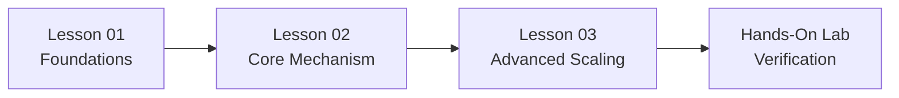

# Phase README Architectural Specification

This document defines how Phase READMEs must be structured.

---

## 🚫 The Anti-Pattern: The Monolithic README

In early iterations, phase directories often contain an 800+ line `README.md` that crams all lesson content, documentation snippets, cheat sheets, and code listings into a single file.

**Consequences of the Monolith**:
- Overwhelming cognitive load for the learner.
- Inability to link directly to specific lessons.
- Hard to update and maintain.
- Blurs the line between high-level architecture and low-level code mechanics.

---

## ✅ The Target Pattern: The Orientation & Navigation Hub

A Phase `README.md` must serve as an **Architectural Orientation Hub**, guiding the learner through self-contained, modular lesson files (`01-....md`, `02-....md`).

### Standard Phase README Structure

```markdown
# Phase <XX>: <Phase Title>

> **Architectural overview and learning progression for Lead Developers and Solutions Architects.**

---

## 🎯 Phase Engineering Goal
Explain the overarching production capability delivered by this phase:
- What end-to-end system does this phase prepare the engineer to architect?
- What major production challenges are addressed?

---

## 🗺️ Learning Path & System Topology
Include a concise Mermaid diagram illustrating how the concepts in this phase connect:



Briefly walk through the path in 2–3 sentences.

---

## 📚 Modular Curriculum Lessons

| # | Lesson Title | Core Focus | Engineering Outcome |
|---|---|---|---|
| **01** | [Foundational Primitive](./01-<topic>.md) | Architectural or mathematical core | Measurable baseline capability |
| **02** | [Core Implementation](./02-<topic>.md) | Deterministic system mechanism | Fault-tolerant execution pattern |
| **03** | [Advanced Scaling](./03-<topic>.md) | High-concurrency / distributed optimization | Production throughput & latency SLA |
| **04** | [Production Defense / Telemetry](./04-<topic>.md) | Guardrails, evaluations, or observability | Enterprise compliance & failure recovery |

### Exemplar Lesson Maps by Curricular Phase:
- **Phase 00 (Foundations)**: Tokenization & BPE → Attention & KV Cache Memory → Prefill vs. Decode Physics → Chunked Prefill & FlashAttention.
- **Phase 01 (Context)**: In-Context Learning → Constrained Grammar Decoding → JSON Schema Marshaling → Context Pruning ASTs.
- **Phase 02 (Retrieval)**: Document Parsing → Dense/Sparse Indexing → Hybrid Search & RRF → Cross-Encoder Reranking → GraphRAG.
- **Phase 03 (Tools & MCP)**: JSON-RPC 2.0 Wire Protocol → MCP Stdio/SSE Servers → ABAC Policy Gates → Tool Idempotency.
- **Phase 04 (Agents)**: Bounded ReAct Loops → Event-Sourced Write-Ahead Logs → Crash Replay & State Hydration → Multi-Agent Supervisors.
- **Phase 05 (Security)**: Prompt Injection Vectors → Dual-LLM Quarantine → Tool Execution Firewalls → Automated Red-Teaming.
- **Phase 06 (Evals & OTel)**: Synthetic Test Datasets → LLM-as-a-Judge Calibration → OpenTelemetry GenAI Spans → CI/CD Evaluation Gates.
- **Phase 07 (Serving)**: Continuous Batching Engines → PagedAttention Internals → AWQ/GPTQ Quantization → Speculative Decoding.
- **Phase 08 (SDLC)**: Spec-Driven Code Generation → Agentic Pull Request Reviewers → Enterprise AI Governance.

---

## 🛠️ Associated Hands-On Labs

Point to the executable implementation and automated verification harness:
- **Lab Location**: `labs/lab-XX-<topic>.md` or `agent-forge/<module>/`
- **Verification Command**:
  ```bash
  python scripts/verify_lab.py --lab <XX>
  ```

---

## 📋 Prerequisites & Cross-Phase Dependencies

- **Required Prior Knowledge**: Link to preceding phases across the 00–08 roadmap (e.g., "Requires Phase 01: Context Engineering & Token Mechanics").
- **Downstream Beneficiaries**: Explain where these skills are leveraged later (e.g., "Feeds into Phase 04: Stateful Agent Orchestration").

---

## 📚 Curated Primary Sources & Verification References
Only list authoritative primary sources:
- Original arXiv whitepapers
- Official protocol standards (MCP, OpenTelemetry GenAI)
- Official engineering blogs (Anthropic Research, OpenAI Engineering, Google DeepMind)
```
