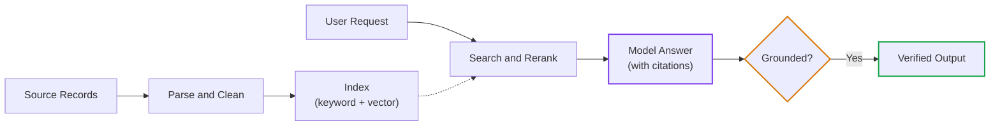

# Phase README Architectural Specification

This document defines how Phase READMEs must be structured.

---

## 🚫 The Anti-Pattern: The Monolithic README

In early iterations, phase directories often contain an 800+ line `README.md` that crams all lesson content, documentation snippets, cheat sheets, and code listings into a single file.

**Consequences of the Monolith**:
- Overwhelming cognitive load for the learner.
- Inability to link directly to specific lessons.
- Hard to update and maintain.
- Blurs the line between high-level architecture and low-level code mechanics.

---

## ✅ The Target Pattern: The Orientation & Navigation Hub

A Phase `README.md` must serve as an **Architectural Orientation Hub**, guiding the learner through self-contained, modular lesson files (`01-....md`, `02-....md`).

### Standard Phase README Structure

```markdown
# Phase <XX>: <Phase Title>

> **Architectural overview and learning progression for Lead Developers and Solutions Architects.**

---

## 🔗 Why This Phase, Why Now?

One paragraph. Complete this sentence structure:

> Without [concept from this phase], [next-phase concept] fails because [concrete reason].

Example: "Without KV cache budgeting (Phase 00), you cannot reason about RAG retrieval costs (Phase 02)
because every retrieved chunk extends the context window, and you have no model for what that costs in VRAM or latency."

This section must answer: "Why should I read this now and not skip to the next phase?"

---

## 🎯 Who This Phase Is For

Brief, role-specific entry recommendation. One or two lines per role.

> **Data / ML Engineers**: Start here — Phase 02 (RAG) is your highest-ROI phase.
> **Backend / API Engineers**: Follow the phase order from Phase 00.
> **SRE / Platform Engineers**: Phase 06 (Evals) and Phase 07 (Serving) are higher ROI; read those first.
> **Security Engineers**: Phase 05 (AI Security) links back here for tool-call context.
> **Engineering Managers**: Tier 1 lessons only; Phase 08 (SDLC) is required.

---

## 🎯 Phase Engineering Goal
Explain the overarching production capability delivered by this phase:
- What end-to-end system does this phase prepare the engineer to architect?
- What major production challenges are addressed?

---

## 🧒 Phase Mental Model & Real-World Intuition
Start with an accessible, high-impact mental model (ELI10) that grounds the entire phase:
- Frame the system using a relatable, human-scale analogy (e.g. *Closed-Book vs. Open-Book Exam*, *The Detective and the Library*, *Operating System Kernel vs. User Space*).
- Contrast the intuitive mental model directly with the probabilistic realities of neural models.

---

## 🚦 Start Here: Learning Path & Readiness Checkpoints

- **Who this phase is for**: software engineers who know the software terms but are new to the AI terms introduced here.
- **Suggested order**: list the lessons in the order a beginner should read them, marking which are optional Deep Dives.
- **You are ready to move on when you can**: 3–4 concrete, testable statements (for example "explain why a 2,000-word document may cost more tokens than 2,000").
- **Phase glossary**: the AI terms this phase introduces, each with a one-line plain definition (link to the repository glossary).

---

## 🗺️ Phase Blueprint & System Topology

Include one phase-level Mermaid diagram of at most 8 nodes (see [diagram-guidelines.md](./diagram-guidelines.md)). Put deeper flows in the lessons:



### Visual Architecture Walkthrough:
Walk through the numbered steps in 3–5 bullet points.

---

## 📊 Evolution: Naive Prototype vs. Modern Production Architecture

Every phase README must contrast the early/naive approach against the modern production standard:

| Architecture Layer | Naive Prototype (2023) | Modern Enterprise Standard (2026) |
|---|---|---|
| **Data Ingestion** | Blind token slicing | Layout-aware semantic parsing + contextual prepending |
| **Search / Storage** | Single vector store | Hybrid dual-indexing (Dense + BM25) with predicate filtering |
| **Scoring & Merging** | Heuristic distance thresholds | Reciprocal Rank Fusion (RRF) + Cross-Encoder attention |
| **Output Attestation** | Unverified generation | Groundedness verification gates & inline source citations |

---

## 📚 Modular Curriculum Lessons (Master Navigation Table)

| # | Lesson / Module | Tier | Est. Time | New AI Terms | Key Engineering Outcome |
|---|---|---|---|---|---|
| **01** | [Foundational Primitive](./01-<topic>.md) | `🟢 Core` | ~18 min | token, tokenizer | Measurable baseline capability |
| **02** | [Core Implementation / Deep Dive](./02-<topic>.md) | `⚫ Deep Dive` | ~22 min | context window, attention | Fault-tolerant execution pattern |
| **03** | [Advanced Scaling](./03-<topic>.md) | `🟡 Engineering Depth` | ~20 min | KV cache, batching | Production throughput & latency SLA |
| **04** | [Production Defense / Telemetry](./04-<topic>.md) | `🔵 Advanced` | ~22 min | eval, groundedness | Enterprise compliance & failure recovery |

### Exemplar Lesson Maps by Curricular Phase:
- **Phase 00 (Foundations)**: What an LLM is (Lesson 00 primer) → Tokens & Tokenization → Attention & the Context Window → KV Cache Memory → Reasoning Models → Small Models & Quantization → Hardware Physics (Deep Dive).
- **Phase 01 (Context)**: In-Context Learning → Constrained Grammar Decoding → JSON Schema Marshaling → Context Pruning ASTs.
- **Phase 02 (Retrieval)**: Document Parsing → Dense/Sparse Indexing → Hybrid Search & RRF → Cross-Encoder Reranking → GraphRAG.
- **Phase 03 (Tools & MCP)**: JSON-RPC 2.0 Wire Protocol → MCP Stdio/SSE Servers → ABAC Policy Gates → Tool Idempotency.
- **Phase 04 (Agents)**: Bounded ReAct Loops → Event-Sourced Write-Ahead Logs → Crash Replay & State Hydration → Multi-Agent Supervisors.
- **Phase 05 (Security)**: Prompt Injection Vectors → Dual-LLM Quarantine → Tool Execution Firewalls → Automated Red-Teaming.
- **Phase 06 (Evals & OTel)**: Synthetic Test Datasets → LLM-as-a-Judge Calibration → OpenTelemetry GenAI Spans → CI/CD Evaluation Gates.
- **Phase 07 (Serving)**: Continuous Batching Engines → PagedAttention Internals → AWQ/GPTQ Quantization → Speculative Decoding.
- **Phase 08 (SDLC)**: Spec-Driven Code Generation → Agentic Pull Request Reviewers → Enterprise AI Governance.

---

> Reports, audits and plans never live in this folder. They go to `.curriculum-reports/` (see [report-templates.md](./report-templates.md)).

## 🛠️ Associated Hands-On Labs

Point to the executable implementation and automated verification harness:
- **Lab Location**: `labs/lab-XX-<topic>.md` or `agent-forge/<module>/`
- **Verification Command**:
  ```bash
  python scripts/verify_lab.py --lab <XX>
  ```

---

## 📋 Prerequisites & Cross-Phase Dependencies

- **Required Prior Knowledge**: Link to preceding phases across the 00–08 roadmap (e.g., "Requires Phase 01: Context Engineering & Token Mechanics").
- **Downstream Beneficiaries**: Explain where these skills are leveraged later (e.g., "Feeds into Phase 04: Stateful Agent Orchestration").

---

## 📚 Curated Primary Sources & Verification References
Only list authoritative primary sources:
- Original arXiv whitepapers
- Official protocol standards (MCP, OpenTelemetry GenAI)
- Official engineering blogs (Anthropic Research, OpenAI Engineering, Google DeepMind)

---

## 🧭 Navigation (Mandatory)

### Phase Progression
- **Previous Phase**: **[← Phase <XX-1>: <Title>](../<phase-prev>/README.md)**
- **Next Phase**: **[Phase <XX+1>: <Title> →](../<phase-next>/README.md)**

### Direct Chapter & Lesson Directory
- **[Lesson 01: <Title>](./01-<topic>.md)**
- **[Lesson 02: <Title>](./02-<topic>.md)**
- **[Lesson 03: <Title>](./03-<topic>.md)**
- **[Lesson 04: <Title>](./04-<topic>.md)**
- **[Platform Appendix: <Title>](./reference/<topic>.md)**
- **[Hands-On Capstone Lab: <Title>](./labs/<lab-topic>.md)**
```
