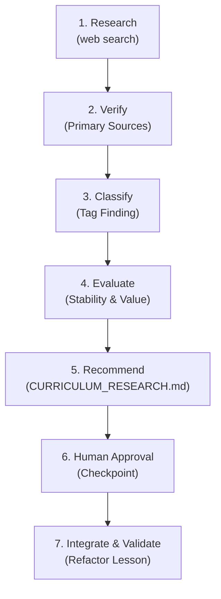

# Controlled Web Research & Freshness Auditing Guidelines

This document establishes the protocol for scouting emerging AI developments using web search tools without degrading the curriculum into news-driven bloat.

---

## 1. The Core Principle

> **"New does not automatically mean important."**

AI Engineering moves at an unprecedented pace. Daily announcements tout new models, wrappers, and experimental frameworks. If a curriculum attempts to chase every weekly development, it rapidly degrades into shallow, outdated marketing summaries.

The curriculum must prioritize **durable systems engineering patterns**:
- Fundamental memory, compute, and hardware constraints (KV caches, GPU memory bandwidth).
- Stable wire protocols (Model Context Protocol JSON-RPC, Server-Sent Events).
- Resilient distributed state patterns (Write-Ahead Logs, event-sourced checkpoints).
- Principled evaluation methodologies (Groundedness, faithfulness, latency budgets).

---

## 2. The 7-Stage Controlled Research Workflow

Never permit an agent to directly rewrite curriculum files based on raw web search output. Always enforce this multi-stage pipeline:



1. **Research**: Use the available web search tool to investigate emerging patterns, benchmark results, or protocol specifications.
2. **Verify**: Cross-reference claims against primary documentation or upstream source code.
3. **Classify**: Assign an explicit classification tag to the topic.
4. **Evaluate**: Score the finding on architectural durability, prerequisite fit, and engineering value.
5. **Recommend**: Summarize findings in a dedicated audit artifact (`CURRICULUM_RESEARCH.md`).
6. **Human Approval**: The user reviews and explicitly authorizes or rejects the recommendations.
7. **Integrate & Validate**: The agent writes the new or updated lesson following the standard lesson anatomy and runs the quality gate.

---

## 3. Source Preference Hierarchy

| Tier | Source Category | Acceptable For |
|---|---|---|
| **Tier 1 (Authoritative)** | Official specifications (MCP, W3C, OTel), primary documentation (Anthropic, OpenAI, Google DeepMind), upstream source code. | Core architecture definitions, protocol schemas, official APIs. |
| **Tier 2 (Academic)** | Peer-reviewed publications, original arXiv research papers. | Algorithmic mechanics (RRF, ColBERT, HNSW, Tree-of-Thought). |
| **Tier 3 (Cloud Enterprise)** | AWS, Azure, Google Cloud reference architectures. | Infrastructure topologies, enterprise security standards. |
| **Tier 4 (Discovery Only)** | Engineering blogs (Netflix TechBlog, Uber Engineering, Cloudflare). | Discovering operational failure modes and scaling challenges. |
| **Prohibited** | Social media threads (X/Twitter, Reddit, LinkedIn), marketing PR, unverified benchmark claims. | **Never acceptable** as primary justification for curriculum changes. |

---

## 4. Topic Classification Taxonomy

Every research finding must be tagged with one of the following:

- **`KEEP_EXISTING`**: Existing repo content accurately reflects current production standards. No action needed.
- **`UPDATE_EXISTING`**: A core concept has evolved (e.g., Anthropic MCP expanding tool streaming or new OpenTelemetry GenAI semantic conventions). Update the existing lesson.
- **`NEW_TOPIC`**: A durable, major new engineering paradigm has emerged (e.g., speculative decoding hardware physics, Agent-to-Agent wire protocols). Draft a new modular lesson.
- **`MOVE_TOPIC`**: A topic currently in Phase X actually belongs in Phase Y due to prerequisite dependencies.
- **`ADVANCED_TOPIC`**: Valid engineering practice, but too specialized for core flow. Place in an `Advanced / Deep Dive` section.
- **`REFERENCE_ONLY`**: Specialized vendor tool or library. Mention in the reference index; do not write a full lesson.
- **`REJECT`**: Ephemeral feature, syntactic wrapper, or marketing hype. Do not add to the repository.

---

## 5. Topic Evaluation Matrix

Before recommending an addition, evaluate:
1. **Relevance**: Does this materially improve an engineer's ability to ship reliable AI systems?
2. **Stability**: Is this a durable engineering concept, or will it be obsolete in 6 months?
3. **Prerequisites**: Where does this fit in the learning progression (Phases 00–08)?
4. **Duplication**: Does an existing lesson or `agent-forge` module already cover the underlying principle?

---

## 5b. Freshness Rules for Models, Protocols and Prices

- Models, prices, context limits and protocol versions change monthly. Never write them from memory.
- Every such fact must be verified against an official page in the current session and written with an "as of YYYY-MM" date. See [accuracy-policy.md](./accuracy-policy.md).
- Lessons teach the durable concept; model tables are the only place version names belong.

---

## 6. Freshness Audit Template (`CURRICULUM_RESEARCH.md`)

When executing in **RESEARCH MODE**, format the output as follows:

```markdown
# AI Engineering Curriculum Freshness Report
**Audit Date**: YYYY-MM-DD  
**Scope**: Phase XX (<Phase Title>)

## Executive Summary
Concise synthesis of industry frontier vs. current repository coverage.

## Proposed Topic Actions

| Topic | Proposed Action | Target Phase / Lesson | Primary Source | Rationale |
|---|---|---|---|---|
| Model Context Protocol (MCP) | UPDATE_EXISTING | Phase 03 / Lesson 02 | modelcontextprotocol.io | Schema version upgrade to support elicitation |
| Speculative Decoding | NEW_TOPIC | Phase 07 / Lesson 04 | arXiv:2211.17192 | 2-3x inference throughput optimization |
| LangChain v0.3 Wrapper | REJECT | N/A | N/A | Ephemeral framework wrapper; wire protocols preferred |

## Detailed Recommendations & Diff Outlines
### Topic: <Topic Name>
- **Current Content**: ...
- **Proposed Enhancement**: ...
- **Architectural Trade-offs**: ...
- **Recommended Action**: Awaiting User Approval.
```

---

## 7. Multi-Phase Frontier Research Watch-Areas (Phases 00–08)

When auditing curriculum freshness, monitor these specific domain developments:
- **Phase 00 (Foundations)**: Multi-Head Latent Attention (MLA), Ring Attention, KV cache compression, linear attention variants.
- **Phase 01 (Context)**: Constrained grammar decoding (XGrammar, Outlines), JSON schema compilation, system prompt anchoring.
- **Phase 02 (Retrieval)**: Late Chunking, ColBERT token-level scoring, Contextual Retrieval, GraphRAG with ontological knowledge graphs.
- **Phase 03 (Tools & MCP)**: Model Context Protocol (MCP) wire specifications, Agent-to-Agent (A2A) protocols, stdio/SSE/WebSocket transports.
- **Phase 04 (Agents)**: Durable execution loops, event-sourced WAL persistence, bounded turn limits, saga transaction rollbacks.
- **Phase 05 (Security)**: Indirect prompt injection in multimodal models, dual-LLM quarantine, semantic firewalls, data leakage prevention.
- **Phase 06 (Evals & OTel)**: OpenTelemetry GenAI semantic conventions, LLM-as-a-judge statistical calibration, automated CI/CD eval gates.
- **Phase 07 (Serving)**: Continuous batching schedulers, PagedAttention memory layouts, AWQ/GPTQ quantization, speculative decoding kernels.
- **Phase 08 (SDLC)**: Spec-driven AI coding workflows, automated pull request review agents, enterprise architecture review guidelines.

