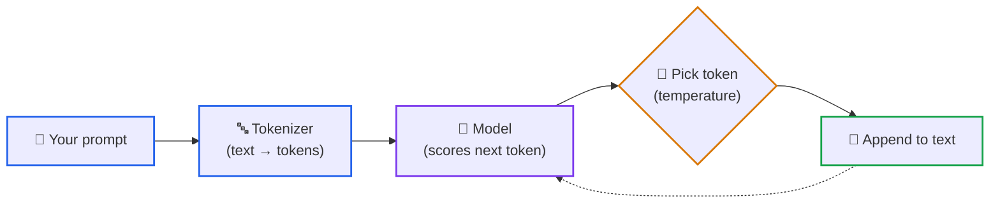
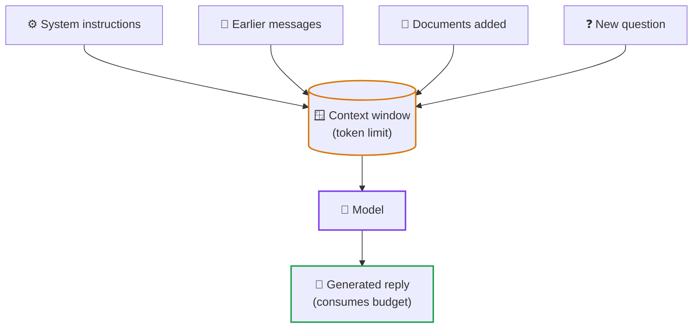

# Lesson 00: What Is a Large Language Model? Tokens, Prompts and Context Windows

> **Tier**: `🟢 Core` | **Read time**: ~14 min | **Prerequisites**: None  
> **Core Concept**: A large language model is a program that predicts the next small piece of text, over and over, until it has written a whole answer. Every cost, limit and surprise in AI engineering follows from that one loop.  
> **New AI terms introduced**: large language model (LLM), prompt, token, tokenizer, training, inference, context window, temperature, hallucination  
> **AI terms assumed from earlier lessons**: None

---

## 🎯 What You Will Learn

- Describe in plain words what an LLM does when you send it a request.
- Explain what a token is and why tokens, not characters or words, set your cost and limits.
- Explain why the model "forgets" between calls and what a context window is.
- Predict what temperature changes, and why a fluent answer can still be wrong.

---

## 1. The Problem

You add an LLM call to your service like any HTTP API. Then it stops behaving like one:

- The same request returns different answers on different calls.
- The bill depends on how much text you send, not on how many requests you make.
- The second call has no memory of the first.
- A reply can sound certain and be completely invented.

Treat the model like a database or a pure function and each surprise becomes an incident. The bridge from what you know:

| You know | LLM reality |
|---|---|
| A function returns the same output for the same input | The output is sampled, so it can differ between calls |
| You pay per request or per CPU second | Most hosted APIs bill per token of input and output (check your provider's pricing page) |
| Session state lives on the server | The model call is usually stateless; you resend the conversation every time |
| A query returns a record or nothing | The model always returns *something* plausible |

## 2. The Mental Model

🧒 **Think of the autocomplete on your phone, scaled up enormously.** You type "see you", and the phone suggests "soon". It has learned from lots of text which words tend to follow which. An LLM does the same, but it has read a vast amount of text, weighs much more of what you wrote, and keeps going: pick the next piece, add it to the text, predict again.

**Where this analogy breaks**: phone autocomplete looks at the last word or two. An LLM weighs everything in its input at once, which is why it can follow instructions and keep a topic. It is also not looking anything up. It produces likely text, not retrieved facts.

## 3. How It Works, One Term at a Time

### Large language model, training and inference

* 🧒 **The Analogy**: A student who spent years reading, then sits an exam. Reading is **training**. Taking the exam is **inference**.
* ⚙️ **The Engineering**: A **large language model (LLM)** is a neural network with learned numbers called *weights*. During **training**, engineers adjust these weights across billions of sentences until the model predicts the next word accurately. **Inference** means running that finished model on a new input. Your application only ever runs inference. The weights stay frozen and never change during an API call.
* ⚠️ **What happens if you skip this?** You expect the model to "learn" from users' messages. It only sees the current input.

The text you send is called the **prompt**.

### Token and tokenizer

* 🧒 **The Analogy**: Lego bricks. The model does not see a sentence as one block or as single letters. It sees it as a row of small, reusable bricks.
* ⚙️ **The Engineering**: A **token** is one of those pieces: a whole short word, part of a longer word, or punctuation. A **tokenizer** is the program that splits text into tokens and turns each into an integer ID before the model sees it. In English, a token is very roughly three-quarters of a word *(illustrative; it varies by tokenizer and by language)*. Limits and pricing are counted in tokens.
* ⚠️ **What happens if you skip this?** You estimate cost and limits from character or word counts, then get surprised by bills and by requests that are rejected as too long. Lesson 01 shows how to count tokens exactly.

### Diagram 1: The generation loop



1. **Your prompt** is split into tokens by the tokenizer.
2. **The model** scores every possible next token with a probability.
3. **Pick one token** is where temperature acts (below).
4. **Add it to the text**, then the dotted arrow sends the longer text back through the model. The loop stops at an end-of-text token or at a length limit you set.

### Context window

* 🧒 **The Analogy**: A desk. The model can only work with what is on the desk right now. Anything that does not fit, or was never placed there, does not exist for it.
* ⚙️ **The Engineering**: The **context window** is the maximum number of tokens the model can take in and produce in one call. Your prompt and the model's reply both count against it. Because calls are stateless, a chat application resends the earlier messages with every new question, so the desk fills up as a conversation grows.
* ⚠️ **What happens if you skip this?** Long conversations or large pasted documents either get rejected or quietly lose their oldest parts, and the model answers without information you assumed it had.

### Diagram 2: What fills the desk



1. **Four sources** are assembled by your application into one prompt.
2. **The context window** caps the total, and the reply must fit in what is left.

### Temperature and hallucination

* 🧒 **The Analogy**: Picking a snack from a bowl where some snacks are more common. Low temperature means you nearly always grab the most common one. High temperature means you are more willing to reach for the odd ones.
* ⚙️ **The Engineering**: At each step the model gives every candidate token a probability. **Temperature** is a setting that sharpens or flattens those probabilities before one token is chosen. Lower values make the top choice dominate. Higher values spread the chance around, so outputs vary more. A **hallucination** is output that reads fluently but is false or unsupported. It happens because the model is built to produce likely text, not to check facts.
* ⚠️ **What happens if you skip this?** You ship a feature that shows unverified model text as if it were a lookup result. The first invented detail reaches production.

## 4. Try It (Runnable, Offline)

This toy model is far simpler than a real LLM. It counts which word follows which in a tiny text, then picks the next word from those counts. It has the same loop and the same temperature behaviour. Real models use tokens and a neural network, not word counts. Needs Python 3.12+ and Pydantic v2, with no network.

```python
import random
from collections import Counter, defaultdict

from pydantic import BaseModel, Field

CORPUS = (
    "the cat sat on the mat . the cat ate the fish . "
    "the dog sat on the rug . the dog ate the bone ."
)


class NextTokenOption(BaseModel):
    token: str
    probability: float = Field(ge=0.0, le=1.0)


def train(text: str) -> dict[str, Counter[str]]:
    """'Training' here is just counting which token follows which."""
    tokens = text.split()
    table: dict[str, Counter[str]] = defaultdict(Counter)
    for current, following in zip(tokens, tokens[1:]):
        table[current][following] += 1
    return table


def next_token_options(table: dict[str, Counter[str]], current: str, temperature: float = 1.0) -> list[NextTokenOption]:
    if current not in table:
        raise KeyError(f"model has never seen {current!r}")
    if temperature <= 0:
        raise ValueError("temperature must be greater than 0")
    weights = {tok: count ** (1.0 / temperature) for tok, count in table[current].items()}
    total = sum(weights.values())
    options = [NextTokenOption(token=t, probability=round(w / total, 3)) for t, w in weights.items()]
    return sorted(options, key=lambda o: -o.probability)


def generate(table, start: str, length: int, temperature: float, rng: random.Random) -> str:
    out = [start]
    for _ in range(length):
        if out[-1] not in table:
            break
        options = next_token_options(table, out[-1], temperature)
        out.append(rng.choices([o.token for o in options], weights=[o.probability for o in options])[0])
    return " ".join(out)


model = train(CORPUS)
print("After 'the':", [(o.token, o.probability) for o in next_token_options(model, "the")])
print("Low temperature  (0.2):", [(o.token, o.probability) for o in next_token_options(model, "the", 0.2)][:3])
print("High temperature (3.0):", [(o.token, o.probability) for o in next_token_options(model, "the", 3.0)][:3])
print("Sample A:", generate(model, "the", 6, 1.0, random.Random(1)))
print("Sample B:", generate(model, "the", 6, 1.0, random.Random(2)))
```

Expected output (verified by running the block with Python 3.14 and Pydantic 2.13):

```text
After 'the': [('cat', 0.25), ('dog', 0.25), ('mat', 0.125), ('fish', 0.125), ('rug', 0.125), ('bone', 0.125)]
Low temperature  (0.2): [('cat', 0.471), ('dog', 0.471), ('mat', 0.015)]
High temperature (3.0): [('cat', 0.193), ('dog', 0.193), ('mat', 0.153)]
Sample A: the cat ate the dog sat on
Sample B: the bone . the cat ate the
```

What to notice:
- **Same start, different text**: Samples A and B start identically and diverge, because the next token is sampled.
- **Temperature reshapes the odds**: at 0.2 the two common choices take nearly all the probability. At 3.0 the rare ones get a real chance.
- **Fluent is not true**: "the cat ate the dog sat on" uses only word pairs the model learned, yet means nothing. Real models are far better, but they are the same kind of engine.

## 5. Trade-Offs

| Choice | Benefit | Cost |
|---|---|---|
| Lower temperature | More repeatable, good for extraction and classification | Less varied, can feel repetitive |
| Higher temperature | More varied, good for brainstorming | Less predictable, more off-target output |
| Larger prompt | More information available to the model | More tokens, so higher cost and slower replies |

Even at the lowest temperature, most hosted APIs do not promise bit-identical output every time, so write tests that tolerate variation.

## 6. Failure Modes

- **Treating the model as a database**: asking for exact facts (an invoice number, a policy clause) and trusting the reply. **Fix**: supply the facts in the prompt, or retrieve them first (Phase 02).
- **Assuming memory**: expecting call two to know about call one. **Fix**: resend what matters, and budget for it.
- **Unbounded prompts**: pasting whole files until the window overflows. **Fix**: count tokens first (Lesson 01) and trim on purpose (Phase 01).
- **Trusting fluency**: shipping unverified model text as fact. **Fix**: verify against a source, or show it as a draft.

## 🧠 7. Quick Check to See if it Clicked

> Your support chatbot answers question 1 correctly. Question 2 says "and what about the second one?" and the bot replies with something unrelated. The code sends only the newest user message on each call. What is wrong, and what would the change cost?

<details>
<summary><b>View answer</b></summary>

The model call is stateless, so the bot never saw question 1 when answering question 2. Send the earlier messages along with the new one. The cost is more input tokens every turn, and long chats will eventually need trimming or summarizing.
</details>

## 8. Key Takeaways

- An LLM predicts the next token in a loop. Everything else is built on that.
- Tokens set cost and limits, and the context window caps prompt plus reply.
- Calls are stateless. Your application supplies the memory.
- Temperature trades repeatability for variety, and fluent output is not verified output.

---

## 🧭 Navigation
- **[← Previous: Phase 00 starts here](./README.md)**
- **[Phase 00 Hub](./README.md)**
- **[Next Lesson: Tokenization →](./01-tokenization-and-bpe-mechanics.md)**
- **[Capstone Lab: Token Economics Analyzer](./labs/capstone-token-economics-analyzer.md)**
