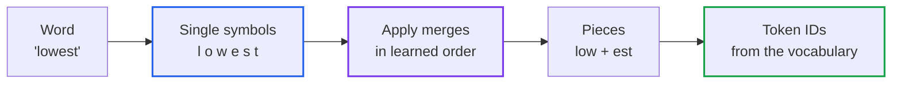
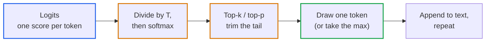

# Lesson 01: How Text Becomes Tokens, and Tokens Become Text: Byte-Pair Encoding (BPE) and Sampling

> **Tier**: `🟡 Engineering Depth` | **Read time**: ~22 min | **Prerequisites**: [Lesson 00: What Is a Large Language Model?](./00-what-is-an-llm.md)  
> **Core Concept**: A model never sees your text. It sees a row of integers produced by a fixed splitting scheme, and it answers with a score for every possible next integer. This lesson shows how the splitting scheme (byte-pair encoding) works, why it makes some text cost far more than other text, and how those scores become the next token.  
> **New AI terms introduced**: vocabulary, token ID, subword, byte-pair encoding (BPE), logits, softmax, sampling, greedy decoding, top-k, top-p (and a deeper look at temperature)  
> **AI terms assumed from earlier lessons**: [large language model (LLM)](./00-what-is-an-llm.md), [prompt](./00-what-is-an-llm.md), [token](./00-what-is-an-llm.md), [tokenizer](./00-what-is-an-llm.md), [context window](./00-what-is-an-llm.md), [temperature](./00-what-is-an-llm.md)

---

## 🎯 What You Will Learn

- Explain how a tokenizer builds its list of pieces, and trace one word through it by hand.
- Predict which inputs cost more tokens than they look: extra spaces, formatted numbers, code, and non-English text.
- Turn a model's raw scores into probabilities, and say what temperature, top-k and top-p each change.
- Count tokens exactly before you send a request, and avoid cutting text in the wrong place.

---

## 1. The Problem

Lesson 00 said that limits and prices are counted in tokens. Here is what that means in practice. The same sentence, "The refund policy allows returns within thirty days", was measured in English, Spanish and Hindi with two OpenAI tokenizers (code in section 4). The English version is 9 tokens. The Hindi version, with the same meaning, is 53 tokens on the older tokenizer and 15 on the newer one.

If your budget, latency and context window are all counted in tokens, then the language a user writes in changes the price of the identical request. Two more surprises come from the same place: an extra space in a prompt template changes the tokens, and `1,000,000` is split into five pieces while a plain word is one. Finally, two calls with identical input can differ, because the last step is a dice roll whose shape you control.

| You know | Tokenization reality |
|---|---|
| A string is an array of characters you can index | The model receives an array of integers. There is no string inside it |
| Encoding is lossless and obvious (UTF-8) | Tokenization is lossless too, but the split points are learned from data, not from grammar |
| A config flag either is on or off | Sampling settings reshape a probability distribution, so they change quality and repeatability together |

## 2. The Mental Model

🧒 **Think of a shop that sells Lego bricks, where the brick catalogue is fixed before the shop opens.** Every brick in the catalogue has a number. To build any word, you snap together bricks from the catalogue and write down their numbers. Common words are single bricks. A rare word is built from a few smaller bricks. Anything the catalogue has never seen is built from the tiniest bricks of all, single bytes, so anything can still be built. The model only ever receives the list of numbers.

A tiny example: with a catalogue that holds `un`, `break` and `able`, the word "unbreakable" becomes three bricks: `un`, `break`, `able`. A real tokenizer splits it exactly this way (verified in section 4).

**Where this analogy breaks**: A real catalogue is not designed by a person who understands words. Instead, an algorithm counts how often letter pairs appear together. This means pieces rarely match human syllables, and the catalogue skews heavily toward whatever training text was counted.

## 3. How It Works, One Term at a Time

### The vocabulary, token IDs and subwords

Why not split by word, or by character? Both fail in opposite directions.

- **One piece per word** needs a catalogue that never ends: typos, code identifiers like `getUserById`, names, and every inflection. Any word missing from the catalogue becomes an "unknown" marker and its meaning is lost.
- **One piece per character** never runs out of pieces, but the sequences become long. A 12,000-character document is 12,000 pieces. The model works on all of them at once and the context window fills quickly.

The compromise is pieces in the middle.

* 🧒 **The Analogy**: Standard Lego bricks. Frequent combinations come pre-moulded; rare ones are snapped together.
* ⚙️ **The Engineering**: The **vocabulary** is the fixed list of all tokens a tokenizer can produce. Each entry has a **token ID**, its integer position in that list. A **subword** is a token that is shorter than a word, such as `un`, `break` or `able`. Vocabulary size is chosen when the tokenizer is built. For example, `cl100k_base` has 100,277 entries and `o200k_base` has 200,019 *(measured in section 4 with tiktoken 0.14.0)*. The model stores one row of numbers per token ID, in a lookup table often called an *embedding table* (Phase 02 covers what those rows mean). Table size grows linearly with vocabulary size, which is one reason vocabularies are not simply made enormous.
* ⚠️ **What happens if you skip this?** You assume one word or one character is one token, and your limit checks and cost forecasts are wrong by a factor that changes with language and content.

The memory cost of that table is easy to derive. The hidden width below is an *(illustrative)* value, and 2 bytes per number is one common storage choice:

```text
table size ≈ vocabulary size × numbers per row × bytes per number
           ≈ 128,000 × 4,096 × 2 bytes
           ≈ 1,048,576,000 bytes ≈ 1.05 GB  (illustrative)
```

### Byte-pair encoding (BPE): building the vocabulary by counting

* 🧒 **The Analogy**: Watch which two letters always appear together in a pile of text and glue them into one piece. Then look again, and glue the next most common pair. Repeat until you have as many pieces as you wanted.
* ⚙️ **The Engineering**: **Byte-pair encoding (BPE)** builds the vocabulary from a large text collection in this loop:
  1. Start with a vocabulary of single symbols. Modern tokenizers start with all 256 possible byte values, so every possible input can be represented and nothing is ever "unknown". The toy code in section 4 starts from characters to stay readable.
  2. Count every pair of neighbouring symbols in the text.
  3. Merge the most frequent pair into one new symbol, record the merge, and add the symbol to the vocabulary.
  4. Repeat from step 2 until the vocabulary reaches its target size.

  At encode time the tokenizer starts from single symbols and applies the recorded merges in the order they were learned. The order is the whole algorithm: earlier merges are more frequent pairs and win. BPE was introduced for machine translation to handle rare words as sequences of subword units ([Sennrich, Haddow and Birch, 2015](https://arxiv.org/abs/1508.07909)). Decoding is the reverse and is lossless: concatenate the pieces for each ID.
* ⚠️ **What happens if you skip this?** The odd behaviour below looks random. Once you know the vocabulary comes from frequency counts over a particular text collection, it is predictable: what that text contained a lot of is cheap, and the rest is expensive.

### Diagram 1: Encoding one word



1. **Word** arrives, here from the toy tokenizer in section 4.
2. **Single symbols**: the word is split into its smallest pieces.
3. **Apply merges**: each learned pair is joined if it is present, earliest-learned first.
4. **Pieces**: what is left when no learned pair remains.
5. **Token IDs**: each piece is looked up in the vocabulary. These integers are what the model receives.

### Three consequences that show up in production

Because the vocabulary is built by frequency counts, three behaviours follow. All counts below were measured in section 4.

**Spaces belong to the next word.** Modern tokenizers glue a leading space onto the word after it, so `Hello` and ` Hello` are different tokens with different IDs. One extra space is not free: `"  Hello"` (two spaces) becomes two tokens, a bare space followed by ` Hello`. In prompt templates built with f-strings, an accidental double space changes what the model sees. It rarely breaks anything by itself, but it can shift output. Normalise whitespace at template boundaries and keep it identical between test and production.

**Numbers are cut at arbitrary places.** `1,000,000` becomes five tokens (`1`, `,`, `000`, `,`, `000`). `1000000` becomes three (`100`, `000`, `0`). `1234567` becomes `123`, `456`, `7`. Digits are grouped by frequency, not by place value. Formatted numbers cost more than plain ones, and models can be unreliable at digit-level arithmetic, so compute totals in code.

**Text unlike the training text costs more.** Pieces exist for what the tokenizer's source text contained often. Less common scripts and rare words fall back to shorter pieces, down to single bytes. A script like Devanagari uses 3 bytes per character in UTF-8, so a character can cost up to three tokens on an older vocabulary.

| Same sentence, same meaning | cl100k_base tokens | o200k_base tokens |
|---|---|---|
| English: 52 characters | 9 | 9 |
| Spanish: 69 characters | 18 | 13 |
| Hindi: 53 characters, 139 bytes | 53 | 15 |

The sentence is "The refund policy allows returns within thirty days." and its translations. Ratios against English are derived, not quoted:

```text
Spanish: 18 / 9 ≈ 2.0×  (cl100k_base)    13 / 9 ≈ 1.4×  (o200k_base)
Hindi:   53 / 9 ≈ 5.9×  (cl100k_base)    15 / 9 ≈ 1.7×  (o200k_base)
```

This is one sentence per language, so treat the ratios as an example of the effect, not a rule. Measure your own traffic. A newer vocabulary can cut the multiplier a lot, and the tokenizer is part of the model you pick, so switching models changes your token counts. Code is sensitive too, so count on real files.

### From scores to the next token: logits, softmax and sampling

After reading the token IDs, the model produces one raw score for every entry in the vocabulary. These raw scores are called **logits**. They can be any real number, positive or negative, and they do not add up to anything. To pick a token, the serving software does three things.

* 🧒 **The Analogy**: A talent show where every token gets a raw judge score. First convert scores into a share of the audience vote (softmax). Optionally remove the long tail of hopeless acts (top-k, top-p). Then draw one winner at random, weighted by the votes (sampling).
* ⚙️ **The Engineering**:
  - **Softmax** converts logits into probabilities that are positive and sum to 1. Temperature (Lesson 00) divides the logits first:

    ```text
    P(token i) = exp(z_i / T) / Σ_j exp(z_j / T)

    z_i : the logit (raw score) for token i
    T   : temperature. T < 1 sharpens, T > 1 flattens, T → 0 approaches "always the top score"
    ```

  - **Sampling** means drawing the next token at random, with chance proportional to its probability. Because it is a random draw, two runs can differ.
  - **Greedy decoding** means always taking the highest-scoring token. Many APIs treat temperature 0 as this mode, because dividing by zero is not defined. Check your provider's documentation for what its value 0 means.
  - **Top-k** keeps only the `k` most probable tokens and redistributes their probability among themselves.
  - **Top-p** (also called nucleus sampling) keeps the smallest group of top tokens whose probabilities add up to at least `p`. If one token has 95% probability and p = 0.9, only that token survives. If twenty tokens are equally likely, all twenty may survive. So top-p adapts to how sure the model is, while top-k does not.
* ⚠️ **What happens if you skip this?** You set temperature high for a "creative" feature and get off-topic text, or set it low for extraction and assume the output is now deterministic. Temperature only reshapes the distribution; it does not remove the model's uncertainty.

### Diagram 2: The sampling pipeline



1. **Logits**: the model's raw scores for every token in the vocabulary.
2. **Divide by T, then softmax**: turns scores into probabilities. Temperature acts here.
3. **Top-k / top-p**: optional trimming of unlikely tokens. The survivors are rescaled to sum to 1.
4. **Draw one token**: a random draw, or simply the top token in greedy mode.
5. **Append and repeat**: the chosen token is added to the text, and the loop from Lesson 00 runs again.

## 4. Try It (Runnable)

### A. A toy BPE tokenizer (standard library and Pydantic only)

This learns merges from a tiny text and encodes two unseen words with them. Real tokenizers do the same with bytes and vast text.

```python
from collections import Counter

from pydantic import BaseModel


class BPEModel(BaseModel):
    merges: list[tuple[str, str]]  # in the order they were learned
    vocab: dict[str, int]  # token text -> token ID


def train_bpe(text: str, num_merges: int) -> BPEModel:
    """Learn merges from text. Start from single characters (real BPE starts from bytes)."""
    words = [list(w) for w in text.split()]
    vocab = {ch: i for i, ch in enumerate(sorted({c for w in words for c in w}))}
    merges: list[tuple[str, str]] = []
    for _ in range(num_merges):
        pairs = Counter(p for w in words for p in zip(w, w[1:]))
        if not pairs:
            break
        best = pairs.most_common(1)[0][0]  # ties: first seen wins
        merges.append(best)
        vocab["".join(best)] = len(vocab)
        for w in words:
            i = 0
            while i < len(w) - 1:
                if (w[i], w[i + 1]) == best:
                    w[i : i + 2] = ["".join(best)]
                else:
                    i += 1
    return BPEModel(merges=merges, vocab=vocab)


def encode(model: BPEModel, word: str) -> list[int]:
    """Apply the learned merges in learned order, then look up IDs."""
    pieces = list(word)
    for a, b in model.merges:
        i = 0
        while i < len(pieces) - 1:
            if (pieces[i], pieces[i + 1]) == (a, b):
                pieces[i : i + 2] = [a + b]
            else:
                i += 1
    unknown = [p for p in pieces if p not in model.vocab]
    if unknown:
        raise KeyError(f"characters outside the base vocabulary: {unknown}")
    print("  pieces:", pieces)
    return [model.vocab[p] for p in pieces]


corpus = "low low low low lower lower newest newest newest widest widest"
model = train_bpe(corpus, num_merges=8)
print("merges:", model.merges)
for word in ["lowest", "newer"]:
    print(word, "->", encode(model, word))
```

Expected output (verified by running the block with Python 3.14.7 and Pydantic 2.13.5):

```text
merges: [('l', 'o'), ('lo', 'w'), ('e', 's'), ('es', 't'), ('n', 'e'), ('ne', 'w'), ('new', 'est'), ('low', 'e')]
  pieces: ['low', 'est']
lowest -> [11, 13]
  pieces: ['new', 'e', 'r']
newer -> [15, 1, 6]
```

What to notice: "lowest" never appeared in the training text, yet it encodes as `low` + `est`, both learned from other words. "newer" ends as `new`, `e`, `r` because no merge for `e`+`r` was learned. A character outside the base vocabulary raises an error here; real byte-level BPE cannot hit that case.

### B. Logits to a token (standard library and Pydantic only)

```python
import math

from pydantic import BaseModel


class Candidate(BaseModel):
    token: str
    probability: float


def softmax(logits: dict[str, float], temperature: float = 1.0) -> list[Candidate]:
    if temperature <= 0:
        raise ValueError("temperature must be > 0 (greedy decoding is a separate branch)")
    peak = max(logits.values())  # subtract the max for numerical stability
    exps = {t: math.exp((z - peak) / temperature) for t, z in logits.items()}
    total = sum(exps.values())
    ranked = sorted(exps.items(), key=lambda kv: -kv[1])
    return [Candidate(token=t, probability=round(e / total, 3)) for t, e in ranked]


def top_k(cands: list[Candidate], k: int) -> list[Candidate]:
    return cands[:k]


def top_p(cands: list[Candidate], p: float) -> list[Candidate]:
    kept: list[Candidate] = []
    running = 0.0
    for c in cands:  # already sorted high to low
        kept.append(c)
        running += c.probability
        if running >= p:
            break
    return kept


def renormalise(cands: list[Candidate]) -> list[Candidate]:
    total = sum(c.probability for c in cands)
    return [Candidate(token=c.token, probability=round(c.probability / total, 3)) for c in cands]


def show(label: str, cands: list[Candidate]) -> None:
    print(f"{label:<22}", [(c.token, c.probability) for c in cands])


logits = {"cat": 4.0, "dog": 3.5, "fish": 2.0, "rug": 1.0, "bone": 0.5, "zebra": -1.0}
show("T=1.0", softmax(logits, 1.0))
show("T=0.5", softmax(logits, 0.5))
show("T=2.0", softmax(logits, 2.0))
base = softmax(logits, 1.0)
show("T=1.0 + top-k 3", renormalise(top_k(base, 3)))
show("T=1.0 + top-p 0.9", renormalise(top_p(base, 0.9)))
print("greedy pick:", max(logits, key=logits.__getitem__))
```

Expected output (verified by running the block with Python 3.14.7 and Pydantic 2.13.5):

```text
T=1.0                  [('cat', 0.547), ('dog', 0.332), ('fish', 0.074), ('rug', 0.027), ('bone', 0.017), ('zebra', 0.004)]
T=0.5                  [('cat', 0.72), ('dog', 0.265), ('fish', 0.013), ('rug', 0.002), ('bone', 0.001), ('zebra', 0.0)]
T=2.0                  [('cat', 0.381), ('dog', 0.297), ('fish', 0.14), ('rug', 0.085), ('bone', 0.066), ('zebra', 0.031)]
T=1.0 + top-k 3        [('cat', 0.574), ('dog', 0.348), ('fish', 0.078)]
T=1.0 + top-p 0.9      [('cat', 0.574), ('dog', 0.348), ('fish', 0.078)]
greedy pick: cat
```

What to notice: halving T pushes "cat" from 0.547 to 0.72, and doubling it lifts "zebra" from 0.004 to 0.031. Top-p 0.9 kept three tokens because 0.547 + 0.332 = 0.879 is still below 0.9.

### C. Measure real tokenizers (optional, needs a third-party package and network)

```python
# requires: tiktoken  (pip install tiktoken; downloads vocabulary files on first use)
import tiktoken

enc = tiktoken.get_encoding("o200k_base")
samples = {
    "English": "The refund policy allows returns within thirty days.",
    "Spanish": "La politica de reembolso permite devoluciones dentro de treinta dias.",
    "Hindi": "रिफंड नीति तीस दिनों के भीतर वापसी की अनुमति देती है।",
}
for name in ("cl100k_base", "o200k_base"):
    enc = tiktoken.get_encoding(name)
    print(name, "vocabulary size:", enc.n_vocab)
    for lang, text in samples.items():
        print(f"  {lang:<8} chars={len(text):>3} bytes={len(text.encode()):>3} tokens={len(enc.encode(text)):>3}")
    for s in ("Hello", " Hello", "  Hello", "1,000,000", "1000000"):
        print("  ", repr(s), "->", [enc.decode([i]) for i in enc.encode(s)])
```

Expected output (verified by running the block with Python 3.14.7 and tiktoken 0.14.0):

```text
cl100k_base vocabulary size: 100277
  English  chars= 52 bytes= 52 tokens=  9
  Spanish  chars= 69 bytes= 69 tokens= 18
  Hindi    chars= 53 bytes=139 tokens= 53
   'Hello' -> ['Hello']
   ' Hello' -> [' Hello']
   '  Hello' -> [' ', ' Hello']
   '1,000,000' -> ['1', ',', '000', ',', '000']
   '1000000' -> ['100', '000', '0']
o200k_base vocabulary size: 200019
  English  chars= 52 bytes= 52 tokens=  9
  Spanish  chars= 69 bytes= 69 tokens= 13
  Hindi    chars= 53 bytes=139 tokens= 15
   'Hello' -> ['Hello']
   ' Hello' -> [' Hello']
   '  Hello' -> [' ', ' Hello']
   '1,000,000' -> ['1', ',', '000', ',', '000']
   '1000000' -> ['100', '000', '0']
```

`tiktoken` is OpenAI's open-source BPE tokenizer ([README](https://github.com/openai/tiktoken)). Its counts only apply to models that use it. Other providers ship their own tokenizer, so use the counting tool they document.

A longer cost-profiling example lives in [`examples/token_profiler.py`](./examples/token_profiler.py), and the [capstone](./labs/capstone-token-economics-analyzer.md) extends it.

## 5. Trade-Offs

| Choice | Benefit | Cost |
|---|---|---|
| Larger vocabulary | Fewer tokens per text (shown above: 53 down to 15 for the Hindi sentence) | Bigger lookup table and larger output score list (derived: about 1.05 GB for the illustrative 128,000 × 4,096 case) |
| Smaller vocabulary | Smaller table | Longer token sequences, so more context window used per document |
| Byte-level fallback | Any input can be encoded, no "unknown" marker | Rare text splits into many small pieces |
| Lower temperature | More repeatable output | Less varied, can loop or repeat |
| Higher temperature | More varied output | More off-target tokens, more invented detail |
| Top-p or top-k trimming | Cuts unlikely tokens that cause off-topic drift | Can also cut a correct but unlikely token |

For structured output such as JSON, a low temperature is a common starting point, not a guarantee. Validate against a schema either way.

## 6. Failure Modes

| Symptom | Likely cause | Fix |
|---|---|---|
| Requests from one region hit the length limit far more often | The tokenizer splits that language into many more pieces | Budget per language using measured counts, and re-measure when you change model |
| A cost forecast is off by a large factor | Estimated from words or characters | Count tokens with the provider's tokenizer, on real traffic |
| Output quality shifts after a prompt-template edit | Whitespace or punctuation changed the tokens | Normalise whitespace at boundaries and diff token lists in tests |
| Garbled characters at the edge of a chunk | A slice through the middle of a multi-byte character | Split on token boundaries, or on whole characters at minimum |
| Extracted numbers are wrong | Digits are split at arbitrary points | Compute in code and keep plain formatting in prompts |
| A test on identical input fails once in a while | Sampling is random, and some providers do not promise identical output at temperature 0 | Assert on validated structure, not exact text |

## 🧠 7. Quick Check to See if it Clicked

> A support tool sets a hard limit of 1,000 tokens per request. An English letter of about 600 words fits using roughly 800 tokens *(illustrative)*. A customer sends the same letter in Hindi and the request is rejected. A product manager assumes the translator added thousands of words. Was that the cause, and what would you do?

<details>
<summary><b>View answer</b></summary>

No. Translation does not add thousands of words. The same meaning simply takes more tokens in some languages, because the tokenizer's vocabulary holds fewer whole pieces for that script. In our measurement on one sentence, the older tokenizer used 53 tokens for Hindi against 9 for English (about 5.9×), and the newer one used 15 (about 1.7×). Count tokens for both letters with the provider's tokenizer, then set per-language budgets from measured counts, trim the input, or choose a model whose tokenizer handles the language better. Re-measure after any model change.
</details>

## 8. Key Takeaways

- The model receives token IDs from a fixed vocabulary, never text. Byte-pair encoding builds that vocabulary by repeatedly merging the most frequent neighbouring pair.
- Whitespace, number formatting, code and language change token counts, so measure with the real tokenizer instead of estimating from words.
- Logits are raw scores. Softmax turns them into probabilities. Temperature, top-k and top-p reshape or trim that distribution before one token is drawn.
- Low temperature reduces variation but does not guarantee identical output. Validate output instead of assuming it.

**Sources opened for this lesson**
- [Neural Machine Translation of Rare Words with Subword Units (Sennrich, Haddow, Birch, 2015)](https://arxiv.org/abs/1508.07909): introduces subword units via BPE for open-vocabulary translation.
- [tiktoken README](https://github.com/openai/tiktoken): BPE tokenizer for OpenAI models, lists the `cl100k_base` and `o200k_base` encodings.
- Token counts and vocabulary sizes above were measured by running tiktoken 0.14.0 on 2026-09-30.

---

## 🧭 Navigation
- **[← Previous Lesson: What Is a Large Language Model?](./00-what-is-an-llm.md)**
- **[Phase 00 Hub](./README.md)**
- **[Next Lesson: Transformer and Hardware Physics →](./02-transformer-and-hardware-physics.md)**
- **[Capstone Lab: Token Economics Analyzer](./labs/capstone-token-economics-analyzer.md)**
