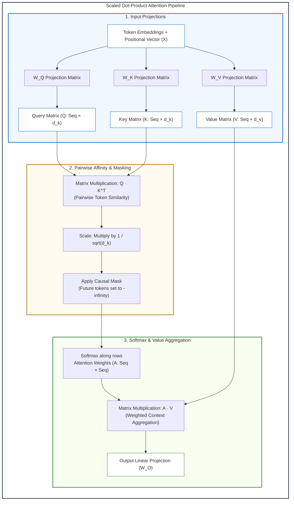
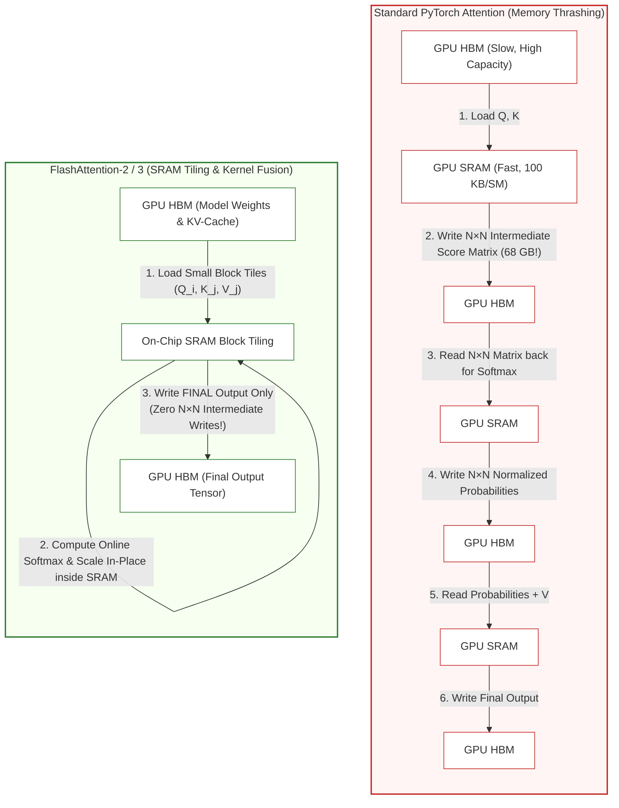

# Lesson 01: Transformer Inference & Hardware Realities

`HIGH ROI / CORE` · *Phase 00: Foundations & Token Mechanics* · *Estimated Reading Time: 13 minutes*

---

## What You Will Learn

By the end of this lesson, you will understand:
- Why LLM inference is fundamentally limited by GPU memory bandwidth rather than raw compute FLOPS.
- The physical memory hierarchy of modern AI accelerators (HBM3 vs. on-chip SRAM).
- The arithmetic intensity of transformer operations and the Roofline Model.
- How the scaled dot-product attention mechanism maps to hardware tensors.
- Why standard attention suffers from catastrophic memory thrashing and how FlashAttention resolves it.
- How to profile arithmetic intensity and predict whether your workload will be compute-bound or memory-bound.

---

## 1. The Problem: The 2:00 AM VRAM Crisis

Imagine deploying your first self-hosted Large Language Model (LLM) to production. You provision an NVIDIA H100 GPU boasting 80 GB of High-Bandwidth Memory (HBM3) and nearly 2,000 TFLOPS of 16-bit tensor compute. You load an 8-billion parameter model (such as LLaMA-3.1-8B), which requires roughly 16 GB of VRAM for its FP16 weights.

You open the service to traffic. During light testing with 5 concurrent requests, the service responds in milliseconds. But at 2:00 AM, a sudden spike of 80 concurrent users sending long customer-support transcripts hits the gateway. 

Your monitoring dashboard displays a baffling contradiction:
- **GPU Compute Utilization (SMs)**: Barely hovering at 22%.
- **GPU Memory Usage**: 100% (80 GB / 80 GB).
- **Process Status**: `CUDA Out of Memory (OOM)`. The server process crashed and Kubernetes entered a crash loop.

```text
torch.cuda.OutOfMemoryError: CUDA out of memory. Tried to allocate 2.40 GiB 
(GPU 0; 79.15 GiB total capacity; 74.82 GiB already allocated; 1.20 GiB free; 
76.50 GiB reserved in total by PyTorch)
```

Why did an 80 GB GPU run out of memory serving an 8B model while its compute cores were idling? 

To answer this question, you must unlearn how standard web services consume hardware resources. An LLM is not a CPU microservice executing synchronous business logic; it is a massive tensor graph whose performance is governed by the physical laws of GPU memory bandwidth.

---

## 2. Why Naive Approaches Fail

When senior backend engineers first encounter LLM performance issues, they typically attempt standard systems optimizations:

1. **Adding More Compute (Scaling Up FLOPS)**: Moving from an NVIDIA A10G (31 TFLOPS FP16) to an H100 (1,979 TFLOPS FP16) costs 5x more, yet generation speed for a single user only increases by 2x to 3x. Raw compute does not solve the decode bottleneck.
2. **Horizontal Pod Autoscaling (HPA) on CPU/Memory Metrics**: Standard Kubernetes HPAs scale on CPU utilization or average memory. But GPU memory behaves discontinuously: memory allocations for active sessions balloon as tokens are generated, causing sudden cliff-edge OOMs before the metrics server triggers a pod scale-up.
3. **In-Memory Object Caching**: Attempting to cache intermediate transformer activations in Redis or host RAM introduces PCIe bus transfer bottlenecks (64 GB/s on PCIe Gen 5) that are orders of magnitude slower than on-device GPU memory (3,350 GB/s on HBM3).

---

## 3. Systems Mental Model & The Memory Bandwidth Wall

---

### The Super-Fast Chef & The Narrow Pantry Doorway

* 🧒 **The Analogy**:
  * Imagine a master chef who can chop vegetables and dice meat at superhuman speed (finishing any task in 0.001 seconds).
  * However, every single ingredient is kept down a long hallway in a deep-freeze pantry.
  * Every time the chef needs to cook one pea (emit one token), an assistant must run down the hallway, load a 140-kilogram cart of cookbooks and raw ingredients, push it through a narrow doorway, let the chef glance at it for a microsecond, and haul it all back.
  * The chef is not tired; the chef is bored out of their mind waiting for the cart to arrive! That narrow hallway is your **GPU Memory Bus**.

* ⚙️ **The Engineering Mechanics**:
  * Systems architects evaluate hardware performance using the **Roofline Model**, which compares two values:
    1. **Peak Compute Throughput**: How many floating-point operations the GPU cores can execute per second (TFLOPS).
    2. **Peak Memory Bandwidth**: How many bytes the GPU memory bus can transfer per second (TB/s).
  * The ratio between the two defines the **Operational Intensity Balance Point**:
    ```text
    Balance Point (FLOPs / Byte) = Peak Theoretical TFLOPS / Peak Memory Bandwidth (TB/s)
    ```
  * For an NVIDIA H100 SXM5:
    ```text
    Balance Point = 1,979 TFLOPS / 3.35 TB/s ≈ 590.7 FLOPs per Byte
    ```
  * **Compute-Bound**: If your calculation performs **more than 591 math operations** for every byte of data loaded from VRAM, the GPU tensor cores are the bottleneck. Math speed limits execution.
  * **Memory-Bound**: If your calculation performs **fewer than 591 math operations** for every byte loaded, the memory bus is the bottleneck. The compute cores spend over 95% of their time idling.

* ⚠️ **What Happens If You Ignore This?**
  * You spend thousands of dollars upgrading to a GPU with 10x more compute cores (TFLOPS), expecting your single-user chatbot to stream 10x faster.
  * Instead, generation speed barely budges because single-token autoregressive decoding has an arithmetic intensity of roughly **1.0 FLOP/Byte**—orders of magnitude below the 591 FLOPs/Byte threshold. It is 100% memory-bandwidth bound!

---

## 4. The Silicon Hierarchy: SRAM vs. HBM3

A modern GPU is not a uniform block of silicon. It is a strictly tiered memory engine:

```text
+-----------------------------------------------------------------------+
| GPU Silicon Die                                                       |
|                                                                       |
|  +--------------------+   SRAM Transfer    +-----------------------+  |
|  | Streaming          | <----------------> | On-Chip SRAM (L1/L2)  |  |
|  | Multiprocessors    |    (~30 TB/s)      | ~50 MB - 100 MB       |  |
|  | (Tensor Cores)     |                    | Latency: ~1-5 ns      |  |
|  +--------------------+                    +-----------------------+  |
|           ^                                            ^              |
+-----------|--------------------------------------------|---------------+
            |                                            |
            | HBM Memory Bus (~3.35 TB/s, Latency: ~100-200 ns)          
            v                                            v              
+-----------------------------------------------------------------------+
| High-Bandwidth Memory (HBM3)                                          |
| Capacity: 80 GB - 144 GB                                              |
| Stores: Model Weights, In-Flight KV-Cache, System Buffers             |
+-----------------------------------------------------------------------+
```

| Memory Tier | Typical Capacity | Peak Bandwidth | Relative Latency | Role in LLM Serving |
|---|---|---|---|---|
| **Register File / SRAM** | ~50 MB – 100 MB | ~30 TB/s | ~1 ns (1 clock cycle) | Holds active tiles for immediate matrix math |
| **High-Bandwidth Memory (HBM3)** | 80 GB – 144 GB | ~3.35 TB/s | ~100–200 ns | Stores static model weights and dynamic KV cache |
| **Host CPU RAM (DDR5)** | 512 GB – 2 TB | ~100–200 GB/s | ~100 ns (plus PCIe bus) | Offloads cold weights or system buffers |
| **PCIe Bus (Gen 5 x16)** | N/A | ~64 GB/s | High serialization | Moves prompts and generated tokens between host and GPU |

When an LLM generates text one token at a time (the **decode phase**), it must load every single parameter of the model from HBM into the compute registers just to calculate the probabilities for that one token. 

For a 70-billion parameter model in 16-bit precision:
- **Bytes read per token**: 70 billion parameters × 2 bytes = **140 Gigabytes**.
- **On an NVIDIA H100 (3.35 TB/s bandwidth)**: 
  ```text
  Minimum time to read weights once = 140 GB / 3,350 GB/s ≈ 0.0418 seconds (41.8 ms)
  Theoretical Maximum Decode Speed = 1 / 0.0418 ≈ 24 tokens per second (for batch size = 1)
  ```

Notice that we did not even mention how many FLOPs the GPU can execute! The computation finishes in microseconds; the rest of the 41.8 milliseconds is spent waiting for memory lines to cross the HBM bus.

---

## 5. The Scaled Dot-Product Attention Pipeline

At the core of the transformer architecture (Vaswani et al., 2017) is the attention mechanism. It allows every token in an input sequence to dynamically compare itself against every other token in the sequence.

---

### The Flashlight in a Dark Room

* 🧒 **The Analogy**:
  * Imagine you are reading a mystery novel in a pitch-black room with a small flashlight.
  * When you encounter the word *"She"*, you shine your flashlight back across previous sentences to see which character it points to: *"Alice"*, *"the detective"*, or *"the suspect"*.
  * The brighter you shine your light on *"Alice"*, the more of Alice's context you pull into understanding what *"She"* is doing.
  * In a transformer, the **Query** is the flashlight beam, the **Key** is the reflective badge each word wears, and the **Value** is the actual meaning stored behind that badge.

* ⚙️ **The Engineering Mechanics**:
  * The input token activations (`X`) are projected into three separate tensors via learned weight matrices (`W_Q`, `W_K`, `W_V`):
    1. **Query (Q)**: What each token is currently searching for.
    2. **Key (K)**: What descriptors each token advertises to others.
    3. **Value (V)**: The semantic content each token delivers if matched.



### Walkthrough of the Attention Pipeline:
1. **Projection**: The input activation matrix `X` is multiplied by three learned projection matrices (`W_Q`, `W_K`, `W_V`) to yield the Query (`Q`), Key (`K`), and Value (`V`) tensors.
2. **Similarity Scoring (`Q · K^T`)**: Queries and keys are multiplied together. For a sequence of length `N`, this produces an `N × N` square score matrix containing pairwise affinities between all tokens.
3. **Scaling & Causal Masking**: Scores are divided by `sqrt(d_k)` to prevent large values from saturating the softmax function. In autoregressive models, an upper-triangular causal mask sets future token positions to `-infinity` so tokens cannot see future answers.
4. **Softmax & Value Aggregation**: Softmax converts each row of masked scores into normalized probabilities (`A`). Multiplying `A` by `V` produces the final context-weighted vector representation for every token.

### The Attention Formula:
```text
Attention(Q, K, V) = softmax( (Q · K^T) / sqrt(d_k) + Mask ) · V
```

* ⚠️ **What Happens If You Ignore This?**
  * Notice the `N × N` square matrix created in Step 2. If your sequence length `N` is 32,768 tokens, `N × N` equals **1.07 billion numbers per attention head**.
  * Across 32 attention heads, just writing down these temporary score tables consumes **68.5 Gigabytes of VRAM** for a single request!

---

## 6. FlashAttention: IO-Aware Tiling

Notice the critical hardware bottleneck identified above: the `N × N` attention score matrix.

In standard PyTorch implementations prior to 2022, the GPU repeatedly wrote and read these massive `N × N` matrices back and forth between High-Bandwidth Memory (HBM) and SRAM, causing catastrophic memory thrashing.

---

### Doing Scratch Math on a Sticky Note

* 🧒 **The Analogy**:
  * Imagine you have to multiply two 1,000-page ledgers of numbers.
  * **The Dumb Way (Standard Attention)**: For every single calculation, you write down a 1,000-page intermediate notebook on the desk, carry the whole notebook down the hall to the filing cabinet, file it, immediately walk back to the filing cabinet, pull it back out, and read it again. You spend all your time walking down the hall.
  * **The Smart Way (FlashAttention)**: You bring a small sticky note to your desk. You take 10 numbers at a time, do the math directly on the sticky note, keep a running total, erase the sticky note, and only write down the final answer in the master archive!

* ⚙️ **The Engineering Mechanics**:
  * FlashAttention (Dao et al., 2022) introduces **IO-Aware Tiling** and **Online Softmax**:
    1. It breaks the `Q`, `K`, and `V` matrices into small blocks that fit entirely inside the ultra-fast on-chip SRAM (e.g. 128 × 128 elements).
    2. Instead of computing the global softmax over the entire `N × N` matrix at once, it computes an incremental running softmax normalization in SRAM.
    3. It aggregates the Value vectors on the fly and writes **only the final output** back to HBM.
    4. Intermediate `N × N` attention score matrices are **never materialized in GPU HBM**.



### Walkthrough of the Memory Comparison:
1. **Standard Attention Thrashing**:
   - The GPU reads `Q` and `K` from HBM into SRAM.
   - It computes the `N × N` dot products and writes the full 68.5 GB matrix back to HBM.
   - It reads the 68.5 GB matrix from HBM back to SRAM to apply softmax, and writes it back to HBM.
   - It reads the normalized weights back along with `V`, performs the final multiplication, and writes the output back to HBM.
   - **Cost**: `O(N^2)` memory traffic crossing the memory bus, completely saturating bandwidth.
2. **FlashAttention IO-Aware Tiling**:
   - Divides `Q`, `K`, and `V` into small tiles that fit entirely inside fast SRAM.
   - Utilizes **Online Softmax** to incrementally compute normalization without ever materializing the global `N × N` matrix.
   - Computes the attention output locally in SRAM and writes **only the final result** back to HBM.
   - **Result**: Drops memory traffic from `O(N^2)` to `O(N)`, providing a **2x to 4x real-world speedup** and enabling 128k+ context windows.

---

### 📊 Standard Attention (2020) vs. FlashAttention-2 / 3 (2026)

| Architectural Dimension | Standard PyTorch Attention (2020) | FlashAttention-2 / 3 (2026) |
| :--- | :--- | :--- |
| **Intermediate Memory Traffic** | `O(N^2)` reads and writes crossing HBM bus | **`O(N)` reads/writes** (fused in SRAM) |
| **Intermediate VRAM Allocation** | Massive (68.5 GB for 32k context) | **Zero** (no intermediate matrices materialized) |
| **Prefill Speed (TTFT)** | Baseline (bottlenecked by memory writes) | **2x to 4x faster** execution |
| **Max Context Feasibility** | Hard ceiling at 4,000 – 8,000 tokens | **128,000 to 1,000,000+ tokens** |
| **Hardware Requirement** | Any GPU | Modern Tensor Core architectures (Ampere, Hopper, Blackwell) |

---

## 7. Concrete Scenario & Implementation: Hardware Profiler

Let's ground this theory in a concrete engineering tool. As an AI platform engineer, you need to calculate whether an incoming batch of requests will be compute-bound or memory-bound, and predict the exact time spent reading model weights versus executing math.

Here is a standalone, type-annotated Python 3.12 script using Pydantic v2 schemas:

```python
"""
Hardware Arithmetic Intensity & Roofline Analyzer for LLM Serving.
Calculates memory bus saturation and phase bottlenecks for transformer inference.
"""

from typing import Literal
from pydantic import BaseModel, Field


class AcceleratorSpec(BaseModel):
    """Hardware physical specifications for AI accelerator."""
    name: str
    peak_tflops_fp16: float = Field(..., description="Peak FP16 Tensor TFLOPS")
    memory_bandwidth_tb_s: float = Field(..., description="HBM memory bandwidth in TB/s")
    vram_capacity_gb: float = Field(..., description="Total VRAM in GB")

    @property
    def operational_intensity_boundary(self) -> float:
        """The critical arithmetic intensity threshold (FLOPs/Byte).
        Operations below this threshold are memory-bandwidth-bound.
        Operations above this threshold are compute-bound.
        """
        # (TFLOPS * 10^12) / (Bandwidth * 10^12) = FLOPs / Byte
        return self.peak_tflops_fp16 / self.memory_bandwidth_tb_s


class WorkloadPhaseProfile(BaseModel):
    """Inference execution profile for a specific batch and phase."""
    phase: Literal["prefill", "decode"]
    batch_size: int
    sequence_length: int
    model_params_billions: float
    bytes_per_param: float = 2.0  # FP16 = 2 bytes

    def calculate_metrics(self, hardware: AcceleratorSpec) -> dict[str, float | str]:
        total_params = self.model_params_billions * 1e9
        weight_bytes = total_params * self.bytes_per_param

        if self.phase == "prefill":
            # Prefill processes all prompt tokens in parallel
            total_tokens = self.batch_size * self.sequence_length
            # Forward pass FLOPs rule of thumb: ~2 FLOPs per parameter per token
            total_flops = 2.0 * total_params * total_tokens
            # Weights are read once for the entire batch
            memory_transferred_bytes = weight_bytes
            arithmetic_intensity = total_flops / memory_transferred_bytes

            compute_time_s = total_flops / (hardware.peak_tflops_fp16 * 1e12)
            memory_time_s = memory_transferred_bytes / (hardware.memory_bandwidth_tb_s * 1e12)
            execution_time_s = max(compute_time_s, memory_time_s)
            bound_regime = "Compute-Bound" if compute_time_s >= memory_time_s else "Memory-Bound"

        else:
            # Decode processes 1 single token per stream step
            total_tokens = self.batch_size * 1
            total_flops = 2.0 * total_params * total_tokens
            # Weights MUST be read from HBM for every single token step!
            memory_transferred_bytes = weight_bytes
            arithmetic_intensity = total_flops / memory_transferred_bytes

            compute_time_s = total_flops / (hardware.peak_tflops_fp16 * 1e12)
            memory_time_s = memory_transferred_bytes / (hardware.memory_bandwidth_tb_s * 1e12)
            execution_time_s = max(compute_time_s, memory_time_s)
            bound_regime = "Compute-Bound" if compute_time_s >= memory_time_s else "Memory-Bound"

        return {
            "phase": self.phase,
            "arithmetic_intensity_flops_per_byte": round(arithmetic_intensity, 2),
            "hardware_boundary_flops_per_byte": round(hardware.operational_intensity_boundary, 2),
            "regime": bound_regime,
            "compute_time_ms": round(compute_time_s * 1000, 3),
            "memory_time_ms": round(memory_time_s * 1000, 3),
            "effective_step_latency_ms": round(execution_time_s * 1000, 3),
        }


# --- Example Execution ---
if __name__ == "__main__":
    h100 = AcceleratorSpec(
        name="NVIDIA H100 SXM5",
        peak_tflops_fp16=1979.0,
        memory_bandwidth_tb_s=3.35,
        vram_capacity_gb=80.0,
    )

    print(f"Hardware: {h100.name}")
    print(f"Roofline Balance Point: {h100.operational_intensity_boundary:.1f} FLOPs/Byte\n")

    # 1. Prefill Scenario: 1 request with 2,048 prompt tokens on LLaMA-3-70B
    prefill_workload = WorkloadPhaseProfile(
        phase="prefill",
        batch_size=1,
        sequence_length=2048,
        model_params_billions=70.0,
    )
    prefill_res = prefill_workload.calculate_metrics(h100)
    print("=== PREFILL PHASE (2,048 Prompt Tokens) ===")
    for k, v in prefill_res.items():
        print(f"  {k}: {v}")

    print()

    # 2. Decode Scenario: Batch of 1 generating 1 output token on LLaMA-3-70B
    decode_workload = WorkloadPhaseProfile(
        phase="decode",
        batch_size=1,
        sequence_length=1,
        model_params_billions=70.0,
    )
    decode_res = decode_workload.calculate_metrics(h100)
    print("=== DECODE PHASE (1 Token, Batch Size 1) ===")
    for k, v in decode_res.items():
        print(f"  {k}: {v}")
```

### Script Output Analysis:
```text
Hardware: NVIDIA H100 SXM5
Roofline Balance Point: 590.7 FLOPs/Byte

=== PREFILL PHASE (2,048 Prompt Tokens) ===
  phase: prefill
  arithmetic_intensity_flops_per_byte: 2048.0
  hardware_boundary_flops_per_byte: 590.7
  regime: Compute-Bound
  compute_time_ms: 144.871
  memory_time_ms: 41.791
  effective_step_latency_ms: 144.871

=== DECODE PHASE (1 Token, Batch Size 1) ===
  phase: decode
  arithmetic_intensity_flops_per_byte: 1.0
  hardware_boundary_flops_per_byte: 590.7
  regime: Memory-Bound
  compute_time_ms: 0.071
  memory_time_ms: 41.791
  effective_step_latency_ms: 41.791
```

Look closely at the decode phase output:
- **Compute time required**: `0.071 ms`
- **Memory transfer time required**: `41.791 ms`
- The compute cores spend **99.8% of their time idling**, waiting for the 140 GB of model weights to stream across the memory bus!

---

## 8. Architectural Trade-offs & Alternatives

| Serving Architecture | Primary Benefit | Latency Impact | VRAM Footprint | Production Trade-off |
|---|---|---|---|---|
| **Standard Dense Attention (FP16)** | Maximum numerical fidelity | Baseline | Highest (`O(N^2)` attention weights) | Severe VRAM consumption; context windows limited to 4k–8k tokens |
| **FlashAttention-2 / 3** | Zero `N × N` writes; 2x–4x faster prefill | Substantial reduction in TTFT | Minimal intermediate memory overhead | Requires modern GPU architectures (Ampere, Hopper, Ada Lovelace); custom CUDA kernel dependencies |
| **Mixture of Experts (MoE)** | High parameter capacity with reduced active parameters | Fast decode latency (~2x faster than equivalent dense) | High static VRAM (must store all expert weights in memory) | Requires high VRAM capacity (e.g. Mixtral 8x7B needs 90 GB VRAM despite only using 13B parameters per token) |
| **Batch Size Scaling (Continuous Batching)** | Amortizes weight transfers across multiple concurrent users | Increases throughput (tokens/sec/GPU), slight penalty to individual latency | Requires dynamic KV-cache reservation per user stream | If memory saturates, incoming requests must be queued or evicted |

---

## 9. Common Failure Modes & Anti-Patterns

### Anti-Pattern 1: Sizing GPU Clusters Solely on Model Parameter Weight
- **The Mistake**: Assuming that because an 8B FP16 model takes 16 GB, it can easily run on a 24 GB NVIDIA RTX 4090 with 8 GB to spare for users.
- **Why It Fails**: The moment concurrent users submit 4,000-token requests, the dynamic KV cache consumes 1.5 GB per user. At 6 concurrent users, the GPU crashes with an unrecoverable CUDA OOM.
- **Production Remedy**: Always calculate `Total VRAM = Model Weights + Peak KV Cache (Max Batch × Max Context) + CUDA Overhead Buffer (20%)`.

### Anti-Pattern 2: Conflating Prefill Optimization with Decode Optimization
- **The Mistake**: Adding more Tensor Cores to improve tokens-per-second (TPS) for single-user interactive streaming.
- **Why It Fails**: Decode is bound by memory bandwidth, not compute. Doubling the TFLOPS leaves decode latency virtually unchanged unless memory bandwidth (GB/s) also increases.
- **Production Remedy**: To optimize decode TPS for individual users, utilize model quantization (FP8, INT4) to reduce the number of bytes that must cross the memory bus per forward pass.

---

## 10. Quick Check to See if it Clicked

> **Scenario**: An engineering team replaces an NVIDIA A10G GPU (31 TFLOPS FP16, 600 GB/s bandwidth) with an NVIDIA H100 GPU (1,979 TFLOPS FP16, 3,350 GB/s bandwidth) to run a single-user coding copilot with a 70B model.
>
> The team expects a **63x speedup** in token streaming generation speed because peak compute increased from 31 to 1,979 TFLOPS.
>
> In reality, single-user generation speed only increases from ~4.3 tokens/second to ~24 tokens/second (a **5.5x speedup**). The lead developer files a bug claiming the H100 is defective.
>
> **Question**: Is the GPU defective? Why did the streaming speed increase by only 5.5x instead of 63x?
>
> **Answer**: 
> 1. No, the GPU is functioning perfectly.
> 2. Single-user token decode has an arithmetic intensity of ~1.0 FLOP/Byte. It is 100% **memory-bandwidth bound**.
> 3. The math calculation takes virtually zero time; the generation speed is strictly constrained by how fast the 140 GB of model weights can be read from memory:
>    - A10G bandwidth: 600 GB/s → Max speed: 600 / 140 ≈ 4.3 tokens/sec.
>    - H100 bandwidth: 3,350 GB/s → Max speed: 3,350 / 140 ≈ 24 tokens/sec.
> 4. The speedup matches the memory bandwidth ratio exactly: `3,350 / 600 ≈ 5.58x`. The 63x compute increase is completely irrelevant for single-user decoding!

---

## 11. Key Takeaways

1. **Memory Bandwidth Governs Decode**: Generating text one token at a time requires loading all model weights from HBM to SRAM for every single token step. Single-stream decode is heavily memory-bound.
2. **Prefill vs. Decode Duality**: Prefill (reading the prompt) is parallel and compute-bound; decode (emitting tokens) is serial and memory-bandwidth-bound. You cannot optimize both with the same knob.
3. **FlashAttention Eliminates Memory Thrashing**: By computing attention in SRAM tiles using online softmax, FlashAttention drops memory traffic from `O(N^2)` to `O(N)`, making long contexts viable.
4. **VRAM Sizing Demands KV-Cache Math**: Static model weights are only the baseline. Concurrent users and long contexts will quickly exceed weight memory via dynamic KV activations.

---

## 12. Verified Resources

- **[Vaswani et al. (2017) — Attention Is All You Need](https://arxiv.org/abs/1706.03762)**: The foundational transformer paper detailing the scaled dot-product attention formulation.
- **[Dao et al. (2022) — FlashAttention: Fast and Memory-Efficient Exact Attention with IO-Awareness](https://arxiv.org/abs/2205.14135)**: Seminal paper detailing SRAM tiling and the elimination of intermediate attention matrices.
- **[Williams et al. (2009) — The Roofline Model](https://citeseerx.ist.psu.edu/document?repid=rep1&type=pdf&doi=10.1.1.157.9404)**: The theoretical foundation of arithmetic intensity and compute vs. memory bounds in hardware architectures.
- **Previous Lesson**: *None (Lesson 01 is the curriculum starting point)*
- **Next Lesson**: [Lesson 02: Tokenization & Byte-Pair Encoding (BPE)](./02-tokenization-and-bpe-mechanics.md)
