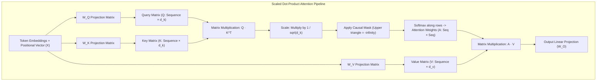
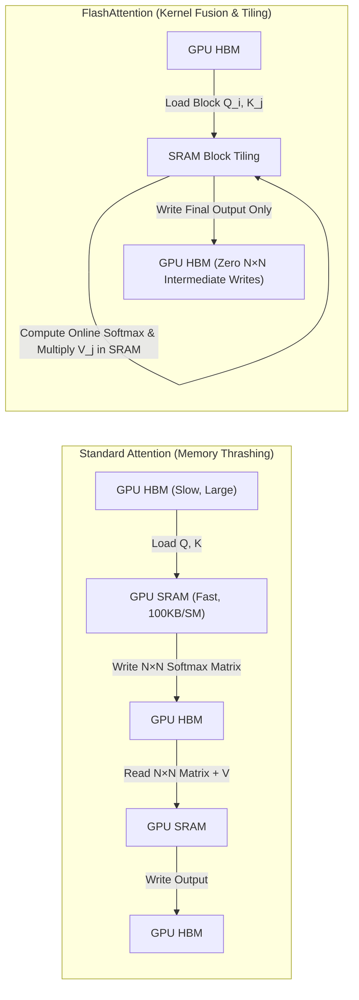

# Lesson 01: Transformer Inference & Hardware Realities

`🟢 Core` · *Phase 00: Foundations & Token Mechanics* · *Estimated Reading Time: 12 minutes*

---

## What You Will Learn

By the end of this lesson, you will understand:
- Why LLM inference is fundamentally limited by GPU memory bandwidth rather than raw compute FLOPS.
- The physical memory hierarchy of modern AI accelerators (HBM3 vs. on-chip SRAM).
- The arithmetic intensity of transformer operations and the Roofline Model.
- How the scaled dot-product attention mechanism maps to hardware tensors.
- Why standard attention suffers from memory thrashing and how FlashAttention resolves it.

---

## 1. The Problem: The 2:00 AM VRAM Crisis

Imagine deploying your first self-hosted Large Language Model (LLM) to production. You provision an NVIDIA H100 GPU boasting 80 GB of High-Bandwidth Memory (HBM3) and nearly 2,000 TFLOPS of 16-bit tensor compute. You load an 8-billion parameter model (such as LLaMA-3.1-8B), which requires roughly 16 GB of VRAM for its FP16 weights.

You open the service to traffic. During light testing with 5 concurrent requests, the service responds in milliseconds. But at 2:00 AM, a sudden spike of 80 concurrent users sending long customer-support transcripts hits the gateway. 

Your monitoring dashboard displays a baffling contradiction:
- **GPU Compute Utilization (SMs)**: Barely hovering at 22%.
- **GPU Memory Usage**: 100% (80 GB / 80 GB).
- **Process Status**: `CUDA Out of Memory (OOM)`. The server process crashed and Kubernetes entered a crash loop.

```text
torch.cuda.OutOfMemoryError: CUDA out of memory. Tried to allocate 2.40 GiB 
(GPU 0; 79.15 GiB total capacity; 74.82 GiB already allocated; 1.20 GiB free; 
76.50 GiB reserved in total by PyTorch)
```

Why did an 80 GB GPU run out of memory serving an 8B model while its compute cores were idling? 

To answer this question, you must unlearn how standard web services consume hardware resources. An LLM is not a CPU microservice executing synchronous business logic; it is a massive tensor graph whose performance is governed by the physical laws of GPU memory bandwidth.

---

## 2. Why Naive Approaches Fail

When senior backend engineers first encounter LLM performance issues, they typically attempt standard systems optimizations:

1. **Adding More Compute (Scaling Up FLOPS)**: Moving from an NVIDIA A10G (31 TFLOPS FP16) to an H100 (1,979 TFLOPS FP16) costs 5x more, yet generation speed for a single user only increases by 2x to 3x. Raw compute does not solve the decode bottleneck.
2. **Horizontal Pod Autoscaling (HPA) on CPU/Memory Metrics**: Standard Kubernetes HPAs scale on CPU utilization or average memory. But GPU memory behaves discontinuously: memory allocations for active sessions balloon as tokens are generated, causing sudden cliff-edge OOMs before the metrics server triggers a pod scale-up.
3. **In-Memory Object Caching**: Attempting to cache intermediate transformer activations in Redis or host RAM introduces PCIe bus transfer bottlenecks (64 GB/s on PCIe Gen 5) that are orders of magnitude slower than on-device GPU memory (3,350 GB/s on HBM3).

---

## 3. Why the Problem Exists: The Memory Bandwidth Wall

To understand GPU performance, systems architects rely on the **Roofline Model**, which relates two fundamental quantities:

1. **Arithmetic Intensity**: The ratio of compute work to memory traffic.
   ```text
   Arithmetic Intensity = Total Floating-Point Operations (FLOPs) / Total Memory Transferred (Bytes)
   ```
2. **Compute vs. Memory Bound Regimes**:
   - If an operation has **high** arithmetic intensity (hundreds of FLOPs per byte read), the GPU compute cores remain fully saturated. This is **compute-bound**.
   - If an operation has **low** arithmetic intensity (e.g. 1 FLOP per byte read), the compute cores spend 95% of their clock cycles stalled, waiting for numbers to arrive from memory. This is **memory-bandwidth-bound**.

### The GPU Silicon Hierarchy

A modern GPU is not a monolithic block of silicon. It is a hierarchical memory engine:

```text
+-----------------------------------------------------------------------+
| GPU Silicon Die                                                       |
|                                                                       |
|  +--------------------+   SRAM Transfer    +-----------------------+  |
|  | Streaming          | <----------------> | On-Chip SRAM (L1/L2)  |  |
|  | Multiprocessors    |    (~30 TB/s)      | ~50 MB - 100 MB       |  |
|  | (Tensor Cores)     |                    | Latency: ~1-5 ns      |  |
|  +--------------------+                    +-----------------------+  |
|           ^                                            ^              |
+-----------|--------------------------------------------|---------------+
            |                                            |
            | HBM Memory Bus (~3.35 TB/s, Latency: ~100-200 ns)          
            v                                            v              
+-----------------------------------------------------------------------+
| High-Bandwidth Memory (HBM3)                                          |
| Capacity: 80 GB - 144 GB                                              |
| Stores: Model Weights, In-Flight KV-Cache, System Buffers             |
+-----------------------------------------------------------------------+
```

| Memory Tier | Typical Capacity | Peak Bandwidth | Relative Latency | Role in LLM Serving |
|---|---|---|---|---|
| **Register File / SRAM** | ~50 MB – 100 MB | ~30 TB/s | ~1 ns (1 clock cycle) | Holds active tiles for matrix multiplication |
| **High-Bandwidth Memory (HBM3)** | 80 GB – 144 GB | ~3.35 TB/s | ~100–200 ns | Stores static model weights and dynamic KV cache |
| **Host CPU RAM (DDR5)** | 512 GB – 2 TB | ~100–200 GB/s | ~100 ns (plus PCIe bus) | Offloading cold weights or paged optimizer states |
| **PCIe Bus (Gen 5 x16)** | N/A | ~64 GB/s | High serialization | Moving prompts and tokens between CPU host and GPU |

When an LLM generates text one token at a time (the **decode phase**), it must load every single parameter of the model from HBM into the compute registers just to calculate the probabilities for that one token. 

For a 70-billion parameter model in 16-bit precision:
- **Bytes read per token**: 70 billion parameters × 2 bytes = **140 Gigabytes**.
- **On an NVIDIA H100 (3.35 TB/s bandwidth)**: 
  ```text
  Minimum time to read weights once = 140 GB / 3,350 GB/s ≈ 0.0418 seconds (41.8 ms)
  Theoretical Maximum Decode Speed = 1 / 0.0418 ≈ 24 tokens per second (for batch size = 1)
  ```

Notice that we did not even mention how many FLOPs the GPU can execute! The computation finishes in microseconds; the rest of the 41.8 milliseconds is spent waiting for memory lines to cross the HBM bus.

---

## 4. Systems Mental Model: The Restaurant Kitchen and Pantry

To bridge this to software systems architecture, think of GPU inference like an industrial restaurant kitchen:

- **The Chef (Streaming Multiprocessors / Tensor Cores)**: Can chop ingredients and assemble dishes at superhuman speed (thousands of operations per millisecond).
- **The Cutting Board (On-Chip SRAM)**: Right in front of the chef. Items on the cutting board can be manipulated instantly, but the board only holds 50 megabytes of ingredients.
- **The Deep Freeze Pantry (HBM3 VRAM)**: Down the hall. It holds 80 gigabytes of supplies, but the chef's assistant has to walk down the hall and push a cart back every time a new recipe step begins.

In standard programming, caching 50 MB is easy. But in LLM inference, if the chef needs to look up a recipe step for every individual pea on the plate (each output token), the assistant spends 99% of the night running back and forth to the pantry.

---

## 5. Mechanical Flow: The Scaled Dot-Product Attention Pipeline

At the core of the transformer architecture (Vaswani et al., 2017) is the attention mechanism. It allows every token in an input sequence to dynamically compare itself against every other token in the sequence.



### Walkthrough of the Attention Pipeline:
1. **Projection**: The input activation matrix `X` is multiplied by three learned projection weight matrices (`W_Q`, `W_K`, `W_V`) to yield the Query (`Q`), Key (`K`), and Value (`V`) tensors.
2. **Similarity Scoring (`Q · K^T`)**: The queries and keys are multiplied together. For a sequence of length `N`, this produces an `N × N` square score matrix containing the pairwise dot-product affinity between all tokens.
3. **Scaling & Causal Masking**: The scores are divided by the square root of the head dimension (`sqrt(d_k)`) to prevent large values from saturating the softmax function. In autoregressive models, an upper-triangular causal mask sets future token positions to `-infinity` so a token cannot "cheat" by looking at future answers.
4. **Softmax & Value Aggregation**: The softmax function converts each row of masked scores into a normalized probability distribution (`A`). This probability matrix is multiplied by the Value tensor `V`, producing context-weighted vector representations for every token.

### The Attention Formula (Zero-LaTeX):
```text
Attention(Q, K, V) = softmax( (Q · K^T) / sqrt(d_k) + Mask ) · V
```

Where:
- `Q` (Query): Search vector of current tokens (`Shape: [Batch, Sequence_Len, d_k]`).
- `K` (Key): Indexable descriptors of all prior tokens (`Shape: [Batch, Sequence_Len, d_k]`).
- `V` (Value): The semantic information payload (`Shape: [Batch, Sequence_Len, d_v]`).
- `d_k`: Dimensionality of each attention head (typically 64 or 128).

---

## 6. FlashAttention: IO-Aware Tiling

Notice the critical bottleneck in step 2 and step 4 above: the `N × N` attention score matrix.

If your sequence length `N` is 32,768 tokens (a standard document size):
```text
N × N = 32,768 × 32,768 = 1,073,741,824 elements
In FP16 (2 bytes): 1.07 billion × 2 bytes ≈ 2.14 Gigabytes per attention head!
Across 32 attention heads: 2.14 GB × 32 = 68.5 Gigabytes of VRAM!
```

Just writing down the temporary intermediate attention weights for a single request requires **68.5 GB of VRAM**, even before considering model weights or activations!

In standard PyTorch implementations (prior to 2022), the GPU repeatedly copied these massive `N × N` matrices back and forth between High-Bandwidth Memory (HBM) and SRAM, causing catastrophic memory thrashing.



### Walkthrough of the Memory Comparison:
1. **Standard Attention Thrashing**:
   - The GPU reads `Q` and `K` from HBM into SRAM.
   - It computes the `N × N` dot products and writes the full 68.5 GB matrix back to HBM.
   - It reads the 68.5 GB matrix from HBM back to SRAM to apply the softmax operation, and writes it back to HBM.
   - It reads the normalized weights back from HBM along with `V`, performs the final multiplication, and writes the output back to HBM.
   - **Cost**: `O(N^2)` memory traffic crossing the memory bus, completely saturating bandwidth.
2. **FlashAttention IO-Aware Tiling** (Dao et al., 2022):
   - Divides `Q`, `K`, and `V` into small tiles that fit entirely inside the fast on-chip SRAM (e.g. 128 × 128 elements).
   - Utilizes an algorithmic technique called **Online Softmax** to incrementally compute the softmax normalization without ever materializing the global `N × N` matrix.
   - Computes the attention output locally in SRAM and writes **only the final result** back to HBM.
   - **Result**: Cuts memory accesses from `O(N^2)` to `O(N)`, providing a 2x to 4x real-world speedup and enabling 128k+ context windows.

---

## 7. Concrete Scenario & Implementation: Hardware Profiler

Let's ground this theory in a concrete engineering tool. As an AI platform engineer, you need to calculate whether an incoming batch of requests will be compute-bound or memory-bound, and predict the exact time spent reading model weights versus executing math.

Here is a standalone, type-annotated Python 3.12 script using Pydantic v2 schemas:

```python
"""
Hardware Arithmetic Intensity & Roofline Analyzer for LLM Serving.
Calculates memory bus saturation and phase bottlenecks for transformer inference.
"""

from typing import Literal
from pydantic import BaseModel, Field


class AcceleratorSpec(BaseModel):
    """Hardware physical specifications for AI accelerator."""
    name: str
    peak_tflops_fp16: float = Field(..., description="Peak FP16 Tensor TFLOPS")
    memory_bandwidth_tb_s: float = Field(..., description="HBM memory bandwidth in TB/s")
    vram_capacity_gb: float = Field(..., description="Total VRAM in GB")

    @property
    def operational_intensity_boundary(self) -> float:
        """The critical arithmetic intensity threshold (FLOPs/Byte).
        Operations below this threshold are memory-bandwidth-bound.
        Operations above this threshold are compute-bound.
        """
        # (TFLOPS * 10^12) / (Bandwidth * 10^12) = FLOPs / Byte
        return self.peak_tflops_fp16 / self.memory_bandwidth_tb_s


class WorkloadPhaseProfile(BaseModel):
    """Inference execution profile for a specific batch and phase."""
    phase: Literal["prefill", "decode"]
    batch_size: int
    sequence_length: int
    model_params_billions: float
    bytes_per_param: float = 2.0  # FP16 = 2 bytes

    def calculate_metrics(self, hardware: AcceleratorSpec) -> dict[str, float | str]:
        total_params = self.model_params_billions * 1e9
        weight_bytes = total_params * self.bytes_per_param

        if self.phase == "prefill":
            # Prefill processes all prompt tokens in parallel
            total_tokens = self.batch_size * self.sequence_length
            # Forward pass FLOPs rule of thumb: ~2 FLOPs per parameter per token
            total_flops = 2.0 * total_params * total_tokens
            # Weights are read once for the entire batch
            memory_transferred_bytes = weight_bytes
            arithmetic_intensity = total_flops / memory_transferred_bytes

            compute_time_s = total_flops / (hardware.peak_tflops_fp16 * 1e12)
            memory_time_s = memory_transferred_bytes / (hardware.memory_bandwidth_tb_s * 1e12)
            execution_time_s = max(compute_time_s, memory_time_s)
            bound_regime = "Compute-Bound" if compute_time_s >= memory_time_s else "Memory-Bound"

        else:
            # Decode processes 1 single token per stream step
            total_tokens = self.batch_size * 1
            total_flops = 2.0 * total_params * total_tokens
            # Weights MUST be read from HBM for every single token step!
            memory_transferred_bytes = weight_bytes
            arithmetic_intensity = total_flops / memory_transferred_bytes

            compute_time_s = total_flops / (hardware.peak_tflops_fp16 * 1e12)
            memory_time_s = memory_transferred_bytes / (hardware.memory_bandwidth_tb_s * 1e12)
            execution_time_s = max(compute_time_s, memory_time_s)
            bound_regime = "Compute-Bound" if compute_time_s >= memory_time_s else "Memory-Bound"

        return {
            "phase": self.phase,
            "arithmetic_intensity_flops_per_byte": round(arithmetic_intensity, 2),
            "hardware_boundary_flops_per_byte": round(hardware.operational_intensity_boundary, 2),
            "regime": bound_regime,
            "compute_time_ms": round(compute_time_s * 1000, 3),
            "memory_time_ms": round(memory_time_s * 1000, 3),
            "effective_step_latency_ms": round(execution_time_s * 1000, 3),
        }


# --- Example Execution ---
if __name__ == "__main__":
    h100 = AcceleratorSpec(
        name="NVIDIA H100 SXM5",
        peak_tflops_fp16=1979.0,
        memory_bandwidth_tb_s=3.35,
        vram_capacity_gb=80.0,
    )

    print(f"Hardware: {h100.name}")
    print(f"Roofline Balance Point: {h100.operational_intensity_boundary:.1f} FLOPs/Byte\n")

    # 1. Prefill Scenario: 1 request with 2,048 prompt tokens on LLaMA-3-70B
    prefill_workload = WorkloadPhaseProfile(
        phase="prefill",
        batch_size=1,
        sequence_length=2048,
        model_params_billions=70.0,
    )
    prefill_res = prefill_workload.calculate_metrics(h100)
    print("=== PREFILL PHASE (2,048 Prompt Tokens) ===")
    for k, v in prefill_res.items():
        print(f"  {k}: {v}")

    print()

    # 2. Decode Scenario: Batch of 1 generating 1 output token on LLaMA-3-70B
    decode_workload = WorkloadPhaseProfile(
        phase="decode",
        batch_size=1,
        sequence_length=1,
        model_params_billions=70.0,
    )
    decode_res = decode_workload.calculate_metrics(h100)
    print("=== DECODE PHASE (1 Token, Batch Size 1) ===")
    for k, v in decode_res.items():
        print(f"  {k}: {v}")
```

### Script Output Analysis:
```text
Hardware: NVIDIA H100 SXM5
Roofline Balance Point: 590.7 FLOPs/Byte

=== PREFILL PHASE (2,048 Prompt Tokens) ===
  phase: prefill
  arithmetic_intensity_flops_per_byte: 2048.0
  hardware_boundary_flops_per_byte: 590.7
  regime: Compute-Bound
  compute_time_ms: 144.871
  memory_time_ms: 41.791
  effective_step_latency_ms: 144.871

=== DECODE PHASE (1 Token, Batch Size 1) ===
  phase: decode
  arithmetic_intensity_flops_per_byte: 1.0
  hardware_boundary_flops_per_byte: 590.7
  regime: Memory-Bound
  compute_time_ms: 0.071
  memory_time_ms: 41.791
  effective_step_latency_ms: 41.791
```

Look closely at the decode phase output:
- **Compute time required**: `0.071 ms`
- **Memory transfer time required**: `41.791 ms`
- The compute cores spend **99.8% of their time idling**, waiting for the 140 GB of model weights to stream across the memory bus!

---

## 8. Architectural Trade-offs & Alternatives

| Serving Architecture | Primary Benefit | Latency Impact | VRAM Footprint | Production Trade-off |
|---|---|---|---|---|
| **Standard Dense Attention (FP16)** | Maximum numerical fidelity | Baseline | Highest (`O(N^2)` attention weights) | Severe VRAM consumption; context windows limited to 4k–8k tokens |
| **FlashAttention-2 / 3** | Zero `N × N` writes; 2x–4x faster prefill | Substantial reduction in TTFT | Minimal intermediate memory overhead | Requires modern GPU architectures (Ampere, Hopper, Ada Lovelace); custom CUDA kernel dependencies |
| **Mixture of Experts (MoE)** | High parameter capacity with reduced active parameters | Fast decode latency (~2x faster than equivalent dense) | High static VRAM (must store all expert weights in memory) | Requires high VRAM capacity (e.g. Mixtral 8x7B needs 90 GB VRAM despite only using 13B parameters per token) |
| **Batch Size Scaling (Continuous Batching)** | Amortizes weight transfers across multiple concurrent users | Increases throughput (tokens/sec/GPU), slight penalty to individual latency | Requires dynamic KV-cache reservation per user stream | If memory saturates, incoming requests must be queued or evicted |

---

## 9. Common Failure Modes & Anti-Patterns

### Anti-Pattern 1: Sizing GPU Clusters Solely on Model Parameter Weight
- **The Mistake**: Assuming that because an 8B FP16 model takes 16 GB, it can easily run on a 24 GB NVIDIA RTX 4090 with 8 GB to spare for users.
- **Why It Fails**: The moment concurrent users submit 4,000-token requests, the dynamic KV cache consumes 1.5 GB per user. At 6 concurrent users, the GPU crashes with an unrecoverable CUDA OOM.
- **Production Remedy**: Always calculate `Total VRAM = Model Weights + Peak KV Cache (Max Batch × Max Context) + CUDA Overhead Buffer (20%)`.

### Anti-Pattern 2: Conflating Prefill Optimization with Decode Optimization
- **The Mistake**: Adding more Tensor Cores to improve tokens-per-second (TPS) for single-user interactive streaming.
- **Why It Fails**: Decode is bound by memory bandwidth, not compute. Doubling the TFLOPS leaves decode latency virtually unchanged unless memory bandwidth (GB/s) also increases.
- **Production Remedy**: To optimize decode TPS for individual users, utilize model quantization (FP8, INT4) to reduce the number of bytes that must cross the memory bus per forward pass.

---

## 10. Key Takeaways

1. **Memory Bandwidth Governs Decode**: Generating text one token at a time requires loading all model weights from HBM to SRAM for every single token step. Single-stream decode is heavily memory-bound.
2. **Prefill vs. Decode Duality**: Prefill (reading the prompt) is parallel and compute-bound; decode (emitting tokens) is serial and memory-bandwidth-bound. You cannot optimize both with the same knob.
3. **FlashAttention Eliminates Memory Thrashing**: By computing attention in SRAM tiles using online softmax, FlashAttention drops memory traffic from `O(N^2)` to `O(N)`, making long contexts viable.
4. **VRAM Sizing Demands KV-Cache Math**: Static model weights are only the baseline. Concurrent users and long contexts will quickly exceed weight memory via dynamic KV activations.

---

## 11. Verified Resources

- **[Vaswani et al. (2017) — Attention Is All You Need](https://arxiv.org/abs/1706.03762)**: The foundational transformer paper detailing the scaled dot-product attention formulation.
- **[Dao et al. (2022) — FlashAttention: Fast and Memory-Efficient Exact Attention with IO-Awareness](https://arxiv.org/abs/2205.14135)**: Seminal paper detailing SRAM tiling and the elimination of intermediate attention matrices.
- **[Williams et al. (2009) — The Roofline Model](https://citeseerx.ist.psu.edu/document?repid=rep1&type=pdf&doi=10.1.1.157.9404)**: The theoretical foundation of arithmetic intensity and compute vs. memory bounds in hardware architectures.
- **Next Lesson**: [Lesson 02: Tokenization & Byte-Pair Encoding (BPE)](./02-tokenization-and-bpe-mechanics.md)
