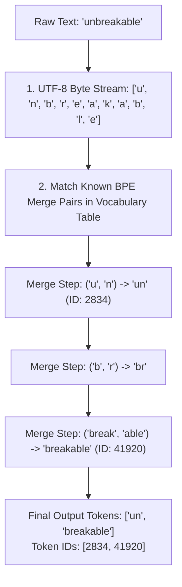
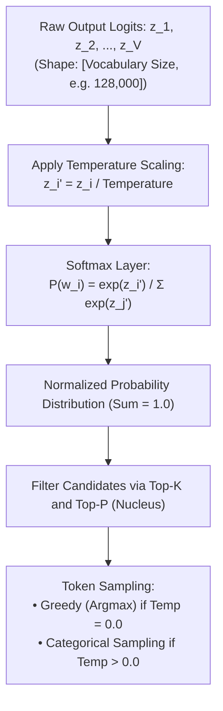

# Lesson 02: Tokenization & Byte-Pair Encoding (BPE)

`🟢 Core` · *Phase 00: Foundations & Token Mechanics* · *Estimated Reading Time: 11 minutes*

---

## What You Will Learn

By the end of this lesson, you will understand:
- Why neural networks cannot directly process text strings, characters, or words.
- The mechanics of Byte-Pair Encoding (BPE) and how subword merge trees are formed.
- The hidden operational costs of tokenization: whitespace sensitivity, number shredding, and the non-English token tax.
- How probability sampling works (Logits, Softmax, Temperature, Top-P, and Top-K).
- How to profile token counts and detect byte-boundary fragmentation before dispatching requests.

---

## 1. The Problem: Strings Are Not First-Class Citizens

In traditional software engineering, strings are familiar arrays of UTF-8 encoded bytes. You concatenate strings with `+`, split them with delimiters, and index characters in `O(1)` time.

In the world of Large Language Models, **strings do not exist**. 

A transformer is a mathematical matrix processor. Its input must be a discrete tensor of integers representing indices in a fixed vocabulary lookup table:

```text
"Enterprise Architecture" 
        │
        ▼ Tokenizer (BPE)
   [15234, 18942]  <--- Vector of integer token IDs
        │
        ▼ Embedding Layer
  [ [-0.14, 0.88, ...], [0.32, -0.05, ...] ]  <--- Dense floating-point tensors
```

If you treat text as a simple character stream when designing AI systems, you will encounter baffling production failures:
- An extra leading whitespace in an API prompt can cause an LLM to completely fail a regex extraction or JSON schema.
- A financial system sending dollar amounts with commas (`"$1,000,000"`) might consume 4x more tokens than one formatted without commas (`"$1000000"`).
- Non-English users in your multi-tenant SaaS application will be billed 3x to 5x more for identical semantic workflows, and experience higher latency and context window starvation.

To build reliable AI software, you must understand the compression algorithm sitting between your code and the neural network: **Byte-Pair Encoding (BPE)**.

---

## 2. Why Naive Approaches Break

Why don't LLMs just read individual characters or whole words?

### Failure Mode 1: Character-Level Tokenization
If every character is a token:
- The vocabulary is tiny (~256 bytes for ASCII / UTF-8).
- **The Catastrophe**: A 2,000-word technical document contains roughly 12,000 characters. Because self-attention has `O(N^2)` computational complexity with respect to sequence length `N`, a 12,000-character sequence requires **144 million attention calculations**, compared to only 9 million calculations for a 3,000-token subword sequence. The context window fills up almost instantly, and inference slows to a crawl.

### Failure Mode 2: Word-Level Tokenization
If every distinct word is a token:
- Sequence lengths remain short.
- **The Catastrophe**: Natural language vocabulary is unbounded. Medical terms, typos, code variables (`getUserById`), and inflections require millions of unique words. A vocabulary of 2,000,000 words creates an embedding matrix so colossal it would consume 30+ GB of GPU memory just to store the dictionary lookup table! Any word not in the dictionary becomes an unknown token (`<UNK>`), destroying meaning.

### The Engineering Solution: Subword Byte-Pair Encoding
Subword tokenizers strike the optimal balance: common words are represented as single tokens, while rare words, code identifiers, or foreign scripts are broken down into subword chunks or raw bytes.

---

## 3. Systems Mental Model: Huffman Coding for Language

Think of Byte-Pair Encoding like **Huffman coding** or **Lempel-Ziv compression (gzip)**:

In gzip, the compressor scans data for frequently recurring byte sequences and replaces them with shorter bit codes. BPE does the same thing for language:
- It starts with a base vocabulary of individual bytes (256 distinct values).
- It scans billions of words of pre-training text and counts which two adjacent tokens appear together most frequently.
- It merges that pair into a brand-new single token and adds it to the vocabulary table.
- It repeats this merge process tens of thousands of times until reaching a target vocabulary size (typically 32,000 to 128,000 tokens).

---

## 4. How Byte-Pair Encoding (BPE) Works

Let's walk through the exact BPE training and tokenization process:



### Walkthrough of the BPE Tokenization Process:
1. **UTF-8 Byte Stream**: The input string is decomposed into its underlying UTF-8 byte representation. Every byte (0 to 255) is guaranteed to exist in the base vocabulary, ensuring the model never encounters an "unknown" character.
2. **Merge Table Lookup**: The tokenizer scans adjacent pairs of tokens and checks its pre-compiled merge priority table (ordered by frequency observed during training).
3. **Iterative Greedy Merging**: The tokenizer greedily applies the highest-ranked merge rule. For example, `'u'` and `'n'` merge into `'un'`. Then `'break'` and `'able'` merge into `'breakable'`.
4. **Token ID Serialization**: Once no further merges are possible, the final subwords are converted into integer token IDs. The 11-character word `"unbreakable"` becomes just two tokens: `[2834, 41920]`.

---

## 5. Tokenizer Idiosyncrasies & Production Penalties

Because BPE is a purely statistical compression algorithm with no intrinsic understanding of grammar, it introduces subtle behaviors that directly impact production systems:

### 1. Leading Whitespace Sensitivity
In modern tokenizers (such as OpenAI's `cl100k_base` or `o200k_base`, and Meta's LLaMA-3 tokenizer), whitespace is glued to the beginning of the subsequent word, not treated as an isolated token:

| Input String | Token Breakdown | Token IDs | Production Consequence |
|---|---|---|---|
| `"Hello"` | `["Hello"]` | `[9906]` | Token ID 9906 represents `"Hello"` without leading space. |
| `" Hello"` | `[" Hello"]` | `[15496]` | Completely different token ID (15496) represents `" Hello"`! |

**Why this matters**: If your few-shot prompt or template contains an accidental trailing space before a variable (e.g. `f"User Query: {query}"` where `query` starts with a space), the model receives two space tokens or an unfamiliar boundary token. This disrupts the model's learned prefix activations and degrades output quality.

### 2. Number Shredding
Tokenizers treat numbers inconsistently. While small numbers often have dedicated tokens, large numbers or formatted numbers are shredded into arbitrary sub-tokens:

```text
"100"      --> 1 token:  ["100"]
"1000"     --> 1 token:  ["1000"]
"10000"    --> 2 tokens: ["10", "000"]
"1,000,000"--> 5 tokens: ["1", ",", "000", ",", "000"]
```

**Why this matters**: In financial and arithmetic applications, a raw string of numbers can consume significantly more context than expected. Furthermore, because digits are split inconsistently across digit boundaries, transformers struggle with multi-digit arithmetic without scratchpad reasoning.

### 3. The Non-English Token Tax
Because the training datasets for most foundation models are predominantly English (typically 80%+), the tokenizer's merge table heavily favors English character sequences. 

Common English words are represented as single tokens. Non-Latin scripts (such as Devanagari, Arabic, Japanese, or Cyrillic) often lack frequent multi-byte merges, forcing the tokenizer to fall back to individual UTF-8 bytes:

| Input Text | Language | Character Count | Token Count | Inflation vs. English |
|---|---|---|---|---|
| `"Enterprise Architecture"` | English | 23 | 2 tokens | 1.0x (Baseline) |
| `"Arquitectura Empresarial"` | Spanish | 24 | 4 tokens | **2.0x** |
| `"Unternehmensarchitektur"` | German | 23 | 5 tokens | **2.5x** |
| `"एंटरप्राइज आर्किटेक्चर"` | Hindi | 23 | 11 tokens | **5.5x** |
| `"企业架构"` | Chinese | 4 | 4 tokens | **2.0x** |

**Why this matters**: A global enterprise deploying an AI agent will pay **5.5 times more per request** for a Hindi or Arabic user than for an English user performing the identical task. Furthermore, the Hindi user will hit context window limits 5 times faster!

---

## 6. Sampling Mechanics & Probability Shaping

Once the transformer processes token IDs through its attention layers, its final linear layer emits a vector of raw unnormalized scores called **logits** (`z`), with one logit for every token in the vocabulary (`V`).

How does the serving engine convert these logits into the next output token?



### 1. Temperature (`T`)
Temperature controls the "flatness" of the probability distribution:
```text
P(token_i) = exp( z_i / Temperature ) / Σ [ exp( z_j / Temperature ) ]
```

- **Temperature = 0.0 (Greedy Decoding / Argmax)**: The model deterministically selects the single token with the highest logit. Always use `T = 0` for code generation, JSON extraction, and mathematical calculations.
- **Low Temperature (0.1 – 0.5)**: Sharpens the distribution. The top tokens receive almost all the probability mass. Output is focused and repeatable.
- **Medium Temperature (0.7 – 0.8)**: Balances coherence and vocabulary variety. Standard for conversational chat and creative drafting.
- **High Temperature (≥ 1.0)**: Flattens the distribution, giving obscure, low-probability tokens a realistic chance of being picked. Often results in rambling or nonsensical output.

### 2. Top-K and Top-P (Nucleus) Filtering
- **Top-K**: Truncates the candidate pool to the `K` most probable tokens (e.g. `K = 50`). All other tokens are discarded.
- **Top-P (Nucleus Sampling)**: Dynamically selects the smallest set of tokens whose cumulative probability exceeds threshold `P` (e.g. `P = 0.90`). If one token has 95% probability, only that token is considered; if 20 tokens share probability equally, all 20 are considered.

---

## 7. Concrete Implementation: Token Profiler & Cost Engine

The following Python 3.12 script implements an exact tokenization profiler. It models subword fragmentation, calculates the non-English penalty, and estimates request pricing.

```python
"""
Enterprise Token Economics & Boundary Fragmentation Profiler.
Measures tokenization inflation, subword splitting, and financial cost.
"""

from typing import Any
from pydantic import BaseModel, Field


class TokenPricing(BaseModel):
    """Cost configuration per 1 million tokens (USD)."""
    input_per_million: float = 2.50   # e.g., GPT-4o input rate
    output_per_million: float = 10.00 # e.g., GPT-4o output rate


class TokenProfile(BaseModel):
    """Detailed tokenization metrics for an input string."""
    raw_text: str
    char_count: int
    byte_count: int
    token_count: int
    bytes_per_token: float
    chars_per_token: float
    token_expansion_ratio: float = Field(
        ..., description="Ratio of tokens to estimated English baseline"
    )
    estimated_cost_usd: float


class TokenProfiler:
    """Profiles text payloads across tokenization and economic dimensions."""

    def __init__(self, pricing: TokenPricing | None = None) -> None:
        self.pricing = pricing or TokenPricing()

    def profile(self, text: str, token_ids: list[int]) -> TokenProfile:
        char_count = len(text)
        byte_count = len(text.encode("utf-8"))
        token_count = len(token_ids)

        if token_count == 0:
            raise ValueError("Token IDs list cannot be empty.")

        chars_per_token = char_count / token_count
        bytes_per_token = byte_count / token_count

        # In standard English, 1 token ≈ 4 characters (0.25 tokens/char).
        # We calculate the expansion penalty relative to standard English:
        baseline_expected_tokens = max(1, char_count / 4.0)
        expansion_ratio = round(token_count / baseline_expected_tokens, 2)

        # Calculate input cost for this payload
        cost = (token_count / 1_000_000.0) * self.pricing.input_per_million

        return TokenProfile(
            raw_text=text[:50] + ("..." if len(text) > 50 else ""),
            char_count=char_count,
            byte_count=byte_count,
            token_count=token_count,
            bytes_per_token=round(bytes_per_token, 2),
            chars_per_token=round(chars_per_token, 2),
            token_expansion_ratio=expansion_ratio,
            estimated_cost_usd=round(cost, 6),
        )


# --- Simulation Demonstration ---
if __name__ == "__main__":
    profiler = TokenProfiler()

    # Simulated token outputs from a standard BPE tokenizer (e.g., cl100k_base)
    samples: list[tuple[str, list[int]]] = [
        (
            "Enterprise Architecture and Systems Engineering",
            [15234, 18942, 323, 7842, 16421],  # 5 tokens
        ),
        (
            "एंटरप्राइज आर्किटेक्चर",  # Same phrase in Hindi
            [35412, 102, 234, 541, 891, 104, 203, 401, 882, 103, 502],  # 11 tokens
        ),
        (
            "    public async Task<IActionResult> ProcessOrderAsync()",  # C# Code with spaces
            [220, 220, 220, 220, 2221, 4125, 6842, 29, 3942, 4521, 30, 2841, 1421, 321],  # 14 tokens
        ),
    ]

    print("=== ENTERPRISE TOKENIZATION PROFILING REPORT ===")
    for text, token_ids in samples:
        report = profiler.profile(text, token_ids)
        print(f"\nText: '{report.raw_text}'")
        print(f"  Chars: {report.char_count} | Bytes: {report.byte_count} | Tokens: {report.token_count}")
        print(f"  Chars/Token: {report.chars_per_token} | Bytes/Token: {report.bytes_per_token}")
        print(f"  Token Expansion Penalty: {report.token_expansion_ratio}x")
        print(f"  Cost (1M Calls): ${(report.estimated_cost_usd * 1_000_000):.2f}")
```

---

## 8. Trade-offs & Architecture Decision Matrix

| Dimension | Byte-Level BPE (GPT-4 / LLaMA-3) | WordPiece (BERT) | Character-Level Encoding |
|---|---|---|---|
| **Vocabulary Size** | 100,000 – 128,000 tokens | 30,000 tokens | ~256 bytes |
| **Out-of-Vocabulary (OOV)** | **Zero** (falls back to raw bytes) | Can trigger `<UNK>` tokens | **Zero** |
| **Sequence Length** | Short (~1.3 tokens/word in English) | Moderate (~1.5 tokens/word) | Extremely Long (~4–5 tokens/word) |
| **Multilingual Efficiency** | High in newer models (`o200k_base`); lower in legacy | Poor for non-Latin languages | Uniform (1 byte = 1 token) |
| **VRAM for Embedding Layer** | ~1 GB (128k vocab × 4096 hidden dim) | ~250 MB | < 5 MB |

---

## 9. Common Failure Modes & Anti-Patterns

### Anti-Pattern 1: Naive String Splitting on Token Boundaries
- **The Mistake**: Splitting a document into 500-character chunks by blindly slicing `text[0:500]`.
- **Why It Fails**: Slicing strings by characters frequently cuts multi-byte UTF-8 sequences or splits a subword token in half (e.g. splitting `"ing"` away from its root). When the tokenizer parses the cut fragment, it encodes it as invalid dangling bytes, generating garbage embeddings in RAG pipelines.
- **Production Remedy**: Always tokenize the document first, and perform chunk slicing on the integer token ID array, or use tokenizer-aware text splitters.

### Anti-Pattern 2: Setting Temperature > 0 for Structured JSON Extraction
- **The Mistake**: Leaving `temperature = 0.7` when prompting an LLM to generate strict Pydantic or database JSON records.
- **Why It Fails**: Higher temperatures increase the probability of sampling unexpected tokens, introducing unescaped quotes, trailing commas, or omitted required fields.
- **Production Remedy**: Set `temperature = 0.0` for all schema-bound extractions to enforce deterministic, greedy argmax token paths.

---

## 10. Key Takeaways

1. **Tokens Are Integer Indices**: LLMs never see characters or words. Every text fragment is transformed into an integer token ID via Byte-Pair Encoding (BPE).
2. **Leading Spaces Matter**: `" Hello"` and `"Hello"` are completely different tokens. Consistent spacing in prompt templates is mandatory.
3. **The Multilingual Tax Is Real**: Non-Latin scripts can require 3x to 5x more tokens per sentence, increasing latency and cost proportionally.
4. **Greedy Sampling for Precision**: Logits are converted to probabilities via Softmax with temperature scaling. Use `temperature = 0.0` for code, math, and JSON extraction.

---

## 11. Verified Resources

- **[Sennrich et al. (2015) — Neural Machine Translation of Rare Words with Subword Units](https://arxiv.org/abs/1508.07909)**: The original paper introducing Byte-Pair Encoding to natural language processing.
- **[OpenAI Tiktoken Library](https://github.com/openai/tiktoken)**: High-performance open-source BPE tokeniser in Rust and Python.
- **[HuggingFace Tokenizers Library](https://github.com/huggingface/tokenizers)**: Fast tokenization engine supporting BPE, WordPiece, and Unigram.
- **Previous Lesson**: [Lesson 01: Transformer Inference & Hardware Realities](./01-transformer-and-hardware-physics.md)
- **Next Lesson**: [Lesson 03: KV-Cache Mechanics & Memory Sizing Math](./03-kv-cache-vram-and-bandwidth-physics.md)
