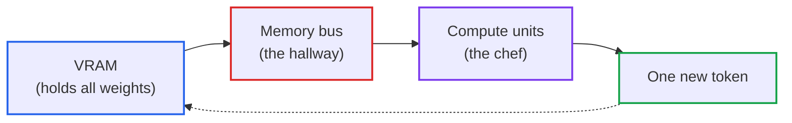
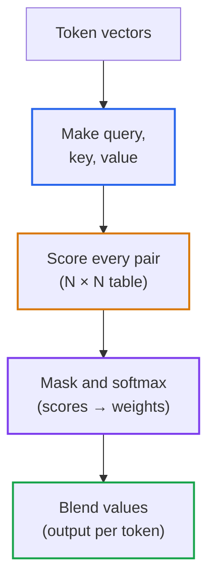

# Lesson 02: Why Your Graphics Processing Unit Waits on Memory: Transformers and Hardware Limits (GPU, VRAM, Arithmetic Intensity)

> **Tier**: `🟡 Engineering Depth` | **Read time**: ~16 min | **Prerequisites**: [Lesson 01: Tokenization](./01-tokenization-and-bpe-mechanics.md)  
> **Core Concept**: A GPU can do far more arithmetic per second than its memory can feed it. Because an LLM writes its reply one token at a time, the speed you see is usually set by memory bandwidth, not by how many math units the chip has.  
> **New AI terms introduced**: GPU, VRAM, high-bandwidth memory (HBM), FLOPs, arithmetic intensity, compute-bound, memory-bound, parameter (weight), transformer, attention  
> **AI terms assumed from earlier lessons**: [LLM](./00-what-is-an-llm.md), [token](./00-what-is-an-llm.md), [inference](./00-what-is-an-llm.md), [prompt](./00-what-is-an-llm.md), [softmax](./01-tokenization-and-bpe-mechanics.md)

---

## 🎯 What You Will Learn

- Say what a GPU, VRAM, a weight and a FLOP are, in plain words.
- Predict whether a workload is limited by math or by memory, using one ratio.
- Estimate the speed limit of single-user text generation with one division.
- Describe what attention does and why its score table grows with the square of the input length.

---

## 1. The Problem

Your team rents a much bigger GPU for a chat feature that serves one user at a time. The new chip has far more raw compute than the old one, so you expect a big jump in how fast the reply streams. It is barely faster. The monitoring tool shows the compute units mostly idle while the memory is busy.

You know this shape from databases: a faster CPU does not help a query that waits on disk. The same thing happens here, with a different wire. To see which wire, you first need five hardware words. None of them is assumed.

## 2. The Mental Model

🧒 **Picture a very fast chef and a pantry at the end of a hallway.** The chef can chop any ingredient in a blink. But the ingredients, and all the recipe books, are in the pantry. For every single dish, an assistant pushes a cart down the hallway, the chef glances at it, and the cart goes back. A faster chef changes nothing, because the chef spends most of the time waiting for the cart. A wider hallway, or a bigger pantry next to the stove, does help.

A tiny example: if the cart trip takes 40 ms *(illustrative)* and chopping takes 0.1 ms *(illustrative)*, the chef is idle over 99% of the time.

**Where this analogy breaks**: a real GPU has thousands of small workers, not one chef, and it is very good at doing many dishes per cart trip. That is exactly the lever you will use later (more work per memory read). The analogy also hides that the pantry has limited shelves, which is the VRAM capacity limit.

## 3. How It Works, One Term at a Time

### GPU, VRAM and weights

* 🧒 **The Analogy**: The GPU is the kitchen crew, VRAM is the pantry, and the weights are the recipe books.
* ⚙️ **The Engineering**: A **GPU (graphics processing unit)** is a chip with thousands of small arithmetic units that work in parallel. It was built for graphics, and it suits LLMs because an LLM is mostly huge batches of multiplications. **VRAM (video RAM)** is the memory attached to the GPU. On data-centre GPUs it is a type called **high-bandwidth memory (HBM)**, built to move a very large number of bytes per second. A **parameter** (also called a **weight**) is one learned number inside the model, set during training. An LLM with 8 billion parameters stores 8 billion such numbers, and all of them must sit in VRAM to serve requests. If each weight is stored as a 16-bit number, that is 2 bytes each *(other formats are covered in [Lesson 05](./05-slms-and-quantization-mechanics.md))*:

```text
8 billion weights × 2 bytes = 16 billion bytes = 16 GB
70 billion weights × 2 bytes = 140 GB
```

* ⚠️ **What happens if you skip this?** You buy a GPU based on compute speed alone, only to find the weights do not fit in VRAM. Even if they fit, little memory remains for serving user requests.

### FLOPs, arithmetic intensity, compute-bound and memory-bound

* 🧒 **The Analogy**: How many dishes the chef cooks per cart trip. One dish per trip keeps the chef waiting. Fifty dishes per trip keeps the chef busy.
* ⚙️ **The Engineering**: A **FLOP** is one floating-point operation, such as one multiply or one add on decimal numbers. "FLOPs" is the count, and "FLOP/s" (or TFLOPS, trillions per second) is the speed. **Arithmetic intensity** is how many FLOPs you do for each byte you read from memory:

```text
arithmetic intensity = FLOPs performed ÷ bytes moved from memory
```

Every chip has a balance point, the intensity where its math speed and its memory speed are equally used:

```text
balance point (FLOPs per byte) = peak FLOP/s ÷ memory bandwidth (bytes/s)
```

Below the balance point the job is **memory-bound**: the math units wait for data. Above it the job is **compute-bound**: the memory keeps up and the math units are the limit. Generating one token needs roughly 2 FLOPs per weight (one multiply, one add). But it must read that weight from memory once. With 2-byte weights, the arithmetic intensity is about 1 FLOP per byte *(derived: 2 FLOPs ÷ 2 bytes)*. This is far below any modern GPU's balance point, making single-user generation strictly memory-bound.

* ⚠️ **What happens if you skip this?** You pay for a chip with 30 times more compute and get 5 times more speed, because only the memory bandwidth changed by 5 times. That is the story in the Quick Check.

### Diagram 1: Where one token's time goes



1. **VRAM** holds every weight of the model.
2. **The memory bus** carries them to the compute units. This is the slow step for one user.
3. **Compute units** do a tiny amount of math on each weight and finish almost instantly.
4. **One new token** comes out, and the dotted arrow shows the whole trip repeating for the next token.

### The speed limit you can compute

If every weight must cross the bus once per token, then time per token is at least the weight size divided by the bandwidth:

```text
max tokens per second ≈ memory bandwidth ÷ weight size
8B model, 16 GB weights, 3,350 GB/s bus:  3,350 ÷ 16 ≈ 209 tokens/s   (upper bound, derived)
```

Real systems land below this bound. The point is what it depends on: bandwidth and model size, not peak compute. Shrinking the weights or raising bandwidth helps. Adding compute does not. Serving several users at once helps too, because one trip of the cart then serves many dishes (more on that in [Lesson 03](./03-kv-cache-vram-and-bandwidth-physics.md)).

As of 2026-09, NVIDIA's [H100 page](https://www.nvidia.com/en-us/data-center/h100/) lists these figures for its SXM version:

| As of 2026-09 | GPU memory | Memory bandwidth | FP16 Tensor Core peak |
|---|---|---|---|
| NVIDIA H100 SXM | 80 GB | 3.35 TB/s | 1,979 TFLOPS, footnoted "with sparsity" |

The compute figure is a sparsity-assisted peak. The page does not list a dense number in that table, so do not use 1,979 as your balance-point input. Use the dense figure for your precision from the datasheet.

### Transformer and attention

* 🧒 **The Analogy**: Reading a mystery novel with a flashlight. When you hit the word "She", you sweep the beam back over earlier sentences to find who it refers to. The brighter a spot, the more it shapes your reading of "She".
* ⚙️ **The Engineering**: A **transformer** is the neural-network design nearly all current LLMs use, introduced in [Vaswani et al., 2017](https://arxiv.org/abs/1706.03762). Its key part is **attention**: a step where each token looks at the other tokens in the input and pulls in the ones that matter. Each token produces three lists of numbers: a **query** (what I am looking for), a **key** (what I offer) and a **value** (what I hand over if matched). Comparing every query with every key gives a table of scores, one per pair of tokens. A softmax (see [Lesson 01](./01-tokenization-and-bpe-mechanics.md)) turns each row of scores into weights that sum to 1, and those weights blend the values:

```text
attention(Q, K, V) = softmax( Q · Kᵀ ÷ √d + mask ) · V
```

The mask hides future tokens, so a token cannot peek at what comes after it. The `√d` scaling keeps the scores in a range where softmax behaves.

* ⚠️ **What happens if you skip this?** You miss that the score table has one entry per pair of tokens. For N tokens that is N × N entries:

```text
N = 32,768 tokens  →  32,768² = 1,073,741,824 scores per attention head
```

That square growth is why long inputs strain memory. [Lesson 06](./06-roofline-and-flashattention-deep-dive.md) (optional, go deeper) shows how FlashAttention avoids storing that table.

### Diagram 2: One attention step



1. **Token vectors** are each token's list of numbers entering the layer.
2. **Query, key, value** come from multiplying by three learned weight matrices.
3. **Score every pair** compares each query with each key, producing the N × N table.
4. **Mask and softmax** hide future tokens and turn scores into weights.
5. **Blend values** mixes the value lists by those weights, giving one output per token.

## 4. Try It (Runnable, Offline)

This calculator takes hardware specs **that you supply** and tells you the balance point, the regime and the one-stream speed limit. The chips below are made up round numbers, so the output is about the method, not any product. Needs Python 3.12+ and Pydantic v2, no network.

```python
from pydantic import BaseModel, Field


class Accelerator(BaseModel):
    """Specs are supplied by you. Copy them from the vendor datasheet for your precision."""
    name: str
    peak_tflops: float = Field(gt=0, description="dense peak, trillions of FLOPs per second")
    bandwidth_gb_s: float = Field(gt=0, description="memory bandwidth, GB per second")

    @property
    def ridge(self) -> float:
        """FLOPs per byte where compute and memory limits meet."""
        return (self.peak_tflops * 1e12) / (self.bandwidth_gb_s * 1e9)


class Model(BaseModel):
    params_billions: float = Field(gt=0)
    bytes_per_weight: float = Field(default=2.0, gt=0)  # 16-bit weights = 2 bytes

    @property
    def weight_gb(self) -> float:
        return self.params_billions * self.bytes_per_weight


def intensity(model: Model, tokens_per_weight_read: int) -> float:
    """~2 FLOPs per weight per token, divided by bytes read per weight."""
    return 2.0 * tokens_per_weight_read / model.bytes_per_weight


def report(chip: Accelerator, model: Model) -> None:
    print(f"{chip.name}: ridge = {chip.ridge:.0f} FLOPs/byte, weights = {model.weight_gb:.0f} GB")
    for tokens in (1, 8, 64, 512):
        ai = intensity(model, tokens)
        regime = "compute-bound" if ai >= chip.ridge else "memory-bound"
        print(f"  {tokens:>4} token(s) per weight read: intensity {ai:>6.0f} -> {regime}")
    print(f"  one-stream speed limit: {chip.bandwidth_gb_s / model.weight_gb:.1f} tokens/s")


if __name__ == "__main__":
    model = Model(params_billions=8)
    report(Accelerator(name="Chip A (illustrative)", peak_tflops=1000, bandwidth_gb_s=3000), model)
    report(Accelerator(name="Chip B (illustrative)", peak_tflops=30, bandwidth_gb_s=600), model)
    try:
        Accelerator(name="bad", peak_tflops=0, bandwidth_gb_s=1)
    except ValueError as err:
        print("rejected:", type(err).__name__)
```

Expected output (verified by running the block with Python 3.14.7 and Pydantic 2.13.5):

```text
Chip A (illustrative): ridge = 333 FLOPs/byte, weights = 16 GB
     1 token(s) per weight read: intensity      1 -> memory-bound
     8 token(s) per weight read: intensity      8 -> memory-bound
    64 token(s) per weight read: intensity     64 -> memory-bound
   512 token(s) per weight read: intensity    512 -> compute-bound
  one-stream speed limit: 187.5 tokens/s
Chip B (illustrative): ridge = 50 FLOPs/byte, weights = 16 GB
     1 token(s) per weight read: intensity      1 -> memory-bound
     8 token(s) per weight read: intensity      8 -> memory-bound
    64 token(s) per weight read: intensity     64 -> compute-bound
   512 token(s) per weight read: intensity    512 -> compute-bound
  one-stream speed limit: 37.5 tokens/s
```

What to notice:
- **One token per weight read is memory-bound on both chips.** Intensity 1 is far below either balance point.
- **Reusing each weight read for more tokens raises intensity.** That is why serving many users together helps, and why Chip B, with its lower balance point, becomes compute-bound sooner.
- **Chip A has 33 times the compute of Chip B but only 5 times the bandwidth**, and the one-stream limit improves by exactly 5 times (187.5 ÷ 37.5).

## 5. Trade-Offs

| Choice | Benefit | Cost |
|---|---|---|
| Buy more compute | Helps heavy batched work | Little effect on one-user streaming |
| Buy more memory bandwidth | Raises the one-stream speed limit | Costs more per chip *(check vendor pricing)* |
| Smaller weights (fewer bytes each) | Less data per token, more room in VRAM | Possible quality loss (see [Lesson 05](./05-slms-and-quantization-mechanics.md)) |
| Serve several requests together | Better use of each weight read | Each user may wait a little longer, and more memory is needed |

## 6. Failure Modes

- **Symptom**: a faster GPU barely speeds up single-user streaming. **Cause**: the job is memory-bound, so compute is not the limit. **Fix**: compare bandwidth, not TFLOPS, and consider smaller weights.
- **Symptom**: the server crashes with an out-of-memory error while compute usage looks low. **Cause**: weights are only the starting cost, and each active request needs extra working memory. **Fix**: budget VRAM as weights plus per-request memory plus headroom ([Lesson 03](./03-kv-cache-vram-and-bandwidth-physics.md) does the arithmetic).
- **Symptom**: a model is chosen because its parameter count "fits". **Cause**: weights were counted, nothing else was. **Fix**: add per-request memory and overhead before deciding.
- **Symptom**: long inputs get slow or fail much faster than expected. **Cause**: the attention score table grows with N². **Fix**: cap input length and read [Lesson 06](./06-roofline-and-flashattention-deep-dive.md).

## 🧠 7. Quick Check to See if it Clicked

> A team moves a one-user coding assistant from Chip B to Chip A (the two illustrative chips above). Compute is 33 times higher. They expect 33 times faster streaming and measure about 5 times. Is Chip A faulty?

<details>
<summary><b>View answer</b></summary>

No. Writing one token at a time is memory-bound: intensity is about 1 FLOP per byte, far under both balance points. Speed is limited by how fast the weights cross the bus, and bandwidth rose 5 times (3,000 ÷ 600). The 33 times compute is mostly idle in this workload.
</details>

## 8. Key Takeaways

- Weights live in VRAM, and a 16-bit weight costs 2 bytes, so an 8B model needs about 16 GB before anything else.
- Arithmetic intensity divided against the chip's balance point tells you if you are compute-bound or memory-bound.
- One user's token-by-token output is memory-bound: speed is roughly bandwidth divided by weight size.
- Attention compares every token with every other one, so its score table grows as N².

**Sources opened for this lesson**: [NVIDIA H100 page](https://www.nvidia.com/en-us/data-center/h100/) (memory, bandwidth, and sparsity footnote, as of 2026-09). Transformer and attention mechanics reference [Attention Is All You Need](https://arxiv.org/abs/1706.03762).

---

## 🧭 Navigation
- **[← Previous Lesson: Tokenization](./01-tokenization-and-bpe-mechanics.md)**
- **[Phase 00 Hub](./README.md)**
- **[Next Lesson: KV Cache and Memory Bandwidth →](./03-kv-cache-vram-and-bandwidth-physics.md)**
- **[Capstone Lab: Token Economics Analyzer](./labs/capstone-token-economics-analyzer.md)**
