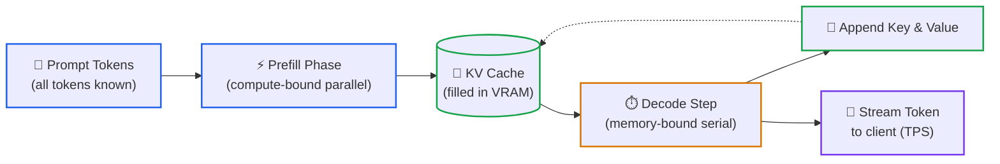
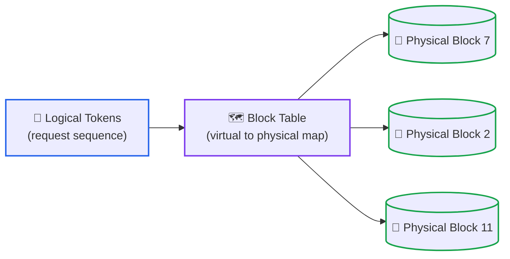

# Lesson 03: The Memory Notebook of a Language Model: Key-Value Cache, Prefill/Decode and Memory Sizing (KV Cache)

> **Tier**: `🟡 Engineering Depth` | **Read time**: ~20 min | **Prerequisites**: [Lesson 02: Transformer Inference & Hardware Realities](./02-transformer-and-hardware-physics.md)  
> **Core Concept**: While a model writes an answer it keeps a per-request notebook of what it already worked out about every earlier token, so it never redoes that work. That notebook lives in GPU memory, grows with every token and every user, and is what limits how many people one GPU can serve.  
> **New AI terms introduced**: KV cache, prefill, decode, time to first token (TTFT), tokens per second (TPS), multi-head attention (MHA), multi-query attention (MQA), grouped-query attention (GQA), multi-head latent attention (MLA), PagedAttention, batching  
> **AI terms assumed from earlier lessons**: [token](./00-what-is-an-llm.md), [context window](./00-what-is-an-llm.md), [inference](./00-what-is-an-llm.md), [logits](./01-tokenization-and-bpe-mechanics.md), [GPU, VRAM, HBM](./02-transformer-and-hardware-physics.md), [weights](./02-transformer-and-hardware-physics.md), [transformer](./02-transformer-and-hardware-physics.md), [attention](./02-transformer-and-hardware-physics.md), [compute-bound and memory-bound](./02-transformer-and-hardware-physics.md)

---

## 🎯 What You Will Learn

- Explain what the KV cache stores and why generation is unusably slow without it.
- Split a request into its two phases, prefill and decode, and say which one a user feels as "waiting" and which as "typing speed".
- Compute the KV cache size for any model from four numbers, and turn that into a maximum number of simultaneous users.
- Compare the attention variants (MHA, MQA, GQA, MLA) by how much memory each one saves, and explain paged allocation.

---

## 1. The Problem

You size a GPU server by looking at the model: the weights fit, the speed looks fine in a single-user test. Then real traffic arrives and the server runs out of GPU memory with no warning.

Weights are a fixed cost. Whatever is left over after loading them is a shared pool, and every active conversation takes a slice of it that grows with every token. The bridge from what you know:

| You know | LLM serving reality |
|---|---|
| Per-connection memory is tiny, so capacity is bound by CPU or sockets | Per-request memory is large and grows with every token, so capacity is bound by memory |
| A cache speeds things up and can be dropped if memory is tight | The KV cache is required for speed, and dropping it means redoing the whole computation |
| Allocating a worst-case buffer per request is wasteful but simple | Doing that with this cache can cut the number of users you can serve by a large factor |

## 2. The Mental Model

🧒 **Think of a writer who keeps a notebook.** To choose the next word the writer needs to consider everything written so far. Without a notebook, they reread the whole manuscript before every single word. With a notebook, they jot a short note per page once, then consult the notes. Writing is fast, but the notebook needs desk space, and a desk shared by 50 writers fills up.

**Where this analogy breaks**: the notes are not summaries in words. They are lists of numbers with a fixed size per token, so the notebook grows by exactly the same amount for every token, never less for a dull page. 

## 3. How It Works, One Term at a Time

### The KV cache

First, a quick recap of attention from Lesson 02. For each token, every transformer layer produces three lists of numbers: a **Query**, a **Key**, and a **Value**. The Query describes what this token is looking for. The Key labels what it offers. The Value holds the content it hands over when matched. To process a new token, attention compares its Query against earlier Keys and blends their Values.

The important fact: the Key and Value of an earlier token do not change when you add a new token after it. Recomputing them at every step is pure waste.

* 🧒 **The Analogy**: A memoization table. You computed the Key and Value for token 1,000 once; store them and look them up at step 1,001 instead of recomputing.
* ⚙️ **The Engineering**: The **KV cache** (Key-Value cache) is the per-request store of every earlier token's Key and Value, for every layer, kept in GPU memory (VRAM). At each step the model computes the Query, Key and Value for only the newest token, appends the new Key and Value to the cache, and reads the whole cache to run attention. Without the cache, step N would reprocess all N tokens, so the total work to write an answer of N tokens grows with the square of N. With it, each step does a constant amount of new projection work plus a read that grows linearly with N.
* ⚠️ **What happens if you skip this?** Generation slows down as the answer gets longer, because every new word pays for all the previous ones again. The cache is the fix, and it is also the reason memory becomes your capacity limit.

### Prefill and decode

A request has two phases with opposite hardware behaviour.



1. **Your prompt** is already fully known, so nothing forces the model to go one token at a time.
2. **Prefill** processes every prompt token in one parallel pass and fills the cache. It does a lot of arithmetic per byte it reads, so it tends to be compute-bound. The wait until the first output token appears is the **time to first token (TTFT)**.
3. **Decode** produces the answer one token at a time. Each step needs the next token, which depends on the previous one, so it cannot be parallelised across the answer. Each step reads all the model weights and the whole cache to compute a single token, so it tends to be memory-bound (Lesson 02). How fast tokens stream out is **tokens per second (TPS)**.
4. **Append** adds the new token's Key and Value to the cache, and the loop repeats until the model stops.

```text
Total request time ≈ TTFT + (output tokens ÷ TPS)
```

* 🧒 **The Analogy**: Prefill is reading the question once, quickly, in one sitting. Decode is writing the answer one word at a time with the pen, where the pen speed, not your reading speed, is the limit.
* ⚙️ **The Engineering**: The two phases stress different resources, so they are tuned differently. A long prompt mostly costs TTFT. A long answer mostly costs decode time, and each decode step re-reads a cache that is growing.
* ⚠️ **What happens if you skip this?** You report one "latency" number and cannot tell whether a slow feature has a prompt problem (TTFT) or an answer-length problem (TPS). Measure them separately.


### The memory formula

How big is the notebook? Count what is stored per token.

* ⚙️ **The Engineering**: For every token, the cache holds one Key and one Value (the factor 2) per layer. It stores these for each **KV head**. Attention runs as several parallel heads, and each KV head keeps its own Key and Value. Each head stores a list of `head_dim` numbers. Each number takes a fixed number of bytes. For example, FP16 uses 2 bytes per number (Lesson 05 covers other formats).

```text
KV cache bytes = 2 × layers × KV heads × head dim × bytes per value × tokens × concurrent requests
```

The model numbers below are from Table 3 of the Llama 3 paper (80 layers, 8,192 model dimension, 64 attention heads, 8 key/value heads for the 70B model). Head dim is derived: 8,192 ÷ 64 = 128.

```text
Per token (FP16):
  2 × 80 layers × 8 KV heads × 128 head dim × 2 bytes
  = 327,680 bytes ≈ 0.33 MB

One 8,192-token session:
  327,680 × 8,192 = 2,684,354,560 bytes ≈ 2.68 GB

Weights for a 70-billion-parameter model in FP16:
  70 × 10⁹ × 2 bytes = 140 GB
```

One conversation costs about 2% of the weights. Fifty conversations cost about 134 GB, nearly another copy of the model.

* ⚠️ **What happens if you skip this?** You load-test with short prompts, see plenty of headroom, and go live. Real users send long documents and multi-turn chats, and the server hits the memory wall at a fraction of the concurrency you planned for.

### Attention variants: fewer KV heads, smaller cache

Look at the formula: the only architectural lever is `KV heads`. The variants below differ in how many KV heads the model keeps.

* 🧒 **The Analogy**: A team of 64 analysts (the Query heads). Originally each keeps a private notebook. You can make them share: all sharing one notebook, or small groups sharing one each.
* ⚙️ **The Engineering**:
  - **Multi-head attention (MHA)**: every Query head has its own Key and Value head. Biggest cache, the original design.
  - **Multi-query attention (MQA)**: all Query heads share one Key and Value head (Shazeer, 2019). Smallest cache and faster decoding, with a risk of quality loss.
  - **Grouped-query attention (GQA)**: Query heads are split into groups, each group sharing one Key and Value head. It sits between the two. Ainslie et al. (2023) show it reaches quality close to MHA with speed comparable to MQA.
  - **Multi-head latent attention (MLA)**: instead of caching full Keys and Values per head, cache one compressed "latent" vector per token and layer, and reconstruct what attention needs from it. The DeepSeek-V2 paper states that at inference the reconstruction matrices can be absorbed into the query and output projections, so full Keys and Values never need to be materialised. It reports a 93.3% KV cache reduction compared with its earlier 67B model.
* ⚠️ **What happens if you skip this?** You compare models by parameter count alone and miss that one needs eight times more cache per user.

The DeepSeek-V2 paper expresses cache size per token per layer as a formula. Here, `n_h` is head count, `n_g` is KV groups, and `d_h` is head dimension. Additionally, `d_c` is the latent dimension, and `d_h^R` is a small extra positional Key vector:

| Variant | Cache elements per token per layer (source: DeepSeek-V2 paper) |
|---|---|
| MHA | 2 × n_h × d_h |
| GQA | 2 × n_g × d_h |
| MQA | 2 × d_h |
| MLA | d_c + d_h^R (the paper states this is about 2.25 × d_h) |

For the same 80-layer, 128-head-dim shape, changing only the KV head count gives (derived by the code in section 4):

```text
MHA, 64 KV heads: 2 × 80 × 64 × 128 × 2 B = 2,621,440 B per token
GQA,  8 KV heads: 2 × 80 ×  8 × 128 × 2 B =   327,680 B per token  (8× smaller)
MQA,  1 KV head : 2 × 80 ×  1 × 128 × 2 B =    40,960 B per token  (64× smaller)
```

As of 2026-09, examples of two designs (attention type checked against the source linked in each row):

| Model | Attention design | Source |
|---|---|---|
| Llama 3.1 70B | GQA (8 KV heads, 64 query heads) | [Meta model card](https://huggingface.co/meta-llama/Llama-3.1-70B), [Llama 3 paper](https://arxiv.org/abs/2407.21783) |
| DeepSeek-V2 | MLA | [DeepSeek-V2 paper](https://arxiv.org/abs/2405.04434) |

### Paged allocation (PagedAttention) and batching

A serving system runs many requests together. Running several requests through the model at once, so that one read of the weights serves all of them, is called **batching**. Batching is how a GPU makes decode worthwhile, because a memory-bound step is nearly as cheap for ten requests as for one. The limit on batch size is the cache: every request in the batch needs its own notebook.

The naive way to give each request a notebook is to reserve one contiguous block sized for the longest answer you allow. Most requests stop far short of that, and the unused part of each block is stranded.

* 🧒 **The Analogy**: A parking lot where every car is given a bay long enough for a bus. Most cars are short, so most of the lot sits empty while a queue forms outside.
* ⚙️ **The Engineering**: **PagedAttention** (Kwon et al., 2023; the technique behind the vLLM serving engine) borrows virtual-memory paging. The cache is cut into small fixed-size blocks, each holding the Keys and Values of a fixed number of tokens. A per-request block table maps logical positions ("tokens 0 to 15") to whichever physical blocks are free, so a request takes blocks only as it grows and they need not be contiguous. The paper reports near-zero KV cache waste and, for the systems it compared against, 2-4× higher throughput at the same latency. It also enables sharing: requests with the same starting text (for example an identical system prompt) can point their block tables at the same physical blocks.



1. **The request's tokens** have a logical order: block 0, block 1, block 2 of the conversation.
2. **The block table** is the page table. It records which physical block holds each logical block.
3. **Physical blocks** can be anywhere in free GPU memory, and they are allocated one at a time as the request grows.

* ⚠️ **What happens if you skip this?** With worst-case reservation, the number of users you can admit is set by the longest answer you allow, not by what users actually send. Memory sits reserved and idle while new requests wait.

**Where the analogy breaks**: a block table adds an indirection on every cache read, so the attention code has to be written to follow it. That extra complexity is the cost of the saving. Block size is also a trade-off: bigger blocks mean fewer table entries but more stranded space in each request's last block.

## 4. Try It (Runnable, Offline)

Two short files. Both need Python 3.12+ and Pydantic v2, and use no network. The first computes cache size from a model shape you supply. Save it as `kv_sizing.py`:

```python
from pydantic import BaseModel, Field

GB = 1_000_000_000  # decimal gigabyte, to match GPU spec sheets


class ModelShape(BaseModel):
    """The four numbers that decide KV cache size, plus the weight size."""
    name: str
    layers: int = Field(gt=0)
    kv_heads: int = Field(gt=0)
    head_dim: int = Field(gt=0)
    weight_params: float = Field(gt=0, description="total parameters")

    def kv_bytes_per_token(self, bytes_per_value: int = 2) -> int:
        # 2 = one Key vector + one Value vector per token, per layer
        return 2 * self.layers * self.kv_heads * self.head_dim * bytes_per_value


def session_bytes(model: ModelShape, tokens: int, bytes_per_value: int = 2) -> int:
    if tokens < 0:
        raise ValueError("tokens must be >= 0")
    return model.kv_bytes_per_token(bytes_per_value) * tokens


if __name__ == "__main__":
    base = dict(layers=80, head_dim=128, weight_params=70e9)
    variants = {
        "MHA (64 KV heads)": ModelShape(name="mha", kv_heads=64, **base),
        "GQA (8 KV heads)": ModelShape(name="gqa", kv_heads=8, **base),
        "MQA (1 KV head)": ModelShape(name="mqa", kv_heads=1, **base),
    }
    for label, m in variants.items():
        per_tok = m.kv_bytes_per_token()
        one = session_bytes(m, 8192)
        print(f"{label:20s} {per_tok:>10,} B/token  {one / GB:7.3f} GB per 8,192-token session")
```

Expected output (verified by running the block with Python 3.14.7 and Pydantic 2.13.5):

```text
MHA (64 KV heads)     2,621,440 B/token   21.475 GB per 8,192-token session
GQA (8 KV heads)        327,680 B/token    2.684 GB per 8,192-token session
MQA (1 KV head)          40,960 B/token    0.336 GB per 8,192-token session
```

The second file turns that into a concurrency plan. It compares worst-case reservation with paged allocation, where each request only holds what it has actually used. Save it next to the first:

```python
from pydantic import BaseModel, Field

GB = 1_000_000_000  # decimal gigabyte, matching GPU spec sheets


class ModelShape(BaseModel):
    name: str
    layers: int = Field(gt=0)
    kv_heads: int = Field(gt=0)
    head_dim: int = Field(gt=0)
    weight_params: float = Field(gt=0, description="total parameters")

    def kv_bytes_per_token(self, bytes_per_value: int = 2) -> int:
        return 2 * self.layers * self.kv_heads * self.head_dim * bytes_per_value


def session_bytes(model: ModelShape, tokens: int, bytes_per_value: int = 2) -> int:
    if tokens < 0:
        raise ValueError("tokens must be >= 0")
    return model.kv_bytes_per_token(bytes_per_value) * tokens


class GPUBudget(BaseModel):
    total_vram_gb: float = Field(gt=0, description="all GPUs combined")
    runtime_overhead_gb: float = Field(ge=0, description="framework buffers (illustrative)")
    safety_fraction: float = Field(default=0.10, ge=0, lt=1)


class Plan(BaseModel):
    weights_gb: float
    cache_pool_gb: float
    reserved_max_sessions: int
    paged_max_sessions: int


def plan(model: ModelShape, gpu: GPUBudget, max_ctx: int, avg_ctx: int,
         bytes_per_weight: int = 2, bytes_per_kv: int = 2) -> Plan:
    if avg_ctx > max_ctx:
        raise ValueError("avg_ctx cannot exceed max_ctx")
    weights = model.weight_params * bytes_per_weight
    free = gpu.total_vram_gb * GB - gpu.runtime_overhead_gb * GB - weights
    if free <= 0:
        raise ValueError("model weights do not fit on this GPU budget")
    pool = free * (1 - gpu.safety_fraction)
    reserved = int(pool // session_bytes(model, max_ctx, bytes_per_kv))
    paged = int(pool // session_bytes(model, avg_ctx, bytes_per_kv))
    return Plan(weights_gb=weights / GB, cache_pool_gb=round(pool / GB, 2),
                reserved_max_sessions=reserved, paged_max_sessions=paged)


if __name__ == "__main__":
    llama70 = ModelShape(name="70B-class", layers=80, kv_heads=8, head_dim=128, weight_params=70e9)
    gpu = GPUBudget(total_vram_gb=160, runtime_overhead_gb=5)
    print(plan(llama70, gpu, max_ctx=8192, avg_ctx=2000).model_dump())
    try:
        plan(llama70, GPUBudget(total_vram_gb=80, runtime_overhead_gb=5), 8192, 2000)
    except ValueError as err:
        print("Rejected:", err)
```

Expected output (verified by running the block with Python 3.14.7 and Pydantic 2.13.5):

```text
{'weights_gb': 140.0, 'cache_pool_gb': 13.5, 'reserved_max_sessions': 5, 'paged_max_sessions': 20}
Rejected: model weights do not fit on this GPU budget
```

What to notice:
- **Memory, not compute, sets the ceiling**: 160 GB minus 140 GB of weights minus 5 GB overhead leaves 15 GB; after a 10% safety margin the pool is 13.5 GB.
- **Reservation wastes the pool**: at 8,192 tokens per session, 13.5 ÷ 2.684 = 5.03, so 5 sessions. If real sessions average 2,000 tokens *(illustrative)*, 13.5 GB ÷ 0.655 GB per session is about 20.6, so 20. The gain is the gap between what you reserve and what users use.
- **A fail-fast check**: the second call shows the planner refusing a GPU budget where the weights alone do not fit, instead of returning a negative number.
- **Placeholders**: the 5 GB overhead, 10% margin and 2,000-token average are assumptions. Measure your own.

## 5. Trade-Offs

| Choice | Benefit | Cost |
|---|---|---|
| MQA or GQA instead of MHA | Much smaller cache per user, faster decode | Chosen at model design time (existing MHA checkpoints can be uptrained, per Ainslie et al., 2023); MQA can lose quality |
| MLA | Cache close to MQA size (about 2.25 × head dim per layer, per the DeepSeek-V2 paper) | More complex model design and serving code |
| Paged allocation | Near-zero stranded cache memory, prefix sharing | Extra indirection on each read; block size to tune |
| Larger batch | More users served per read of the weights | More cache needed; each request may wait longer for its turn |
| Storing the cache in fewer bytes per value (for example 1 byte instead of 2) | Halves the cache per token (derived from the formula) | Possible quality change; measure on your own task |
| Longer context limit | Bigger documents and chats | Cache per user grows linearly with it |

## 6. Failure Modes & Anti-Patterns

| Symptom | Cause | Fix |
|---|---|---|
| Server runs out of GPU memory under real traffic, fine in tests | Tested with short prompts; cache grows with tokens × users | Size with the formula at your real p95 context length; load-test with realistic lengths |
| Throughput plateaus while GPU compute looks idle | Decode is memory-bound and the cache pool limits batch size | Reduce cache per user (shorter limits, GQA model, fewer bytes per value) before adding compute |
| New requests queue while memory appears free | Worst-case contiguous reservation strands the pool | Use an engine with paged allocation; admit on free blocks, not on a fixed count |
| Users complain the first word is slow, answers then stream fine | Long prompt, so TTFT dominates | Shorten or trim the prompt, or cache shared prefixes |
| Answers stream slowly, first word is quick | Decode speed (TPS) limited by memory bandwidth and cache reads | Shorter answers, smaller cache per request, or hardware with more bandwidth |
| Planner returns zero or negative capacity | Weights plus overhead exceed the GPU budget | Spread weights over more GPUs or pick a smaller model; fail fast as the planner does |

## 🧠 7. Quick Check to See if it Clicked

> A 70B-class model (80 layers, 8 KV heads, head dim 128, FP16) has 60 GB of GPU memory left for the cache after weights and overhead. Your product allows 8,192-token contexts, and 45 users connect. (a) How many fit if each request reserves its full 8,192 tokens? (b) Users actually average 2,000 tokens *(illustrative)*. Do 45 fit with paged allocation? Show the arithmetic.

<details>
<summary><b>View answer</b></summary>

```text
Per token:        327,680 bytes
Per full session: 327,680 × 8,192 = 2,684,354,560 bytes ≈ 2.68 GB

(a) Reserved:  60 ÷ 2.684 = 22.35  →  22 users. The 45 users need
               45 × 2.684 = 120.8 GB, twice what you have. Out of memory.

(b) Paged:     45 × 2,000 tokens × 327,680 bytes = 29.49 GB  →  fits in 60 GB
               with room for about 91 such sessions (60 ÷ 0.655).
```

Reservation plans for the worst case, while paging allocates on demand. The catch: if all 45 users grow toward 8,192 tokens, total demand still reaches 120.8 GB. Therefore, you still need admission control and a policy for block exhaustion (queue, pause, or evict).
</details>

## 8. Key Takeaways

- The KV cache stores every earlier token's Key and Value so the model does not recompute them. It turns quadratic total work into linear per-step work at the price of memory.
- Prefill is parallel and sets TTFT. Decode is sequential and sets TPS. Measure them separately.
- Cache size is 2 × layers × KV heads × head dim × bytes per value × tokens × requests. Derive it before you provision.
- GQA, MQA and MLA shrink the cache by reducing what is stored per token. Paged allocation removes the waste from reserving for the worst case.

**Sources I opened and read:**
- [Kwon et al. (2023), Efficient Memory Management for Large Language Model Serving with PagedAttention](https://arxiv.org/abs/2309.06180)
- [Ainslie et al. (2023), GQA: Training Generalized Multi-Query Transformer Models from Multi-Head Checkpoints](https://arxiv.org/abs/2305.13245)
- [Shazeer (2019), Fast Transformer Decoding: One Write-Head is All You Need](https://arxiv.org/abs/1911.02150)
- [DeepSeek-AI (2024), DeepSeek-V2](https://arxiv.org/abs/2405.04434)
- [Llama 3 paper, Table 3 hyperparameters](https://arxiv.org/abs/2407.21783) and [Llama 3.1 70B model card](https://huggingface.co/meta-llama/Llama-3.1-70B)

---

## 🧭 Navigation
- **[← Previous Lesson: Transformer Inference & Hardware Realities](./02-transformer-and-hardware-physics.md)**
- **[Phase 00 Hub](./README.md)**
- **[Next Lesson: Test-Time Compute & Reasoning Models →](./04-test-time-compute-and-reasoning-models.md)**
- **[Capstone Lab: Token Economics Analyzer](./labs/capstone-token-economics-analyzer.md)**
