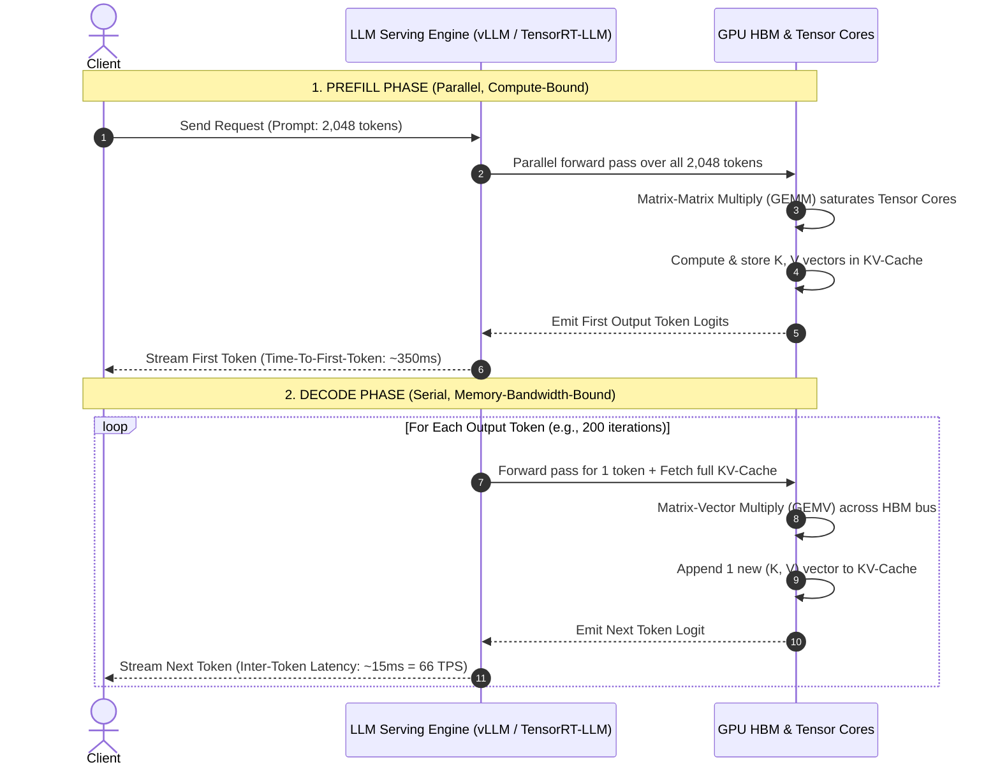
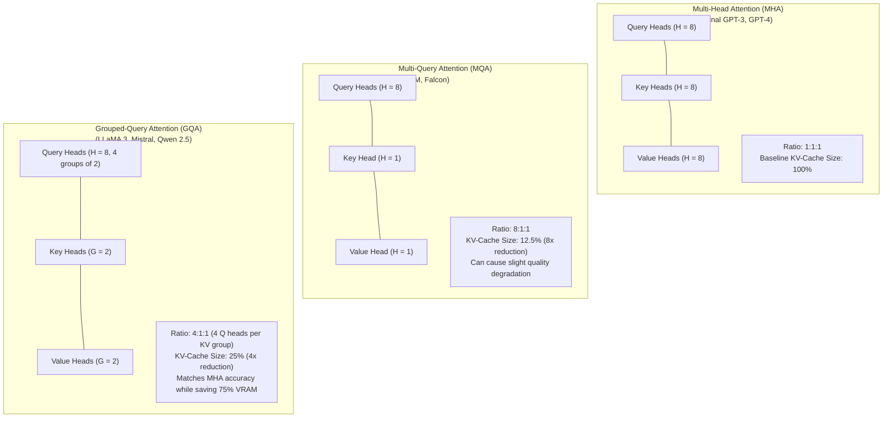
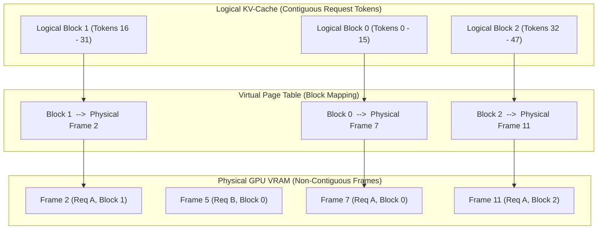

# Lesson 03: KV-Cache Mechanics & Memory Sizing Math

`🟡 Engineering Depth` · *Phase 00: Foundations & Token Mechanics* · *Estimated Reading Time: 15 minutes*

---

## What You Will Learn

By the end of this lesson, you will understand:
- Why autoregressive text generation requires caching Key and Value activation vectors in GPU memory.
- The fundamental duality between the compute-bound **Prefill Phase** and the memory-bound **Decode Phase**.
- The exact mathematical derivation of KV-cache memory consumption.
- The architectural evolution from Multi-Head Attention (MHA) to Multi-Query (MQA) and Grouped-Query Attention (GQA).
- How PagedAttention applies OS virtual memory paging to eliminate KV-cache fragmentation.
- How to build a production VRAM capacity planner to prevent out-of-memory crashes under concurrent load.

---

## 1. The Problem: The Concurrency Wall

When designing traditional web microservices, scaling from 1 concurrent user to 100 concurrent users primarily increases CPU utilization and network sockets. Memory consumption per connection is negligible (often measured in kilobytes).

In Large Language Model serving, **memory scales dynamically with every single token generated across every active connection**:

```text
Static GPU Footprint (LLaMA-3.1-70B FP16):
├── Model Weights: 140 GB VRAM (Fixed)
│
Dynamic GPU Footprint (KV-Cache):
├── 1 User   @ 8,000 tokens context  = + 1.25 GB VRAM
├── 10 Users  @ 8,000 tokens context  = + 12.50 GB VRAM
├── 50 Users  @ 8,000 tokens context  = + 62.50 GB VRAM
└── 100 Users @ 8,000 tokens context  = + 125.00 GB VRAM (Instant Cluster OOM!)
```

Even if your GPUs have enough compute power to process 2,000 tokens per second, your service will crash the moment concurrent context allocations exhaust available High-Bandwidth Memory (HBM).

To operate LLM services reliably in production, you must understand the mechanics of the **KV-Cache**.

---

## 2. Why Naive Approaches Fail: The O(N^2) Recomputation Trap

Why do we need a KV-cache in the first place? Why can't we simply feed the entire conversation history into the model every time we want the next token?

### The Naive Recomputation Flow
Suppose the model has already generated 1,000 tokens, and we need token 1,001:
- We could pass all 1,000 previous tokens into the neural network again.
- The transformer computes the self-attention of every token against every other token.
- It emits token 1,001.

Now we need token 1,002:
- We pass all 1,001 tokens into the network again.
- It recomputes attention across all 1,001 tokens from scratch.
- It emits token 1,002.

### Why This Destroys Performance
Because self-attention requires pairwise dot products between all tokens in the sequence, computing attention for a sequence of length `N` takes `O(N^2)` operations.

If you generate a 2,000-token response without caching:
```text
Total Operations = 1^2 + 2^2 + 3^2 + ... + 2000^2 ≈ (2000^3) / 3 ≈ 2.67 Billion Operations!
```

Generation latency degrades quadratically with every token generated. The first token takes 50 milliseconds; token 2,000 takes several seconds.

### The Engineering Solution: Memoization via the KV-Cache
In autoregressive generation, prior tokens are immutable. Their Key (`K`) and Value (`V`) vectors never change. 

Instead of recomputing them, the GPU saves the calculated `K` and `V` vectors for all past tokens in VRAM. When generating the next token, the model computes only **one** new Query vector, retrieves the cached `K` and `V` vectors from memory, and computes attention in `O(N)` time.

---

## 3. The Lifecycle: Prefill vs. Decode Duality

LLM inference consists of two distinct physical phases with completely different performance characteristics:



### Walkthrough of the Two Phases:
1. **The Prefill Phase (Prompt Processing)**:
   - The entire user prompt (e.g. 2,048 tokens) is submitted at once.
   - The GPU processes all prompt tokens in parallel using large **General Matrix-Matrix Multiplication (GEMM)** operations.
   - Arithmetic intensity is high. The GPU Tensor Cores are fully utilized.
   - This phase determines the **Time-To-First-Token (TTFT)** metric.
   - All resulting Key and Value vectors are written to the KV-cache.
2. **The Decode Phase (Autoregressive Generation)**:
   - Output tokens are generated strictly one at a time.
   - The GPU performs **General Matrix-Vector Multiplication (GEMV)** operations.
   - Arithmetic intensity drops to near zero (~1 FLOP/byte). The GPU compute cores spend most of their time idle, waiting for model weights and the KV-cache to be read from HBM.
   - This phase determines the **Tokens-Per-Second (TPS)** throughput.

### Latency Formula (Zero-LaTeX):
```text
Total Request Latency = TTFT + ( Output_Tokens × (1 / TPS) )
```

---

## 4. The KV-Cache Memory Formula & Derivation

How much GPU memory does an active request actually consume? Let's derive the formula from first principles:

For every token stored in the context window:
1. We must store its **Key vector** (`K`).
2. We must store its **Value vector** (`V`).
3. This must be done across **every transformer layer** in the model (`L`).
4. Each layer has a specific number of Key-Value attention heads (`H_KV`).
5. Each attention head has a hidden dimensionality (`d_k`, typically 128 dimensions).
6. Each floating-point number consumes bytes based on numerical precision (`P_bytes`, 2 bytes for FP16/BF16, 1 byte for FP8).

### The Master KV-Cache Sizing Formula:
```text
KV Cache (Bytes) = 2 (for K & V) × Precision_Bytes × Layers × Heads_KV × Head_Dim × Batch_Size × Sequence_Length
```

### Worked Enterprise Example: LLaMA-3.1-70B
Let's calculate the KV-cache footprint for a production LLaMA-3.1-70B model serving a single request with an 8,192-token context:
- **Precision**: 16-bit (2 bytes per element)
- **Number of Layers (`L`)**: 80
- **Number of KV Heads (`H_KV`)**: 8 (LLaMA-3 uses Grouped-Query Attention)
- **Head Dimension (`d_k`)**: 128
- **Sequence Length (`S`)**: 8,192 tokens
- **Batch Size (`B`)**: 1

```text
KV Cache = 2 × 2 bytes × 80 layers × 8 heads × 128 dim × 1 batch × 8,192 sequence
KV Cache = 4 × 80 × 8 × 128 × 8,192
KV Cache = 320 × 1,024 × 8,192 = 2,684,354,560 Bytes ≈ 2.68 Gigabytes!
```

A single user conversation spanning 8,192 tokens consumes **2.68 GB of dedicated GPU VRAM**. If 20 users submit concurrent requests with 8k contexts, the KV-cache alone requires **53.6 GB of VRAM**, on top of the 140 GB needed for model weights!

---

## 5. Attention Architectures: MHA vs. MQA vs. GQA

Early transformers used **Multi-Head Attention (MHA)**, where every Query head has its own dedicated Key head and Value head. As context lengths expanded to 32k and 128k, MHA's KV-cache became completely unsustainable.

The AI industry evolved attention architectures to reduce the size of the scratchpad:



### Walkthrough of Attention Architectures:
1. **Multi-Head Attention (MHA)**:
   - Standard 1:1:1 ratio. If there are 64 Query heads, there are 64 Key heads and 64 Value heads.
   - Offers maximum representational expressiveness, but the KV cache scales linearly with the total number of attention heads.
2. **Multi-Query Attention (MQA)**:
   - All Query heads share a single Key head and a single Value head.
   - Reduces KV-cache memory by `H_Q` times (up to an 8x or 16x reduction).
   - Drawback: Can degrade reasoning and fine-grained associative recall on complex multi-hop tasks.
3. **Grouped-Query Attention (GQA)** (Ainslie et al., 2023):
   - Divides Query heads into `G` groups, with each group sharing one Key and one Value head.
   - For example, LLaMA-3-70B has 64 Query heads and 8 KV heads (8 Query heads per group).
   - **Result**: Delivers 99%+ of MHA's benchmark accuracy while cutting KV-cache footprint by **8x**!

### Memory Reduction Factor Formula:
```text
Memory Reduction Factor = Total_Query_Heads / Total_KV_Heads
```

---

## 6. PagedAttention: Virtual Memory for LLMs

Before 2023, standard LLM serving systems allocated memory for the KV-cache as **contiguous physical chunks** sized to the absolute maximum potential context length (e.g. reserving 8,192 tokens of space even if the user only sent a 100-token prompt).

This naive strategy caused catastrophic memory waste:
- **Internal Fragmentation**: Reserving space for 8,192 tokens when the request only generates 500 tokens.
- **External Fragmentation**: Memory gaps between requests that were too small to fit another worst-case allocation.
- In practice, **60% to 80% of GPU VRAM was completely wasted sitting empty**.

### The PagedAttention Revolution (Kwon et al., 2023 / vLLM)
PagedAttention borrows the foundational concept of **OS Virtual Memory Paging**:



### Walkthrough of PagedAttention Paging:
1. **Fixed-Size Physical Blocks**: GPU memory is divided into fixed-size physical frames (typically 16 or 32 tokens each).
2. **On-Demand Allocation**: When a request begins, only the blocks needed for the immediate prompt tokens are allocated.
3. **Non-Contiguous Storage**: As new tokens are generated, new physical blocks are allocated wherever space exists in VRAM. Physical memory does not need to be contiguous.
4. **Virtual Block Table**: An OS-style page table translates logical sequence token offsets into physical memory pointers.
5. **Zero-Copy Branching**: For multi-agent systems and parallel sampling, multiple requests can point to the same physical prompt blocks (Copy-on-Write), slashing memory usage for shared system prompts by up to 90%.

---

## 7. Concrete Implementation: GPU Capacity Planner

The following Python 3.12 script implements an exact VRAM and KV-Cache Capacity Planner using Pydantic v2. Use this tool to calculate concurrency limits and predict OOM boundaries before deploying to production.

```python
"""
Production GPU VRAM & KV-Cache Sizing Calculator.
Determines maximum safe concurrency, static weight footprint, and dynamic cache limits.
"""

from typing import Literal
from pydantic import BaseModel, Field


class ModelConfig(BaseModel):
    """Transformer architecture hyperparameters."""
    name: str
    total_parameters_billions: float
    num_layers: int
    num_query_heads: int
    num_kv_heads: int
    head_dimension: int = 128
    default_precision: Literal["FP16", "BF16", "FP8", "INT4"] = "FP16"

    @property
    def bytes_per_weight(self) -> float:
        mapping = {"FP16": 2.0, "BF16": 2.0, "FP8": 1.0, "INT4": 0.5}
        return mapping[self.default_precision]

    @property
    def gqa_ratio(self) -> float:
        """Memory reduction ratio over standard Multi-Head Attention."""
        return self.num_query_heads / self.num_kv_heads


class GPUHardwareSpec(BaseModel):
    """Target GPU physical memory constraints."""
    name: str
    vram_capacity_gb: float
    cuda_runtime_overhead_gb: float = Field(
        default=2.5, description="PyTorch/CUDA runtime buffers and context overhead"
    )

    @property
    def usable_vram_gb(self) -> float:
        return max(0.0, self.vram_capacity_gb - self.cuda_runtime_overhead_gb)


class CapacityReport(BaseModel):
    """Comprehensive sizing and concurrency analysis."""
    model_name: str
    gpu_name: str
    static_weights_gb: float
    remaining_vram_for_cache_gb: float
    kv_cache_per_token_bytes: float
    single_session_cache_mb: float
    max_safe_concurrent_streams: int
    is_deployable: bool


class VRAMCapacityPlanner:
    """Calculates serving capacity and guards against out-of-memory crashes."""

    @staticmethod
    def calculate_capacity(
        model: ModelConfig,
        hardware: GPUHardwareSpec,
        target_context_tokens: int = 4096,
        kv_cache_precision_bytes: float = 2.0,  # 2.0 for FP16, 1.0 for FP8 KV cache
    ) -> CapacityReport:
        # 1. Static model weight footprint
        static_weight_bytes = model.total_parameters_billions * 1e9 * model.bytes_per_weight
        static_weights_gb = static_weight_bytes / (1024**3)

        # 2. Remaining VRAM for dynamic KV cache
        remaining_vram_gb = hardware.usable_vram_gb - static_weights_gb
        is_deployable = remaining_vram_gb > 2.0  # Require at least 2 GB free for minimal caching

        # 3. KV-cache bytes per single token step across the entire model:
        # Formula: 2 (K and V) * Layers * KV_Heads * Head_Dim * Bytes_Per_Element
        bytes_per_token = (
            2.0
            * model.num_layers
            * model.num_kv_heads
            * model.head_dimension
            * kv_cache_precision_bytes
        )

        # 4. KV-cache for one complete user session at target context length:
        session_cache_bytes = bytes_per_token * target_context_tokens
        session_cache_mb = session_cache_bytes / (1024**2)
        session_cache_gb = session_cache_bytes / (1024**3)

        # 5. Maximum concurrent streams before exhausting available VRAM:
        if is_deployable and session_cache_gb > 0:
            # Leave 10% safety buffer for memory fragmentation
            safe_cache_pool_gb = remaining_vram_gb * 0.90
            max_concurrency = int(safe_cache_pool_gb // session_cache_gb)
        else:
            max_concurrency = 0

        return CapacityReport(
            model_name=model.name,
            gpu_name=hardware.name,
            static_weights_gb=round(static_weights_gb, 2),
            remaining_vram_for_cache_gb=round(remaining_vram_gb, 2),
            kv_cache_per_token_bytes=round(bytes_per_token, 2),
            single_session_cache_mb=round(session_cache_mb, 2),
            max_safe_concurrent_streams=max_concurrency,
            is_deployable=is_deployable,
        )


# --- Example Execution ---
if __name__ == "__main__":
    # LLaMA-3.1-70B architecture parameters
    llama_70b = ModelConfig(
        name="Meta-LLaMA-3.1-70B (FP16)",
        total_parameters_billions=70.6,
        num_layers=80,
        num_query_heads=64,
        num_kv_heads=8,  # GQA: 8:1 ratio
        head_dimension=128,
        default_precision="FP16",
    )

    # Dual NVIDIA H100 SXM5 (160 GB combined VRAM via Tensor Parallelism = 2)
    h100_pair = GPUHardwareSpec(
        name="2x NVIDIA H100 SXM5 (160 GB Total)",
        vram_capacity_gb=160.0,
        cuda_runtime_overhead_gb=5.0,
    )

    report = VRAMCapacityPlanner.calculate_capacity(
        model=llama_70b,
        hardware=h100_pair,
        target_context_tokens=8192,
        kv_cache_precision_bytes=2.0,  # FP16 KV-Cache
    )

    print("=== ENTERPRISE VRAM & CONCURRENCY SIZING REPORT ===")
    print(f"Model: {report.model_name}")
    print(f"Hardware Cluster: {report.gpu_name}")
    print(f"Deployable: {'YES' if report.is_deployable else 'NO (Insufficient VRAM)'}")
    print(f"Static Model Weights: {report.static_weights_gb} GB")
    print(f"Remaining VRAM for KV-Cache: {report.remaining_vram_for_cache_gb} GB")
    print(f"KV-Cache per Token: {report.kv_cache_per_token_bytes:,.0f} Bytes")
    print(f"Single Session Cache (8k context): {report.single_session_cache_mb} MB")
    print(f"Max Safe Concurrent Streams: {report.max_safe_concurrent_streams} streams")
```

### Script Output Analysis:
```text
=== ENTERPRISE VRAM & CONCURRENCY SIZING REPORT ===
Model: Meta-LLaMA-3.1-70B (FP16)
Hardware Cluster: 2x NVIDIA H100 SXM5 (160 GB Total)
Deployable: YES
Static Model Weights: 131.5 GB
Remaining VRAM for KV-Cache: 23.5 GB
KV-Cache per Token: 327,680 Bytes
Single Session Cache (8k context): 2,560.0 MB
Max Safe Concurrent Streams: 8 streams
```

Notice the critical operational takeaway: across two $30,000 H100 GPUs (160 GB combined VRAM), after loading the 70B model weights and accounting for runtime buffers, **you have enough memory to safely serve only 8 concurrent users** with an 8,192-token context! 

If a 9th user submits a request, the cluster will OOM unless you implement PagedAttention, KV-cache quantization (FP8), or request queueing.

---

## 8. Trade-offs & Architecture Decision Matrix

| Attention Variant | KV-Cache Footprint | Quality / Accuracy | Concurrency Multiplier | Dominant Production Examples |
|---|---|---|---|---|
| **Multi-Head Attention (MHA)** | 100% (Baseline, Largest) | Maximum baseline | 1.0x (Lowest concurrency) | GPT-3, GPT-4, original Transformer |
| **Multi-Query Attention (MQA)** | 12.5% (8x reduction) | Small drop in associative multi-hop recall | Up to 8x higher concurrency | PaLM, Falcon 40B |
| **Grouped-Query Attention (GQA)** | 25% (4x reduction for G=2) to 12.5% (8x for G=8) | Indistinguishable from MHA | 4x to 8x higher concurrency | LLaMA 3, Mistral, Qwen 2.5 |
| **FP8 Quantized KV-Cache** | 50% cut over FP16 KV cache | Minimal perplexity change (< 0.1%) | 2x additional concurrency | Supported in vLLM and TensorRT-LLM |

---

## 9. Common Failure Modes & Anti-Patterns

### Anti-Pattern 1: The Linear Concurrency Assumption
- **The Mistake**: Engineering teams assume that because the GPU is at 20% compute utilization under 10 concurrent requests, it can comfortably handle 50 concurrent requests.
- **Why It Fails**: Compute scales smoothly; KV-cache memory scales with both batch size AND sequence length. When those 50 requests reach deep context during multi-turn chat, VRAM suddenly exhausts, triggering an immediate crash.
- **Production Remedy**: Implement an admission controller at the API Gateway that checks available KV-cache blocks in vLLM before accepting new requests.

### Anti-Pattern 2: Disregarding PagedAttention Block Sizing
- **The Mistake**: Setting the PagedAttention block size too large (e.g. `block_size = 64` or `128` tokens) in low-latency environments.
- **Why It Fails**: Oversized blocks re-introduce internal fragmentation. If a request terminates after generating 65 tokens, two full 64-token blocks are allocated, wasting nearly 50% of the memory.
- **Production Remedy**: Use `block_size = 16` for varied conversational workloads with high request turn-over; use `block_size = 32` for high-throughput batch summarization.

---

## 10. Key Takeaways

1. **The KV-Cache Is Stateful Scratchpad Memory**: In autoregressive decode, past Key and Value vectors must be retained in VRAM to prevent quadratic $O(N^2)$ recomputation.
2. **Decode Is Memory-Bandwidth-Bound**: Generating tokens one at a time is bottlenecked by the speed of transferring model weights and KV activations across the HBM bus.
3. **Grouped-Query Attention (GQA) Is the Industry Standard**: By grouping Query heads to share Key-Value heads, GQA reduces KV-cache memory consumption by 4x to 8x with zero loss in output quality.
4. **PagedAttention Eliminates Memory Waste**: Applying OS-style non-contiguous paging to the KV cache reduces memory fragmentation from ~70% to under 4%.

---

## 11. Verified Resources

- **[Ainslie et al. (2023) — GQA: Training Generalized Multi-Query Transformer Models from Multi-Head Checkpoints](https://arxiv.org/abs/2305.13245)**: The seminal research paper introducing Grouped-Query Attention.
- **[Kwon et al. (2023) — Efficient Memory Management for Large Language Model Serving with PagedAttention](https://arxiv.org/abs/2309.06180)**: The foundational paper behind the vLLM serving engine.
- **[Pope et al. (2022) — Efficiently Scaling Transformer Inference](https://arxiv.org/abs/2211.05102)**: Detailed analysis of arithmetic intensity and memory bandwidth bottlenecks in large models.
- **Previous Lesson**: [Lesson 02: Tokenization & Byte-Pair Encoding (BPE)](./02-tokenization-and-bpe-mechanics.md)
- **Next Lesson**: [Lesson 04: Test-Time Compute & Reasoning Tokens](./04-test-time-compute-and-reasoning-models.md)
