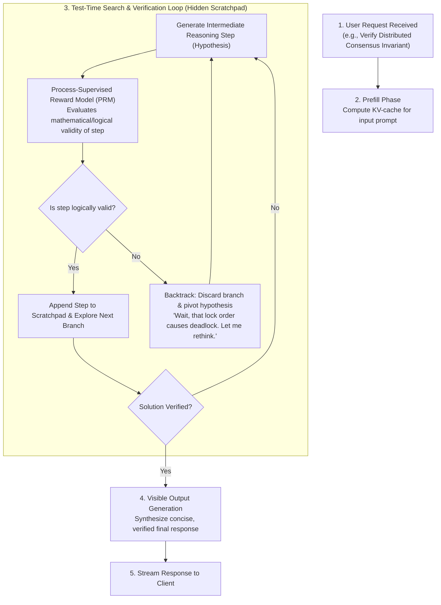
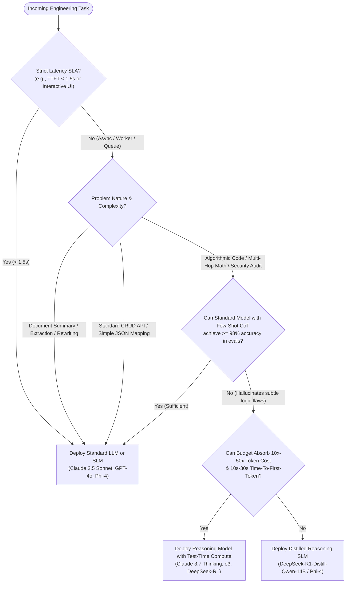

# Lesson 04: Test-Time Compute & Reasoning Tokens

`🔵 Advanced` · *Phase 00: Foundations & Token Mechanics* · *Estimated Reading Time: 16 minutes*

---

## What You Will Learn

By the end of this lesson, you will understand:
- The fundamental shift from pre-training compute scaling to test-time (inference-time) compute scaling.
- The internal mechanics of reasoning models: search trees, Process-Supervised Reward Models (PRMs), and backtracking.
- The 50:1 thinking token asymmetry and its financial impact on cloud API billing.
- Why reasoning scratchpads cannot be pre-cached like static prompt prefixes.
- How to architect a production token governor with dead-man switches and circuit breakers to prevent runaway billing bankruptcies.

---

## 1. The Problem: The Limits of Pre-Training Scaling

From 2017 to 2024, AI progress was driven almost entirely by the **first scaling law** (Kaplan et al., 2020; Chinchilla, Hoffmann et al., 2022):
- Scrape tens of trillions of tokens from the public internet.
- Rent tens of thousands of GPUs for months.
- Compress human knowledge into static, frozen neural network weights.

However, by late 2024, pre-training compute began encountering hard physical and informational limits:
1. **Human Data Depletion**: The high-quality public text on the internet had been completely exhausted.
2. **Exponential Power Costs**: Training next-generation clusters required hundreds of megawatts of electrical power and billions of dollars in capital expenditure.
3. **The Single-Pass Hallucination Ceiling**: Standard transformers operate under a strict constraint: **O(1) compute per emitted token**. When you ask a standard model to write a complex 500-line multi-threaded distributed lock, it must emit the first token within a fraction of a second. It cannot pause to explore hypotheses, simulate race conditions, or verify invariants before typing.

When faced with novel multi-step algorithmic reasoning, single-pass models frequently hallucinate plausible-sounding code that fails under edge cases.

---

## 2. Why Naive Approaches Fail

Before dedicated reasoning models, engineering teams attempted to force standard models into deep reasoning:

- **Prompt Begging ("Think Step-by-Step")**: Adding phrases like `"Take a deep breath and think carefully before answering"` slightly improves Chain-of-Thought (CoT) formatting, but does not allocate more internal search depth. The model remains bound by the frozen probability distribution of its single forward pass.
- **Client-Side Self-Consistency Loops**: Developers wrote loops that called GPT-4 five times, parsed the answers with regex, and computed majority voting. This multiplied latency and API costs by 5x while lacking any mechanism for the model to detect and backtrack from subtle logical flaws.
- **Unbounded Thinking Without Governance**: When first adopting reasoning models (such as OpenAI o3 or Claude 3.7 Thinking), teams enabled thinking by default across all services. Automated background workers processed ambiguous inputs, entered recursive reasoning loops, and drained monthly cloud budgets in hours.

---

## 3. Systems Mental Model: The Math Student's Scratchpad

To understand test-time compute, compare an LLM to a student taking an advanced mathematics exam:

```text
Standard LLM (The Impulsive Student):
- Teacher asks: "What is 387 × 492?"
- Rules: Zero scratch paper allowed. Must shout the answer in 0.2 seconds.
- Student: Brain does a quick reflex estimate and blurts out "189,424".
- Result: Sounds confident, ends in a 4, but is completely incorrect.

Reasoning Model (The Diligent Student with Scratch Paper):
- Teacher asks: "What is 387 × 492?"
- Rules: Unlimited scratch paper allowed. Take as long as you need.
- Student: Stays silent for 30 seconds while writing on the scratchpad:
    1. 387 × 400 = 154,800
    2. 387 × 90  = 34,830
    3. 387 × 2   = 774
    4. Sum intermediate products: 154,800 + 34,830 = 189,630
    5. Add final piece: 189,630 + 774 = 190,404
    6. Sanity check: 400 × 500 = 200,000. 190,404 is close. Calculation verified.
- Student looks up and speaks one word: "190,404".
- Result: 100% correct, verified through internal reasoning steps.
```

The student used 150 words of private scratchpad reasoning to produce a 1-word final output. **Test-time compute trades inference latency and token bandwidth for verified logical accuracy.**

---

## 4. Mechanical Architecture of Test-Time Compute

How do models like OpenAI o3, DeepSeek-R1, and Claude 3.7 Thinking execute this scratchpad process under the hood?



### Walkthrough of the Reasoning Loop:
1. **Input Prefill**: The user prompt is ingested and its Key-Value activations are stored in GPU memory.
2. **Search Tree Generation**: Rather than sampling along the single path of highest token probability, the model generates multiple potential branches of reasoning (using variants of Monte Carlo Tree Search or beam search).
3. **Step-Level Verification via PRMs**: While traditional models are evaluated only on final answers (Outcome Reward Models), reasoning models utilize **Process-Supervised Reward Models (PRMs)** that grade every single deduction step.
4. **Internal Self-Correction & Backtracking**: When a reasoning branch violates a constraint or reaches a contradiction, the model generates an internal pivot token (e.g. `"Wait, that assumption fails under edge condition X. Let me re-evaluate."`), pruning the bad branch and exploring alternative paths.
5. **Final Synthesis**: Once the solution is internally verified, the model summarizes its conclusion into the final visible output.

---

## 5. Frontier Reasoning Model Landscape

The industry has converged on two distinct deployment architectures: pure reasoning models (fixed RL loops) and hybrid models (configurable thinking budgets).

| Model | Provider | Architecture & Mechanism | Thinking Budget Control | Max Context / Output | Cost Profile (per 1M Tokens) | Primary Enterprise Production Use Case |
|---|---|---|---|---|---|---|
| **OpenAI o3** | OpenAI | Large-scale RL over hidden CoT; deep tree search | `reasoning_effort: low / medium / high` | 200k Context / 100k Output | In: ~\$10.00 / Out: ~\$40.00 *(Thinking billed as output)* | Mission-critical algorithmic verification, complex multi-file refactoring |
| **OpenAI o4-mini** | OpenAI | Distilled compact RL reasoning architecture | `reasoning_effort: low / medium / high` | 200k Context / 100k Output | In: ~\$1.10 / Out: ~\$4.40 *(Thinking billed as output)* | Fast STEM logic, real-time code triage, sub-second agent planning |
| **Claude 3.7 Thinking** | Anthropic | Hybrid: toggles seamlessly between instant output and extended thinking | Explicit token budget (`budget_tokens: 1024..64000`) or disabled (`0`) | 200k Context / 64k Output | In: \$3.00 / Out: \$15.00 *(Thinking billed at \$15.00/1M)* | Full-stack software engineering, architecture audits, regulatory compliance |
| **DeepSeek-R1** | DeepSeek | 671B MoE (37B active parameters); pure RL (R1-Zero) + cold-start SFT | Open-weights / `<think>` tag token boundaries | 64k Context / 32k Output | In: \$0.55 / Out: \$2.19 *(Cache Hit: \$0.14/1M)* | Air-gapped self-hosted reasoning, bulk batch code analysis, on-prem finance |
| **Gemini 2.5 Pro Thinking** | Google | Native multimodal test-time compute with code execution sandbox | Configurable budget (`thinkingBudget: N`) | 1M - 2M Context / 64k Output | In: ~\$2.50 / Out: ~\$10.00 *(Thinking billed at \$10.00/1M)* | Long-context document forensic audits, full-repository migrations |

---

## 6. Thinking Token Economics: The 50:1 Asymmetry

The single most critical operational trap with reasoning models is the **output token asymmetry**.

### The 5,000 : 28 Reality
Suppose an automated CI/CD pipeline sends a pull request diff to a reasoning model with the prompt:
> *"Does this concurrency loop contain a potential race condition under the ARM64 memory model? Answer strictly with YES or NO and a one-sentence proof."*

```text
The Model's Execution:
├── Prompt Input: 250 tokens
├── Hidden Scratchpad Tokens Emitted: 5,240 tokens
└── Visible Output Emitted: 28 tokens:
    "YES. The memory barrier is omitted prior to reading the pointer, 
     permitting CPU instruction reordering on weakly-ordered architectures."
```

### The Financial Calculation
In cloud LLM APIs, **all thinking tokens are billed as output tokens**. Because output tokens typically cost 3x to 5x more than input tokens (\$15/1M vs \$3/1M):

```text
Input Cost:   (250 tokens / 1,000,000) × $3.00   = $0.00075
Output Cost:  (5,268 tokens / 1,000,000) × $15.00  = $0.07902
Total Cost:   $0.07977 (Nearly 8 cents for a one-sentence response!)
```

The ratio of hidden thinking tokens to visible output was **187 to 1**!

### Why Thinking Tokens Cannot Be Pre-Cached
In standard LLM serving, if 1,000 users send the same system prompt, you can use **Prefix KV-Caching** to get a 90% discount on input tokens.

**You cannot pre-cache reasoning tokens across separate user queries.** Every reasoning trajectory is non-deterministic and dynamic. The scratchpad is generated autoregressively in response to the specific nuances of that single input, consuming full GPU memory bandwidth on every run.

---

## 7. Concrete Implementation: Production Reasoning Token Governor

To prevent runaway billing and catastrophic budget exhaustion, production architectures require a **Token Governor & Circuit Breaker** that enforces thinking token budgets and halts execution if the asymmetry ratio exceeds safety limits.

```python
"""
Production Reasoning Token Governor & Circuit Breaker.
Enforces per-request cost ceilings and monitors thinking-to-output asymmetry.
"""

from typing import Any
from pydantic import BaseModel, Field


class ReasoningRequest(BaseModel):
    """Specification for an incoming reasoned task."""
    task_id: str
    prompt: str
    max_visible_tokens: int = Field(default=1024, ge=1)
    thinking_budget: int = Field(default=4096, ge=0)
    cost_ceiling_usd: float = Field(default=0.25, ge=0.01)


class ExecutionTelemetry(BaseModel):
    """Actual token consumption emitted by LLM provider."""
    prompt_tokens: int
    thinking_tokens: int
    visible_tokens: int

    @property
    def total_output_tokens(self) -> int:
        return self.thinking_tokens + self.visible_tokens

    @property
    def asymmetry_ratio(self) -> float:
        """Ratio of hidden reasoning to visible output."""
        return self.thinking_tokens / max(1, self.visible_tokens)


class CostReport(BaseModel):
    """Financial and operational audit of the reasoning invocation."""
    task_id: str
    is_approved: bool
    total_cost_usd: float
    asymmetry_ratio: float
    warning: str | None = None


class ReasoningGovernor:
    """Enterprise policy engine governing test-time compute allocation."""

    # Pricing per 1M tokens (e.g., Claude 3.7 Thinking tier)
    INPUT_RATE_PER_M: float = 3.00
    OUTPUT_RATE_PER_M: float = 15.00
    ASYMMETRY_WARNING_THRESHOLD: float = 50.0  # Alert if thinking > 50x visible

    @classmethod
    def audit_execution(
        cls, request: ReasoningRequest, telemetry: ExecutionTelemetry
    ) -> CostReport:
        # Calculate exact monetary cost
        input_cost = (telemetry.prompt_tokens / 1_000_000.0) * cls.INPUT_RATE_PER_M
        output_cost = (telemetry.total_output_tokens / 1_000_000.0) * cls.OUTPUT_RATE_PER_M
        total_cost = round(input_cost + output_cost, 6)

        warning: str | None = None

        # Check circuit breaker ceiling
        if total_cost > request.cost_ceiling_usd:
            return CostReport(
                task_id=request.task_id,
                is_approved=False,
                total_cost_usd=total_cost,
                asymmetry_ratio=round(telemetry.asymmetry_ratio, 1),
                warning=(
                    f"CIRCUIT BREAKER TRIGGERED: Cost ${total_cost:.4f} exceeded "
                    f"allocated ceiling of ${request.cost_ceiling_usd:.4f}."
                ),
            )

        # Monitor extreme token asymmetry
        if telemetry.asymmetry_ratio > cls.ASYMMETRY_WARNING_THRESHOLD:
            warning = (
                f"HIGH ASYMMETRY WARNING: Thinking ratio is {telemetry.asymmetry_ratio:.1f}:1 "
                f"({telemetry.thinking_tokens} thinking vs {telemetry.visible_tokens} visible tokens)."
            )

        return CostReport(
            task_id=request.task_id,
            is_approved=True,
            total_cost_usd=total_cost,
            asymmetry_ratio=round(telemetry.asymmetry_ratio, 1),
            warning=warning,
        )


# --- Simulation Demonstration ---
if __name__ == "__main__":
    governor = ReasoningGovernor()

    # Scenario 1: Normal targeted engineering analysis
    req_normal = ReasoningRequest(
        task_id="TASK-REF-001",
        prompt="Analyze this 50-line C++ routine for deadlock invariants.",
        thinking_budget=4096,
        cost_ceiling_usd=0.10,
    )
    telem_normal = ExecutionTelemetry(
        prompt_tokens=850,
        thinking_tokens=2200,
        visible_tokens=350,
    )
    result_normal = governor.audit_execution(req_normal, telem_normal)
    print("=== SCENARIO 1: Standard Reasoning Task ===")
    print(f"Status: {'APPROVED' if result_normal.is_approved else 'REJECTED'}")
    print(f"Cost: ${result_normal.total_cost_usd:.4f}")
    print(f"Asymmetry: {result_normal.asymmetry_ratio}:1")
    print(f"Warnings: {result_normal.warning or 'None'}\n")

    # Scenario 2: Runaway automated background task
    req_runaway = ReasoningRequest(
        task_id="TASK-BATCH-999",
        prompt="Classify this ambiguous document into category A or B.",
        thinking_budget=32000,
        cost_ceiling_usd=0.25,
    )
    telem_runaway = ExecutionTelemetry(
        prompt_tokens=1200,
        thinking_tokens=28500,  # Model got stuck in deep hypothesis loop
        visible_tokens=15,      # Emitted "Category: A"
    )
    result_runaway = governor.audit_execution(req_runaway, telem_runaway)
    print("=== SCENARIO 2: Runaway Thinking Task ===")
    print(f"Status: {'APPROVED' if result_runaway.is_approved else 'REJECTED'}")
    print(f"Cost: ${result_runaway.total_cost_usd:.4f}")
    print(f"Asymmetry: {result_runaway.asymmetry_ratio}:1")
    print(f"Warnings: {result_runaway.warning}")
```

---

## 8. Production War Story: The 2:14 AM Runaway Bankruptcy

> **The Incident**: It is 2:14 AM on Sunday. Your pager buzzes with an alert from cloud cost monitoring: an internal LLM gateway just generated **\$3,600 in charges over the last 90 minutes**.

### What Happened
A fintech team deployed Claude 3.7 Thinking to triage incoming merchant chargeback dispute packets. An engineer configured the service with an aggressive configuration:

```python
# THE FATAL DEFAULT:
thinking={"type": "enabled", "budget_tokens": 32000}
```

A merchant submitted an ambiguous 40-page PDF containing conflicting scanned ledger dates and handwritten receipts. The reasoning model entered a recursive hypothesis search:
- *Hypothesis 1*: Payment settled on March 12th. *(Contradicted by document 2, page 14)*.
- *Hypothesis 2*: Payment settled on March 14th. *(Contradicted by wire timestamp)*.
- *Hypothesis 3*: Simulating clearinghouse banking holiday retries...

Because the chargeback worker was managed by a background SQS queue with an automated 3-retry dead-letter policy, every worker timeout caused another instance to pick up the exact same job. 

Each attempt burned **32,000 thinking tokens** at \$15/1M (\$0.48 per attempt) while running for 55 seconds. When 100 concurrent workers processed the queue, the system burned:
```text
100 workers × 30 attempts/hour × $0.48 = $1,440 per hour
```

Before the on-call engineer woke up, **\$3,600 had evaporated to triage a single \$45 disputed chargeback**.

### Root Cause Analysis & Post-Mortem Architecture
1. **Uncapped Default Budgets**: Automated batch workers must never have a 32k thinking budget. Batch triage tasks must cap `budget_tokens: 1024` or `2048`.
2. **Missing Dead-Man Switch**: Retries re-executed full inference with identical thinking budgets. The SQS consumer now inspects task retry count and drops thinking tokens on retry attempts.
3. **Dynamic Budget Escalation**: Allocate deep thinking (16k+ tokens) **only** when an explicit human architect triggers a deep-analysis flag in the back-office console.

---

## 9. Architectural Decision Framework

Use this decision matrix to determine when to route requests to reasoning models versus standard models or Small Language Models (SLMs):



### The Architect's Golden Rule:
> **"If a Senior Software Engineer would need a whiteboard and 15 minutes of quiet deliberation before writing code, dispatch a Reasoning Model. If a Junior Engineer could write the answer off the top of their head in 30 seconds, use a Standard Model or an SLM."**

---

## 10. Common Failure Modes & Anti-Patterns

### Anti-Pattern 1: Forcing Raw JSON Output Without Scratchpad Space
- **The Mistake**: Prompting a reasoning model with `"Output strictly valid JSON with no other text"` or setting `response_format={"type": "json_object"}` while disabling thinking.
- **Why It Fails**: Forcing an immediate JSON output prevents the model from generating internal CoT tokens to verify logic before serialization, resulting in syntax errors or skipped business constraints.
- **Production Remedy**: Allow the model to think freely inside hidden CoT or `<think>` tags, then extract the final validated JSON from a designated `<output>` boundary.

### Anti-Pattern 2: Zeroing Out Temperature on Reasoning Models
- **The Mistake**: Blindly setting `temperature = 0.0` on reasoning models like OpenAI o-series or DeepSeek-R1.
- **Why It Fails**: Unlike standard models where `T = 0` enforces precision, setting `T = 0` on reasoning search algorithms can destroy the entropy needed for search-space exploration, inducing repetitive thinking loops.
- **Production Remedy**: Follow provider specifications: leave temperature at the model's native default (`1.0` for OpenAI o-series, `0.6` for DeepSeek-R1).

---

## 11. Key Takeaways

1. **Test-Time Compute Decouples Capability from Size**: Decouples intelligence from model parameter count by trading latency and tokens for search, verification, and backtracking.
2. **Beware the 50:1 Asymmetry**: Thinking tokens are billed at premium output rates. A concise 30-token final answer can quietly consume 5,000+ billed tokens.
3. **Reasoning Tokens Cannot Be Cached**: Unlike static prompt prefixes, internal reasoning paths are dynamic and query-specific, requiring full forward-pass computation every time.
4. **Govern Automated Queues**: Never deploy uncapped thinking budgets to background workers or automated retry queues without strict cost ceilings and circuit breakers.

---

## 12. Verified Resources

- **[Snell et al. (2024) — Scaling LLM Test-Time Compute Optimally Can Be More Effective than Scaling Model Parameters](https://arxiv.org/abs/2408.03314)**: Groundbreaking research proving test-time compute scaling laws.
- **[Lightman et al. (2023) — Let's Verify Step by Step](https://arxiv.org/abs/2305.20050)**: Seminal paper introducing Process-Supervised Reward Models (PRMs) for intermediate reasoning verification.
- **[DeepSeek-AI (2025) — DeepSeek-R1: Incentivizing Reasoning Capability in LLMs via Reinforcement Learning](https://arxiv.org/abs/2501.12948)**: Architectural details on pure RL reasoning emergence and distillation.
- **Previous Lesson**: [Lesson 03: KV-Cache Mechanics & Memory Sizing Math](./03-kv-cache-vram-and-bandwidth-physics.md)
- **Next Lesson**: [Lesson 05: Small Language Models & Model Quantization](./05-slms-and-quantization-mechanics.md)
