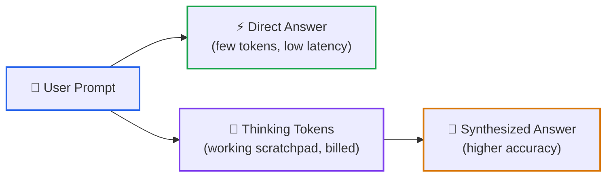
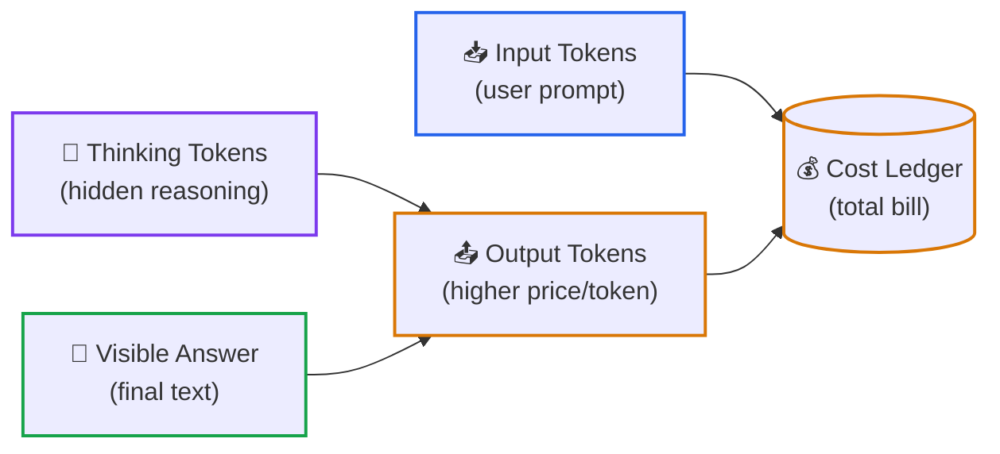
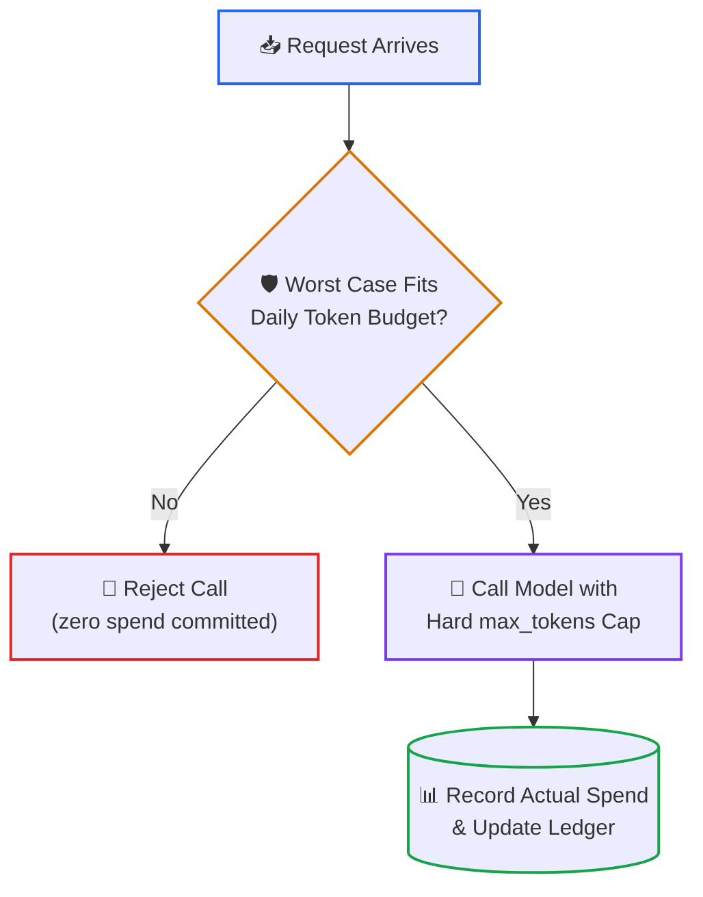

# Lesson 04: Letting a Model Think Before It Answers (Test-Time Compute and Reasoning Models)

> **Tier**: `🔵 Advanced` | **Read time**: ~16 min | **Prerequisites**: [Lesson 03: KV cache, prefill and decode](./03-kv-cache-vram-and-bandwidth-physics.md)  
> **Core Concept**: A reasoning model spends extra tokens writing out its working before it gives the final answer. Those working tokens are billed and count toward limits even though you often never see them, so you need a budget and a ceiling around them.  
> **New AI terms introduced**: reasoning model, test-time compute, thinking tokens, token governor  
> **AI terms assumed from earlier lessons**: [large language model (LLM)](./00-what-is-an-llm.md), [prompt](./00-what-is-an-llm.md), [token](./00-what-is-an-llm.md), [inference](./00-what-is-an-llm.md), [context window](./00-what-is-an-llm.md), [hallucination](./00-what-is-an-llm.md), [temperature](./00-what-is-an-llm.md), [decode](./03-kv-cache-vram-and-bandwidth-physics.md), [KV cache](./03-kv-cache-vram-and-bandwidth-physics.md)

---

## 🎯 What You Will Learn

- Explain in plain words what "thinking before answering" means for a language model and why it costs money.
- Read a provider's usage report and tell thinking tokens apart from answer tokens.
- Build a governor that caps thinking per request and spending per day.
- Decide when extra thinking is worth the latency and cost, and when it is waste.

---

## 1. The Problem

You route a batch job through a model. Each request is a one-word classification: the reply is `YES` or `NO`. You estimate the cost from the reply length, which is tiny. The invoice is far larger than the estimate.

What happened: the model wrote thousands of tokens of working first, and you paid for all of them. Three surprises follow from that:

| You assume | Reasoning reality |
|---|---|
| Output cost follows the length of the reply I receive | Output cost follows everything the model generated, including hidden working |
| A request has a predictable size | The amount of working varies per request and per task difficulty |
| A timeout protects me | A long-running request can be slow *and* expensive before it finishes |

The fix is the same kind of control you already use for other variable-cost resources: a per-request cap, a daily budget and a check before you spend.

## 2. The Mental Model

🧒 **Think of two ways to answer "What is 387 × 492?"** One person has to blurt a number the instant they are asked. The other is handed scrap paper, writes partial products, spots a slip, fixes it, and only then says the answer. The second person uses more time and more paper, and is more likely to be right on hard questions.

A normal model is the first person: it starts writing the answer immediately. A **reasoning model** is the second: it is trained or configured to write working first, then answer. The scrap paper is the model's own output, produced one token at a time, exactly like the answer itself.

**Where this analogy breaks**: a person's scrap paper is free. A model's scrap paper is billed per token, takes up space in the context window, and adds waiting time. Also, more working does not guarantee a correct answer. It improves accuracy on many multi-step tasks, but the model can still reason its way to a wrong conclusion.

## 3. How It Works, One Term at a Time

### Test-time compute and reasoning models

* 🧒 **The Analogy**: Studying for an exam is one kind of effort (paid once, in advance). Thinking during the exam is another (paid on every question). Study time is fixed. Exam-time thinking is something you can choose to spend more or less of on each question.
* ⚙️ **The Engineering**: Earlier lessons covered where the effort goes during **training** (building the model) and what **inference** costs (running it). **Test-time compute** means spending extra computation at inference time, on the specific request in front of you, instead of only at training time. In practice the extra computation is extra generated tokens. A **reasoning model** is a language model built or configured so that it generates working tokens before its answer. One paper studying this, [Snell et al. (2024)](https://arxiv.org/abs/2408.03314), reports that for problems where a smaller model already has some baseline competence, spending test-time compute well can beat a model 14 times larger. That is one study's result, not a law for all tasks.
* ⚠️ **What happens if you skip this?** You keep choosing models only by size and ignore a second dial. Some hard requests would be answered better by the same model with more thinking, and some easy requests get slower and pricier for no gain.

### Diagram 1: Direct answer versus thinking first



1. **Your prompt** is the same in both paths.
2. **Direct answer** starts writing the reply at once. Cheap and quick, weaker on multi-step problems.
3. **Thinking tokens** are generated first, one after another, using the same decode loop as any other output.
4. **Answer after thinking** comes last. You wait for the working before the first answer token.

### Thinking tokens

* 🧒 **The Analogy**: A taxi meter. It runs while the driver is working out the route, not only while you are moving. You see the final fare, not the driver's deliberation, but the meter counted all of it.
* ⚙️ **The Engineering**: **Thinking tokens** are the tokens a reasoning model generates as working before it writes the answer. Three facts matter for engineering, and each is stated in the provider documentation listed in the table below:
  * They are billed as output tokens. Anthropic's pricing section says thinking tokens are "billed as output tokens", OpenAI says reasoning tokens "are billed as output tokens", and Google says response pricing "is the sum of output tokens and thinking tokens".
  * The count you see in the reply text can be smaller than the count you pay for. Anthropic documents that you are billed for the full thinking process, not the summary shown in the response.
  * They share the output limit. Anthropic states that thinking counts toward `max_tokens`; OpenAI notes reasoning tokens occupy space in the context window and recommends leaving generous room for reasoning and output.
* ⚠️ **What happens if you skip this?** You set a small output cap sized for the visible reply. Hard requests spend the whole cap on thinking and the call ends with a truncated or empty answer, and you were still billed for the tokens.

### Diagram 2: What one request is made of



1. **Input tokens** are what you send.
2. **Thinking tokens** and **answer tokens** together form the output.
3. **Output tokens** are typically priced higher per token than input tokens, so thinking usually dominates the bill on hard requests. Check your provider's price page for the actual ratio.
4. **The bill** is input cost plus output cost.

A worked example with *(illustrative)* prices of 1 currency unit per million input tokens and 5 per million output tokens:

```text
Request: 300 input tokens, 12,000 thinking tokens, 5 answer tokens (illustrative)

Input cost  = 300      × 1 / 1,000,000 = 0.000300
Output cost = 12,005   × 5 / 1,000,000 = 0.060025
Total                                   = 0.060325

Same request with no thinking:
Output cost = 5        × 5 / 1,000,000 = 0.000025
Total                                   = 0.000325

Ratio = 0.060325 / 0.000325 ≈ 186 times more expensive
```

The ratio is large here because the example sets thinking at 2,400 times the answer length *(illustrative)*. Real ratios depend on the task, the model and the settings. Measure yours from the usage field your provider returns.

### Thinking controls and the token governor

* 🧒 **The Analogy**: A company card with a per-purchase limit and a monthly limit. Each purchase is checked against both before it goes through. You do not wait for the statement to find out.
* ⚙️ **The Engineering**: Providers expose a dial for thinking time. This dial comes in two common shapes: a **token budget** or an **effort level**. A token budget targets a specific number of thinking tokens. An effort level (low, medium, high) steers how deeply the model reasons. Parameter names change frequently across providers, so see the dated table in section 4. Two rules hold across providers: the dial guides thinking rather than guaranteeing cost, and only a hard output cap blocks overruns. Anthropic documents that the budget is a target rather than a strict cap, while `max_tokens` remains the hard ceiling.

  A **token governor** is your own code that sits between your application and the model call. It enforces rules the provider will not: a cap per request, a ceiling per day, and a smaller budget on retries. It must check the *worst case* before the call, because after the call the money is already spent.
* ⚠️ **What happens if you skip this?** Retries and batch workers multiply the cost of hard requests. A queue that re-delivers a failed job re-buys the same expensive thinking every time, and nothing stops the loop until a person notices the invoice.

### Diagram 3: The governor's decision



1. **Request arrives** with a declared input size, a thinking budget and room reserved for the answer.
2. **Worst case check** computes the most the call could cost: input plus the full hard output cap. If that would push today's total over the ceiling, stop.
3. **Reject** costs nothing and leaves the caller to retry later, downgrade, or alert.
4. **Call with a hard cap** passes the cap to the provider so the model cannot exceed it.
5. **Record actual spend** using the real usage numbers from the reply, so the next check sees the true total.

## 4. What Providers Offer Right Now

Model names and parameters change every few months, which is why they are kept out of the explanations above. This table was verified against the official pages on 2026-09-30. Re-check before relying on any row.

**As of 2026-09**

| Provider | How you control thinking | Where usage is reported | Notes from the docs | Official page |
|---|---|---|---|---|
| Anthropic | `thinking: {type: "adaptive"}` plus `output_config: {effort: ...}` with levels `low`, `medium`, `high`, `xhigh`, `max` (availability varies by model). Older manual mode: `thinking: {type: "enabled", budget_tokens: N}`, minimum 1,024 | `usage.output_tokens_details.thinking_tokens` | Manual mode is deprecated on 4.6 models and rejected with a 400 error on 4.7 and later. The model decides per request whether to think. Changing effort between requests invalidates the prompt cache. | [Steering thinking](https://platform.claude.com/docs/en/build-with-claude/thinking-steering-and-cost), [Extended thinking](https://platform.claude.com/docs/en/build-with-claude/extended-thinking) |
| OpenAI | `reasoning.effort` with values including `none`, `minimal`, `low`, `medium`, `high`, `xhigh`, `max` (supported values differ by model). Output cap: `max_output_tokens` | `output_tokens_details.reasoning_tokens` | Hitting the cap returns `status: "incomplete"` with `incomplete_details.reason: "max_output_tokens"`. Docs recommend reserving at least 25,000 tokens for reasoning and output when experimenting. | [Reasoning guide](https://developers.openai.com/api/docs/guides/reasoning) |
| Google (Gemini) | `thinking_level` with values such as `low`, `medium`, `high` (and `minimal` on some models) | `total_thought_tokens` | Models think dynamically by default. Pricing is the sum of output tokens and thinking tokens. Thought summaries are controlled by `thinking_summaries` (`auto` or `none`). | [Gemini thinking](https://ai.google.dev/gemini-api/docs/thinking) |
| DeepSeek | `thinking: {"type": "enabled" or "disabled"}` and `reasoning_effort` | Chain of thought returned in `reasoning_content`, next to `content` | The page I read did not state how thinking tokens are billed or counted against `max_tokens`. Read the pricing page before assuming. | [Thinking mode](https://api-docs.deepseek.com/guides/thinking_mode) |

Notice the pattern: Anthropic, OpenAI and Google now steer with an effort or level setting rather than one fixed token budget, and all three report thinking tokens separately in the usage data. That is the durable part. The spelling is not.

## 5. Try It (Runnable, Offline)

This block builds the governor from Diagram 3. The model call is simulated: you tell it how much thinking a task "needs" and it stops at the hard cap. Prices are supplied by the caller and are *(illustrative)*, not real rates. Needs Python 3.12+ and Pydantic v2, with no network.

```python
from pydantic import BaseModel, Field


class Prices(BaseModel):
    """Dollars per 1,000,000 tokens. Supplied by YOU from your provider's price page."""
    input_per_m: float = Field(ge=0)
    output_per_m: float = Field(ge=0)  # thinking tokens are billed at this rate


class Request(BaseModel):
    task_id: str
    input_tokens: int = Field(ge=0)
    thinking_budget: int = Field(ge=0)   # most thinking tokens we allow
    answer_reserve: int = Field(ge=1)    # room we keep for the visible answer


class Usage(BaseModel):
    thinking_tokens: int
    answer_tokens: int
    hit_cap: bool


def simulated_model(req: Request, thinking_needed: int, answer_len: int) -> Usage:
    """Stand-in for a real API call. Stops when the hard output cap is reached."""
    cap = req.thinking_budget + req.answer_reserve           # hard output cap
    thinking = min(thinking_needed, req.thinking_budget)
    answer = min(answer_len, cap - thinking)
    return Usage(thinking_tokens=thinking, answer_tokens=answer, hit_cap=thinking_needed > thinking)


class TokenGovernor:
    def __init__(self, prices: Prices, daily_ceiling: float) -> None:
        self.prices, self.daily_ceiling, self.spent = prices, daily_ceiling, 0.0

    def cost(self, input_tokens: int, output_tokens: int) -> float:
        p = self.prices
        return (input_tokens * p.input_per_m + output_tokens * p.output_per_m) / 1_000_000

    def worst_case(self, req: Request) -> float:
        return self.cost(req.input_tokens, req.thinking_budget + req.answer_reserve)

    def run(self, req: Request, thinking_needed: int, answer_len: int) -> str:
        worst = self.worst_case(req)
        if self.spent + worst > self.daily_ceiling:          # check BEFORE spending
            return f"{req.task_id}: REJECTED (worst case ${worst:.4f}, left ${self.daily_ceiling - self.spent:.4f})"
        u = simulated_model(req, thinking_needed, answer_len)
        actual = self.cost(req.input_tokens, u.thinking_tokens + u.answer_tokens)
        self.spent += actual
        flag = " cap-hit" if u.hit_cap else ""
        return f"{req.task_id}: ok thinking={u.thinking_tokens} answer={u.answer_tokens} cost=${actual:.4f}{flag}"


gov = TokenGovernor(Prices(input_per_m=1.0, output_per_m=5.0), daily_ceiling=0.08)  # illustrative prices
print(gov.run(Request(task_id="easy", input_tokens=800, thinking_budget=1024, answer_reserve=200), 300, 40))
print(gov.run(Request(task_id="hard", input_tokens=800, thinking_budget=4000, answer_reserve=500), 9000, 300))
for attempt in (1, 2):   # a retry reuses a big budget here, so watch the ceiling
    req = Request(task_id=f"retry{attempt}", input_tokens=800, thinking_budget=8000, answer_reserve=500)
    print(gov.run(req, 9000, 300))
print(f"spent today: ${gov.spent:.4f} of ${gov.daily_ceiling:.2f}")
```

Expected output (verified by running the block with Python 3.14.7 and Pydantic v2):

```text
easy: ok thinking=300 answer=40 cost=$0.0025
hard: ok thinking=4000 answer=300 cost=$0.0223 cap-hit
retry1: ok thinking=8000 answer=300 cost=$0.0423 cap-hit
retry2: REJECTED (worst case $0.0433, left $0.0129)
spent today: $0.0671 of $0.08
```

What to notice:
- **The easy task uses a fraction of its budget.** A budget is a limit, not a purchase. You only pay for what the model generates.
- **The hard task hits the cap.** It needed 9,000 thinking tokens and got 4,000. The governor reports `cap-hit` so you can log it and decide whether the answer is trustworthy or the task needs a bigger budget.
- **The second retry is refused before any money is spent.** Worst case ($0.0433) is more than what is left ($0.0129). Check this number, not the running total alone.
- **Real providers enforce caps differently.** In the simulation the budget is strict. Real dials are often soft guidance, so always also pass the provider's hard output cap.

## 6. Trade-Offs

| Choice | Benefit | Cost |
|---|---|---|
| More thinking (higher effort or budget) | Often better accuracy on multi-step problems | More output tokens, longer wait before the first answer token, higher bill |
| Less or no thinking | Faster and cheaper | More mistakes on hard multi-step tasks |
| Strict hard cap | Predictable worst-case spend | Hard tasks can be cut off mid-thought with no usable answer |
| Loose cap | Fewer truncated answers | Unpredictable spend, long-running requests |
| Different effort per request | Matches effort to difficulty | Anthropic documents that changing effort invalidates prompt caching, so switching often can raise input cost |
| Governor in your own code | Works the same across providers | You maintain prices and must keep them current |

Here are two practical routing rules of thumb. First, route latency-sensitive, simple, or high-volume queries to low or no thinking. Second, reserve deep thinking for async, difficult, and verifiable tasks where wrong answers carry high business costs. Always benchmark both settings on your own data before rolling out.

## 7. Failure Modes

| Symptom | Cause | Fix |
|---|---|---|
| Empty or cut-off answer, `max_tokens` stop reason | Output cap sized for the answer only, so thinking used it all | Raise the cap, or lower effort if the task was over-thought |
| Invoice far above estimate from reply length | Estimate ignored thinking tokens | Budget from the provider's thinking-token usage field, not reply length |
| Daily cost spike after an outage | Queue retries each re-buy full thinking | Smaller budget on retries, a retry limit, and a per-day ceiling |
| Cache hit rate drops after a settings change | Effort or budget changed between requests | Fix one setting per conversation, steer per message instead |
| Request rejected with a 400 after a model upgrade | Old manual-budget parameter sent to a model that no longer accepts it | Check the provider's per-model support table and migrate the parameter |
| Cost grows over a long agent conversation | Earlier thinking blocks stay in context and are billed as input tokens on some models | Check the provider's preservation rules and trim history on purpose |
| Quality did not improve after raising effort | The task does not benefit from extra working, or needs better input | Measure on a test set before paying for more thinking |

## 🧠 8. Quick Check to See if it Clicked

> A batch job sends 1,000 requests. Each has 300 input tokens, produces a 5-token answer (`YES` or `NO`) and, on average, 12,000 thinking tokens. With *(illustrative)* prices of 1 per million input tokens and 5 per million output tokens, what does the batch cost? What does it cost if thinking is turned off, and what single control would you add first?

<details>
<summary><b>View answer</b></summary>

```text
With thinking:
Input  = 1,000 × 300      = 300,000 tokens      × 1 / 1,000,000 = 0.30
Output = 1,000 × 12,005   = 12,005,000 tokens   × 5 / 1,000,000 = 60.025
Total                                                            = 60.325

Without thinking:
Output = 1,000 × 5        = 5,000 tokens        × 5 / 1,000,000 = 0.025
Total                                                            = 0.325
```

The thinking run costs about 186 times more, and 99.5 percent of it is thinking tokens. The first control to add is a hard output cap plus a low effort or a small budget for this classification task, then measure accuracy with and without thinking. If accuracy is the same, turn thinking off. The daily ceiling in the governor is the second control, so a bad day cannot run unbounded.
</details>

## 9. Key Takeaways and Sources

- Test-time compute means spending extra generated tokens on the request in front of you. A reasoning model does that by writing working before the answer.
- Thinking tokens are billed as output tokens and count toward the output limit, even when you only see a summary or nothing.
- Dial names change quickly, so keep them in one dated table. The steady ideas are an effort or budget setting, a hard output cap, and separate reporting of thinking tokens.
- Put a governor in your own code: worst-case check before the call, smaller budgets on retries, and a daily ceiling.

**Sources I opened and read while writing this lesson (2026-09-30):**
- [Anthropic: Extended thinking](https://platform.claude.com/docs/en/build-with-claude/extended-thinking)
- [Anthropic: Steering thinking (effort, cost control, pricing)](https://platform.claude.com/docs/en/build-with-claude/thinking-steering-and-cost)
- [OpenAI: Reasoning guide](https://developers.openai.com/api/docs/guides/reasoning)
- [Google: Gemini thinking](https://ai.google.dev/gemini-api/docs/thinking)
- [DeepSeek: Thinking mode](https://api-docs.deepseek.com/guides/thinking_mode)
- [Snell et al. (2024): Scaling LLM Test-Time Compute Optimally can be More Effective than Scaling Model Parameters](https://arxiv.org/abs/2408.03314)
- [DeepSeek-AI (2025): DeepSeek-R1: Incentivizing Reasoning Capability in LLMs via Reinforcement Learning](https://arxiv.org/abs/2501.12948) (abstract only: states reasoning abilities can be incentivized through reinforcement learning)

## ✂️ Cut or Deferred

- The search-tree, step-scoring and reinforcement-learning training internals (including GRPO and PPO) were removed from this lesson. Training method is not something an API user controls, and the specifics were not verified in this session. They are deferred to a later training-focused lesson.
- Per-model pricing, context sizes and the old model comparison table were removed. They are replaced by the dated table in section 4.
- The fictional war story was replaced by the derived simulation in section 5.

---

## 🧭 Navigation
- **[← Previous Lesson: KV Cache, Memory and Bandwidth](./03-kv-cache-vram-and-bandwidth-physics.md)**
- **[Phase 00 Hub](./README.md)**
- **[Next Lesson: Small Language Models and Quantization →](./05-slms-and-quantization-mechanics.md)**
- **[Capstone Lab: Token Economics Analyzer](./labs/capstone-token-economics-analyzer.md)**
