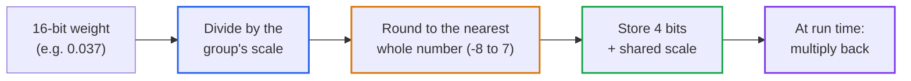
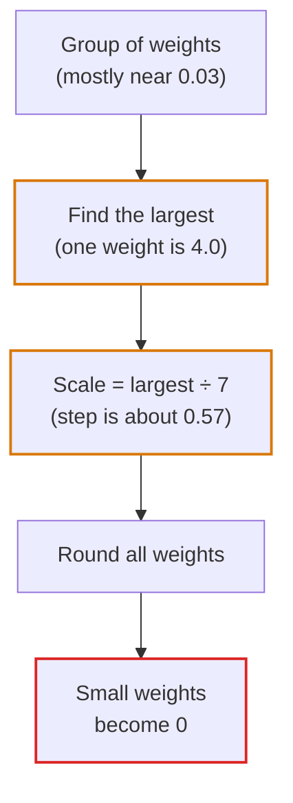
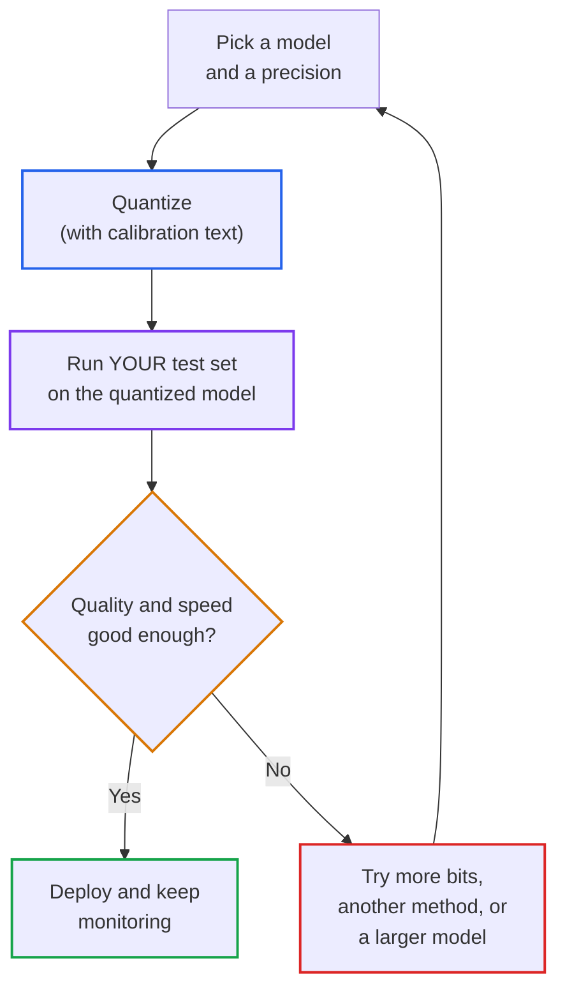

# Lesson 05: Small Language Models and Storing Weights in Fewer Bits (Quantization)

> **Tier**: `🟡 Engineering Depth` | **Read time**: ~16 min | **Prerequisites**: [Lesson 02: Transformer and Hardware Physics](./02-transformer-and-hardware-physics.md), [Lesson 03: KV Cache, VRAM and Bandwidth](./03-kv-cache-vram-and-bandwidth-physics.md)  
> **Core Concept**: A model's memory footprint is its parameter count times the bytes used to store each parameter. Quantization shrinks the bytes per parameter so a model fits on cheaper hardware, at the price of some quality loss that you must measure on your own task.  
> **New AI terms introduced**: small language model (SLM), quantization, precision format (FP32, FP16, BF16, FP8, INT8, INT4), activation, outlier weights, calibration, AWQ, GPTQ  
> **AI terms assumed from earlier lessons**: [large language model](./00-what-is-an-llm.md), [token](./00-what-is-an-llm.md), [inference](./00-what-is-an-llm.md), [context window](./00-what-is-an-llm.md), [parameter / weight](./02-transformer-and-hardware-physics.md), [GPU](./02-transformer-and-hardware-physics.md), [VRAM](./02-transformer-and-hardware-physics.md), [memory-bound](./02-transformer-and-hardware-physics.md), [KV cache](./03-kv-cache-vram-and-bandwidth-physics.md), [decode](./03-kv-cache-vram-and-bandwidth-physics.md)

---

## 🎯 What You Will Learn

- Compute how much memory a model's weights need at any precision, and decide whether it fits a given GPU.
- Explain in plain words why rounding weights to 4 bits can work, and why a single huge weight can ruin it.
- Describe what AWQ and GPTQ do differently, using what their authors wrote.
- Decide when a small language model is enough, and how to test a quantized model before you trust it.

---

## 1. The Problem

Your team wants a model inside your own network: the documents cannot leave, or the per-request bill is too high, or a hosted API is too slow. You load a model on your GPU and the process dies with an out-of-memory error before serving one request. The weights alone are larger than the GPU's memory. You have two levers:

| Lever | What you change | Cost |
|---|---|---|
| Pick a model with fewer parameters | The model itself (a *small language model*) | Less capability on hard tasks |
| Store each parameter in fewer bits | The storage format (*quantization*) | Some quality loss, which varies |

This lesson teaches both levers, the arithmetic behind them, and the one failure that makes naive shrinking break.

## 2. The Mental Model

🧒 **Think of a photo saved at different quality settings.** The original photo records every pixel with fine colour detail and takes a lot of disk space. Save it with a smaller colour palette and the file shrinks. Most viewers cannot tell the difference, until the photo has a smooth sky with one very bright sun. If your palette has to stretch to cover the sun, the whole sky collapses into a few flat bands.

A model's weights behave the same way. Store them with fewer bits and the file shrinks. Stretch the palette to cover one huge weight and all the small weights collapse.

**Where this analogy breaks**: a photo's damage is visible to your eye. Damage to a model's weights is invisible until you test the model, and it may hit some tasks (maths, rare languages, strict formats) harder than others. You cannot judge quality by looking.

## 3. How It Works, One Term at a Time

### Small language model (SLM) and memory arithmetic

* 🧒 **The Analogy**: A pocket dictionary versus a full encyclopedia. The pocket one fits in your bag and answers common questions fast. It will fail on rare topics.
* ⚙️ **The Engineering**: A **small language model (SLM)** is a language model with few enough parameters to run on one ordinary GPU, a laptop or a phone. There is no official size cut-off, so "small" is relative to today's hardware and to today's largest models. A **parameter** (or weight, from [Lesson 02](./02-transformer-and-hardware-physics.md)) is one learned number, and each one occupies some bytes. So the memory needed just to hold the model is:

```text
weight memory (bytes) = number of parameters × bytes per parameter

Example (derived): 7 billion parameters × 2 bytes = 14 billion bytes = 14 GB
```

  This is a floor, not the full bill. Running the model also needs memory for the KV cache ([Lesson 03](./03-kv-cache-vram-and-bandwidth-physics.md)) and for the serving software, so always leave headroom.
* ⚠️ **What happens if you skip this?** You pick a model by reputation, then find out at deploy time that it needs more memory than you own. Do the arithmetic first; it takes one line.

An SLM is often enough for narrow, checkable tasks: classifying tickets, extracting fields into a fixed format, routing requests, answering from documents you supply. It is often not enough for open-ended multi-step reasoning or broad world knowledge. Do not guess: run the same test set through a small and a large model and compare.

### Quantization and precision formats

* 🧒 **The Analogy**: Measuring a room. You can record "3.14159 metres" or round to "3 metres". The rounded number takes less room to write down and is usually good enough, but the error is bigger.
* ⚙️ **The Engineering**: **Quantization** means storing weights with fewer bits by rounding each one to the nearest value a smaller format can represent. The format you choose is the **precision format**. You know floating-point numbers as sign, exponent and mantissa; the formats below are the ones you will meet:

| Format | Bits | Bytes per parameter (derived: bits ÷ 8) | What it is |
|---|---|---|---|
| FP32 | 32 | 4 | IEEE single-precision float: 1 sign, 8 exponent, 23 fraction bits |
| FP16 | 16 | 2 | IEEE half-precision float: 1 sign, 5 exponent, 10 fraction bits |
| BF16 | 16 | 2 | "Brain float": 1 sign, 8 exponent, 7 stored fraction bits. Same range as FP32, less precision |
| FP8 | 8 | 1 | 8-bit float; there are several variants of the bit split |
| INT8 | 8 | 1 | Integer with 256 possible values, plus a scale factor |
| INT4 | 4 | 0.5 | Integer with 16 possible values, plus a scale factor |

  An integer format cannot store `0.037` directly. It stores a whole number such as `4` and a **scale** (a separate float); the real value is `4 × scale`. One scale is usually shared by a *group* of weights (for example 128 of them), because one scale for a whole layer is too coarse. That scale costs extra bits, so "4-bit" models are slightly larger than 4 bits per parameter, as the code below shows. The bit layouts for FP32, FP16 and BF16 come from the [bfloat16 format article](https://en.wikipedia.org/wiki/Bfloat16_floating-point_format).

  Quantizing an already-trained model without retraining it is called *post-training* quantization, and it is what most people do.
* ⚠️ **What happens if you skip this?** You assume shrinking is free. It is a trade: less memory and often faster generation, for some loss in quality. How much loss depends on the model, the method and your task.

Fewer bytes can also mean faster generation. Decoding is typically memory-bound ([Lesson 02](./02-transformer-and-hardware-physics.md)): each new token reads all the weights from GPU memory. The AWQ authors report a serving framework more than 3x faster than the Hugging Face FP16 implementation, and the GPTQ authors report 3.25x on A100 GPUs, both on their own setups. Measure your own speed-up.

#### Diagram 1: From 16 bits to 4 bits



1. **16-bit weight**: the original learned number.
2. **Divide by the scale**: the scale is usually set so the largest weight in the group lands at the edge of the integer range.
3. **Round**: this is where information is lost. The rounding error is at most half a step.
4. **Store**: only the 4-bit integer and one shared scale are kept.
5. **Multiply back**: at run time the approximate weight is rebuilt as integer × scale.

### Outlier weights: why naive rounding breaks

* 🧒 **The Analogy**: A ruler with 16 tick marks that must reach a giraffe. If the ruler has to stretch to measure the giraffe, the tick spacing is so wide that every mouse measures as zero.
* ⚙️ **The Engineering**: Most weights in a group are small, but a few can be far larger. Call those **outlier weights**. With one scale per group set by the largest value, the step between representable values is `largest ÷ 7` (for 4-bit signed integers). One big outlier makes the step huge and every small weight rounds to zero.

```text
step size = largest |weight| in the group ÷ 7
small weights ≈ 0.03, outlier = 4.0  →  step ≈ 0.57  →  0.03 ÷ 0.57 rounds to 0
```

  The LLM.int8() paper found that large transformers contain systematic outlier features that dominate predictions. It handles them by multiplying a tiny fraction of dimensions in 16 bits while running the rest in 8 bits. Its authors state that over 99.9% of values run in 8-bit.
* ⚠️ **What happens if you skip this?** You round everything with one global scale and the model emits repetitive or nonsensical text. The memory shrank by design; the quality collapsed by accident.

#### Diagram 2: One outlier ruins the scale



1. **Group of weights**: a handful of numbers that share one scale.
2. **Find the largest**: the outlier sets the range.
3. **Scale**: the range is divided into only 16 steps, so each step is wide.
4. **Round**: each weight snaps to the nearest step.
5. **Small weights become 0**: information carried by the many small weights is gone.

### AWQ and GPTQ: two ways to protect quality

Both methods are **post-training** quantizers that use **calibration**: you feed a small sample of example text through the model once, and the method uses what it observes to choose better rounding. To explain AWQ you first need one more term: an **activation** is an intermediate number that flows through the network while it processes an input, as opposed to a weight, which is fixed after training.

* 🧒 **The Analogy**: Packing a fragile shipment. Both methods decide *how* to round so the important items get the most care. AWQ puts extra padding around the items the courier handles most. GPTQ packs items one at a time and uses the leftover space to cushion the damage from each one.
* ⚙️ **The Engineering**:
  * **Activation-aware Weight Quantization (AWQ)** ([Lin et al.](https://arxiv.org/abs/2306.00978)): the authors show that about 1% of weight channels matter far more than the rest. You identify these channels from *activations*, not raw weights. Keeping them in 16-bit works, but mixing numerical formats complicates runtime kernels. Instead, AWQ scales important channels before rounding to reduce relative error. All weights remain in a single uniform format. The process needs only offline activation statistics without retraining.
  * **GPTQ**, from [Frantar et al.](https://arxiv.org/abs/2210.17323): a "one-shot weight quantization method based on approximate second-order information" (the paper's wording). In practice it works layer by layer, and as it rounds weights it adjusts the weights not yet rounded to compensate for the error already introduced. The authors report quantizing a 175-billion-parameter model in roughly four GPU hours, to 3 or 4 bits per weight.

  Both keep rounding error away from where it hurts most: AWQ by rescaling important channels, GPTQ by error compensation.
* ⚠️ **What happens if you skip this?** You apply plain round-to-nearest to a model with strong outliers, or pick a method by name without knowing what it protects. Paper numbers are not a guarantee for your model.

#### Diagram 3: The quantize-and-check loop



1. **Pick** a model and a target precision using the size arithmetic.
2. **Quantize**, using calibration text that resembles your real inputs.
3. **Run your test set**: public benchmarks do not tell you how your task behaves.
4. **Decide**: compare quality against the original and speed against your requirement.
5. **Deploy or retry**: if it fails, change bits, method or model, then test again.

## 4. Try It (Runnable, Offline)

Needs Python 3.12+ and Pydantic v2; no network, no GPU. The model here is a made-up 7-billion-parameter model on a made-up 24 GB GPU, so the numbers are arithmetic, not a benchmark.

**Block 1: a model-size calculator.**

```python
from pydantic import BaseModel, Field

BYTES_PER_GB = 1_000_000_000  # decimal gigabytes, as GPU vendors quote them


class Precision(BaseModel):
    name: str
    bits: float = Field(gt=0)

    @property
    def bytes_per_param(self) -> float:
        return self.bits / 8


def weights_gb(params_billions: float, p: Precision) -> float:
    """Weight memory only: parameters × bytes per parameter."""
    if params_billions <= 0:
        raise ValueError("parameter count must be positive")
    return params_billions * 1e9 * p.bytes_per_param / BYTES_PER_GB


# 4-bit formats usually store one 16-bit scale per group of weights.
GROUP_SIZE = 128  # (illustrative)
INT4_EFFECTIVE_BITS = 4 + 16 / GROUP_SIZE

FORMATS = [
    Precision(name="FP32", bits=32),
    Precision(name="FP16 / BF16", bits=16),
    Precision(name="FP8 / INT8", bits=8),
    Precision(name="INT4 (raw)", bits=4),
    Precision(name=f"INT4 + scale per {GROUP_SIZE}", bits=INT4_EFFECTIVE_BITS),
]

PARAMS_B = 7.0    # a made-up 7-billion-parameter model (illustrative)
VRAM_GB = 24.0    # a made-up 24 GB GPU (illustrative)
HEADROOM_GB = 4.0  # reserve for KV cache and runtime (illustrative)

print(f"{PARAMS_B}B parameters, {VRAM_GB} GB GPU, {HEADROOM_GB} GB reserved for other memory")
print(f"{'format':<22}{'bytes/param':>12}{'weights GB':>12}  fits?")
for p in FORMATS:
    gb = weights_gb(PARAMS_B, p)
    print(f"{p.name:<22}{p.bytes_per_param:>12.3f}{gb:>12.2f}  {'yes' if gb + HEADROOM_GB <= VRAM_GB else 'no'}")

big = 70.0
print(f"\n{big}B at FP16: {weights_gb(big, FORMATS[1]):.1f} GB; at raw INT4: {weights_gb(big, FORMATS[3]):.1f} GB")
try:
    weights_gb(0, FORMATS[0])
except ValueError as e:
    print("rejected:", e)
```

Expected output (verified by running the block with Python 3.14.7 and Pydantic 2.13.5):

```text
7.0B parameters, 24.0 GB GPU, 4.0 GB reserved for other memory
format                 bytes/param  weights GB  fits?
FP32                         4.000       28.00  no
FP16 / BF16                  2.000       14.00  yes
FP8 / INT8                   1.000        7.00  yes
INT4 (raw)                   0.500        3.50  yes
INT4 + scale per 128         0.516        3.61  yes

70.0B at FP16: 140.0 GB; at raw INT4: 35.0 GB
rejected: parameter count must be positive
```

What to notice:
- **Linear scaling**: halving the bits halves the weight memory. 7 × 4 = 28 GB at FP32, 7 × 2 = 14 GB at FP16, and so on.
- **Scales cost a little**: 4 + 16 ÷ 128 = 4.125 bits, so "4-bit" is about 3% larger than raw 4-bit here.
- **Fitting is not quality**: this table says the model loads. It says nothing about whether the answers are still good.

**Block 2: why an outlier hurts round-to-nearest.** This rounds 32 small random weights to 4 bits, with and without one weight of 4.0.

```python
import random
import statistics

from pydantic import BaseModel


class QuantResult(BaseModel):
    mean_abs_error: float
    zeroed: int  # weights that were non-zero before but became exactly 0


def quantize_rtn(weights: list[float], bits: int = 4) -> list[float]:
    """Round-to-nearest with one scale for the whole list (symmetric)."""
    top = 2 ** (bits - 1) - 1                      # 7 for 4 bits
    scale = max(abs(w) for w in weights) / top
    if scale == 0:
        return list(weights)
    return [max(-top - 1, min(top, round(w / scale))) * scale for w in weights]


def grouped(weights: list[float], group: int, bits: int = 4) -> list[float]:
    """Same idea, but each group of `group` weights gets its own scale."""
    out: list[float] = []
    for i in range(0, len(weights), group):
        out += quantize_rtn(weights[i:i + group], bits)
    return out


def score(orig: list[float], restored: list[float]) -> QuantResult:
    err = statistics.fmean(abs(a - b) for a, b in zip(orig, restored))
    zeroed = sum(1 for a, b in zip(orig, restored) if a != 0 and b == 0)
    return QuantResult(mean_abs_error=round(err, 5), zeroed=zeroed)


rng = random.Random(0)
normal = [rng.gauss(0, 0.03) for _ in range(32)]  # small weights (illustrative)
with_outlier = normal[:-1] + [4.0]                 # one big weight (illustrative)

print("no outlier, one scale  :", score(normal, quantize_rtn(normal)))
print("outlier,    one scale  :", score(with_outlier, quantize_rtn(with_outlier)))
print("outlier,    groups of 8:", score(with_outlier, grouped(with_outlier, 8)))
print("step size without outlier:", round(max(map(abs, normal)) / 7, 4))
print("step size with outlier   :", round(4.0 / 7, 4))
```

Expected output (verified by running the block with Python 3.14.7 and Pydantic 2.13.5):

```text
no outlier, one scale  : mean_abs_error=0.00262 zeroed=2
outlier,    one scale  : mean_abs_error=0.02864 zeroed=31
outlier,    groups of 8: mean_abs_error=0.00893 zeroed=8
step size without outlier: 0.0103
step size with outlier   : 0.5714
```

What to notice:
- **One weight changed the outcome**: error rose about 11x and 31 of 32 weights collapsed to zero, because the step size grew from about 0.01 to about 0.57.
- **Smaller groups contain the damage**: with a separate scale per group of 8, only the outlier's own group suffers. This is why real formats use groups, at the price of storing more scales (Block 1).
- **This is a toy**: real layers are far larger, and AWQ and GPTQ do more than grouping. What carries over is the pattern: one large value wrecks a shared scale.

## 5. Trade-Offs

| Choice | Benefit | Cost |
|---|---|---|
| Fewer bits (8 → 4) | Half the weight memory per step down (derived); often faster decode | Quality loss that grows as bits drop; varies by model and task |
| Smaller groups | Outliers damage fewer weights | More scales to store; extra memory and lookup work |
| Calibration-based method (AWQ, GPTQ) | Better quality than plain rounding at the same bits, per the papers | Needs calibration text; quality depends on that text matching your use |
| Smaller model instead of quantizing | Faster and cheaper at any precision | Less capability on hard tasks |
| Quantizing a bigger model | Keeps more capability than a small model at the same memory | Possible subtle quality loss; hardware or software may not support the format |

There is no universal accuracy-loss number for "4-bit" or "8-bit". The LLM.int8() and GPTQ authors report little or no loss on their tested models, but those are specific results. Treat them as reasons to try, not promises.

## 6. Failure Modes

| Symptom | Cause | Fix |
|---|---|---|
| Out-of-memory at load | Weights alone exceed GPU memory | Do the size arithmetic first; lower precision or choose a smaller model |
| Loads fine, then runs out of memory under load | No headroom for the KV cache and runtime | Reserve headroom; size the KV cache ([Lesson 03](./03-kv-cache-vram-and-bandwidth-physics.md)) |
| Repetitive or nonsense output after quantizing | Outliers ruined a shared scale, or the method does not suit this model | Use a calibration-based method, smaller groups or more bits; re-test |
| Public benchmark looks fine, your task got worse | Loss concentrates in particular skills (maths, rare languages, strict formats) | Evaluate on your own test set before and after |
| Quantized model is not faster | Serving software or hardware lacks fast kernels for that format | Check your serving tool's supported-format table and benchmark on the target hardware |
| Quality drops only on certain users' text | Calibration text did not resemble real inputs | Calibrate on text that looks like production traffic |

## 🧠 7. Quick Check to See if it Clicked

> A team wants to serve a 12-billion-parameter model on a 24 GB GPU, reserving 4 GB for the KV cache and runtime. Which of FP16, 8-bit and 4-bit fit, using weights-only arithmetic? And does "it fits" mean they are done?

<details>
<summary><b>View answer</b></summary>

Available for weights: 24 − 4 = 20 GB.

```text
FP16:  12 billion × 2   bytes = 24 GB  → does not fit (24 > 20)
8-bit: 12 billion × 1   byte  = 12 GB  → fits
4-bit: 12 billion × 0.5 bytes =  6 GB  → fits (slightly more with scales)
```

Fitting is only the first test. They still have to run their own test set on the quantized model to confirm quality, and benchmark speed on the target hardware. If 8-bit passes their tests, it probably keeps more quality; 4-bit leaves more memory for the KV cache and so more concurrent requests. The right choice depends on the measurements.
</details>

## 8. Key Takeaways

- Weight memory = parameters × bytes per parameter. Do this arithmetic before choosing a model, and leave headroom for the KV cache.
- Quantization stores weights in fewer bits by rounding. Outlier weights are the main way naive rounding fails; AWQ and GPTQ are two calibrated methods that protect against it.
- An SLM is enough when the task is narrow and you can test it. Quality loss from smaller models or fewer bits must be measured on your own task.
- Model names and sizes change monthly. Learn the method, then use the table below for today's examples.

### Example small models (As of 2026-09)

Model details below were read from the linked official pages on 2026-09-30. They are examples of the concept, not recommendations.

| Model | Sizes stated on the page | Context stated | Licence stated | Source |
|---|---|---|---|---|
| Phi-4-mini-instruct | 3.8 billion parameters | 128,000 tokens | MIT | [Hugging Face model card](https://huggingface.co/microsoft/Phi-4-mini-instruct) |
| Qwen3-4B | 4.0 billion (3.6 billion excluding embeddings) | 32,768 tokens natively, 131,072 with YaRN scaling | Apache 2.0 | [Hugging Face model card](https://huggingface.co/Qwen/Qwen3-4B) |
| Gemma 4 (E2B, E4B, 12B, 26B A4B, 31B) | Five variants; "E" sizes are effective parameters | 128K for E2B and E4B; 256K for the others | "Open weights", responsible commercial use permitted | [Gemma docs](https://ai.google.dev/gemma/docs/core) |

The Gemma page lists inference memory of 69.9 GB (31B, 16-bit) versus 17.5 GB (4-bit). Both exceed weights-only arithmetic (31 billion × 2 bytes = 62 GB), so treat your calculation as a floor and use the vendor figure for planning.

Quantization tooling evolves rapidly. Verify current support directly in the official documentation. Consult the [Hugging Face Transformers quantization overview](https://huggingface.co/docs/transformers/en/quantization/overview) and the [vLLM quantization docs](https://docs.vllm.ai/en/stable/features/quantization/) for hardware support tables.

### Verified sources

- [AWQ: Activation-aware Weight Quantization (Lin et al.)](https://arxiv.org/abs/2306.00978), abstract and method description read 2026-09-30.
- [GPTQ: Accurate Post-Training Quantization (Frantar et al.)](https://arxiv.org/abs/2210.17323), abstract read 2026-09-30.
- [LLM.int8() (Dettmers et al.)](https://arxiv.org/abs/2208.07339), abstract read 2026-09-30.
- [Bfloat16 floating-point format](https://en.wikipedia.org/wiki/Bfloat16_floating-point_format), bit layouts read 2026-09-30.

---

## 🧭 Navigation
- **[← Previous Lesson: Test-Time Compute and Reasoning Models](./04-test-time-compute-and-reasoning-models.md)**
- **[Phase 00 Hub](./README.md)**
- **[Next: Capstone Lab →](./labs/capstone-token-economics-analyzer.md)**
- **[Capstone Lab: Token Economics Analyzer](./labs/capstone-token-economics-analyzer.md)**
