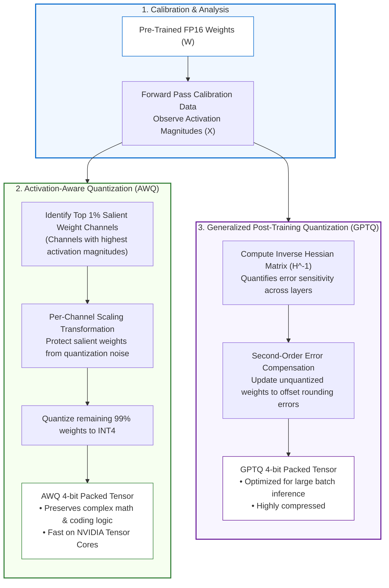

# Lesson 05: Small Language Models & Model Quantization

`🟡 Engineering Depth` · *Phase 00: Foundations & Token Mechanics* · *Estimated Reading Time: 15 minutes*

---

## What You Will Learn

By the end of this lesson, you will understand:
- Why Small Language Models (SLMs) running locally are replacing centralized cloud APIs for specialized enterprise workloads.
- The physics of numerical precision formats: FP32, FP16, BF16, FP8 (E4M3/E5M2), and INT4.
- How modern Post-Training Quantization (PTQ) algorithms like AWQ and GPTQ compress models by 75% with near-zero perplexity loss.
- The hardware memory footprint and throughput characteristics of frontier SLMs (Phi-4, Gemma 2, Qwen 2.5 Coder, DeepSeek-R1 Distillations).
- How to calculate exact VRAM savings and evaluate precision trade-offs before edge deployment.

---

## 1. The Problem: The Cloud API Monopoly

For the first era of Generative AI, enterprise architects relied almost exclusively on centralized cloud APIs (OpenAI, Anthropic, Google). However, as AI applications moved from prototypes to mission-critical infrastructure, three structural barriers emerged:

1. **The Compliance Wall**: Highly regulated industries (defense, investment banking, healthcare) cannot send unredacted client contracts or patient health records to third-party multi-tenant cloud endpoints.
2. **Network Egress Latency**: Calling a cloud API from an edge device (such as an on-prem manufacturing controller, a mobile phone, or a hospital terminal) adds 150ms to 500ms of internet latency before inference even begins.
3. **The High-Volume Cost Cliff**: Running 10 million requests per month through a frontier cloud API can cost hundreds of thousands of dollars, whereas a self-hosted Small Language Model (SLM) on dedicated hardware costs a flat server rental.

```text
The Centralized Cloud Paradigm:
[Edge Device] --(Public Internet: 250ms)--> [Cloud Gateway] --> [Frontier 400B Model]
Cost: $3 to $15 per 1M tokens. Data leaves security perimeter.

The Modern Edge SLM Paradigm:
[Edge Device / Local Server] --(Zero Network Egress: 0ms)--> [Local Quantized SLM (14B)]
Cost: Flat electricity/hardware. Zero data exfiltration risk. Sub-10ms TTFT.
```

To achieve this autonomy, models must fit within the VRAM constraints of affordable enterprise hardware. This is made possible through **Quantization**.

---

## 2. Why Naive Approaches Fail: The Truncation Trap

Why can't we simply convert 16-bit floating point numbers to 4-bit integers using standard rounding?

### Naive Uniform Rounding
In 16-bit precision (FP16), a weight can take any of 65,536 distinct values across a wide dynamic range (e.g. from `-65,504` to `+65,504`). In 4-bit integer precision (INT4), you have only **16 distinct numbers** (from `-8` to `+7`).

If you uniformly map FP16 numbers into 16 bins:
- 99% of neural network weights are clustered tightly around zero (between `-0.05` and `+0.05`).
- A tiny fraction (less than 0.1%) are **salient outlier weights** with magnitudes of `+4.0` or `-5.0`.
- If your scale covers the outliers, all the 99% normal weights get squashed into the exact same zero bin!
- The model suffers **catastrophic representation collapse**, emitting repetitive gibberish or crashing with NaN outputs.

### The Engineering Solution: Outlier-Preserving Quantization
Modern quantization algorithms do not treat all parameters equally. They protect critical channels and apply non-linear mathematical mappings to preserve accuracy.

---

## 3. Systems Mental Model: The Master Painting & The Custom Palette

---

### High-Res Oil Painting vs. Smart Color Palette

* 🧒 **The Analogy**:
  * Imagine a master oil painting created with 16 million distinct paint shades (FP16/FP32). It captures every microscopic brush stroke, but the canvas is colossal and heavy (takes 140 GB to store).
  * **The Dumb Way (Uniform Rounding)**: You restrict an artist to just 16 paint cans (INT4). 99% of the canvas is subtle blue sky, but there is one bright red lightning bolt. If the 16 cans are spaced evenly between dark blue and bright red, all the subtle blue sky shades get dumped into one single flat blue bucket. The sky turns into a hideous pixelated blob!
  * **The Smart Way (Activation-Aware Quantization)**: The artist studies where human eyes look (activations). They notice the lightning bolt is critical, so they protect that channel with full detail. For the sky, they choose 16 custom shades of blue that perfectly match the painting. The file shrinks by **75%**, yet human eyes cannot tell the difference from the original!

* ⚙️ **The Engineering Mechanics**:
  * Modern Post-Training Quantization (PTQ) techniques (AWQ, GPTQ) analyze the mathematical sensitivity of weights during a small calibration pass:
    1. **AWQ (Activation-aware Weight Quantization)**: Measures which weights experience the highest activation magnitudes and scales those channels up algebraically before 4-bit rounding, protecting them from quantization error.
    2. **GPTQ (Generalized Post-Training Quantization)**: Computes the second-order Taylor expansion (inverse Hessian matrix) of the layer loss. As each weight is rounded to INT4, GPTQ dynamically adjusts the remaining unquantized weights to cancel out the rounding error.

* ⚠️ **What Happens If You Ignore This?**
  * You attempt naive integer quantization or use legacy uniform quantization tools on a 14B model.
  * The model's perplexity explodes; it begins hallucinating syntax errors in code or repeating words indefinitely, rendering the model useless.

---

## 4. Precision Formats: The Silicon Bits

Understanding floating-point representations is essential for evaluating GPU memory sizing:

```text
FP32 (Single Precision, 4 Bytes):
[1 Sign Bit] [8 Exponent Bits] [23 Mantissa Bits]
Dynamic Range: ~10^-38 to 10^38 | Used for pre-training and master weights

BF16 (Bfloat16, 2 Bytes):
[1 Sign Bit] [8 Exponent Bits] [7 Mantissa Bits]
Preserves FP32 dynamic range at half the size | Standard for modern training and serving

FP16 (Half Precision, 2 Bytes):
[1 Sign Bit] [5 Exponent Bits] [10 Mantissa Bits]
Higher precision than BF16, but prone to underflow/overflow during training

FP8 E4M3 (1 Byte):
[1 Sign Bit] [4 Exponent Bits] [3 Mantissa Bits]
Higher precision; standard for forward-pass inference on NVIDIA Ada Lovelace / Hopper

FP8 E5M2 (1 Byte):
[1 Sign Bit] [5 Exponent Bits] [2 Mantissa Bits]
Wider dynamic range; used for gradient accumulation in training

INT4 (Nibble, 0.5 Bytes):
[1 Sign Bit] [3 Value Bits] → 16 discrete integer levels (-8 to +7)
Standard for edge deployment and local SLMs
```

| Precision Format | Bits per Parameter | Bytes per Parameter | VRAM for 70B Model | Perplexity Loss vs FP16 | Supported Hardware |
|---|---|---|---|---|---|
| **FP16 / BF16** | 16 bits | 2.0 bytes | 140 GB | 0.0% (Baseline) | All modern GPUs |
| **FP8 (E4M3)** | 8 bits | 1.0 bytes | 70 GB | < 0.05% | NVIDIA H100, L40S, RTX 4090 |
| **INT8 (GPTQ / AWQ)**| 8 bits | 1.0 bytes | 70 GB | < 0.1% | Turing (T4), Ampere (A100), Ada |
| **INT4 (AWQ)** | 4 bits | 0.5 bytes | 35 GB | ~0.2% – 0.5% | Ampere (A100), Ada (4090), Mac M-Series |
| **INT4 (GGUF)** | 4 bits | 0.5 bytes | 35 GB | ~0.5% – 1.0% | CPU, Apple Silicon, Consumer GPUs |

---

## 5. Modern Quantization Algorithms: AWQ vs. GPTQ

How do we compress a model from 16 bits to 4 bits without destroying its accuracy? The industry relies on two primary Post-Training Quantization (PTQ) techniques:



### Walkthrough of AWQ vs. GPTQ:
1. **Activation-aware Weight Quantization (AWQ)** (Lin et al., 2023):
   - **Core Discovery**: Not all weights in a neural network are equally important. Looking only at weight values is misleading; what matters is the **activation magnitude** passing through that weight.
   - AWQ runs a small calibration set of text through the model to observe activation patterns.
   - It identifies the top 1% of channels with the highest activation impact.
   - Instead of keeping those weights in FP16 (which would cause memory layout fragmentation), AWQ applies an algebraic scale transformation that protects those salient channels while quantizing the entire matrix to INT4.
   - **Result**: Superior reasoning and mathematical accuracy preservation compared to uniform quantization.
2. **Generalized Post-Training Quantization (GPTQ)** (Frantar et al., 2022):
   - Operates on a layer-by-layer second-order Taylor expansion of the loss function.
   - Computes the inverse Hessian matrix (`H^-1`) of the weights.
   - When a specific weight is rounded to an INT4 value, GPTQ calculates the exact mathematical error introduced, and **adjusts the remaining unquantized weights** in that layer to compensate for the rounding error.
   - **Result**: Extremely fast quantization (quantizes a 70B model in under 4 hours on a single GPU) with minimal degradation.

---

### 📊 Uniform Quantization (2022) vs. Outlier-Aware Quantization & Frontier SLMs (2026)

| Architectural Dimension | Uniform Quantization (2022) | Outlier-Aware Quantization & Frontier SLMs (2026) |
| :--- | :--- | :--- |
| **Outlier Handling** | Truncates or clamps outliers (causes perplexity collapse) | **Channel-specific scaling transformations (AWQ)** |
| **Model Capability** | 7B models struggled with basic reasoning | **14B SLMs (Phi-4, Qwen 2.5 Coder, R1 Distill) beat older 70B models** |
| **Hardware Deployment** | Multi-GPU enterprise servers required for inference | **Single consumer GPU (RTX 4090) or Apple Silicon edge** |
| **Quantization Speed** | Days of computationally expensive retraining | **Sub-hour post-training calibration (PTQ)** |
| **Latency Benefit** | Compute-bound on legacy architectures | **2.5x to 3.5x decode speedup via memory-bus bandwidth reduction** |

---

## 6. The Frontier SLM Landscape & Hardware Matrix

Small Language Models (models between 1.5B and 14B parameters) have achieved reasoning performance that rivals previous-generation 70B models, making high-speed local inference accessible on standard commodity hardware:

```text
Key SLM Architectural Champions:
├── Microsoft Phi-4 (14B): Synthetic reasoning pre-training; beats original GPT-4 on math
├── Google Gemma 2 (9B / 27B): Logit-distilled transformer; 80+ tok/s on consumer RTX 4090
├── Alibaba Qwen 2.5 Coder (32B): SWE-Bench parity with Claude 3.5 Sonnet; runs on single 24GB GPU
└── DeepSeek-R1-Distill-Qwen-14B: Pure reasoning traces distilled into 14B; 73.7% AIME math
```

### SLM Hardware Footprint & Deployment Matrix:

| Model | Parameters | Quantization | Minimum VRAM | Generation Speed | Benchmark Superpower | Ideal Enterprise Production Role |
|---|---|---|---|---|---|---|
| **DeepSeek-R1-Distill-Qwen-1.5B** | 1.8B | INT4 (GGUF) | 1.8 GB | ~140 tok/s | Basic Logic / Classification | Mobile devices, IoT gateways, low-latency intent routing |
| **DeepSeek-R1-Distill-Llama-8B** | 8.0B | INT4 (AWQ) | 6.2 GB | ~85 tok/s | Math (AIME 50%) / Python | Developer laptop assistant, private internal document parsing |
| **Microsoft Phi-4** | 14.7B | FP8 / INT4 | 9.8 GB | ~70 tok/s | Frontier Math (MATH > 80%) | Healthcare compliance audits, financial statement analysis |
| **DeepSeek-R1-Distill-Qwen-14B** | 14.7B | INT4 (AWQ) | 10.5 GB | ~65 tok/s | Elite Math (AIME 73.7%) | On-prem air-gapped reasoning, automated contract verification |
| **Gemma 2 27B** | 27.2B | INT4 (AWQ) | 17.0 GB | ~48 tok/s | Broad Knowledge & Multilingual | Air-gapped enterprise search synthesis, internal HR copilot |
| **Qwen 2.5 Coder 32B** | 32.5B | INT4 (AWQ) | 20.5 GB | ~42 tok/s | Frontier Code (SWE-Bench 40%+) | Dedicated departmental coding copilot on a single RTX 4090 |

---

## 7. Concrete Implementation: Precision Simulator & VRAM Estimator

The following Python 3.12 script calculates exact memory footprints across precisions, models the AWQ memory packing format, and asserts whether a model will fit within target hardware envelopes.

```python
"""
Precision Quantization Simulator & Hardware Sizing Engine.
Calculates memory footprints for FP32, FP16, FP8, and INT4 across SLM architectures.
"""

from typing import Any
from pydantic import BaseModel, Field


class PrecisionFormat(BaseModel):
    """Specification of a numerical representation format."""
    name: str
    bits_per_param: float
    bytes_per_param: float
    typical_perplexity_penalty: float = Field(
        ..., description="Average perplexity degradation relative to FP16 baseline"
    )


class QuantizationAnalyzer:
    """Calculates model compression and hardware feasibility."""

    FORMATS: dict[str, PrecisionFormat] = {
        "FP32": PrecisionFormat(name="FP32 (Single)", bits_per_param=32, bytes_per_param=4.0, typical_perplexity_penalty=0.0),
        "FP16": PrecisionFormat(name="FP16 (Half)", bits_per_param=16, bytes_per_param=2.0, typical_perplexity_penalty=0.0),
        "BF16": PrecisionFormat(name="BF16 (Bfloat16)", bits_per_param=16, bytes_per_param=2.0, typical_perplexity_penalty=0.0),
        "FP8":  PrecisionFormat(name="FP8 (E4M3)", bits_per_param=8, bytes_per_param=1.0, typical_perplexity_penalty=0.03),
        "INT8": PrecisionFormat(name="INT8 (AWQ/GPTQ)", bits_per_param=8, bytes_per_param=1.0, typical_perplexity_penalty=0.08),
        "INT4": PrecisionFormat(name="INT4 (AWQ/GGUF)", bits_per_param=4, bytes_per_param=0.5, typical_perplexity_penalty=0.35),
    }

    @classmethod
    def evaluate_model(
        cls,
        model_name: str,
        parameter_count_billions: float,
        target_gpu_vram_gb: float,
        context_window_tokens: int = 4096,
    ) -> list[dict[str, Any]]:
        results = []
        total_params = parameter_count_billions * 1e9

        # CUDA runtime and KV-cache estimate buffer (approx 20% + 2GB)
        runtime_buffer_gb = 2.0

        for format_key, fmt in cls.FORMATS.items():
            weight_bytes = total_params * fmt.bytes_per_param
            weight_gb = weight_bytes / (1024**3)
            total_required_gb = weight_gb + runtime_buffer_gb
            fits_in_gpu = total_required_gb <= target_gpu_vram_gb
            compression_ratio = 4.0 / fmt.bytes_per_param  # Relative to FP32

            results.append({
                "format": fmt.name,
                "bits": fmt.bits_per_param,
                "weight_vram_gb": round(weight_gb, 2),
                "total_estimated_vram_gb": round(total_required_gb, 2),
                "fits_in_target_gpu": fits_in_gpu,
                "compression_ratio": f"{compression_ratio:.1f}x",
                "perplexity_penalty": fmt.typical_perplexity_penalty,
            })

        return results


# --- Simulation Demonstration ---
if __name__ == "__main__":
    model = "Microsoft Phi-4 / DeepSeek-R1-Distill-14B"
    params = 14.7  # 14.7 Billion parameters
    target_hardware = "NVIDIA RTX 4090 / L4 (24 GB VRAM)"
    gpu_vram = 24.0

    print(f"=== QUANTIZATION SIZING REPORT: {model} ===")
    print(f"Target Hardware: {target_hardware} | Available VRAM: {gpu_vram} GB\n")

    evaluations = QuantizationAnalyzer.evaluate_model(
        model_name=model,
        parameter_count_billions=params,
        target_gpu_vram_gb=gpu_vram,
    )

    header = f"{'Format':<18} | {'Bits':<4} | {'Weights':<10} | {'Total VRAM':<10} | {'Fits?':<6} | {'Compression':<11}"
    print(header)
    print("-" * len(header))
    for row in evaluations:
        fits_str = "YES" if row["fits_in_target_gpu"] else "NO"
        print(
            f"{row['format']:<18} | {row['bits']:<4.0f} | {row['weight_vram_gb']:>6.2f} GB | "
            f"{row['total_estimated_vram_gb']:>6.2f} GB | {fits_str:<6} | {row['compression_ratio']:<11}"
        )
```

### Script Output Analysis:
```text
=== QUANTIZATION SIZING REPORT: Microsoft Phi-4 / DeepSeek-R1-Distill-14B ===
Target Hardware: NVIDIA RTX 4090 / L4 (24 GB VRAM) | Available VRAM: 24.0 GB

Format             | Bits | Weights    | Total VRAM | Fits?  | Compression
-------------------------------------------------------------------------
FP32 (Single)      | 32   |  54.76 GB  |  56.76 GB  | NO     | 1.0x       
FP16 (Half)        | 16   |  27.38 GB  |  29.38 GB  | NO     | 2.0x       
BF16 (Bfloat16)    | 16   |  27.38 GB  |  29.38 GB  | NO     | 2.0x       
FP8 (E4M3)         | 8    |  13.69 GB  |  15.69 GB  | YES    | 4.0x       
INT8 (AWQ/GPTQ)    | 8    |  13.69 GB  |  15.69 GB  | YES    | 4.0x       
INT4 (AWQ/GGUF)    | 4    |   6.85 GB  |   8.85 GB  | YES    | 8.0x       
```

Notice the critical hardware threshold:
- In unquantized FP16, a 14.7B model requires **29.38 GB of VRAM**, completely failing to run on a consumer 24 GB GPU or cloud NVIDIA L4.
- In **INT4 (AWQ)**, total memory drops to **8.85 GB**, comfortably running on an inexpensive 16 GB GPU or laptop with over 15 GB of VRAM left over for massive concurrent KV-cache allocations!

---

## 8. Trade-offs & Architecture Decision Matrix

| Dimension | FP16 / BF16 (Unquantized) | FP8 (Native Hardware) | INT4 (AWQ) | INT4 (GGUF / llama.cpp) |
|---|---|---|---|---|
| **Memory Compression** | 1.0x (Baseline) | 2.0x | **4.0x** | **4.0x** |
| **Decode Throughput Speedup** | Baseline | 1.5x – 2.0x | **2.5x – 3.5x** | 1.5x – 2.5x |
| **Hardware Compatibility** | Universal (all GPUs) | Requires Ada Lovelace / Hopper | Requires NVIDIA Ampere+ | Runs on CPU, Apple Silicon, any GPU |
| **Serving Framework** | PyTorch, HuggingFace | vLLM, TensorRT-LLM | vLLM, SGLang, TGI | Ollama, llama.cpp, LM Studio |
| **Perplexity Degradation** | 0.0% (Zero loss) | Virtually zero (< 0.05%) | Minimal (< 0.3%) | Slight (~0.5% – 1.0%) |

---

## 9. Common Failure Modes & Anti-Patterns

### Anti-Pattern 1: Quantizing Embedding & Output Head Matrices
- **The Mistake**: Applying aggressive INT4 quantization uniformly across all model tensors, including the vocabulary embedding layer and final `lm_head`.
- **Why It Fails**: The input embedding and output classification layers contain direct semantic mappings over 128,000 distinct token IDs. Quantizing them to 4 bits introduces high reconstruction error that degrades token sampling.
- **Production Remedy**: Always retain the embedding matrix and lm_head projection in 16-bit precision (FP16/BF16), quantizing only the internal transformer attention and MLP projection weights.

### Anti-Pattern 2: Serving INT4 on GPUs Without Tensor Core Support
- **The Mistake**: Deploying an INT4 AWQ model on older GPU architectures (such as NVIDIA Pascal or early Volta) expecting a 4x inference speedup.
- **Why It Fails**: Older GPUs lack dedicated hardware instructions for packing and unpacking 4-bit integers directly in registers. The GPU is forced to dequantize INT4 weights back to FP16 in software on every clock cycle, causing inference to run *slower* than native FP16!
- **Production Remedy**: Deploy INT4 AWQ models only on NVIDIA GPUs with hardware-accelerated integer tensor cores (Ampere A100/RTX 3090, Ada Lovelace RTX 4090/L4, Hopper H100).

---

## 10. Quick Check to See if it Clicked

> **Scenario**: A hospital IT department wants to deploy a medical summarization model on an air-gapped on-prem workstation equipped with a single 24 GB NVIDIA RTX 4090 GPU.
>
> They want to run the 14.7-billion parameter Microsoft Phi-4 model.
>
> At first, the engineer attempts to load the native FP16 model:
> - Model Weights: 14.7B × 2 bytes = 29.4 GB.
> - Result: The server throws `CUDA Out of Memory` before accepting any requests.
>
> **Question**: If the engineer converts the model to INT4 AWQ (0.5 bytes per parameter), how much memory will the weights consume, and how much VRAM is left for the dynamic KV-cache?
>
> **Answer**: 
> 1. In INT4 AWQ: 14.7 billion parameters × 0.5 bytes = **7.35 GB of VRAM** for weights.
> 2. Total VRAM capacity: 24.0 GB.
> 3. Subtracting weights (7.35 GB) and CUDA runtime overhead (~2.0 GB):
>    - `24.0 - 7.35 - 2.0 = 14.65 GB of free VRAM`.
> 4. **Outcome**: The workstation now has **14.65 GB of memory dedicated entirely to the dynamic KV-cache**, comfortably serving dozens of concurrent patient records without hitting the cloud!

---

## 11. Key Takeaways

1. **SLMs Enable Local Autonomy**: Quantized 8B to 14B models (Phi-4, Qwen 2.5, DeepSeek-R1 Distill) match previous 70B benchmarks while running air-gapped on commodity hardware.
2. **Quantization Is Memory-Driven**: Because autoregressive decode is memory-bandwidth bound, cutting precision from 16 bits to 4 bits speeds up token generation by up to 3x while slashing VRAM requirements by 75%.
3. **Protect Salient Outliers**: Naive rounding destroys neural accuracy. Algorithms like AWQ analyze activations to protect the critical 1% salient weights from quantization noise.
4. **Hardware Architecture Dictates Format**: Use FP8 on Hopper/Ada Lovelace, INT4 AWQ on Ampere/Ada, and GGUF for local CPU or Apple Silicon deployments.

---

## 12. Verified Resources

- **[Lin et al. (2023) — AWQ: Activation-aware Weight Quantization for LLM Compression and Acceleration](https://arxiv.org/abs/2306.00978)**: Seminal research paper detailing activation-aware channel protection.
- **[Frantar et al. (2022) — GPTQ: Accurate Post-Training Quantization for Generative Pre-trained Transformers](https://arxiv.org/abs/2210.17323)**: Mathematical derivation of inverse-Hessian error compensation.
- **[Dettmers et al. (2022) — LLM.int8(): 8-bit Matrix Multiplication for Transformers at Scale](https://arxiv.org/abs/2208.07339)**: Discovery of emergent outlier features in large language models.
- **[vLLM Quantization Documentation](https://docs.vllm.ai/en/latest/quantization/supported_hardware.html)**: Official deployment guides for AWQ, GPTQ, and FP8 serving.
- **Previous Lesson**: [Lesson 04: Test-Time Compute & Reasoning Tokens](./04-test-time-compute-and-reasoning-models.md)
- **Phase Capstone Challenge**: [Capstone: Token Economics & VRAM Profiler](./labs/capstone-token-economics-analyzer.md)
