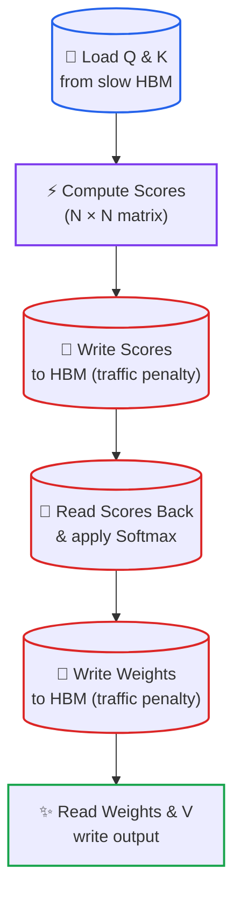
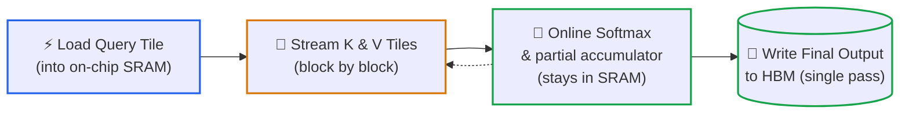

# Lesson 06: Deep Dive: The Roofline Model and Memory-Aware Attention (FlashAttention)

> **Tier**: `⚫ Deep Dive` | **Read time**: ~20 min | **Prerequisites**: [Lesson 02: Transformers and Hardware Limits](./02-transformer-and-hardware-physics.md)  
> **Core Concept**: The roofline model is a single chart that says whether a job is limited by math or by memory. FlashAttention uses that idea to compute exactly the same attention result while writing far less data to slow memory, by working on small tiles in fast on-chip memory.  
> **New AI terms introduced**: SRAM, roofline model, tiling, FlashAttention, online softmax, kernel  
> **AI terms assumed from earlier lessons**: [LLM](./00-what-is-an-llm.md), [token](./00-what-is-an-llm.md), [prompt](./00-what-is-an-llm.md), [softmax](./01-tokenization-and-bpe-mechanics.md), [GPU](./02-transformer-and-hardware-physics.md), [VRAM](./02-transformer-and-hardware-physics.md), [HBM](./02-transformer-and-hardware-physics.md), [FLOPs](./02-transformer-and-hardware-physics.md), [arithmetic intensity](./02-transformer-and-hardware-physics.md), [compute-bound and memory-bound](./02-transformer-and-hardware-physics.md), [weights](./02-transformer-and-hardware-physics.md), [attention](./02-transformer-and-hardware-physics.md)

This lesson is optional. Lesson 02 is enough to make good sizing decisions. Read this one when you want to know *why* long inputs behave the way they do, or before you read an inference-engine changelog that mentions fused attention.

---

## 🎯 What You Will Learn

- Read a roofline chart and place a workload on it with one division.
- Explain why the attention score table is a memory problem first and a math problem second.
- Describe tiling and online softmax, and why they give the same answer as the naive method.
- Estimate how tile size changes memory traffic and arithmetic intensity.

---

## 1. The Problem

Attention compares every token with every other token, so for N tokens it builds an N × N table of scores (Lesson 02). Take 32,768 tokens, 32 attention heads and 16-bit numbers (2 bytes each):

```text
scores per head = 32,768 × 32,768 = 1,073,741,824
bytes per head  = 1,073,741,824 × 2 = 2.147 GB
all 32 heads    = 32 × 2.147 GB ≈ 68.7 GB
```

If an implementation writes that table to GPU memory and reads it back, it moves tens of gigabytes through the memory bus *for every layer* of the model, while the math units wait. It may not even fit. You know the software version of this: materialising a huge intermediate result set when a streaming aggregate would do. FlashAttention is the streaming version of attention.

## 2. The Mental Model

🧒 **Picture multiplying two giant ledgers at a desk, with a filing cabinet down the hall.** The careless approach files every single subtotal down the hall, then walks back to retrieve it. You spend the whole day walking the hallway. The careful approach takes a few rows to the desk, updates a running total on a sticky note, and files only the final sum.

A tiny example: if you have 1,000 numbers to add up with a sticky note that holds 10, you add ten, note the subtotal, and move on. You never need all 1,000 at once.

**Where this analogy breaks**: the sticky note here is a small block of a matrix, not ten loose numbers, and the trick is exact: the result matches the careless method up to ordinary rounding. A sticky note also implies handwriting what you forget, while the real method must carry a few extra running numbers so that softmax (which needs to see a whole row) still comes out right.

## 3. How It Works, One Term at a Time

### The roofline model

* 🧒 **The Analogy**: A roof over a factory's output. The roof has a slanted part (you cannot produce faster than the supplier delivers) and a flat part (you cannot exceed the machines' speed).
* ⚙️ **The Engineering**: The **roofline model** (introduced in a [2008 Berkeley technical report by Williams, Waterman and Patterson](https://www2.eecs.berkeley.edu/Pubs/TechRpts/2008/EECS-2008-134.html)) plots achievable speed against arithmetic intensity. Two limits apply at once:

```text
attainable FLOP/s = min( peak FLOP/s ,  bandwidth × arithmetic intensity )
balance point     = peak FLOP/s ÷ bandwidth
```

Left of the balance point the slanted part applies and the job is memory-bound, so speed grows in proportion to intensity. Right of it the flat roof applies and the job is compute-bound. Drawn for the illustrative chip used in Lesson 02 (1,000 TFLOPS, 3,000 GB/s, balance point 333):

```text
 TFLOPS
 1000 |                       ________________  ← compute roof
  300 |            ...'''''' 
  100 |      ..''''
    3 |.'''                                      ← slanted: bandwidth-limited
      +------+-------+--------+---------------→ FLOPs per byte
            1      100      333     1000
```

Two practical readings. First, a point far below the balance point tells you to reduce bytes moved (smaller weights, fewer trips, fusing steps). Second, a point above it tells you more bandwidth is wasted money and only better math helps.

For language models, two situations bracket the range. Writing one token for one user reads every weight once for about 2 FLOPs per weight, so intensity is about 1 *(derived, Lesson 02)*. Reading a prompt of T tokens reuses each weight for all T tokens, so intensity is about T for 2-byte weights *(derived: 2 × T FLOPs ÷ 2 bytes)*. A 2,048-token prompt sits at roughly 2,048, well right of most balance points, which is why prompt reading tends to be compute-bound while token-by-token writing is memory-bound. [Lesson 03](./03-kv-cache-vram-and-bandwidth-physics.md) names those two phases and builds on this.

* ⚠️ **What happens if you skip this?** You optimise the wrong thing: you tune math kernels for a job that waits on memory, or you buy bandwidth for a job that is already compute-bound.

### SRAM and the two-level memory

* 🧒 **The Analogy**: The desk (tiny, instant) versus the filing cabinet (huge, a walk away).
* ⚙️ **The Engineering**: **SRAM** (static RAM) is the small, very fast memory built directly into the GPU chip next to the compute units. HBM (Lesson 02) is large but sits off to the side and is reached through the memory bus. The trade is capacity against speed:

| Memory | Size (order of magnitude) | Speed | Holds |
|---|---|---|---|
| On-chip SRAM | Tens of MB *(illustrative)* | Roughly an order of magnitude faster than HBM *(illustrative)* | The block being worked on right now |
| HBM | Tens of GB (see the As of 2026-09 table in Lesson 02) | Bandwidth in TB/s | Weights and all large tensors |
| Host memory over PCIe | Hundreds of GB *(illustrative)* | Much slower than HBM *(illustrative)* | Overflow only |

Exact SRAM sizes and speeds differ by chip generation and were not verified for this lesson, so treat the table as ordering, not specification. What matters is the ordering: each step down is bigger and slower.

* ⚠️ **What happens if you skip this?** You try to fix a slow step by moving data off the GPU (for example caching intermediate results in host memory). That crosses the slowest link in the machine and usually makes things worse.

### Diagram 1: Standard attention, the long way round



1. **Load Q and K** from HBM into the compute units.
2. **Compute scores** produces the full N × N table.
3. **Write scores** sends the table to HBM, because it is too big for SRAM.
4. **Read back and softmax** brings the same table back in.
5. **Write weights** sends a second table of the same size out.
6. **Read weights and V** and produce the final output. The red steps are pure memory traffic.

### Tiling, online softmax and FlashAttention

* 🧒 **The Analogy**: Working through the ledger a few pages at a time on the sticky note, keeping a running subtotal, and filing only the answer.
* ⚙️ **The Engineering**: **Tiling** splits a large computation into blocks sized for fast cache memory. You compute each block in cache, save the result, and advance. **FlashAttention** ([Dao et al., 2022](https://arxiv.org/abs/2205.14135)) applies tiling directly to attention math. It is IO-aware, explicitly tracking reads and writes between GPU HBM and fast SRAM. It loads a query block, streams across key and value blocks, and never materializes the full N × N matrix in HBM.

The obstacle is softmax. Softmax needs a whole row of scores to compute the row maximum and the sum. **Online softmax** solves this by keeping three running values per row (the maximum so far, the sum so far, and the weighted total so far) and correcting them whenever a new tile raises the maximum:

```text
for each tile of scores:
    new_max = max(old_max, max of this tile)
    rescale old sum and old total by exp(old_max − new_max)
    add this tile's exp(score − new_max) terms to the sum and the total
final answer = total ÷ sum
```

Because the rescaling is exact algebra, the output equals ordinary softmax attention. The code below proves that on a small case. A **kernel** is a small program that runs on the GPU. FlashAttention fuses the score, softmax and value steps into one kernel so intermediate results stay in SRAM instead of making round trips.

The original paper reports speedups across multiple benchmarks. These include 15% faster BERT-large training and 3× faster GPT-2 at 1,000-token sequence lengths. It also reports 2.4× speedups on long-range arena tasks, scaling up to 64,000 tokens *(per paper abstract; results vary across hardware)*.

* ⚠️ **What happens if you skip this?** You run a naive attention kernel on long contexts and trigger an out-of-memory crash. You might falsely assume the model cannot handle long prompts, when in fact an IO-aware kernel runs smoothly.

### Diagram 2: FlashAttention, the tile loop



1. **Query tile** is a block of rows loaded once into SRAM.
2. **Loop over key/value tiles** streams blocks of K and V past that query tile.
3. **Scores and running softmax** are computed and folded into the partial output without leaving SRAM. The dotted arrow is the loop.
4. **Write final output** happens once per query tile. The N × N table never exists in HBM.

## 4. Try It (Runnable, Offline)

### Proof 1: online softmax matches full softmax

This block computes a softmax-weighted sum two ways: with all scores at once, and tile by tile with running values. Needs Python 3.12+, standard library only.

```python
import math
import random


def softmax_naive(xs: list[float]) -> list[float]:
    m = max(xs)
    es = [math.exp(x - m) for x in xs]
    return [e / sum(es) for e in es]


def weighted_sum_online(scores: list[float], values: list[float], tile: int) -> float:
    """Softmax-weighted sum of values, one tile at a time, never storing all scores."""
    running_max, running_sum, acc = -math.inf, 0.0, 0.0
    for start in range(0, len(scores), tile):
        s_tile, v_tile = scores[start:start + tile], values[start:start + tile]
        new_max = max(running_max, max(s_tile))
        rescale = math.exp(running_max - new_max) if running_sum else 0.0
        running_sum *= rescale
        acc *= rescale
        for s, v in zip(s_tile, v_tile):
            w = math.exp(s - new_max)
            running_sum += w
            acc += w * v
        running_max = new_max
    return acc / running_sum


rng = random.Random(7)
scores = [rng.uniform(-5, 5) for _ in range(1000)]
values = [rng.uniform(-1, 1) for _ in range(1000)]
probs = softmax_naive(scores)
full = sum(p * v for p, v in zip(probs, values))
for tile in (1000, 128, 7):
    tiled = weighted_sum_online(scores, values, tile)
    print(f"tile={tile:>4}: {tiled:.12f}  diff from full = {abs(tiled - full):.2e}")
print(f"full softmax: {full:.12f}")
```

Expected output (verified by running the block with Python 3.14.7):

```text
tile=1000: 0.035044710847  diff from full = 3.47e-17
tile= 128: 0.035044710847  diff from full = 2.78e-17
tile=   7: 0.035044710847  diff from full = 2.78e-17
full softmax: 0.035044710847
```

The tile size changes nothing except rounding at the 17th decimal place.

### Proof 2: roofline position and memory traffic

This block uses Pydantic models. It applies the roofline formula and estimates memory traffic for one attention layer, standard versus tiled. The traffic model is a simplified count of values moved (described in the comments), so it shows scaling, not measured kernel behaviour. The chip is an illustrative round-number chip.

```python
from pydantic import BaseModel, Field


class Chip(BaseModel):
    peak_tflops: float = Field(gt=0)
    bandwidth_gb_s: float = Field(gt=0)

    def attainable_tflops(self, intensity: float) -> float:
        """Roofline: min(compute roof, bandwidth slope x intensity)."""
        slope_tflops = self.bandwidth_gb_s * 1e9 * intensity / 1e12
        return min(self.peak_tflops, slope_tflops)


class AttentionShape(BaseModel):
    seq_len: int = Field(gt=0)
    head_dim: int = Field(gt=0)
    heads: int = Field(gt=0)
    bytes_per_value: int = 2
    q_tile: int = Field(default=128, gt=0)  # query rows kept in fast memory at once

    def standard_hbm_bytes(self) -> int:
        n, d = self.seq_len, self.head_dim
        qkvo = 4 * n * d                   # read Q,K,V, write O
        scores = 4 * n * n                 # write+read S, write+read softmax(S)
        return self.heads * (qkvo + scores) * self.bytes_per_value

    def tiled_hbm_bytes(self) -> int:
        n, d = self.seq_len, self.head_dim
        passes = -(-n // self.q_tile)      # K and V are re-read once per query tile
        traffic = n * d + passes * 2 * n * d + n * d   # Q, K+V repeats, O
        return self.heads * traffic * self.bytes_per_value

    def flops(self) -> int:
        return self.heads * 4 * self.seq_len**2 * self.head_dim  # Q·Kᵀ and P·V

    def score_matrix_gb(self) -> float:
        return self.heads * self.seq_len**2 * self.bytes_per_value / 1e9


chip = Chip(peak_tflops=1000, bandwidth_gb_s=3000)
for ai in (1, 100, 333, 1000):
    print(f"intensity {ai:>4} -> attainable {chip.attainable_tflops(ai):7.1f} TFLOPS")

for n, tile in ((4096, 128), (32768, 128), (32768, 512)):
    s = AttentionShape(seq_len=n, head_dim=128, heads=32, q_tile=tile)
    std, tiled = s.standard_hbm_bytes() / 1e9, s.tiled_hbm_bytes() / 1e9
    print(f"N={n:>6} tile={tile:>3}: score matrices {s.score_matrix_gb():6.2f} GB | "
          f"standard {std:6.1f} GB | tiled {tiled:6.1f} GB | ratio {std / tiled:4.1f}x")
    print(f"    intensity FLOPs/byte: standard {s.flops() / s.standard_hbm_bytes():5.1f}"
          f" | tiled {s.flops() / s.tiled_hbm_bytes():5.1f}")
```

Expected output (verified by running the block with Python 3.14.7 and Pydantic 2.13.5):

```text
intensity    1 -> attainable     3.0 TFLOPS
intensity  100 -> attainable   300.0 TFLOPS
intensity  333 -> attainable   999.0 TFLOPS
intensity 1000 -> attainable  1000.0 TFLOPS
N=  4096 tile=128: score matrices   1.07 GB | standard    4.4 GB | tiled    2.2 GB | ratio  2.0x
    intensity FLOPs/byte: standard  62.1 | tiled 124.1
N= 32768 tile=128: score matrices  68.72 GB | standard  276.0 GB | tiled  138.0 GB | ratio  2.0x
    intensity FLOPs/byte: standard  63.8 | tiled 127.5
N= 32768 tile=512: score matrices  68.72 GB | standard  276.0 GB | tiled   34.9 GB | ratio  7.9x
    intensity FLOPs/byte: standard  63.8 | tiled 504.1
```

What to notice:
- **The roofline numbers follow the formula**: at intensity 100 the chip delivers 300 TFLOPS (3,000 GB/s × 100), and at 333 or more it reaches its 1,000 TFLOPS roof.
- **Standard attention sits near intensity 64** (about half of head dimension 128), below the balance point of 333. It is memory-bound on this chip at any length.
- **Tiled attention's intensity is roughly the query tile height**: 128 gives about 128, and 512 gives about 504. A bigger tile pushes the job to the right, and at 512 it crosses the balance point.
- **Tile size is a real lever, and it is capped by SRAM size.** With small tiles, K and V are re-read so often that traffic only halves. The score-matrix saving is the same in every row, and the tile height decides how much is left.

## 5. Trade-Offs

| Choice | Benefit | Cost |
|---|---|---|
| Fused, tiled attention kernel | Far less HBM traffic, no N × N table in memory | Harder to write and maintain, depends on the GPU and the library version |
| Larger tiles | Higher arithmetic intensity, fewer re-reads | Needs more SRAM, which is limited and differs by chip |
| Materialised scores (naive) | Simple to read and debug, easy to inspect | Memory grows as N², speed limited by bus |
| Standard kernel at short inputs | Fine when N is small | Stops working at long inputs |

## 6. Failure Modes

- **Symptom**: out-of-memory errors that grow sharply as input length doubles. **Cause**: an implementation that materialises the N × N table, where doubling N quadruples it. **Fix**: use an engine or kernel that fuses attention, and cap input length as a guard.
- **Symptom**: a fused kernel is slower than expected. **Cause**: tile sizes do not suit the chip's SRAM, or the GPU generation is not supported by that kernel. **Fix**: check the library's supported hardware and benchmark on your own device.
- **Symptom**: a roofline estimate disagrees with measurements. **Cause**: the datasheet peak used a sparsity-assisted or different-precision figure, or real kernels do not reach the peak. **Fix**: use the dense peak for your precision, and treat the estimate as an upper bound.
- **Symptom**: tuning compute kernels gives no speedup. **Cause**: the job is memory-bound, so it sits on the slanted part of the roofline. **Fix**: reduce bytes moved before adding math optimisations.

## 🧠 7. Quick Check to See if it Clicked

> On the illustrative chip (balance point 333 FLOPs per byte), standard attention has intensity near 64. A teammate proposes doubling the chip's compute. Would standard attention get faster? What change would help?

<details>
<summary><b>View answer</b></summary>

No. Intensity 64 is left of the balance point, so the roofline says attainable speed is bandwidth × intensity, which does not involve peak compute. Doubling compute moves the flat roof up but not the slanted part where this job sits. Two things help: raise intensity (tile the computation so each byte is reused, as FlashAttention does) or raise bandwidth.
</details>

## 8. Key Takeaways

- The roofline model says attainable speed is the smaller of peak compute and bandwidth × intensity.
- Naive attention writes and re-reads an N × N table through slow memory, which is why long inputs are a memory problem.
- Tiling plus online softmax gives the same result while keeping intermediate values in on-chip SRAM.
- Bigger tiles raise intensity, but tile size is limited by SRAM capacity.

**Sources opened for this lesson:**
- [FlashAttention paper (Dao et al., 2022)](https://arxiv.org/abs/2205.14135)
- [Roofline technical report (Williams et al., 2008)](https://www2.eecs.berkeley.edu/Pubs/TechRpts/2008/EECS-2008-134.html)
- [Attention Is All You Need (Vaswani et al., 2017)](https://arxiv.org/abs/1706.03762)

---

## 🧭 Navigation
- **[← Previous Lesson: Transformers and Hardware Limits](./02-transformer-and-hardware-physics.md)**
- **[Phase 00 Hub](./README.md)**
- **[Next Lesson: KV Cache and Memory Bandwidth →](./03-kv-cache-vram-and-bandwidth-physics.md)**
- **[Capstone Lab: Token Economics Analyzer](./labs/capstone-token-economics-analyzer.md)**
