# Phase 00: Foundations, LLM Mechanics & Token Economics

> **The 2:00 AM Wake-Up Call:** It's 2:00 AM on a Tuesday. Your new LLM microservice just hit production. The GPUs are barely breaking a sweat doing actual math, yet your NVIDIA H100s just threw an Out-Of-Memory (OOM) crash. Why? Because you forgot about the KV-cache. Welcome to the physical reality of Large Language Models, where the biggest bottleneck isn't compute—it's memory bandwidth.

Let's strip away the corporate speak. In this masterclass, we'll dive into how Transformers actually run on silicon, why your GPU runs out of memory, and how to architect high-throughput serving pipelines. 

---

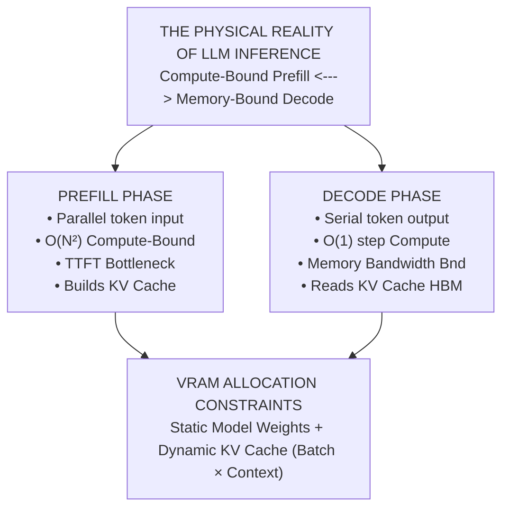

---

> **Taxonomy Note**: Refer to the [main README](../README.md#architectural-mastery-tiers) for curriculum classification symbols (🔴, 🟡, 🔵).

---

## 📑 Table of Contents

1. [Executive Summary: It's Not a Brain, It's a Calculator](#1-executive-summary-its-not-a-brain-its-a-calculator)
2. [The 2:00 AM Reality Check (Why This Matters)](#2-the-200-am-reality-check-why-this-matters)
3. [Deep-Dive Architecture & Mechanical Internals](#3-deep-dive-architecture--mechanical-internals)
4. [Inference Execution: Coffee Sips & Token Pours](#4-inference-execution-coffee-sips--token-pours)
5. [Tokens, Tokenization & BPE: Why Spaces Cost Money](#5-tokens-tokenization--bpe-why-spaces-cost-money)
6. [Sampling Mechanics & Probability Shaping](#6-sampling-mechanics--probability-shaping)
7. [Reasoning Models vs. Standard Models](#7-reasoning-models-vs-standard-models)
8. [Comparative Tradeoff Matrices](#8-comparative-tradeoff-matrices)
9. [Production Failure Modes (War Stories)](#9-production-failure-modes-war-stories)
10. [Production Code Implementations](#10-production-code-implementations)
11. [Curated Verified Resources](#11-curated-verified-resources)
12. [Capstone Engineering Challenge](#12-capstone-engineering-challenge)

---

## 1. Executive Summary: It's Not a Brain, It's a Calculator

Stop treating LLMs like anthropomorphic minds or simple REST microservices. **An LLM is a stateless, auto-regressive tensor processor executing matrix operations over a vocabulary space.** 

When a request comes in, it consumes GPU High-Bandwidth Memory (HBM) throughput, static VRAM for weights, and dynamic VRAM for its scratchpad—the Key-Value (KV) activations.

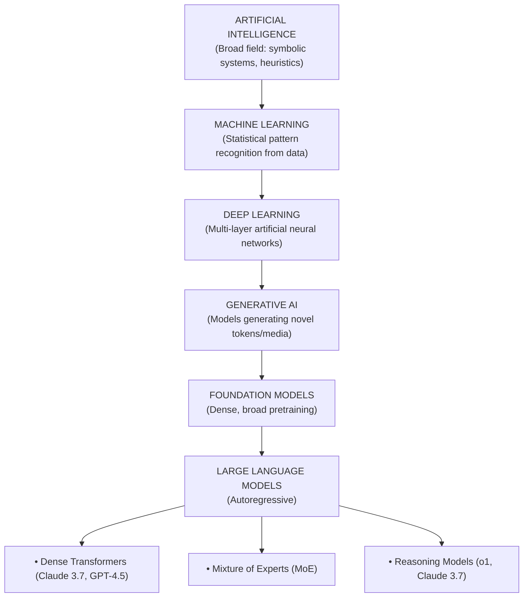

---

## 2. The 2:00 AM Reality Check (Why This Matters)

| The Dilemma | The Silicon Reality | The 2:00 AM Nightmare | Rule of Thumb Mitigation |
|---|---|---|---|
| **KV-Cache Memory Saturation** | Every token retained in active context requires storing Key ($K$) and Value ($V$) activation vectors in GPU VRAM. Think of it as the GPU's scratchpad notes. | In high-concurrency systems, VRAM is exhausted by user context, not the model weights themselves. *BAM*, instant Out-Of-Memory (OOM) crash. | Implement Grouped-Query Attention (GQA), PagedAttention virtual memory, and prompt caching breakpoints. |
| **Prefill vs. Decode Discrepancy** | Prefill processes all prompt tokens concurrently. Decode emits one token at a time (fetching weights for every single token). | Prefill establishes TTFT; Decode establishes streaming inter-token latency (TPS). Optimizing one doesn't magically optimize the other. | Separate prefill nodes from decode nodes (Disaggregated Architecture) at massive scale. |
| **Token Asymmetry Pricing** | Output token generation requires serial forward passes, locking GPU memory bandwidth for the entire duration. | Cloud providers bill output tokens at 3x to 5x the price of input tokens (e.g., \$3/1M in vs \$15/1M out). | Architect pipelines to minimize verbose reasoning in output. Enforce concise JSON. |
| **Tokenizer Fragmentation** | Text is chunked via Byte-Pair Encoding (BPE). Multi-language text, raw code indentation, and special characters explode token counts. | Non-English users pay up to 4x to 8x more per sentence. | Use tokenizer-aware chunking algorithms and normalize UTF-8 boundaries. |

---

## 3. Deep-Dive Architecture & Mechanical Internals

### 3.1. Scaled Dot-Product & Self-Attention Equations `[KNOWLEDGE-BASE]` 🔵

At the heart of the modern Transformer is the Scaled Dot-Product Multi-Head Attention mechanism. 

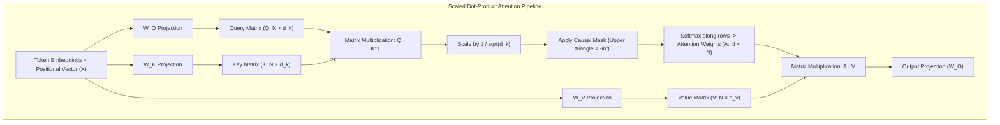

**The Math (Don't skip this, it's beautiful):**
$$\text{Attention}(Q, K, V) = \text{softmax}\left(\frac{QK^T}{\sqrt{d_k}} + M\right)V$$

Where:
- $Q \in \mathbb{R}^{N \times d_k}$: Query matrix (the search vectors of current tokens).
- $K \in \mathbb{R}^{S \times d_k}$: Key matrix (the indexable descriptors of all tokens).
- $V \in \mathbb{R}^{S \times d_v}$: Value matrix (the semantic information).
- $\frac{1}{\sqrt{d_k}}$: Keeps dot products from growing excessively large, preventing vanishing gradients in the softmax.
- $M \in \mathbb{R}^{N \times S}$: Causal attention mask (so auto-regressive generation can't cheat by looking at future tokens).

---

### 3.2. Attention Architectures: MHA vs. MQA vs. GQA `[MUST-HAVE]` 🔴

When context lengths blew past 128,000 tokens, standard Multi-Head Attention (MHA) became a VRAM hog. The solution? Share the scratchpad.

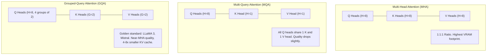

$$\text{Memory Reduction Factor} = \frac{H_Q}{H_{KV}}$$

---

### 3.3. FlashAttention: IO-Aware Tiling `[GOOD-TO-HAVE]` 🟡

Standard attention materializes a massive $N \times N$ matrix in GPU HBM. That memory thrashing is a performance killer. FlashAttention divides the work into SRAM-sized chunks.

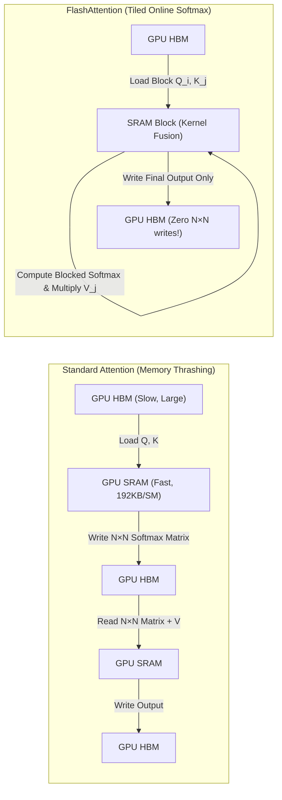

---

### 3.4. Rotary Position Embeddings (RoPE) `[GOOD-TO-HAVE]` 🟡

How does the model know token order? RoPE represents token position as a rotation of the Query and Key vectors in the complex 2D plane. 

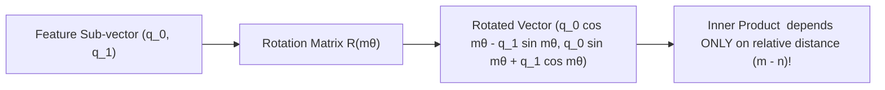

---

### 3.5. Mixture-of-Experts (MoE) `[GOOD-TO-HAVE]` 🟡

Instead of firing every neuron for every word, MoE routes tokens to specialized sub-networks.

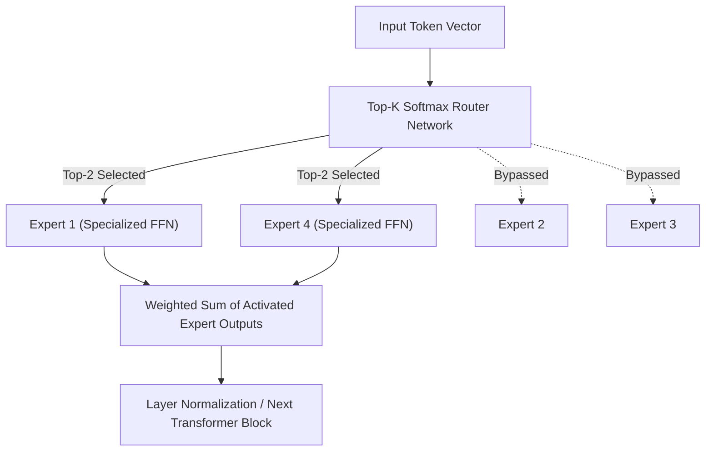

---

## 4. Inference Execution: Coffee Sips & Token Pours

### 4.1. TTFT vs. TPS `[MUST-HAVE]` 🔴

Think of inference like ordering a pour-over coffee. 
- **Time-To-First-Token (TTFT)** is the agonizing wait for the barista to grind the beans, bloom the grounds, and finally let that first drop hit your cup. This is the **Prefill Phase**—the GPU is doing massive parallel math to read your prompt and build the KV-cache scratchpad.
- **Tokens-Per-Second (TPS)** is the steady pour that fills the rest of the cup. This is the **Decode Phase**—it's fast, sequential, but bottlenecked by how quickly the GPU can shuttle weights from memory for *each* single drop.

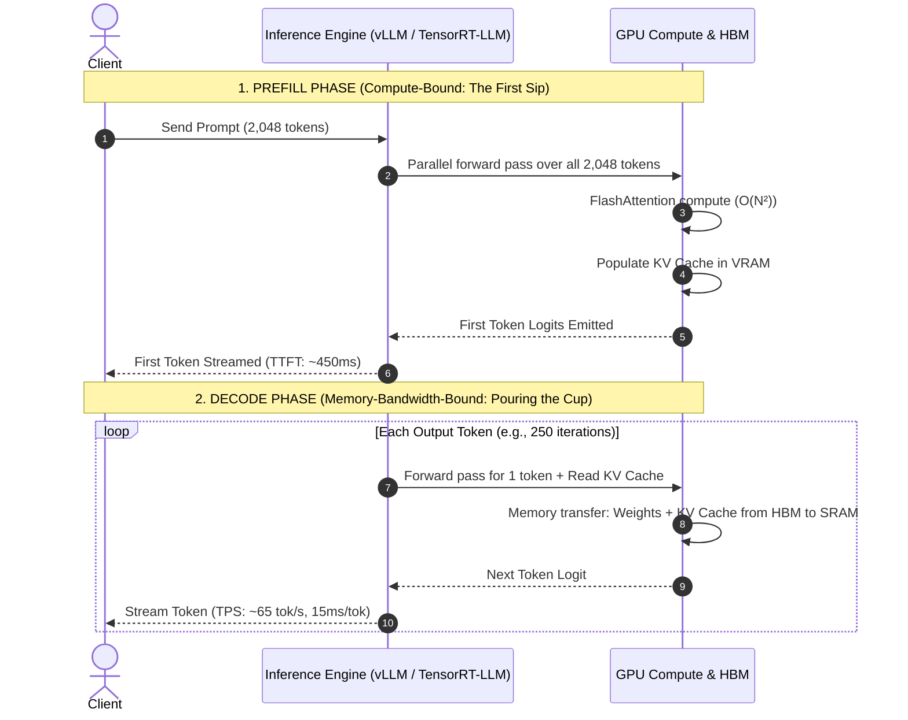

$$\text{Total Request Latency} = \text{TTFT} + \left(N_{\text{out}} \times \frac{1}{\text{TPS}}\right)$$

---

### 4.2. PagedAttention `[MUST-HAVE]` 🔴

Before PagedAttention, the GPU allocated a massive, contiguous block of VRAM for the absolute worst-case scenario. It was like renting an entire hotel floor because you *might* need it, wasting 70%+ of the space. PagedAttention brings OS-level virtual memory paging to LLMs, cutting waste to < 4%.

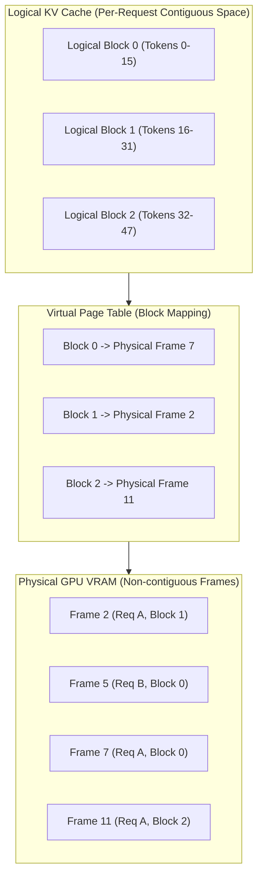

---

### 4.3. Speculative Decoding `[GOOD-TO-HAVE]` 🟡

Speculative decoding couples a tiny, ultra-fast "draft model" (the eager junior dev) to guess the next few words, and a massive "target model" (the senior architect) to verify them all at once.

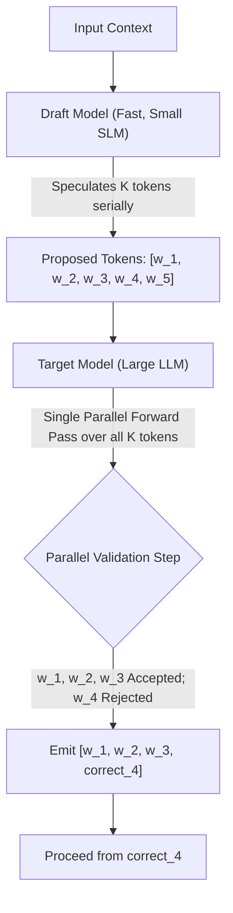

---

### 4.4. Precision, Quantization & VRAM Formulas `[MUST-HAVE]` 🔴

#### The Master VRAM Estimation Formula:
$$\text{Total VRAM (GB)} = \left(\frac{P \times Q}{10^9}\right) \times 1.2 + \text{KV Cache (GB)}$$

Where:
- $P$: Model parameter count (e.g., $70 \times 10^9$ for 70B).
- $Q$: Bytes per parameter ($2$ for FP16/BF16, $1$ for FP8, $0.5$ for INT4).
- $1.2$: A $20\%$ overhead multiplier.

#### KV-Cache Formula for GQA Models:
$$\text{KV Cache (Bytes)} = 2 \times 2 \times L \times H_{KV} \times d_k \times B \times S$$

---

## 5. Tokens, Tokenization & BPE: Why Spaces Cost Money

### 5.1. BPE Mechanics & Vocabularies `[MUST-HAVE]` 🔴

Models don't read text; they read IDs. Tokenizers are just statistical string compressors (Byte-Pair Encoding). They greedily merge whatever bytes they saw most during training.

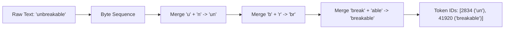

### 5.2. Non-English & Code Token Penalties

Because the training web data was mostly English, the tokenizer learned " Enterprise" as one token. But a string of spaces in C# code, or a word in Hindi? It shreds them into raw bytes. **This is why spaces and numbers cost extra.**

| Input Category | Sample Snippet | Words | Tokens | Production Impact |
|---|---|---|---|---|
| **English** | `"Enterprise Architecture"` | 2 | 3 | **1.5 tok/word** |
| **Hindi** | `"एंटरप्राइज आर्किटेक्चर"` | 2 | 11 | **5.5 tok/word** (Costs 366% more!) |
| **C# Code** | `public async Task<IActionResult>` | 4 | 14 | **3.5 tok/word** (Whitespace shredding) |

---

## 6. Sampling Mechanics & Probability Shaping

### 6.1. Logits, Softmax & Temperature `[MUST-HAVE]` 🔴

$$P(w_i) = \frac{\exp(z_i / T)}{\sum_{j \in V} \exp(z_j / T)}$$

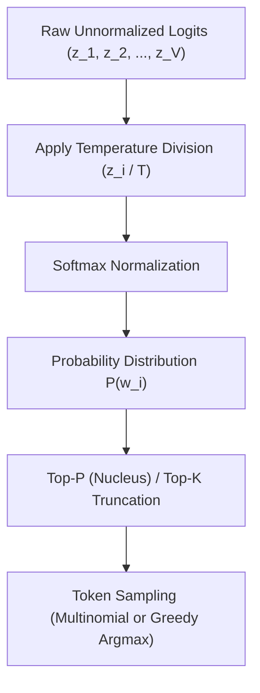

> **War Story Rule**: Use $T = 0$ for code, JSON, and math. Use $T = 0.7$ for normal chat. Never let $T \ge 1.0$ touch production data unless you want pure chaos.

---

## 7. Reasoning Models vs. Standard Models

Frontier AI is shifting to **Test-Time Compute**. Instead of answering instantly, models write hidden "thinking tokens" in an internal scratchpad before committing to an answer. 

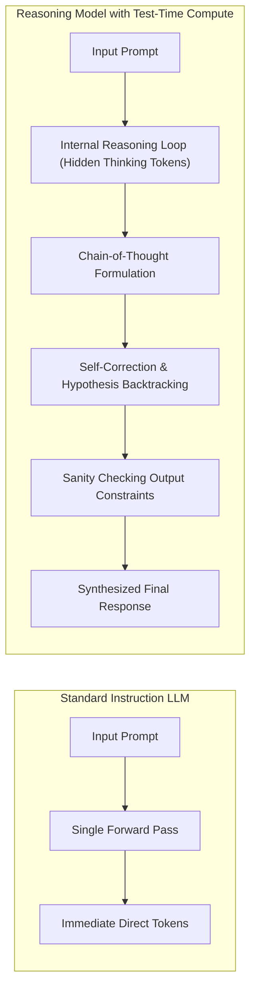

---

## 8. Comparative Tradeoff Matrices

| Dimension | Small Language Model (SLM) | Standard Frontier Model | Reasoning Frontier Model |
|---|---|---|---|
| **Examples** | LLaMA 3.2 3B, Mistral 7B | Claude 3.7 Sonnet, GPT-4.5 | OpenAI o1, Claude 3.7 (Thinking) |
| **TTFT** | 50ms - 150ms | 300ms - 900ms | 3,000ms - 30,000ms |
| **Cost (USD / 1M)** | In: \$0.05 / Out: \$0.20 | In: \$2.50 / Out: \$10.00 | In: \$15.00 / Out: \$60.00 |
| **Best For** | Guardrails, routing | RAG synthesis, general chat | Complex refactoring, logic |

---

## 9. Production Failure Modes (War Stories)

### The Thinking Token Bankruptcy
You deploy a reasoning model inside an autonomous loop. It gets stuck. It burns 32,000 hidden thinking tokens at \$60/1M trying to figure out why it's stuck. **Fix:** Hard cap `budget_tokens: 2048`.

### Silent Context Truncation
You set `max_tokens` too low. The LLM gets cut off midway through generating JSON. Downstream deserializers throw `JSONDecodeError` and crash your DLQs. **Fix:** Check `finish_reason` religiously.

---

## 10. Production Code Implementations

Complete runnable implementations are in [`examples/`](./examples/).

### Python: Exact Tokenizer Profiler
> **Implementation**: [`examples/token_profiler.py`](./examples/token_profiler.py)

```python
def profile_payload(self, system_prompt: str, user_prompt: str, max_expected_output: int, reasoning_budget_tokens: int = 0) -> Dict[str, Any]:
    system_tokens = self._count_tokens(system_prompt)
    user_tokens = self._count_tokens(user_prompt)
    total_input = system_tokens + user_tokens
    
    # Reasoning models bill reasoning tokens as output tokens
    total_output = max_expected_output + (reasoning_budget_tokens if self.config["is_reasoning"] else 0)
    input_cost = (total_input / 1_000_000.0) * self.config["input_per_m"]
    max_output_cost = (total_output / 1_000_000.0) * self.config["output_per_m"]
    ...
```

### C# / .NET 9: Token Budgeting Service
> **Implementation**: [`examples/TokenGovernorService.cs`](./examples/TokenGovernorService.cs)

```csharp
// Hardware KV Cache estimation
double totalSeqLen = totalInput + request.ExpectedOutputTokens;
double kvCacheBytes = 2.0 * 2.0 * 80 * 8 * 128 * request.ConcurrentBatchSize * totalSeqLen;
double kvCacheMb = kvCacheBytes / (1024 * 1024);

if (totalInput > HARD_MAX_INPUT_TOKENS || cost > MAX_DOLLAR_LIMIT_PER_REQUEST)
    return new BudgetReport(false, totalInput, cost, kvCacheMb, "Quota exceeded");
```

## 11. Curated Verified Resources
- **[Andrej Karpathy — Intro to Large Language Models (YouTube)](https://www.youtube.com/watch?v=zjkBMFhNj_g)**
- **[Jay Alammar — The Illustrated Transformer](https://jalammar.github.io/illustrated-transformer/)**
- **[vLLM Official Documentation](https://docs.vllm.ai/)**

---

## 12. Capstone Engineering Challenge
> Build a production token economics analyzer. See the [full capstone specification](./labs/capstone-token-economics-analyzer.md).
