# Phase 00: Foundations, LLM Mechanics & Token Economics: Senior & Lead Developer Edition

> **A rigorous, production-grade architectural deep dive into the physical reality of Large Language Models: Transformer mechanics, self-attention variants, Rotary Position Embeddings (RoPE), FlashAttention, PagedAttention, speculative decoding, precision quantization, and high-throughput token economics for Lead Architects.**

---

```
                       ┌─────────────────────────────────────────────────────────┐
                       │          THE PHYSICAL REALITY OF LLM INFERENCE          │
                       │    Compute-Bound Prefill  ◄────────►  Memory-Bound Decode│
                       └────────────────────────────┬────────────────────────────┘
                                                    │
             ┌──────────────────────────────────────┴──────────────────────────────────────┐
             ▼                                                                             ▼
┌─────────────────────────┐                                                   ┌─────────────────────────┐
│     PREFILL PHASE       │                                                   │      DECODE PHASE       │
│  • Parallel token input │                                                   │  • Serial token output  │
│  • O(N²) Compute-Bound  │                                                   │  • O(1) step Compute    │
│  • TTFT Bottleneck      │                                                   │  • Memory Bandwidth Bnd │
│  • Builds KV Cache      │                                                   │  • Reads KV Cache HBM   │
└────────────┬────────────┘                                                   └────────────┬────────────┘
             │                                                                             │
             └──────────────────────────────────────┬──────────────────────────────────────┘
                                                    ▼
                       ┌─────────────────────────────────────────────────────────┐
                       │              VRAM ALLOCATION CONSTRAINTS                │
                       │  Static Model Weights + Dynamic KV Cache (Batch × Context)│
                       └─────────────────────────────────────────────────────────┘
```

---

> ### 🏷️ Curriculum Taxonomy & Classification for Senior Engineers
> - `[MUST-HAVE]` 🔴: Core production architecture, sizing formulas, and interview essentials.
> - `[GOOD-TO-HAVE]` 🟡: Advanced scaling, hardware acceleration, and optimization techniques.
> - `[KNOWLEDGE-BASE]` 🔵: Conceptual understanding only (skip coding from scratch).

---

## 📑 Table of Contents

1. [Executive Summary & The Lead Mental Model](#1-executive-summary--the-lead-mental-model)
2. [Why This Matters for Senior Developers & Architects](#2-why-this-matters-for-senior-developers--architects)
3. [Deep-Dive Architecture & Mechanical Internals](#3-deep-dive-architecture--mechanical-internals)
   - [3.1. Scaled Dot-Product & Self-Attention Equations `[KNOWLEDGE-BASE]` 🔵](#31-scaled-dot-product--self-attention-equations-knowledge-base-)
   - [3.2. Attention Architectures: MHA vs. MQA vs. GQA `[MUST-HAVE]` 🔴](#32-attention-architectures-mha-vs-mqa-vs-gqa-must-have-)
   - [3.3. FlashAttention (1, 2 & 3): IO-Aware Tiling `[GOOD-TO-HAVE]` 🟡](#33-flashattention-1-2--3-io-aware-tiling-good-to-have-)
   - [3.4. Rotary Position Embeddings (RoPE) & Context Scaling `[GOOD-TO-HAVE]` 🟡](#34-rotary-position-embeddings-rope--context-scaling-good-to-have-)
   - [3.5. Mixture-of-Experts (MoE) Architecture `[GOOD-TO-HAVE]` 🟡](#35-mixture-of-experts-moe-architecture-good-to-have-)
4. [Inference Execution & High-Throughput Serving](#4-inference-execution--high-throughput-serving)
   - [4.1. The Prefill vs. Decode Dichotomy (TTFT vs. TPS) `[MUST-HAVE]` 🔴](#41-the-prefill-vs-decode-dichotomy-ttft-vs-tps-must-have-)
   - [4.2. PagedAttention & vLLM Virtual Memory Management `[MUST-HAVE]` 🔴](#42-pagedattention--vllm-virtual-memory-management-must-have-)
   - [4.3. Speculative Decoding `[GOOD-TO-HAVE]` 🟡](#43-speculative-decoding-good-to-have-)
   - [4.4. Precision, Quantization & VRAM Formulas (FP16, BF16, FP8, INT4) `[MUST-HAVE]` 🔴](#44-precision-quantization--vram-formulas-fp16-bf16-fp8-int4-must-have-)
5. [Tokens, Tokenization & Byte-Pair Encoding (BPE)](#5-tokens-tokenization--byte-pair-encoding-bpe)
   - [5.1. BPE Mechanics & Vocabularies `[MUST-HAVE]` 🔴](#51-bpe-mechanics--vocabularies-must-have-)
   - [5.2. Non-English & Code Token Penalties `[MUST-HAVE]` 🔴](#52-non-english--code-token-penalties-must-have-)
6. [Sampling Mechanics & Probability Shaping](#6-sampling-mechanics--probability-shaping)
   - [6.1. Logits, Softmax & Temperature `[MUST-HAVE]` 🔴](#61-logits-softmax--temperature-must-have-)
   - [6.2. Top-P, Top-K, Min-P & Repetition Penalties `[MUST-HAVE]` 🔴](#62-top-p-top-k-min-p--repetition-penalties-must-have-)
7. [Reasoning Models vs. Standard Instruction Models](#7-reasoning-models-vs-standard-instruction-models)
   - [7.1. Test-Time Compute vs. Pretraining Compute `[MUST-HAVE]` 🔴](#71-test-time-compute-vs-pretraining-compute-must-have-)
   - [7.2. Thinking Token Dynamics & Architectural Tradeoffs `[MUST-HAVE]` 🔴](#72-thinking-token-dynamics--architectural-tradeoffs-must-have-)
8. [Comparative Tradeoff Matrices](#8-comparative-tradeoff-matrices)
9. [Production Failure Modes & Anti-Patterns](#9-production-failure-modes--anti-patterns)
10. [Production Code Implementations `[MUST-HAVE]` 🔴](#10-production-code-implementations-must-have-)
    - [Python: Exact Tokenizer Profiler & Cost Modeling Engine](#python-exact-tokenizer-profiler--cost-modeling-engine)
    - [C# / .NET 9: Token Budgeting & KV Cache Memory Estimation Service](#c--net-9-token-budgeting--kv-cache-memory-estimation-service)
11. [Curated Verified Resources](#11-curated-verified-resources)
12. [Capstone Engineering Challenge: High-Throughput Token Budgeting Proxy `[MUST-HAVE]` 🔴](#12-capstone-engineering-challenge-high-throughput-token-budgeting-proxy-must-have-)

---

## 1. Executive Summary & The Lead Mental Model

For senior engineers and systems architects, the most dangerous cognitive distortion is treating a Large Language Model as an anthropomorphic "reasoning mind" or a simple string-in/string-out REST microservice.

**In software engineering reality, an LLM is a stateless, auto-regressive tensor processor executing discrete matrix operations over a high-dimensional vocabulary space:**
- Every completion request consumes physical GPU High-Bandwidth Memory (HBM) throughput, static hardware memory for parameter weights, and dynamic VRAM for Key-Value (KV) activations.
- Processing a prompt runs in two fundamentally distinct hardware regimes: the **Prefill Phase** (compute-bound, parallelized over all input tokens) and the **Decode Phase** (memory-bandwidth bound, executing one serial forward pass per emitted token).
- System-level properties like Time-To-First-Token (TTFT), Tokens-Per-Second (TPS), concurrency ceilings, and cost curves are physical consequences of GPU architecture, KV cache retention, and tensor memory bandwidth.

```
                      THE TAXONOMY OF MODERN ARTIFICIAL INTELLIGENCE
                      
┌────────────────────────────────────────────────────────────────────────┐
│ ARTIFICIAL INTELLIGENCE (Broad field: symbolic systems, heuristics)    │
│  ┌──────────────────────────────────────────────────────────────────┐  │
│  │ MACHINE LEARNING (Statistical pattern recognition from data)     │  │
│  │  ┌────────────────────────────────────────────────────────────┐  │  │
│  │  │ DEEP LEARNING (Multi-layer artificial neural networks)     │  │  │
│  │  │  ┌──────────────────────────────────────────────────────┐  │  │  │
│  │  │  │ GENERATIVE AI (Models generating novel tokens/media) │  │  │  │
│  │  │  │  ┌────────────────────────────────────────────────┐  │  │  │  │
│  │  │  │  │ FOUNDATION MODELS (Dense, broad pretraining)   │  │  │  │  │
│  │  │  │  │  ┌──────────────────────────────────────────┐  │  │  │  │  │
│  │  │  │  │  │ LARGE LANGUAGE MODELS (Autoregressive)   │  │  │  │  │  │
│  │  │  │  │  │  • Dense Transformers (Claude, GPT-4o)   │  │  │  │  │  │
│  │  │  │  │  │  • Mixture of Experts (MoE)              │  │  │  │  │  │
│  │  │  │  │  │  • Reasoning Models (o1, Claude 3.7)     │  │  │  │  │  │
│  │  │  │  │  └──────────────────────────────────────────┘  │  │  │  │  │
│  │  │  │  └────────────────────────────────────────────────┘  │  │  │  │
│  │  └────────────────────────────────────────────────────────────┘  │  │
│  └──────────────────────────────────────────────────────────────────┘  │
└────────────────────────────────────────────────────────────────────────┘
```

---

## 2. Why This Matters for Senior Developers & Architects

| Architectural Concern | Hardware Reality | Production Consequence | Engineering Mitigation |
|---|---|---|---|
| **KV-Cache Memory Saturation** | Every token retained in active context requires storing Key ($K$) and Value ($V$) activation vectors in GPU VRAM across all layers and attention heads. | In high-concurrency systems, VRAM is exhausted by user context, not model weights, triggering sudden Out-Of-Memory (OOM) crashes and batch drops. | Implement Grouped-Query Attention (GQA), PagedAttention virtual memory, and prompt caching breakpoints. |
| **Prefill vs. Decode Discrepancy** | Prefill processes all prompt tokens concurrently ($O(N^2)$ attention, saturating compute cores). Decode emits one token at a time (fetching weights from HBM to SRAM for every single token). | Prefill establishes TTFT; Decode establishes streaming inter-token latency (TPS). Optimizing one does not automatically optimize the other. | Separate prefill nodes from decode nodes (Disaggregated Prefill/Decode architecture) in high-scale clusters. |
| **Token Asymmetry Pricing** | Output token generation requires serial forward passes, locking GPU memory bandwidth for the entire duration of response generation. | Cloud LLM providers bill output tokens at $3\times$ to $5\times$ the price of input tokens (e.g., Anthropic Claude 3.5 Sonnet: \$3/1M in vs \$15/1M out). | Architect pipelines to minimize verbose reasoning in output; enforce concise structured JSON schemas and push intermediate reasoning into cached contexts. |
| **Tokenizer Fragmentation** | Text is chunked via Byte-Pair Encoding (BPE). Multi-language text, raw code indentation, and special characters explode token counts. | Non-English users pay up to $4\times$ to $8\times$ more per sentence; regex splitting at character boundaries corrupts multi-byte tokens. | Use tokenizer-aware chunking algorithms; enforce UTF-8 byte boundary normalization before hashing or storing chunks. |

---

## 3. Deep-Dive Architecture & Mechanical Internals

### 3.1. Scaled Dot-Product & Self-Attention Equations `[KNOWLEDGE-BASE]` 🔵

At the heart of the modern Transformer is the Scaled Dot-Product Multi-Head Attention mechanism (Vaswani et al., 2017).

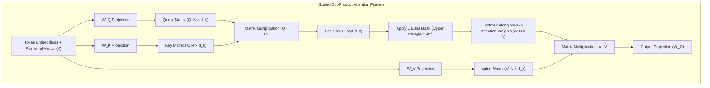

#### The Mathematical Formulation:
$$\text{Attention}(Q, K, V) = \text{softmax}\left(\frac{QK^T}{\sqrt{d_k}} + M\right)V$$

Where:
- $Q \in \mathbb{R}^{N \times d_k}$: Query matrix representing the search vectors of current tokens.
- $K \in \mathbb{R}^{S \times d_k}$: Key matrix representing the indexable descriptors of all tokens in context.
- $V \in \mathbb{R}^{S \times d_v}$: Value matrix containing the semantic information of all tokens.
- $\frac{1}{\sqrt{d_k}}$: Scaling factor preventing the dot products from growing excessively large in high dimensions, which would push softmax into regions with vanishing gradients.
- $M \in \mathbb{R}^{N \times S}$: Causal attention mask where $M_{ij} = -\infty$ for $j > i$, ensuring that auto-regressive generation cannot attend to future tokens.

---

### 3.2. Attention Architectures: MHA vs. MQA vs. GQA `[MUST-HAVE]` 🔴

As context lengths scaled from 2,048 tokens to 128,000+ tokens, standard Multi-Head Attention became the primary memory bottleneck in production serving.

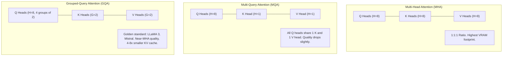

#### Comparison of Attention Architectures:

| Architecture | Query Heads ($H_Q$) | Key/Value Heads ($H_{KV}$) | KV-Cache Memory Ratio | Used By |
|---|---|---|---|---|
| **Multi-Head Attention (MHA)** | $H$ | $H$ | 1.0x (Baseline) | GPT-3, Original Transformer |
| **Multi-Query Attention (MQA)** | $H$ | 1 | 1/H (8x to 64x reduction) | Falcon, PaLM |
| **Grouped-Query Attention (GQA)** | $H$ | $G$ ($1 < G < H$) | G/H (typically 4x to 8x reduction) | LLaMA 2/3 (70B), Mistral, DeepSeek |

$$\text{Memory Reduction Factor} = \frac{H_Q}{H_{KV}}$$

---

### 3.3. FlashAttention (1, 2 & 3): IO-Aware Tiling `[GOOD-TO-HAVE]` 🟡

Standard attention materializes an intermediate $N \times N$ attention weight matrix in GPU High-Bandwidth Memory (HBM). For an 8,192 token sequence, $N \times N \approx 67 \text{ million elements}$ per head per layer. This memory thrashing between HBM and the GPU chip's Static RAM (SRAM) is the single biggest performance killer.

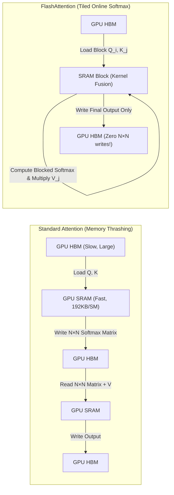

#### The Breakthrough of FlashAttention:
- **Tiling:** Divides inputs into blocks that fit entirely inside the high-speed SRAM (192 KB per Streaming Multiprocessor on NVIDIA H100).
- **Online Softmax:** Computes softmax incrementally across blocks using running maximum and normalization constants without materializing the full matrix.
- **Kernel Fusion:** Fuses QK multiplication, masking, softmax, and dropout into a single GPU compute kernel.
- **Results:** FlashAttention-2 and FlashAttention-3 achieve up to 75% of theoretical H100 FP16 peak FLOPs, accelerating prefill speeds by 2x to 4x.

---

### 3.4. Rotary Position Embeddings (RoPE) & Context Scaling `[GOOD-TO-HAVE]` 🟡

Original Transformers used absolute sinusoidal or learned positional vectors added to token embeddings ($x_i + p_i$). This breaks down when extrapolating beyond training context windows.

**Rotary Position Embedding (RoPE)** represents token position as a rotation of the Query and Key vectors in the complex 2D plane:

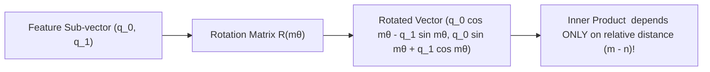

#### Why RoPE Dominates Modern Architectures:
1. **Relative Distance Preservation:** The attention score depends strictly on the distance $m - n$ between tokens, not their absolute indices.
2. **Context Window Expansion:** Techniques like **YaRN (Yet another RoPE extensioN)** and **NTK-aware Scaling** interpolate rotation frequencies ($\theta$), allowing a model trained on 8k tokens to cleanly generalize to 128k+ tokens with minimal fine-tuning.

---

### 3.5. Mixture-of-Experts (MoE) Architecture `[GOOD-TO-HAVE]` 🟡

Dense models activate all $N$ parameters for every token. **Mixture-of-Experts (MoE)** decouples total parameter capacity from compute cost per token by routing tokens dynamically through specialized sub-networks.

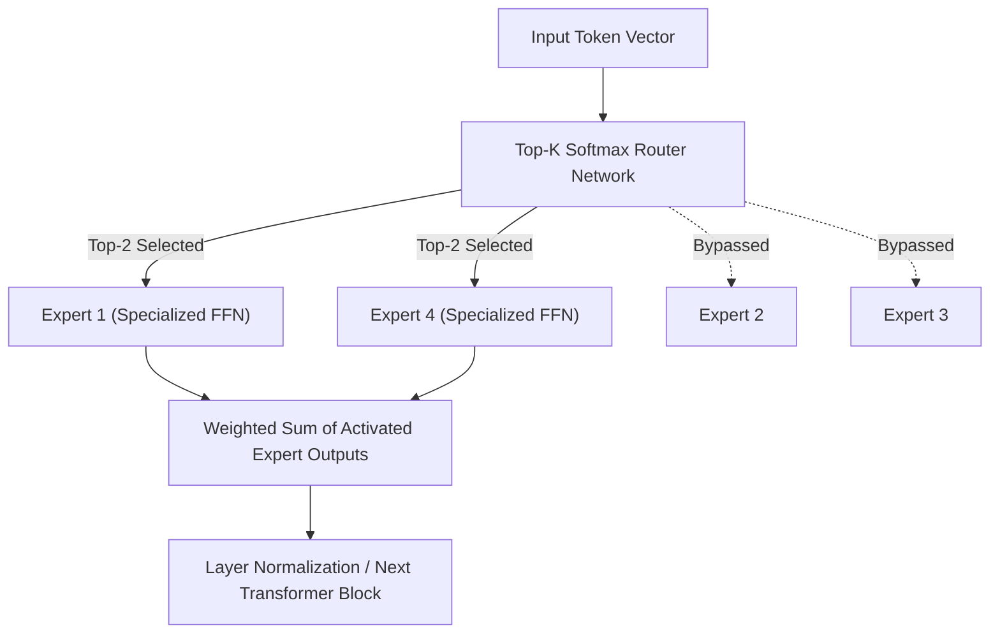

#### MoE Architectural Tradeoffs:
- **Total vs. Active Parameters:** Mixtral 8x7B has 46.7B total parameters, but only activates **12.9B parameters per token** (top-2 routing).
- **Inference Speed:** Runs at the speed of a 13B model while delivering the reasoning capability of a 40B+ dense model.
- **VRAM Constraint:** To serve Mixtral 8x7B, you must hold the entire 46.7B model weights in VRAM (~90 GB in FP16), even though only 12.9B parameters compute on each token forward pass.

---

## 4. Inference Execution & High-Throughput Serving

### 4.1. The Prefill vs. Decode Dichotomy (TTFT vs. TPS) `[MUST-HAVE]` 🔴

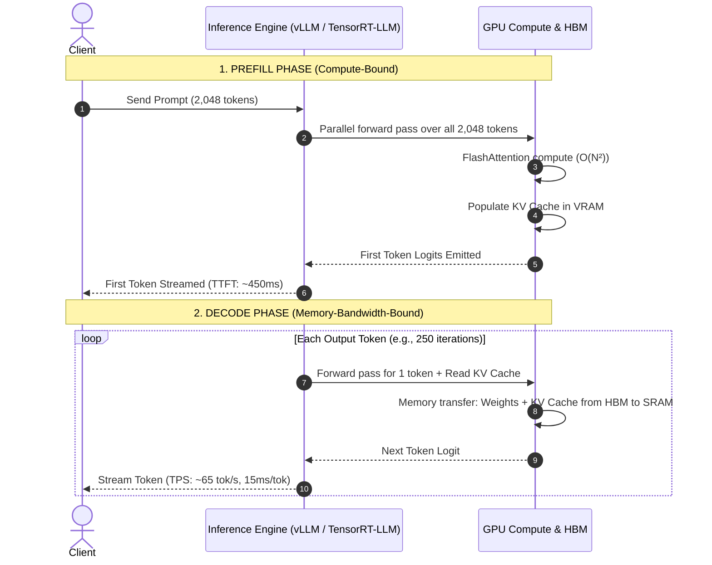

#### Key Latency Equations:
$$\text{Total Request Latency} = \text{TTFT} + \left(N_{\text{out}} \times \frac{1}{\text{TPS}}\right)$$

Where:
- $\text{TTFT}$ (Time to First Token) is determined by prompt length, GPU compute capacity (TFLOPs), and prefill queue depth.
- $\text{TPS}$ (Tokens per Second) is determined by GPU memory bandwidth (GB/s), model parameter size, and batch concurrency.

---

### 4.2. PagedAttention & vLLM Virtual Memory Management `[MUST-HAVE]` 🔴

Before PagedAttention (Kwon et al., 2023), inference systems pre-allocated contiguous memory for the maximum possible context length (e.g., 4,096 tokens). If a request only used 300 tokens, ~90% of that allocated VRAM was wasted (internal fragmentation).

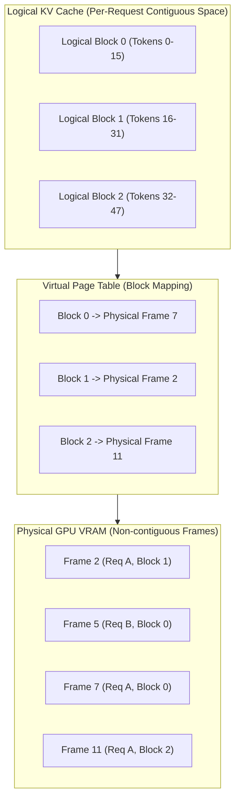

#### Impact of PagedAttention:
- Inspired by the Virtual Memory Management of classic OS kernels.
- Allocates fixed-size physical memory blocks (typically 16 or 32 tokens per block) on-demand as tokens are generated.
- **Reduces VRAM memory waste from > 70% to < 4%**, unlocking up to **4x higher concurrency** on the same GPU hardware.

---

### 4.3. Speculative Decoding `[GOOD-TO-HAVE]` 🟡

Because the decode phase is memory-bandwidth bound, the GPU spends most of its time waiting for weights to transfer from HBM to SRAM rather than running arithmetic.

**Speculative Decoding** couples a small, ultra-fast "draft model" (e.g., LLaMA 3 8B) with a large, capable "target model" (e.g., LLaMA 3 70B):

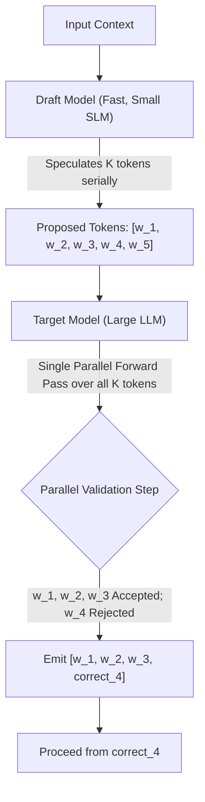

#### Why Speculative Decoding is Architecturally Significant:
- The target model verifies $K$ tokens in a **single forward pass** (which takes approximately the same time as generating 1 token).
- Delivers a **2x to 3x speedup** in wall-clock latency with **mathematically zero loss in output quality** (the target model's probability distribution is strictly preserved via modified rejection sampling).

---

### 4.4. Precision, Quantization & VRAM Formulas (FP16, BF16, FP8, INT4) `[MUST-HAVE]` 🔴

Every parameter is stored in a specific floating-point or integer representation:

```
FP32 (32-bit): [Sign: 1b][Exponent: 8b][Mantissa: 23b] = 4 Bytes
FP16 (16-bit): [Sign: 1b][Exponent: 5b][Mantissa: 10b] = 2 Bytes
BF16 (16-bit): [Sign: 1b][Exponent: 8b][Mantissa: 7b]  = 2 Bytes (Standard Training/Serving)
FP8  (8-bit):  [Sign: 1b][Exponent: 4b][Mantissa: 3b]  = 1 Byte  (H100 Native Engine)
INT4 (4-bit):  [Quantized Integer: 4b]                 = 0.5 Byte (AWQ, GPTQ)
```

#### The Master VRAM Estimation Formula:
$$\text{Total VRAM (GB)} = \left(\frac{P \times Q}{10^9}\right) \times 1.2 + \text{KV Cache (GB)}$$

Where:
- $P$: Model parameter count (e.g., $70 \times 10^9$ for 70B).
- $Q$: Bytes per parameter ($2$ for FP16/BF16, $1$ for FP8, $0.5$ for INT4).
- $1.2$: A $20\%$ overhead multiplier for CUDA kernels, activation scratchpads, and context buffers.

#### KV-Cache Formula for GQA Models:
$$\text{KV Cache (Bytes)} = 2 \times 2 \times L \times H_{KV} \times d_k \times B \times S$$

*Example for 70B model with 80 layers, 8 KV heads, head dimension 128, batch size 16, context 8,192 tokens in FP16:*
$$2 \times 2 \times 80 \times 8 \times 128 \times 16 \times 8,192 = 42,949,672,960 \text{ Bytes} \approx 40.0 \text{ GB}$$

---

## 5. Tokens, Tokenization & Byte-Pair Encoding (BPE)

### 5.1. BPE Mechanics & Vocabularies `[MUST-HAVE]` 🔴

Tokenizers do not possess semantic understanding; they are statistical string compressors trained via **Byte-Pair Encoding (BPE)**.

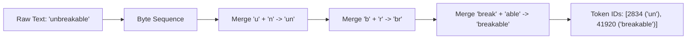

#### Tokenizer Vocabulary Sizes:
- **GPT-4 (cl100k_base):** 100,000 tokens
- **GPT-4o (o200k_base):** 200,000 tokens (significantly more efficient for non-English and code)
- **LLaMA 3:** 128,256 tokens

---

### 5.2. Non-English & Code Token Penalties `[MUST-HAVE]` 🔴

Because BPE merges byte sequences based on frequency in the training corpus (which is predominantly English web text), non-Latin scripts and whitespace-heavy code suffer severe token inflation.

```
Text: "Enterprise Architecture"
- English (2 words): 3 tokens (Ratio: 1.5 tok/word)

Text: "एंटरप्राइज आर्किटेक्चर" (Hindi for Enterprise Architecture)
- Hindi (2 words): 11 tokens (Ratio: 5.5 tok/word -> 366% Cost Penalty!)

Code (C#):
  public async Task<IActionResult> ProcessOrderAsync(...)
- Indentation and camelCase splitting convert 4 words into 14 distinct tokens.
```

---

## 6. Sampling Mechanics & Probability Shaping

### 6.1. Logits, Softmax & Temperature `[MUST-HAVE]` 🔴

At each step, the model computes raw vector scores (logits $z_i$) for every token $i$ in vocabulary $V$:

$$P(w_i) = \frac{\exp(z_i / T)}{\sum_{j \in V} \exp(z_j / T)}$$

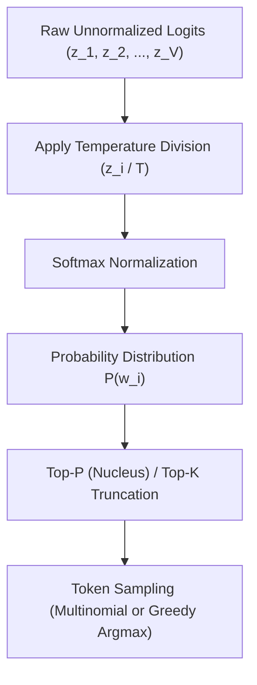

#### Temperature ($T$) Dynamics:
- **$T = 0$ (Greedy / Argmax):** Completely deterministic. Always chooses the token with the highest logit. Essential for code syntax, math, and JSON schema compliance.
- **$0 < T \le 0.7$:** Standard default for enterprise agents, technical writing, and grounded RAG synthesis.
- **$T \ge 1.0$:** Flattens the probability curve, elevating obscure tokens. High risk of syntactic corruption and hallucination.

---

### 6.2. Top-P, Top-K, Min-P & Repetition Penalties `[MUST-HAVE]` 🔴

- **Top-P (Nucleus Sampling):** Sets a dynamic cutoff threshold. Sorts tokens by probability and keeps the smallest subset whose cumulative sum reaches $P$ (e.g., $P = 0.9$).
- **Top-K:** Fixed cutoff. Considers only the $K$ most probable tokens (e.g., $K = 50$), discarding the rest.
- **Min-P (Modern Standard):** Sets a dynamic floor relative to the top token's probability:
  $$\text{Threshold} = p_{\text{max}} \times \text{Min-}P$$
  If the top token has $p_{\text{max}} = 0.8$ and $\text{Min-}P = 0.05$, only tokens with $p \ge 0.04$ are eligible. Min-P adapts automatically between certain and uncertain contexts far better than Top-P.

---

## 7. Reasoning Models vs. Standard Instruction Models

### 7.1. Test-Time Compute vs. Pretraining Compute `[MUST-HAVE]` 🔴

For years, model capability scaled by expanding pretraining data and parameter counts (Bitter Lesson / Scaling Laws). Modern frontier AI introduces **Test-Time Compute Scaling** (OpenAI o1/o3, Claude 3.7 Sonnet Thinking, Gemini 2.0 Flash Thinking):

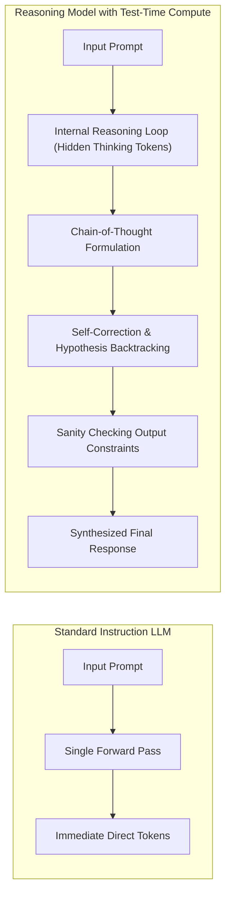

---

### 7.2. Thinking Token Dynamics & Architectural Tradeoffs `[MUST-HAVE]` 🔴

- **Visible vs. Hidden Tokens:** Reasoning models emit thousands of "thinking tokens" into an internal scratchpad before producing user-visible text.
- **Billing Mechanics:** Providers bill thinking tokens at the standard **Output Token Rate**, even when thinking tokens are hidden from the final user response.
- **Latency Impact:** TTFT increases from < 1 second to 5 - 45 seconds as the model conducts multi-step tree-of-thought exploration.

---

## 8. Comparative Tradeoff Matrices

### Model Paradigm Comparison

| Architectural Dimension | Small Language Model (SLM) | Standard Frontier Model | Reasoning Frontier Model |
|---|---|---|---|
| **Representative Models** | LLaMA 3.2 3B, Phi-4, Mistral 7B | Claude 3.5 Sonnet, GPT-4o, Gemini 2.0 Flash | OpenAI o1 / o3, Claude 3.7 Sonnet (Thinking) |
| **Compute Profile** | Ultra-lightweight (< 8 GB VRAM) | Balanced dense/MoE inference | Heavy dynamic test-time compute |
| **Time-to-First-Token (TTFT)** | 50ms - 150ms | 300ms - 900ms | 3,000ms - 30,000ms |
| **Throughput (TPS)** | 80 - 150 tok/s | 50 - 90 tok/s | 30 - 60 visible tok/s |
| **Cost Profile (USD / 1M tokens)** | In: $0.05 / Out: $0.20 | In: $2.50 / Out: $10.00 | In: $15.00 / Out: $60.00 |
| **Optimal Production Role** | Guardrails, classification, reranking | RAG synthesis, tool use, general chat | Complex refactoring, formal math, logic planning |

---

### Precision & Quantization Footprint (70B Model)

| Precision Format | Bits per Weight | Model VRAM Required | KV Cache per 10k Context | Perplexity Degradation | Typical Engine |
|---|---|---|---|---|---|
| **FP16 / BF16** | 16 | 140 GB | 5.12 GB | Baseline (0.0%) | TensorRT-LLM, vLLM |
| **FP8 (E4M3)** | 8 | 70 GB | 2.56 GB | Minimal (< 0.5%) | NVIDIA H100 native vLLM |
| **AWQ / GPTQ (INT4)** | 4 | 38 GB | 2.56 GB (FP8 KV) | Low (1.0 - 2.5%) | vLLM, Aphrodite |
| **GGUF (Q4_K_M)** | 4.5 | 42 GB | 1.28 GB (Q4 KV) | Low (1.5%) | Ollama, llama.cpp |

---

## 9. Production Failure Modes & Anti-Patterns

### 1. The Thinking Token Runaway Bankruptcy
- **Failure:** Deploying a reasoning model (o1 or Claude 3.7 Thinking) inside a multi-turn autonomous agent loop without explicit token boundaries. A single stuck loop burns 32,000 thinking tokens per iteration at \$60/1M tokens (\$1.92 per step).
- **Architectural Fix:** Enforce a hard cap on thinking tokens (e.g., `budget_tokens: 2048`) and trigger circuit breakers if consecutive turns fail to emit tool calls.

### 2. Silent Context Truncation
- **Failure:** Setting `max_tokens` too low or omitting response bounds causes the LLM to cut off mid-JSON string. Downstream deserializers throw unhandled syntax errors.
- **Architectural Fix:** Always inspect the provider's `finish_reason` in the API response metadata. If `finish_reason == "length"` or `"max_tokens"`, trigger an automated recovery policy rather than passing corrupted data to consumers.

### 3. Tokenizer Drift in Embedding Pipelines
- **Failure:** Chunking raw text documents using `tiktoken` (OpenAI cl100k_base) while embedding those chunks with a Cohere, Voyage, or Google model that uses a different vocabulary. Chunks split cleanly in Python get truncated or corrupted inside the embedding endpoint.
- **Architectural Fix:** Always use the official tokenizer bundled with the specific embedding model being invoked.

---

## 10. Production Code Implementations `[MUST-HAVE]` 🔴

### Python: Exact Tokenizer Profiler & Cost Modeling Engine

```python
"""
production_token_profiler.py
Production-grade tokenization profiler, latency forecaster, and cost auditor.
"""
from typing import Dict, Any, List
import tiktoken

class ProductionTokenProfiler:
    PROVIDER_RATES = {
        "gpt-4o": {"input_per_m": 2.50, "output_per_m": 10.00, "encoding": "o200k_base"},
        "claude-3-5-sonnet": {"input_per_m": 3.00, "output_per_m": 15.00, "encoding": "cl100k_base"},
        "gemini-2-flash": {"input_per_m": 0.10, "output_per_m": 0.40, "encoding": "cl100k_base"},
    }

    def __init__(self, model_key: str = "gpt-4o"):
        if model_key not in self.PROVIDER_RATES:
            raise ValueError(f"Unsupported model: {model_key}")
        self.model_key = model_key
        self.config = self.PROVIDER_RATES[model_key]
        self.encoder = tiktoken.get_encoding(self.config["encoding"])

    def profile_payload(self, system_prompt: str, user_prompt: str, max_expected_output: int) -> Dict[str, Any]:
        system_tokens = len(self.encoder.encode(system_prompt, disallowed_special=()))
        user_tokens = len(self.encoder.encode(user_prompt, disallowed_special=()))
        total_input_tokens = system_tokens + user_tokens

        # Financial modeling
        input_cost = (total_input_tokens / 1_000_000.0) * self.config["input_per_m"]
        max_output_cost = (max_expected_output / 1_000_000.0) * self.config["output_per_m"]

        # Latency forecasting (empirical hardware baseline)
        estimated_ttft_ms = 250 + (total_input_tokens * 0.08)
        estimated_decode_ms = max_expected_output * 15.0 # ~66 tokens/sec

        return {
            "model": self.model_key,
            "encoding": self.config["encoding"],
            "system_tokens": system_tokens,
            "user_tokens": user_tokens,
            "total_input_tokens": total_input_tokens,
            "max_expected_output_tokens": max_expected_output,
            "estimated_cost_usd": {
                "input": round(input_cost, 6),
                "max_output": round(max_output_cost, 6),
                "total_worst_case": round(input_cost + max_output_cost, 6)
            },
            "latency_forecast_ms": {
                "estimated_ttft": round(estimated_ttft_ms, 1),
                "estimated_decode": round(estimated_decode_ms, 1),
                "total_estimated_turn_time": round(estimated_ttft_ms + estimated_decode_ms, 1)
            }
        }

if __name__ == "__main__":
    profiler = ProductionTokenProfiler("claude-3-5-sonnet")
    sys_prompt = "You are an enterprise financial auditor. Adhere to strict GAAP compliance." * 20
    user_query = "Analyze the attached corporate filing for anomalies in Q3 EBITDA." * 5
    report = profiler.profile_payload(sys_prompt, user_query, max_expected_output=1500)
    
    import json
    print(json.dumps(report, indent=2))
```

---

### C# / .NET 9: Token Budgeting & KV Cache Memory Estimation Service

```csharp
// Program.cs - Enterprise Token Budgeting and VRAM Estimation Service in .NET 9
using Microsoft.ML.Tokenizers;
using System.Text.Json;

var builder = WebApplication.CreateBuilder(args);
builder.Services.AddSingleton<ITokenGovernorService, TokenGovernorService>();

var app = builder.Build();

app.MapPost("/api/v1/governance/check-budget", async (HttpContext context, ITokenGovernorService governor) =>
{
    using var reader = new StreamReader(context.Request.Body);
    var body = await reader.ReadToEndAsync();
    var request = JsonSerializer.Deserialize<PromptBudgetRequest>(body);

    if (request == null)
        return Results.BadRequest(new { Error = "Malformed payload" });

    var report = governor.EvaluateRequest(request);
    if (!report.IsPermitted)
    {
        context.Response.StatusCode = StatusCodes.Status429TooManyRequests;
        return Results.Json(report);
    }

    return Results.Ok(report);
});

app.Run();

public record PromptBudgetRequest(string Model, string SystemPrompt, string UserPrompt, int ExpectedOutputTokens, int ConcurrentBatchSize);

public record BudgetReport(
    bool IsPermitted,
    int TotalInputTokens,
    double EstimatedCostUsd,
    double KvCacheMemoryMb,
    string RejectionReason
);

public interface ITokenGovernorService
{
    BudgetReport EvaluateRequest(PromptBudgetRequest request);
}

public class TokenGovernorService : ITokenGovernorService
{
    private readonly TiktokenTokenizer _tokenizer = TiktokenTokenizer.CreateForModel("gpt-4o");
    private const int HARD_MAX_INPUT_TOKENS = 32_000;
    private const double MAX_DOLLAR_LIMIT_PER_REQUEST = 0.50;

    public BudgetReport EvaluateRequest(PromptBudgetRequest request)
    {
        var sysCount = _tokenizer.CountTokens(request.SystemPrompt);
        var userCount = _tokenizer.CountTokens(request.UserPrompt);
        var totalInput = sysCount + userCount;

        // Cost estimation: $2.50 / 1M in, $10.00 / 1M out
        var cost = ((totalInput / 1_000_000.0) * 2.50) + ((request.ExpectedOutputTokens / 1_000_000.0) * 10.00);

        // Hardware KV Cache calculation for GQA (80 layers, 8 KV heads, head dim 128, FP16 = 2 bytes)
        // Formula: 2 * 2 * L * H_kv * D_head * Batch * SeqLen
        double totalSeqLen = totalInput + request.ExpectedOutputTokens;
        double kvCacheBytes = 2.0 * 2.0 * 80 * 8 * 128 * request.ConcurrentBatchSize * totalSeqLen;
        double kvCacheMb = kvCacheBytes / (1024 * 1024);

        if (totalInput > HARD_MAX_INPUT_TOKENS)
        {
            return new BudgetReport(false, totalInput, cost, kvCacheMb, $"Input tokens ({totalInput}) exceeds hard ceiling of {HARD_MAX_INPUT_TOKENS}");
        }

        if (cost > MAX_DOLLAR_LIMIT_PER_REQUEST)
        {
            return new BudgetReport(false, totalInput, cost, kvCacheMb, $"Estimated cost (${cost:F4}) exceeds single request ceiling of ${MAX_DOLLAR_LIMIT_PER_REQUEST}");
        }

        return new BudgetReport(true, totalInput, cost, kvCacheMb, string.Empty);
    }
}
```

---

## 11. Curated Verified Resources

### Primary Documentation & Specifications
- **[Google AI for Developers — Gemini Tokens Guide](https://ai.google.dev/gemini-api/docs/tokens)**: Comprehensive breakdown of token counts across text, images, audio, and video modalities.
- **[Anthropic Claude Models Overview](https://docs.anthropic.com/en/docs/about-claude/models)**: Token limits, pricing, and thinking token specifications.
- **[vLLM Official Documentation](https://docs.vllm.ai/)**: High-throughput serving engine leveraging PagedAttention and continuous batching.

### Foundational Masterclasses & Video Courses
- **[Andrej Karpathy — Neural Networks: Zero to Hero](https://karpathy.ai/zero-to-hero.html)**: The foundational video series building micrograd, makemore, WaveNet, and a full GPT from scratch.
- **[Andrej Karpathy — Intro to Large Language Models (YouTube)](https://www.youtube.com/watch?v=zjkBMFhNj_g)**: The definitive 1-hour conceptual and architectural introduction to LLMs.
- **[Jay Alammar — The Illustrated Transformer](https://jalammar.github.io/illustrated-transformer/)**: Visualizing multi-head attention and transformer representations.

### Seminal Research Papers
- **[Attention Is All You Need (Vaswani et al., 2017)](https://arxiv.org/abs/1706.03762)**: The seminal Google Brain paper introducing the Transformer.
- **[FlashAttention: Fast and Memory-Efficient Exact Attention (Dao et al., 2022)](https://arxiv.org/abs/2205.14135)**: IO-aware tiled attention algorithm.
- **[PagedAttention: Efficient Memory Management for LLM Serving (Kwon et al., 2023)](https://arxiv.org/abs/2309.06180)**: Virtual memory algorithms for high-throughput LLMs.
- **[RoFormer: Enhanced Transformer with Rotary Position Embedding (Su et al., 2021)](https://arxiv.org/abs/2104.09864)**: Mathematical derivation of RoPE.

---

## 12. Capstone Engineering Challenge: High-Throughput Token Budgeting Proxy `[MUST-HAVE]` 🔴

**Objective:** Construct an enterprise API proxy in Python (FastAPI), TypeScript (Fastify/Node), or C# (ASP.NET Core) that intercepts LLM calls before provider dispatch to eliminate runaway inference costs, prevent GPU out-of-memory crashes, and enforce tenant SLAs.

### Core Architectural Components & Implementation Steps:

1. **Exact Multi-Model Token Profiler:**
   - Detect the target model family (`gpt-4o`, `claude-3-5-sonnet`, `gemini-2-flash`, `llama-3.3-70b`).
   - Use the appropriate native tokenizer bindings (`tiktoken` / `tokenizers` / C# `Microsoft.ML.Tokenizers`).
   - Profile incoming `system`, `user`, and `tool_calls` payloads with per-message framing overhead (+3 to +4 tokens per message).

2. **In-Flight GPU KV-Cache & VRAM Allocation Estimator:**
   - Compute required KV-cache footprint using the formula: $2 \times 2 \times \text{Layers} \times H_{KV} \times d_k \times \text{Batch} \times \text{TotalSequenceLen}$.
   - Maintain an in-memory concurrent allocation counter across running inferences.
   - If an incoming request pushes total GPU KV-cache allocation past threshold (e.g., 85% of available VRAM), enqueue or reject before invoking downstream providers.

3. **Sliding-Window Token-Per-Minute (TPM) Governor:**
   - Implement a distributed Redis-backed or atomic local sliding-window rate limiter tracking tenant consumption over a 60-second rolling window.
   - Return standard rate limiting headers: `X-RateLimit-Limit-Tokens`, `X-RateLimit-Remaining-Tokens`, `Retry-After`.

4. **Telemetry & Failure Recovery (RFC 7807):**
   - Emit OpenTelemetry spans with attributes: `llm.provider`, `llm.model`, `llm.tokens.prompt`, `llm.cost.estimated_usd`.
   - On budget or rate limit breach, return HTTP 429 / 400 with an RFC 7807 compliant problem details JSON object.

### Verification & Test Scenarios:
- **Baseline Test:** Send 10 concurrent valid 500-token prompts and assert `HTTP 200` with correct token counts and estimated costs.
- **TPM Ceiling Test:** Fire a burst of requests exceeding the 100,000 TPM limit; assert immediate `HTTP 429` with valid `Retry-After` header.
- **KV-Cache Overflow Protection:** Simulate a 128k context request against a constrained budget; assert early rejection before dispatching to the upstream LLM API.
