# Phase 00: Foundations, LLM Mechanics & Token Economics

> **The 2:00 AM Wake-Up Call:** It's 2:00 AM on a Tuesday. Your new LLM microservice just hit production. The GPUs are barely breaking a sweat doing actual math, yet your NVIDIA H100s just threw an Out-Of-Memory (OOM) crash. Why? Because you forgot about the KV-cache. Welcome to the physical reality of Large Language Models, where the biggest bottleneck isn't compute—it's memory bandwidth.

Let's strip away the corporate speak. In this masterclass, we'll dive into how Transformers actually run on silicon, why your GPU runs out of memory, and how to architect high-throughput serving pipelines. 

---

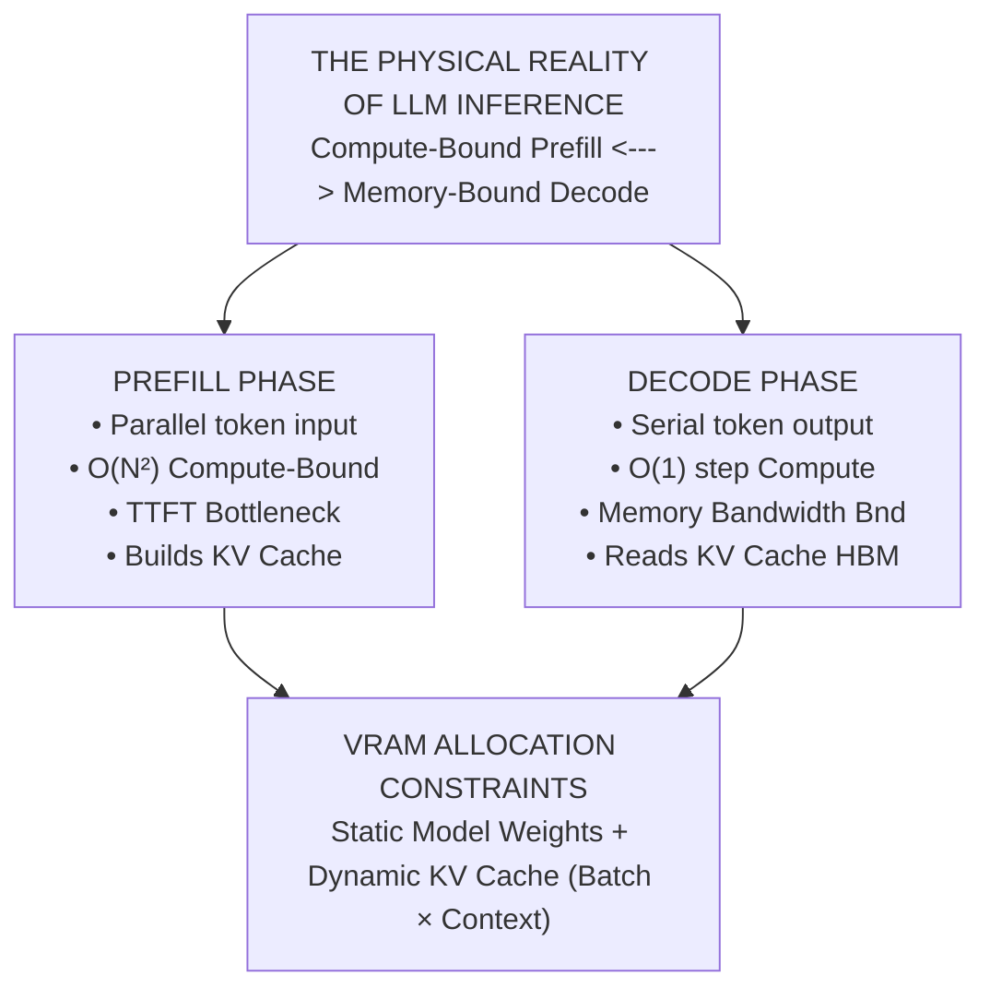

---

> **Taxonomy Note**: Refer to the [main README](../README.md#architectural-mastery-tiers) for curriculum classification symbols (🔴, 🟡, 🔵).

---

## 📑 Table of Contents

1. [Executive Summary: It's Not a Brain, It's a Calculator](#1-executive-summary-its-not-a-brain-its-a-calculator)
2. [The 2:00 AM Reality Check (Why This Matters)](#2-the-200-am-reality-check-why-this-matters)
3. [Deep-Dive Architecture & Mechanical Internals](#3-deep-dive-architecture--mechanical-internals)
4. [Inference Execution: Coffee Sips & Token Pours](#4-inference-execution-coffee-sips--token-pours)
5. [Tokens, Tokenization & BPE: Why Spaces Cost Money](#5-tokens-tokenization--bpe-why-spaces-cost-money)
6. [Sampling Mechanics & Probability Shaping](#6-sampling-mechanics--probability-shaping)
7. [Reasoning Models & Test-Time Compute Scaling](#7-reasoning-models--test-time-compute-scaling-must-have-)
8. [Comparative Tradeoff Matrices](#8-comparative-tradeoff-matrices)
9. [Production Failure Modes (War Stories)](#9-production-failure-modes-war-stories)
10. [Production Code Implementations](#10-production-code-implementations)
11. [Curated Verified Resources](#11-curated-verified-resources)
12. [Capstone Engineering Challenge](#12-capstone-engineering-challenge)

---

## 1. Executive Summary: It's Not a Brain, It's a Calculator

Stop treating LLMs like anthropomorphic minds or simple REST microservices. **An LLM is a stateless, auto-regressive tensor processor executing matrix operations over a vocabulary space.** 

When a request comes in, it consumes GPU High-Bandwidth Memory (HBM) throughput, static VRAM for weights, and dynamic VRAM for its scratchpad—the Key-Value (KV) activations.

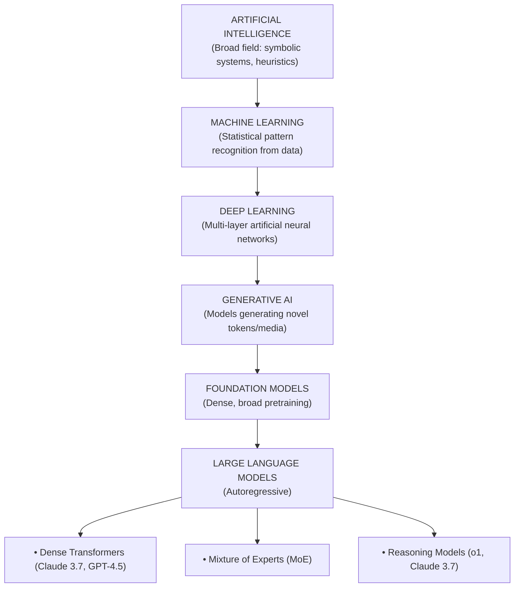

---

## 2. The 2:00 AM Reality Check (Why This Matters)

| The Dilemma | The Silicon Reality | The 2:00 AM Nightmare | Rule of Thumb Mitigation |
|---|---|---|---|
| **KV-Cache Memory Saturation** | Every token retained in active context requires storing Key ($K$) and Value ($V$) activation vectors in GPU VRAM. Think of it as the GPU's scratchpad notes. | In high-concurrency systems, VRAM is exhausted by user context, not the model weights themselves. *BAM*, instant Out-Of-Memory (OOM) crash. | Implement Grouped-Query Attention (GQA), PagedAttention virtual memory, and prompt caching breakpoints. |
| **Prefill vs. Decode Discrepancy** | Prefill processes all prompt tokens concurrently. Decode emits one token at a time (fetching weights for every single token). | Prefill establishes TTFT; Decode establishes streaming inter-token latency (TPS). Optimizing one doesn't magically optimize the other. | Separate prefill nodes from decode nodes (Disaggregated Architecture) at massive scale. |
| **Token Asymmetry Pricing** | Output token generation requires serial forward passes, locking GPU memory bandwidth for the entire duration. | Cloud providers bill output tokens at 3x to 5x the price of input tokens (e.g., \$3/1M in vs \$15/1M out). | Architect pipelines to minimize verbose reasoning in output. Enforce concise JSON. |
| **Tokenizer Fragmentation** | Text is chunked via Byte-Pair Encoding (BPE). Multi-language text, raw code indentation, and special characters explode token counts. | Non-English users pay up to 4x to 8x more per sentence. | Use tokenizer-aware chunking algorithms and normalize UTF-8 boundaries. |

---

## 3. Deep-Dive Architecture & Mechanical Internals

### 3.1. Scaled Dot-Product & Self-Attention Equations `[KNOWLEDGE-BASE]` 🔵

At the heart of the modern Transformer is the Scaled Dot-Product Multi-Head Attention mechanism. 

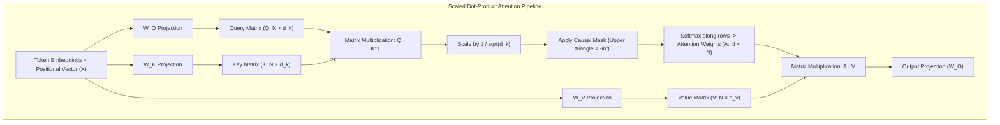

**The Math (Don't skip this, it's beautiful):**
$$\text{Attention}(Q, K, V) = \text{softmax}\left(\frac{QK^T}{\sqrt{d_k}} + M\right)V$$

Where:
- $Q \in \mathbb{R}^{N \times d_k}$: Query matrix (the search vectors of current tokens).
- $K \in \mathbb{R}^{S \times d_k}$: Key matrix (the indexable descriptors of all tokens).
- $V \in \mathbb{R}^{S \times d_v}$: Value matrix (the semantic information).
- $\frac{1}{\sqrt{d_k}}$: Keeps dot products from growing excessively large, preventing vanishing gradients in the softmax.
- $M \in \mathbb{R}^{N \times S}$: Causal attention mask (so auto-regressive generation can't cheat by looking at future tokens).

---

### 3.2. Attention Architectures: MHA vs. MQA vs. GQA `[MUST-HAVE]` 🔴

When context lengths blew past 128,000 tokens, standard Multi-Head Attention (MHA) became a VRAM hog. The solution? Share the scratchpad.

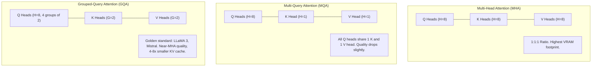

$$\text{Memory Reduction Factor} = \frac{H_Q}{H_{KV}}$$

---

### 3.3. FlashAttention: IO-Aware Tiling `[GOOD-TO-HAVE]` 🟡

Standard attention materializes a massive $N \times N$ matrix in GPU HBM. That memory thrashing is a performance killer. FlashAttention divides the work into SRAM-sized chunks.

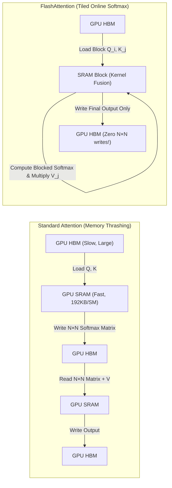

---

### 3.4. Rotary Position Embeddings (RoPE) `[GOOD-TO-HAVE]` 🟡

How does the model know token order? RoPE represents token position as a rotation of the Query and Key vectors in the complex 2D plane. 

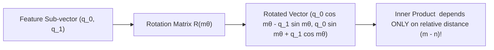

---

### 3.5. Mixture-of-Experts (MoE) `[GOOD-TO-HAVE]` 🟡

Instead of firing every neuron for every word, MoE routes tokens to specialized sub-networks.

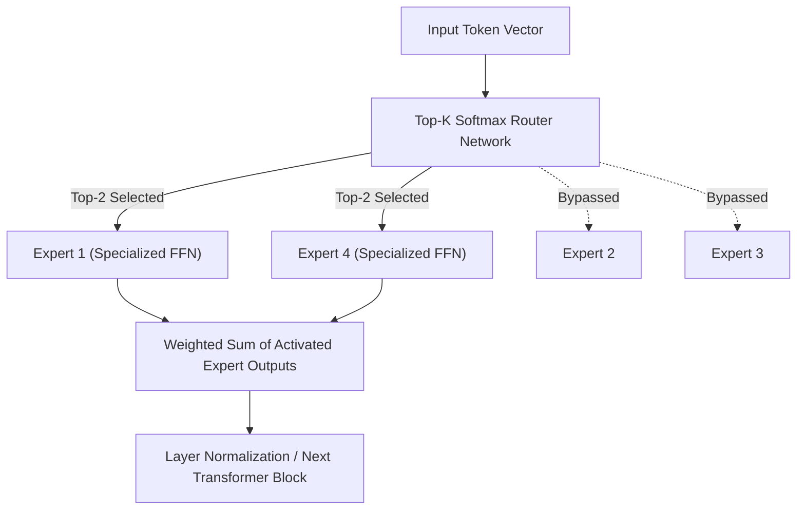

---

## 4. Inference Execution: Coffee Sips & Token Pours

### 4.1. TTFT vs. TPS `[MUST-HAVE]` 🔴

Think of inference like ordering a pour-over coffee. 
- **Time-To-First-Token (TTFT)** is the agonizing wait for the barista to grind the beans, bloom the grounds, and finally let that first drop hit your cup. This is the **Prefill Phase**—the GPU is doing massive parallel math to read your prompt and build the KV-cache scratchpad.
- **Tokens-Per-Second (TPS)** is the steady pour that fills the rest of the cup. This is the **Decode Phase**—it's fast, sequential, but bottlenecked by how quickly the GPU can shuttle weights from memory for *each* single drop.

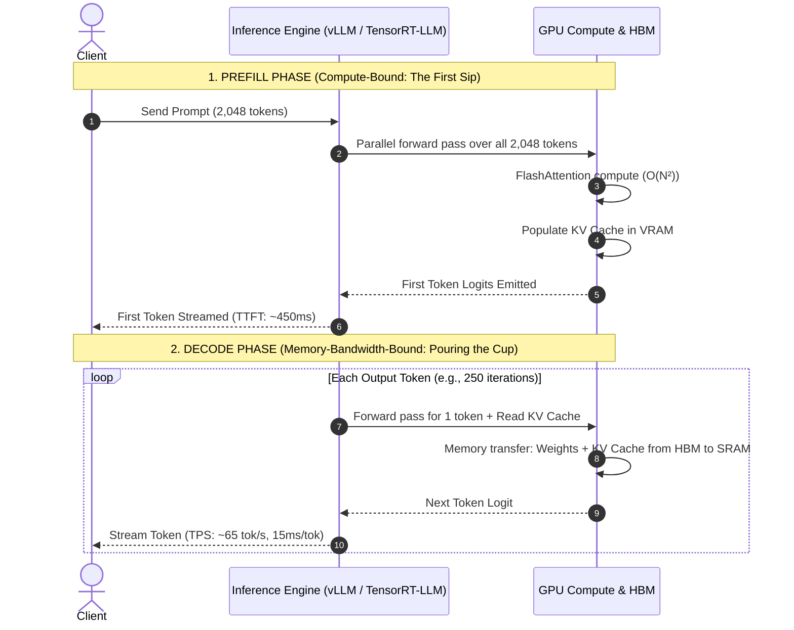

$$\text{Total Request Latency} = \text{TTFT} + \left(N_{\text{out}} \times \frac{1}{\text{TPS}}\right)$$

---

### 4.2. PagedAttention `[MUST-HAVE]` 🔴

Before PagedAttention, the GPU allocated a massive, contiguous block of VRAM for the absolute worst-case scenario. It was like renting an entire hotel floor because you *might* need it, wasting 70%+ of the space. PagedAttention brings OS-level virtual memory paging to LLMs, cutting waste to < 4%.

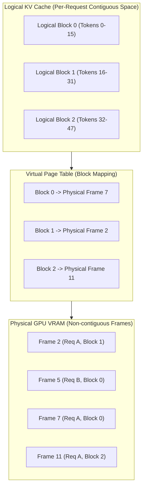

---

### 4.3. Speculative Decoding `[GOOD-TO-HAVE]` 🟡

Speculative decoding couples a tiny, ultra-fast "draft model" (the eager junior dev) to guess the next few words, and a massive "target model" (the senior architect) to verify them all at once.

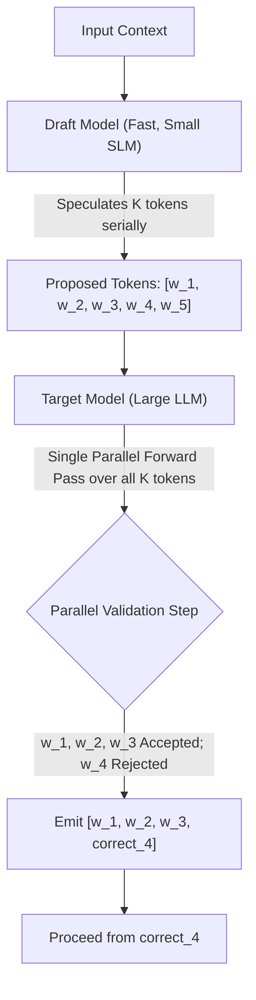

---

### 4.4. Precision, Quantization & VRAM Formulas `[MUST-HAVE]` 🔴

#### The Master VRAM Estimation Formula:
$$\text{Total VRAM (GB)} = \left(\frac{P \times Q}{10^9}\right) \times 1.2 + \text{KV Cache (GB)}$$

Where:
- $P$: Model parameter count (e.g., $70 \times 10^9$ for 70B).
- $Q$: Bytes per parameter ($2$ for FP16/BF16, $1$ for FP8, $0.5$ for INT4).
- $1.2$: A $20\%$ overhead multiplier.

#### KV-Cache Formula for GQA Models:
$$\text{KV Cache (Bytes)} = 2 \times 2 \times L \times H_{KV} \times d_k \times B \times S$$

---

## 5. Tokens, Tokenization & BPE: Why Spaces Cost Money

### 5.1. BPE Mechanics & Vocabularies `[MUST-HAVE]` 🔴

Models don't read text; they read IDs. Tokenizers are just statistical string compressors (Byte-Pair Encoding). They greedily merge whatever bytes they saw most during training.

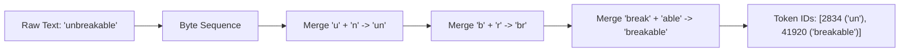

### 5.2. Non-English & Code Token Penalties

Because the training web data was mostly English, the tokenizer learned " Enterprise" as one token. But a string of spaces in C# code, or a word in Hindi? It shreds them into raw bytes. **This is why spaces and numbers cost extra.**

| Input Category | Sample Snippet | Words | Tokens | Production Impact |
|---|---|---|---|---|
| **English** | `"Enterprise Architecture"` | 2 | 3 | **1.5 tok/word** |
| **Hindi** | `"एंटरप्राइज आर्किटेक्चर"` | 2 | 11 | **5.5 tok/word** (Costs 366% more!) |
| **C# Code** | `public async Task<IActionResult>` | 4 | 14 | **3.5 tok/word** (Whitespace shredding) |

---

## 6. Sampling Mechanics & Probability Shaping

### 6.1. Logits, Softmax & Temperature `[MUST-HAVE]` 🔴

$$P(w_i) = \frac{\exp(z_i / T)}{\sum_{j \in V} \exp(z_j / T)}$$

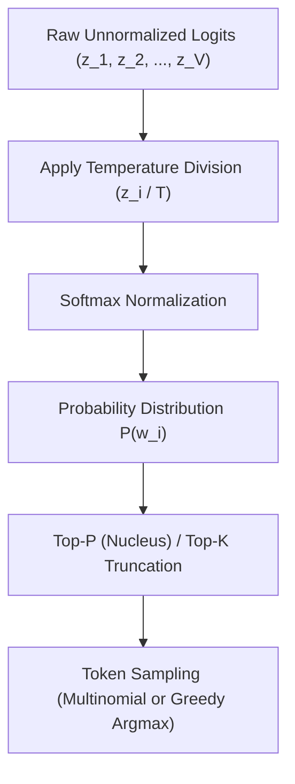

> **War Story Rule**: Use $T = 0$ for code, JSON, and math. Use $T = 0.7$ for normal chat. Never let $T \ge 1.0$ touch production data unless you want pure chaos.

---

## 7. Reasoning Models & Test-Time Compute Scaling [MUST-HAVE] 🔴

### 7.2. Thinking Token Dynamics & Architectural Tradeoffs `[MUST-HAVE]` 🔴

- **Visible vs. Hidden Tokens:** Reasoning models emit thousands of "thinking tokens" into an internal scratchpad before producing user-visible text.
- **Billing Mechanics:** Providers bill thinking tokens at the standard **Output Token Rate**, even when thinking tokens are hidden from the final user response.
- **Latency Impact:** TTFT increases from < 1 second to 5 - 45 seconds as the model conducts multi-step tree-of-thought exploration.

---

### Reasoning Models & Test-Time Compute Scaling [MUST-HAVE] 🔴

The AI industry spent six years optimizing pre-training: feeding tens of trillions of tokens into increasingly colossal clusters of GPUs to build dense foundation models. But by late 2024, pre-training began hitting the physical limits of human web text and power availability. 

The frontier shifted overnight from **pre-training compute** to **test-time compute** (also known as inference-time compute scaling). Instead of just predicting the very next word based on frozen weights, models now "think," search, backtrack, and verify hypotheses before emitting a single customer-visible token.

---

#### 1. Explain Like I'm 10 (ELI10): The Math Student's Scratchpad

> **"Reasoning models show their work like a math student. Takes more paper but gets harder problems right."**

Imagine you are in 4th grade and your teacher asks: *"What is 387 × 492?"*

* **The Standard LLM Approach (Anxious Impulsive Student):** The teacher gives you zero paper and demands you shout the answer in 0.1 seconds. Your brain does a quick gut check, recognizes it ends in a 4, and blurts out `"189,424"`. It sounds plausible, but it's completely wrong. Why? Because a standard transformer has a fixed compute budget per token—a fixed number of matrix multiplications. It cannot pause to loop or calculate multi-step math; it must emit a token immediately.
* **The Reasoning Model Approach (Diligent Math Student):** The teacher gives you a pad of scratch paper. You don't say a word out loud for 30 seconds. On your scratchpad, you write:
  1. `387 × 400 = 154,800`
  2. `387 × 90 = 34,830`
  3. `387 × 2 = 774`
  4. `Sum: 154,800 + 34,830 = 189,630`
  5. `189,630 + 774 = 190,404`
  6. *Self-check:* `387 ≈ 400, 492 ≈ 500, 400 × 500 = 200,000. 190,404 is reasonable. Calculation verified.*

Finally, you look up and say one single word: `"190,404"`. 

You used 120 words of scratchpad reasoning to produce a 1-word final answer. It took more paper (tokens) and more time (latency), but you got an impossibly hard problem 100% right.

---

#### 2. Test-Time Compute vs. Pre-Training Compute: The Second Scaling Law

> **The Analogy: "Studying harder before exam vs scratch paper during exam."**

For the first era of Deep Learning (2017–2024), scaling was governed by Kaplan's and Chinchilla's Laws: **pre-training compute**. To make an AI smarter, you had to make it study harder before the exam:
* You scraped 15 trillion tokens of the public internet.
* You rented 50,000 NVIDIA H100 GPUs for four months.
* You burned tens of millions of dollars compressing human knowledge into static neural weights.

```mermaid
flowchart TD
    subgraph PreTrainEra["Pre-Training Compute: Studying Harder Before the Exam"]
        Data["Trillions of Web Tokens"] --> Cluster["50,000 GPU Cluster ($50M+)"]
        Cluster --> FrozenWeights["Static Frozen Model Weights (W)"]
        FrozenWeights --> Exam["Exam Time: Single Forward Pass\nO(1) compute per emitted token"]
        Exam --> Guess["Immediate Guess (High Hallucination on Novel Logic)"]
    end

    subgraph TestTimeEra["Test-Time Compute: Scratch Paper During the Exam"]
        Prompt["Complex Prompt / Exam Problem"] --> ModelBase["Base / Reasoning Model"]
        ModelBase --> SearchLoop["Test-Time Search & Verification Loop\n• Monte Carlo Tree Search / Beam Search\n• Process Reward Models (PRMs)\n• Hypothesis Generation & Backtracking"]
        SearchLoop --> SelfCheck["Internal Verification & Critique"]
        SelfCheck --> VerifiedAnswer["Flawless Synthesized Solution (Near-Zero Hallucination)"]
    end
```

##### The Shift to Test-Time Compute Scaling
When you give an LLM test-time compute, you decouple reasoning capability from model size:
1. **Dynamic Search Spaces:** Instead of auto-regressively sampling along the path of highest initial probability, the model explores a tree of thoughts.
2. **Process-Supervised Reward Models (PRMs):** During the thinking loop, auxiliary scoring networks grade each intermediate reasoning step (step-level feedback) rather than just the final answer (outcome-level feedback).
3. **Backtracking & Error Recovery:** If a branch leads to an invariant violation or compile error, the model recognizes it mid-stream, pivots, and backtracks: *"Wait, that mutex lock order creates an AB-BA deadlock. Let me rethink the synchronization strategy."*
4. **The Economic Tradeoff:** You can achieve frontier mathematical and coding performance from a smaller 14B or 32B model given 4,000 thinking tokens, outperforming a 400B dense model forced to answer instantaneously.

---

#### 3. Frontier Reasoning Model Landscape

The landscape has stratified into dedicated pure-reasoning engines and hybrid dual-mode architectures:

| Model | Provider | Core Mechanism & Architecture | Thinking Budget Control | Max Context / Output Window | Pricing Profile (per 1M Tokens) | Benchmark / Superpower Specialty | Best Enterprise Production Use Case |
|---|---|---|---|---|---|---|---|
| **OpenAI o3** | OpenAI | Large-scale Reinforcement Learning (RL) over hidden CoT; deep tree search | `reasoning_effort: low / medium / high` | 200k Context / 100k Max Output | In: ~$10.00 / Out: ~$40.00 *(Thinking billed as output)* | 2724 Codeforces rating; gold medal IMO 2024 level math | Mission-critical algorithmic verification, complex multi-file code refactoring |
| **OpenAI o4-mini** | OpenAI | Distilled compact RL reasoning architecture optimized for fast inference | `reasoning_effort: low / medium / high` | 200k Context / 100k Max Output | In: ~$1.10 / Out: ~$4.40 *(Thinking billed as output)* | High-speed STEM reasoning, competitive coding at 5x lower latency | Real-time automated code triage, agentic planning loops with sub-second step needs |
| **Claude 3.7 Thinking** | Anthropic | Hybrid architecture: seamlessly toggles between fast instruction and extended thinking | Granular token budget (`budget_tokens: 1024..64000`) or disabled (`0`) | 200k Context / 64k Output | In: $3.00 / Out: $15.00 *(Thinking billed at $15.00/1M)* | Superior full-stack code synthesis, nuanced instruction following under complex constraints | Production full-stack feature engineering, multi-repo codebase updates, complex regulatory compliance |
| **Claude 4 Opus Thinking** | Anthropic | Frontier deep cognitive reasoning engine; maximum tree search depth and self-critique | Granular token budget control up to 128k output | 200k Context / 128k Output | In: ~$15.00 / Out: ~$75.00 *(Thinking billed at $75.00/1M)* | Deep autonomous research, theorem proving, exhaustive legal/financial discovery | High-stakes architectural audits, automated security vulnerability discovery, executive strategic analysis |
| **Gemini 2.5 Pro Thinking** | Google | Native multimodal test-time compute integrated with real-time web search and Python sandbox | Configurable thinking budget (`thinkingConfig: { thinkingBudget: N }`) | 1M - 2M Context / 64k Output | In: ~$2.50 / Out: ~$10.00 *(Thinking billed at $10.00/1M)* | Long-context multimodal reasoning (hours of video, million-line repositories) | Multi-document forensic audit, repository-scale migration analysis, multimodal hardware schematics |
| **DeepSeek-R1** | DeepSeek | 671B MoE (37B active parameters); pure RL (R1-Zero) refined with cold-start data + multi-stage RL | Open-weights / `<think>` tag token boundaries | 64k Context / 8k - 32k Output | In: $0.55 / Out: $2.19 *(Cache Hit: $0.14/1M)* | Open-weights AIME 79.8%, MATH 500 97.3%; competitive with o1/o3 | Self-hosted air-gapped enterprise reasoning, low-cost bulk batch code audit, on-prem finance |

---

#### 4. When to Use Reasoning vs. Standard Models: Architectural Decision Framework

Senior architects must treat reasoning models not as an automatic upgrade, but as a specialized high-latency, high-cost computing tier.

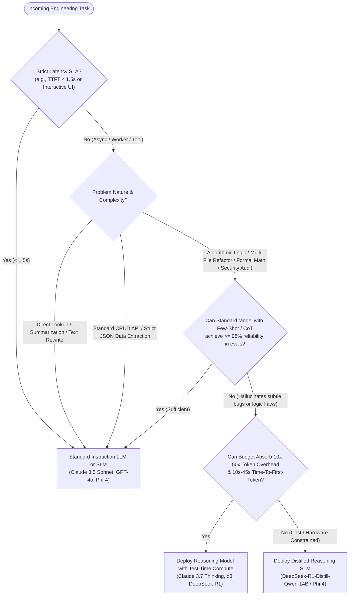

##### The Golden Rule of Reasoning Selection:
> **"If a Senior Software Engineer would need a whiteboard and 15 minutes of quiet thinking before typing code, dispatch a Reasoning Model. If a Junior Engineer could write the answer off the top of their head in 30 seconds, use a Standard Model or an SLM."**

---

#### 5. Thinking Token Economics: The 50:1 Asymmetry & Budget Governance

The defining economic characteristic of reasoning models is the **output token asymmetry**. 

##### The 5,000:100 Reality
When a user asks:
> *"Does this concurrency loop contain a potential race condition under the .NET weak memory model? Answer strictly with YES or NO and a one-sentence proof."*

* **Visible Output Emitted:** 28 tokens (`"YES. The memory barrier is omitted prior to reading the volatile pointer, permitting CPU instruction reordering on ARM64 architectures."`).
* **Hidden Thinking Tokens Emitted:** **5,240 tokens!**
* **The Economic Consequence:** In cloud API pricing, **all thinking tokens are billed as output tokens**. Since output tokens typically cost $3\times$ to $5\times$ more than input tokens ($15/1M vs $3/1M), that simple boolean check cost:
  $$\text{Cost} = \left(\frac{150 \text{ input}}{10^6} \times \$3.00\right) + \left(\frac{5,240 \text{ thinking} + 28 \text{ visible}}{10^6} \times \$15.00\right) = \$0.00045 + \$0.07902 = \mathbf{\$0.0795}$$
  A single YES/NO query cost nearly **8 cents** because the model explored hundreds of memory-ordering execution branches in its internal scratchpad.

##### Mermaid Thinking Token Lifecycle:
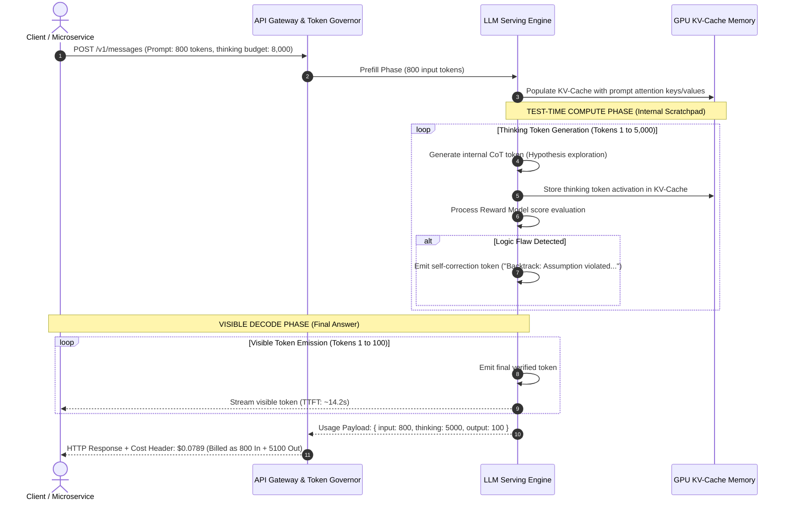

##### Configurable Thinking Budgets (0 to 64K)
Modern architectures mandate explicit thinking budgets:
* **`budget_tokens: 0` (or `disabled`):** Instantly forces the model to bypass the scratchpad and behave as an ultra-low-latency standard instruction LLM (supported natively in Claude 3.7 Sonnet).
* **`budget_tokens: 1024..4096` (Light Reasoning):** Ideal for verifying regex expressions, detecting subtle SQL injection vectors, or parsing ambiguous date formats.
* **`budget_tokens: 16000..64000` (Deep Architectural Reasoning):** Reserved for multi-file AST migrations, protocol reverse-engineering, security threat modeling, and formal logic proofs.

##### Production Implementation: Python Budget Governor
```python
import os
from anthropic import Anthropic
from typing import Dict, Any

def execute_reasoned_task(
    system_prompt: str, 
    user_prompt: str, 
    thinking_budget: int = 4096,
    max_output: int = 1024
) -> Dict[str, Any]:
    """
    Executes a task against Claude 3.7 Sonnet with an enforced thinking budget
    and calculates exact financial cost including the 50:1 asymmetry.
    """
    client = Anthropic(api_key=os.environ["ANTHROPIC_API_KEY"])
    
    # Configure hybrid thinking: 0 disables thinking; >= 1024 enables extended CoT
    thinking_config = (
        {"type": "enabled", "budget_tokens": thinking_budget}
        if thinking_budget >= 1024
        else {"type": "disabled"}
    )

    response = client.messages.create(
        model="claude-3-7-sonnet-20250219",
        max_tokens=max_output + (thinking_budget if thinking_budget >= 1024 else 0),
        thinking=thinking_config,
        system=system_prompt,
        messages=[{"role": "user", "content": user_prompt}]
    )

    # Extract token telemetry
    input_tokens = response.usage.input_tokens
    output_tokens = response.usage.output_tokens
    
    # Claude 3.7 reports thinking tokens inside output_tokens or subfield
    thinking_tokens = getattr(response.usage, "thinking_tokens", 0)
    visible_tokens = output_tokens - thinking_tokens

    # Claude 3.7 Pricing: $3.00 / 1M input, $15.00 / 1M output (including thinking)
    input_cost = (input_tokens / 1_000_000.0) * 3.00
    output_cost = (output_tokens / 1_000_000.0) * 15.00
    total_cost = input_cost + output_cost

    return {
        "text": "".join([block.text for block in response.content if block.type == "text"]),
        "thinking_tokens": thinking_tokens,
        "visible_tokens": visible_tokens,
        "input_tokens": input_tokens,
        "total_cost_usd": round(total_cost, 6)
    }
```

##### Production Implementation: C# / .NET 9 Reasoning Token Budget Policy
```csharp
using System.Text.Json.Serialization;

namespace EnterpriseAi.Infrastructure.Governance;

public record ReasoningUsage(
    [property: JsonPropertyName("prompt_tokens")] int PromptTokens,
    [property: JsonPropertyName("completion_tokens")] int CompletionTokens,
    [property: JsonPropertyName("thinking_tokens")] int ThinkingTokens
);

public class ReasoningGovernor
{
    private const decimal InputCostPerMillion = 3.00m;
    private const decimal OutputCostPerMillion = 15.00m;
    private const decimal MaxPermissibleCostPerRequest = 0.50m; // Circuit breaker at 50 cents

    public static (bool IsApproved, decimal TotalCostUsd, string Reason) ValidateAndAudit(ReasoningUsage usage)
    {
        // Thinking tokens are billed at the premium output rate alongside visible completion tokens
        int totalBillableOutput = usage.CompletionTokens; // In Anthropic/OpenAI, completion includes thinking
        
        decimal inputCost = (usage.PromptTokens / 1_000_000.0m) * InputCostPerMillion;
        decimal outputCost = (totalBillableOutput / 1_000_000.0m) * OutputCostPerMillion;
        decimal totalCost = inputCost + outputCost;

        if (totalCost > MaxPermissibleCostPerRequest)
        {
            return (false, totalCost, $"Cost threshold breached: ${totalCost:F4} > ${MaxPermissibleCostPerRequest:F4}");
        }

        // Asymmetry check: Alert if thinking-to-visible ratio exceeds 50:1
        int visibleTokens = Math.Max(1, usage.CompletionTokens - usage.ThinkingTokens);
        double asymmetryRatio = (double)usage.ThinkingTokens / visibleTokens;
        
        if (asymmetryRatio > 50.0)
        {
            // Log telemetry warning: high thinking token burn for low visible output
            Console.WriteLine($"[ALERT] Extreme thinking asymmetry: {asymmetryRatio:F1}:1 ratio ({usage.ThinkingTokens} thinking vs {visibleTokens} visible)");
        }

        return (true, totalCost, "Approved");
    }
}
```

---

#### 6. Production War Story: The 2 AM Thinking Token Runaway Bankruptcy

> **"It's 2:14 AM on Sunday. Your pager buzzes with a high-severity alert from AWS Cost Explorer: the LLM API gateway just incurred $4,800 in charges over the last 90 minutes."**

##### The Incident
A tier-1 fintech company integrated Claude 3.7 Thinking into an automated batch pipeline that triaged inbound merchant chargeback disputes. The engineer configured:
```python
# THE DEADLY DEFAULT:
thinking={"type": "enabled", "budget_tokens": 32000}
```
A merchant submitted a dispute package containing a scanned 40-page PDF with contradictory handwritten ledger dates, conflicting wire confirmation numbers, and an ambiguous claim of fraud.

The reasoning model entered an intense recursive hypothesis loop:
1. *Hypothesis A:* The wire cleared on March 12th. *(Contradicts document 3, page 14).*
2. *Hypothesis B:* The wire cleared on March 14th. *(Contradicts bank statement timestamp).*
3. *Hypothesis C:* Simulating banking clearing house retry intervals...

Because the chargeback worker was managed by an aggressive background SQS queue with an automated 3-retry dead-letter policy, every worker timeout caused another instance to pick up the exact same job. Each attempt burned **32,000 thinking tokens** at $15/1M ($0.48 per attempt) while running for 55 seconds. When 100 concurrent workers processed the queue, the system burned:
$$100 \text{ workers} \times 30 \text{ attempts/hr} \times \$0.48 = \mathbf{\$1,440/\text{hour}}$$

Before the on-call engineer woke up, **$3,600 had evaporated** to parse a single $45 disputed chargeback.

##### The Root Causes
1. **Unbounded Thinking Budgets:** Allocating 32,000 thinking tokens for an automated batch triage task that only required basic classification.
2. **Missing Token Dead-Man Switches:** The SQS consumer lacked an idempotent budget check; retries re-ran full inference with identical thinking budgets.
3. **No Fallback Degradation:** The service didn't degrade to a standard model (or `budget_tokens: 2048`) upon detecting an ambiguous document.

##### The Post-Mortem Architecture:
* Hard-coded `budget_tokens: 2048` for all automated background classification workers.
* Dynamic thinking budgets: allocate 16k+ tokens **only** when an explicit human architect triggers a deep-analysis flag in the back-office console.
* Implemented a distributed Redis token-bucket governor that halts any tenant task exceeding $0.25 total inference cost.

---

#### 7. Anti-Patterns vs. Production Best Practices

| Anti-Pattern | Why It Breaks in Production | Correct Architectural Solution |
|---|---|---|
| **Unbounded Thinking in Batch Queues** | Automated workers burn maximum allocated thinking tokens (up to 64k) on ambiguous edge cases, draining cloud budgets overnight. | Set strict per-task thinking ceilings (e.g., `budget_tokens: 2048` for batch workers; reserve 16k+ for interactive senior engineering tasks). |
| **Forcing Direct JSON Output on Thinking Models** | Forcing a reasoning model to output raw JSON without scratchpad tokens breaks its ability to verify logic before serialization, resulting in syntax errors or skipped logic. | Allow the model to think freely inside hidden CoT or `<think>` tags, then extract the final validated JSON from a designated `<output>` delimiter. |
| **Reasoning Models for Real-Time Autocomplete / UI** | TTFT spikes to 10s–30s as the model explores internal reasoning paths, destroying user experience and triggering frontend HTTP timeouts. | Use fast SLMs (e.g., Phi-4, Qwen 2.5 7B) or standard models (GPT-4o-mini) for sub-second user-facing interactions. |
| **Zeroing Out Temperature on Reasoning Models** | Setting `temperature = 0.0` on certain reasoning models (like o1/o3 or DeepSeek-R1) can cripple the entropy needed for search-space exploration and induce repetitive thinking loops. | Follow provider specifications: leave temperature at the model's native default ($1.0$ for o-series, $0.6$ for DeepSeek-R1) to allow diverse internal search paths. |

---

#### 8. The Small Language Model (SLM) & Distillation Revolution [GOOD-TO-HAVE] 🟡

While frontier models like o3 and Claude 3.7 scale cloud test-time compute, an equally transformative revolution is taking place on the edge: **the distillation of reasoning capabilities into Small Language Models (SLMs)** ranging from 1.5B to 14B parameters.

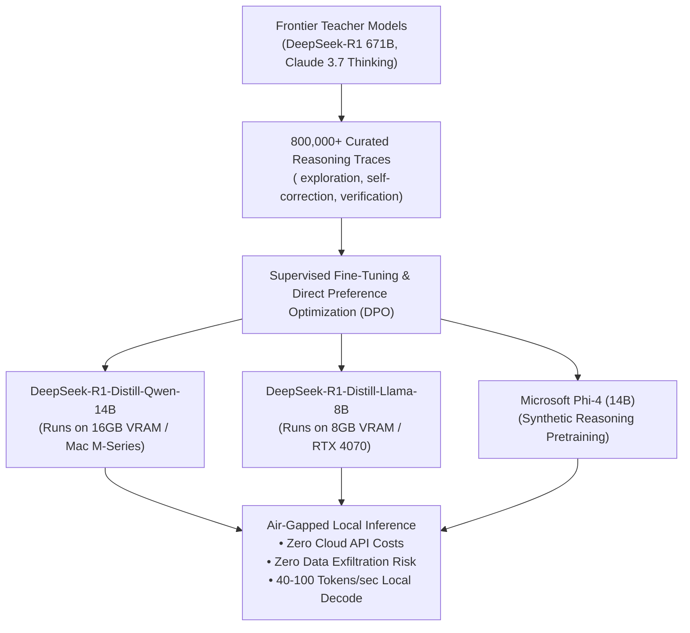

##### 1. Microsoft Phi-4 (14B)
* **Architecture:** 14-billion parameter dense transformer trained under the philosophy that "textbooks and synthetic reasoning data are all you need."
* **Superpower:** Matches or beats original GPT-4 on math (MATH benchmark > 80%) and competition coding, despite fitting on a single $1,500 consumer GPU or Apple MacBook Pro (M2/M3/M4 with 24GB Unified Memory).
* **Enterprise Fit:** Local IDE code completion, private document parsing in healthcare and banking.

##### 2. Google Gemma 2 (2B, 9B, 27B)
* **Architecture:** Built with interleaved local sliding-window attention and global attention layers, trained via logit distillation from Gemini 1.5 Ultra teachers.
* **Superpower:** The 9B variant punches far above its weight class, rivaling previous-generation 70B models while executing at 80+ tokens/second on an NVIDIA RTX 4090.
* **Enterprise Fit:** Edge on-device classification, edge gateway routing, autonomous robotics.

##### 3. Alibaba Qwen 2.5 (0.5B to 72B)
* **Architecture:** Pretrained on 18 trillion tokens with native support for 128k context windows and 29+ languages.
* **Superpower:** **Qwen 2.5 Coder 32B** achieved parity with Claude 3.5 Sonnet on software engineering benchmarks (SWE-Bench Lite), becoming the premier open-weights foundation for local agentic coding.
* **Enterprise Fit:** Enterprise-hosted coding copilots, automated pull-request reviewers, multilingual query routers.

##### 4. DeepSeek-R1 Distillations (The Open Reasoning Miracle)
DeepSeek demonstrated that reasoning is not an exclusive property of massive models. By using DeepSeek-R1 (671B) to generate 800,000 high-quality reasoning traces, they distilled reasoning behaviors directly into compact open architectures:
* **DeepSeek-R1-Distill-Qwen-1.5B / 7B / 14B / 32B**
* **DeepSeek-R1-Distill-Llama-8B / 70B**

The **R1-Distill-Qwen-14B** model scores **73.7% on AIME 2024** and **93.9% on MATH 500**—surpassing the original dense GPT-4o while running comfortably in 4-bit quantization (AWQ/GGUF) on a single 16GB VRAM GPU!

##### SLM Hardware Footprint & Deployment Matrix:

| Model | Parameters | Quantization | VRAM Required | Max Throughput (vLLM / Ollama) | Math & Code Tier | Ideal Enterprise Role |
|---|---|---|---|---|---|---|
| **DeepSeek-R1-Distill-Qwen-1.5B** | 1.8B | INT4 (GGUF) | 1.8 GB | ~140 tok/s | Intermediate Algebra / Basic Logic | Edge mobile devices, embedded IoT, local query intent routing |
| **DeepSeek-R1-Distill-Llama-8B** | 8.0B | INT4 (AWQ) | 6.2 GB | ~85 tok/s | Advanced Math (AIME 50%) / Solid Python | Developer laptop copilot, private document auditing |
| **DeepSeek-R1-Distill-Qwen-14B** | 14.7B | INT4 (AWQ) | 10.5 GB | ~65 tok/s | Elite Math (AIME 73.7%) / Senior Coding | On-prem air-gapped reasoning, private financial analysis |
| **Microsoft Phi-4** | 14.7B | FP8 / INT4 | 9.8 GB | ~70 tok/s | Elite STEM / Academic Logic | Healthcare compliance checks, internal code refactoring |
| **Qwen 2.5 Coder 32B** | 32.5B | INT4 (AWQ) | 20.5 GB | ~42 tok/s | Frontier Coding (SWE-Bench 40%+) | Dedicated departmental coding copilot on a single RTX 4090 |
| **Gemma 2 27B** | 27.2B | INT4 (GGUF) | 17.0 GB | ~48 tok/s | General Knowledge / Multilingual | Air-gapped enterprise search synthesis, internal policy assistant |

---

## 8. Comparative Tradeoff Matrices

| Dimension | Small Language Model (SLM) | Standard Frontier Model | Reasoning Frontier Model |
|---|---|---|---|
| **Examples** | LLaMA 3.2 3B, Mistral 7B | Claude 3.7 Sonnet, GPT-4.5 | OpenAI o1, Claude 3.7 (Thinking) |
| **TTFT** | 50ms - 150ms | 300ms - 900ms | 3,000ms - 30,000ms |
| **Cost (USD / 1M)** | In: \$0.05 / Out: \$0.20 | In: \$2.50 / Out: \$10.00 | In: \$15.00 / Out: \$60.00 |
| **Best For** | Guardrails, routing | RAG synthesis, general chat | Complex refactoring, logic |

---

## 9. Production Failure Modes (War Stories)

### The Thinking Token Bankruptcy
You deploy a reasoning model inside an autonomous loop. It gets stuck. It burns 32,000 hidden thinking tokens at \$60/1M trying to figure out why it's stuck. **Fix:** Hard cap `budget_tokens: 2048`.

### Silent Context Truncation
You set `max_tokens` too low. The LLM gets cut off midway through generating JSON. Downstream deserializers throw `JSONDecodeError` and crash your DLQs. **Fix:** Check `finish_reason` religiously.

---

## 10. Production Code Implementations

Complete runnable implementations are in [`examples/`](./examples/).

### Python: Exact Tokenizer Profiler
> **Implementation**: [`examples/token_profiler.py`](./examples/token_profiler.py)

```python
def profile_payload(self, system_prompt: str, user_prompt: str, max_expected_output: int, reasoning_budget_tokens: int = 0) -> Dict[str, Any]:
    system_tokens = self._count_tokens(system_prompt)
    user_tokens = self._count_tokens(user_prompt)
    total_input = system_tokens + user_tokens
    
    # Reasoning models bill reasoning tokens as output tokens
    total_output = max_expected_output + (reasoning_budget_tokens if self.config["is_reasoning"] else 0)
    input_cost = (total_input / 1_000_000.0) * self.config["input_per_m"]
    max_output_cost = (total_output / 1_000_000.0) * self.config["output_per_m"]
    ...
```

### C# / .NET 9: Token Budgeting Service
> **Implementation**: [`examples/TokenGovernorService.cs`](./examples/TokenGovernorService.cs)

```csharp
// Hardware KV Cache estimation
double totalSeqLen = totalInput + request.ExpectedOutputTokens;
double kvCacheBytes = 2.0 * 2.0 * 80 * 8 * 128 * request.ConcurrentBatchSize * totalSeqLen;
double kvCacheMb = kvCacheBytes / (1024 * 1024);

if (totalInput > HARD_MAX_INPUT_TOKENS || cost > MAX_DOLLAR_LIMIT_PER_REQUEST)
    return new BudgetReport(false, totalInput, cost, kvCacheMb, "Quota exceeded");
```

## 11. Curated Verified Resources
- **[Andrej Karpathy — Intro to Large Language Models (YouTube)](https://www.youtube.com/watch?v=zjkBMFhNj_g)**
- **[Jay Alammar — The Illustrated Transformer](https://jalammar.github.io/illustrated-transformer/)**
- **[vLLM Official Documentation](https://docs.vllm.ai/)**

---

## 12. Capstone Engineering Challenge
> Build a production token economics analyzer. See the [full capstone specification](./labs/capstone-token-economics-analyzer.md).
