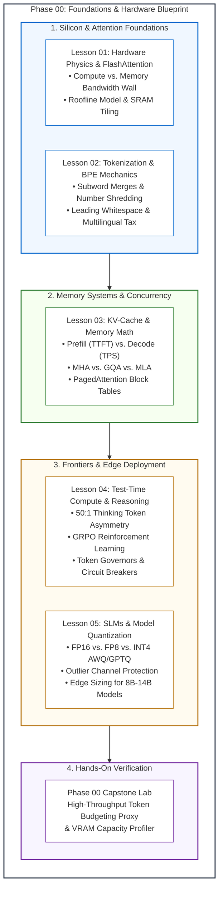

# Phase 00: Foundations, LLM Mechanics & Token Economics

> **The 2:00 AM Wake-Up Call**: It is 2:00 AM on a Tuesday. Your new LLM microservice just hit production. The GPUs are barely breaking a sweat doing actual math, yet your NVIDIA H100 cluster just threw an Out-Of-Memory (OOM) crash. Why? Because you forgot about the KV-cache. Welcome to the physical reality of Large Language Models, where the primary bottleneck is not compute—it is **memory bandwidth**.

---

### What is LLM Hardware Physics? (Explain Like I'm 10)

Imagine a world-class master chef working in a high-tech kitchen:

* 🧒 **The Analogy (The Chef and The Narrow Pantry Doorway)**:
  * **The Chef (GPU Compute Cores)**: Can chop, dice, and season ingredients at superhuman speed—finishing any cooking step in a fraction of a millisecond.
  * **The Cutting Board (GPU On-Chip SRAM)**: Right in front of the chef. Items on the cutting board can be touched instantly, but the board is tiny—it only holds a handful of ingredients.
  * **The Deep Freeze Pantry (GPU HBM Memory)**: Down a long hallway through a narrow doorway. It holds 80 to 140 gigabytes of recipes and ingredients (model weights and memory cache).
  * **The Problem**: To emit just **one single word** (token), the chef must review every single page of the giant recipe book (all 70 billion parameters). The chef's assistant has to run down the hallway, wheel a 140-kilogram cart of books through the narrow doorway, let the chef glance at it for a microsecond, and then haul it back.
  * The chef isn't exhausted from chopping; the chef is bored out of their mind **waiting for the cart to arrive**!

* ⚙️ **The Engineering Reality**:
  * Large Language Model inference is split into two distinct regimes:
    1. **The Prefill Phase (Reading the Prompt)**: All prompt tokens are processed together in parallel. High arithmetic intensity. The GPU compute cores are fully saturated (**Compute-Bound**).
    2. **The Decode Phase (Generating Output Tokens)**: Tokens are generated strictly one at a time. The GPU must stream all 140 GB of model weights across the memory bus just to emit 1 token. Arithmetic intensity drops to near zero. The GPU spends 99% of its clock cycles waiting for memory (**Memory-Bandwidth-Bound**).
  * In addition, every past token requires storing a scratchpad activation vector (the **Key-Value Cache**). While model weights are fixed, the KV-cache balloons with every active user and every generated word.

* ⚠️ **What Happens If You Ignore This?**
  * You size your GPU servers based solely on model file size (e.g., "A 70B model in FP16 takes 140 GB, so 2x 80 GB GPUs is plenty!").
  * In production, 20 users submit 8,000-token documents simultaneously. The dynamic KV-cache suddenly consumes 50+ GB of extra memory. The cluster crashes with a catastrophic `CUDA Out of Memory` error while GPU compute utilization is idling at 18%.

---

## 🏛️ Systems Overview & Architectural Mission

An LLM is not a thinking brain or a standard CPU microservice. In plain terms, it is a text-completion engine: you give it a block of text, and it predicts the most likely next pieces of words, one piece at a time. Technically, it is a **stateless, autoregressive tensor engine executing matrix operations over a discrete subword vocabulary space**.

Every production request consumes GPU High-Bandwidth Memory (HBM) throughput, static VRAM for model weights, and dynamic VRAM for its Key-Value (KV) activation scratchpad. Operating AI systems at scale requires senior engineers to master the physical constraints of GPU memory hierarchies, subword tokenization economics, attention architectures, and test-time reasoning tokens.

### Walkthrough of the Phase 00 Journey:
1. **Hardware Realities (Lesson 01)**: Uncover why inference decode is memory-bandwidth bound and how FlashAttention eliminates intermediate memory thrashing by computing attention inside on-chip SRAM tiles.
2. **Tokenization (Lesson 02)**: Demystify Byte-Pair Encoding (BPE), subword token fragmentation, leading whitespace sensitivity, and the 5x non-English token penalty.
3. **KV-Cache Physics (Lesson 03)**: Derive the exact memory math of dynamic KV-caches, contrast MHA vs. GQA vs. MLA, and understand how PagedAttention implements virtual memory for LLMs.
4. **Reasoning Models (Lesson 04)**: Master test-time compute scaling, manage the 50:1 thinking token asymmetry, and implement automated token governors to prevent runaway API bills.
5. **SLMs & Quantization (Lesson 05)**: Compress models using AWQ and GPTQ to deploy high-throughput 8B–14B models on commodity hardware with near-zero accuracy loss.
6. **Capstone Challenge**: Build a production token budgeting proxy and VRAM capacity profiler in Python or C#.

---

### 📊 Naive Serving (2023) vs. Modern Production Inference (2026)

| Architectural Dimension | Naive Serving (2023) | Modern Production Inference (2026) |
| :--- | :--- | :--- |
| **Attention Kernel** | Standard PyTorch Attention (materializes O(N^2) matrices in HBM) | **FlashAttention-2 / 3** (IO-aware SRAM tiling with online softmax) |
| **Attention Architecture** | Multi-Head Attention (MHA: 1:1 Query to KV ratio) | **Grouped-Query Attention (GQA)** or **Multi-Head Latent Attention (MLA)** |
| **Memory Allocation** | Contiguous worst-case context allocation (60-80% VRAM waste) | **PagedAttention** (OS-style non-contiguous virtual memory block tables) |
| **Model Precision** | Static FP16 / BF16 (2 bytes per parameter) | **FP8 native** or **INT4 AWQ** (outlier-preserving channel scaling) |
| **Reasoning Model Handling**| Uncapped thinking tokens; raw API pass-through | **Token Governors** with dynamic budgets, cost ceilings, and dead-man switches |
| **Capacity Planning** | Sizing servers solely by parameter weight | **Total VRAM = Weights + Peak KV Cache (Batch × Context) + Runtime Buffer** |

---

## 🎯 Target Audience & Prerequisites

- **Audience**: Senior Software Engineers, Staff Backend Engineers, and Solutions Architects (7–10+ years) transitioning into AI Engineering / Software 3.0.
- **Assumed Background**: Systems architecture, data structures, caching tiers, OS virtual memory, network protocols, and distributed systems.
- **Zero AI Prerequisites**: We do not assume prior machine learning experience. All concepts are introduced with engineering rigor from first principles.

---

## 📚 Curriculum Lesson Directory

| Lesson | Depth Tier | Target Words | Core Systems Focus |
|---|:---:|:---:|---|
| **[01. Transformer Inference & Hardware Realities](./01-transformer-and-hardware-physics.md)** | `HIGH ROI / CORE` | ~1,500 | GPU memory bandwidth wall, HBM3 vs. SRAM hierarchy, arithmetic intensity, Roofline Model, FlashAttention IO-aware tiling. |
| **[02. Tokenization & Byte-Pair Encoding (BPE)](./02-tokenization-and-bpe-mechanics.md)** | `HIGH ROI / CORE` | ~1,300 | BPE merge trees, token boundary fragmentation, whitespace sensitivity, number shredding, non-English token penalties, sampling mechanics. |
| **[03. KV-Cache Mechanics & Memory Sizing Math](./03-kv-cache-vram-and-bandwidth-physics.md)** | `IMPORTANT / NEXT` | ~2,100 | Autoregressive decoding, Prefill (TTFT) vs. Decode (TPS), KV-cache growth math, MHA vs. GQA vs. MLA, PagedAttention block tables. |
| **[04. Test-Time Compute & Reasoning Tokens](./04-test-time-compute-and-reasoning-models.md)** | `ADVANCED / SPECIALIZED` | ~1,900 | Test-time compute scaling, reasoning models (o3, Claude 3.7 Thinking, DeepSeek-R1), 50:1 thinking token asymmetry, token governors, runaway billing defense. |
| **[05. Small Language Models & Model Quantization](./05-slms-and-quantization-mechanics.md)** | `IMPORTANT / NEXT` | ~1,700 | Edge SLMs (Phi-4, Gemma 2, Qwen 2.5 Coder), precision formats (FP16, FP8, INT4), AWQ vs. GPTQ algorithms, hardware deployment matrix. |

---

### 💡 Quick Check to See if it Clicked

> **Scenario**: Your team provisions a cloud instance with an 80 GB NVIDIA H100 GPU to serve a self-hosted 14-billion parameter model in FP16 (which requires 28 GB of VRAM for weights). During a load test, 45 concurrent users submit multi-turn conversations averaging 8,000 tokens of history. Within 30 seconds, the service crashes with `CUDA out of memory`, even though the GPU compute core monitoring showed only **14% compute utilization**.
>
> **Question**: Why did the server crash despite 52 GB of free VRAM at boot and low compute utilization?
>
> **Answer**: 
> 1. The 14B model weights took 28 GB, leaving ~50 GB of usable VRAM (after CUDA runtime overhead).
> 2. With standard Multi-Head Attention, each 8,000-token user session requires approximately 1.5 GB to 2.0 GB of dynamic Key-Value (KV) cache memory.
> 3. 45 concurrent users × 1.6 GB per user = **72 GB of KV-cache alone**!
> 4. Total memory demand = 28 GB (Weights) + 72 GB (KV-Cache) = **100 GB**, exceeding the 80 GB physical capacity.
> 5. The compute cores sat at 14% because single-token decoding is memory-bandwidth bound, not compute bound. To fix this, you must enable **Grouped-Query Attention (GQA)**, **PagedAttention**, or **FP8 KV-cache quantization**.

---

## 🧪 Hands-On Labs & Reference Implementations

- **Phase Capstone Lab**: **[Capstone Engineering Challenge: High-Throughput Token Budgeting Proxy](./labs/capstone-token-economics-analyzer.md)**  
  Construct an enterprise API proxy in Python or C# that intercepts LLM calls before provider dispatch to eliminate runaway inference costs and prevent GPU OOM crashes.
- **Production Reference Code**:
  - [`examples/token_profiler.py`](./examples/token_profiler.py): Exact multi-tokenizer boundary profiler and cost estimator.
  - [`examples/adaptation_decision_matrix.py`](./examples/adaptation_decision_matrix.py): Multi-month TCO calculator comparing Prompt Caching, RAG, LoRA, and Test-Time Compute.
  - [`examples/TokenGovernorService.cs`](./examples/TokenGovernorService.cs): Enterprise C# / .NET 9 token budgeting and KV-cache estimator service.

---

## 🧭 Navigation

- **Previous Phase**: *None (Phase 00 is the curriculum entry point)*
- **Next Phase**: **[Phase 01: Prompt & Context Engineering](../01-prompt-and-context-engineering/README.md)**
