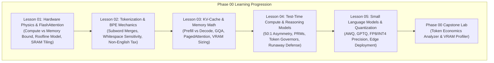

# Phase 00: Foundations, LLM Mechanics & Token Economics

> **The 2:00 AM Wake-Up Call**: It is 2:00 AM on a Tuesday. Your new LLM microservice just hit production. The GPUs are barely breaking a sweat doing actual math, yet your NVIDIA H100 cluster just threw an Out-Of-Memory (OOM) crash. Why? Because you forgot about the KV-cache. Welcome to the physical reality of Large Language Models, where the primary bottleneck is not compute—it is **memory bandwidth**.

---

## 🏛️ Systems Overview & Architectural Mission

An LLM is not an anthropomorphic brain or a standard CPU microservice; it is a **stateless, autoregressive tensor engine executing matrix operations over a discrete subword vocabulary space**.

Every production request consumes GPU High-Bandwidth Memory (HBM) throughput, static VRAM for model weights, and dynamic VRAM for its Key-Value (KV) activation scratchpad. Operating AI systems at scale requires senior engineers to master the physical constraints of GPU memory hierarchies, subword tokenization economics, attention architectures, and test-time reasoning tokens.

### Walkthrough of the Phase 00 Journey:
1. **Hardware Realities (Lesson 01)**: Uncover why inference decode is memory-bandwidth bound and how FlashAttention eliminates intermediate memory thrashing.
2. **Tokenization (Lesson 02)**: Demystify Byte-Pair Encoding (BPE), subword token fragmentation, leading whitespace sensitivity, and the multilingual token penalty.
3. **KV-Cache Physics (Lesson 03)**: Derive the exact memory math of dynamic KV-caches, contrast MHA vs. GQA, and understand how PagedAttention implements virtual memory for LLMs.
4. **Reasoning Models (Lesson 04)**: Master test-time compute scaling, manage the 50:1 thinking token asymmetry, and implement automated token governors.
5. **SLMs & Quantization (Lesson 05)**: Compress models using AWQ and GPTQ to deploy high-throughput 8B–14B models on commodity hardware.
6. **Capstone Challenge**: Build a production token budgeting proxy and VRAM capacity profiler.

---

## 🎯 Target Audience & Prerequisites

- **Audience**: Senior Software Engineers, Staff Backend Engineers, and Solutions Architects (7–10+ years) transitioning into AI Engineering / Software 3.0.
- **Assumed Background**: Systems architecture, data structures, caching tiers, OS virtual memory, network protocols, and distributed systems.
- **Zero AI Prerequisites**: We do not assume prior machine learning experience. All concepts are introduced with engineering rigor from first principles.

---

## 📚 Curriculum Lesson Directory

| Lesson | Depth Tier | Target Words | Core Systems Focus |
|---|:---:|:---:|---|
| **[01. Transformer Inference & Hardware Realities](./01-transformer-and-hardware-physics.md)** | `🟢 Core` | ~1,400 | GPU memory bandwidth wall, HBM3 vs. SRAM hierarchy, arithmetic intensity, Roofline Model, FlashAttention IO-aware tiling. |
| **[02. Tokenization & Byte-Pair Encoding (BPE)](./02-tokenization-and-bpe-mechanics.md)** | `🟢 Core` | ~1,200 | BPE merge trees, token boundary fragmentation, whitespace sensitivity, number shredding, non-English token penalties, sampling mechanics. |
| **[03. KV-Cache Mechanics & Memory Sizing Math](./03-kv-cache-vram-and-bandwidth-physics.md)** | `🟡 Engineering Depth` | ~2,000 | Autoregressive decoding, Prefill (TTFT) vs. Decode (TPS), KV-cache growth math, MHA vs. GQA vs. MQA, PagedAttention block tables. |
| **[04. Test-Time Compute & Reasoning Tokens](./04-test-time-compute-and-reasoning-models.md)** | `🔵 Advanced` | ~1,800 | Test-time compute scaling, reasoning models (o3, Claude 3.7 Thinking, DeepSeek-R1), 50:1 thinking token asymmetry, token governors, runaway billing defense. |
| **[05. Small Language Models & Model Quantization](./05-slms-and-quantization-mechanics.md)** | `🟡 Engineering Depth` | ~1,600 | Edge SLMs (Phi-4, Gemma 2, Qwen 2.5 Coder), precision formats (FP16, FP8, INT4), AWQ vs. GPTQ algorithms, hardware deployment matrix. |

---

## 🧪 Hands-On Labs & Reference Implementations

- **Phase Capstone Lab**: **[Capstone Engineering Challenge: High-Throughput Token Budgeting Proxy](./labs/capstone-token-economics-analyzer.md)**  
  Construct an enterprise API proxy in Python or C# that intercepts LLM calls before provider dispatch to eliminate runaway inference costs and prevent GPU OOM crashes.
- **Production Reference Code**:
  - [`examples/token_profiler.py`](./examples/token_profiler.py): Exact multi-tokenizer boundary profiler and cost estimator.
  - [`examples/adaptation_decision_matrix.py`](./examples/adaptation_decision_matrix.py): Multi-month TCO calculator comparing Prompt Caching, RAG, LoRA, and Test-Time Compute.
  - [`examples/TokenGovernorService.cs`](./examples/TokenGovernorService.cs): Enterprise C# / .NET 9 token budgeting and KV-cache estimator service.

---

## 🧭 Navigation

- **Previous Phase**: *None (Phase 00 is the curriculum entry point)*
- **Next Phase**: **[Phase 01: Prompt & Context Engineering](../01-prompt-and-context-engineering/README.md)**
