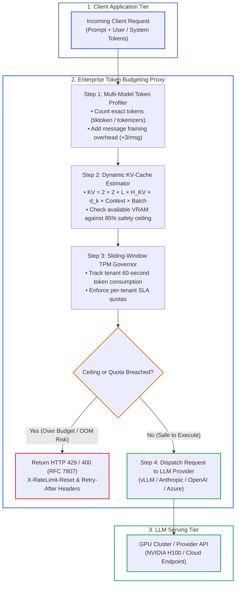

# Capstone Engineering Challenge: High-Throughput Token Budgeting Proxy

`🏆 Capstone Lab` · *Phase 00: Foundations & Token Mechanics* · *Hands-On Implementation*

---

### What is a Token Budgeting Proxy? (Explain Like I'm 10)

* 🧒 **The Analogy (The Airport Baggage Checkpoint)**:
  * Imagine a passenger plane (your GPU cluster) with strict weight limits.
  * If passengers show up with 500-pound suitcases (massive 100k prompts) and the airline lets everyone on without checking, the plane will be too heavy to fly and crash (GPU Out-of-Memory).
  * A **Token Budgeting Proxy** acts as the check-in counter and baggage scale:
    1. It weighs each passenger's luggage before they reach the gate (profiles tokens).
    2. It checks whether the cargo hold has enough space left (calculates available VRAM & KV-cache).
    3. If a passenger brings too much luggage or the flight is full, the agent stops them at the counter with a courteous ticket change (`HTTP 429 Too Many Requests`), protecting the plane from crashing.

* ⚙️ **The Engineering Reality**:
  * You build an enterprise API proxy in Python, TypeScript, or C#. It intercepts LLM requests before dispatch to cap inference costs, block out-of-memory crashes, and protect tenant SLAs.

---

## 🏛️ System Architecture



---

## 🛠️ Core Architectural Components & Implementation Steps

1. **Exact Multi-Model Token Profiler:**
   - Detect the target model family (As of 2026-09: `gpt-4.5`, `claude-3-7-sonnet`, `gemini-2.5-flash`, `llama-3.3-70b`).
   - Use the appropriate native tokenizer bindings (`tiktoken` / `tokenizers` / C# `Microsoft.ML.Tokenizers`).
   - Profile incoming `system`, `user`, and `tool_calls` payloads with per-message framing overhead (+3 to +4 tokens per message).

2. **In-Flight GPU KV-Cache & VRAM Allocation Estimator:**
   - Compute required KV-cache footprint using the formula:
     ```text
     KV Cache (Bytes) = 2 × 2 bytes × Layers × Heads_KV × Head_Dim × Batch × Sequence_Length
     ```
   - Maintain an in-memory concurrent allocation counter across running inferences.
   - If an incoming request pushes total GPU KV-cache allocation past threshold (e.g., 85% of available VRAM), enqueue or reject before invoking downstream providers.

3. **Sliding-Window Token-Per-Minute (TPM) Governor:**
   - Implement a distributed Redis-backed or atomic local sliding-window rate limiter tracking tenant consumption over a 60-second rolling window.
   - Return standard rate limiting headers: `X-RateLimit-Limit-Tokens`, `X-RateLimit-Remaining-Tokens`, `Retry-After`.

4. **Telemetry & Failure Recovery (RFC 7807):**
   - Emit OpenTelemetry spans with attributes: `llm.provider`, `llm.model`, `llm.tokens.prompt`, `llm.cost.estimated_usd`.
   - On budget or rate limit breach, return HTTP 429 / 400 with an RFC 7807 compliant problem details JSON object.

---

## 🧪 Verification & Test Scenarios

- **Baseline Test:** Send 10 concurrent valid 500-token prompts and assert `HTTP 200` with correct token counts and estimated costs.
- **TPM Ceiling Test:** Fire a burst of requests exceeding the 100,000 TPM limit; assert immediate `HTTP 429` with valid `Retry-After` header.
- **KV-Cache Overflow Protection:** Simulate a 128k context request against a constrained budget; assert early rejection before dispatching to the upstream LLM API.

---

## 🧭 Navigation
- **[← Previous Lesson: Small Language Models & Quantization](../05-slms-and-quantization-mechanics.md)**
- **[Optional Deep Dive: FlashAttention & Roofline Model](../06-roofline-and-flashattention-deep-dive.md)**
- **[Phase 00 Hub](../README.md)**
- **[Next Phase: Phase 01: Prompt & Context Engineering →](../../01-prompt-and-context-engineering/README.md)**
