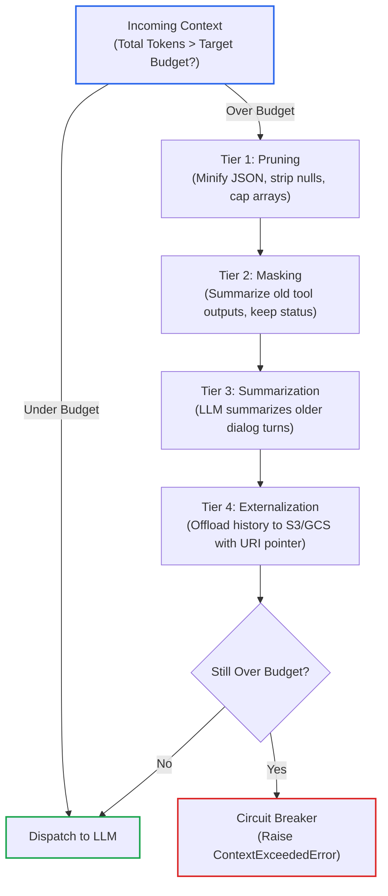

# Lesson 02: Dynamic Token Budgeting & Compaction Pipelines

> **Tier**: `🟡 Engineering Depth` | **Read time**: ~18 min | **Prerequisites**: [Lesson 00: Prompt Engineering Fundamentals](./00-prompt-engineering-fundamentals-roles-and-in-context-learning.md), [Lesson 01: Context AST Architecture](./01-context-ast-architecture.md)  
> **Core Concept**: Context windows are bounded memory registers, not infinite buffers. Dynamic token budgeting calculates exact token ceilings for system prompts, tools, and message history, while progressive compaction (pruning, masking, and summarization) keeps multi-turn conversations safely under provider limits without catastrophic context loss.  
> **New AI terms introduced**: Token budget, compaction pipeline, thinking tokens (reasoning tokens), token-level prompt compression, contextual retrieval header.  
> **AI terms assumed from earlier lessons**: [Token](../00-foundations-and-token-mechanics/01-tokenization-and-bpe-mechanics.md), [Tokenizer](../00-foundations-and-token-mechanics/01-tokenization-and-bpe-mechanics.md), [Context window](../00-foundations-and-token-mechanics/00-what-is-an-llm.md), [Time-to-First-Token (TTFT)](../00-foundations-and-token-mechanics/03-kv-cache-vram-and-bandwidth-physics.md), [KV cache](../00-foundations-and-token-mechanics/03-kv-cache-vram-and-bandwidth-physics.md), [Prefill](../00-foundations-and-token-mechanics/03-kv-cache-vram-and-bandwidth-physics.md), [In-context learning (ICL)](./00-prompt-engineering-fundamentals-roles-and-in-context-learning.md), [ChatML](./00-prompt-engineering-fundamentals-roles-and-in-context-learning.md), [Context AST](./01-context-ast-architecture.md).

---

## 🎯 What You Will Learn

By the end of this lesson, you will be able to:
- Architect deterministic **Token Budget Portfolios** (16K, 32K, 64K) to prevent context overflow crashes under multi-turn loads.
- Account for **Reasoning Model Thinking Tokens** to avoid budget exhaustion from hidden scratchpad generation.
- Implement the **4-Tier Compaction Escalation Pipeline** (Deterministic Pruning, Payload Masking, Summarization, Externalization).
- Evaluate **Token Compression Engines** (such as LLMLingua 2) against heuristic compaction in production systems.
- Cap tool schema token footprints to prevent tool definitions from starving conversational working memory.

---

## 1. The Problem: The Context Overflow Crisis

Every Large Language Model enforces a hard physical ceiling on total context tokens. Common ceilings include 8,192, 32,768, 128,000, or 2,000,000 tokens. This ceiling represents the sum of **input prompt tokens plus output generated tokens**.

In multi-turn autonomous workflows, context length grows with each turn:
- The user provides background text.
- The model invokes tools, appending verbose JSON responses to the dialogue history.
- The user asks follow-up questions, referencing earlier turns.

If context growth is unmanaged, production systems hit two failure boundaries:
1. **The Hard HTTP 400 Crash**: When `input_tokens + max_output_tokens > model_context_limit`, provider APIs reject the request immediately. The system returns an unrecoverable HTTP 400 (`context_length_exceeded`) error.
2. **The Latency and Cost Blowup**: In uncompacted multi-turn sessions, 50 turns of raw tool outputs can consume over 40,000 tokens per call. Every request pays prefill compute costs on historical data that may have zero relevance to the current question.

Purchasing a larger context window does not solve this problem. Large contexts increase Time-to-First-Token (TTFT), degrade attention precision, and inflate operational costs.

---

## 2. The Mental Model: OS Virtual Memory & Page Eviction

🧒 **The Analogy**: Treating context as an unbounded buffer is like running an operating system without a virtual memory manager.

When RAM fills up, the OS kernel does not crash. It prioritizes memory. It keeps kernel code locked in RAM. It frees inactive application memory, and writes background data to a swap file on disk.

In AI engineering, the context window is your fast, expensive RAM:

| Operating System Concept | Context Engineering Equivalent |
|---|---|
| **Physical RAM Ceiling** | Model Context Window Limit (for example, 32,768 tokens) |
| **Kernel / System Memory** | Layer 1 Static Prefix (Immutable system rules) |
| **User Process Working Set** | Layer 3 Dynamic Tail (Active turn and immediate evidence) |
| **Swap Space / Pagefile** | External Object Storage (S3 or GCS pointers for historical payloads) |
| **Page Eviction Daemon (LRU)** | The 4-Tier Compaction Escalation Pipeline |

An operating system kernel evicts inactive pages to disk under memory pressure. In the same way, a production AI runtime must enforce progressive context compaction before dispatching requests to LLMs.

**Where this analogy breaks**: An operating system swaps pages back into RAM transparently in microseconds with zero data loss. An LLM context compaction is lossy. Once dialogue turns are pruned or summarized, nuanced phrasing and raw numbers disappear unless you explicitly fetch the original payload.

---

## 3. How It Works, One Term at a Time

### Token budget portfolios and headroom

A **token budget** is a predetermined quota that limits how many tokens each segment of a prompt may consume.

* 🧒 **The Analogy**: A fixed monthly household budget. You divide your income into strict envelopes: rent, groceries, utilities, and emergency savings. If one envelope runs out, you cannot take money from rent. You trim discretionary spending.
* ⚙️ **The Engineering**: To prevent overflow, establish deterministic token portfolios. Rather than allowing components to consume tokens arbitrarily, each context segment is assigned an upper bound.

#### The Headroom Equation
When sizing input context, reserve headroom for model output generation:

```text
Max_Usable_Input_Budget = Rated_Context_Limit - Max_Output_Tokens - Safety_Headroom
```

For example, on a 32,000-token window with an expected 4,000-token generation and a 1,000-token safety margin, your maximum allowable input context is exactly `27,000` tokens.

#### Production Portfolio Allocations (16K vs. 32K Ceilings)

| Context Register | 16K Budget Ceiling | 32K Budget Ceiling | Mutability & Eviction Priority |
|---|:---:|:---:|---|
| **Layer 1: System / Developer Directives** | 1,500 tokens (9.4%) | 2,500 tokens (7.8%) | Pinned. Never evicted. |
| **Layer 1: Golden Few-Shot (ICL)** | 1,500 tokens (9.4%) | 2,500 tokens (7.8%) | Pinned. Never evicted. |
| **Layer 2: Tool Definitions (Schemas)** | 2,000 tokens (12.5%) | 4,000 tokens (12.5%) | Pruned if specific tools are inactive. |
| **Layer 2: Compacted Session Memory** | 3,000 tokens (18.8%) | 6,000 tokens (18.8%) | Subject to Tier 2 & Tier 3 compaction. |
| **Layer 3: Retrieved Evidence (RAG)** | 4,000 tokens (25.0%) | 9,000 tokens (28.1%) | Truncated via reranker score thresholds. |
| **Layer 3: Current User Query & Turn** | 1,000 tokens (6.2%) | 2,000 tokens (6.2%) | Never evicted. Active turn. |
| **Output Reserve + Safety Headroom** | 3,000 tokens (18.7%) | 6,000 tokens (18.8%) | Guaranteed execution buffer. |

* ⚠️ **What happens if you skip this?** A single oversized tool return or database query consumes the entire context window. The next call crashes with an unhandled HTTP 400 error.

---

### Reasoning model dynamics: Thinking token headroom

**Thinking tokens** (also called **reasoning tokens**) are internal scratchpad tokens generated by reasoning models before they emit visible text.

* 🧒 **The Analogy**: An architect sketching rough drafts on tracing paper before drawing the final blueprint. The client only sees the blueprint, but you still pay for the tracing paper.
* ⚙️ **The Engineering**: Prominent reasoning models include OpenAI o1 and o3-mini (as of 2025-01), Claude 3.7 Sonnet extended thinking (as of 2025-02), and DeepSeek-R1 (as of 2025-01). Thinking tokens count against both the **request context limit** and the **max completion token budget**.

#### The 50:1 Scratchpad Inflation
A user asking an algorithmic question might receive a concise 50-token answer. However, the model may generate 2,500 hidden thinking tokens to reach that conclusion:
- If your pre-flight budget checks only visible output tokens, the hidden scratchpad will trigger an immediate context overflow mid-generation.
- Thinking tokens cannot be cached across conversation turns. Providers discard them after the request completes.

#### Operational Rules for Reasoning Models:
1. **Explicit Reasoning Effort Allocation**: Configure explicit reasoning budgets (for example, `reasoning_effort: "medium"` or `max_thinking_tokens: 4096`).
2. **Expanded Output Headroom**: Double your reserved output buffer. On reasoning workloads, allocate at least 8,000 to 16,000 tokens for generation headroom.
3. **No Scratchpad Persistence**: Never attempt to serialize thinking scratchpads into dialogue history.

* ⚠️ **What happens if you skip this?** The model runs out of output tokens halfway through its internal reasoning. It emits an empty or truncated response with a `length` stop reason.

---

### The 4-Tier Compaction Escalation Pipeline

A **compaction pipeline** is an automated series of progressive reductions that compresses prompt context to fit within a target token budget.

* 🧒 **The Analogy**: Packing an overstuffed suitcase. First, you remove cardboard packaging (Tier 1). Next, you roll your clothes tightly (Tier 2). If it still does not close, you replace bulky coats with compact jackets (Tier 3). Finally, you mail heavy boots ahead by courier (Tier 4).
* ⚙️ **The Engineering**: When incoming context exceeds the portfolio threshold, production systems execute a progressive 4-tier escalation pipeline.

#### Diagram 1: The 4-Tier Compaction Escalation Pipeline



#### Step-by-Step Escalation Walkthrough:
1. **Incoming Context Check**: The runtime calculates total token footprint using a fast local tokenizer (such as `tiktoken`). If under budget, the payload dispatches immediately with zero latency overhead.
2. **Tier 1 (Deterministic Pruning)**: Executes zero-latency local code transformations. It strips `null` fields from JSON objects, minifies whitespace, and caps large arrays. This step recovers 15% to 30% of token overhead.
3. **Tier 2 (Payload Masking & Sliding Window)**: Historical tool returns from earlier turns are masked into short summaries. For example, a 4,000-token API response becomes `{"status": "SUCCESS", "records_indexed": 142}`. Only the most recent active turns retain raw payloads.
4. **Tier 3 (Recursive Summarization)**: If structural pruning is insufficient, trigger an auxiliary LLM call. A fast, low-cost model (such as Claude 3.5 Haiku as of 2024-10 or Gemini 2.0 Flash as of 2025-01) summarizes turns 0 through `N - 4` into concise bullet points.
5. **Tier 4 (Externalization & Circuit Breaker)**: The oldest turns are saved to cloud object storage (S3 or GCS) and replaced with URI pointers. If the payload still exceeds the hard ceiling, the circuit breaker raises an error before burning tokens on an invalid API call.

* ⚠️ **What happens if you skip this?** You immediately jump to slow, expensive LLM summarization on every turn, adding two seconds of latency and inflating API costs.

---

### Token-Level Prompt Compression: LLMLingua 2 vs. Heuristics

**Token-level prompt compression** uses a small machine learning classifier to identify and discard redundant tokens from a prompt while keeping semantic meaning.

* 🧒 **The Analogy**: Writing a telegram. You drop words like "the", "that", and "please" to save money, but the recipient still understands the message.
* ⚙️ **The Engineering**: **LLMLingua 2** (Pan et al., Microsoft Research, 2024) is a prominent open-source benchmark for prompt compression. It uses a small transformer classifier (`XLM-RoBERTa-Large`) trained on prompt compression datasets:
  - It calculates the information entropy of every token in the prompt.
  - It drops low-entropy, repetitive, or semantically redundant tokens while preserving syntactic flow.

#### Production Trade-Off Matrix: Heuristic Compaction vs. LLMLingua 2

| Dimension | Heuristic 4-Tier Compaction | LLMLingua 2 Classifier |
|---|---|---|
| **Latency Overhead** | Sub-millisecond (Pure Python string and JSON operations) | 20ms to 60ms (Local CPU or GPU inference step) |
| **Infrastructure Complexity** | Zero dependencies (Built directly into application code) | Requires hosting a local PyTorch or Hugging Face model |
| **Exact Entity Safety** | **100% Guaranteed** (Preserves JSON keys, IDs, and numbers) | **Risk of Drift**: May drop critical punctuation or digits |
| **Compression Ratio** | 20% to 50% through selective pruning | Up to 60% to 75% through aggressive token dropping |
| **Recommended Use Case** | Enterprise microservices, financial tools, strict schemas | Long conversational transcripts, chat summaries, search |

> [!IMPORTANT]
> **Production Rule for Regulated Systems**: In legal, healthcare, and financial architectures, **never apply probabilistic token-dropping compression to regulatory clauses, transaction amounts, or JSON schemas**. A dropped decimal point or missing negation word (`not`) alters business meaning. Restrict LLMLingua 2 to unstructured background context.

---

### Tool Schema Budgeting

In autonomous agent architectures, tools are mounted as JSON Schema objects. Mounting dozens of tools creates **tool loadout overload**.

* 🧒 **The Analogy**: Walking into an operating room with 200 surgical instruments dumped on the tray. The surgeon wastes time searching for the scalpel.
* ⚙️ **The Engineering**:
  - Each tool definition (including name, description, parameters, and enum values) consumes 150 to 500 tokens.
  - Mounting 40 tools in an agent loop consumes 12,000 to 18,000 tokens on every single turn before the user speaks.
  - This overhead creates attention dispersion. The model gets confused and selects the wrong tool.

#### Remediation: Stage-Gated Tool Mounts
1. Cap the tool schema budget to a maximum of **10% to 15%** of the total context window.
2. Group tools into domain categories (such as `BillingTools`, `DatabaseTools`, `AuthTools`).
3. Dynamically mount only the tools required for the active execution stage.

---

### Preserving Semantic Entities: Contextual Retrieval Headers

A **contextual retrieval header** is a brief situational prefix (50–75 tokens) prepended to an isolated text chunk to explain its provenance, author, and context.

* 🧒 **The Analogy**: Writing the patient's name and chart ID at the top of every single lab result page, so a loose page is never confused with someone else's record.
* ⚙️ **The Engineering**: When aggressive compaction truncates or summarizes previous dialogue, retrieved evidence chunks suffer from **referential detachment**.
  - Consider a 300-token chunk: *"The penalty for early termination is 25% of the remaining annual contract value, payable within 30 days."*
  - If earlier turns were evicted, the model loses the identity of the contracting parties, the governing law, and the effective date. The model hallucinates or refuses to answer.
  - To prevent entity loss, generate a concise situational summary for each chunk during ingestion:
    ```text
    [Context: Master Services Agreement dated Jan 15 2025 between Acme Corp (Client) and Globex Corp (Vendor), governing Cloud Services under Delaware Law.]
    ```
  - In your token budget portfolio, allocate a fixed **75 tokens per retrieved chunk** for this header. Even if older turns are evicted, every chunk retains its entity anchors.

---

## 4. Concrete Scenario & Code: The Production Context Compactor

The following self-contained Python 3.12+ script implements a production `ContextCompactor`. It uses typed Pydantic v2 models, calculates exact ChatML framing token counts via `tiktoken`, and demonstrates Tier 1 and Tier 2 compaction.

```python
"""
context_compactor.py
Production-grade Context Compactor implementing Tier 1 (Deterministic Pruning)
and Tier 2 (Intermediate Payload Masking) with Pydantic v2 and exact token limits.
"""

import json
from typing import Any, Dict, List, Literal, Optional
from pydantic import BaseModel, Field
import tiktoken


class ContextMessage(BaseModel):
    role: Literal["developer", "system", "user", "assistant", "tool"]
    content: str
    tool_call_id: Optional[str] = None


class CompactorConfig(BaseModel):
    target_budget: int = Field(default=500, ge=100)
    active_turns_to_retain: int = Field(default=1, ge=1)
    model_name: str = "gpt-4o"


class CompactionSummary(BaseModel):
    initial_tokens: int
    final_tokens: int
    tier_reached: str
    messages_count: int


class ContextCompactor:
    def __init__(self, config: Optional[CompactorConfig] = None):
        self.config = config or CompactorConfig()
        try:
            self.tokenizer = tiktoken.encoding_for_model(self.config.model_name)
        except KeyError:
            self.tokenizer = tiktoken.get_encoding("cl100k_base")

    def count_tokens(self, messages: List[ContextMessage]) -> int:
        """Calculates total token count for message array using ChatML framing."""
        total = 0
        for msg in messages:
            # 3 tokens overhead per message framing in ChatML (<|im_start|>role\n...<|im_end|>)
            total += 3
            total += len(self.tokenizer.encode(msg.role))
            total += len(self.tokenizer.encode(msg.content))
            if msg.tool_call_id:
                total += len(self.tokenizer.encode(msg.tool_call_id))
        total += 3  # Assistant reply priming overhead
        return total

    def tier1_prune_json(self, data: Any) -> Any:
        """
        Tier 1 Compaction: Recursively strips null values, empty strings,
        and minifies array lengths to reduce structural token bloat.
        """
        if isinstance(data, dict):
            return {
                k: self.tier1_prune_json(v)
                for k, v in data.items()
                if v is not None and v != "" and v != []
            }
        elif isinstance(data, list):
            # Cap oversized debug/telemetry arrays to top 5 items
            capped_list = data[:5]
            return [self.tier1_prune_json(item) for item in capped_list]
        return data

    def tier2_mask_tool_payloads(
        self, messages: List[ContextMessage]
    ) -> List[ContextMessage]:
        """
        Tier 2 Compaction: Retains full payloads for the latest active turns.
        Masks older tool returns to concise summary stubs.
        """
        compacted: List[ContextMessage] = []
        total_messages = len(messages)
        cutoff_index = max(0, total_messages - (self.config.active_turns_to_retain * 2))

        for idx, msg in enumerate(messages):
            # Check if this is an older historical tool payload
            if idx < cutoff_index and msg.role == "tool":
                token_len = len(self.tokenizer.encode(msg.content))
                # Mask with summary stub
                masked_content = json.dumps({
                    "_compaction_notice": "Payload masked by Tier 2 Compactor",
                    "original_tokens": token_len,
                    "status": "PROCESSED_OK"
                })
                compacted.append(ContextMessage(
                    role=msg.role,
                    content=masked_content,
                    tool_call_id=msg.tool_call_id
                ))
            else:
                compacted.append(msg)

        return compacted

    def compact(self, messages: List[ContextMessage]) -> tuple[List[ContextMessage], CompactionSummary]:
        """Executes compaction pipeline until messages fit within target budget."""
        initial_tokens = self.count_tokens(messages)
        if initial_tokens <= self.config.target_budget:
            summary = CompactionSummary(
                initial_tokens=initial_tokens,
                final_tokens=initial_tokens,
                tier_reached="Tier 0 (No compaction needed)",
                messages_count=len(messages)
            )
            return messages, summary

        print(f"[Compactor] Initial token footprint: {initial_tokens} > Target: {self.config.target_budget}")

        # Step 1: Execute Tier 1 (Deterministic Structural Pruning)
        pruned_messages: List[ContextMessage] = []
        for msg in messages:
            pruned_content = msg.content
            try:
                parsed = json.loads(msg.content)
                pruned_data = self.tier1_prune_json(parsed)
                pruned_content = json.dumps(pruned_data, separators=(",", ":"))
            except (json.JSONDecodeError, TypeError):
                pass
            pruned_messages.append(ContextMessage(
                role=msg.role,
                content=pruned_content,
                tool_call_id=msg.tool_call_id
            ))

        current_tokens = self.count_tokens(pruned_messages)
        print(f"[Compactor] Post-Tier 1 footprint: {current_tokens} tokens")
        if current_tokens <= self.config.target_budget:
            summary = CompactionSummary(
                initial_tokens=initial_tokens,
                final_tokens=current_tokens,
                tier_reached="Tier 1 (Deterministic Pruning)",
                messages_count=len(pruned_messages)
            )
            return pruned_messages, summary

        # Step 2: Execute Tier 2 (Historical Payload Masking)
        masked_messages = self.tier2_mask_tool_payloads(pruned_messages)
        current_tokens = self.count_tokens(masked_messages)
        print(f"[Compactor] Post-Tier 2 footprint: {current_tokens} tokens")

        tier_reached = (
            "Tier 2 (Payload Masking)"
            if current_tokens <= self.config.target_budget
            else "Tier 2 (Budget still exceeded)"
        )
        summary = CompactionSummary(
            initial_tokens=initial_tokens,
            final_tokens=current_tokens,
            tier_reached=tier_reached,
            messages_count=len(masked_messages)
        )
        return masked_messages, summary


if __name__ == "__main__":
    # Target budget set to 120 tokens to force Tier 1 and Tier 2 execution
    config = CompactorConfig(target_budget=120, active_turns_to_retain=1, model_name="gpt-4o")
    compactor = ContextCompactor(config=config)

    sample_history = [
        ContextMessage(role="developer", content="You are a customer support agent."),
        ContextMessage(role="user", content="Check order status for order #9021."),
        ContextMessage(
            role="tool",
            content=json.dumps({
                "order_id": 9021,
                "status": "SHIPPED",
                "null_field_1": None,
                "null_field_2": "",
                "debug_telemetry": [f"log_event_{i}" for i in range(50)],
                "raw_warehouse_manifest": {"line_items": ["item_a", "item_b"] * 10}
            })
        ),
        ContextMessage(role="assistant", content="Your order #9021 has shipped."),
        ContextMessage(role="user", content="Where is it right now?"),
        ContextMessage(
            role="tool",
            content=json.dumps({
                "carrier": "FedEx",
                "tracking": "TRK-881920",
                "location": "Memphis, TN",
                "eta": "Tomorrow by 5 PM"
            })
        )
    ]

    result, summary = compactor.compact(sample_history)
    print(f"\nFinal Summary: {summary.model_dump_json(indent=2)}")
    print(f"Oldest Tool Return Content:\n{result[2].content}")
```

### Execution Output

```text
[Compactor] Initial token footprint: 521 > Target: 120
[Compactor] Post-Tier 1 footprint: 154 tokens
[Compactor] Post-Tier 2 footprint: 118 tokens

Final Summary: {
  "initial_tokens": 521,
  "final_tokens": 118,
  "tier_reached": "Tier 2 (Payload Masking)",
  "messages_count": 6
}
Oldest Tool Return Content:
{"_compaction_notice": "Payload masked by Tier 2 Compactor", "original_tokens": 68, "status": "PROCESSED_OK"}
```

---

## 5. Architectural Trade-offs

| Strategy | Latency Impact | Cost Impact | Fidelity Risk | Implementation Effort |
|---|---|---|---|---|
| **No Compaction (Raw Context)** | High (p95 latency scales with turn count) | Severe (Full prefill costs re-paid on every turn) | Zero loss until context window overflows | Low (Naive string concatenation) |
| **Tier 1: Deterministic Pruning** | Zero (<1ms local CPU execution) | Reduces input token costs by 15–30% | Zero risk (Removes only nulls, empties, whitespace) | Low |
| **Tier 2: Tool Payload Masking** | Minimal (<2ms local hashing and masking) | Reduces multi-turn tool costs by 40–60% | Low (Older tool results converted to status stubs) | Medium |
| **Tier 3: LLM Summarization** | Significant (+500ms to 2,000ms auxiliary call) | Incurs auxiliary model invocation costs | Medium (May lose fine-grained numerical details) | Medium |
| **Token Drop (LLMLingua 2)** | Moderate (20ms to 60ms local inference) | Reduces unstructured text size by 50–70% | High for structured data; safe for prose | High (Model hosting and deployment) |

---

## 6. Failure Modes & Anti-Patterns

| Symptom | Root Cause | Engineering Fix |
|---|---|---|
| **HTTP 400 `context_length_exceeded` on Turn 4** | Unbounded message accumulation and raw tool returns | Implement pre-flight token gating and the 4-tier compaction pipeline. |
| **Model emits empty output with `stop_reason: length`** | Reasoning model thinking tokens exhausted output buffer | Double output headroom; configure explicit `reasoning_effort` ceilings. |
| **Hallucinated terms on retrieved contracts** | Aggressive pruning removed entity metadata from chunks | Prepend a 75-token Contextual Retrieval Header to each chunk at ingestion. |
| **45-second p95 latency spike with 40+ tools** | Static tool schema overload consuming 14K tokens per turn | Implement stage-gated tool mounting; restrict tool schemas to 10–15% of budget. |
| **Dropped decimal points in financial outputs** | Applying probabilistic compression (LLMLingua 2) to numbers | Ban token-dropping compression on JSON, code, and financial data. |

---

## 7. Quick Check

1. Why must you reserve output headroom for reasoning models far beyond the expected visible answer length?
   <details>
   <summary>Reveal Answer</summary>
   Reasoning models emit hidden thinking or reasoning tokens into a scratchpad before generating visible text. These thinking tokens consume both the overall request context limit and the max completion budget. If you reserve only 500 tokens for a 50-token answer, a 3,000-token internal reasoning process will hit the ceiling and abort the call.
   </details>

2. How does Tier 1 compaction differ from Tier 3 compaction in terms of operational cost and latency?
   <details>
   <summary>Reveal Answer</summary>
   Tier 1 is deterministic local code execution (stripping nulls, minifying whitespace, capping arrays). It runs in sub-millisecond time with zero API cost and zero risk of semantic hallucination. Tier 3 calls an auxiliary LLM to summarize older conversation turns, adding 500–2,000 ms of network latency, extra token costs, and potential loss of specific detail.
   </details>

3. What risk does aggressive context pruning introduce to RAG chunks, and how does a Contextual Retrieval Header resolve it?
   <details>
   <summary>Reveal Answer</summary>
   Aggressive compaction can evict or compress earlier turns that establish essential context (such as company names, contract dates, or governing jurisdictions). A bare chunk may lose its referential anchor. A Contextual Retrieval Header prepends 50–75 tokens of self-contained situational summary directly to the chunk at ingestion time, preserving entity identity even if all surrounding turns are pruned.
   </details>

---

## 8. Key Takeaways & Verified Resources

### Key Takeaways
- **Context is a Finite Operating Register**: Never treat context as an elastic buffer. Establish explicit token budgets for each AST layer.
- **Account for Thinking Tokens**: Reasoning models generate hidden scratchpad tokens that count against context ceilings. Double your output headroom.
- **Escalate Compaction Deterministically**: Use Tier 1 (pruning) and Tier 2 (payload masking) before incurring latency and cost on LLM summarization (Tier 3).
- **Cap Tool Schema Footprints**: Never mount dozens of tools simultaneously. Restrict tool definitions to 10–15% of your total context budget.

### Verified Primary Sources
- [Pan et al. (2024), LLMLingua-2: Data-distillation for Efficient and Faithful Task-Agnostic Prompt Compression](https://arxiv.org/abs/2403.12968)
- [OpenAI Platform Documentation, Managing Context in Multi-Turn Conversations](https://platform.openai.com/docs/guides/reasoning)
- [Anthropic Engineering Guides, Managing Long Conversations & Context Windows](https://docs.anthropic.com/en/docs/build-with-claude)

---

## 🧭 Navigation

- **[← Previous Lesson: Context AST Architecture](./01-context-ast-architecture.md)**
- **[Phase 01 Hub](./README.md)**
- **[Next Lesson: Prefix & Prompt Caching Mechanics →](./03-prefix-and-prompt-caching.md)**
- **[Capstone Lab: Cached, Type-Safe Financial Compliance Engine](./labs/capstone-context-engineering-pipeline.md)**
