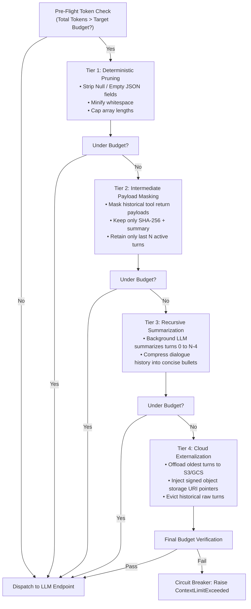

# Lesson 02: Dynamic Token Budgeting & Compaction Pipelines

`🟢 Core` · *Phase 01: Prompt & Context Engineering* · *Estimated Reading Time: 12 minutes*

---

## 🎯 What You Will Learn

By the end of this lesson, you will be able to:
- Architect deterministic **Token Budget Portfolios** (16K, 32K, 64K) to prevent context overflow crashes under multi-turn loads.
- Account for **Reasoning Model Thinking Tokens** to avoid budget exhaustion from hidden scratchpad generation.
- Implement the **4-Tier Compaction Escalation Pipeline** (Deterministic Pruning, Payload Masking, Summarization, Externalization).
- Evaluate **Token Compression Engines** (such as LLMLingua 2) against heuristic compaction in production systems.
- Cap tool schema token footprints to prevent tool definitions from starving conversational working memory.

---

## 1. The Problem: The Context Overflow Crisis

Every Large Language Model enforces a hard physical ceiling on total context tokens (e.g., 8,192, 32,768, 128,000, or 2,000,000 tokens). This ceiling represents the sum of **input prompt tokens + output generated tokens**.

In multi-turn autonomous workflows, context length grows monotonically with each turn:
- The user provides background context.
- The model invokes tools, appending verbose JSON responses to the dialogue history.
- The user asks follow-up questions, referencing earlier turns.

If context growth is unmanaged, production systems inevitably hit two failure boundaries:
1. **The Hard HTTP 400 Crash**: When `input_tokens + max_output_tokens > model_context_limit`, provider APIs reject the request immediately with an unrecoverable HTTP 400 (`context_length_exceeded`) error.
2. **The Latency and Cost Blowup**: In uncompacted multi-turn sessions, processing 50 turns of raw tool outputs can easily consume 40,000+ tokens per call. Every request pays prefill compute costs on historical data that may have zero relevance to the current question.

Relying on "hope as a strategy" or simply purchasing a larger model context window is an anti-pattern. Large contexts increase Time-to-First-Token (TTFT), degrade attention precision, and inflate operational costs.

---

## 2. Systems Mental Model: OS Virtual Memory & Page Eviction

Treating context as an unbounded buffer is like running an operating system without a virtual memory manager.

| Operating System Concept | Context Engineering Equivalent |
|---|---|
| **Physical RAM Ceiling** | Model Context Window Limit (e.g., 32,768 tokens) |
| **Kernel / System Memory** | Layer 1 Static Prefix (Immutable system invariants) |
| **User Process Working Set** | Layer 3 Dynamic Tail (Active turn + immediate evidence) |
| **Swap Space / Pagefile** | External Object Storage (S3 / GCS pointers for historical payloads) |
| **Page Eviction Daemon (LRU)** | The 4-Tier Compaction Escalation Pipeline |

Just as an operating system kernel protects memory by evicting inactive pages to disk when memory pressure exceeds high watermarks, a production AI runtime must enforce progressive context compaction before dispatching requests to LLMs.

---

## 3. Token Budget Allocation Portfolios

To prevent overflow, we establish deterministic **Token Portfolios**. Rather than allowing components to consume tokens arbitrarily, each context segment is assigned an upper bound.

### The Headroom Equation
When sizing input context, you must reserve headroom for the model's output generation:

```text
Max_Usable_Input_Budget = Rated_Context_Limit - Max_Output_Tokens - Safety_Headroom
```

For example, on a 32,000-token window with an expected 4,000-token generation and a 1,000-token safety margin, your maximum allowable input context is exactly `27,000` tokens.

### Production Portfolio Allocations (16K vs. 32K Ceilings)

| Context Register | 16K Budget Ceiling | 32K Budget Ceiling | Mutability & Eviction Priority |
|---|:---:|:---:|---|
| **Layer 1: System / Developer Directives** | 1,500 tokens (9.4%) | 2,500 tokens (7.8%) | Pinned. Never evicted. |
| **Layer 1: Golden Few-Shot (ICL)** | 1,500 tokens (9.4%) | 2,500 tokens (7.8%) | Pinned. Never evicted. |
| **Layer 2: Tool Definitions (Schemas)** | 2,000 tokens (12.5%) | 4,000 tokens (12.5%) | Pruned if specific tools are inactive. |
| **Layer 2: Compacted Session Memory** | 3,000 tokens (18.8%) | 6,000 tokens (18.8%) | Subject to Tier 2 & Tier 3 compaction. |
| **Layer 3: Retrieved Evidence (RAG)** | 4,000 tokens (25.0%) | 9,000 tokens (28.1%) | Truncated via reranker score thresholds. |
| **Layer 3: Current User Query & Turn** | 1,000 tokens (6.2%) | 2,000 tokens (6.2%) | Never evicted. Active turn. |
| **Output Reserve + Safety Headroom** | 3,000 tokens (18.7%) | 6,000 tokens (18.8%) | Guaranteed execution buffer. |

---

## 4. Reasoning Model Context Dynamics: Thinking Token Headroom

With the advent of reasoning models (such as OpenAI `o1`/`o3-mini`, Claude 3.7 Extended Thinking, and DeepSeek-R1), token budgeting faces a new challenge: **Dynamic Thinking Tokens**.

### The 50:1 Scratchpad Inflation
Reasoning models generate internal "thinking" or "reasoning" tokens before emitting the final visible response:
- Thinking tokens count against both the **request context limit** and the **max completion token budget**.
- A user asking a short algorithmic question might receive a 50-token answer, but the model may have generated 2,500 hidden thinking tokens to reach that conclusion.
- If your pre-flight budget calculation only accounts for visible output tokens, the model's thinking scratchpad will cause an immediate context overflow mid-generation.

### Operational Budgeting Rules for Reasoning Models:
1. **Explicit Reasoning Effort Allocation**: When targeting models like `o3-mini`, configure explicit reasoning budgets (e.g., `reasoning_effort: "medium"` or `max_thinking_tokens: 4096`).
2. **Expanded Output Headroom**: Double your reserved output buffer. On reasoning-heavy workloads, allocate at least 8,000 to 16,000 tokens for generation headroom.
3. **No Intermediate Thinking Caching**: Thinking tokens are generated dynamically during the forward pass and are discarded after request completion. They cannot be stored in conversational history or cached across turns.

---

## 5. The 4-Tier Compaction Escalation Pipeline

When incoming context exceeds the portfolio threshold, production systems do not fail immediately. Instead, they execute a progressive **4-Tier Compaction Escalation Pipeline**:



### Step-by-Step Escalation Walkthrough:
1. **Pre-Flight Gating**: Before making a network call to the LLM, the runtime calculates total token footprint using a fast local tokenizer (e.g., `tiktoken`). If under budget, the payload dispatches immediately with zero latency overhead.
2. **Tier 1 (Deterministic Pruning)**: Executes zero-latency, local code transformations. It strips `null` fields from JSON objects, minifies whitespace, and caps large arrays (e.g., keeping only the top 10 rows of a database query result). This typically recovers 15% to 30% of token overhead.
3. **Tier 2 (Payload Masking & Sliding Window)**: In multi-turn tool workflows, previous tool returns (e.g., a 4,000-token API response from 3 turns ago) are masked into a one-line summary: `{"status": "SUCCESS", "records_indexed": 142, "payload_hash": "sha256:7f8a..."}`. Only the most recent `N = 3` active turns retain raw payloads.
4. **Tier 3 (Recursive Summarization)**: If structural pruning is insufficient, an asynchronous call to a fast, low-cost model (such as Claude 3.5 Haiku or Gemini 2.0 Flash) compresses turns 0 through `N - 4` into a compact state summary.
5. **Tier 4 (Externalization & Circuit Breaker)**: Oldest turns are serialized, uploaded to cloud object storage (S3 or GCS), and replaced with reference pointers (`[History offloaded to s3://sessions/audit-98.json]`). If the payload still exceeds the hard ceiling, the circuit breaker raises an alert rather than burning tokens on a failing call.

---

## 6. Token Compression Engines: LLMLingua 2 vs. Heuristic Pruning

Beyond structural compaction, specialized research has explored **token-level prompt compression**. The premier open-source benchmark is **LLMLingua 2** (Pan et al., Microsoft Research, 2024).

### How LLMLingua 2 Works:
- Uses a small, fast transformer classifier (e.g., `XLM-RoBERTa-Large`) trained on task-agnostic prompt compression.
- Calculates the information entropy of every token in the prompt.
- Drops low-entropy, repetitive, or semantically redundant tokens while preserving syntactic flow.

### Production Trade-off Matrix: Heuristic Compaction vs. LLMLingua 2

| Dimension | Heuristic 4-Tier Compaction | LLMLingua 2 Classifier |
|---|---|---|
| **Latency Overhead** | Sub-millisecond (Pure Python string/JSON operations) | 20ms to 60ms (Local CPU/GPU inference step) |
| **Infrastructure Complexity** | Zero dependencies (Built into application code) | Requires hosting a local PyTorch / HuggingFace model |
| **Exact Entity Safety** | **100% Guaranteed** (Preserves JSON keys, IDs, and numbers) | **Risk of Drift**: May drop critical punctuation or digits |
| **Compression Ratio** | 20% to 50% through selective pruning | Up to 60% to 75% through aggressive token dropping |
| **Recommended Use Case** | Enterprise microservices, financial tools, strict schemas | Long, conversational transcripts, chat summaries, exploratory search |

> [!IMPORTANT]
> **Production Rule for Regulated Systems**: In legal, healthcare, and financial architectures, **never apply probabilistic token-dropping compression to regulatory clauses, transaction amounts, or JSON schemas**. A dropped decimal point or missing negation word (`not`) alters business meaning. Restrict LLMLingua 2 to unstructured background context.

---

## 7. Tool Schema Budgeting

In autonomous agent architectures, tools are mounted as JSON Schema objects. A subtle source of context starvation is **Tool Loadout Overload**.

- Each tool definition (including name, description, parameters, property descriptions, and enum values) consumes 150 to 500 tokens.
- Mounting 40 tools in an agent loop consumes 12,000 to 18,000 tokens **on every single turn** before the user has even spoken.
- This creates severe attention dispersion, leading to tool confusion where the model selects the wrong tool.

### Remediation: Stage-Gated Tool Mounts
Instead of registering all enterprise tools globally:
1. Cap the tool schema budget to a maximum of **10% to 15%** of the total context window.
2. Group tools into domain categories (e.g., `BillingTools`, `DatabaseTools`, `AuthTools`).
3. Dynamically mount only the tools required for the current execution stage. *(The full mechanics of tool wire protocols, dispatching, and execution are explored in Phase 03).*

---

## 8. Preserving Semantic Entities Under Compaction: Contextual Retrieval Augmentation

When aggressive token budgeting and compaction are applied to retrieved evidence (Layer 3), a common failure mode is **referential detachment**.

### The Entity Loss Trap Under Truncation
Consider a 300-token chunk extracted from Page 42 of an enterprise Master Services Agreement:
> *"The penalty for early termination is 25% of the remaining annual contract value, payable within 30 days of written notice."*

If the compactor truncates or summarizes previous conversational turns and surrounding chunks to fit a tight 13K budget:
- The model sees the penalty rule, but **loses the identity of the contracting entity, the governing law, and the contract effective date** (which resided on Page 1 or in an evicted turn).
- The model either hallucinates the parties or refuses to answer.

### The Architectural Solution: Contextual Retrieval Headers
To ensure chunks remain self-contained even when the rest of the context window is aggressively compacted, enterprise pipelines apply **Contextual Retrieval Augmentation** (pioneered by Anthropic):

1. **Offline Context Synthesis**: During ingestion (or via an inexpensive cached prefill pass), a fast model generates a concise 50–100 token situational summary for each chunk:
   ```text
   [Context: Master Services Agreement dated Jan 15 2025 between Acme Corp (Client) and Globex Corp (Vendor), governing Cloud Infrastructure Services under Delaware Law.]
   ```
2. **Fixed Header Budgeting**: In the context portfolio, allocate a fixed **75 tokens per retrieved chunk** for the contextual header.
3. **Compaction Resilience**: Even if historical dialogue is compressed via Tier 3 summarization or externalized via Tier 4, every retrieved chunk in Layer 3 retains its core entity anchors, preventing hallucination.

---

## 9. Concrete Scenario & Code: The Production Context Compactor

Below is a complete, runnable Python 3.12+ implementation of a `ContextCompactor` executing Tier 1 (deterministic trimming) and Tier 2 (tool payload masking) using `tiktoken`.

```python
"""
context_compactor.py
Production-grade Context Compactor implementing Tier 1 (Deterministic Pruning)
and Tier 2 (Intermediate Payload Masking) with exact token limits.
"""

import json
from typing import Any, Dict, List
import tiktoken


class ContextCompactor:
    def __init__(self, target_budget: int = 4000, model_name: str = "gpt-4o"):
        self.target_budget = target_budget
        try:
            self.tokenizer = tiktoken.encoding_for_model(model_name)
        except KeyError:
            self.tokenizer = tiktoken.get_encoding("cl100k_base")

    def count_tokens(self, messages: List[Dict[str, Any]]) -> int:
        """Calculates total token count for message array."""
        total = 0
        for msg in messages:
            # 3 tokens overhead per message framing in ChatML
            total += 3
            for key, val in msg.items():
                content = val if isinstance(val, str) else json.dumps(val)
                total += len(self.tokenizer.encode(content))
        total += 3  # Assistant reply priming overhead
        return total

    def tier1_prune_json(self, data: Any) -> Any:
        """
        Tier 1 Compaction: Recursively strips null values, empty strings,
        and minifies array lengths to reduce structural token bloat.
        """
        if isinstance(data, dict):
            return {
                k: self.tier1_prune_json(v)
                for k, v in data.items()
                if v is not None and v != "" and v != []
            }
        elif isinstance(data, list):
            # Cap oversized debug/telemetry arrays to top 5 items
            capped_list = data[:5]
            return [self.tier1_prune_json(item) for item in capped_list]
        return data

    def tier2_mask_tool_payloads(
        self, messages: List[Dict[str, Any]], active_turns_to_retain: int = 2
    ) -> List[Dict[str, Any]]:
        """
        Tier 2 Compaction: Retains full payloads for the latest active turns.
        Masks older tool returns to concise summary stubs.
        """
        compacted: List[Dict[str, Any]] = []
        total_messages = len(messages)
        cutoff_index = max(0, total_messages - (active_turns_to_retain * 2))

        for idx, msg in enumerate(messages):
            msg_copy = dict(msg)
            # Check if this is an older historical tool payload
            if idx < cutoff_index and msg.get("role") == "tool":
                original_content = msg.get("content", "")
                token_len = len(self.tokenizer.encode(str(original_content)))
                # Mask with summary stub
                msg_copy["content"] = json.dumps({
                    "_compaction_notice": "Payload masked by Tier 2 Compactor",
                    "original_tokens": token_len,
                    "status": "PROCESSED_OK"
                })
            compacted.append(msg_copy)

        return compacted

    def compact(self, messages: List[Dict[str, Any]]) -> List[Dict[str, Any]]:
        """Executes compaction pipeline until messages fit within target budget."""
        current_tokens = self.count_tokens(messages)
        if current_tokens <= self.target_budget:
            return messages

        print(f"[Compactor] Initial token footprint: {current_tokens} > Target: {self.target_budget}")

        # Step 1: Execute Tier 1 (Deterministic Structural Pruning)
        pruned_messages: List[Dict[str, Any]] = []
        for msg in messages:
            pruned_msg = dict(msg)
            if isinstance(pruned_msg.get("content"), str):
                try:
                    parsed = json.loads(pruned_msg["content"])
                    pruned_data = self.tier1_prune_json(parsed)
                    pruned_msg["content"] = json.dumps(pruned_data, separators=(",", ":"))
                except (json.JSONDecodeError, TypeError):
                    pass
            pruned_messages.append(pruned_msg)

        current_tokens = self.count_tokens(pruned_messages)
        print(f"[Compactor] Post-Tier 1 footprint: {current_tokens} tokens")
        if current_tokens <= self.target_budget:
            return pruned_messages

        # Step 2: Execute Tier 2 (Historical Payload Masking)
        masked_messages = self.tier2_mask_tool_payloads(pruned_messages, active_turns_to_retain=2)
        current_tokens = self.count_tokens(masked_messages)
        print(f"[Compactor] Post-Tier 2 footprint: {current_tokens} tokens")

        return masked_messages


# --- Verification Harness ---
if __name__ == "__main__":
    compactor = ContextCompactor(target_budget=500, model_name="gpt-4o")

    # Construct conversation with verbose historical tool returns
    sample_history = [
        {"role": "developer", "content": "You are a customer support agent."},
        {"role": "user", "content": "Check order status for order #9021."},
        {
            "role": "tool",
            "content": json.dumps({
                "order_id": 9021,
                "status": "SHIPPED",
                "null_field_1": None,
                "null_field_2": "",
                "debug_telemetry": [f"log_event_{i}" for i in range(50)],
                "raw_warehouse_manifest": {"line_items": ["item_a", "item_b"] * 10}
            })
        },
        {"role": "assistant", "content": "Your order #9021 has shipped."},
        {"role": "user", "content": "Where is it right now?"},
        {
            "role": "tool",
            "content": json.dumps({
                "carrier": "FedEx",
                "tracking": "TRK-881920",
                "location": "Memphis, TN",
                "eta": "Tomorrow by 5 PM"
            })
        }
    ]

    result = compactor.compact(sample_history)
    final_tokens = compactor.count_tokens(result)
    print(f"\nFinal Compacted Tokens: {final_tokens} (Compliant with <= 500 ceiling)")
    print(f"Oldest Tool Return Content:\n{result[2]['content']}")
```

---

## 9. Production War Story: The 45-Second Latency Spike & The 60-Tool Agent

In late 2024, a major enterprise SaaS company deployed an autonomous IT Support Agent designed to troubleshoot developer environments. The engineering team connected the agent to 60 internal microservice tools: Jenkins pipelines, Kubernetes pods, Jira tickets, Datadog alerts, GitHub pull requests, and AWS IAM roles.

### The Production Failure
During testing with 1 or 2 tools, response latency hovered at a snappy 1.8 seconds. However, within 24 hours of launching to production:
- Average request latency spiked from 1.8 seconds to **45.2 seconds**.
- Time-to-First-Token (TTFT) climbed over 30 seconds.
- Multi-turn chats frequently crashed with HTTP 400 context limit exceptions on turn 4 or 5.
- The monthly provider API bill reached \$68,000 in its first week.

### The Root Cause Post-Mortem
The agent runtime mounted all 60 tool JSON schemas on every request:
- Each tool schema averaged 240 tokens.
- Total static tool overhead: `60 × 240 = 14,400 tokens` per request.
- On a 3-turn conversation, the LLM had to process `14,400` tool tokens on every turn. In addition, previous tool execution outputs were appended in full without truncation.
- By Turn 4, the input payload was exceeding 35,000 tokens. The inference engine spent 90% of its compute time performing quadratic attention prefill on irrelevant tool schemas.

### The Remediation
1. **Dynamic Stage Gating**: The team categorized tools into 5 functional stages (`Triage`, `Infrastructure`, `Codebase`, `Ticketing`, `Security`). The router mounted only 4 to 8 tools corresponding to the active stage, slashing tool schema overhead from 14,400 tokens to under 1,600 tokens.
2. **Tier 2 Payload Truncation**: Previous tool returns were truncated to status hashes, freeing 8,000 tokens per turn.
3. **Outcome**: p95 latency dropped from 45.2s to 2.4s, and monthly API burn dropped by 82%.

---

## 10. Key Takeaways & Verified Resources

### Key Takeaways
1. **Context is a Finite Operating Register**: Never treat context as an elastic buffer. Establish explicit token budgets for each AST layer.
2. **Account for Thinking Tokens**: Reasoning models (o3, DeepSeek-R1) generate hidden thinking tokens that count against context ceilings. Double your output headroom.
3. **Escalate Compaction Deterministically**: Use Tier 1 (pruning) and Tier 2 (payload masking) before incurring latency on LLM summarization (Tier 3).
4. **Cap Tool Schema Footprints**: Never mount dozens of tools simultaneously. Restrict tool definitions to 10–15% of your total context budget.

### Verified Primary Sources
- **Pan et al. (2024)**: *LLMLingua-2: Data-distillation for Efficient and Faithful Task-Agnostic Prompt Compression* (COLM 2024, arXiv:2403.12968).
- **OpenAI Platform Documentation**: *Managing Context in Multi-Turn Conversations* (`https://platform.openai.com/docs/guides/reasoning`).
- **Anthropic Engineering Guides**: *Managing Long Conversations & Context Windows* (`https://docs.anthropic.com/en/docs/build-with-claude`).

---

## 🧭 Navigation

- **[← Previous Lesson: Context AST Architecture](./01-context-ast-architecture.md)**
- **[Phase 01 Hub](./README.md)**
- **[Next Lesson: Prefix & Prompt Caching →](./03-prefix-and-prompt-caching.md)**
- **[Capstone Lab: Cached, Type-Safe Financial Compliance Engine](./labs/capstone-context-engineering-pipeline.md)**
