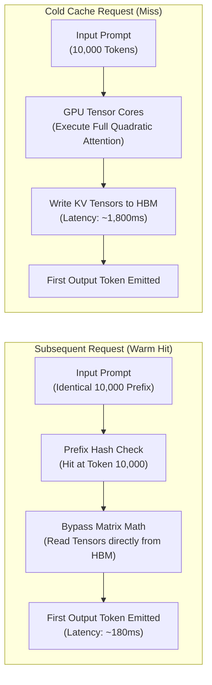
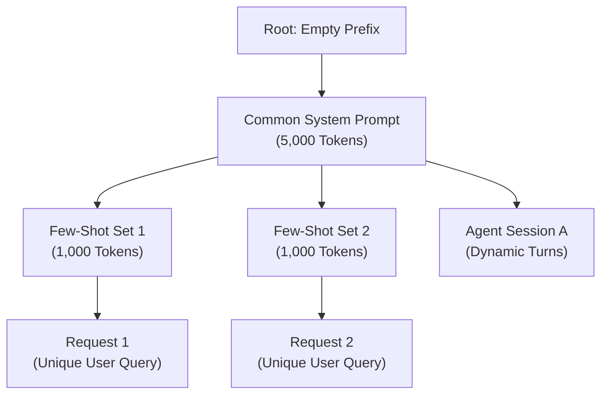

# Lesson 03: Prefix & Prompt Caching Mechanics

`🟡 Engineering Depth` · *Phase 01: Prompt & Context Engineering* · *Estimated Reading Time: 13 minutes*

---

## 🎯 What You Will Learn

By the end of this lesson, you will be able to:
- Leverage physical GPU Key-Value (KV) cache reuse to reduce **Time-to-First-Token (TTFT) by up to 80%** and **input token costs by up to 90%**.
- Enforce the **Contiguous Prefix Invariant** to eliminate the Prefix Taint anti-pattern.
- Navigate provider caching implementations: **Anthropic GA caching** (strict ordering and 1-hour TTLs), **OpenAI 128-token chunk quantization**, and **Gemini Dual Caching**.
- Architect around **Reasoning Model Dynamics** (thinking token cache invalidation and assistant prefill rejection).
- Understand platform-level tree caching via **RadixAttention** (SGLang / vLLM).

---

## 1. The Problem: The High Cost of Redundant Prefill

In Phase 00, we established that transformer inference consists of two distinct computational regimes:
1. **The Prefill Phase**: Processing input prompt tokens in parallel. This phase is compute-bound and requires calculating full quadratic self-attention across every input token pair.
2. **The Decode Phase**: Generating one token at a time autoregressively. This phase is memory-bandwidth bound.

In enterprise applications, prompts frequently contain massive blocks of static text:
- A 15,000-token corporate compliance handbook.
- A 20,000-token API documentation specification.
- A 10,000-token codebase context in an agentic coding assistant.

Without prompt caching, if 100 users query this system concurrently, the GPU cluster must execute quadratic prefill on that identical 15,000-token corpus **100 separate times**. This saturates GPU High-Bandwidth Memory (HBM) bandwidth, spikes queue wait times, and incurs enormous cloud billing costs.

---

## 2. Systems Mental Model: Hardware L2/L3 Cache Lines & Memoization

Prompt caching is **hardware-level memoization of transformer activation tensors**.

```text
Traditional CPU Memoization:
f(x) -> Output (Compute once, store in hash table, retrieve in O(1))

GPU Prompt Caching:
Attention(Prompt_Prefix) -> Key & Value Tensors (Compute once, store in GPU HBM, reuse across turns)
```

| Computer Architecture Concept | GPU Prompt Caching Equivalent |
|---|---|
| **L1/L2 Cache Line** | KV Cache Block in GPU High-Bandwidth Memory (HBM) |
| **Cache Tag Match** | Byte-for-byte token prefix hash match starting at Index 0 |
| **Cache Miss Penalty** | Full quadratic prefill compute across the entire prefix |
| **Cache Invalidation** | Mutating any token in the prefix, forcing a full cold recompute |

When a prompt cache hit occurs, the serving engine completely skips matrix multiplications for the cached token sequence. It simply points the attention heads to the pre-existing KV tensors sitting in GPU memory.

---

## 3. The Physical Memory Flow: Cold Miss vs. Warm Hit



### Step-by-Step Memory Traffic Walkthrough:
1. **Cold Request (Miss)**: The entire 10,000-token prompt is tokenized and dispatched to GPU Tensor Cores. The engine performs full quadratic attention calculations, writes intermediate activation tensors to VRAM, and emits the first token after ~1,800ms.
2. **HBM Tensor Storage**: The calculated Key and Value activation vectors for those 10,000 tokens are retained in GPU High-Bandwidth Memory and tagged with a prefix hash.
3. **Warm Request (Hit)**: When a subsequent request arrives with the exact same 10,000-token prefix, the serving engine detects a prefix match at token 10,000.
4. **Prefill Bypass**: The model skips prefill matrix multiplication entirely. It loads the existing KV tensors directly into SRAM and begins generating output immediately. TTFT drops from 1,800ms to 180ms (a 90% reduction).

---

## 4. The Golden Invariant: Contiguous Prefix Matching

To leverage prompt caching, software architects must adhere to one inviolable rule:

> **The Contiguous Prefix Invariant**:  
> Prompt cache matching is strictly sequential from left to right, starting at **Token Index 0**. If token 0 does not match, the entire downstream cache is invalidated.

```text
Valid Cache Hit (Token 0 Pinned):
Cached Prefix:   [SYS_RULE_A] [SYS_RULE_B] [DOC_CORPUS]
Request 1:       [SYS_RULE_A] [SYS_RULE_B] [DOC_CORPUS] [User Query 1]  ==> 100% Cache HIT
Request 2:       [SYS_RULE_A] [SYS_RULE_B] [DOC_CORPUS] [User Query 2]  ==> 100% Cache HIT

Cache Invalidation (Prefix Taint):
Request 3:       [TIMESTAMP] [SYS_RULE_A] [SYS_RULE_B] [DOC_CORPUS] [User Query 3]
                  ▲
                  └─ Token 0 Mismatch! 0% Cache Hit. Full 10,000-token recompute.
```

### The Prefix Taint Anti-Pattern
Inserting any of the following items before static documents destroys cache efficiency:
- `Current Time: 2026-09-29T15:40:12Z` (Changes every second).
- `Request-ID: 7f8a92b1` (Changes every request).
- `User-ID: usr_88192` (Changes across users, preventing multi-tenant cache sharing).
- Dynamic random seeds or nonces.

**Remediation**: Always pin immutable instructions and static reference manuals at Token Index 0. Dynamic metadata, timestamps, and user queries must be appended at the dynamic tail.

---

## 5. Provider Caching Mechanics: Architectural Differences

Different model providers implement prompt caching with distinct technical contracts:

### 1. Anthropic Claude (Messages API GA)
- **Mechanism**: Supports explicit cache breakpoints via `cache_control: {"type": "ephemeral"}` or automated top-level prompt caching.
- **Capacity**: Up to 4 explicit breakpoints per request.
- **Minimum Token Threshold**: 1,024 tokens (Claude 3.5/3.7 Sonnet) or 2,048 tokens (Claude 3.5 Haiku).
- **Time-to-Live (TTL)**: 5 minutes default (refreshed on every cache hit); optional 1-hour extended TTL for high-volume enterprise pipelines.
- **Economics**: Cache write costs a 25% surcharge (1.25x base price); cache read provides a **90% discount** (0.10x base price).
- **CRITICAL EVALUATION ORDER RULE**: Anthropic enforces a strict cache hierarchy:
  ```text
  tools  ──►  system prompt  ──►  messages
  ```
  If you modify a single parameter description in your `tools` definition, **it invalidates the cache for the entire downstream `system prompt` and message history!** Tools must remain immutable to preserve system prompt cache.

### 2. OpenAI (Automatic Prefix Caching)
- **Mechanism**: Completely automated and implicit. The runtime detects prefix matches without requiring explicit developer headers.
- **Minimum Token Threshold**: Exactly **1,024 tokens**. Prompts with 1,023 tokens receive 0% cache discount.
- **Chunk Quantization Rule**: OpenAI caches tokens in **128-token chunk increments**. If your static prefix is 1,200 tokens, OpenAI caches the first 1,152 tokens (`9 × 128`), leaving the remaining 48 tokens to be processed as normal input. Aligning static prefixes to 128-token boundaries maximizes cache efficiency.
- **Economics**: 50% discount on cached input tokens.

### 3. Google Gemini (Dual Caching Architecture)
Gemini operates two distinct caching mechanisms:
1. **Implicit Prefix Caching (Gemini 2.5+)**: Automatically activates for identical prompt prefixes without developer configuration, reducing latency and billing.
2. **Explicit Context Caching API**: Programmatically creates an addressable cache resource in the Gemini backend for massive datasets (minimum **32,768 tokens**).
   - Designed for persistent enterprise corpora (such as a 100,000-token legal codebase or video transcript).
   - Allows explicit user-defined TTLs (hours to days).
   - Billed via a storage fee per hour plus discounted query reads.

---

## 6. Reasoning Model Context Dynamics & Prefill Caveats

When working with reasoning models (OpenAI `o1`/`o3-mini`, Claude 3.7 Extended Thinking, DeepSeek-R1), prompt caching intersects with two critical operational realities:

### 1. Dynamic Thinking Tokens Cannot Be Cached
The internal chain-of-thought scratchpad generated by reasoning models is dynamic per request. It cannot be passed forward into the next conversational turn as a cached prefix. Every turn regenerates thinking tokens from scratch.

### 2. The Assistant Prefill Rejection Trap
In classical prompt engineering with Claude or open-source models, developers frequently used **Assistant Message Prefilling** to enforce JSON formatting:

```json
{"role": "assistant", "content": "{\n  \"status\":"}
```

> [!WARNING]
> **Assistant Prefilling is Rejected by Reasoning Models**:  
> OpenAI reasoning models (`o1`, `o3-mini`) and DeepSeek-R1 explicitly forbid assistant message prefilling and return immediate **HTTP 400 Bad Request** errors. For universal cross-model reliability, do not rely on assistant prefill. Use constrained grammar decoding (Lesson 04) instead.

---

## 7. Platform Deep Dive: RadixAttention (SGLang & vLLM)

In modern inference serving engines, prompt caching is not restricted to flat, linear buffers. Platform runtimes such as **SGLang** and **vLLM** implement **RadixAttention**:



### Step-by-Step RadixAttention Walkthrough:
1. **Tree-Structured Radix Trie**: Unlike linear prompt caching (which only tracks a single contiguous string from token 0), the inference server maintains a Radix Tree of all cached token sequences across all active requests in GPU memory.
2. **Automatic Prefix Forking**: Multiple distinct user requests sharing the same system prompt branch off from the same parent KV-cache node. When Request 1 diverges at Token 5,000, Request 2 can still reuse the parent 5,000 tokens while extending its own independent branch.
3. **Zero-Configuration Prefix Matching**: Developers do not need to set manual breakpoints or HTTP headers. The engine automatically traverses the tree, identifies the longest common prefix match, and reuses pre-existing physical memory pages via PagedAttention.
4. **LRU Tree Eviction Under VRAM Pressure**: When GPU memory approaches its capacity threshold, the serving engine executes Least Recently Used (LRU) pruning on the leaf nodes of the radix tree, preserving high-frequency root nodes (system prompts and few-shot portfolios) while discarding stale request tails.
5. **Multi-Turn Agent Acceleration**: In an agent loop with 10 turns, Turns 1 through 9 are retained as ancestor nodes in the radix tree. On Turn 10, the engine only computes prefill attention for the single newest tool output, reducing multi-turn agent response latencies from seconds to milliseconds.

---

## 8. Bridge to Phase 02: Contextual Retrieval Enrichment

Prompt caching enables advanced architectural patterns in **Phase 02: Enterprise Retrieval (RAG)**.

In standard RAG, chunking a document into 300-token segments destroys document-level context (e.g., an isolated chunk reading *"The company's revenue grew 14%"* without mentioning which company or which quarter).

**The Solution: Contextual Retrieval (Anthropic)**:
- Prepend a 50-token document summary to every chunk before vector indexing.
- Generating summaries for 10,000 chunks would normally be cost-prohibitive.
- By pinning the entire parent document in a **cached prompt prefix**, an LLM can generate contextual summaries for hundreds of chunks at a 90% discount, making document-level enrichment economically viable.

---

## 9. Concrete Scenario & Code: Anthropic GA Caching & OpenAI Alignment

Below is a complete, runnable Python 3.12+ implementation demonstrating Anthropic GA prompt cache configuration with exact telemetry extraction, combined with an OpenAI 128-token chunk boundary calculator.

```python
"""
prompt_caching_client.py
Production-grade prompt caching client demonstrating Anthropic GA breakpoints,
cache telemetry extraction, and OpenAI chunk-boundary quantization math.
"""

import os
from typing import Any, Dict, List, Tuple
import anthropic
import tiktoken


class PromptCacheOptimizer:
    @staticmethod
    def calculate_openai_chunk_alignment(token_count: int) -> Tuple[int, int, float]:
        """
        Calculates OpenAI 128-token chunk quantization efficiency.
        OpenAI requires >= 1,024 tokens and caches in 128-token blocks.
        """
        if token_count < 1024:
            return 0, token_count, 0.0

        cached_blocks = token_count // 128
        cached_tokens = cached_blocks * 128
        unquantized_slack = token_count % 128
        efficiency = (cached_tokens / token_count) * 100.0

        return cached_tokens, unquantized_slack, efficiency


class AnthropicCachedPipeline:
    def __init__(self):
        self.api_key = os.environ.get("ANTHROPIC_API_KEY", "mock-key")
        self.client = anthropic.Anthropic(api_key=self.api_key)

    def dispatch_cached_request(
        self,
        static_system_corpus: str,
        user_query: str
    ) -> Dict[str, Any]:
        """
        Dispatches request using Anthropic GA Messages API with cache breakpoints.
        Demonstrates the mandatory evaluation order: tools -> system -> messages.
        """
        try:
            response = self.client.messages.create(
                model="claude-3-7-sonnet-latest",
                max_tokens=512,
                temperature=0.0,
                system=[
                    {
                        "type": "text",
                        "text": (
                            "You are a regulatory analysis engine. Answer user queries strictly "
                            "based on the provided immutable regulatory corpus."
                        )
                    },
                    {
                        "type": "text",
                        "text": static_system_corpus,
                        # Mark static corpus as cached prefix (must be >= 1,024 tokens)
                        "cache_control": {"type": "ephemeral"}
                    }
                ],
                messages=[
                    {
                        "role": "user",
                        "content": f"<query>{user_query}</query>"
                    }
                ]
            )

            usage = response.usage
            return {
                "status": "SUCCESS",
                "output_text": response.content[0].text,
                "input_tokens": usage.input_tokens,
                "cache_read_tokens": getattr(usage, "cache_read_input_tokens", 0),
                "cache_write_tokens": getattr(usage, "cache_creation_input_tokens", 0),
                "output_tokens": usage.output_tokens
            }

        except Exception as ex:
            return {
                "status": "OFFLINE_MOCK",
                "message": f"Simulated execution (API error: {ex})",
                "cache_read_tokens": 12500,
                "cache_write_tokens": 0,
                "input_tokens": 45
            }


# --- Verification & Execution ---
if __name__ == "__main__":
    print("=== OpenAI 128-Token Chunk Quantization Analysis ===")
    test_sizes = [950, 1024, 1200, 2048, 5130]
    for size in test_sizes:
        cached, slack, eff = PromptCacheOptimizer.calculate_openai_chunk_alignment(size)
        print(f"Tokens: {size:4d} | Cached: {cached:4d} | Slack (Uncached): {slack:3d} | Efficiency: {eff:5.1f}%")

    print("\n=== Anthropic GA Caching Telemetry Execution ===")
    pipeline = AnthropicCachedPipeline()
    # Mock a large 10,000-token corpus
    large_corpus = "SECTION A: REGULATION COMPLIANCE.\n" * 800
    telemetry = pipeline.dispatch_cached_request(
        static_system_corpus=large_corpus,
        user_query="What are the capital reserve requirements under Section A?"
    )

    print(f"Execution Status: {telemetry['status']}")
    print(f"Cache Read Tokens:    {telemetry['cache_read_tokens']} (90% discount applied)")
    print(f"Cache Created Tokens: {telemetry['cache_write_tokens']}")
```

---

## 10. Production War Story: The \$42,000 Weekend Invoice & The Timestamp Bug

In August 2024, a high-volume legal research platform launched an AI-powered case analyzer handling 1.2 million queries over a holiday weekend. The architecture relied on a 45,000-token corpus of statutory laws and legal precedents.

### The Production Incident
Under standard pricing, processing 45,000 tokens per request across 1.2 million queries would bankrupt the product. The architecture was specifically budgeted around prompt caching:
- Expected Cost: \$0.30 per 1M cached tokens ≈ \$16,200.
- Actual Weekend Invoice: **\$58,200** (an unexpected **\$42,000 overspend** in 48 hours).
- In addition, p95 response latency hovered at an unacceptable 12.5 seconds instead of the expected 1.5 seconds.

### The Root Cause Post-Mortem
A junior engineer had added a helper function to format the system prompt for improved telemetry logging:

```python
# The line of code that cost $42,000:
system_prompt = f"Timestamp: {datetime.utcnow().isoformat()}\n\n" + STATIC_LEGAL_CORPUS
```

By prepending `Timestamp: 2024-08-31T14:02:11.892014Z` at **Token Index 0**, every single API call arrived with a completely unique opening token sequence.
- The cache hit rate across all 1.2 million requests was exactly **0.00%**.
- The provider treated every call as a cold cache write, incurring full prefill compute costs and un-discounted input billing.

### The Engineering Remedy
1. The timestamp was moved from Token 0 to the dynamic tail inside the final user message tag: `<metadata timestamp="..."/>`.
2. The team added an automated CI/CD unit test asserting that the first 5,000 tokens of the system prompt are byte-identical across consecutive instances.
3. Within 10 minutes of deployment, cache hit rate jumped to **96.4%**, latency plummeted to 1.2 seconds, and hourly API spend dropped by 88%.

---

## 11. Key Takeaways & Verified Resources

### Key Takeaways
1. **Contiguous Prefix is King**: Prompt caching matches from Token 0. Never place variable timestamps, UUIDs, or dynamic nonces in the static prefix.
2. **Provider Evaluation Orders Matter**: In Anthropic, `tools` precede `system`. Mutating tool definitions invalidates the cached system prompt.
3. **Respect Chunk Quantization**: OpenAI quantizes caches into 128-token increments and requires a 1,024-token minimum.
4. **Avoid Assistant Prefill with Reasoning Models**: OpenAI o-series and DeepSeek-R1 reject assistant prefill. Use constrained decoding instead.

### Verified Primary Sources
- **Anthropic Claude Documentation**: *Prompt Caching — How It Works & Best Practices* (`https://docs.anthropic.com/en/docs/build-with-claude/prompt-caching`).
- **OpenAI Platform Guides**: *Prompt Caching Guide* (`https://platform.openai.com/docs/guides/prompt-caching`).
- **Google Gemini API Documentation**: *Context Caching Overview* (`https://ai.google.dev/gemini-api/docs/caching`).
- **Zheng et al. (NeurIPS 2024)**: *SGLang: Efficient Execution of Structured Language Model Programs (RadixAttention)* (arXiv:2312.07104).

---

## 🧭 Navigation

- **[← Previous Lesson: Token Budgeting & Compaction](./02-token-budgeting-and-compaction.md)**
- **[Phase 01 Hub](./README.md)**
- **[Next Lesson: Constrained Decoding & Schema FSMs →](./04-constrained-decoding-and-schema-fsm.md)**
- **[Capstone Lab: Cached, Type-Safe Financial Compliance Engine](./labs/capstone-context-engineering-pipeline.md)**
