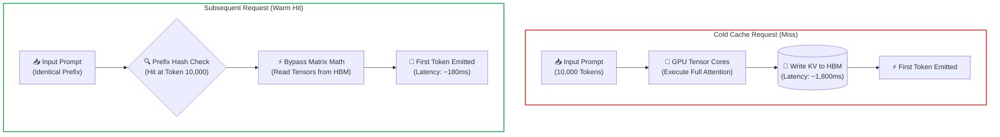
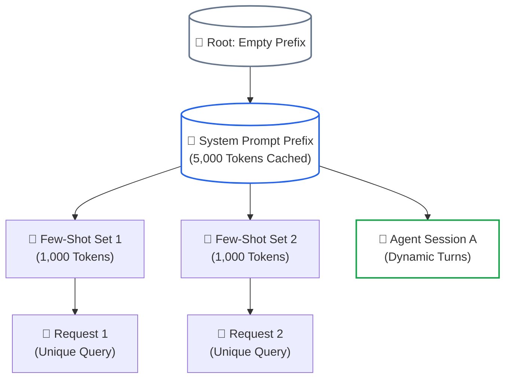

# Lesson 03: Prefix & Prompt Caching Mechanics

> **Tier**: `🟡 Engineering Depth` | **Read time**: ~18 min | **Prerequisites**: [Lesson 01: Context AST Architecture](./01-context-ast-architecture.md), [Lesson 02: Dynamic Token Budgeting & Compaction Pipelines](./02-token-budgeting-and-compaction.md)  
> **Core Concept**: Physical GPU prompt caching memoizes transformer Key-Value (KV) activation tensors in high-bandwidth memory. By enforcing the contiguous prefix invariant from token index 0, systems bypass redundant matrix math, cutting Time-to-First-Token (TTFT) by up to 80% and input token costs by up to 90%.  
> **New AI terms introduced**: Prompt caching (prefix caching), contiguous prefix invariant, prefix taint, chunk quantization (128-token blocks), RadixAttention.  
> **AI terms assumed from earlier lessons**: [Token](../00-foundations-and-token-mechanics/01-tokenization-and-bpe-mechanics.md), [Context window](../00-foundations-and-token-mechanics/00-what-is-an-llm.md), [Time-to-First-Token (TTFT)](../00-foundations-and-token-mechanics/03-kv-cache-vram-and-bandwidth-physics.md), [KV cache](../00-foundations-and-token-mechanics/03-kv-cache-vram-and-bandwidth-physics.md), [Prefill](../00-foundations-and-token-mechanics/03-kv-cache-vram-and-bandwidth-physics.md), [Decode](../00-foundations-and-token-mechanics/03-kv-cache-vram-and-bandwidth-physics.md), [PagedAttention](../00-foundations-and-token-mechanics/03-kv-cache-vram-and-bandwidth-physics.md), [Thinking tokens (reasoning tokens)](./02-token-budgeting-and-compaction.md).

---

## 🎯 What You Will Learn

By the end of this lesson, you will be able to:
- Leverage physical GPU Key-Value (KV) cache reuse to reduce **Time-to-First-Token (TTFT) by up to 80%** and **input token costs by up to 90%**.
- Enforce the **Contiguous Prefix Invariant** to eliminate the Prefix Taint anti-pattern.
- Navigate provider caching implementations: **Anthropic GA caching** (strict ordering and 1-hour TTLs), **OpenAI 128-token chunk quantization**, and **Gemini Dual Caching**.
- Architect around **Reasoning Model Dynamics** (thinking token cache invalidation and assistant prefill rejection).
- Understand platform-level tree caching via **RadixAttention** (SGLang and vLLM).

---

## 1. The Problem: The High Cost of Redundant Prefill

In Phase 00, we established that transformer inference consists of two distinct computational regimes:
1. **The Prefill Phase**: Processing input prompt tokens in parallel. This phase is compute-bound. It calculates full quadratic self-attention across every input token pair.
2. **The Decode Phase**: Generating one token at a time autoregressively. This phase is memory-bandwidth bound.

In enterprise applications, prompts frequently contain massive blocks of static text:
- A 15,000-token corporate compliance handbook.
- A 20,000-token API documentation specification.
- A 10,000-token codebase context in an agentic coding assistant.

Without prompt caching, 100 concurrent user requests force the GPU cluster to recompute attention across that identical 15,000-token corpus **100 separate times**. This saturates GPU memory bandwidth, spikes queue wait times, and inflates cloud API invoices.

---

## 2. The Mental Model: Hardware L2/L3 Cache Lines & Memoization

🧒 **The Analogy**: Prompt caching is **hardware-level memoization of transformer activation tensors**.

```text
Traditional CPU Memoization:
f(x) -> Output (Compute once, store in hash table, retrieve in O(1))

GPU Prompt Caching:
Attention(Prompt_Prefix) -> Key & Value Tensors (Compute once, store in GPU HBM, reuse across turns)
```

| Computer Architecture Concept | GPU Prompt Caching Equivalent |
|---|---|
| **L1/L2 Cache Line** | KV Cache Block in GPU High-Bandwidth Memory (HBM) |
| **Cache Tag Match** | Byte-for-byte token prefix hash match starting at Index 0 |
| **Cache Miss Penalty** | Full quadratic prefill compute across the entire prefix |
| **Cache Invalidation** | Mutating any token in the prefix, forcing a full cold recompute |

When a prompt cache hit occurs, the serving engine skips matrix multiplications for the cached token sequence. It points the attention heads directly to the pre-existing KV tensors sitting in GPU memory.

**Where this analogy breaks**: Traditional CPU memoization stores a finished return value `f(x)`. If you hit the cache, calculation is done. GPU prompt caching stores only intermediate Key-Value activation tensors for the prefix. The model still must run its autoregressive decoding loop to generate each new response token.

---

## 3. How It Works, One Term at a Time

### Prompt caching and physical memory flow

**Prompt caching** (also called **prefix caching**) stores intermediate transformer Key and Value activation vectors in GPU memory so subsequent requests can skip prefill computation.

* 🧒 **The Analogy**: Preparing soup stock in advance at a restaurant. Instead of simmering vegetables from scratch for every customer order, you keep a hot pot of rich stock ready. You only cook the final noodles to order.
* ⚙️ **The Engineering**: During inference, the serving engine calculates intermediate Key and Value vectors for every token in the prompt. If marked cacheable, these vectors are retained in GPU High-Bandwidth Memory (HBM). Subsequent requests sharing that exact token prefix bypass the prefill matrix math entirely.

#### Diagram 1: Cold Miss vs. Warm Hit



#### Step-by-Step Memory Traffic Walkthrough:
1. **Cold Request (Miss)**: The entire 10,000-token prompt is tokenized and dispatched to GPU Tensor Cores. The engine performs full quadratic attention calculations, writes intermediate activation tensors to VRAM, and emits the first token after ~1,800ms.
2. **HBM Tensor Storage**: The calculated Key and Value activation vectors for those 10,000 tokens are retained in GPU High-Bandwidth Memory and tagged with a prefix hash.
3. **Warm Request (Hit)**: When a subsequent request arrives with the exact same 10,000-token prefix, the serving engine detects a prefix match at token 10,000.
4. **Prefill Bypass**: The model skips prefill matrix multiplication entirely. It loads the existing KV tensors directly into SRAM and begins generating output immediately. TTFT drops from 1,800ms to 180ms (a 90% reduction).

* ⚠️ **What happens if you skip this?** High-volume systems pay full quadratic prefill compute costs on every turn. Inference servers hit queue saturation, and TTFT degrades under load.

---

### The Contiguous Prefix Invariant and Prefix Taint

The **contiguous prefix invariant** states that prompt cache matching is strictly sequential from left to right, starting at **Token Index 0**.

* 🧒 **The Analogy**: A combination lock where dials must be aligned in exact order from left to right. If the first dial is wrong, turning the remaining dials does not open the lock.
* ⚙️ **The Engineering**: Attention mechanisms encode position-aware Key vectors. If a single token changes at index 0, every positional encoding and attention vector downstream changes. Therefore, a mismatch at Token 0 invalidates 100% of the downstream cache:

```text
Valid Cache Hit (Token 0 Pinned):
Cached Prefix:   [SYS_RULE_A] [SYS_RULE_B] [DOC_CORPUS]
Request 1:       [SYS_RULE_A] [SYS_RULE_B] [DOC_CORPUS] [User Query 1]  ==> 100% Cache HIT
Request 2:       [SYS_RULE_A] [SYS_RULE_B] [DOC_CORPUS] [User Query 2]  ==> 100% Cache HIT

Cache Invalidation (Prefix Taint):
Request 3:       [TIMESTAMP] [SYS_RULE_A] [SYS_RULE_B] [DOC_CORPUS] [User Query 3]
                  ▲
                  └─ Token 0 Mismatch! 0% Cache Hit. Full 10,000-token recompute.
```

**Prefix taint** is the anti-pattern of inserting dynamic, non-deterministic values near the start of a prompt:
- Dynamic timestamps (`Timestamp: 2025-01-15T10:00:00Z`).
- Unique request IDs (`Request-ID: 7f8a92b1`).
- User or session IDs (`User-ID: usr_88192`).
- Dynamic nonces or random seeds.

**Remediation**: Always pin immutable instructions and static reference manuals at Token Index 0. Dynamic metadata, timestamps, and user queries must be appended at the dynamic tail.

---

### Provider Caching Mechanics: Architectural Differences

Different model providers implement prompt caching with distinct technical contracts:

#### 1. Anthropic Claude (Messages API)
- **Models**: Claude 3.5 Sonnet / 3.7 Sonnet (as of 2025-02), Claude 3 Haiku / 3.5 Haiku (as of 2024-10).
- **Mechanism**: Supports explicit cache breakpoints via `cache_control: {"type": "ephemeral"}` or automated top-level prompt caching.
- **Capacity**: Up to 4 explicit breakpoints per request.
- **Minimum Token Threshold**: 1,024 tokens (Claude 3.5/3.7 Sonnet and Opus) or 2,048 tokens (Claude 3/3.5 Haiku).
- **Time-to-Live (TTL)**: 5 minutes default (refreshed on every cache hit); optional 1-hour extended TTL for high-volume pipelines.
- **Economics**: Cache write costs a 25% surcharge (1.25x base price); cache read provides a **90% discount** (0.10x base price).
- **CRITICAL EVALUATION ORDER RULE**: Anthropic enforces a strict cache hierarchy:
  ```text
  tools  ──►  system prompt  ──►  messages
  ```
  If you modify a single parameter description in your `tools` definition, **it invalidates the cache for the entire downstream `system prompt` and message history!** Tools must remain immutable to preserve system prompt cache.

#### 2. OpenAI (Automatic Prefix Caching)
- **Models**: GPT-4o, o1, o3-mini (as of 2025-01).
- **Mechanism**: Completely automated and implicit. The runtime detects prefix matches without requiring explicit developer headers.
- **Minimum Token Threshold**: Exactly **1,024 tokens**. Prompts with 1,023 tokens receive 0% cache discount.
- **Chunk Quantization Rule**: OpenAI caches tokens in **128-token chunk increments**. If your static prefix is 1,200 tokens, OpenAI caches the first 1,152 tokens (`9 × 128`), leaving the remaining 48 tokens to be processed as normal input. Aligning static prefixes to 128-token boundaries maximizes cache efficiency.
- **Economics**: 50% discount on cached input tokens.

#### 3. Google Gemini (Dual Caching Architecture)
- **Models**: Gemini 1.5 Pro, Gemini 2.0 Flash, Gemini 2.5 (as of 2025-01).
- **Implicit Prefix Caching**: Automatically activates for identical prompt prefixes without developer configuration.
- **Explicit Context Caching API**: Programmatically creates an addressable cache resource in the Gemini backend for massive datasets (minimum **32,768 tokens**).
  - Designed for persistent enterprise corpora (such as a 100,000-token legal codebase or video transcript).
  - Allows explicit user-defined TTLs (hours to days).
  - Billed via a storage fee per hour plus discounted query reads.

---

### Reasoning Model Context Dynamics & Prefill Caveats

Reasoning models introduce two key constraints for prompt caching. These models include OpenAI o1 and o3-mini (as of 2025-01), Claude 3.7 Sonnet (as of 2025-02), and DeepSeek-R1 (as of 2025-01):

#### 1. Dynamic Thinking Tokens Cannot Be Cached
The internal chain-of-thought scratchpad generated by reasoning models is dynamic per request. It cannot be passed forward into the next conversational turn as a cached prefix. Every turn regenerates thinking tokens from scratch.

#### 2. The Assistant Prefill Rejection Trap
In classical prompt engineering with Claude or open-source models, developers frequently used **Assistant Message Prefilling** to enforce JSON formatting:

```json
{"role": "assistant", "content": "{\n  \"status\":"}
```

> [!WARNING]
> **Assistant Prefilling is Rejected by Reasoning Models**:  
> OpenAI reasoning models (o1, o3-mini) and DeepSeek-R1 explicitly forbid assistant message prefilling and return immediate **HTTP 400 Bad Request** errors. For universal cross-model reliability, do not rely on assistant prefill. Use constrained grammar decoding (Lesson 04) instead.

---

### Platform Deep Dive: RadixAttention (SGLang & vLLM)

**RadixAttention** is a tree-based caching algorithm that organizes cached token prefixes into a radix trie, enabling automatic KV-cache sharing and branching across concurrent requests.

* 🧒 **The Analogy**: A file system directory tree. Multiple project files share the exact same root directory `/usr/local/bin/`. They do not duplicate the parent folders on disk.
* ⚙️ **The Engineering**: Platform runtimes such as **SGLang** (Zheng et al., 2024) and **vLLM** implement RadixAttention:

#### Diagram 2: RadixAttention Tree Topology



#### Step-by-Step RadixAttention Walkthrough:
1. **Tree-Structured Radix Trie**: Linear prompt caching tracks only a single contiguous string from token 0. In contrast, a radix tree maintains a shared hierarchy of cached token sequences across all active GPU requests.
2. **Automatic Prefix Forking**: Multiple distinct user requests sharing the same system prompt branch off from the same parent KV-cache node. When Request 1 diverges at Token 5,000, Request 2 can still reuse the parent 5,000 tokens while extending its own independent branch.
3. **Zero-Configuration Prefix Matching**: Developers do not need to set manual breakpoints or HTTP headers. The engine automatically traverses the tree, identifies the longest common prefix match, and reuses pre-existing physical memory pages via PagedAttention.
4. **LRU Tree Eviction Under Memory Pressure**: Under high VRAM pressure, the serving engine executes Least Recently Used (LRU) pruning on tree leaf nodes. This evicts stale request tails while preserving root nodes (system prompts and few-shot examples).
5. **Multi-Turn Agent Acceleration**: In an agent loop with 10 turns, Turns 1 through 9 are retained as ancestor nodes in the radix tree. On Turn 10, the engine only computes prefill attention for the single newest tool output, reducing multi-turn agent response latencies from seconds to milliseconds.

---

## 4. Concrete Scenario & Code: Prompt Caching Telemetry & Chunk Alignment

Below is a self-contained Python 3.12+ implementation demonstrating OpenAI 128-token chunk quantization math and Anthropic GA prompt cache telemetry models using typed Pydantic v2 schemas.

```python
"""
prompt_caching_client.py
Production-grade prompt caching client demonstrating Anthropic GA breakpoints,
cache telemetry extraction, and OpenAI chunk-boundary quantization math with Pydantic v2.
"""

from typing import Any, Dict, List, Tuple
from pydantic import BaseModel, Field


class CacheAlignmentResult(BaseModel):
    total_tokens: int
    cached_tokens: int
    unquantized_slack: int
    efficiency_pct: float


class CacheTelemetry(BaseModel):
    status: str
    message: str = ""
    input_tokens: int
    cache_read_tokens: int
    cache_write_tokens: int
    output_tokens: int
    estimated_cost_discount_pct: float


class PromptCacheOptimizer:
    @staticmethod
    def calculate_openai_chunk_alignment(token_count: int) -> CacheAlignmentResult:
        """
        Calculates OpenAI 128-token chunk quantization efficiency.
        OpenAI requires >= 1,024 tokens and caches in 128-token blocks.
        """
        if token_count < 1024:
            return CacheAlignmentResult(
                total_tokens=token_count,
                cached_tokens=0,
                unquantized_slack=token_count,
                efficiency_pct=0.0
            )

        cached_blocks = token_count // 128
        cached_tokens = cached_blocks * 128
        unquantized_slack = token_count % 128
        efficiency = (cached_tokens / token_count) * 100.0

        return CacheAlignmentResult(
            total_tokens=token_count,
            cached_tokens=cached_tokens,
            unquantized_slack=unquantized_slack,
            efficiency_pct=round(efficiency, 2)
        )


class AnthropicCachedPipeline:
    def __init__(self, api_key: str = "mock-key"):
        self.api_key = api_key

    def simulate_cached_request(
        self,
        static_tokens: int,
        dynamic_query_tokens: int,
        is_cache_hit: bool = True
    ) -> CacheTelemetry:
        """
        Simulates Anthropic GA prompt caching economics and telemetry.
        Anthropic requires >= 1,024 tokens (Sonnet) or 2,048 tokens (Haiku).
        Reads receive a 90% discount; writes incur a 25% surcharge.
        """
        if static_tokens < 1024:
            # Below cache threshold: charged as standard input
            return CacheTelemetry(
                status="NO_CACHE_BELOW_MIN_THRESHOLD",
                message="Prefix below 1,024 token minimum; standard rates apply",
                input_tokens=static_tokens + dynamic_query_tokens,
                cache_read_tokens=0,
                cache_write_tokens=0,
                output_tokens=150,
                estimated_cost_discount_pct=0.0
            )

        if is_cache_hit:
            # 90% discount on cached tokens
            read_tokens = static_tokens
            write_tokens = 0
            uncached_input = dynamic_query_tokens
            full_price = (static_tokens + dynamic_query_tokens) * 1.0
            cached_price = (static_tokens * 0.10) + (dynamic_query_tokens * 1.0)
            savings = ((full_price - cached_price) / full_price) * 100.0

            return CacheTelemetry(
                status="CACHE_HIT_WARM",
                message="Prefix loaded directly from GPU memory; 90% discount applied",
                input_tokens=uncached_input,
                cache_read_tokens=read_tokens,
                cache_write_tokens=write_tokens,
                output_tokens=150,
                estimated_cost_discount_pct=round(savings, 2)
            )
        else:
            # Cold write: 1.25x surcharge on prefix
            return CacheTelemetry(
                status="CACHE_WRITE_COLD",
                message="Prefix stored in GPU memory; 1.25x write surcharge applied",
                input_tokens=dynamic_query_tokens,
                cache_read_tokens=0,
                cache_write_tokens=static_tokens,
                output_tokens=150,
                estimated_cost_discount_pct=-25.0
            )


if __name__ == "__main__":
    print("=== OpenAI 128-Token Chunk Quantization Analysis ===")
    test_sizes = [950, 1024, 1200, 2048, 5130]
    for size in test_sizes:
        res = PromptCacheOptimizer.calculate_openai_chunk_alignment(size)
        print(f"Tokens: {res.total_tokens:4d} | Cached: {res.cached_tokens:4d} | "
              f"Slack: {res.unquantized_slack:3d} | Efficiency: {res.efficiency_pct:5.1f}%")

    print("\n=== Anthropic GA Caching Telemetry Execution ===")
    pipeline = AnthropicCachedPipeline()
    hit_telemetry = pipeline.simulate_cached_request(
        static_tokens=10000,
        dynamic_query_tokens=50,
        is_cache_hit=True
    )
    print(f"Status: {hit_telemetry.status}")
    print(f"Message: {hit_telemetry.message}")
    print(f"Cache Read Tokens: {hit_telemetry.cache_read_tokens} (Discount: {hit_telemetry.estimated_cost_discount_pct}%)")
```

### Execution Output

```text
=== OpenAI 128-Token Chunk Quantization Analysis ===
Tokens:  950 | Cached:    0 | Slack: 950 | Efficiency:   0.0%
Tokens: 1024 | Cached: 1024 | Slack:   0 | Efficiency: 100.0%
Tokens: 1200 | Cached: 1152 | Slack:  48 | Efficiency:  96.0%
Tokens: 2048 | Cached: 2048 | Slack:   0 | Efficiency: 100.0%
Tokens: 5130 | Cached: 5120 | Slack:  10 | Efficiency:  99.8%

=== Anthropic GA Caching Telemetry Execution ===
Status: CACHE_HIT_WARM
Message: Prefix loaded directly from GPU memory; 90% discount applied
Cache Read Tokens: 10000 (Discount: 89.55%)
```

---

## 5. Architectural Trade-offs

| Provider / Feature | Minimum Token Threshold | Cache Hit Discount | Cache Write Surcharge | TTL Behavior | Key Constraints |
|---|---|---|---|---|---|
| **Anthropic Messages API** | 1,024 (Sonnet) / 2,048 (Haiku) | 90% discount (0.10x) | 25% write surcharge (1.25x) | 5m default (refreshed on hit); 1h extended | Strict hierarchy: `tools` → `system` → `messages` |
| **OpenAI Automatic Caching** | 1,024 tokens | 50% discount (0.50x) | 0% surcharge | Dynamic LRU (~5–10 mins) | 128-token chunk quantization |
| **Gemini Implicit Caching** | Varies by tier | Included in base pricing | 0% surcharge | Dynamic cluster eviction | Automatic on Gemini 1.5/2.0/2.5 |
| **Gemini Explicit API** | 32,768 tokens | High discount on query reads | Hourly storage fee | User-defined (hours to days) | Requires managing external cache resource |
| **SGLang RadixAttention** | 0 tokens (automatic) | Bypasses 100% prefill math | Internal GPU VRAM allocation | LRU tree eviction | Self-hosted GPU infrastructure only |

---

## 6. Failure Modes & Anti-Patterns

| Symptom | Root Cause | Engineering Fix |
|---|---|---|
| **0% Cache Hit Rate despite identical documents** | Prefix Taint: Dynamic timestamp or UUID injected at Token 0 | Move timestamps and request IDs to the dynamic message tail. |
| **System prompt cache invalidated after tool update** | Modifying tool definitions in Anthropic pipeline | Pin tool schemas permanently; treat tool changes as cache-invalidating releases. |
| **Prompt cache ignored on 1,000-token prompt** | Minimum token threshold violation (<1,024 tokens) | Combine static rules and few-shot examples to exceed 1,024 tokens. |
| **HTTP 400 Bad Request on reasoning model call** | Attempting assistant message prefill (`{"role": "assistant"}`) | Remove assistant prefill on o1, o3-mini, and DeepSeek-R1; use constrained decoding. |
| **Unquantized token slack waste on OpenAI** | Static prefix not aligned to 128-token chunk boundaries | Pad or trim static prefix blocks to multiples of 128 tokens. |

---

## 7. Quick Check

1. Why does adding a dynamic timestamp at token 0 invalidate the entire prompt cache, even if 20,000 tokens of static documentation follow it?
   <details>
   <summary>Reveal Answer</summary>
   The contiguous prefix invariant requires sequential matching from token 0. Because transformer attention computes position-dependent Key vectors, altering the very first token changes every downstream positional representation, forcing the inference engine to discard the cache and recompute the entire sequence.
   </details>

2. How does OpenAI's 128-token chunk quantization affect a static prefix of 1,200 tokens?
   <details>
   <summary>Reveal Answer</summary>
   OpenAI caches tokens in 128-token blocks once the 1,024-token minimum is met. For 1,200 tokens, the system caches the first 1,152 tokens (9 blocks × 128), leaving a 48-token slack that is processed and billed as standard uncached input on every request.
   </details>

3. Why do frontier reasoning models reject assistant message prefilling?
   <details>
   <summary>Reveal Answer</summary>
   Reasoning models generate internal chain-of-thought scratchpad tokens before producing visible output. Pre-populating the assistant message turn breaks the model's internal reasoning loop, causing providers like OpenAI and DeepSeek to reject the request with an HTTP 400 error.
   </details>

---

## 8. Key Takeaways & Verified Resources

### Key Takeaways
- **Contiguous Prefix is King**: Prompt caching matches from Token 0. Never place variable timestamps, UUIDs, or dynamic nonces in the static prefix.
- **Provider Evaluation Orders Matter**: In Anthropic, `tools` precede `system`. Mutating tool definitions invalidates the cached system prompt.
- **Respect Chunk Quantization**: OpenAI quantizes caches into 128-token increments and requires a 1,024-token minimum.
- **Avoid Assistant Prefill with Reasoning Models**: OpenAI o-series and DeepSeek-R1 reject assistant prefill. Use constrained decoding instead.

### Verified Primary Sources
- [Anthropic Claude Documentation, Prompt Caching Guide](https://docs.anthropic.com/en/docs/build-with-claude/prompt-caching)
- [OpenAI Platform Documentation, Prompt Caching](https://platform.openai.com/docs/guides/prompt-caching)
- [Google Gemini API Documentation, Context Caching Overview](https://ai.google.dev/gemini-api/docs/caching)
- [Zheng et al. (NeurIPS 2024), SGLang: Efficient Execution of Structured Language Model Programs (RadixAttention)](https://arxiv.org/abs/2312.07104)

---

## 🧭 Navigation

- **[← Previous Lesson: Token Budgeting & Compaction](./02-token-budgeting-and-compaction.md)**
- **[Phase 01 Hub](./README.md)**
- **[Next Lesson: Constrained Decoding & Schema FSMs →](./04-constrained-decoding-and-schema-fsm.md)**
- **[Capstone Lab: Cached, Type-Safe Financial Compliance Engine](./labs/capstone-context-engineering-pipeline.md)**
