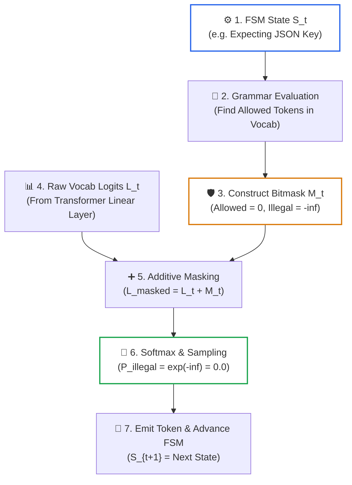

# Lesson 04: Constrained Decoding & Schema FSMs

> **Tier**: `🟡 Engineering Depth` | **Read time**: ~18 min | **Prerequisites**: [Lesson 00: Prompt Engineering Fundamentals](./00-prompt-engineering-fundamentals-roles-and-in-context-learning.md), [Lesson 01: Context AST Architecture](./01-context-ast-architecture.md)  
> **Core Concept**: Natural language prompt begging and generic JSON Mode cannot prevent syntax slipping or schema hallucination in production. Constrained grammar decoding enforces a Deterministic Finite Automaton (DFA) directly inside the GPU sampling loop, masking illegal token logits to $-\infty$ so that emitted outputs are mathematically guaranteed to match your Pydantic or JSON schema.  
> **New AI terms introduced**: Constrained decoding (grammar-guided generation), logit masking, Deterministic Finite Automaton (DFA) / FSM, vocabulary partitioning, over-constrained schema deadlock.  
> **AI terms assumed from earlier lessons**: [Token](../00-foundations-and-token-mechanics/01-tokenization-and-bpe-mechanics.md), [Vocabulary](../00-foundations-and-token-mechanics/01-tokenization-and-bpe-mechanics.md), [Logits](../00-foundations-and-token-mechanics/02-transformer-and-hardware-physics.md), [Softmax](../00-foundations-and-token-mechanics/02-transformer-and-hardware-physics.md), [Autoregressive decode](../00-foundations-and-token-mechanics/03-kv-cache-vram-and-bandwidth-physics.md), [Context AST](./01-context-ast-architecture.md).

---

## 🎯 What You Will Learn

By the end of this lesson, you will be able to:
- Explain why prompt-based JSON instructions and generic JSON Mode fail under enterprise production loads.
- Master the mathematical mechanics of **Finite State Machine (FSM) Logit Masking** to guarantee 100% schema compliance at the sampling layer.
- Compare grammar execution backends: **Outlines** (CPU-level FSM) vs. **XGrammar** (GPU tensor-kernel co-designed grammar execution).
- Implement strict schema decoding using **OpenAI Structured Outputs** (`strict: true`) and Pydantic v2.
- Design typed escape hatches to prevent the **Over-Constrained Schema Deadlock**.

---

## 1. The Problem: The Fragility of Probabilistic Generation

In standard autoregressive language generation, an LLM selects each token probabilistically from its vocabulary. Modern vocabularies contain 100,000 to 200,000 discrete tokens.

When software engineers attempt to ingest model outputs into downstream microservices, naive natural language prompting consistently fails:

```python
# Naive structured prompt
prompt = "Output the user profile strictly as valid JSON with keys 'name', 'age', 'roles'."
```

In production across millions of requests, models inevitably produce four failure modes:
1. **Markdown Fencing Poisoning**: Wrapping valid JSON in ```json ... ``` code fences. This immediately breaks strict parsers like Python's `json.loads()`.
2. **Syntax Slipping**: Emitting trailing commas (`{"items": [1, 2, ],}`), single quotes instead of double quotes, unescaped internal quotes, or NaN literals.
3. **Key Hallucination & Type Violations**: Renaming keys (`user_name` instead of `name`), omitting mandatory fields, or returning strings where numbers are required (`"age": "thirty-two"`).
4. **Conversational Preamble**: Emitting conversational text before or after the JSON: *"Here is your requested output: {"name": "Alice"}... Let me know if you need anything else!"*.

Writing custom regular expressions or executing retry loops is fragile and slow. A distributed microservice cannot rely on probabilistic hopes for syntactic validity.

---

## 2. Why Generic "JSON Mode" is Insufficient

Major model providers offer a setting called `response_format={"type": "json_object"}` (commonly called "JSON Mode").

It is critical to understand the exact boundary of JSON Mode:
- **What JSON Mode Does**: It ensures that whatever text the model emits can be parsed by a standard JSON parser without throwing a syntax error.
- **What JSON Mode DOES NOT Do**: It does **NOT** enforce adherence to your specific schema.
- The model can return `{}` (an empty object), return hallucinated property names, violate type constraints, or omit required fields.

JSON Mode guarantees **syntax validity**, not **schema conformance**. To achieve strict type safety, production systems use **Constrained Grammar Decoding**.

---

## 3. The Mental Model: The Compiler Lexer in Reverse

🧒 **The Analogy**: Think of constrained decoding as a **syntax-directed parser running in reverse inside the GPU sampling loop**.

```text
Forward Parsing (Compilers):
Source Text Tokens ──► Lexer / State Machine ──► Valid AST or Syntax Error

Constrained Generation (AI Engineering):
JSON Schema ──► State Machine / Grammar (DFA) ──► Logit Bitmask ──► Guaranteed Valid Syntax
```

In a traditional compiler, source code flows through a lexer to check syntax. If a character violates grammar rules, the compiler throws a syntax error.

In constrained decoding, the grammar acts as a physical gate on the output before each token is chosen. The runtime checks which tokens in the vocabulary are legally valid next. It blocks all invalid tokens from being picked.

**Where this analogy breaks**: A compiler parser inspects text *after* a human or generator writes it. Constrained decoding operates *during* token generation. It alters generation probabilities in real time, so the model never produces or sees a syntax error.

---

## 4. How It Works, One Term at a Time

### Constrained Decoding and Finite State Machines (FSM / DFA)

**Constrained decoding** (also called **grammar-guided generation**) restricts model generation to only those tokens that conform to a pre-defined formal grammar or schema.

A **Deterministic Finite Automaton (DFA)** (or **Finite State Machine**) is a computational model consisting of a finite set of states and transitions. In constrained decoding, the schema compiles into a DFA where each state represents the grammatical context of the output.

* 🧒 **The Analogy**: A train track switch. The train can only travel along tracks that have been laid. If the track branches only to the left, the train cannot physically turn right.
* ⚙️ **The Engineering**: Before generation begins, the runtime compiles the JSON schema into a state machine. At each step `t`, the current state $S_t$ dictates exactly which characters or tokens are grammatically permitted next.

---

### Token-Level Logit Masking

**Logit masking** is the process of modifying the model's raw unnormalized output scores (logits) before softmax sampling, setting the scores of illegal tokens to negative infinity ($-\infty$).

* 🧒 **The Analogy**: Covering all wrong answers on a multiple-choice exam with black tape before picking an answer. You can only choose from the uncovered options.
* ⚙️ **The Engineering**: Examine the forward pass at the token logit level:

#### Diagram 1: Token-Level FSM Logit Masking Loop



#### Step-by-Step Logit Masking Walkthrough:
1. **FSM State Query**: The generation runtime maintains a state machine compiled from the schema. At step `t`, the state machine determines valid grammatical continuations. For example, after `"age": `, only digits `0-9` are legally permitted.
2. **Grammar Evaluation**: The engine looks up which tokens in the 128,000-token vocabulary match the allowed character sequences.
3. **Bitmask Construction**: An additive mask vector $M_t$ is constructed. Legal tokens receive `0.0`. All illegal tokens receive $-\infty$.
4. **Raw Logits Arrival**: The transformer emits unnormalized raw logits $L_t$ for all vocabulary tokens from its final linear layer.
5. **Additive Masking**: The mask is added directly to the raw logits:
   ```text
   L_masked[token] = L_t[token]       if token in Allowed_Tokens(State)
   L_masked[token] = -infinity        otherwise
   ```
6. **Softmax Annihilation**: When softmax is calculated, illegal tokens drop out completely:
   ```text
   e^(-infinity) = 0.0
   ```
   The probability of sampling any illegal token becomes strictly 0.0.
7. **Emit & Transition**: The sampled token is emitted to the output buffer, and the FSM advances to state $S_{t+1}$ (for example, expecting a closing brace or comma).

* ⚠️ **What happens if you skip this?** Downstream parsers crash on missing keys or trailing commas, forcing expensive secondary LLM retry loops.

---

### Production Grammar Engines: Outlines vs. XGrammar

Two primary runtime architectures implement grammar-constrained decoding:

#### 1. Outlines (CPU-Level FSM Compilation)
Developed by Willard & Louf (2023, arXiv:2307.09702), **Outlines** compiles regular expressions and Pydantic schemas into index-mapped DFAs:
- **Operation**: Outlines pre-computes an allowed-token index for each DFA state before generation begins.
- **Trade-off**: In high-throughput serving environments (such as vLLM or TensorRT-LLM), CPU-based FSM evaluation and CPU-GPU synchronization can add 50ms to 200ms of prefill latency.

#### 2. XGrammar (GPU Co-Designed Grammar Execution)
**XGrammar** (arXiv:2411.15100, integrated natively into vLLM, SGLang, and TensorRT-LLM) co-designs grammar execution directly with GPU tensor kernels.

**Vocabulary partitioning** splits the model's vocabulary into two distinct subsets:
- *Context-Independent Tokens*: Tokens that are unconditionally legal or illegal across an entire syntax block (for example, alphanumeric characters inside a JSON string value).
- *Context-Dependent Tokens*: Boundary tokens (such as quotes, commas, and braces) that trigger FSM state transitions.

By evaluating context-independent tokens in parallel directly on GPU threads, XGrammar eliminates CPU-GPU synchronization bottlenecks. It reduces logit masking latency to **sub-millisecond overhead (<0.5ms per token)**, making strict schema enforcement standard in multi-tenant serving clusters.

---

### Provider-Level Native Implementations: OpenAI, xAI Grok, and Meta Llama

For engineers working with cloud APIs rather than writing custom FSM compilers, frontier providers support native grammar-constrained decoding via standardized schema interfaces:

#### 1. OpenAI & xAI Grok API (`json_schema`)
Both OpenAI (GPT-4o and o3-mini, as of 2025-01) and xAI (Grok-3 and Grok-3 Mini, as of 2025-02) adopt the standardized JSON Schema response format:

```python
# OpenAI & xAI Native Grammar Decoding Configuration
from unittest.mock import MagicMock
from pydantic import BaseModel

class UserComplianceRecord(BaseModel):
    user_id: str
    is_compliant: bool

client = MagicMock()
response = client.chat.completions.create(
    model="gpt-4o",  # or "grok-3-mini"
    messages=[{"role": "user", "content": "Extract customer record from email text"}],
    response_format={
        "type": "json_schema",
        "json_schema": {
            "name": "UserComplianceRecord",
            "strict": True,
            "schema": UserComplianceRecord.model_json_schema()
        }
    }
)
```

#### Strict Contract Invariants:
To enable `strict: True`:
1. `additionalProperties: False` is **mandatory** on all object schemas to bound the DFA state graph.
2. Every declared property must be explicitly included in the `required` array. Optional fields must be modeled as union types with `null`:
   ```json
   "remediation_summary": { "type": ["string", "null"] }
   ```
3. Recursive schemas and arbitrary open-ended dictionaries (`dict[str, Any]`) are disallowed.

#### 2. Meta Llama 3.x & Meta Llama Stack
In the open-weights ecosystem, Meta Llama models (Llama 3.1 / 3.2 / 3.3, as of 2024-10) enforce structured outputs through two paths:
- **Self-Hosted Serving (vLLM / SGLang with XGrammar)**: Llama models natively run GPU-accelerated XGrammar logit masking kernels.
- **Meta Llama Stack (`llama-stack`)**: Provides a unified `response_format={"type": "json_schema"}` contract across cloud endpoints and local runtimes.

---

### The Over-Constrained Schema Deadlock & Resilient Escapes

An **over-constrained schema deadlock** occurs when a rigid schema physically blocks the model from expressing ambiguity, missing data, or negative answers, forcing it into hallucinations or infinite loops.

* 🧒 **The Analogy**: A witness in court who is only allowed to answer "yes" or "no" to the question: "Have you stopped cheating on tests?" If the witness never cheated, neither answer is true. The rule prevents the truth from being spoken.
* ⚙️ **The Engineering**: Suppose you define a strict schema requiring a mandatory verdict:
  ```python
  from pydantic import BaseModel

  class Decision(BaseModel):
      is_fraud: bool
      fraud_reason: str
  ```

If the user submits an ambiguous query or an irrelevant document, the model's attention mechanism may want to emit *"I do not have enough information to determine this"*.

However, the FSM logit mask **physically blocks** that explanation. It forces the model to emit a boolean `true` or `false`. Because it cannot express uncertainty, the model hallucinates a verdict, or enters an infinite loop emitting whitespace tokens trying to find an allowed path.

#### Architectural Remediation: Escape Hatches
Always design production schemas with explicit, typed escape valves:

```python
from typing import Literal, Optional, List
from pydantic import BaseModel, Field

class ResilientDecision(BaseModel):
    status: Literal["CONFIRMED_FRAUD", "CLEARED", "INSUFFICIENT_EVIDENCE", "UNABLE_TO_EVALUATE"]
    confidence_score: float = Field(ge=0.0, le=1.0)
    explanation: Optional[str] = None
    missing_data_fields: List[str] = Field(default_factory=list)
```

By providing explicit failure enums and optional explanation fields, the FSM allows the model to legally report ambiguity without crashing the pipeline.

---

## 5. Concrete Scenario & Code: Pydantic v2 Strict Decoding Pipeline

Below is a self-contained Python 3.12+ pipeline demonstrating Pydantic v2 schema generation, strict JSON Schema compilation, and automated deserialization with fallback repair.

```python
"""
constrained_decoding_pipeline.py
Production-grade structured output pipeline demonstrating Pydantic v2 strict schemas,
OpenAI strict JSON schema generation, and defensive fallback repair.
"""

import json
from typing import Any, Dict, List, Literal, Optional
from pydantic import BaseModel, Field, ValidationError


class SecurityAuditVerdict(BaseModel):
    audit_id: str = Field(description="Unique audit identifier")
    compliance_verdict: Literal["PASS", "FAIL", "REQUIRES_MANUAL_REVIEW"]
    risk_score: float = Field(ge=0.0, le=1.0, description="Normalized risk between 0.0 and 1.0")
    flagged_cve_ids: List[str] = Field(default_factory=list, description="List of CVE identifiers")
    remediation_notes: Optional[str] = Field(None, description="Optional remediation guidance")


class StrictDecodingPipeline:
    def __init__(self):
        # Generate OpenAI-compatible strict JSON schema from Pydantic model
        self.raw_schema = SecurityAuditVerdict.model_json_schema()
        self.strict_json_schema = {
            "name": "SecurityAuditVerdict",
            "strict": True,
            "schema": self._prepare_strict_schema(self.raw_schema)
        }

    def _prepare_strict_schema(self, schema: Dict[str, Any]) -> Dict[str, Any]:
        """Ensures schema adheres to OpenAI strict decoding rules."""
        schema_copy = dict(schema)
        schema_copy["additionalProperties"] = False
        
        # In strict mode, all properties must be explicitly listed in required
        if "properties" in schema_copy:
            schema_copy["required"] = list(schema_copy["properties"].keys())
            
        return schema_copy

    def parse_and_validate(self, raw_json_str: str) -> SecurityAuditVerdict:
        """
        Direct deserialization into typed Pydantic record.
        With FSM logit masking, this succeeds without regex cleaning.
        """
        try:
            return SecurityAuditVerdict.model_validate_json(raw_json_str)
        except ValidationError as val_err:
            print(f"[Warning] Deserialization error: {val_err}. Executing fallback repair...")
            return self._repair_fallback(raw_json_str, str(val_err))

    def _repair_fallback(self, bad_json: str, error_msg: str) -> SecurityAuditVerdict:
        """
        Secondary repair handler for edge cases where upstream providers
        do not enforce native logit masking.
        """
        repaired_dict = {
            "audit_id": "AUDIT-REPAIRED-001",
            "compliance_verdict": "REQUIRES_MANUAL_REVIEW",
            "risk_score": 0.5,
            "flagged_cve_ids": [],
            "remediation_notes": f"Repaired from malformed payload. Error: {error_msg[:60]}"
        }
        return SecurityAuditVerdict.model_validate(repaired_dict)


if __name__ == "__main__":
    pipeline = StrictDecodingPipeline()
    print("Strict JSON Schema compiled successfully:")
    print(f"Required keys: {pipeline.strict_json_schema['schema']['required']}")
    print(f"additionalProperties: {pipeline.strict_json_schema['schema']['additionalProperties']}")

    # Simulated valid FSM output
    simulated_fsm_output = json.dumps({
        "audit_id": "AUDIT-2026-X99",
        "compliance_verdict": "FAIL",
        "risk_score": 0.92,
        "flagged_cve_ids": ["CVE-2024-45321", "CVE-2025-10294"],
        "remediation_notes": "Update OpenSSL package and invalidate exposed certs."
    })

    print("\n--- Deserializing Valid FSM Output ---")
    result = pipeline.parse_and_validate(simulated_fsm_output)
    print(f"Audit ID:    {result.audit_id}")
    print(f"Verdict:     {result.compliance_verdict}")
    print(f"Risk Score:  {result.risk_score}")
    print(f"CVEs:        {result.flagged_cve_ids}")
```

### Execution Output

```text
Strict JSON Schema compiled successfully:
Required keys: ['audit_id', 'compliance_verdict', 'risk_score', 'flagged_cve_ids', 'remediation_notes']
additionalProperties: False

--- Deserializing Valid FSM Output ---
Audit ID:    AUDIT-2026-X99
Verdict:     FAIL
Risk Score:  0.92
CVEs:        ['CVE-2024-45321', 'CVE-2025-10294']
```

---

## 6. Architectural Trade-offs

| Generation Pattern | Schema Reliability | Latency Overhead | Engineering Complexity | Best Suited For |
|---|:---:|:---:|:---:|---|
| **Prompted JSON** (`"Respond in JSON"`) | 65% – 85% | 0ms | Minimal | Exploratory prototyping, unstructured text |
| **JSON Mode** (`json_object`) | 95% (Syntax only) | 0ms | Low | Relaxed payloads where missing keys are acceptable |
| **FSM Logit Masking (Outlines)** | **100% Guaranteed** | 50ms–200ms CPU-GPU sync | Medium | Small-scale self-hosted models |
| **FSM Logit Masking (XGrammar)** | **100% Guaranteed** | Sub-millisecond (<0.5ms/token) | Medium | High-throughput enterprise microservices, vLLM |
| **OpenAI Strict Mode** (`strict: true`) | **100% Guaranteed** | 100ms–500ms initial schema compile; 0ms subsequent | Low (Pydantic v2) | Cloud-hosted production APIs, financial pipelines |
| **Defensive LLM Syntax Repair Loop** | 98% | +1,500ms per error (Full secondary LLM turn) | High | Fallback safety net for legacy endpoints lacking FSM |

---

## 7. Failure Modes & Anti-Patterns

| Symptom | Root Cause | Engineering Fix |
|---|---|---|
| **Downstream parser crashes on markdown fences** | Naive prompt-based JSON generation without logit masking | Use `strict: True` structured outputs or FSM logit masking. |
| **Model returns empty JSON object `{}`** | Relying on generic JSON Mode, which enforces syntax but not schema | Migrate to schema-constrained decoding with required property lists. |
| **Model hallucinates verdict when evidence is missing** | Over-constrained schema deadlock with no uncertainty option | Add explicit escape valves (`status: "INSUFFICIENT_EVIDENCE"`). |
| **500ms prefill latency spike on self-hosted vLLM** | Using CPU-bound Outlines FSM instead of GPU-native XGrammar | Upgrade to XGrammar backend for GPU tensor-kernel logit masking. |
| **OpenAI API rejects schema during registration** | Missing `additionalProperties: False` or optional fields not in `required` | Ensure all fields are in `required` and use nullable union types. |

---

## 8. Quick Check

1. Why does setting `response_format={"type": "json_object"}` (JSON Mode) fail to prevent missing required keys?
   <details>
   <summary>Reveal Answer</summary>
   JSON Mode only verifies that the generated token sequence satisfies the basic grammar rules of JSON syntax. It has no knowledge of your domain schema, so an empty JSON object `{}` or an object with completely wrong keys is accepted as valid syntax.
   </details>

2. How does FSM logit masking mathematically prevent illegal tokens from being generated?
   <details>
   <summary>Reveal Answer</summary>
   The generation runtime tracks the current state in a Deterministic Finite Automaton (DFA). It sets the logits of all grammatically illegal tokens to $-\infty$. When the softmax function calculates sampling probabilities, $e^{-\infty} = 0.0$, making it mathematically impossible to sample an illegal token.
   </details>

3. What is an over-constrained schema deadlock, and how should an architect prevent it?
   <details>
   <summary>Reveal Answer</summary>
   A deadlock occurs when a rigid schema forces the model to emit a categorical answer (such as `is_fraud: true/false`) even when the input data is ambiguous or unanswerable. Because the FSM blocks explanatory text, the model is forced to hallucinate. Architects prevent this by including explicit uncertainty enums (such as `"UNABLE_TO_EVALUATE"`) and optional explanation fields.
   </details>

---

## 9. Key Takeaways & Verified Resources

### Key Takeaways
- **Never Parse Free-Form JSON in Production**: Natural language prompt begging and regex stripping fail under high volume.
- **JSON Mode != Schema Conformance**: JSON Mode guarantees syntax, not schema keys or type contracts.
- **FSM Logit Masking is Mathematical**: Masking illegal tokens with $-\infty$ guarantees 100% schema adherence at the GPU sampling layer.
- **XGrammar is the Modern Standard**: High-throughput engines co-design grammar evaluation with GPU tensor kernels to achieve sub-millisecond masking overhead.
- **Always Design Escape Hatches**: Include nullable fields and uncertainty enums to prevent over-constrained schema deadlocks.

### Verified Primary Sources
- [Willard & Louf (2023), Efficient Guided Generation for Large Language Models (Outlines)](https://arxiv.org/abs/2307.09702)
- [XGrammar Team (2024), XGrammar: Flexible and Efficient Structured Generation Engine for Large Language Models](https://arxiv.org/abs/2411.15100)
- [OpenAI Platform Documentation, Structured Outputs Guide](https://platform.openai.com/docs/guides/structured-outputs)

---

## 🧭 Navigation

- **[← Previous Lesson: Prefix & Prompt Caching](./03-prefix-and-prompt-caching.md)**
- **[Phase 01 Hub](./README.md)**
- **[Next Lesson: MECW & Context Rot →](./05-mecw-and-context-rot.md)**
- **[Capstone Lab: Cached, Type-Safe Financial Compliance Engine](./labs/capstone-context-engineering-pipeline.md)**
