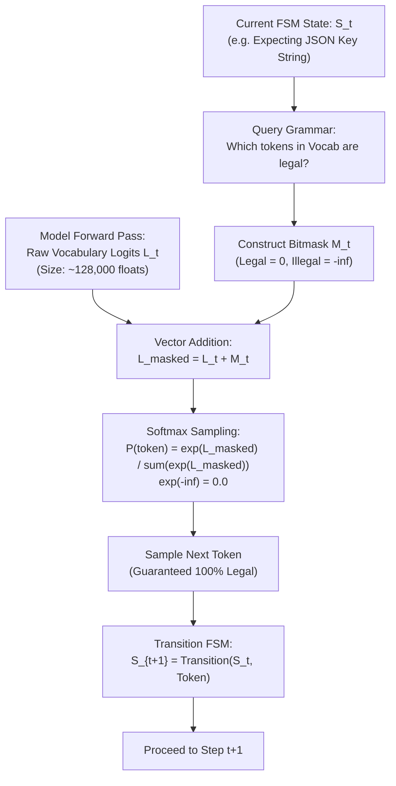

# Lesson 04: Constrained Decoding & Schema FSMs

`🟡 Engineering Depth` · *Phase 01: Prompt & Context Engineering* · *Estimated Reading Time: 11 minutes*

---

## 🎯 What You Will Learn

By the end of this lesson, you will be able to:
- Explain why prompt-based JSON instructions and generic "JSON Mode" fail under production enterprise load.
- Master the mathematical mechanics of **Finite State Machine (FSM) Logit Masking** to guarantee 100% schema compliance at the sampling layer.
- Compare grammar execution backends: **Outlines** (CPU-level FSM) vs. **XGrammar** (GPU co-designed grammar execution).
- Implement strict schema decoding using **OpenAI Structured Outputs** (`strict: true`) and Pydantic v2.
- Design escape hatches to prevent the **Over-Constrained Schema Deadlock**.

---

## 1. The Problem: The Fragility of Probabilistic Generation

In standard autoregressive language generation, an LLM selects each token probabilistically from its entire vocabulary (often 100,000 to 200,000 discrete tokens). When software engineers attempt to ingest model outputs into downstream microservices, naive natural language prompting consistently fails:

```python
# Naive structured prompt
prompt = "Output the user profile strictly as valid JSON with keys 'name', 'age', 'roles'."
```

In production across millions of requests, models will inevitably produce:
- **Markdown Fencing Poisoning**: Wrapping valid JSON in ```json ... ``` blocks, which immediately breaks strict parsers like Python's `json.loads()` or C#'s `JsonSerializer.Deserialize()`.
- **Syntax Slipping**: Emitting trailing commas (`{"items": [1, 2, ],}`), single quotes instead of double quotes, unescaped internal quotes, or NaN literals.
- **Key Hallucination & Type Violations**: Renaming keys (`user_name` instead of `name`), omitting mandatory fields, or returning strings where integers are required (`"age": "thirty-two"`).
- **Conversational Preamble**: Emitting conversational text before or after the JSON: *"Here is your requested output: {"name": "Alice"}... Let me know if you need anything else!"*.

Writing custom regex cleaners or executing retry loops is a fragile, high-latency workaround. A distributed microservice cannot rely on probabilistic hopes for syntactic validity.

---

## 2. Why Generic "JSON Mode" is Insufficient

Major LLM providers offer a setting called `response_format={"type": "json_object"}` (often marketed as "JSON Mode").

It is critical for software architects to understand the boundary of JSON Mode:
- **What JSON Mode Does**: It ensures that whatever text the model emits can be parsed by a generic JSON parser without throwing a syntax error.
- **What JSON Mode DOES NOT Do**: It does **NOT** enforce adherence to your specific schema.
- The model can return `{}` (an empty object), return completely hallucinated properties, violate required type constraints, or drop mandatory fields.

JSON Mode guarantees **syntax validity**, not **schema conformance**. To achieve strict type safety, we must move to **Constrained Grammar Decoding**.

---

## 3. Systems Mental Model: The Compiler Lexer & Pushdown Automaton

Think of constrained decoding as a **syntax-directed parser running in reverse inside the GPU sampling loop**:

```text
Forward Parsing (Compilers):
Source Text Tokens ──► Lexer / State Machine ──► Valid AST or Syntax Error

Constrained Generation (Software 3.0):
JSON Schema ──► State Machine / Grammar (DFA) ──► Logit Bitmask ──► Guaranteed Valid Syntax
```

Instead of allowing the model to choose any token from its 128,000-token vocabulary, the runtime evaluates a **Deterministic Finite Automaton (DFA)** or Context-Free Grammar (CFG) at every single token step `t`. The DFA acts as an active gatekeeper: it marks illegal tokens with probability `0` before the GPU executes softmax sampling.

---

## 4. Mechanical Deep Dive: Token-Level FSM Logit Masking

To understand how constrained decoding guarantees schema adherence without retraining or fine-tuning, examine the forward pass at the token logit level:



### Step-by-Step Logit Masking Walkthrough:
1. **FSM State Query**: The generation runtime maintains a state machine compiled from the target JSON Schema. At step `t`, the state machine determines the exact set of valid grammatical continuations (e.g., if the model just emitted `"age": `, only digits `0-9` are legally permitted next).
2. **Logit Mask Construction**: The runtime builds an additive mask vector `M_t` matching the model's vocabulary size (e.g., 128,000 dimensions). Legal tokens receive a value of `0.0`; all illegal tokens receive `-inf` (negative infinity).
3. **Additive Masking**: The mask is added directly to the raw, unnormalized logits vector `L_t` emitted by the transformer's final linear layer:
   ```text
   L_masked[token] = L_t[token]       if token in Allowed_Tokens(State)
   L_masked[token] = -infinity        otherwise
   ```
4. **Softmax Annihilation**: When softmax is computed across `L_masked`, illegal tokens undergo mathematical annihilation:
   ```text
   e^(-infinity) = 0.0
   ```
   The probability of sampling any illegal token becomes strictly `0.0`.
5. **State Transition**: The sampled token is emitted, and the FSM transitions to its next state `S_{t+1}` (e.g., expecting a comma or closing brace).

Under this architecture, it is mathematically impossible for the model to emit a syntax error, an unescaped string, or a hallucinated key.

---

## 5. Production Grammar Engines: Outlines vs. XGrammar

Two primary runtime architectures implement grammar-constrained decoding:

### 1. Outlines (Python-Level FSM Compilation)
Developed by .txt and Willard & Louf (2023), **Outlines** compiles regular expressions and Pydantic schemas into index-mapped Deterministic Finite Automata (DFAs).
- **How It Operates**: Outlines pre-computes an allowed-token index for each DFA state before generation begins.
- **Limitation**: In high-throughput serving environments (such as vLLM or TensorRT-LLM), Outlines' Python-based FSM evaluation and CPU-GPU synchronization can add 50ms to 200ms of prefill latency overhead.

### 2. XGrammar (2026 Production Standard for High-Throughput Engines)
**XGrammar** (arXiv:2411.15100, integrated natively into vLLM, SGLang, and TensorRT-LLM) co-designs grammar execution directly with GPU tensor kernels.
- **Vocabulary Partitioning**: XGrammar separates the model's vocabulary into:
  - *Context-Independent Tokens*: Tokens that are unconditionally legal or illegal across an entire syntax block (e.g., alphanumeric characters inside a JSON string value).
  - *Context-Dependent Tokens*: Boundary tokens (e.g., quotes, commas, braces) that trigger state transitions.
- **GPU Kernel Execution**: By evaluating context-independent tokens in parallel directly on GPU threads, XGrammar eliminates CPU-GPU synchronization bottlenecks.
- **Performance**: Reduces logit masking latency to **sub-millisecond overhead (< 0.5ms per token)**, making strict schema enforcement standard in multi-tenant serving clusters.

---

## 6. Provider-Level Native Implementation: OpenAI Structured Outputs

For engineers utilizing cloud APIs rather than self-hosting vLLM, OpenAI formalized native grammar-constrained decoding via **Structured Outputs**:

```json
{
  "type": "json_schema",
  "json_schema": {
    "name": "UserComplianceRecord",
    "strict": true,
    "schema": { ... }
  }
}
```

### The Strict Contract Rules:
To enable `strict: true`, OpenAI compiles the JSON Schema into a grammar DFA on their backend. This imposes strict architectural constraints:
1. `additionalProperties: false` is **mandatory** on all object schemas.
2. Every declared property must be explicitly included in the `required` array. Optional fields must be modeled as union types with `null`:
   ```json
   "remediation_summary": { "type": ["string", "null"] }
   ```
3. Recursive schemas and arbitrary open-ended dictionaries (`dict[str, Any]`) are disallowed.

---

## 7. The Over-Constrained Schema Trap & Resilient Escapes

While FSM logit masking guarantees syntactical compliance, it introduces a dangerous operational hazard: **The Over-Constrained Deadlock**.

### The Deadlock Failure Mode:
Suppose you define a strict schema requiring a mandatory verdict:
```python
class Decision(BaseModel):
    is_fraud: bool
    fraud_reason: str
```

If the user submits an ambiguous query or a non-English document, the model's internal attention mechanism may want to emit *"I do not have enough information to determine this"*. 

However, the FSM logit mask **physically forbids** the model from emitting that explanation. It forces the model to emit a boolean `true` or `false`. Because it cannot express uncertainty, the model is forced into a high-confidence hallucination, or it enters an infinite loop emitting whitespace tokens trying to find an allowed path.

### Architectural Remediation: Escape Hatches
Always design production schemas with explicit, typed escape valves:

```python
class ResilientDecision(BaseModel):
    status: Literal["CONFIRMED_FRAUD", "CLEARED", "INSUFFICIENT_EVIDENCE", "UNABLE_TO_EVALUATE"]
    confidence_score: float = Field(ge=0.0, le=1.0)
    explanation: Optional[str] = None
    missing_data_fields: List[str] = Field(default_factory=list)
```

By providing explicit failure enums and optional explanation fields, the FSM allows the model to legally report ambiguity without crashing the pipeline.

---

## 8. Comparative Trade-off Matrix

| Generation Pattern | Schema Reliability | Latency Overhead | Engineering Complexity | Best Suited For |
|---|:---:|:---:|:---:|---|
| **Prompted JSON** (`"Respond in JSON"`) | 65% – 85% | 0ms | Minimal | Exploratory prototyping, unstructured text |
| **JSON Mode** (`json_object`) | 95% (Syntax only) | 0ms | Low | Relaxed payloads where missing keys are acceptable |
| **FSM Logit Masking (Outlines / XGrammar)** | **100% Guaranteed** | Sub-millisecond (XGrammar) to 50ms (Outlines) | Medium | High-throughput enterprise microservices, self-hosted vLLM |
| **OpenAI Strict Mode** (`strict: true`) | **100% Guaranteed** | 100ms–500ms initial schema compile; 0ms subsequent | Low (Pydantic v2) | Cloud-hosted production APIs, financial/compliance pipelines |
| **Defensive LLM Syntax Repair Loop** | 98% | +1,500ms per error (Full secondary LLM turn) | High | Fallback safety net for legacy endpoints lacking FSM support |

---

## 9. Concrete Implementation: Pydantic v2 Strict Decoding Pipeline

Below is a complete, runnable Python 3.12+ pipeline demonstrating Pydantic v2 schema generation, OpenAI Structured Outputs execution, and a secondary defensive fallback repair handler.

```python
"""
constrained_decoding_pipeline.py
Production-grade structured output pipeline demonstrating Pydantic v2 strict schemas,
OpenAI strict JSON schema generation, and defensive fallback repair.
"""

import json
import os
from typing import Any, Dict, List, Literal, Optional
from pydantic import BaseModel, Field, ValidationError


# 1. Define Strict Pydantic Model
class SecurityAuditVerdict(BaseModel):
    audit_id: str = Field(description="Unique audit identifier")
    compliance_verdict: Literal["PASS", "FAIL", "REQUIRES_MANUAL_REVIEW"]
    risk_score: float = Field(ge=0.0, le=1.0, description="Normalized risk between 0.0 and 1.0")
    flagged_cve_ids: List[str] = Field(default_factory=list, description="List of CVE identifiers")
    remediation_notes: Optional[str] = Field(None, description="Optional remediation guidance")


class StrictDecodingPipeline:
    def __init__(self):
        # Generate OpenAI-compatible strict JSON schema from Pydantic model
        self.raw_schema = SecurityAuditVerdict.model_json_schema()
        self.strict_json_schema = {
            "name": "SecurityAuditVerdict",
            "strict": True,
            "schema": self._prepare_strict_schema(self.raw_schema)
        }

    def _prepare_strict_schema(self, schema: Dict[str, Any]) -> Dict[str, Any]:
        """Ensures schema adheres to OpenAI strict decoding rules."""
        schema_copy = dict(schema)
        schema_copy["additionalProperties"] = False
        
        # In strict mode, all properties must be in required
        if "properties" in schema_copy:
            schema_copy["required"] = list(schema_copy["properties"].keys())
            
        return schema_copy

    def parse_and_validate(self, raw_json_str: str) -> SecurityAuditVerdict:
        """
        Direct deserialization into typed Pydantic record.
        With FSM logit masking, this succeeds without regex cleaning.
        """
        try:
            return SecurityAuditVerdict.model_validate_json(raw_json_str)
        except ValidationError as val_err:
            print(f"[Warning] Deserialization error: {val_err}. Executing fallback repair...")
            return self._repair_fallback(raw_json_str, str(val_err))

    def _repair_fallback(self, bad_json: str, error_msg: str) -> SecurityAuditVerdict:
        """
        Secondary repair handler for edge cases where upstream providers
        do not enforce native logit masking.
        """
        # Mock defensive repair logic
        repaired_dict = {
            "audit_id": "AUDIT-REPAIRED-001",
            "compliance_verdict": "REQUIRES_MANUAL_REVIEW",
            "risk_score": 0.5,
            "flagged_cve_ids": [],
            "remediation_notes": f"Repaired from malformed payload. Parsing error: {error_msg[:100]}"
        }
        return SecurityAuditVerdict.model_validate(repaired_dict)


# --- Cross-Language Enterprise Demonstration ---
# For .NET 9 enterprise architectures, review the standalone C# console harness in:
# examples/StrictJsonPipeline.cs (Demonstrates Azure.AI.OpenAI ChatResponseFormat with strict: true)

if __name__ == "__main__":
    pipeline = StrictDecodingPipeline()
    print("Strict JSON Schema compiled successfully for provider registration:")
    print(json.dumps(pipeline.strict_json_schema, indent=2))

    # Test 1: Perfectly constrained FSM output
    simulated_fsm_output = json.dumps({
        "audit_id": "AUDIT-2026-X99",
        "compliance_verdict": "FAIL",
        "risk_score": 0.92,
        "flagged_cve_ids": ["CVE-2024-45321", "CVE-2025-10294"],
        "remediation_notes": "Update OpenSSL package and invalidate exposed certs."
    })

    print("\n--- Deserializing Valid FSM Output ---")
    result = pipeline.parse_and_validate(simulated_fsm_output)
    print(f"Audit ID:    {result.audit_id}")
    print(f"Verdict:     {result.compliance_verdict}")
    print(f"Risk Score:  {result.risk_score}")
    print(f"CVEs:        {result.flagged_cve_ids}")
```

---

## 10. Key Takeaways & Verified Resources

### Key Takeaways
1. **Never Parse Free-Form JSON in Production**: Natural language prompt begging and regex stripping fail under high volume.
2. **JSON Mode != Schema Conformance**: JSON Mode guarantees syntax, not schema keys or type contracts.
3. **FSM Logit Masking is Mathematical**: Masking illegal tokens with `-inf` guarantees 100% schema adherence at the GPU sampling layer.
4. **XGrammar is the 2026 Standard**: High-throughput engines co-design grammar evaluation with GPU tensor kernels to achieve sub-millisecond masking overhead.
5. **Always Design Escape Hatches**: Include nullable fields and uncertainty enums to prevent over-constrained schema deadlocks.

### Verified Primary Sources
- **Willard & Louf (2023)**: *Efficient Guided Generation for Large Language Models* (Outlines paper, arXiv:2307.09702).
- **XGrammar Team (2024)**: *XGrammar: Flexible and Efficient Structured Generation to Enable LLM Deployment* (arXiv:2411.15100).
- **OpenAI Platform Documentation**: *Structured Outputs Guide* (`https://platform.openai.com/docs/guides/structured-outputs`).

---

## 🧭 Navigation

- **[← Previous Lesson: Prefix & Prompt Caching](./03-prefix-and-prompt-caching.md)**
- **[Phase 01 Hub](./README.md)**
- **[Next Lesson: MECW & Context Rot →](./05-mecw-and-context-rot.md)**
- **[Capstone Lab: Cached, Type-Safe Financial Compliance Engine](./labs/capstone-context-engineering-pipeline.md)**
