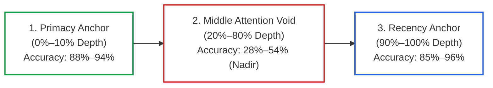
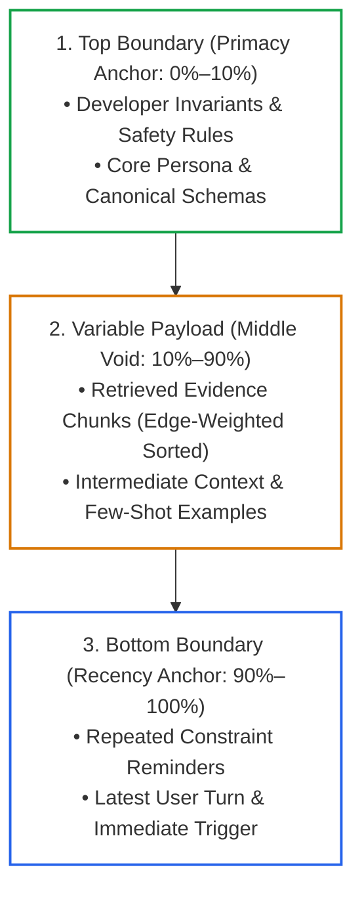

# Lesson 05: Maximum Effective Context Window (MECW) & Context Rot

> **Tier**: `🔵 Advanced` | **Read time**: ~18 min | **Prerequisites**: [Lesson 01: Context AST Architecture](./01-context-ast-architecture.md), [Lesson 02: Dynamic Token Budgeting & Compaction Pipelines](./02-token-budgeting-and-compaction.md)  
> **Core Concept**: Advertised context windows reflect physical memory capacity, not reasoning fidelity. The Maximum Effective Context Window (MECW) measures where multi-hop reasoning actually succeeds. To combat the Lost-in-the-Middle attention U-curve and multi-turn Context Rot, production architectures enforce a 50% operational ceiling, boundary pinning (dual-anchor framing), and edge-weighted positional reranking.  
> **New AI terms introduced**: Maximum Effective Context Window (MECW), context rot, attention dispersion (attention dilution), Lost-in-the-Middle U-curve, RULER benchmark, boundary pinning (dual-anchor framing), edge-weighted positional reranking.  
> **AI terms assumed from earlier lessons**: [Token](../00-foundations-and-token-mechanics/01-tokenization-and-bpe-mechanics.md), [Context window](../00-foundations-and-token-mechanics/00-what-is-an-llm.md), [Attention](../00-foundations-and-token-mechanics/02-transformer-and-hardware-physics.md), [KV cache](../00-foundations-and-token-mechanics/03-kv-cache-vram-and-bandwidth-physics.md), [Prefill](../00-foundations-and-token-mechanics/03-kv-cache-vram-and-bandwidth-physics.md), [Context AST](./01-context-ast-architecture.md), [Token budget](./02-token-budgeting-and-compaction.md).

---

## 🎯 What You Will Learn

By the end of this lesson, you will be able to:
- Distinguish between a model's **marketed context window** and its **Maximum Effective Context Window (MECW)**.
- Analyze the physics of **Attention Dispersion** and the **Lost-in-the-Middle U-Curve**.
- Evaluate models using the **RULER benchmark** methodology rather than misleading synthetic single-needle tests.
- Measure **Context Rot** and calculate the **Signal-to-Noise Ratio (SNR)** across multi-turn sessions.
- Architect production defenses: the **50% Operational Ceiling Rule**, **Boundary Pinning (Dual-Anchor Framing)**, and **Edge-Weighted Positional Reranking**.

---

## 1. The Problem: The Long-Context Illusion

Frontier model marketing frequently promotes massive context capacities. Providers advertise 128,000 tokens, 1,000,000 tokens, or even 2,000,000 tokens. This leads engineering teams into an architectural trap:

> *"Why bother designing complex RAG pipelines, chunking strategies, or compaction algorithms when we can just dump our entire 500-page enterprise knowledge base into a 1-million-token context window?"*

In production, teams that adopt this brute-force approach encounter silent, catastrophic failures:
1. **Critical Invariants Ignored**: The model answers questions confidently while completely overlooking safety policies or regulatory exceptions located in the middle of the document.
2. **Multi-Hop Reasoning Breakdown**: The model can find a single isolated keyword, but fails to synthesize facts that span across two different sections.
3. **Severe Latency and Cost Inefficiency**: Quadratic attention scaling during prefill turns interactive 1-second queries into 30-second delays costing dollars per call.

The rated context limit is a **physical capacity ceiling**, not a guarantee of **reasoning fidelity**.

---

## 2. The Mental Model: Signal-to-Noise Ratio (SNR) on a Transmission Line

🧒 **The Analogy**: Think of the context window as an **analog signal transmission line**.

```text
High SNR (Short, Dense Context):
Signal: 3,000 Task-Relevant Tokens / 4,000 Total Window Tokens = SNR: 0.75  ===> Crisp, Deterministic Attention

Low SNR / Context Rot (Massive Unpruned Dump):
Signal: 3,000 Task-Relevant Tokens / 100,000 Total Window Tokens = SNR: 0.03 ===> Signal Buried in Semantic Noise
```

As total token volume expands without a proportional increase in relevant data, the model's self-attention weights disperse across thousands of irrelevant token vectors. The probability mass assigned to the correct ground-truth tokens degrades toward the background noise floor.

**Where this analogy breaks**: On an analog electrical line, noise comes from external thermal or electromagnetic interference. In a context window, the noise is simply additional text that the model must process. The interference occurs because the attention mechanism has a finite total probability budget (summing to 1.0) that gets divided across all token pairs.

---

## 3. How It Works, One Term at a Time

### The Attention U-Curve (Lost-in-the-Middle)

The **Lost-in-the-Middle U-curve** describes the empirical drop in retrieval and reasoning accuracy when relevant information is placed in the middle of a long prompt.

* 🧒 **The Analogy**: Reading a 600-page novel in one sitting. You vividly remember the opening chapter and the dramatic ending. You struggle to remember details from page 300.
* ⚙️ **The Engineering**: Seminal research by Liu et al. (Stanford / UC Berkeley, 2023) demonstrated that large language models do not attend to context uniformly. Performance follows a pronounced U-shaped curve:

#### Diagram 1: The Attention U-Curve



#### Step-by-Step U-Curve Walkthrough:
1. **Primacy Anchor (Token Depth 0% to 10%)**: Models exhibit highest attention fidelity at the very beginning of the context. Tokens in the initial static prefix are processed early in positional encoding layers and serve as anchors for subsequent layers. Accuracy reaches 88% to 94%.
2. **The Middle Void (Token Depth 20% to 80%)**: Performance collapses in the middle of long contexts. Information located between 30% and 60% depth experiences up to a **70% drop in retrieval accuracy**, bottoming out at 28% accuracy near the 50% dead center. Models routinely hallucinate when ground-truth evidence is buried here.
3. **Recency Anchor (Token Depth 90% to 100%)**: Performance rebounds near the end of the context immediately preceding the final generation token, reaching 85% to 96% accuracy as tokens reside in immediate working attention memory.

| Token Depth Position | Location in Prompt Envelope | Empirical Retrieval Accuracy | Attention & Recency Dynamics |
| :---: | :--- | :---: | :--- |
| **0% – 10%** | Context Window Start | **94% – 88%** | Primacy Anchor (Strong attention retention from positional token 0) |
| **20% – 40%** | Upper Middle Context | **54% – 38%** | Progressive attention attenuation across multi-head projections |
| **50% (Dead Center)** | Middle Void (Nadir) | **28%** | Maximum degradation (Lost-in-the-Middle failure zone) |
| **60% – 80%** | Lower Middle Context | **35% – 62%** | Gradual recovery as distance to generation head narrows |
| **90% – 100%** | Context Window Tail | **85% – 96%** | Recency Anchor (Immediate working memory before next token emit) |

---

### Empirical Reality: Synthetic NIAH vs. The RULER Benchmark

The **Maximum Effective Context Window (MECW)** is the maximum context length at which an LLM maintains acceptable reasoning accuracy on multi-hop and aggregation tasks, typically far smaller than its rated window.

* 🧒 **The Analogy**: A truck rated to carry 10 tons of cargo. On a smooth, flat highway, it can move 10 tons of gravel. On a steep mountain switchback, it stalls out if loaded past 3 tons. The advertised limit is the flat road; the effective limit is the mountain.
* ⚙️ **The Engineering**: Model providers publish green "Needle-in-a-Haystack" (NIAH) heatmaps claiming 100% retrieval across 1,000,000 tokens. Why does production reasoning fail if NIAH benchmarks show 100% success?

#### The Synthetic NIAH Flaw
In a standard NIAH test, a single, syntactically anomalous sentence is hidden inside irrelevant text:
> *"The secret password to access the vault is 'BLUE-BANANA-42'."*

Testing whether a model can retrieve this needle is equivalent to executing a simple substring search. The high token-frequency divergence makes the needle stand out like a beacon in vector space.

#### The RULER Benchmark (COLM 2024)
To measure true enterprise capability, researchers developed **RULER** (*What's the Real Context Size of Your Long-Context Language Models?*, Hsieh et al., 2024). RULER evaluated models on multi-hop tracing, multi-variable tracking, and aggregation:

```text
Synthetic Single-Needle (NIAH):
[Haystack...] "The password is BLUE-BANANA-42" [Haystack...] ──► 100% Retrieval at 128K Tokens

Multi-Hop Tracing (RULER Benchmark):
Fact A: "Entity X transferred asset to Entity Y" (at Token 12,000)
Fact B: "Entity Y changed jurisdiction to Country Z" (at Token 48,000)
Query:  "What country currently holds Entity X's asset?" ──► Accuracy drops below 50% past 32K Tokens!
```

**The RULER Finding**: Models claiming 128K to 1M token windows frequently suffer severe degradation once context scales beyond **32,000 to 64,000 tokens** on real-world multi-hop reasoning tasks.

---

### Context Rot & Semantic Entropy

**Context rot** is the progressive degradation of model reasoning fidelity and instruction adherence as conversational history accumulates uncurated turns and noisy tool outputs.

**Attention dispersion** (or **attention dilution**) occurs when attention probability mass is scattered across thousands of tokens, reducing the weight given to any individual critical instruction.

* 🧒 **The Analogy**: A conference meeting that has dragged on for six hours. Participants are tired, notes are disorganized, and everyone forgets the decision made during the first ten minutes.
* ⚙️ **The Engineering**: Calculate the context Signal-to-Noise Ratio (SNR) across multi-turn sessions:

```text
SNR_context = Task_Relevant_Tokens / Total_Window_Tokens
```

#### Context Rot Symptoms Across Turns:
- **Turn 1 (SNR: 0.85)**: Concise, precise answers adhering strictly to developer formatting constraints.
- **Turn 10 (SNR: 0.35)**: Minor conversational drift; model begins omitting optional schema fields.
- **Turn 25 (SNR: 0.12)**: The model suffers from semantic entropy. It forgets negative constraints, contradicts its initial instructions, and hallucinates facts from historical tool returns that were invalidated turns ago.

When `SNR_context < 0.15`, the system has entered **Context Rot**. Continuing to pass historical turns without compaction is burning budget to generate hallucinations.

---

### Architectural Mitigations

Production systems deploy three primary architectural patterns to defeat the U-curve and context rot:

#### 1. The 50% Operational Ceiling Rule
Never allow production context to exceed **50% of the model's rated window** without triggering mandatory compaction or reranking:
- If a model is rated for 32,000 tokens, establish your operational high watermark at `16,000` tokens.
- Beyond 50%, attention dispersion risks outweigh the benefits of additional raw context.

#### 2. Boundary Pinning (Dual-Anchor Framing)
**Boundary pinning** (also called **dual-anchor framing**) places foundational rules at the top boundary (Primacy Anchor) and injects critical constraint reminders directly above the generation prompt at the bottom boundary (Recency Anchor).

#### Diagram 2: Boundary Pinning Layout



#### Step-by-Step Boundary Pinning Walkthrough:
1. **Primacy Anchor (Top 10%)**: Place fundamental behavioral contracts and developer rules at Token 0. This ensures high cross-attention weighting during initial prefill.
2. **Variable Payload (Middle Void)**: Place retrieved reference documents and historical context in the middle, but never leave critical decision logic unassisted here.
3. **Recency Anchor (Bottom 10%)**: Directly above the final generation prompt, inject a concise **Constraint Reminder Tag**:
   ```xml
   <critical_constraints>
   REMINDER: Verify all transactions exceed $50,000 before approving. Output strictly in ComplianceAuditReport JSON.
   </critical_constraints>
   ```
   This recency anchor pulls the model's attention back to core rules immediately before token generation begins.

#### 3. Edge-Weighted Positional Reranking
**Edge-weighted positional reranking** sorts retrieved evidence chunks so highest-confidence documents sit at the outer boundaries (head and tail), keeping lower-confidence text in the middle void.

Naive systems insert retrieved RAG chunks in descending score order (`[1, 2, 3, 4, 5]`), placing Chunk 3 and 4 directly into the middle void:

```text
Standard RAG Order:     [Doc_1 (0.95), Doc_2 (0.91), Doc_3 (0.84), Doc_4 (0.78), Doc_5 (0.71)]
                         ▲                           ▲
                         Top Depth                   Dumps best chunks into the Middle Void!

Edge-Weighted Order:    [Doc_1 (0.95), Doc_3 (0.84), Doc_5 (0.71), Doc_4 (0.78), Doc_2 (0.91)]
                         ▲                                                       ▲
                         Primacy Anchor (Top)                                    Recency Anchor (Tail)
```

---

## 4. Concrete Scenario & Code: The Edge-Weighted Context Reorderer

Below is a self-contained Python 3.12+ implementation of an `EdgeWeightedContextReorderer`. It sorts retrieved RAG chunks into an attention U-curve optimized structure using typed Pydantic v2 schemas.

```python
"""
edge_weighted_reorderer.py
Implements Edge-Weighted Positional Reranking to mitigate Lost-in-the-Middle attention amnesia.
"""

from typing import List
from pydantic import BaseModel, Field


class ContextChunk(BaseModel):
    doc_id: str = Field(description="Unique document identifier")
    relevance_score: float = Field(ge=0.0, le=1.0, description="Reranker relevance score")
    text: str = Field(description="Extracted chunk text")


class ReorderSummary(BaseModel):
    total_chunks: int
    head_doc_id: str
    tail_doc_id: str
    middle_doc_ids: List[str]


class EdgeWeightedContextReorderer:
    @staticmethod
    def reorder(chunks: List[ContextChunk]) -> tuple[List[ContextChunk], ReorderSummary]:
        """
        Reorders document chunks by relevance score to exploit the attention U-curve.
        Top scores are placed at the head and tail, leaving lower scores in the middle void.
        """
        if len(chunks) <= 2:
            summary = ReorderSummary(
                total_chunks=len(chunks),
                head_doc_id=chunks[0].doc_id if chunks else "NONE",
                tail_doc_id=chunks[-1].doc_id if len(chunks) > 1 else "NONE",
                middle_doc_ids=[]
            )
            return chunks, summary

        # Sort chunks strictly by relevance score descending
        sorted_chunks = sorted(chunks, key=lambda c: c.relevance_score, reverse=True)

        reordered: List[ContextChunk] = [None] * len(sorted_chunks)  # type: ignore
        left = 0
        right = len(sorted_chunks) - 1

        for i, chunk in enumerate(sorted_chunks):
            # Alternate between head (left) and tail (right)
            if i % 2 == 0:
                reordered[left] = chunk
                left += 1
            else:
                reordered[right] = chunk
                right -= 1

        middle_ids = [c.doc_id for c in reordered[1:-1]]
        summary = ReorderSummary(
            total_chunks=len(reordered),
            head_doc_id=reordered[0].doc_id,
            tail_doc_id=reordered[-1].doc_id,
            middle_doc_ids=middle_ids
        )
        return reordered, summary


if __name__ == "__main__":
    test_chunks = [
        ContextChunk(doc_id="DOC-1", relevance_score=0.98, text="Primary compliance mandate: Capital ratio must be >= 12%."),
        ContextChunk(doc_id="DOC-2", relevance_score=0.94, text="Sanctions clause: All transactions to Region Alpha forbidden."),
        ContextChunk(doc_id="DOC-3", relevance_score=0.88, text="Reporting threshold: Transactions > $10,000 USD require CTR."),
        ContextChunk(doc_id="DOC-4", relevance_score=0.82, text="Audit requirement: Retain electronic logs for 7 years."),
        ContextChunk(doc_id="DOC-5", relevance_score=0.75, text="Customer verification: Secondary photo ID for foreign nationals."),
        ContextChunk(doc_id="DOC-6", relevance_score=0.69, text="General disclaimer: Internal compliance handbook v4.2.")
    ]

    reorderer = EdgeWeightedContextReorderer()
    optimized, summary = reorderer.reorder(test_chunks)

    print("=== Edge-Weighted Positional Reranking Results ===")
    for idx, c in enumerate(optimized):
        position_tag = "HEAD (Primacy)" if idx == 0 else ("TAIL (Recency)" if idx == len(optimized)-1 else "MIDDLE")
        print(f"Slot {idx:1d} [{position_tag:14s}] | ID: {c.doc_id} | Score: {c.relevance_score:.2f} | {c.text[:45]}...")

    print(f"\nReorder Summary:\n{summary.model_dump_json(indent=2)}")
```

### Execution Output

```text
=== Edge-Weighted Positional Reranking Results ===
Slot 0 [HEAD (Primacy)] | ID: DOC-1 | Score: 0.98 | Primary compliance mandate: Capital ratio mus...
Slot 1 [MIDDLE        ] | ID: DOC-3 | Score: 0.88 | Reporting threshold: Transactions > $10,000 U...
Slot 2 [MIDDLE        ] | ID: DOC-5 | Score: 0.75 | Customer verification: Secondary photo ID for...
Slot 3 [MIDDLE        ] | ID: DOC-6 | Score: 0.69 | General disclaimer: Internal compliance handb...
Slot 4 [MIDDLE        ] | ID: DOC-4 | Score: 0.82 | Audit requirement: Retain electronic logs for...
Slot 5 [TAIL (Recency)] | ID: DOC-2 | Score: 0.94 | Sanctions clause: All transactions to Region ...

Reorder Summary:
{
  "total_chunks": 6,
  "head_doc_id": "DOC-1",
  "tail_doc_id": "DOC-2",
  "middle_doc_ids": [
    "DOC-3",
    "DOC-5",
    "DOC-6",
    "DOC-4"
  ]
}
```

---

## 5. Architectural Trade-offs

| Strategy | Retrieval Accuracy | Latency Overhead | Engineering Complexity | Best Suited For |
|---|:---:|:---:|:---:|---|
| **Raw Chronological Dump** | Poor (Suffers 70% drop in middle) | Zero | Minimal | Short single-turn prompts (<2,000 tokens) |
| **50% Operational Ceiling** | High (Avoids attention dispersion zone) | Low (Forces early compaction) | Low | Multi-turn conversational agents, production SLAs |
| **Boundary Pinning** | Excellent (Anchors rules at 0% and 90%) | Negligible (Appends reminder tag) | Low | Regulatory compliance, strict safety constraints |
| **Edge-Weighted Reranking** | Very High (Protects top RAG chunks) | Sub-millisecond (Python sorting) | Low | RAG pipelines with 5+ retrieved documents |
| **Full Window Scaling (1M+ Tokens)** | Severe multi-hop reasoning degradation | Extreme (+10s to 45s prefill latency) | High | Offline batch document summarization only |

---

## 6. Failure Modes & Anti-Patterns

| Symptom | Root Cause | Engineering Fix |
|---|---|---|
| **Model misses critical rule in 80K document** | Rule placed in the Middle Attention Void (30%–60% depth) | Move rule to Layer 1 static prefix or pin constraint reminder at the tail. |
| **100% NIAH benchmark passes, but production fails** | Over-reliance on synthetic single-needle tests | Benchmark with RULER for multi-hop tracing and variable tracking. |
| **Model ignores constraints after Turn 15** | Context Rot: Accumulation of irrelevant history drops SNR < 0.15 | Implement Tier 2/Tier 3 compaction to evict or summarize historical turns. |
| **30-second TTFT on interactive customer queries** | Ingesting unpruned 100K-token PDFs into conversational prompts | Enforce 50% operational ceiling; migrate large corpora to indexed RAG. |
| **Model hallucinates intermediate entity connections** | Context length exceeded model's MECW threshold | Cap context at MECW (typically 32K–64K tokens) regardless of marketed window. |

---

## 7. Quick Check

1. Why does a model with a 1-million-token advertised context window fail on enterprise multi-hop reasoning at 80,000 tokens?
   <details>
   <summary>Reveal Answer</summary>
   The advertised limit represents physical KV-cache memory capacity, not reasoning fidelity. Self-attention weights disperse across thousands of token vectors, causing the Maximum Effective Context Window (MECW) for multi-hop reasoning to degrade sharply past 32K–64K tokens.
   </details>

2. What is the Lost-in-the-Middle U-curve, and where in a prompt is information most vulnerable?
   <details>
   <summary>Reveal Answer</summary>
   The U-curve demonstrates that models attend strongly to the beginning (Primacy Anchor) and end (Recency Anchor) of context, while attention collapses in the middle (20% to 80% depth). The most vulnerable position is dead center (~50% depth), where retrieval accuracy drops by up to 70%.
   </details>

3. How does Edge-Weighted Positional Reranking exploit transformer attention dynamics?
   <details>
   <summary>Reveal Answer</summary>
   Instead of inserting retrieved RAG chunks in descending score order (which places medium-scoring chunks in the middle void), edge-weighted reranking alternates top chunks between the very head and very tail of the prompt. This places highest-confidence evidence in the Primacy and Recency anchor positions.
   </details>

---

## 8. Key Takeaways & Verified Resources

### Key Takeaways
- **MECW < Marketed Context Limit**: A 1-million-token model rarely provides effective multi-hop reasoning past 32K–64K tokens.
- **Beware Synthetic NIAH**: Single-needle retrieval benchmarks deceive architects. Evaluate using multi-hop benchmarks like RULER.
- **The Middle Void is Real**: Information placed between 20% and 80% depth suffers up to a 70% recall penalty.
- **Deploy Dual-Anchor Boundary Pinning**: Pin immutable policies at Token 0 and inject constraint reminders at the dynamic tail.
- **Use Edge-Weighted Positional Reranking**: Interleave retrieved RAG chunks so top-confidence evidence sits at the extreme head and tail.

### Verified Primary Sources
- [Liu et al. (Stanford / UC Berkeley, 2023), Lost in the Middle: How Language Models Use Long Contexts](https://arxiv.org/abs/2307.03172)
- [Hsieh et al. (COLM 2024), RULER: What's the Real Context Size of Your Long-Context Language Models?](https://arxiv.org/abs/2404.06654)
- [Anthropic Research (2024), Evaluating and Mitigating Attention Degradation in Extended Contexts](https://www.anthropic.com/research)

---

## 🧭 Navigation

- **[← Previous Lesson: Constrained Decoding & Schema FSMs](./04-constrained-decoding-and-schema-fsm.md)**
- **[Phase 01 Hub](./README.md)**
- **[Next Phase: Enterprise Retrieval (RAG) →](../02-rag-and-knowledge-systems/README.md)**
- **[Capstone Lab: Cached, Type-Safe Financial Compliance Engine](./labs/capstone-context-engineering-pipeline.md)**
