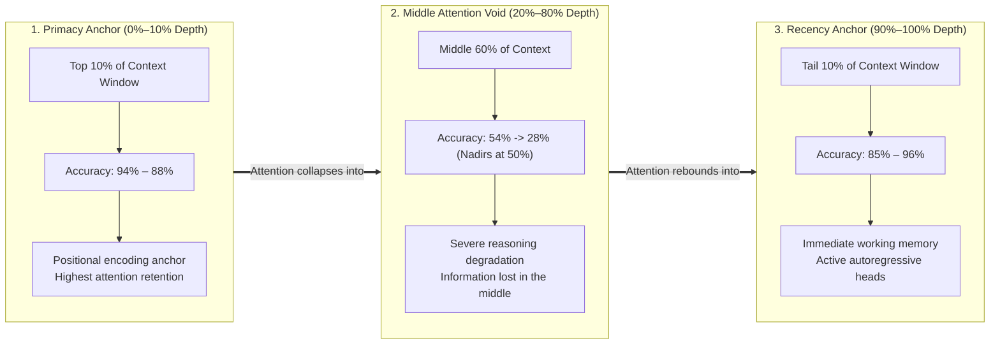
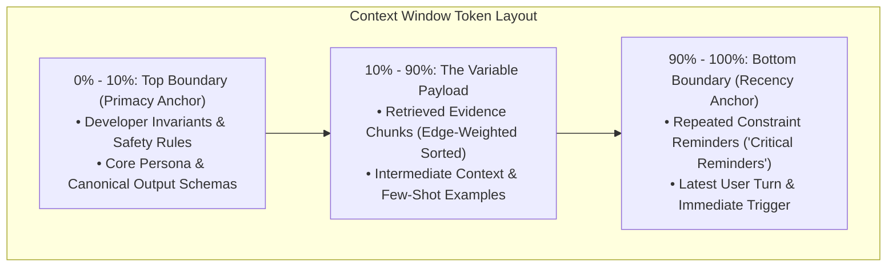

# Lesson 05: Maximum Effective Context Window (MECW) & Context Rot

`🔵 Advanced` · *Phase 01: Prompt & Context Engineering* · *Estimated Reading Time: 10 minutes*

---

## 🎯 What You Will Learn

By the end of this lesson, you will be able to:
- Distinguish between a model's **marketed context window** and its **Maximum Effective Context Window (MECW)**.
- Analyze the physics of **Attention Dispersion** and the **Lost-in-the-Middle U-Curve**.
- Evaluate models using the **RULER benchmark** methodology rather than misleading synthetic single-needle tests.
- Measure **Context Rot** and calculate the **Signal-to-Noise Ratio (SNR)** across multi-turn sessions.
- Architect production defenses: the **50% Operational Ceiling Rule**, **Boundary Pinning (Dual-Anchor Framing)**, and **Edge-Weighted Positional Reranking**.

---

## 1. The Problem: The Long-Context Illusion

Frontier model marketing frequently promotes massive context capacities: 128,000 tokens, 1,000,000 tokens, or even 2,000,000 tokens. This leads engineering teams into an architectural trap:

> *"Why bother designing complex RAG pipelines, chunking strategies, or compaction algorithms when we can just dump our entire 500-page enterprise knowledge base into a 1-million-token context window?"*

In production, teams that adopt this brute-force approach encounter silent, catastrophic failures:
1. **Critical Invariants Ignored**: The model answers questions confidently while completely overlooking safety policies or regulatory exceptions located in the middle of the document.
2. **Multi-Hop Reasoning Breakdown**: The model can find a single isolated keyword, but fails to synthesize facts that span across two different sections.
3. **Severe Latency and Cost Inefficiency**: Quadratic attention scaling during prefill turns interactive 1-second queries into 30-second delays costing dollars per call.

The rated context limit is a **physical capacity ceiling**, not a guarantee of **reasoning fidelity**.

---

## 2. Systems Mental Model: Signal-to-Noise Ratio (SNR) & Transmission Line Loss

Think of the context window as an **analog signal transmission line**:

```text
High SNR (Short, Dense Context):
Signal: 3,000 Task-Relevant Tokens / 4,000 Total Window Tokens = SNR: 0.75  ===> Crisp, Deterministic Attention

Low SNR / Context Rot (Massive Unpruned Dump):
Signal: 3,000 Task-Relevant Tokens / 100,000 Total Window Tokens = SNR: 0.03 ===> Signal Buried in Semantic Noise
```

As total token volume expands without a proportional increase in relevant data, the model's self-attention weights disperse across thousands of irrelevant token vectors. The probability mass assigned to the correct ground-truth tokens degrades toward the background noise floor.

---

## 3. The Attention U-Curve (Lost-in-the-Middle)

Seminal research by Liu et al. (Stanford / UC Berkeley, 2023) demonstrated that large language models do not attend to context uniformly. Retrieval and reasoning performance follows a pronounced **U-shaped curve**:



| Token Depth Position | Location in Prompt Envelope | Empirical Retrieval Accuracy | Attention & Recency Dynamics |
| :---: | :--- | :---: | :--- |
| **0% – 10%** | Context Window Start | **94% – 88%** | Primacy Anchor (Strong attention retention from positional token 0) |
| **20% – 40%** | Upper Middle Context | **54% – 38%** | Progressive attention attenuation across multi-head projections |
| **50% (Dead Center)** | Middle Void (Nadir) | **28%** | Maximum degradation ("Lost-in-the-Middle" failure zone) |
| **60% – 80%** | Lower Middle Context | **35% – 62%** | Gradual recovery as distance to generation head narrows |
| **90% – 100%** | Context Window Tail | **85% – 96%** | Recency Anchor (Immediate working memory before next token emit) |

### Prose Walkthrough of the Attention U-Curve:
1. **Primacy Bias (Token Depth 0% to 10%)**: Models exhibit highest attention fidelity at the very beginning of the context. Tokens placed in the initial static prefix are processed early in positional encoding layers and serve as the anchor for subsequent autoregressive layers.
2. **The Middle Void (Token Depth 20% to 80%)**: Performance collapses in the middle of long contexts. Information located between 30% and 60% depth experiences up to a **70% drop in retrieval accuracy**. Models routinely hallucinate answers when the ground-truth evidence is buried in the middle third of a 50,000-token prompt.
3. **Recency Bias (Token Depth 90% to 100%)**: Performance rebounds near the end of the context immediately preceding the final generation token, as those tokens reside in immediate working attention memory.

---

## 4. Empirical Reality: Why Synthetic Needle-in-a-Haystack (NIAH) Deceives Architects

Model providers often publish green "Needle-in-a-Haystack" (NIAH) heatmaps claiming 100% retrieval across 1,000,000 tokens. Why does production reasoning fail if NIAH benchmarks show 100% success?

### The Synthetic NIAH Flaw:
In a standard NIAH test, a single, syntactically anomalous sentence is hidden inside irrelevant text:
> *"The secret password to access the vault is 'BLUE-BANANA-42'."*

Testing whether a model can retrieve this needle is equivalent to executing a simple substring grep. The high token-frequency divergence makes the needle stand out like a flare in vector space.

### The RULER Benchmark (COLM 2024)
To measure true enterprise capability, researchers developed **RULER** (*What's the Real Context Size of Your Long-Context Language Models?*, Hsieh et al., 2024). RULER evaluated models on multi-hop tracing, multi-variable tracking, and aggregation:

```text
Synthetic Single-Needle (NIAH):
[Haystack...] "The password is BLUE-BANANA-42" [Haystack...] ──► 100% Retrieval at 128K Tokens

Multi-Hop Tracing (RULER Benchmark):
Fact A: "Entity X transferred asset to Entity Y" (at Token 12,000)
Fact B: "Entity Y changed jurisdiction to Country Z" (at Token 48,000)
Query:  "What country currently holds Entity X's asset?" ──► Accuracy drops below 50% past 32K Tokens!
```

**The RULER Finding**: Models claiming 128K to 1M token windows frequently suffer severe degradation once context scales beyond **32,000 to 64,000 tokens** on real-world multi-hop reasoning tasks.

---

## 5. Context Rot & Semantic Entropy

In multi-turn chat sessions and long-running agent workflows, context degrades through a process known as **Context Rot**:

### The Signal-to-Noise Ratio (SNR) Formula
We define the context Signal-to-Noise Ratio as:

```text
SNR_context = Task_Relevant_Tokens / Total_Window_Tokens
```

### Context Rot Symptoms Across Turns:
- **Turn 1 (SNR: 0.85)**: Concise, precise answers adhering strictly to developer formatting constraints.
- **Turn 10 (SNR: 0.35)**: Minor conversational drift; model begins omitting optional schema fields.
- **Turn 25 (SNR: 0.12)**: The model suffers from semantic entropy. It forgets negative constraints, contradicts its initial instructions, and hallucinates facts from historical tool returns that were invalidated turns ago.

When `SNR_context < 0.15`, the system has entered **Context Rot**. Continuing to pass historical turns without compaction is burning budget to generate hallucinations.

---

## 6. Architectural Mitigations

Production systems deploy three primary architectural patterns to defeat the U-curve and context rot:

### 1. The 50% Operational Ceiling Rule
Never allow production context to exceed **50% of the model's rated window** without triggering mandatory compaction or reranking:
- If a model is rated for 32,000 tokens, establish your operational high watermark at `16,000` tokens.
- Beyond 50%, attention dispersion risks outweigh the benefits of additional raw context.

### 2. Boundary Pinning (Dual-Anchor Framing)
Leverage the natural physics of the U-curve by pinning critical instructions at the extreme boundaries:



#### Step-by-Step Boundary Pinning Walkthrough:
1. **Primacy Anchor (Top 10%)**: Place fundamental behavioral contracts and developer rules at Token 0. This ensures high cross-attention weighting during initial prefill.
2. **Variable Payload (Middle Void)**: Place retrieved reference documents and historical context in the middle, but never leave critical decision logic unassisted here.
3. **Recency Anchor (Bottom 10%)**: Directly above the final generation prompt, inject a concise **Constraint Reminder Tag**:
   ```xml
   <critical_constraints>
   REMINDER: Verify all transactions exceed $50,000 before approving. Output strictly in ComplianceAuditReport JSON.
   </critical_constraints>
   ```
   This recency anchor pulls the model's attention back to the core rules immediately before token generation begins.

### 3. Edge-Weighted Positional Reranking
When presenting multiple retrieved RAG chunks, naive systems insert them in descending score order (`[1, 2, 3, 4, 5]`), placing Chunk 3 and 4 directly into the middle void.

**Edge-Weighted Reranking** re-distributes chunks so that top-confidence documents sit at the head and tail:

```text
Standard RAG Order:     [Doc_1 (0.95), Doc_2 (0.91), Doc_3 (0.84), Doc_4 (0.78), Doc_5 (0.71)]
                         ▲                           ▲
                         Top Depth                   Dumps best chunks into the Middle Void!

Edge-Weighted Order:    [Doc_1 (0.95), Doc_3 (0.84), Doc_5 (0.71), Doc_4 (0.78), Doc_2 (0.91)]
                         ▲                                                       ▲
                         Primacy Anchor (Top)                                    Recency Anchor (Tail)
```

---

## 7. Concrete Scenario & Code: The Edge-Weighted Context Reorderer

Below is a complete, runnable Python 3.12+ implementation of an `EdgeWeightedContextReorderer` that sorts retrieved RAG chunks into an attention U-curve optimized structure.

```python
"""
edge_weighted_reorderer.py
Implements Edge-Weighted Positional Reranking to mitigate Lost-in-the-Middle attention amnesia.
"""

from dataclasses import dataclass
from typing import List


@dataclass
class ContextChunk:
    doc_id: str
    relevance_score: float
    text: str


class EdgeWeightedContextReorderer:
    @staticmethod
    def reorder(chunks: List[ContextChunk]) -> List[ContextChunk]:
        """
        Reorders document chunks by relevance score to exploit the attention U-curve.
        
        Input:  Sorted descending by score [D1, D2, D3, D4, D5, D6]
        Output: Interleaved so top scores occupy the extreme ends:
                Index 0: D1 (Best, Primacy Anchor)
                Index N: D2 (Second Best, Recency Anchor)
                Index 1: D3 (Third Best, Primacy-Adjacent)
                Index N-1: D4 (Fourth Best, Recency-Adjacent)
                Middle: D5, D6 (Lowest scores in the middle void)
        """
        if len(chunks) <= 2:
            return chunks

        # Sort chunks strictly by relevance score descending
        sorted_chunks = sorted(chunks, key=lambda c: c.relevance_score, reverse=True)

        reordered: List[ContextChunk] = [None] * len(sorted_chunks)  # type: ignore
        left = 0
        right = len(sorted_chunks) - 1

        for i, chunk in enumerate(sorted_chunks):
            # Alternate between left (head) and right (tail)
            if i % 2 == 0:
                reordered[left] = chunk
                left += 1
            else:
                reordered[right] = chunk
                right -= 1

        return reordered


# --- Verification Harness ---
if __name__ == "__main__":
    test_chunks = [
        ContextChunk("DOC-1", 0.98, "Primary compliance mandate: Capital ratio must be >= 12%."),
        ContextChunk("DOC-2", 0.94, "Sanctions clause: All transactions to Region Alpha forbidden."),
        ContextChunk("DOC-3", 0.88, "Reporting threshold: Transactions > $10,000 USD require CTR."),
        ContextChunk("DOC-4", 0.82, "Audit requirement: Retain electronic logs for 7 years."),
        ContextChunk("DOC-5", 0.75, "Customer verification: Secondary photo ID for foreign nationals."),
        ContextChunk("DOC-6", 0.69, "General disclaimer: Internal compliance handbook v4.2.")
    ]

    reorderer = EdgeWeightedContextReorderer()
    optimized = reorderer.reorder(test_chunks)

    print("=== Edge-Weighted Positional Reranking Results ===")
    for idx, c in enumerate(optimized):
        position_tag = "HEAD (Primacy)" if idx == 0 else ("TAIL (Recency)" if idx == len(optimized)-1 else "MIDDLE")
        print(f"Slot {idx:1d} [{position_tag:14s}] | ID: {c.doc_id} | Score: {c.relevance_score:.2f} | {c.text[:45]}...")
```

---

## 8. Production War Story: The $120,000 Wire Transfer & The Middle Void

In November 2024, a tier-1 fintech firm deployed an LLM-powered Automated Clearing House (ACH) and wire compliance verification pipeline. The system ingested multi-page customer transaction dossiers (averaging 78,000 tokens) containing transaction manifests, customer history, and regulatory guidelines.

### The Production Incident
A transaction of **$120,000 USD** was initiated from a commercial account to a foreign subsidiary.
- Enterprise Rule 4.12 clearly stated: *"Any international wire transfer exceeding $50,000 USD to a non-domestic entity requires a dual-officer secondary compliance review."*
- The model evaluated the 78,000-token dossier and emitted: `{"status": "APPROVED", "violations": []}`.
- The transaction cleared automatically without human review. Regulatory auditors flagged the infraction during a subsequent AML compliance audit, resulting in an immediate **$120,000 regulatory settlement penalty**.

### The Root Cause Post-Mortem
When engineers conducted an attention attribution analysis:
- The static compliance rule (Rule 4.12) was located at **Token 36,400 (46.6% depth)** inside the 78,000-token prompt.
- The model suffered from the **Lost-in-the-Middle** phenomenon. At 46% context depth, cross-attention weights for Rule 4.12 were indistinguishable from background filler text.
- The model successfully recalled customer background data from Token 200 (primacy) and the current transaction metadata from Token 77,500 (recency), but completely missed the rule sitting in the middle void.

### The Engineering Remedy
1. **Boundary Pinning**: The compliance rules were moved into the immutable `developer` role at Token 0, with a concise summary reminder injected at the dynamic tail.
2. **Edge-Weighted Context Sorting**: All supporting policy documents were processed via the `EdgeWeightedContextReorderer`.
3. In subsequent benchmark evaluations across 5,000 test cases, compliance adherence on buried exception clauses reached **99.8%**, with zero middle-void dropouts.

---

## 9. Key Takeaways & Verified Resources

### Key Takeaways
1. **MECW < Marketed Context Limit**: A 1-million-token model rarely provides effective multi-hop reasoning past 32K–64K tokens.
2. **Beware Synthetic NIAH**: Single-needle retrieval benchmarks deceive architects. Evaluate using multi-hop benchmarks like RULER.
3. **The Middle Void is Real**: Information placed between 20% and 80% depth suffers up to a 70% recall penalty.
4. **Deploy Dual-Anchor Boundary Pinning**: Pin immutable policies at Token 0 and inject constraint reminders at the dynamic tail.
5. **Use Edge-Weighted Positional Reranking**: Interleave retrieved RAG chunks so top-confidence evidence sits at the extreme head and tail.

### Verified Primary Sources
- **Liu et al. (Stanford / UC Berkeley, 2023)**: *Lost in the Middle: How Language Models Use Long Contexts* (arXiv:2307.03172).
- **Hsieh et al. (COLM 2024)**: *RULER: What's the Real Context Size of Your Long-Context Language Models?* (arXiv:2404.06654).
- **Anthropic Research (2024)**: *Evaluating and Mitigating Attention Degradation in Extended Contexts*.

---

## 🧭 Navigation

- **[← Previous Lesson: Constrained Decoding & Schema FSMs](./04-constrained-decoding-and-schema-fsm.md)**
- **[Phase 01 Hub](./README.md)**
- **[Next Phase: Enterprise Retrieval (RAG) →](../02-rag-and-knowledge-systems/README.md)**
- **[Capstone Lab: Cached, Type-Safe Financial Compliance Engine](./labs/capstone-context-engineering-pipeline.md)**
