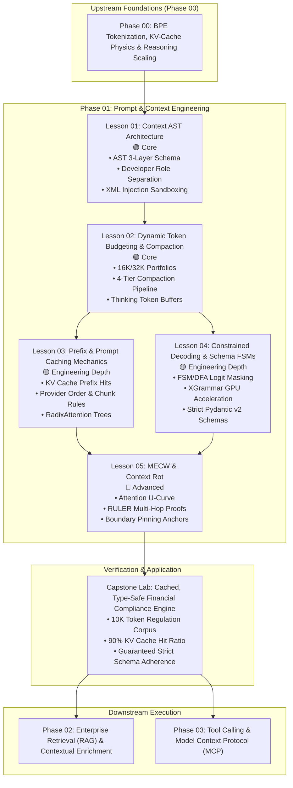

# Phase 01: Prompt & Context Engineering — Architectural Refactoring Plan

> **Execution Mode**: PLAN MODE  
> **Author**: AI Curriculum Architect  
> **Target Phase Directory**: `01-prompt-and-context-engineering/`  
> **Date**: September 2026  
> **Target Audience**: Senior Developers, Staff Software Engineers, and Solutions Architects (7–10+ years experience) transitioning to AI Systems Engineering.  
> **Upstream Inputs**: [`PHASE_1_AUDIT.md`](./PHASE_1_AUDIT.md), [`PHASE_1_RESEARCH.md`](./PHASE_1_RESEARCH.md), and `.agents/skills/ai-curriculum-refactoring/`.  
> **Output Blueprint Target**: Transition to `REFACTOR MODE`.

---

## 1. Executive Blueprint & Refactoring Mission

This refactoring plan provides the deterministic, step-by-step engineering blueprint to restructure **Phase 01: Prompt & Context Engineering**. 

Phase 01 currently suffers from the **Monolithic README Anti-Pattern**: a single 1,276-line file (8,952 words) containing 23 disparate topics, 14 diagrams, 4 embedded code scripts, 3 isolated war stories, and pervasive raw LaTeX math formatting. Despite its world-class systems thesis—treating prompt engineering as compiler AST construction and hardware KV-cache optimization—its monolithic structure creates severe cognitive overload, inverts pedagogical prerequisites, and violates repository quality gates.

### Core Pedagogical Axiom
> **"Do not teach less. Teach better."**  
> We do not simplify by cutting out hardware physics, compiler analogies, or production code. We eliminate monolithic sprawl, sequence concepts in strict order of technical dependencies, purge obsolete prompt-begging tropes, and integrate verified 2026 platform primitives (XGrammar, RadixAttention, GA prompt caching orders, reasoning thinking tokens, and the RULER benchmark).

---

## 2. Target Phase Architecture & Modular Progression

Following the standard curriculum layout established in Phase 00, Phase 01 will be decomposed into an **Orientation & Navigation Hub (`README.md`)**, **5 modular lesson files**, a **hardened hands-on capstone lab**, and **streamlined reference implementations**.

```text
01-prompt-and-context-engineering/
├── README.md                                  # Phase Orientation, Architecture & Navigation Hub (~450 words)
├── 01-context-ast-architecture.md             # 🟢 Core (~1,500 words)
├── 02-token-budgeting-and-compaction.md       # 🟢 Core (~1,600 words)
├── 03-prefix-and-prompt-caching.md            # 🟡 Engineering Depth (~1,800 words)
├── 04-constrained-decoding-and-schema-fsm.md  # 🟡 Engineering Depth (~1,800 words)
├── 05-mecw-and-context-rot.md                 # 🔵 Advanced (~1,600 words)
├── labs/
│   └── capstone-context-engineering-pipeline.md # Capstone Lab (Repaired link integrity & verified criteria)
├── examples/
│   ├── README.md                              # Examples Manifest
│   ├── context_pipeline.py                    # Multi-turn cached pipeline (Anthropic GA + Pydantic v2)
│   ├── semantic_layer_decoupling.py           # Authority DMN benchmark: Prompt vs Code Adjudication
│   └── StrictJsonPipeline.cs                  # Clean .NET 9 Console Harness (Azure OpenAI / OpenAI SDK)
├── PHASE_1_AUDIT.md                           # Read-Only Inspection Report
├── PHASE_1_RESEARCH.md                        # Frontier Research & Verification Report
└── PHASE_01_REFACTORING_PLAN.md               # This Blueprint
```

### 2.1. End-to-End Conceptual Flowchart



#### Diagram Walkthrough:
1. **Prerequisite Ingestion**: The learner enters Phase 01 with foundational understanding of tokenization, KV cache VRAM footprint, and test-time compute from Phase 00.
2. **Context Compilation (Lesson 01)**: Natural language prompt begging is replaced with a typed Abstract Syntax Tree (AST) structure, segregating immutable developer instructions from untrusted user inputs via XML boundaries and role privileges.
3. **Budgeting & Compaction (Lesson 02)**: The typed context is assigned a strict token portfolio budget, guarded by a 4-tier compaction escalation pipeline that accounts for hidden reasoning tokens.
4. **Physical Optimization & Decoding Guarantees (Lessons 03 & 04)**: The prompt layout is physically ordered to maximize GPU KV-cache reuse (Lesson 03), while model sampling is strictly constrained via FSM logit masking and XGrammar (Lesson 04).
5. **Attention Resilience (Lesson 05)**: Long-context attention degradation (U-curve / context rot) is mitigated using boundary pinning and edge-weighted document sorting, validated by RULER benchmarks.
6. **Capstone & Handoff**: The learner proves mastery in the capstone lab before progressing to non-parametric retrieval (Phase 02) and wire tool execution (Phase 03).

---

## 3. Lesson-by-Lesson Design Specifications

Each lesson is engineered using the flexible 11-part pedagogical structure specified in `references/lesson-template.md`.

---

### Lesson 01: Context AST Architecture & Structured Composition
* **Target File**: `01-prompt-and-context-engineering/01-context-ast-architecture.md`
* **Depth Tier**: `🟢 Core` (Tier 1)
* **Target Word Budget**: ~1,500 words
* **Systems Mental Model**: **The Compiler Intermediate Representation (IR)**. A prompt is not a raw stream of text; it is an Abstract Syntax Tree compiled into wire-format message buffers with strict type safety and privilege separation.
* **Core Topics & Engineering Progression**:
  1. *The Naive Failure*: String concatenation (`f"You are an assistant... {user_input}"`), delimiter collision, instruction injection, and accidental cache invalidation.
  2. *The Context AST Pattern*: 3-layer architecture:
     - **Layer 1: Static Prefix** (immutable system invariants, golden few-shot examples).
     - **Layer 2: Semi-Dynamic Layer** (tenant profile, session state, tool definitions).
     - **Layer 3: Dynamic Tail** (ephemeral retrieved evidence, latest user turn).
  3. *The 4-Tier Enterprise Role Hierarchy*:
     - **`developer` / `system`**: High-privilege invariants, behavioral contracts, and execution rules.
     - **`user`**: Untrusted client payload.
     - **`assistant`**: Model generation history and thought transcripts.
     - **`tool`**: Structured execution returns.
  4. *XML Delimiter Architecture*: Sandboxing untrusted inputs using explicit structural tags (`<instructions>`, `<regulatory_context>`, `<user_query>`) and preventing delimiter breakout via character escaping.
  5. *Classical Prompting as AST Nodes*: In-Context Learning (Few-Shot ICL) and Chain-of-Thought (CoT) scratchpads structured as typed static nodes rather than free-form prose.
  6. *Architectural Decoupling*: Separating probabilistic semantic extraction from deterministic rule adjudication (introducing the core rule: *"Never make an LLM calculate what a deterministic rule engine can evaluate in 2 microseconds"*).
* **Research & Audit Integration**:
  - `UPDATE_EXISTING` (Candidate 02): Formally introduce the OpenAI `developer` message role, distinguishing developer invariants from model safety rules and untrusted user prompts.
  - Relocate the 160-line claims adjudication DMN code to `examples/semantic_layer_decoupling.py`, retaining only the architectural decoupling principle in text.
* **Deliverable Code**: Clean Python 3.12+ `ContextAST` compiler using Pydantic v2 models to assemble, sanitize, and validate a multi-role chat payload.
* **Required Visual**: Mermaid `flowchart TD` illustrating AST node aggregation into a wire-protocol message array, with an accompanying 4-step prose walkthrough.
* **Failure Modes Covered**:
  - *The Delimiter Escape Attack*: Malicious user closing `<user_query>` and injecting fake `<developer>` commands.
  - *Instruction Drift*: Free-form conversational drift when system instructions are placed in user messages.

---

### Lesson 02: Dynamic Token Budgeting & Compaction Pipelines
* **Target File**: `01-prompt-and-context-engineering/02-token-budgeting-and-compaction.md`
* **Depth Tier**: `🟢 Core` (Tier 1)
* **Target Word Budget**: ~1,600 words
* **Systems Mental Model**: **Operating System Memory Management & Page Eviction**. Sizing context memory into dedicated registers (working memory, cache reserve, safety margin) and executing progressive eviction when pressure thresholds are crossed.
* **Core Topics & Engineering Progression**:
  1. *The Problem*: Context window explosion in multi-turn conversations causing HTTP 400 context overflow crashes or catastrophic latency spikes.
  2. *Token Budget Allocation Portfolios*:
     - Sizing portfolios for 16K, 32K, and 64K operational windows.
     - The Headroom Equation: Allocating explicit reserves for generation output and tool outputs:
       ```text
       Usable_Input_Budget = Window_Limit - Max_Output_Tokens - Safety_Headroom
       ```
  3. *Reasoning Model Thinking Token Dynamics*: Sizing dynamic scratchpad budgets for reasoning models (OpenAI o1/o3-mini, Claude 3.7 Thinking, DeepSeek-R1) and managing 50:1 hidden token inflation.
  4. *The 4-Tier Compaction Pipeline*:
     - **Tier 1 (Deterministic Pruning)**: Stripping null values, minifying JSON whitespace, capping array lengths.
     - **Tier 2 (Payload Masking & Sliding Window)**: Truncating historical tool payloads to result hashes, keeping the last $N$ turns active.
     - **Tier 3 (Recursive Semantic Summarization)**: Background asynchronous summarization of historical dialogue turns.
     - **Tier 4 (Externalization)**: Offloading historical data to cloud object storage (S3/GCS) and injecting signed reference pointers.
  5. *Token Compression Engines*: Evaluating LLMLingua 2 token entropy classifiers vs. heuristic pruning (latency vs. semantic drift).
  6. *Tool Schema Budgeting*: Restricting tool definitions to a maximum of 10–15% of the total budget (without teaching tool wire execution, which is reserved for Phase 03).
  7. *Production War Story 2*: *The 45-Second Latency Spike & The 60-Tool Agent* (How unpruned tool schemas consumed 14,000 tokens per turn).
* **Research & Audit Integration**:
  - `NEW_TOPIC` (Candidate 06): Detail Reasoning Model Context Dynamics—allocating dynamic thinking budgets and accounting for hidden reasoning tokens in pre-flight budget checks.
  - `MOVE_TOPIC` (Candidate 11): Strip the dynamic tool execution registry (`ToolDefinition(handler: Callable)`) from Section 8; keep only schema token budgeting in this lesson.
* **Deliverable Code**: Production-grade `ContextCompactor` class in Python 3.12+ implementing Tier 1 (deterministic trimming) and Tier 2 (tool payload masking) with automated token limit enforcement via `tiktoken`.
* **Required Visual**: Mermaid `flowchart TD` detailing the 4-Tier Compaction Decision Tree with an explicit 4-step escalation walkthrough.
* **Failure Modes Covered**:
  - *The Recursive Summarization Death Spiral*: Compacting an already-compacted summary until key entity IDs and numbers degrade into hallucinations.
  - *Tool Schema Bloat*: Mounting dozens of JSON schemas that starve the model of conversational working memory.

---

### Lesson 03: Prefix & Prompt Caching Mechanics
* **Target File**: `01-prompt-and-context-engineering/03-prefix-and-prompt-caching.md`
* **Depth Tier**: `🟡 Engineering Depth` (Tier 2)
* **Target Word Budget**: ~1,800 words
* **Systems Mental Model**: **Hardware L2/L3 Cache Lines & Memoization**. Reusing precomputed transformer Key-Value (KV) tensors directly from GPU High-Bandwidth Memory (HBM) to bypass quadratic attention prefill compute.
* **Core Topics & Engineering Progression**:
  1. *Hardware Reality (Bridged from Phase 00)*: Why the prefill phase is compute-bound, why processing 10,000 tokens costs time and money, and how preserving KV cache blocks reduces Time-to-First-Token (TTFT) by up to 80% and input costs by up to 90%.
  2. *Contiguous Prefix Matching*: The Golden Invariant: The prompt prefix must match character-for-character, token-for-token, starting at index 0. Any mutation at token 0 destroys all downstream cached blocks.
  3. *The Prefix Taint Anti-Pattern*: Placing dynamic request IDs, user timestamps, or session nonces at the top of the prompt.
  4. *Provider Mechanics & Implementation Differences*:
     - **Anthropic**: Explicit and automatic `cache_control: {"type": "ephemeral"}` breakpoints (up to 4 breakpoints), 5-minute vs. 1-hour extended TTL, 1.25x write surcharge vs. 0.1x read pricing.
     - **Anthropic Evaluation Order**: Strict cache hierarchy: `tools → system prompt → messages`. Mutating tools invalidates system cache!
     - **OpenAI**: Automated implicit prefix caching. Strict 1,024-token minimum threshold. **128-token chunk quantization** (prefixes must hit chunk boundaries). 50% discount on cached tokens.
     - **Google Gemini**: Dual caching model: Automated Implicit Prefix Caching (Gemini 2.5+) vs. Explicit Context Caching API (persisting 32K+ token datasets for hours/days with explicit TTL).
  5. *Reasoning Model Cache Invalidation*: Why thinking tokens cannot be cached across API turns, and why assistant message prefilling (`{"role": "assistant", "content": "..."}`) is rejected on reasoning models.
  6. *Advanced Platform Deep Dive: RadixAttention (SGLang / vLLM)*:
     - How inference engines maintain a Radix Tree of token sequences in GPU memory.
     - Dynamic prefix sharing across concurrent multi-turn requests and branching tree paths.
  7. *Bridge to Phase 02 (Contextual Retrieval)*: Using cached full-document prefixes to cost-effectively generate chunk-specific metadata before indexing.
  8. *Production War Story 1*: *The $42,000 Weekend Invoice & The Timestamp Bug* (A dynamic `Current Date: {now}` at token 0 destroyed 100% of KV cache hits across 1.2 million requests).
* **Research & Audit Integration**:
  - `UPDATE_EXISTING` (Candidate 03): Update Anthropic caching from beta to GA Messages API; document strict evaluation order (`tools → system → messages`) and 1-hour TTL.
  - `UPDATE_EXISTING` (Candidate 04): Document OpenAI 128-token chunk quantization rules and 1,024-token minimums.
  - `UPDATE_EXISTING` (Candidate 05): Document Gemini Dual Caching (Implicit vs. Explicit Context Caching API).
  - `NEW_TOPIC` (Candidate 06): Explain why reasoning model thinking tokens cannot be cached and how prefill rejection breaks naive pipelines.
  - `ADVANCED_TOPIC` (Candidate 08): Add RadixAttention prefix tree mechanics.
  - `REFERENCE_ONLY` (Candidate 09): Add the Contextual Retrieval bridge to Phase 02.
* **Deliverable Code**: Production Python 3.12+ client demonstrating Anthropic GA prompt cache breakpoints with verified telemetry extraction (`cache_creation_input_tokens`, `cache_read_input_tokens`), combined with an OpenAI chunk-boundary alignment helper.
* **Required Visuals**:
  1. Mermaid `flowchart LR` comparing Cold Miss Prefill vs. Warm HBM Cache Read with a 4-step memory traffic walkthrough.
  2. Mermaid `flowchart TD` showing RadixAttention tree-based KV cache sharing across branching conversational turns.
* **Failure Modes Covered**:
  - *Floating Nonce Invalidation*: Request UUID placed in the system prompt.
  - *Sub-Threshold Invalidation*: Providing 1,020 tokens to OpenAI (missing the 1,024 minimum by 4 tokens).
  - *Anthropic Tool Invalidation*: Changing an optional parameter description in a tool, silently purging the entire cached system prompt.

---

### Lesson 04: Constrained Decoding & Schema FSMs
* **Target File**: `01-prompt-and-context-engineering/04-constrained-decoding-and-schema-fsm.md`
* **Depth Tier**: `🟡 Engineering Depth` (Tier 2)
* **Target Word Budget**: ~1,800 words
* **Systems Mental Model**: **Compiler Lexer & Pushdown Automaton / DFA**. Intercepting model token generation at step $t$ and applying a bitmask over raw logits so that invalid syntax tokens have mathematical probability $0$ ($e^{-\infty} = 0$).
* **Core Topics & Engineering Progression**:
  1. *The Fragility of Naive JSON Prompting*: Why prompting *"Respond in JSON"* and using regex or fallback parsers produces runtime microservice crashes (markdown backtick wrappers, unescaped quotes, trailing commas, missing required fields).
  2. *Why "JSON Mode" is Insufficient*: JSON Mode guarantees valid JSON syntax, but does NOT guarantee adherence to your specific Pydantic / JSON schema.
  3. *Finite State Machine (FSM) Logit Masking*:
     - Converting a JSON Schema / Regex into a Deterministic Finite Automaton (DFA) or Context-Free Grammar (CFG).
     - At every token generation step $t$, the FSM determines the set of legally acceptable next tokens.
     - Applying an additive logit mask ($-\infty$ to illegal vocabulary tokens) prior to softmax:
       ```text
       Logits_masked[token] = Logits_raw[token]   if token in Allowed_Tokens(state)
       Logits_masked[token] = -inf                 otherwise
       ```
  4. *Production Grammar Engines: Outlines vs. XGrammar*:
     - **Outlines**: Python-level FSM compilation. High flexibility, but CPU-GPU synchronization overhead can add 50–200ms TTFT latency.
     - **XGrammar (2026 Production Standard)**: Co-designing grammar execution with GPU inference. Vocabulary partitioning into context-independent and context-dependent sets. Sub-millisecond logit masking natively integrated into vLLM, SGLang, and TensorRT-LLM.
  5. *Provider-Level Native Implementations*:
     - OpenAI Structured Outputs (`response_format={"type": "json_schema", "json_schema": {"strict": true}}`).
     - Gemini Structured Outputs (`response_schema`).
  6. *The Over-Constrained Schema Trap & Escape Hatches*:
     - What happens when a model lacks knowledge but is forced into a non-nullable schema (hallucinations or infinite whitespace loops).
     - Designing resilient schemas: Mandatory nullable fields (`explanation: Optional[str] = None`) and explicit rejection enums (`status: Literal["SUCCESS", "CANNOT_DETERMINE"]`).
  7. *Comparative Trade-off Matrix*: Natural language vs. JSON mode vs. FSM logit masking vs. secondary LLM syntax repair.
* **Research & Audit Integration**:
  - `NEW_TOPIC` (Candidate 01): Introduce XGrammar co-designed GPU grammar decoding, contrasting its vocabulary partitioning and sub-millisecond execution against Outlines' CPU-bound pre-compilation.
  - Relocate the embedded C# ASP.NET minimal API boilerplate to `examples/StrictJsonPipeline.cs` as a clean console harness, referencing its core schema generation here.
* **Deliverable Code**: Python 3.12+ implementation using Pydantic v2 strict schema generation, demonstrating both Outlines local FSM decoding and OpenAI `strict: true` API execution with a resilient secondary fallback repair handler.
* **Required Visual**: Mermaid `flowchart TD` tracing the step-by-step Token Logit Masking Loop (Raw Logits → FSM State Query → Bitmask Application → Softmax → Sampled Token → State Transition), accompanied by a 5-step numbered prose walkthrough.
* **Failure Modes Covered**:
  - *Schema Compilation Cold-Start Spike*: Initializing a massive recursive JSON schema during the first user request, triggering a 4-second TTFT freeze.
  - *The Infinite Enum Lockup*: Constraining output to an enum where the model's intermediate reasoning requires tokens outside the allowed set.

---

### Lesson 05: Maximum Effective Context Window (MECW) & Context Rot
* **Target File**: `01-prompt-and-context-engineering/05-mecw-and-context-rot.md`
* **Depth Tier**: `🔵 Advanced` (Tier 3)
* **Target Word Budget**: ~1,600 words
* **Systems Mental Model**: **Signal-to-Noise Ratio (SNR) Attenuation & Transmission Line Loss**. As context length grows, cross-attention weights disperse across thousands of competing tokens, degrading retrieval precision and multi-hop reasoning.
* **Core Topics & Engineering Progression**:
  1. *The Long-Context Illusion*: Advertised context windows (128K, 1M, 2M tokens) vs. the **Maximum Effective Context Window (MECW)**.
  2. *Attention Dispersion & The U-Curve*:
     - **Primacy Bias**: Exceptional recall for tokens at the very beginning of the context (0% to 10%).
     - **Recency Bias**: Exceptional recall for tokens at the very end of the context (90% to 100%).
     - **The Middle Void (Lost-in-the-Middle)**: Catastrophic retrieval degradation (up to 70% drop) for tokens located between 20% and 80% depth.
  3. *Empirical Verification: The RULER Benchmark*:
     - Why synthetic single-needle Needle-in-a-Haystack (NIAH) benchmarks give architects false confidence (retrieving a simple UUID does not test reasoning).
     - RULER benchmark findings (COLM 2024): Multi-hop tracing and aggregation accuracy plummets below 50% once context scales beyond 32K–64K tokens, even on models boasting 1M+ capacities.
  4. *Context Rot & Semantic Entropy*:
     - Multi-turn conversation drift.
     - Signal-to-Noise Ratio (SNR) formulation:
       ```text
       SNR_context = Task_Relevant_Tokens / Total_Window_Tokens
       ```
     - Why context with $\text{SNR} < 0.15$ triggers severe hallucinations and instruction ignoring.
  5. *Architectural Mitigations*:
     - **The 50% Operational Ceiling Rule**: Never allow production context to exceed 50% of the model's rated window before forcing compaction or retrieval reranking.
     - **Boundary Pinning (Dual-Anchor Framing)**: Pinning high-criticality system rules and developer guidelines at token 0, and repeating critical constraint reminders at the dynamic tail (immediately preceding the generation prompt).
     - **Edge-Weighted Positional Reranking**: Interleaving retrieved RAG evidence chunks so that top-confidence documents are positioned at the extreme head and tail:
       ```text
       Reordered_Documents = [Doc_1, Doc_3, Doc_5, ..., Doc_6, Doc_4, Doc_2]
       ```
  6. *Production War Story 3*: *The $120,000 Wire Transfer Disaster & The Middle Void* (An Anti-Money Laundering compliance clause buried at 45% context depth was ignored by an LLM in a 78,000-token audit document).
* **Research & Audit Integration**:
  - `UPDATE_EXISTING` (Candidate 07): Anchor MECW and multi-hop degradation in the empirical findings of the **RULER benchmark** (Hsieh et al., COLM 2024).
  - Purge all 12 raw LaTeX expressions from the existing text and replace with clean monospace blocks and Unicode characters.
* **Deliverable Code**: Production Python 3.12+ implementation of an `EdgeWeightedContextReorderer` that sorts retrieved context chunks into an attention U-curve configuration (`[Doc_1, Doc_3, ..., Doc_4, Doc_2]`).
* **Required Visuals**:
  1. Mermaid `xychart-beta` illustrating the Attention U-Curve (Token Position vs. Retrieval Accuracy), with detailed prose annotations.
  2. Mermaid `flowchart TD` illustrating the Boundary Pinning Context Layout with a 4-step walkthrough.
* **Failure Modes Covered**:
  - *The Middle-Document Hallucination*: Relying on an LLM to find conflicting clauses in an unranked 50-page PDF.
  - *Instruction Amnesia*: Long conversation history pushing initial developer safety invariants into the middle void.

---

## 4. Phase Orientation Hub (`README.md`) Blueprint

The root `01-prompt-and-context-engineering/README.md` will be rewritten from scratch to serve as an **Architectural Orientation Hub** conforming strictly to `references/phase-template.md`.

### Structural Specification for `README.md` (~450 words):
1. **Header & Badge**: Phase 01: Prompt & Context Engineering (Software 3.0).
2. **Phase Engineering Goal**: Define the transformation from fragile string concatenation to compiled, type-safe Context Abstract Syntax Trees (ASTs) executing against physical GPU KV cache memory.
3. **Architecture & Topology Flowchart**:
   - Mermaid diagram illustrating the complete context lifecycle: Context AST compilation → Token Governor / Compaction → Prefix-Aligned Prompt Caching → FSM Constrained Sampling → Output Deserialization.
   - Accompanying 5-step numbered prose walkthrough (remediating the unannotated Diagram 01/14 from legacy README).
4. **Modular Curriculum Lessons Table**:
   - Table indexing all 5 modular lessons with Depth Badges (`🟢 Core`, `🟡 Engineering Depth`, `🔵 Advanced`), word counts, and engineering outcomes.
5. **Hands-On Capstone Lab**:
   - Link to `labs/capstone-context-engineering-pipeline.md`.
   - Clear architectural acceptance criteria and verification instructions.
6. **Cross-Phase Prerequisites & Handoffs**:
   - Upstream link to Phase 00 (`00-foundations-and-token-mechanics`).
   - Downstream links to Phase 02 (`02-rag-and-knowledge-systems`) and Phase 03 (`03-tools-and-model-context-protocol`).
7. **Curated Primary Sources & Verification References**:
   - Clean, verified links to arXiv papers (RULER, XGrammar, SGLang, Lost-in-the-Middle) and official provider specs.

---

## 5. Comprehensive Content Transformation Matrix

The following matrix maps every section, diagram, and asset in the legacy 1,276-line `README.md` to its designated destination and refactoring action:

| Legacy Sec # | Legacy Title | Lines | Action | Target Destination | Rationale & Action Details |
|:---:|---|:---:|:---:|---|---|
| **Header** | Title & Runtime Diagram | 1–20 | **REORGANIZE** | `README.md` (Orientation Hub) | Retain runtime diagram as phase architecture banner; add 4-step prose walkthrough. |
| **Meta** | Learner Note & TOC | 21–61 | **REWRITE** | `README.md` | Purge legacy 3-tier badges; replace monolithic TOC with links to 5 modular lessons. |
| **Sec 1** | Executive Summary & Analogy | 63–101 | **SIMPLIFY** | `README.md` & `01-context-ast-architecture.md` | Reframe Karpathy quote and suitcase analogy into staff-level systems metaphors. |
| **Sec 2** | Why Context Engineering Matters | 103–129 | **REORGANIZE** | `01-context-ast-architecture.md` | Move problem statement and string concat failure analysis to Lesson 01. |
| **Sec 3** | The Context AST Pattern | 131–177 | **REWRITE** | `01-context-ast-architecture.md` | Expand into primary thesis: 3-layer architecture, Pydantic v2 schemas, and AST compiler. |
| **Sec 4** | Context Budgeting Portfolios | 179–241 | **REWRITE** | `02-token-budgeting-and-compaction.md` | Convert portfolio table to clean GFM; remove ELI10 callout; add thinking token budget reserve. |
| **Sec 5** | 4-Tier Compaction Pipeline | 243–309 | **REWRITE** | `02-token-budgeting-and-compaction.md` | Combine diagram, escalation logic, and runnable code into unified lesson narrative. |
| **Sec 6** | Mitigating Lost-in-the-Middle | 311–359 | **REORGANIZE / REWRITE** | `05-mecw-and-context-rot.md` | Move attention U-curve and boundary pinning; purge raw LaTeX formulas. |
| **Sec 7** | Context Rot & MECW | 361–402 | **REORGANIZE / REWRITE** | `05-mecw-and-context-rot.md` | Move MECW thesis; ground in RULER benchmark; format SNR formula in clean text block. |
| **Sec 8** | Dynamic Tool Loadout Pruning | 404–489 | **SIMPLIFY / MOVE** | Budget in Lesson 02; Handlers to Phase 03 | Retain tool schema token cap in Lesson 02; **MOVE** full tool execution registry to Phase 03. |
| **Sec 9** | Context Routing & Sub-Agents | 492–517 | **MOVE** | Phase 04 (`04-agentic-systems-and-orchestration`) | Sub-agent routing and reducers belong in multi-agent orchestration. Remove from Phase 01. |
| **Sec 10** | LLMLingua 2 Compression | 519–553 | **SIMPLIFY / MERGE** | `02-token-budgeting-and-compaction.md` | Merge token entropy classification and trade-off comparison into Lesson 02. |
| **Sec 11** | Multimodal Context Assembly | 555–591 | **MOVE** | Supplementary Appendix | Image tile calculations are tangential to text context AST compilation. Move to appendix. |
| **Sec 12** | Enterprise XML Architecture | 593–639 | **REORGANIZE / REWRITE** | `01-context-ast-architecture.md` | Foundational syntax primitive. Move to Lesson 01 alongside Context AST layers. |
| **Sec 13** | 4-Tier Role Hierarchy | 641–665 | **REORGANIZE / REWRITE** | `01-context-ast-architecture.md` | Move to Lesson 01 as wire-format transport for AST; add modern `developer` role. |
| **Sec 14** | Constrained Grammar Decoding | 667–696 | **REWRITE** | `04-constrained-decoding-and-schema-fsm.md` | Expand into standalone lesson; add XGrammar, logit masking loop, and Outlines. |
| **Sec 15** | Physical Prompt Caching | 698–733 | **REWRITE** | `03-prefix-and-prompt-caching.md` | Expand into standalone lesson; update Anthropic GA, OpenAI 128-token chunks, Gemini, RadixAttention. |
| **Sec 16** | Shared Semantic Layer & DMN | 735–893 | **SIMPLIFY / MOVE** | Takeaway in Lesson 01; Code to `examples/` | Keep high-level decoupling rule in Lesson 01; move 350-line claims engine to `examples/`. |
| **Sec 17** | Classical Prompt Patterns | 894–927 | **REORGANIZE / REWRITE** | `01-context-ast-architecture.md` | Few-Shot ICL and CoT belong in Lesson 01 as static AST nodes; add prefill rejection warning. |
| **Sec 18** | System Architecture Flow | 928–966 | **REORGANIZE** | `README.md` & `01-context-ast-architecture.md` | Sequence diagram placed in phase hub and Lesson 01 with a full numbered walkthrough. |
| **Sec 19** | Comparative Tradeoff Matrices | 968–989 | **MERGE** | Lessons 03 & 04 | Embed schema tradeoff matrix into Lesson 04; embed prompt caching matrix into Lesson 03. |
| **Sec 20** | Production War Stories | 991–1018 | **REORGANIZE / MERGE** | Lessons 02, 03 & 05 | Embed War Story 1 in Lesson 03; War Story 2 in Lesson 02; War Story 3 in Lesson 05. |
| **Sec 21** | Production Code Implementations | 1020–1253 | **REORGANIZE / REWRITE** | Embedded in Lessons 01–04 & `examples/` | Distribute focused, runnable code blocks into corresponding modular lessons. |
| **Sec 22** | Curated Verified Resources | 1254–1271 | **REORGANIZE** | Lessons 01–05 & `README.md` | Distribute authoritative primary source citations into their respective modular lessons. |
| **Sec 23** | Capstone Challenge Link | 1273–1276 | **REORGANIZE** | `README.md` & `labs/` | Fix broken anchor; integrate cleanly into phase progression. |

---

## 6. Code Refactoring & Example Simplification Plan

### 6.1. Refactoring `examples/StrictJsonPipeline.cs`
- **Current State**: 73 lines containing ASP.NET Core minimal API boilerplate (`WebApplication.CreateBuilder`, `app.MapPost`, `app.Run`). This boilerplate obscures the core educational objective: .NET 9 strict JSON schema configuration via `Azure.AI.OpenAI` / `OpenAI.Chat`.
- **Target State**: Refactor into a clean, runnable **C# Console Application**:
  1. Remove all `WebApplication`, HTTP routing, and endpoint registration boilerplate.
  2. Implement a standalone `StrictJsonPipelineDemo` class with an `async Task RunAsync()` method.
  3. Define the strict JSON schema using `BinaryData.FromObjectAsJson` and `ChatResponseFormat.CreateJsonSchemaFormat(..., jsonSchemaIsStrict: true)`.
  4. Build messages with `SystemChatMessage` (or `DeveloperChatMessage`) and `UserChatMessage` using XML delimiters.
  5. Demonstrate strongly-typed deserialization directly into the `ComplianceEvaluationRecord` record with assertion checks.
  6. Add top-level `Main` entry point so the file can be executed with `dotnet run`.

### 6.2. Updating `examples/context_pipeline.py`
- **Current State**: 106 lines of Python demonstrating Anthropic caching, Pydantic validation, and JSON fallback repair.
- **Required Updates**:
  1. Update model string from `claude-3-5-sonnet-20241022` to `claude-3-7-sonnet-latest`.
  2. Transition from beta namespace to GA Anthropic Messages API (`client.messages.create` with `cache_control` inside block parameters).
  3. Enforce the strict caching evaluation order: `tools` defined first, then `system` prompt with cache breakpoint, then `messages`.
  4. Document that assistant message prefilling (`role: "assistant"`) is incompatible with reasoning models (OpenAI o1/o3-mini, DeepSeek-R1).

### 6.3. Relocating & Preserving `examples/semantic_layer_decoupling.py`
- **Action**: Retain the complete 350-line benchmark script in `examples/semantic_layer_decoupling.py`.
- **Enhancement**: Add a comprehensive header docstring explaining that this script serves as the authoritative enterprise benchmark referenced in Lesson 01, proving that deterministic rule engines execute 1,000x faster at 0% token cost compared to LLM prompt adjudication.

---

## 7. Diagram Modernization & Prose Walkthrough Plan

To achieve 100% compliance with **Quality Gate 07**, all diagrams retained or created in Phase 01 must feature an explicit, numbered step-by-step prose walkthrough:

| # | Target Location | Diagram Subject | Type | Status & Walkthrough Action Plan |
|:---:|---|---|:---:|---|
| **01** | `README.md` | Compiled Context Pipeline Lifecycle | `flowchart TD` | Retain & upgrade. Add 5-step numbered walkthrough detailing AST assembly, token gating, cache lookup, FSM decoding, and validation. |
| **02** | `01-context-ast-architecture.md` | Context AST 3-Layer Schema Layout | `flowchart TD` | Re-architect legacy Diagram 01/02 into a clean AST node tree with 4-step walkthrough explaining privilege boundaries. |
| **03** | `01-context-ast-architecture.md` | Delimiter Sandboxing & Injection Isolation | `flowchart LR` | **NEW DIAGRAM**: Show how XML tags isolate malicious user prompts from system instructions, with 3-step walkthrough. |
| **04** | `02-token-budgeting-and-compaction.md` | 4-Tier Compaction Escalation Pipeline | `flowchart TD` | Retain Diagram 04. Add explicit 4-step walkthrough explaining escalation from deterministic pruning (T1) to cloud externalization (T4). |
| **05** | `03-prefix-and-prompt-caching.md` | Cold Cache Miss vs. Warm HBM Hit | `flowchart LR` | Retain Diagram 12. Add 4-step walkthrough detailing GPU memory traffic, DRAM bus latency, and KV-cache reuse. |
| **06** | `03-prefix-and-prompt-caching.md` | RadixAttention Dynamic Prefix Tree | `flowchart TD` | **NEW DIAGRAM**: Show how SGLang shares KV cache blocks across branching conversational turns, with 3-step walkthrough. |
| **07** | `04-constrained-decoding-and-schema-fsm.md` | Token-Level FSM Logit Masking Loop | `flowchart TD` | Retain Diagram 11. Refine existing text into a formal 5-step numbered walkthrough (Logits → Masking → Softmax → Sampling → DFA State). |
| **08** | `05-mecw-and-context-rot.md` | The Attention U-Curve (Lost-in-the-Middle) | `xychart-beta` | Retain Diagram 05. Add 3-step prose walkthrough explaining Primacy Bias, Middle Void degradation, and Recency Bias. |
| **09** | `05-mecw-and-context-rot.md` | Boundary Pinning & Edge-Weighted Reranking | `flowchart TD` | Retain Diagram 06. Add 4-step walkthrough explaining how RAG chunks are reordered into an attention U-curve (`[Doc 1, Doc 3, ..., Doc 2]`). |

*Removed Diagram*: Legacy Diagram 03 (`flowchart LR` for 16K budget) is deleted because it redundantly restates an existing GFM table without adding conceptual value.

---

## 8. Quality Gate Remediation & Zero-LaTeX Inventory

To eliminate all failures identified in `PHASE_1_AUDIT.md`, the refactoring must enforce strict compliance across all 13 Quality Gates.

### 8.1. Complete Zero-LaTeX & Currency Escaping Remediation
Every raw LaTeX expression and unescaped currency dollar sign identified in the audit must be transformed:

| Legacy Line | Raw Expression Found | Refactored GFM Text / Monospace Remediation |
|:---:|---|---|
| **125** | `($0–10\%$)`, `($90–100\%$)`, `($20–80\%$)` | `(0% to 10%)`, `(90% to 100%)`, `(20% to 80%)` |
| **174** | `last $N$ turns` | `last N turns` |
| **186** | `spend $8,500 on fine dining` | `spend \$8,500 on fine dining` (escaped dollar) |
| **202** | `Top-$K$` | `Top-K` |
| **204** | `($> 0.82$)` | `(greater than 0.82)` or `(> 0.82)` |
| **277** | `$N=4$` | `N = 4` |
| **278** | `($0$ to $N-5$)` | `(0 to N - 5)` |
| **324** | `($0–10\%$)` | `(0% to 10%)` |
| **325** | `($90–100\%$)` | `(90% to 100%)` |
| **326** | `$20\%$ and $80\%$` | `20% and 80%` |
| **357** | `$$\text{Order: } [\text{Doc}_1, \dots, \text{Doc}_2]$$` | Monospace text block: `Order: [Doc_1, Doc_3, ..., Doc_2]` |
| **382** | `$$\text{SNR}_{\text{context}} = \frac{\text{Task-Relevant Tokens}}{\text{Total Context Tokens}}$$` | Fenced text block: `SNR_context = Task_Relevant_Tokens / Total_Window_Tokens` |
| **384** | `$\text{SNR} < 0.15$` | `SNR < 0.15` |
| **529** | `every word costs $1.00` | `every word costs \$1.00` |
| **562–580** | `$512 \times 512$`, `$$\text{Tokens}_{\text{OpenAI}} = ...$$` | Relocated to appendix; formatted as clean text blocks. |
| **686–688** | `$t$`, `$-\infty$`, `($e^{-\infty} = 0$)` | Monospace `t`, `-inf` or `-infinity`, `(e^(-inf) = 0)` |
| **771** | `under $50 for Standard or $150 for Gold` | `under \$50 for Standard or \$150 for Gold` |
| **902–906** | `Refund $45...`, `Transfer $10,000...` | `Refund \$45...`, `Transfer \$10,000...` |
| **993–1014** | `$42,000 Weekend Invoice`, `$120,000 Wire` | Backticked or escaped: `\$42,000`, `\$120,000`, `\$50,000` |

### 8.2. Link Integrity & Navigation Protocol
1. **Fix Broken Capstone Lab Link**: Update line 30 of `labs/capstone-context-engineering-pipeline.md`:
   - *Old (Broken)*: `[Return to Module 01](../README.md#10-capstone-engineering-challenge)`
   - *New (Verified)*: `[Return to Phase 01 Orientation](../README.md)`
2. **Standardized Lesson Headers & Footers**: Every lesson file (`01` through `05`) must include standardized breadcrumb navigation:
   - Header: `[← Phase 01 Hub](./README.md) | [Previous Lesson](./XX-...) | [Next Lesson](./YY-...)`
   - Footer: Sequential links to the next lesson, the capstone lab, and upstream/downstream phases.
3. **Cross-Phase Navigation Handoffs**:
   - Upstream link in Phase 01 `README.md` to `../00-foundations-and-token-mechanics/README.md`.
   - Downstream link in Phase 01 `README.md` and Lesson 05 to `../02-rag-and-knowledge-systems/README.md`.

---

## 9. Step-by-Step REFACTOR MODE Execution Protocol

When authorized to enter **REFACTOR MODE**, execution will follow this strict 7-stage order:

### Stage 1: Supporting Code Refactoring
1. Refactor `examples/StrictJsonPipeline.cs`: Strip ASP.NET minimal API boilerplate; create clean .NET 9 console harness.
2. Update `examples/context_pipeline.py`: Modernize model strings (`claude-3-7-sonnet-latest`), GA Anthropic Messages API, and add reasoning prefill notes.
3. Verify `examples/semantic_layer_decoupling.py` as the benchmark reference script.
4. Update `examples/README.md` with descriptions and execution instructions for all three examples.

### Stage 2: Capstone Lab Repair
1. Modify `labs/capstone-context-engineering-pipeline.md` to fix the broken return anchor.
2. Align acceptance criteria with the 5 modular lessons (Context AST, Budgeting, Caching, FSM Logit Masking, and Boundary Pinning).

### Stage 3: Modular Lesson Authoring (Sequential Execution)
1. Author `01-context-ast-architecture.md` (`🟢 Core`).
2. Author `02-token-budgeting-and-compaction.md` (`🟢 Core`).
3. Author `03-prefix-and-prompt-caching.md` (`🟡 Engineering Depth`).
4. Author `04-constrained-decoding-and-schema-fsm.md` (`🟡 Engineering Depth`).
5. Author `05-mecw-and-context-rot.md` (`🔵 Advanced`).

### Stage 4: Orientation Hub Authoring
1. Rewrite `01-prompt-and-context-engineering/README.md` as the Phase Orientation & Navigation Hub (~450 words) adhering strictly to `references/phase-template.md`.

### Stage 5: Cross-Phase Navigation Linking
1. Verify forward links from Phase 00 to Phase 01.
2. Establish backward links from Phase 01 to Phase 00 and forward links to Phase 02.

### Stage 6: Quality Gate & Zero-LaTeX Verification Sweep
1. Scan all created markdown files for unescaped `$$`, `$`, `\frac`, or unrendered LaTeX syntax.
2. Verify that 100% of Mermaid diagrams contain numbered step-by-step prose walkthroughs.
3. Test all relative file links and navigation anchors.

### Stage 7: Standardized Refactoring Report Generation
1. Produce `01-prompt-and-context-engineering/REFACTORING_REPORT.md` conforming to the **9-Section Standardized Report** schema.

---

## 10. Summary Verification Scorecard

| Refactoring Objective | Target Deliverable | Quality Standard |
|---|---|---|
| **Monolith Decomposition** | 1 Hub (`README.md`) + 5 Modular Lessons | Word budgets respected (~1,500–1,800 words/lesson) |
| **Tier Taxonomy Harmonization** | Lessons badged with 4-Tier Model | `🟢 Core` (01, 02), `🟡 Engineering Depth` (03, 04), `🔵 Advanced` (05) |
| **Zero-LaTeX Enforcement** | 100% pure GFM & Unicode formulas | 0 raw LaTeX blocks; all currency dollar signs escaped |
| **Diagram Walkthrough Coverage** | All 9 Mermaid diagrams | Numbered step-by-step prose walkthrough beneath every diagram |
| **2026 Research Integration** | XGrammar, Thinking Tokens, GA Caching, RULER | Verified primary sources; zero prompt-begging fluff |
| **Code Simplification** | `StrictJsonPipeline.cs` & `context_pipeline.py` | Clean console harness; modern SDKs; 100% runnable code |
| **Domain Creep Elimination** | DMN, Sub-Agents, Tool Reg, Multimodal | Relocated to `examples/`, Phase 03, Phase 04, and Appendix |
| **Link & Navigation Integrity** | Broken anchors repaired | 100% working relative links across all lessons, labs, and phases |
