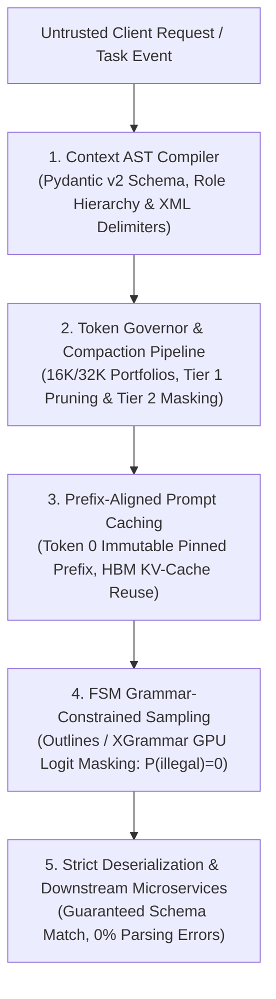

# Phase 01: Prompt & Context Engineering

> **The Architectural Reality**: Natural language prompt begging is dead. In production enterprise architectures, the context window is not a conversational chat box; it is an **execution register and compiled runtime memory space**. Operating AI systems with high reliability requires treating context as an Abstract Syntax Tree (AST), budgeting tokens like operating system memory pages, leveraging physical GPU Key-Value (KV) cache reuse, and enforcing schema compliance via grammar-constrained logit masking.

---

## 🎯 Phase Engineering Goal

This phase equips senior developers, staff software engineers, and solutions architects to transition from fragile string concatenation to **Deterministic Context Compilation**.

By completing Phase 01, you will be able to:
1. **Architect Context ASTs**: Build typed, multi-layer context trees that enforce the 4-tier role hierarchy and neutralize prompt injection attacks via XML delimiter sandboxing.
2. **Eliminate Overflow Crashes**: Sizing deterministic 16K/32K token portfolios and executing a 4-tier compaction escalation pipeline that accounts for reasoning model thinking tokens.
3. **Slash Latency & Cloud Costs**: Exploit GPU KV-cache persistence across Anthropic, OpenAI, and Gemini to achieve up to 90% cost savings and 80% TTFT reduction.
4. **Guarantee 100% JSON Compliance**: Eliminate regex parsing and markdown backtick poisoning using Finite State Machine (FSM) logit masking and XGrammar co-designed GPU decoding.
5. **Mitigate Attention Amnesia**: Defeat the Lost-in-the-Middle U-curve and Context Rot using Boundary Pinning and Edge-Weighted Positional Reranking, validated against the RULER benchmark.

---

## 🗺️ Learning Path & System Topology

The diagram below illustrates the end-to-end data lifecycle of a production context engineering pipeline:

### Step-by-Step Architecture Walkthrough:
1. **Prompt Foundations & Message Roles (Lesson 00)**: Structure prompts into discrete, role-attributed message turns (`system`/`developer`, `user`, `assistant`), leverage in-context learning to steer output probabilities, and sandbox untrusted text within XML delimiters.
2. **Context AST Assembly (Lesson 01)**: Ingest application state, user queries, and retrieved knowledge, compiling them into a typed 3-layer Context AST (`Static Prefix` → `Semi-Dynamic` → `Dynamic Tail`). Untrusted text is escaped and sandboxed within XML boundaries.
3. **Token Governance & Compaction (Lesson 02)**: Measure token footprints against portfolio limits. If thresholds are exceeded, the 4-tier compaction pipeline progressively executes deterministic pruning, historical tool payload masking, and summarization.
4. **Physical Prompt Cache Reuse (Lesson 03)**: Dispatch the immutable static prefix with provider cache headers. When matching pre-existing tensors in GPU HBM, matrix prefill compute is bypassed, slashing TTFT and cost.
5. **Constrained Grammar Sampling (Lesson 04)**: Dynamically mask illegal token logits to $-\infty$ via FSM/CFG transition tables, mathematically guaranteeing that every emitted token strictly adheres to the defined JSON schema.
6. **Long-Context Reliability & Context Rot (Lesson 05)**: Defeat the Lost-in-the-Middle U-curve and attention amnesia across long contexts using Boundary Pinning and edge-weighted reranking validated against the RULER benchmark.

---

## 📚 Modular Curriculum Lessons

| # | Lesson Title | Depth Tier | Core Systems Focus | Engineering Outcome |
|:---:|---|:---:|---|---|
| **00** | **[Prompt Engineering Fundamentals: Roles & ICL](./00-prompt-engineering-fundamentals-roles-and-in-context-learning.md)** | `🟢 Core` | Message role protocol (`system`/`developer`, `user`), ChatML framing tokens, in-context learning (few-shot conditioning), structural XML delimiters, sandboxing. | Establish boundary-safe, role-attributed message structures. |
| **01** | **[Context AST Architecture & Structured Composition](./01-context-ast-architecture.md)** | `🟡 Engineering Depth` | Compiler AST metaphor, 3-layer schema, 4-tier role hierarchy, XML delimiter sandboxing, decoupling LLM extraction from deterministic rule engines. | Compile typed context payloads that neutralize prompt injection attacks. |
| **02** | **[Dynamic Token Budgeting & Compaction Pipelines](./02-token-budgeting-and-compaction.md)** | `🟡 Engineering Depth` | 16K/32K/64K portfolios, headroom math, reasoning model thinking token buffers, 4-tier compaction escalation, LLMLingua 2 vs. heuristic pruning, tool schema budgeting. | Eliminate HTTP 400 context overflow crashes and manage multi-turn tool history. |
| **03** | **[Prefix & Prompt Caching Mechanics](./03-prefix-and-prompt-caching.md)** | `🟡 Engineering Depth` | GPU KV-cache physics, contiguous prefix invariant, prefix taint bug, Anthropic ordering, OpenAI 128-token chunk quantization, Gemini caching, RadixAttention trees. | Cut input costs by up to 90% and reduce TTFT via GPU memory reuse. |
| **04** | **[Constrained Decoding & Schema FSMs](./04-constrained-decoding-and-schema-fsm.md)** | `🟡 Engineering Depth` | Fragility of naive JSON, DFA/CFG logit masking loop, vocabulary partitioning, Outlines vs. XGrammar GPU decoding, OpenAI `strict: true`, over-constrained schema deadlocks. | Guarantee 100% JSON schema compliance at the sampling layer with zero regex hacks. |
| **05** | **[Maximum Effective Context Window (MECW) & Context Rot](./05-mecw-and-context-rot.md)** | `🔵 Advanced` | MECW vs. advertised windows, attention U-curve (Lost-in-the-Middle), RULER multi-hop benchmark, context rot SNR equation, 50% operational rule, Boundary Pinning, edge-weighted reranking. | Prevent silent middle-void attention amnesia across long contexts. |

---

## 🧪 Hands-On Labs & Reference Implementations

- **Phase Capstone Lab**: **[Cached, Type-Safe Financial Compliance Engine](./labs/capstone-context-engineering-pipeline.md)**  
  Build an enterprise audit engine in Python or C# that compiles a 10,000-token banking regulation manual, achieves >90% KV-cache hit efficiency, and enforces strict JSON schema deserialization across 25 concurrent evaluations.
- **Production Reference Code**:
  - [`examples/context_pipeline.py`](./examples/context_pipeline.py): Production context compiler with Anthropic GA prompt caching, XML sanitization, and Pydantic v2 validation.
  - [`examples/semantic_layer_decoupling.py`](./examples/semantic_layer_decoupling.py): Enterprise benchmark demonstrating why deterministic business rule engines must be decoupled from LLM extraction (85% token reduction, 100% test coverage).
  - [`examples/StrictJsonPipeline.cs`](./examples/StrictJsonPipeline.cs): Standalone .NET 9 console harness demonstrating grammar-constrained logit masking with Azure OpenAI / OpenAI SDK and `ChatResponseFormat.CreateJsonSchemaFormat`.

---

## 📋 Prerequisites & Cross-Phase Dependencies

- **Upstream Foundations**: Requires **[Phase 00: Foundations, LLM Mechanics & Token Economics](../00-foundations-and-token-mechanics/README.md)** (specifically BPE subword tokenization, GPU memory bandwidth walls, KV-cache growth math, and test-time compute scaling).
- **Downstream Beneficiaries**:
  - **[Phase 02: Enterprise Retrieval (RAG) & Knowledge Systems](../02-rag-and-knowledge-systems/README.md)**: Leverages Context AST assembly, positional boundary pinning, and cached-document contextual enrichment.
  - **[Phase 03: Tools & Model Context Protocol (MCP)](../03-tools-and-model-context-protocol/README.md)**: Leverages tool schema budgeting and constrained structured outputs for tool invocation wire protocols.
  - **[Phase 04: Stateful Agent Orchestration](../04-agentic-systems-and-orchestration/README.md)**: Implements multi-turn compaction pipelines and event-sourced dialogue states.

---

## 📚 Curated Primary Sources & Verification References

1. **RULER Benchmark**: *RULER: What's the Real Context Size of Your Long-Context Language Models?* (Hsieh et al., COLM 2024, arXiv:2404.06654).
2. **XGrammar**: *XGrammar: Flexible and Efficient Structured Generation to Enable LLM Deployment* (arXiv:2411.15100).
3. **RadixAttention / SGLang**: *SGLang: Efficient Execution of Structured Language Model Programs* (Zheng et al., NeurIPS 2024, arXiv:2312.07104).
4. **Outlines Guided Generation**: *Efficient Guided Generation for Large Language Models* (Willard & Louf, 2023, arXiv:2307.09702).
5. **Lost in the Middle**: *Lost in the Middle: How Language Models Use Long Contexts* (Liu et al., Stanford / UC Berkeley, 2023, arXiv:2307.03172).
6. **Anthropic Engineering Documentation**: *Prompt Caching Architecture & Best Practices* (`https://docs.anthropic.com/en/docs/build-with-claude/prompt-caching`).
7. **OpenAI Platform Documentation**: *Structured Outputs & Developer Messages* (`https://platform.openai.com/docs/guides/structured-outputs`).

---

## 🧭 Navigation

- **Previous Phase**: **[← Phase 00: Foundations, LLM Mechanics & Token Economics](../00-foundations-and-token-mechanics/README.md)**
- **Next Phase**: **[Phase 02: Enterprise Retrieval (RAG) & Knowledge Systems →](../02-rag-and-knowledge-systems/README.md)**
