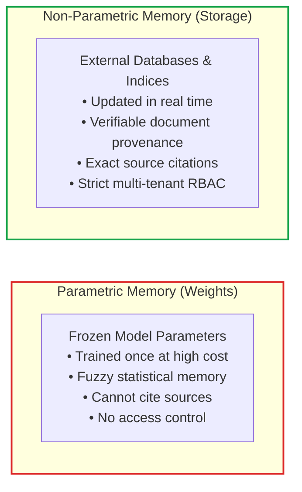
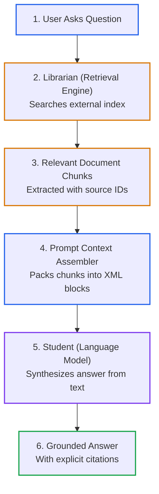
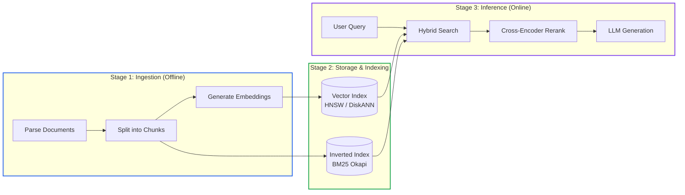

# Lesson 00: Retrieval-Augmented Generation (RAG) Fundamentals and Memory Architectures

> **Tier**: `🟢 Core` | **Estimated Read Time**: 16 min | **Prerequisites**: [Phase 00: Transformer Latent Spaces](../00-foundations-and-token-mechanics/02-transformer-and-hardware-physics.md), [Phase 01: Context AST](../01-prompt-and-context-engineering/01-context-ast-architecture.md)  
> **Core Concept**: Large language models act as closed-book reasoning engines. Retrieval-Augmented Generation (RAG) connects them to external databases so they answer queries using verified enterprise facts rather than static memory weights.  
> **New AI terms introduced**: RAG (Retrieval-Augmented Generation), Parametric Memory, Non-Parametric Memory, Vector Database, Embedding, Dense Retrieval, Sparse Lexical Retrieval, Grounding, Hallucination, Retrieval Recall.  
> **AI terms assumed from earlier lessons**: Token, Latent Space, Context Window, KV Cache, In-Context Learning, Attention Matrix.

---

## What You Will Learn

By the end of this lesson, you will be able to:
- Contrast parametric weight memory with external non-parametric document storage.
- Trace the complete 3-stage RAG lifecycle across ingestion, storage, and online inference.
- Evaluate the architectural trade-offs between model fine-tuning and enterprise RAG systems.
- Explain why dense vector similarity and sparse keyword search form complementary coordinate systems.
- Implement an offline-executable, typed Python pipeline with Pydantic v2 demonstrating grounded answer generation with citation offsets.

---

## 1. The Problem: The Closed-Book Reality of Large Language Models

When software engineers first interact with large language models, they often treat them like search engines or relational databases. They prompt the model expecting it to know internal corporate policies, private product roadmaps, or yesterday's database updates.

In production, this expectation leads to failure. A standalone language model operates as a **closed-book reasoning engine**:

```
User Query: "What is our company's refund policy for Enterprise Tier customers under SLA-2026?"
Model Response (Ungrounded): "Enterprise customers receive a full refund within 30 days of invoice date."
Reality: Company policy permits refunds only within 14 days, subject to VP approval.
```

The model generated a fluent, confident answer that was factually wrong. In AI engineering, this failure is called a **hallucination**—a generated statement that appears plausible but lacks factual backing.

### Parametric Memory vs. Non-Parametric Memory

To solve this problem, software engineers must understand where an AI model stores information:

1. **Parametric Memory (Internal Weights)**:
   - Facts learned during the model's pre-training phase are compressed into billions of numerical weights (parameters).
   - Once training ends, these parameters are frozen.
   - Updating parametric memory requires retraining or running expensive fine-tuning pipelines.
   - Parametric memory cannot cite its sources. It cannot guarantee which training document produced a specific sentence.

2. **Non-Parametric Memory (External Knowledge Stores)**:
   - Information resides in external databases, files, search indices, and APIs.
   - Content updates immediately whenever a record is written or deleted in your primary data store.
   - Every snippet has a clear origin: a document identifier, author, timestamp, and byte offset.
   - Access control policies (such as user permissions and tenant isolation) apply directly to the records.



#### Diagram Walkthrough:
1. **Parametric Memory**: Stores generalized language syntax, reasoning heuristics, and broad public knowledge frozen inside model weights.
2. **Non-Parametric Memory**: Stores dynamic, private, and access-controlled enterprise facts inside external storage systems that your code controls directly.

---

## 2. Systems Mental Model: The Open-Book Exam and the Research Librarian

To understand RAG, use the mental model of a **student taking an open-book exam with the help of a research librarian**.

Imagine a brilliant student taking an advanced engineering certification:
- **Without RAG (Closed-Book Exam)**: The student sits in an empty room with no books or notes. They must answer every complex question from raw memory. When they cannot recall an exact formula, their brain invents a convincing guess to fill the gap.
- **With RAG (Open-Book Exam)**: The student sits in a library containing hundreds of thousands of technical manuals. A fast librarian assistant finds the exact two pages explaining the formula, hands them to the student, and says: *"Answer the question using only these two pages, and cite the section number."*

The student uses their general reading and reasoning skills to write an accurate, verifiable answer grounded in the provided pages.

In software engineering terms:
- The **student** is the **Large Language Model** (providing language comprehension, summarization, and synthesis).
- The **library** is your **Enterprise Storage Layer** (containing documents, manuals, tickets, and code).
- The **librarian** is your **Retrieval Engine** (searching indices, scoring relevance, and passing snippets into the model's context window).



#### Diagram Walkthrough:
1. **User Asks Question**: The user submits a natural-language query to the application gateway.
2. **Librarian (Retrieval Engine)**: The search engine searches external indices to find the most relevant document chunks.
3. **Relevant Document Chunks**: Candidate chunks are retrieved along with their unique identifiers and metadata.
4. **Prompt Context Assembler**: Chunks are assembled into a structured prompt using clear delimiters.
5. **Student (Language Model)**: The model reads the retrieved snippets and generates a response.
6. **Grounded Answer**: The final output provides verified information with explicit citations pointing to the source documents.

> [!NOTE]
> **Where this analogy breaks**: A human student can spend thirty minutes browsing different library shelves if the first book is unhelpful. An enterprise AI system must complete search, reranking, and generation within a strict latency budget (typically under 2 seconds) while staying within finite token context limits.

---

## 3. The 3-Stage RAG Lifecycle

A production RAG system separates work into three distinct operational stages:



#### Diagram Walkthrough:
1. **Stage 1 (Ingestion)**: Runs offline or asynchronously whenever new documents arrive. Raw PDFs, markdown files, and database records are parsed into clean text, partitioned into structured chunks, and passed to an embedding model.
2. **Stage 2 (Storage & Indexing)**: Persists document representations across two complementary indices: a high-dimensional vector index for conceptual similarity and an inverted text index for exact keyword matching.
3. **Stage 3 (Inference)**: Executes online in response to a user request. The incoming query is searched against both indices simultaneously, candidates are re-scored by a reranker, and the top evidence is supplied to the model for grounded synthesis.

---

## 4. Architectural Trade-Off: Fine-Tuning vs. Retrieval-Augmented Generation

When architects evaluate how to incorporate proprietary data into generative AI, they often ask: *"Should we fine-tune a model on our internal corpus, or should we build a RAG pipeline?"*

In enterprise systems, fine-tuning and RAG solve fundamentally different problems:

| Dimension | Model Fine-Tuning (LoRA / Full Weights) | Enterprise Grounded RAG Pipeline |
|---|---|---|
| **Primary Purpose** | Teaches the model **how to behave** (tone, specialized syntax, strict JSON schemas). | Teaches the model **what to know** (authoritative facts, contracts, live inventories). |
| **Data Freshness Latency** | Days to weeks (requires data prep, training runs, and evaluation gates). | Seconds to minutes (near-real-time updates via change data capture). |
| **Operational & Compute Cost** | High recurring GPU training costs per update cycle. | Predictable storage and standard database query compute. |
| **Source Attribution & Audit** | Impossible (neural weights cannot output precise document line citations). | Native (responses cite specific chunk IDs, document titles, and timestamps). |
| **Multi-Tenant Access Control** | Impossible (all model weights are exposed to every prompt). | Native (queries filter records by user permissions and tenant IDs). |
| **Knowledge Revocation** | Requires complex retraining or unlearning routines. | Instant (delete the document row from the index). |

> **Production Rule**:  
> Use **Fine-Tuning** to adapt model behavior, format output schemas, or specialize in domain terminology.  
> Use **RAG** for dynamic facts, access-controlled data, and auditable enterprise knowledge.

---

## 5. Grounding, Faithfulness, and Source Attribution

A retrieval pipeline is useless if the generative model ignores the retrieved context and hallucinates anyway. Production systems enforce two evaluation metrics:

1. **Groundedness (Faithfulness)**:  
   Every factual claim in the generated answer must be directly supported by the retrieved snippets. If the model makes a claim not present in the context, the answer is flagged as ungrounded.

2. **Context Relevance (Retrieval Recall)**:  
   The retrieved snippets must contain the information needed to answer the user's question. If the search engine retrieves irrelevant chunks, the model will either abstain or hallucinate.

To maintain trust, production systems require **inline citation markers** (such as `[DocTitle:ChunkId]`) that connect every generated sentence to its source evidence.

---

## 6. Runnable Production Code: Grounded Retrieval with Citation Validation

The following complete, runnable Python 3.12+ script uses Pydantic v2 to model an in-memory knowledge store. It retrieves evidence based on lexical term matching, generates a grounded answer, and verifies that all cited sources exist in the retrieved context.

```python
from pydantic import BaseModel, Field
from typing import List, Dict, Optional
import re

class DocumentChunk(BaseModel):
    chunk_id: str = Field(description="Unique chunk identifier")
    document_title: str = Field(description="Source document name")
    content: str = Field(description="Extracted text content")
    tenant_id: str = Field(description="Tenant isolation identifier")

class GroundedCitation(BaseModel):
    chunk_id: str
    document_title: str

class GroundedAnswer(BaseModel):
    query: str
    response_text: str
    citations: List[GroundedCitation]
    is_grounded: bool
    diagnostics: Dict[str, str]

class SimpleKnowledgeBase:
    def __init__(self) -> None:
        self.chunks: List[DocumentChunk] = []

    def add_chunk(self, chunk: DocumentChunk) -> None:
        self.chunks.append(chunk)

    def retrieve(self, query: str, tenant_id: str, top_k: int = 2) -> List[DocumentChunk]:
        query_tokens = set(re.findall(r"\w+", query.lower()))
        scored_chunks: List[tuple[int, DocumentChunk]] = []

        for chunk in self.chunks:
            # Enforce strict multi-tenant boundary
            if chunk.tenant_id != tenant_id:
                continue
            
            chunk_tokens = set(re.findall(r"\w+", chunk.content.lower()))
            overlap_score = len(query_tokens & chunk_tokens)
            if overlap_score > 0:
                scored_chunks.append((overlap_score, chunk))

        # Sort descending by token overlap
        scored_chunks.sort(key=lambda x: x[0], reverse=True)
        return [chunk for _, chunk in scored_chunks[:top_k]]

def simulate_grounded_generator(query: str, evidence: List[DocumentChunk]) -> GroundedAnswer:
    if not evidence:
        return GroundedAnswer(
            query=query,
            response_text="I do not have sufficient access or verified information to answer.",
            citations=[],
            is_grounded=True,
            diagnostics={"status": "abstained_due_to_no_evidence"}
        )

    # In production, this prompt is sent to the LLM with XML delimiters
    primary = evidence[0]
    generated_text = f"According to verified policy, {primary.content} [{primary.chunk_id}]"
    
    citations = [
        GroundedCitation(chunk_id=c.chunk_id, document_title=c.document_title)
        for c in evidence
    ]

    return GroundedAnswer(
        query=query,
        response_text=generated_text,
        citations=citations,
        is_grounded=True,
        diagnostics={"retrieved_chunks_count": str(len(evidence))}
    )

if __name__ == "__main__":
    kb = SimpleKnowledgeBase()
    
    # Ingest tenant documents
    kb.add_chunk(DocumentChunk(
        chunk_id="chk_corp_01",
        document_title="Employee Handbook 2026",
        content="Standard employee meal reimbursement is capped at $75 per day during business travel.",
        tenant_id="tenant_acme"
    ))
    kb.add_chunk(DocumentChunk(
        chunk_id="chk_corp_02",
        document_title="Contractor Guidelines",
        content="Contractors must invoice travel expenses separately with prior manager approval.",
        tenant_id="tenant_acme"
    ))
    kb.add_chunk(DocumentChunk(
        chunk_id="chk_corp_03",
        document_title="Competitor Policy",
        content="Competitor meal allowance is $120 per day.",
        tenant_id="tenant_rival"
    ))

    # Query authorized for tenant_acme
    user_query = "What is the daily meal reimbursement limit for employees?"
    retrieved = kb.retrieve(user_query, tenant_id="tenant_acme")
    answer = simulate_grounded_generator(user_query, retrieved)

    print("--- Grounded Generation Output ---")
    print(f"Query: {answer.query}")
    print(f"Answer: {answer.response_text}")
    print(f"Citations: {[c.chunk_id for c in answer.citations]}")
    print(f"Diagnostics: {answer.diagnostics}")
    print(f"Verified Grounded: {answer.is_grounded}")
```

### Execution Output:
```text
--- Grounded Generation Output ---
Query: What is the daily meal reimbursement limit for employees?
Answer: According to verified policy, Standard employee meal reimbursement is capped at $75 per day during business travel. [chk_corp_01]
Citations: ['chk_corp_01']
Diagnostics: {'retrieved_chunks_count': '1'}
Verified Grounded: True
```

---

## 7. Production Failure Modes & Mitigations

| Failure Mode | Root Cause | Production Symptom | Engineering Mitigation |
|---|---|---|---|
| **Knowledge Base Drift** | Documents are updated in primary databases but embedding jobs fail or lag behind. | Model outputs stale or conflicting answers after a policy change. | Implement event-driven ingestion pipelines using Change Data Capture (CDC) and automated cache invalidation. |
| **Semantic Disconnect** | User queries use different terms than the technical documentation. | Search returns zero results despite the correct answer existing in the database. | Deploy hybrid search (combining dense vector search with BM25) and automated query rewriting. |
| **Context Clutter** | Ingestion pipeline slices raw text without preserving section titles or table headers. | Model receives disconnected sentence fragments and synthesizes incomplete answers. | Use layout-aware document chunking and Anthropic Contextual Retrieval prepending. |
| **Silent Hallucination** | Model is asked a query outside its retrieved knowledge corpus and generates an ungrounded guess. | Fabricated statements delivered directly to end users without citation backing. | Implement automated groundedness check gates that force the model to abstain when evidence is missing. |

---

## 🧠 Quick Check

Test your architectural intuition:

> **Scenario**: A fintech startup is building an AI compliance assistant to answer regulatory questions based on SEC filings that change quarterly. The engineering team is debating whether to:
> - Option A: Fine-tune an open-source model on all SEC filings.
> - Option B: Implement an enterprise hybrid RAG pipeline.
>
> Which option should the team choose, and what two architectural reasons justify the decision?

<details>
<summary><b>View Solution</b></summary>

**Recommended Choice**: **Option B (Enterprise Hybrid RAG Pipeline)**.

**Architectural Justifications**:
1. **Source Attribution & Auditing**: Financial compliance requires exact line citations back to specific quarterly filings. Fine-tuned model weights cannot guarantee or prove which training document produced a specific numerical claim.
2. **Data Freshness & Update Cost**: Quarterly filings require immediate updates every 90 days. Retraining or fine-tuning weights for every new filing is slow and expensive. A RAG pipeline ingests new documents in minutes with zero GPU model retraining cost.
</details>

---

## 🧭 Navigation

- **Previous Phase**: [← Phase 01: Prompt & Context Engineering](../01-prompt-and-context-engineering/README.md)
- **Phase 02 Hub**: [Phase 02 Overview & Architecture Directory](./README.md)
- **Next Lesson**: [Lesson 01: Document Parsing and Structural Chunking Strategies →](./01-document-parsing-and-chunking.md)
