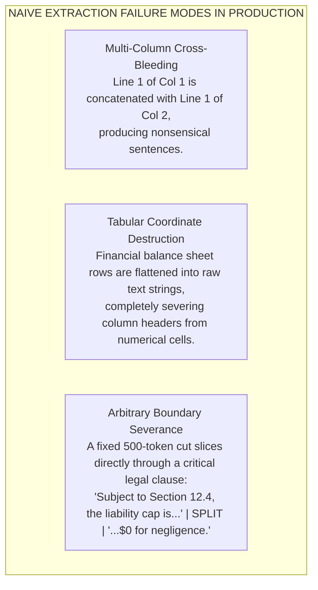
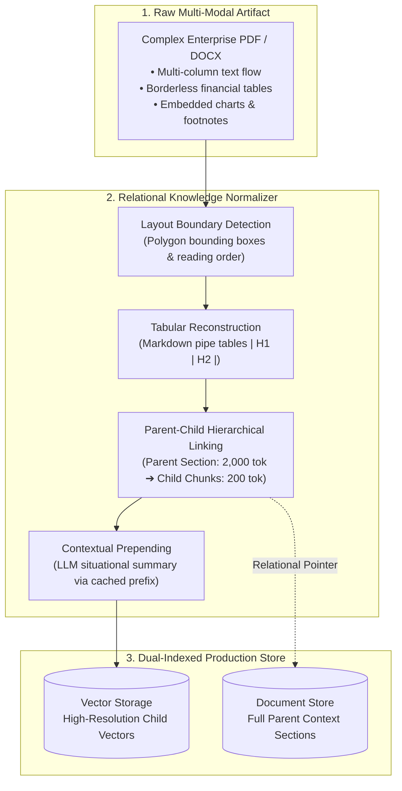

# Document Parsing & Structural Chunking Strategies

> **Tier**: `HIGH ROI / CORE` | **Estimated Read Time**: 18 min | **Prerequisites**: [Phase 00: BPE Tokenization](../00-foundations-and-token-mechanics/02-tokenization-and-bpe-mechanics.md), [Phase 01: Context AST](../01-prompt-and-context-engineering/01-context-ast-architecture.md)

---

## What You Will Learn

By the end of this lesson, you will be able to:
- Diagnose and eliminate layout destruction failures caused by naive PDF/DOCX extractors (multi-column cross-bleeding and tabular flattening).
- Select and tune chunking methodologies based on document topology (fixed, recursive character, and semantic splitting).
- Implement a hierarchical Parent-Child (Small-to-Big) chunking architecture that decouples retrieval precision from synthesis context.
- Apply Anthropic Contextual Retrieval (chunk prepending) using parent-document prompt caching to reduce retrieval failure rates by up to 49%.
- Evaluate the emerging visual document retrieval paradigm (ColPali) for OCR-free, patch-based document search.

---

## 1. The Problem: The Ingestion Reality Gap

In enterprise production, your retrieval system is only as good as the structural integrity of its ingestion pipeline: **Garbage in, garbage retrieved.**

Software engineers building initial RAG prototypes typically take a 50-page corporate PDF or SEC 10-K filing, run a naive Python text extractor (such as `pypdf` or `pdfminer`), split the resulting raw string into 500-character blocks, and push them to a vector database.

Under production enterprise workloads, this naive approach collapses catastrophically:

### The Production Failure Scenarios



#### Diagram Walkthrough:
1. **Multi-Column Cross-Bleeding**: Naive extractors scan text left-to-right across the raw page coordinates. In a two-column whitepaper or analyst report, line 1 of the left column merges horizontally into line 1 of the right column, corrupting syntax and syntax-aware embeddings.
2. **Tabular Coordinate Destruction**: Tables are two-dimensional spatial coordinate matrices. Flattening a balance sheet converts `Row: Operating Expenses | Q1: 4.2M | Q2: 4.8M` into `Operating Expenses 4.2M 4.8M`, destroying the semantic relationship between column headers and values.
3. **Arbitrary Boundary Severance**: Blind token slicing splits sentences, clauses, and entity names mid-stream. If a liability cap condition is severed from the dollar figure, the LLM hallucinates an unconditional indemnity.

---

## 2. Systems Mental Model: The Relational Knowledge Normalizer

Do not view document ingestion as simply "reading a text file." 

Instead, view document ingestion as a **Relational Knowledge Normalizer**. Think of it as an ETL (Extract, Transform, Load) pipeline that takes complex documents (like multi-column PDFs with tables and images) and converts them into structured data. It maintains the relationships between different parts of the document (like connecting a specific paragraph back to its parent section header) and preserves important metadata (like page numbers and document IDs).



### Visual Normalizer Walkthrough:
1. **Raw Ingestion (Stage 1)**: Ingests complex PDFs containing headers, footers, sidebars, multi-column flows, and complex financial matrices.
2. **Layout Detection & Reconstruction (Stage 2)**: Layout engines use geometric bounding polygons to sequence columns in natural reading order, while tables are synthesized into structured Markdown or HTML tables.
3. **Hierarchy & Context Prepending**: Text is split into small, precise child chunks (100–200 tokens) linked to large parent sections (1,000–2,000 tokens), and prepended with document context summaries.
4. **Normalized Indexing (Stage 3)**: Child chunks are embedded into vector storage for high-precision retrieval; when a child chunk hits, the database retrieves its parent section to pass to the LLM.

---

## 3. Layout-Aware Parsing: Preserving Spatial Structures

To prevent multi-column cross-bleeding and table scrambling, enterprise pipelines employ layout-aware document engines (such as Azure Document Intelligence `prebuilt-layout`, AWS Textract, Marker, or open-source Docling).

### 3.1. Reading Order Sequence Flow
A layout-aware parser identifies bounding polygons `[x1, y1, x2, y2, x3, y4]` for every text block on the page. It groups blocks into logical columns, determines reading flow from column top-to-bottom, and discards recurring noise elements (running headers, page numbers, and copyright footers).

### 3.2. Tabular Reconstruction to GitHub Flavored Markdown
Tables must never be ingested as plain running text. A layout engine detects row and column coordinates, accounts for merged cells (`rowSpan`, `columnSpan`), and serializes the matrix into GitHub Flavored Markdown:

```markdown
| Fiscal Period | North America Revenue | EMEA Revenue | Operating Margin % |
|---|---|---|---|
| Q1 2024 | USD 42.5M | USD 31.2M | 18.4% |
| Q2 2024 | USD 45.1M | USD 33.8M | 19.1% |
| Q3 2024 | USD 48.2M | USD 34.5M | 20.2% |
```

**Why Markdown Tables Excel in Embeddings**: Modern dense embedding models (`text-embedding-3`, `voyage-3`, `bge-m3`) are trained extensively on developer repositories and Markdown documentation. They reliably capture coordinate row-column relationships when formatted as pipe tables.

---

## 4. Chunking Methodologies: Trade-offs & Mechanics

Chunking governs the fundamental trade-off between **semantic specificity** (smaller chunks yield higher cosine similarity to narrow queries) and **sufficient context** (larger chunks give the generator enough evidence to reason):

| Chunking Strategy | Algorithmic Mechanics | Key Advantages | Production Limitations |
|---|---|---|---|
| **Fixed-Size with Overlap** | Splits text every N characters or tokens with k overlap (e.g. 500 tokens, 50 overlap). | Trivial to implement; zero compute overhead. | Slices sentences mid-clause; destroys table schemas; severe contextual blindness. |
| **Recursive Character Splitting** | Attempts to split on primary separator (`\n\n`); if chunk exceeds target, recurses down to `\n`, space (` `), and character (`""`). | Preserves paragraph and sentence boundaries. | Cannot detect topic shifts; still severs complex arguments across paragraphs. |
| **Semantic Chunking** | Computes embedding vectors for consecutive sentences; splits where cosine distance between adjacent sentences exceeds a statistical threshold. | Preserves cohesive topical boundaries. | High ingestion latency (requires an embedding API call per sentence); volatile chunk sizes. |
| **Parent-Child (Hierarchical)** | Indexes small child chunks (100–200 tokens); stores relational pointer to larger parent section (1,000–2,000 tokens). | Optimal retrieval precision; passes full surrounding context to the LLM. | 2x storage footprint; requires relational metadata storage. |

---

## 5. Hierarchical Parent-Child (Small-to-Big) Architecture

The **Parent-Child pattern** resolves the fundamental dilemma of vector search:

> **The Vector Retrieval Dilemma**:  
> Small chunks (150 tokens) produce sharp, high-confidence vector matches, but lack the context needed for the LLM to generate an answer.  
> Large chunks (1,500 tokens) contain rich context, but their embedding represents an average of many topics, washing out fine-grained semantic signals.

### Mechanics:
1. **At Ingest Time**:
   - The document is divided into **Parent Chunks** aligned with structural section headers (H2/H3, ~1,500 tokens).
   - Each Parent Chunk is subdivided into 4–8 **Child Chunks** (~200 tokens).
   - Each Child Chunk receives a unique `chunk_id` and a foreign key `parent_id`.
   - **Only the Child Chunks are embedded and indexed into the vector store.**
   - The Parent Chunks are stored in a key-value or document datastore (PostgreSQL, Redis, MongoDB, or S3).
2. **At Query Time**:
   - The query executes against the child vector index.
   - When Child Chunk `c_42` hits the top candidate pool, the retriever looks up `parent_id = p_10`.
   - The retriever deduplicates parent IDs and passes the complete **Parent Chunk `p_10`** to the LLM prompt.

---

## 6. Anthropic Contextual Retrieval: Chunk Prepending

Even with parent-child linking, individual chunks frequently suffer from **situational amnesia**.

### The Failure:
Consider this chunk from an SEC filing:
```text
The company reported revenue of $48.2 million, an increase of 12% over the previous period. Operating margin improved by 140 basis points to 21.4%.
```
If a user queries: *"What was Acme Corp's European operating margin in Q3 2024?"*, vector search will struggle to match this chunk because the text does not contain "Acme Corp", "European", or "Q3 2024".

### The Solution:
Anthropic's **Contextual Retrieval** pattern uses a fast model (such as Claude 3.5 Haiku or Gemini 2.0 Flash) during ingestion to generate a 50–100 token situational summary of where the chunk sits within the parent document. This summary is prepended to the chunk text *before* vector embedding and BM25 index creation:

```text
[Context: This chunk is from Acme Corp's Q3 2024 SEC Form 10-Q, Section 2 (Management Discussion of European Operations).]
The company reported revenue of $48.2 million, an increase of 12% over the previous period. Operating margin improved by 140 basis points to 21.4%.
```

### The Production Economics: Prompt Caching
Generating context summaries for 100,000 chunks could cost thousands of dollars if each chunk required sending the full parent document.

By leveraging **Prompt Caching** (Phase 01 Lesson 03), the parent document is placed in the static cache prefix:
- The parent document is cached on the first chunk call.
- Subsequent calls for all remaining chunks from that document read the cached prefix at a **90% cost discount** and sub-100ms latency.
- **Result**: Retrieval failure rate drops by **49%** (and up to **67%** when combined with reranking) at minimal operational expense.

---

## 7. The Frontier Alternative: ColPali (Vision-Language Retrieval)

While layout-aware text extraction is the current industry standard, cutting-edge systems (2025–2026) are adopting **Vision-Language Document Retrieval** via **ColPali** (Faysse et al., 2024):

- **Core Concept**: ColPali completely bypasses OCR, text extractors, layout parsers, and chunking algorithms.
- **Mechanics**:
  1. Each document page is rendered directly as an image (e.g. 1024 × 1024 pixels).
  2. The image is passed through a Vision-Language Model (PaliGemma), which treats visual image patches as tokens.
  3. The model generates multi-vector patch embeddings for the page.
  4. At query time, ColBERT-style late interaction (MaxSim operator) matches the text query tokens directly against visual image patches.
- **Sweet Spot**: Highly complex technical schematics, borderless scanned tables, patents, and multi-column magazine layouts where any text extractor loses visual context.

---

## 8. Enterprise Production Implementation

The following production-ready Python 3.12+ module implements structural document parsing with Pydantic v2 validation, parent-child linking, and contextual enrichment:

```python
"""
structural_chunking.py
Production-grade hierarchical Parent-Child chunking with contextual enrichment.
"""

from __future__ import annotations

import uuid
from typing import Any, Dict, List, Optional
from pydantic import BaseModel, Field


class ChildChunk(BaseModel):
    """Represents a fine-grained, indexable unit of retrieval."""
    chunk_id: str = Field(default_factory=lambda: f"chk_{uuid.uuid4().hex[:8]}")
    parent_id: str
    content: str
    context_prefix: Optional[str] = None
    metadata: Dict[str, Any] = Field(default_factory=dict)

    @property
    def full_indexed_text(self) -> str:
        """Text used for generating dense embeddings and BM25 postings."""
        if self.context_prefix:
            return f"[{self.context_prefix}]\n{self.content}"
        return self.content


class ParentSection(BaseModel):
    """Represents a complete structural section containing full context."""
    parent_id: str = Field(default_factory=lambda: f"prt_{uuid.uuid4().hex[:8]}")
    doc_id: str
    title: str
    raw_content: str
    metadata: Dict[str, Any] = Field(default_factory=dict)
    child_chunks: List[ChildChunk] = Field(default_factory=list)


class HierarchicalChunker:
    """Deconstructs structural documents into parent-child hierarchies."""

    def __init__(self, target_child_chars: int = 600, overlap_chars: int = 100):
        self.target_child_chars = target_child_chars
        self.overlap_chars = overlap_chars

    def split_into_children(
        self,
        parent: ParentSection,
        context_summary: Optional[str] = None
    ) -> List[ChildChunk]:
        """Splits parent content into overlapping child chunks linked to the parent."""
        text = parent.raw_content
        children: List[ChildChunk] = []
        start = 0

        while start < len(text):
            end = start + self.target_child_chars
            # Snap to nearest word boundary
            if end < len(text):
                boundary = text.rfind(" ", start, end)
                if boundary != -1 and boundary > start:
                    end = boundary

            chunk_text = text[start:end].strip()
            if chunk_text:
                child = ChildChunk(
                    parent_id=parent.parent_id,
                    content=chunk_text,
                    context_prefix=context_summary,
                    metadata={
                        "doc_id": parent.doc_id,
                        "section_title": parent.title,
                        **parent.metadata,
                    }
                )
                children.append(child)

            start = end - self.overlap_chars
            if start >= len(text) or end >= len(text):
                break

        parent.child_chunks = children
        return children


# =====================================================================
# Verification & Execution Demonstration
# =====================================================================
if __name__ == "__main__":
    sample_parent = ParentSection(
        doc_id="sec_10q_acme_q3_2024",
        title="Management Discussion: European Operational Division",
        raw_content=(
            "In Q3 2024, our European operational division reported revenue of 48.2 million euros, "
            "an increase of 12% over Q3 2023. Operating margins expanded by 140 basis points to 21.4%. "
            "Supply chain normalization across German and French distribution hubs contributed to lower logistics costs. "
            "Capital expenditures for the region were capped at 8.5 million euros, focused on server hardware upgrades."
        ),
        metadata={"tenant_id": "corp_42", "year": 2024, "division": "EMEA"}
    )

    context_summary = "Doc: Acme Corp Q3 2024 10-Q | Section: EMEA Division Financial Results"
    chunker = HierarchicalChunker(target_child_chars=200, overlap_chars=40)
    children = chunker.split_into_children(sample_parent, context_summary=context_summary)

    print(f"Parent Section ID: {sample_parent.parent_id}")
    print(f"Generated {len(children)} Child Chunks:")
    for idx, c in enumerate(children, start=1):
        print(f"\n--- Child Chunk {idx} (ID: {c.chunk_id}, Parent: {c.parent_id}) ---")
        print(f"Full Indexed Payload:\n{c.full_indexed_text}")
```

---

## 9. Common Production Failure Modes & Anti-Patterns

### 1. The Disconnected CDC Vector Drift
- **The Failure**: A user updates a document in SharePoint, Google Drive, or PostgreSQL. The RAG system continues retrieving the old vector chunk because the vector database was not updated.
- **Architectural Remedy**: Implement **Event-Driven Change Data Capture (CDC)** (e.g. Debezium, Kafka, Azure Cosmos DB Change Feed). On document mutation or deletion, trigger an event-driven worker that purges the obsolete `doc_id` and all associated `chunk_id` records before re-indexing.

### 2. Tokenizer Mismatch Silent Truncation
- **The Failure**: The chunking pipeline measures chunk size using Python characters or OpenAI's `tiktoken` (cl100k_base), but the embedding model (e.g. BERT-based `bge-large`) has a hard 512 WordPiece token ceiling.
- **Architectural Remedy**: Always calibrate chunk length using the **exact tokenizer of the target embedding model**. If chunk tokens exceed the model's sequence ceiling, the model silently truncates trailing tokens without throwing an error, creating blind spots in your vector space.

### 3. Contextual Prepending Contamination
- **The Failure**: An engineer instructs the contextual summarizer model to *"Explain what this chunk is about in 200 words."* The generated summary becomes longer than the chunk itself, diluting the original factual content and causing semantic drift.
- **Architectural Remedy**: Strictly bound the context summary to **under 50 tokens** focusing purely on situational coordinates: Company, Document Title, Date, Section, and Target Entities.

---

## 10. Key Takeaways & Verified Resources

### Key Takeaways
1. **Never Flatten Structured Layouts**: Use layout-aware boundary engines to convert multi-column flows and borderless tables into clean GitHub Flavored Markdown.
2. **Decouple Retrieval from Synthesis**: Use the Parent-Child pattern. Index small, precise child chunks (150–200 tokens) for vector retrieval; return the complete parent section (1,500 tokens) to the generator.
3. **Enrich Chunks at Ingestion Time**: Apply Anthropic Contextual Retrieval to prepend document coordinates, reducing retrieval failure by 49% while using prompt caching to minimize costs.
4. **Calibrate Tokenizers**: Always match your chunking boundaries to the maximum sequence ceiling of your target embedding model.

### Primary References
- **[Anthropic Research: Contextual Retrieval](https://www.anthropic.com/news/contextual-retrieval)**: Empirical proof of 49% failure reduction via chunk contextualization.
- **[ColPali: Efficient Document Retrieval with Vision Language Models](https://arxiv.org/abs/2407.01449)** (Faysse et al., ICLR 2025): Landmark OCR-free document image patch retrieval.
- **[Docling Technical Report](https://github.com/DS4SD/docling)** (IBM Research 2024): Modern open-source layout parsing and table extraction.

---

## 🧭 Navigation

- **[← Phase 02 Hub](./README.md)**
- **[Next Lesson: Late Chunking Deep Dive →](./02-late-chunking-deep-dive.md)**
- **[Capstone Lab: Enterprise Multi-Tenant Hybrid RAG](./labs/capstone-enterprise-rag-pipeline.md)**

