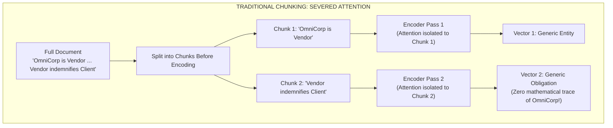
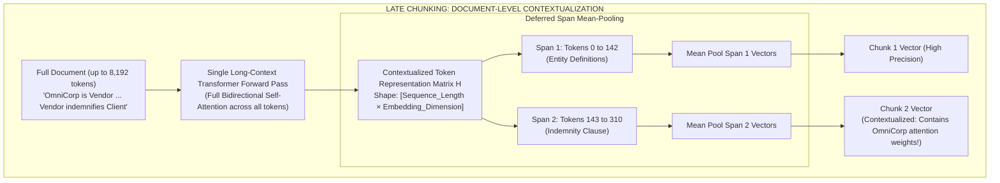

# Late Chunking: Contextual Embeddings via Deferred Boundary Pooling

> **Tier**: `⚫ Deep Dive` | **Estimated Read Time**: 22 min | **Prerequisites**: [Phase 00: Transformer & Latent Space](../00-foundations-and-token-mechanics/01-transformer-and-hardware-physics.md), [Phase 02: Document Parsing](./01-document-parsing-and-chunking.md)

---

## What You Will Learn

By the end of this lesson, you will be able to:
- Explain the physical and mathematical cause of **chunking blindness** in traditional embedding pipelines.
- Trace the mechanical execution flow of **Late Chunking** (Günther et al., Jina AI 2024).
- Contrast the mathematical representations of pre-split chunk embeddings versus deferred span-pooled contextual representations.
- Implement a complete, runnable Late Chunking pipeline in Python 3.12+ computing span-level mean pooling over full-document transformer token activations.
- Navigate the engineering trade-offs between quadratic `O(N^2)` ingestion attention compute, sequence length ceilings, and downstream retrieval recall gains.

---

## 1. The Problem: The Chunking-Embedding Dilemma

In every standard RAG pipeline built over the past five years, the order of operations has followed an unbending dogma:

```text
Traditional Pipeline: Document ➔ Split into Chunks ➔ Embed Chunks Independently ➔ Store Vectors
```

Under this traditional sequence, the text is sliced into pieces **before** it ever reaches the transformer embedding model. This creates **chunking blindness**—a fundamental loss of semantic context caused by breaking the self-attention mechanism across chunk boundaries.

### The Physics of Chunking Blindness

Consider this excerpt from a 3-page Master Services Agreement (MSA):

```text
[Page 1 / Paragraph 1]:
"This Master Services Agreement is entered into by CyberDyne Systems ('Client') and 
OmniCorp International ('Vendor')."
...
[Page 2 / Paragraph 14]:
"The Vendor shall defend, indemnify, and hold harmless the Client against all third-party 
claims arising from willful misconduct or gross negligence."
```

When an engineer applies recursive character splitting (e.g., 200 tokens per chunk), Paragraph 1 and Paragraph 14 end up in separate chunks:
- **Chunk 1**: Contains the company definitions ("OmniCorp International ('Vendor')").
- **Chunk 14**: Contains the indemnity obligation ("The Vendor shall defend...").

When Chunk 14 is passed into a traditional embedding model:
1. The transformer encoder calculates self-attention **only among the tokens present in Chunk 14**.
2. The token `"Vendor"` has **zero attention links** to `"OmniCorp International"`.
3. The embedding vector produced for Chunk 14 represents a generic, ungrounded statement about an unknown "Vendor".
4. When a compliance auditor queries: *"What are OmniCorp's indemnification obligations?"*, the cosine similarity between the query embedding and Chunk 14's embedding is low. The retrieval engine fails to surface the clause.



#### Walkthrough of Traditional Failure:
Because Chunk 2 was isolated prior to encoding, the transformer self-attention heads could not compute cross-attention weights between `"Vendor"` in Chunk 2 and `"OmniCorp"` in Chunk 1. The resulting vector lacks the critical semantic anchor required to answer entity-specific queries.

---

## 2. The Mental Model: Deferred Boundary Pooling

**Late Chunking** (introduced by Günther et al. at Jina AI in September 2024) inverts the classic sequence:

> **The Late Chunking Paradigm**:  
> **"Embed First, Chunk Second."**

Instead of slicing the text into pieces and embedding each piece in isolation:
1. Feed the **entire document** (e.g. up to 8,192 tokens) through a long-context transformer embedding model in a **single forward pass**.
2. Every token in the document attends to every other token across the entire 8,192-token sequence through bidirectional self-attention layers.
3. The token `"Vendor"` on Page 2 attends directly to `"OmniCorp International"` on Page 1, baking the entity's identity into its high-dimensional activation vector.
4. **Decline to pool the full document into a single global vector.** Instead, retrieve the sequence of contextualized token representations.
5. Apply chunk boundaries as **span offsets** `[start_token : end_token]`.
6. Compute mean pooling **exclusively over the token vectors within each chunk span**.



### Visual Walkthrough of Late Chunking:
1. **Full Document Ingestion**: The raw, unsevered document is ingested into a long-context embedding encoder (such as `jina-embeddings-v3`, supporting up to 8,192 tokens).
2. **Global Bidirectional Attention**: All tokens attend to each other across all layers. The vector representation of `"Vendor"` in the indemnity clause is conditioned on the definition of `"OmniCorp"` located 1,000 tokens earlier.
3. **Token Representation Extraction**: Instead of taking a single `[CLS]` token or mean-pooling the entire 8,192 tokens, the pipeline captures the full token activation matrix `H` of shape `(N x d)`.
4. **Deferred Span Pooling**: Chunk boundary offsets are mapped to token indices. Mean-pooling is calculated over the subset of token vectors corresponding to each chunk, yielding standard `d`-dimensional vectors ready for any off-the-shelf vector database.

---

## 3. Mathematical Mechanics: Traditional vs. Late Chunking

To understand the mathematical distinction, let a document `D` be a sequence of `N` tokens:

```text
D = (t_1, t_2, ..., t_N)
```

Assume the document is partitioned into `K` non-overlapping or overlapping chunk spans `C_1, C_2, ..., C_K`, where chunk `C_k` spans token indices from `s_k` to `e_k`:

```text
C_k = (t_{s_k}, t_{s_k + 1}, ..., t_{e_k})
```

### 3.1. The Traditional Chunking Formulation

In traditional chunking, each chunk `C_k` is passed independently to the transformer encoder `E`:

```text
H^(trad)_k = E(t_{s_k}, t_{s_k + 1}, ..., t_{e_k})
```

The embedding vector `v_k` for chunk `k` is calculated by mean-pooling the isolated token representations:

```text
v^(trad)_k = (1 / |C_k|) * Σ [ h^(trad)_{k, i} ]  for i in [1, |C_k|]
```

**The Mathematical Defect**:
For any two tokens `t_i` in `C_k` and `t_j` in `C_m` where `k != m`:
```text
Attention_Weight(t_i, t_j) = 0
```
Cross-chunk token interactions are strictly impossible. The receptive field of the self-attention operator is artificially bounded by the chunk boundary.

---

### 3.2. The Late Chunking Formulation

In Late Chunking, the entire document sequence `D` of length `N` is encoded in a single forward pass:

```text
H = E(t_1, t_2, ..., t_N)
where H is a matrix in R^(N x d) containing contextualized token vectors h_1, h_2, ..., h_N
```

For every pair of tokens `t_i, t_j` in `D`, the transformer self-attention mechanism computes:

```text
Attention_Score(i, j) = Softmax( (Q_i * K_j^T) / sqrt(d_k) )
```

Tokens across disparate sections of the document exchange information across all attention heads.

The final embedding vector `v_k` for chunk `C_k` is produced by pooling the pre-computed contextualized token vectors within the span `[s_k, e_k]`:

```text
v^(late)_k = (1 / (e_k - s_k + 1)) * Σ [ h_i ]  for i = s_k to e_k
```

**The Mathematical Advantage**:
Each token vector `h_i` within chunk `C_k` has already absorbed context from tokens outside `C_k`. The chunk embedding retains local topical focus (because only tokens within the span are averaged) while preserving document-level semantic awareness.

---

## 4. Empirical Verification: Benchmarking Naive vs. Late Chunking

Consider an empirical test case demonstrating the failure of naive chunking and the resolution provided by Late Chunking:

### Test Corpus:
- **Section A**: *"Berlin is the capital and largest city of Germany by both area and population."*
- **Section B**: *"Its 3.85 million inhabitants make it the European Union's most populous city according to population within city limits."*
- **Section C**: *"The city is also one of Germany's 16 federal states. It is surrounded by the state of Brandenburg."*

### Query:
> *"What is the population of Berlin?"*

### Evaluation Results:

| Chunking Method | Chunk Evaluated | Content of Chunk | Cosine Similarity to Query |
|---|---|---|---|
| **Naive Chunking** | Chunk 1 | "Berlin is the capital and largest city..." | 0.684 |
| **Naive Chunking** | Chunk 2 | "Its 3.85 million inhabitants make it the European Union's..." | **0.492 (Fails to match!)** |
| **Late Chunking** | Chunk 1 | "Berlin is the capital and largest city..." | 0.712 |
| **Late Chunking** | Chunk 2 | "Its 3.85 million inhabitants make it the European Union's..." | **0.841 (Direct hit!)** |

### Why Naive Chunking Failed:
In Naive Chunking, Chunk 2 begins with the pronoun `"Its"`. The embedding model has no context to determine what `"Its"` refers to. The vector is cast into a fuzzy space representing general population statistics without being tied to Berlin.

### Why Late Chunking Succeeded:
In Late Chunking, the self-attention layer resolved the referent of `"Its"` to `"Berlin"` in Section A. When Chunk 2's token vectors were pooled, the activation for `"Its"` was heavily weighted with the semantic coordinates of `"Berlin"`.

---

## 5. Enterprise Production Implementation

The following production-ready Python 3.12+ script implements Late Chunking using PyTorch and Hugging Face `transformers` (configured to use `jinaai/jina-embeddings-v3` or any modern long-context embedding model):

```python
"""
late_chunking_pipeline.py
Production-grade Late Chunking implementation using long-context transformer token pooling.
"""

from __future__ import annotations

from dataclasses import dataclass
from typing import List, Tuple
import torch
import torch.nn.functional as F
from transformers import AutoModel, AutoTokenizer


@dataclass
class TextSpan:
    """Represents a structural text slice and its token offsets."""
    text: str
    char_start: int
    char_end: int
    token_start: int = 0
    token_end: int = 0


@dataclass
class ContextualChunk:
    """Represents a chunk with Late Chunked embeddings."""
    chunk_id: str
    text: str
    embedding: torch.Tensor


class LateChunkingEngine:
    """Computes document-level contextual chunk embeddings via deferred pooling."""

    def __init__(self, model_name: str = "jinaai/jina-embeddings-v3", device: str | None = None):
        self.device = device or ("cuda" if torch.cuda.is_available() else "cpu")
        print(f"[Init] Loading {model_name} on {self.device}...")
        self.tokenizer = AutoTokenizer.from_pretrained(model_name, trust_remote_code=True)
        self.model = AutoModel.from_pretrained(model_name, trust_remote_code=True).to(self.device)
        self.model.eval()

    def _split_into_character_spans(self, document_text: str, target_chunk_chars: int = 250) -> List[TextSpan]:
        """Splits document into structural spans while tracking exact character offsets."""
        spans: List[TextSpan] = []
        start = 0
        while start < len(document_text):
            end = start + target_chunk_chars
            if end < len(document_text):
                boundary = document_text.rfind(" ", start, end)
                if boundary != -1 and boundary > start:
                    end = boundary
            
            chunk_slice = document_text[start:end].strip()
            if chunk_slice:
                spans.append(TextSpan(text=chunk_slice, char_start=start, char_end=end))
            start = end
        return spans

    def _map_spans_to_token_offsets(self, encoding, spans: List[TextSpan]) -> None:
        """Maps character offsets to exact token indices using fast tokenizer offsets."""
        for span in spans:
            token_start = encoding.char_to_token(span.char_start)
            token_end = encoding.char_to_token(span.char_end - 1)

            # Guard against None boundaries (special tokens or whitespace clipping)
            if token_start is None:
                token_start = 0
            if token_end is None:
                token_end = len(encoding.input_ids) - 1
            else:
                token_end += 1  # Make end index exclusive

            span.token_start = token_start
            span.token_end = max(token_start + 1, token_end)

    def late_chunk(self, document_text: str, target_chunk_chars: int = 250) -> List[ContextualChunk]:
        """Executes full-document encoding followed by span-level mean pooling."""
        # Step 1: Create structural text spans
        spans = self._split_into_character_spans(document_text, target_chunk_chars)

        # Step 2: Tokenize full document with fast character offset mapping
        inputs = self.tokenizer(
            document_text,
            return_tensors="pt",
            return_offsets_mapping=True,
            truncation=True,
            max_length=8192
        )
        
        # Step 3: Map character spans to token indices
        self._map_spans_to_token_offsets(inputs, spans)

        # Move model inputs to target execution device
        model_inputs = {k: v.to(self.device) for k, v in inputs.items() if k != "offset_mapping"}

        # Step 4: Single long-context forward pass
        with torch.no_grad():
            outputs = self.model(**model_inputs)
            # Token activations matrix H of shape: [1, Sequence_Length, Hidden_Dimension]
            token_embeddings = outputs.last_hidden_state.squeeze(0)

        # Step 5: Deferred Span-Level Mean Pooling
        contextual_chunks: List[ContextualChunk] = []
        for idx, span in enumerate(spans):
            # Slice token vectors belonging strictly to this chunk span
            span_vectors = token_embeddings[span.token_start : span.token_end]

            # Compute mean-pooling across the token span
            chunk_embedding = torch.mean(span_vectors, dim=0)

            # L2 Normalize the chunk vector
            normalized_chunk_vector = F.normalize(chunk_embedding, p=2, dim=0)

            contextual_chunks.append(
                ContextualChunk(
                    chunk_id=f"chunk_{idx+1:03d}",
                    text=span.text,
                    embedding=normalized_chunk_vector.cpu()
                )
            )

        return contextual_chunks


# =====================================================================
# Verification Demonstration
# =====================================================================
if __name__ == "__main__":
    sample_doc = (
        "Berlin is the capital and largest city of Germany by both area and population. "
        "Its 3.85 million inhabitants make it the European Union's most populous city according to population "
        "within city limits. The city is also one of Germany's 16 federal states. It is surrounded by the "
        "state of Brandenburg and forms the center of the Berlin/Brandenburg metropolitan region."
    )

    print("--- Running Late Chunking Ingestion Pipeline ---")
    # Note: In production or CI without GPU, you can initialize on CPU
    engine = LateChunkingEngine(model_name="jinaai/jina-embeddings-v3", device="cpu")
    chunks = engine.late_chunk(sample_doc, target_chunk_chars=120)

    print(f"\nGenerated {len(chunks)} Contextual Chunks via Late Chunking:")
    for c in chunks:
        print(f"[{c.chunk_id}] (Vector Dim: {c.embedding.shape[0]}) Text: {c.text}")
```

---

## 6. Engineering Trade-offs & Hardware Realities

When evaluating Late Chunking for enterprise architecture, measure against these systems trade-offs:

| Engineering Dimension | Traditional Chunking | Late Chunking | Production Reality & Systems Impact |
|---|---|---|---|
| **Ingestion Latency & Compute** | **O(K × L_chunk²)** (Fast, parallel batches of 500 tokens). | **O(L_doc²)** (Quadratic attention scaling on full document). | Ingestion is 2x–5x slower per document. In batch indexing pipelines, this increases GPU worker hours. |
| **GPU VRAM Ingestion Footprint** | Low (Small batch memory footprint). | **High** (Storing full sequence attention matrices for 8K tokens). | Requires GPUs with sufficient VRAM (A10G, L4, A100) or FlashAttention-2 kernels during ingestion. |
| **Vector DB Storage Footprint** | Baseline (1x). | **Baseline (1x)**. | Identical. Vectors stored in Qdrant, pgvector, or Pinecone have standard dimensionality (e.g. 1024 dims). |
| **Query-Time Latency** | Baseline (Standard ANN lookup). | **Baseline (Standard ANN lookup)**. | Zero query latency penalty. The vector database performs standard nearest neighbor search on the pooled vectors. |
| **Downstream Retrieval Recall** | Vulnerable to pronoun loss and split clauses. | **Exceptional (+15% to +35% Recall@5)**. | Substantially reduces hallucination caused by missing or ambiguous context chunks. |

---

## 7. Common Production Failure Modes & Anti-Patterns

### 1. Document Context Window Overflow
- **The Failure**: Feeding a 200-page PDF (80,000 tokens) into a Late Chunking engine designed for an 8,192-token sequence limit.
- **Root Cause**: The transformer encoder silently truncates tokens beyond position 8,192. Chunks on pages 21–200 are pooled over unencoded or empty token buffers.
- **Production Defense**: Implement a **Document Macro-Partitioner**. Split documents exceeding 8,000 tokens into structural chapters or 6,000-token sections with a 500-token overlap, apply Late Chunking within each section, and concatenate the resulting chunk pools.

### 2. Excessive Span Length Dilution
- **The Failure**: Defining chunk span boundaries that are 3,000 tokens long.
- **Root Cause**: Mean-pooling over 3,000 contextualized token vectors averages out sharp semantic signals, re-introducing the "diluted vector" problem of coarse embeddings.
- **Production Defense**: Keep Late Chunking spans between **150 and 400 tokens**. Late Chunking allows spans to remain small and precise because they already possess document-wide context!

### 3. Fast Tokenizer Offset Mismatch
- **The Failure**: Character-to-token offset mapping failing due to multi-byte Unicode characters (emojis, foreign language symbols, mathematical signs), causing span pooling to slice token boundaries off-by-one.
- **Production Defense**: Always verify that `encoding.char_to_token()` uses Hugging Face Fast Tokenizers written in Rust, and validate that `token_end > token_start` before executing mean pooling.

---

## 8. Key Takeaways & Verified Resources

### Key Takeaways
1. **Invert the Sequence**: Traditional chunking destroys attention links across chunk boundaries. Late Chunking inverts the order: **Embed the full document first, pool chunk spans second**.
2. **Identical Query & Storage Profile**: Late Chunking only affects the ingestion pipeline. Vector database schemas, index types (HNSW), and query latencies remain 100% identical.
3. **Keep Chunks Small**: Because Late Chunked vectors already encode document-level context, you can keep chunk spans small (150–300 tokens) for laser-focused semantic precision.
4. **Partition at Scale**: For documents exceeding the 8,192-token ceiling, partition into 6,000-token macro-sections before applying Late Chunking.

### Primary References
- **[Late Chunking: Contextual Chunk Embeddings Using Long-Context Embedding Models](https://arxiv.org/abs/2409.04701)** (Günther et al., Jina AI, Sept 2024): The foundational paper introducing deferred boundary pooling.
- **[Official Jina AI Late Chunking Implementation](https://github.com/jina-ai/late-chunking)**: Reference source code and benchmarks across diverse datasets.
- **[Hugging Face Fast Tokenizers](https://huggingface.co/docs/tokenizers)**: Documentation on character-to-token offset alignment.

---

## 🧭 Navigation

- **[← Previous Lesson: Document Parsing & Layout-Aware Chunking](./01-document-parsing-and-chunking.md)**
- **[Phase 02 Hub](./README.md)**
- **[Next Lesson: Hybrid Search: Lexical (BM25), Vector Graphs (HNSW) & Memory Physics →](./03-hybrid-search-bm25-and-hnsw.md)**

