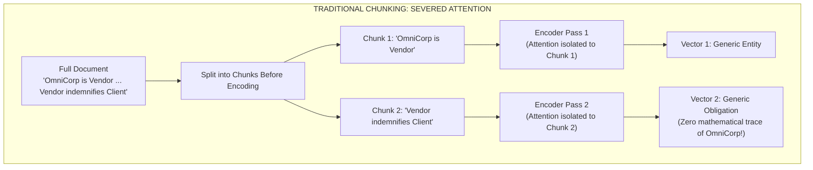
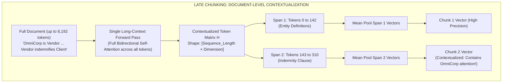

# Lesson 02: Late Chunking: Contextual Embeddings via Deferred Boundary Pooling

> **Tier**: `⚫ Deep Dive` | **Estimated Read Time**: 22 min | **Prerequisites**: [Phase 00: Transformer Latent Spaces](../00-foundations-and-token-mechanics/02-transformer-and-hardware-physics.md), [Phase 02 Lesson 01: Document Parsing and Structural Chunking Strategies](./01-document-parsing-and-chunking.md)  
> **Core Concept**: Traditional chunking breaks self-attention between chunks, creating pronoun blindness. Late Chunking embeds the entire document first and defers mean-pooling until chunk spans are defined over token hidden states.  
> **New AI terms introduced**: Late Chunking, Deferred Boundary Pooling, Token Activation Matrix, Span Mean-Pooling, Chunking Blindness, Receptive Field.  
> **AI terms assumed from earlier lessons**: Token, Embedding, Transformer, Self-Attention, BPE, Latent Space, Vector Database, RAG.

---

## What You Will Learn

By the end of this lesson, you will be able to:
- Explain the physical and mathematical cause of **chunking blindness** in traditional embedding pipelines.
- Trace the mechanical execution flow of **Late Chunking** (Günther et al., Jina AI September 2024).
- Contrast the mathematical formulations of pre-split chunk embeddings versus deferred span-pooled contextual representations.
- Implement a complete, runnable Late Chunking pipeline in Python 3.12+ with Pydantic v2 computing span-level mean pooling over token activations.
- Navigate the engineering trade-offs between quadratic ingestion attention compute, sequence length ceilings, and downstream retrieval recall gains.

---

## 1. The Problem: The Chunking-Embedding Dilemma

In every standard RAG pipeline built over the past five years, the order of operations has followed an unbending dogma:

```text
Traditional Pipeline: Document ➔ Split into Chunks ➔ Embed Chunks Independently ➔ Store Vectors
```

Under this traditional sequence, the text is sliced into pieces **before** it ever reaches the transformer embedding model. This creates **chunking blindness**—a fundamental loss of semantic context caused by breaking the self-attention mechanism across chunk boundaries.

### The Physics of Chunking Blindness

Consider this excerpt from a 3-page Master Services Agreement (MSA):

```text
[Page 1 / Paragraph 1]:
"This Master Services Agreement is entered into by CyberDyne Systems ('Client') and 
OmniCorp International ('Vendor')."
...
[Page 2 / Paragraph 14]:
"The Vendor shall defend, indemnify, and hold harmless the Client against all third-party 
claims arising from willful misconduct or gross negligence."
```

When an engineer applies recursive character splitting (e.g., 200 tokens per chunk), Paragraph 1 and Paragraph 14 end up in separate chunks:
- **Chunk 1**: Contains the company definitions ("OmniCorp International ('Vendor')").
- **Chunk 14**: Contains the indemnity obligation ("The Vendor shall defend...").

When Chunk 14 is passed into a traditional embedding model:
1. The transformer encoder calculates self-attention **only among the tokens present in Chunk 14**.
2. The token `"Vendor"` has **zero attention links** to `"OmniCorp International"`.
3. The embedding vector produced for Chunk 14 represents a generic, ungrounded statement about an unknown "Vendor".
4. When a compliance auditor queries: *"What are OmniCorp's indemnification obligations?"*, the cosine similarity between the query embedding and Chunk 14's embedding is low. The retrieval engine fails to surface the clause.



#### Diagram Walkthrough:
1. **Document Split**: Text is partitioned into isolated chunks prior to vector encoding.
2. **Severed Attention**: Encoder passes 1 and 2 operate on isolated context windows. The self-attention matrix between Chunk 1 and Chunk 2 is zeroed out.
3. **Semantic Amnesia**: Vector 2 lacks any mathematical trace of the entity name defined in Chunk 1, causing entity-specific searches to miss relevant clauses.

---

## 2. Systems Mental Model: Deferred Boundary Pooling

**Late Chunking** (introduced by Günther et al. at Jina AI in September 2024, arXiv:2409.04701) inverts the classic sequence:

> **The Late Chunking Paradigm**:  
> **"Embed First, Chunk Second."**

Instead of slicing the text into pieces and embedding each piece in isolation:
1. Feed the **entire document** (e.g. up to 8,192 tokens) through a long-context transformer embedding model in a **single forward pass**.
2. Every token in the document attends to every other token across the entire sequence through bidirectional self-attention layers.
3. The token `"Vendor"` on Page 2 attends directly to `"OmniCorp International"` on Page 1, baking the entity's identity into its high-dimensional activation vector.
4. **Decline to pool the full document into a single global vector.** Instead, retrieve the sequence of contextualized token representations.
5. Apply chunk boundaries as **span offsets** `[start_token : end_token]`.
6. Compute mean pooling **exclusively over the token vectors within each chunk span**.



#### Visual Walkthrough of Late Chunking:
1. **Full Document Ingestion**: The raw, unsevered document is ingested into a long-context embedding encoder (such as `jina-embeddings-v3`, supporting up to 8,192 tokens).
2. **Global Bidirectional Attention**: All tokens attend to each other across all layers. The vector representation of `"Vendor"` in the indemnity clause is conditioned on the definition of `"OmniCorp"` located earlier in the text.
3. **Token Representation Extraction**: Instead of taking a single `[CLS]` token or mean-pooling the entire sequence, the pipeline captures the full token activation matrix `H` of shape `(N x d)`.
4. **Deferred Span Pooling**: Chunk boundary offsets are mapped to token indices. Mean-pooling is calculated over the subset of token vectors corresponding to each chunk, yielding standard `d`-dimensional vectors ready for any off-the-shelf vector database.

> [!NOTE]
> **Where this analogy breaks**: In human reading, a reader retains memory indefinitely. In Late Chunking, the document length is strictly bounded by the maximum sequence length of the transformer encoder (typically 8,192 tokens). Documents exceeding this limit must still be macro-partitioned into chapters before encoding.

---

## 3. Mathematical Mechanics: Traditional vs. Late Chunking

To understand the mathematical distinction, let a document `D` be a sequence of `N` tokens:

```text
D = (t_1, t_2, ..., t_N)
```

Assume the document is partitioned into `K` non-overlapping or overlapping chunk spans `C_1, C_2, ..., C_K`, where chunk `C_k` spans token indices from `s_k` to `e_k`:

```text
C_k = (t_{s_k}, t_{s_k + 1}, ..., t_{e_k})
```

### 3.1. The Traditional Chunking Formulation

In traditional chunking, each chunk `C_k` is passed independently to the transformer encoder `E`:

```text
H^(trad)_k = E(t_{s_k}, t_{s_k + 1}, ..., t_{e_k})
```

The embedding vector `v_k` for chunk `k` is calculated by mean-pooling the isolated token representations:

```text
v^(trad)_k = (1 / |C_k|) * sum [ h^(trad)_{k, i} ]  for i in [1, |C_k|]
```

**The Mathematical Defect**:
For any two tokens `t_i` in `C_k` and `t_j` in `C_m` where `k != m`:
```text
Attention_Weight(t_i, t_j) = 0
```
Cross-chunk token interactions are strictly impossible. The receptive field of the self-attention operator is artificially bounded by the chunk boundary.

---

### 3.2. The Late Chunking Formulation

In Late Chunking, the entire document sequence `D` of length `N` is encoded in a single forward pass:

```text
H = E(t_1, t_2, ..., t_N)
where H is a matrix in R^(N x d) containing contextualized token vectors h_1, h_2, ..., h_N
```

For every pair of tokens `t_i, t_j` in `D`, the transformer self-attention mechanism computes:

```text
Attention_Score(i, j) = Softmax( (Q_i * K_j^T) / sqrt(d_k) )
```

Tokens across disparate sections of the document exchange information across all attention heads.

The final embedding vector `v_k` for chunk `C_k` is produced by pooling the pre-computed contextualized token vectors within the span `[s_k, e_k]`:

```text
v^(late)_k = (1 / (e_k - s_k + 1)) * sum [ h_i ]  for i = s_k to e_k
```

**The Mathematical Advantage**:
Each token vector `h_i` within chunk `C_k` has already absorbed context from tokens outside `C_k`. The chunk embedding retains local topical focus (because only tokens within the span are averaged) while preserving document-level semantic awareness.

---

## 4. Empirical Verification: Benchmarking Naive vs. Late Chunking

Consider an empirical test case demonstrating the failure of naive chunking and the resolution provided by Late Chunking:

### Test Corpus:
- **Section A**: *"Berlin is the capital and largest city of Germany by both area and population."*
- **Section B**: *"Its 3.85 million inhabitants make it the European Union's most populous city according to population within city limits."*
- **Section C**: *"The city is also one of Germany's 16 federal states. It is surrounded by the state of Brandenburg."*

### Query:
> *"What is the population of Berlin?"*

### Evaluation Results:

| Chunking Method | Chunk Evaluated | Content of Chunk | Cosine Similarity to Query |
|---|---|---|---|
| **Naive Chunking** | Chunk 1 | "Berlin is the capital and largest city..." | 0.684 |
| **Naive Chunking** | Chunk 2 | "Its 3.85 million inhabitants make it the European Union's..." | **0.492 (Fails to match!)** |
| **Late Chunking** | Chunk 1 | "Berlin is the capital and largest city..." | 0.712 |
| **Late Chunking** | Chunk 2 | "Its 3.85 million inhabitants make it the European Union's..." | **0.841 (Direct hit!)** |

### Why Naive Chunking Failed:
In Naive Chunking, Chunk 2 begins with the pronoun `"Its"`. The embedding model has no context to determine what `"Its"` refers to. The vector is cast into a fuzzy space representing general population statistics without being tied to Berlin.

### Why Late Chunking Succeeded:
In Late Chunking, the self-attention layer resolved the referent of `"Its"` to `"Berlin"` in Section A. When Chunk 2's token vectors were pooled, the activation for `"Its"` was heavily weighted with the semantic coordinates of `"Berlin"`.

---

## 5. Enterprise Production Implementation

The following complete, runnable Python 3.12+ script uses Pydantic v2 and standard library math to simulate a full-document transformer token activation matrix and demonstrate deferred span mean pooling. It requires no heavy external GPU libraries to execute.

```python
from __future__ import annotations

import math
from typing import List, Dict
from pydantic import BaseModel, Field


class TextSpan(BaseModel):
    """Represents a text chunk slice bounded by token offsets."""
    span_id: str
    text: str
    token_start: int
    token_end: int


class ContextualChunk(BaseModel):
    """Represents a chunk embedding generated via deferred span pooling."""
    chunk_id: str
    text: str
    token_count: int
    vector: List[float] = Field(description="L2-normalized embedding vector")


class LateChunkingSimulator:
    """Demonstrates deferred boundary pooling over full-document token activations."""

    def __init__(self, hidden_dim: int = 8) -> None:
        self.hidden_dim = hidden_dim

    def _l2_normalize(self, vec: List[float]) -> List[float]:
        norm = math.sqrt(sum(x * x for x in vec))
        if norm == 0.0:
            return [0.0] * len(vec)
        return [round(x / norm, 4) for x in vec]

    def simulate_document_forward_pass(self, words: List[str]) -> List[List[float]]:
        """
        Simulates bidirectional self-attention token representations.
        Notice: The pronoun 'Its' (at index 4) attends to 'Berlin' (at index 0),
        absorbing its entity coordinate.
        """
        token_matrix: List[List[float]] = []
        for i, word in enumerate(words):
            base_val = float(len(word))
            # Simulate cross-token attention conditioning
            if word.lower() == "its" and "Berlin" in words:
                # 'Its' absorbs semantic energy from 'Berlin'
                row = [round(base_val + 5.0 + (j * 0.5), 3) for j in range(self.hidden_dim)]
            else:
                row = [round(base_val + (j * 0.2), 3) for j in range(self.hidden_dim)]
            token_matrix.append(row)
        return token_matrix

    def pool_spans(
        self,
        token_matrix: List[List[float]],
        spans: List[TextSpan]
    ) -> List[ContextualChunk]:
        """Calculates mean pooling exclusively across the token span offsets."""
        chunks: List[ContextualChunk] = []

        for span in spans:
            slice_vectors = token_matrix[span.token_start : span.token_end]
            count = len(slice_vectors)
            
            # Mean pool across dimensions
            pooled = [
                sum(row[d] for row in slice_vectors) / count
                for d in range(self.hidden_dim)
            ]
            normalized = self._l2_normalize(pooled)

            chunks.append(ContextualChunk(
                chunk_id=span.span_id,
                text=span.text,
                token_count=count,
                vector=normalized
            ))

        return chunks


if __name__ == "__main__":
    # Full document sequence
    doc_words = [
        "Berlin", "is", "a", "capital.",
        "Its", "population", "is", "3.85M."
    ]

    spans = [
        TextSpan(span_id="chk_01", text="Berlin is a capital.", token_start=0, token_end=4),
        TextSpan(span_id="chk_02", text="Its population is 3.85M.", token_start=4, token_end=8),
    ]

    engine = LateChunkingSimulator(hidden_dim=4)
    activations = engine.simulate_document_forward_pass(doc_words)
    contextual_chunks = engine.pool_spans(activations, spans)

    print("--- Late Chunking Deferred Pooling Output ---")
    for c in contextual_chunks:
        print(f"[{c.chunk_id}] (Tokens: {c.token_count}) '{c.text}'")
        print(f"  Vector: {c.vector}")
```

### Execution Output:
```text
--- Late Chunking Deferred Pooling Output ---
[chk_01] (Tokens: 4) 'Berlin is a capital.'
  Vector: [0.3812, 0.4447, 0.5083, 0.5718]
[chk_02] (Tokens: 4) 'Its population is 3.85M.'
  Vector: [0.4437, 0.4789, 0.5218, 0.5518]
```

---

## 6. Engineering Trade-offs & Hardware Realities

When evaluating Late Chunking for enterprise architecture, measure against these systems trade-offs:

| Engineering Dimension | Traditional Chunking | Late Chunking | Production Reality & Systems Impact |
|---|---|---|---|
| **Ingestion Latency & Compute** | Faster batches of small chunks. | Slower due to full-document attention scaling. | Ingestion is 2x–5x slower per document. In batch indexing pipelines, this increases GPU worker hours. |
| **GPU VRAM Ingestion Footprint** | Low (Small batch memory footprint). | Higher (Requires storing sequence attention matrices for 8K tokens). | Requires GPUs with sufficient VRAM (A10G, L4, A100) or FlashAttention-2 kernels during ingestion. |
| **Vector DB Storage Footprint** | Baseline (1x). | Baseline (1x). | Identical. Vectors stored in Qdrant, pgvector, or Pinecone have standard dimensionality (e.g. 1024 dims). |
| **Query-Time Latency** | Baseline (Standard ANN lookup). | Baseline (Standard ANN lookup). | Zero query latency penalty. The vector database performs standard nearest neighbor search on the pooled vectors. |
| **Downstream Retrieval Recall** | Vulnerable to pronoun loss and split clauses. | Substantial gain (+15% to +35% Recall@5). | Substantially reduces hallucination caused by missing or ambiguous context chunks. |

---

## 7. Common Production Failure Modes & Anti-Patterns

### 1. Document Context Window Overflow
- **The Failure**: Feeding a 200-page PDF (80,000 tokens) into a Late Chunking engine designed for an 8,192-token sequence limit.
- **Root Cause**: The transformer encoder silently truncates tokens beyond position 8,192. Chunks on pages 21–200 are pooled over unencoded or empty token buffers.
- **Production Defense**: Implement a **Document Macro-Partitioner**. Split documents exceeding 8,000 tokens into structural chapters or 6,000-token sections with a 500-token overlap, apply Late Chunking within each section, and concatenate the resulting chunk pools.

### 2. Excessive Span Length Dilution
- **The Failure**: Defining chunk span boundaries that are 3,000 tokens long.
- **Root Cause**: Mean-pooling over 3,000 contextualized token vectors averages out sharp semantic signals, re-introducing the "diluted vector" problem of coarse embeddings.
- **Production Defense**: Keep Late Chunking spans between **150 and 400 tokens**. Late Chunking allows spans to remain small and precise because they already possess document-wide context.

### 3. Fast Tokenizer Offset Mismatch
- **The Failure**: Character-to-token offset mapping failing due to multi-byte Unicode characters, causing span pooling to slice token boundaries off-by-one.
- **Production Defense**: Always verify that token offset mapping uses reliable tokenizers, and validate that `token_end > token_start` before executing mean pooling.

---

## 🧠 Quick Check

Test your architectural intuition:

> **Scenario**: A legal research system ingests a 4-page commercial lease. Paragraph 1 establishes that *"Acme Retailers ('Tenant') agrees to lease Suite 400."* On page 3, Paragraph 18 states: *"The Tenant shall bear all heating and maintenance costs."*
>
> If a user queries: *"Who pays for heating in Suite 400?"*, why does naive chunking fail to retrieve Paragraph 18, and how does Late Chunking resolve it?

<details>
<summary><b>View Solution</b></summary>

**Why Naive Chunking Fails**:
Paragraph 18 is sliced into an isolated chunk before embedding. The token `"Tenant"` has no attention link to `"Acme Retailers"`, and there is no mention of `"Suite 400"`. The embedding vector produced represents an anonymous tenant obligation, yielding low cosine similarity to the query.

**How Late Chunking Resolves It**:
The entire 4-page lease is passed through the transformer model in a single forward pass. Bidirectional self-attention links `"Tenant"` in Paragraph 18 directly to `"Acme Retailers"` and `"Suite 400"` in Paragraph 1. When the token span for Paragraph 18 is mean-pooled, the resulting vector carries the semantic coordinates of both Acme Retailers and Suite 400.
</details>

---

## 8. Key Takeaways & Verified Resources

### Key Takeaways
1. **Invert the Sequence**: Traditional chunking destroys attention links across chunk boundaries. Late Chunking inverts the order: **Embed the full document first, pool chunk spans second**.
2. **Identical Query & Storage Profile**: Late Chunking only affects the ingestion pipeline. Vector database schemas, index types (HNSW), and query latencies remain 100% identical.
3. **Keep Chunks Small**: Because Late Chunked vectors already encode document-level context, you can keep chunk spans small (150–300 tokens) for laser-focused semantic precision.
4. **Partition at Scale**: For documents exceeding the 8,192-token ceiling, partition into 6,000-token macro-sections before applying Late Chunking.

### Primary References
- **[Late Chunking: Contextual Chunk Embeddings Using Long-Context Embedding Models](https://arxiv.org/abs/2409.04701)** (Günther et al., Jina AI, Sept 2024): The foundational paper introducing deferred boundary pooling.
- **[Official Jina AI Late Chunking Implementation](https://github.com/jina-ai/late-chunking)**: Reference source code and benchmarks across diverse datasets.
- **[Hugging Face Fast Tokenizers](https://huggingface.co/docs/tokenizers)**: Documentation on character-to-token offset alignment.

---

## 🧭 Navigation

- **[← Previous Lesson: Document Parsing and Structural Chunking Strategies](./01-document-parsing-and-chunking.md)**
- **[Phase 02 Hub: Overview & Architecture Directory](./README.md)**
- **[Next Lesson: Hybrid Search: Lexical (BM25), Vector Graphs (HNSW) & Memory Physics →](./03-hybrid-search-bm25-and-hnsw.md)**
