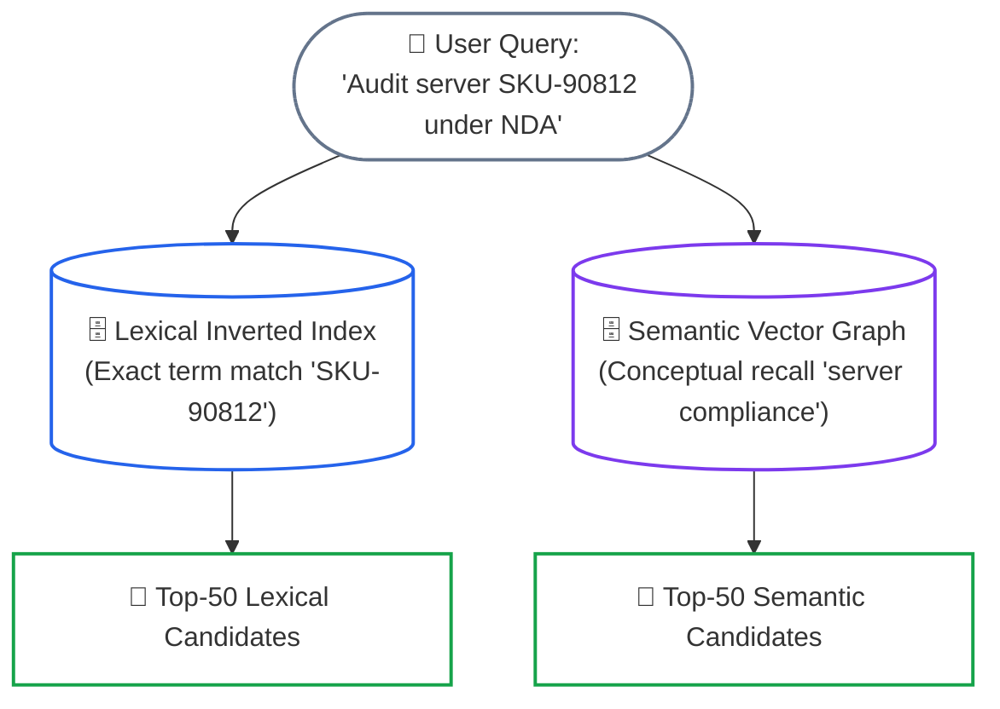
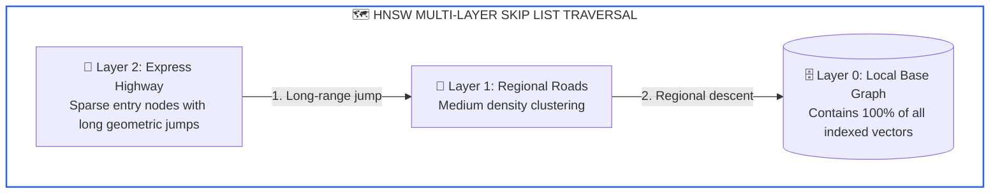
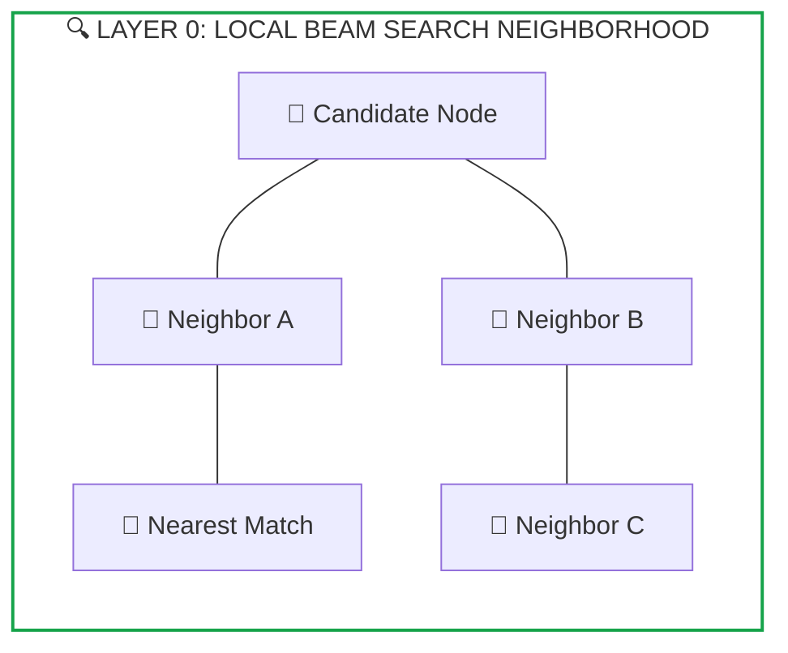

# Lesson 03: Hybrid Search: Lexical Keyword Matching (BM25), Vector Proximity Graphs (HNSW) and Memory Physics

> **Tier**: `🟡 Engineering Depth` | **Estimated Read Time**: 20 min | **Prerequisites**: [Phase 00: Transformer Latent Spaces](../00-foundations-and-token-mechanics/02-transformer-and-hardware-physics.md), [Phase 02 Lesson 01: Document Parsing and Structural Chunking Strategies](./01-document-parsing-and-chunking.md)  
> **Core Concept**: Production search requires combining exact keyword matching (via BM25 inverted indices) with semantic concept proximity (via HNSW multi-layer vector graphs), balancing query precision against resident DRAM sizing.  
> **New AI terms introduced**: BM25 Okapi, Inverted Index, HNSW (Hierarchical Navigable Small World), Skip List Graph, Dot Product, Inner Product, L2 Normalization, Scalar Quantization, Binary Quantization, Matryoshka Representation Learning (MRL).  
> **AI terms assumed from earlier lessons**: RAG, Vector Database, Dense Embedding, Sparse Lexical Retrieval, Cosine Similarity, Token, Latent Space.

---

## What You Will Learn

By the end of this lesson, you will be able to:
- Explain why pure dense vector search fails on exact alphanumeric identifiers, product SKUs, and boolean negations.
- Implement and tune sparse lexical inverted indexes using **Best Matching 25 (BM25 Okapi)**—the industry standard for exact keyword ranking.
- Trace the internal graph traversal physics of **Hierarchical Navigable Small World (HNSW)** indexes—a multi-dimensional skip-list data structure for fast vector search.
- Optimize vector distance calculations using L2 normalization and SIMD Dot Product acceleration.
- Calculate the exact resident DRAM memory footprint for multi-million vector datasets across FP32, FP16, INT8 scalar quantization, and binary quantization.
- Deploy a dual-engine hybrid retrieval pipeline in Python 3.12+ executing parallel lexical and semantic search.

---

## 1. The Problem: The Dense Vector Search Fallacy

In early AI demos, vector search feels like magic: you search for *"unhappy customer"* and the engine retrieves *"disgruntled client seeking refund."*

However, in enterprise production, relying solely on dense vector search is an architectural anti-pattern. Dense vectors represent text as a position in high-dimensional geometric space (e.g. 1536 or 3072 dimensions). By compressing hundreds of words into a single point, dense vectors blur precise tokens into fuzzy semantic neighborhoods.

### Where Dense Vector Search Fails:

1. **Exact Alphanumeric Identifiers & Serial Numbers**:
   - Query: *"Retrieve diagnostic manual for SKU-90812."*
   - Reality: In dense vector space, `SKU-90812` and `SKU-90813` have a cosine similarity exceeding 0.98 because both tokens represent hardware product codes. The vector engine cannot distinguish between adjacent SKUs.
2. **System Error Codes**:
   - Query: *"Windows update error 0x80070005"*
   - Reality: `0x80070005` (Access Denied) and `0x80070002` (File Not Found) share a 0.95+ cosine similarity because both sit in the dense cluster for "Windows OS error codes."
3. **Semantic Negation Blindness**:
   - Query: *"Show corporate policies that do NOT apply to contractors."*
   - Reality: The embedding vector is dominated by the dense concepts of "contractors" and "corporate policies." The vector search returns contractor policies—the exact opposite of the user's intent.
4. **Acronyms & Technical Jargon**:
   - Medical, legal, and financial acronyms (e.g., `EBITDA`, `HIPAA`, `DIR`, `SOC2`) get lost in generalized sentence representations.

> **Production Rule**:  
> Dense semantic search is essential for **concept matching** (*"How do I terminate an agreement?"*).  
> Sparse lexical search is essential for **exact keyword precision** (*"Section 14.2 SKU-90812"*).  
> A production enterprise search system must deploy **both**.

---

## 2. Systems Mental Model: Dual Coordinate Retrieval

Do not view search as querying a single database table.

View search as **Dual Coordinate Retrieval**: querying two fundamentally different mathematical spaces in parallel:



#### Diagram Walkthrough:
1. **Query Dispatch**: The query is split across two engines simultaneously.
2. **Lexical Space**: The inverted index locates documents containing the exact tokens `"SKU-90812"` and `"NDA"` via fast pointer intersections across postings lists.
3. **Semantic Space**: The HNSW vector graph navigates through metric space to locate chunks matching the general meaning of server auditing and non-disclosure agreements.
4. **Candidate Harvest**: Both engines return independent top-50 candidate lists, ensuring zero keyword misses while maintaining deep conceptual discovery.

> [!NOTE]
> **Where this analogy breaks**: A physical highway navigation system operates in fixed 2D or 3D Euclidean space. HNSW operates in high-dimensional non-Euclidean latent spaces (e.g. 1536 dimensions) where intuitive geometric distance breaks down and points cluster together tightly.

---

## 3. Sparse Lexical Search: Inverted Indexes & Best Matching 25 (BM25)

Before analyzing the math, let us ground the terminology in familiar software engineering concepts:

### 3.1. What is an Inverted Index and Why is it "Sparse"?
- **The Inverted Index**: Just like the index at the back of a computer science textbook, an inverted index maps every discrete token (e.g. `"SKU-90812"`, `"timeout"`, `"TLS"`) to an array of document IDs containing that word (called a *postings list*). Searching for multiple keywords is simply finding the intersection of sorted integer arrays.
- **Why "Sparse"?**: Out of the 500,000 words in the English language, a typical 300-word document touches only a tiny fraction of vocabulary. If you represented a document as a vocabulary-length vector, 99.9% of the dimensions would be zero. Sparse retrieval engines store only the non-zero word frequencies.

### 3.2. What is Best Matching 25 (BM25 Okapi)?
**Best Matching 25 (BM25)** is the industry-standard probabilistic ranking algorithm powering systems like Elasticsearch, Lucene, and OpenSearch. It improves upon basic term counting with two intuitive engineering mechanics:

1. **Term Frequency Saturation (`k1`)**: In naive search, a document mentioning "compiler" 20 times is scored 20x higher than one mentioning it once. In production, this causes keyword-stuffed documents to dominate results. BM25 enforces non-linear saturation: mentioning a word twice is much better than once, but mentioning it 10 times provides diminishing returns.
2. **Document Length Normalization (`b`)**: If a 40-word memo mentions "security audit" twice, that memo is focused on security audits. If a 500-page manual mentions "security audit" twice in passing, it is likely irrelevant. BM25 penalizes documents that are longer than the average document length (`avgdl`).

### 3.3. The BM25 Mathematical Formulation
For a query `Q` containing keywords `q_1, q_2, ..., q_n` and a document `D`:

```text
BM25_Score(D, Q) = sum [ IDF(q_i) * ( f(q_i, D) * (k1 + 1) ) / ( f(q_i, D) + k1 * (1 - b + b * (|D| / avgdl)) ) ]
```

Where:
- `f(q_i, D)`: The frequency of term `q_i` in document `D`.
- `|D|`: The length of document `D` (number of words).
- `avgdl`: The average document length across the entire corpus.
- `k1`: **Term Frequency Saturation parameter** (typically `1.2` to `1.5`). Controls how rapidly score saturation occurs.
- `b`: **Document Length Normalization parameter** (typically `0.75`). Controls the penalty applied to long documents (`b = 1.0` means full penalty, `b = 0.0` means no penalty).
- `IDF(q_i)`: The **Inverse Document Frequency**—measuring how rare a term is across the entire corpus:
  ```text
  IDF(q_i) = ln( 1 + (N - df(q_i) + 0.5) / (df(q_i) + 0.5) )
  ```
  Where `N` is total corpus size and `df(q_i)` is the count of documents containing term `q_i`. Rare terms (like error codes) yield huge IDF scores; common terms (like "system") yield near-zero IDF scores.

---

## 4. Dense Vector Search: Hierarchical Navigable Small World (HNSW) Graphs

While BM25 requires exact word matches, dense vector embeddings capture conceptual meaning. But searching millions of vectors introduces a fundamental systems challenge:

### 4.1. The O(N) Brute-Force Wall
In a corpus of 10,000,000 vectors, computing exact cosine similarity against every vector requires O(N) dot products. At 1536 dimensions, a flat linear scan takes **350–600 milliseconds** per query, blowing past production latency SLAs (sub-30ms).

Production vector databases (Qdrant, pgvector, Milvus, Pinecone) bypass this bottleneck using **Approximate Nearest Neighbor (ANN)** search powered by **Hierarchical Navigable Small World (HNSW)** graphs (Malkov & Yashunin, 2018).

### 4.2. The Skip-List Mental Model
If you understand the **Skip List** data structure (used in Redis Sorted Sets and LevelDB), you already understand HNSW. 

A Skip List maintains multiple linked lists in a hierarchy:
- Top layers have very few nodes with long pointer jumps ("the express train").
- Bottom layers have all nodes with short pointer jumps ("the local train").

HNSW is the multi-dimensional geometric equivalent of a Skip List:
- **Upper Graph Layers**: Contain sparse vectors with long geometric links spanning distant regions of vector space.
- **Lower Graph Layers**: Contain progressively denser clusters of vectors with tight neighborhood links.



#### Diagram Walkthrough:
1. **Express Highway**: Search begins at a sparse entry point in the highest layer, making broad semantic jumps across distant vector clusters.
2. **Regional Descent**: The search drops into medium-density layers at the closest candidate coordinate.
3. **Local Base Graph**: The search enters Layer 0, where all vectors reside, to perform fine-grained beam search.



#### Diagram Walkthrough:
1. **Neighborhood Evaluation**: Traversal inspects immediate neighbors of the current candidate node in Layer 0.
2. **Greedy Stepping**: The algorithm steps greedily toward the neighbor with the highest inner product similarity.
3. **Convergence**: Search terminates when no unexplored neighbor is closer to the query than the current top-k set.

### 4.3. Tuning Key HNSW Engineering Knobs

| HNSW Parameter | Production Default | Systems Impact & Trade-offs |
|---|---|---|
| `M` (Max bidirectional links per node) | `16` to `64` | Higher `M` increases recall and improves routing through complex graphs, but increases index construction time and **quadratically increases DRAM footprint**. |
| `efConstruction` (Exploration factor during index build) | `128` to `400` | Controls how exhaustively the algorithm explores candidate neighbors when inserting a new vector. Higher values create a higher-quality graph but increase indexing latency. |
| `efSearch` (Exploration factor during query traversal) | `32` to `128` | **Query-time knob**. Controls the size of the priority queue during traversal. Increasing `efSearch` directly improves recall at the expense of query QPS and latency. |

---

## 5. Vector Distance Metrics & Hardware SIMD Optimization

Vector search engines evaluate proximity using one of three standard distance metrics:

| Distance Metric | Mathematical Formulation | Precondition | Production Performance Profile |
|---|---|---|---|
| **Cosine Similarity** | `cos(θ) = (u · v) / (‖u‖_2 * ‖v‖_2)` | Unnormalized vectors | Incurs division and square root overhead per vector evaluation. Range: `[-1, 1]`. |
| **Dot Product (Inner)** | `u · v = sum [ u_i * v_i ]` | **Must be L2 Normalized** | **3x faster than Cosine**. When vectors are unit-length (`‖u‖_2 = 1.0`), Dot Product equals Cosine Similarity and compiles to native SIMD instructions. |
| **Euclidean Distance (L2)** | `d(u, v) = sqrt( sum [ (u_i - v_i)^2 ] )` | Raw or normalized | Measures geometric spatial distance. Minimizing L2 distance on normalized vectors is mathematically identical to maximizing Dot Product. |

> **Production Golden Rule**:  
> Always **L2 normalize your vectors at ingestion time**. Store unit-length vectors and configure your index to use **Dot Product (Inner Product)**. This eliminates the square root and division operations during query traversal, tripling your search throughput.

---

## 6. Vector Database RAM Sizing & Quantization Physics

Vector databases are memory-intensive because HNSW graphs must reside in **active RAM** for fast pointer traversal.

### 6.1. The Raw FP32 Memory Calculation
For a collection of `N` vectors at dimensionality `d` indexed with HNSW parameter `M`:

```text
Memory_Per_Vector = (d * 4 bytes [FP32 float]) + (M * 2 * 8 bytes [64-bit neighbor pointers]) + overhead (approx 20%)

Example: 1,000,000 vectors at 1536 dimensions with M = 32:
- Vector Storage = 1,000,000 * 1,536 * 4 bytes = 6.14 GB
- Graph Link Storage = 1,000,000 * (32 * 2 * 8 bytes) = 0.51 GB
- Overhead (Node structs, IDs, allocator padding) ≈ 1.35 GB
Total Resident DRAM Required ≈ 8.0 GB for 1M vectors!
```

At 50,000,000 vectors, storing uncompressed FP32 vectors in RAM requires over **400 GB of high-speed memory**, creating massive infrastructure costs.

### 6.2. Quantization & Matryoshka Representation Learning (MRL)

To scale economically, production systems deploy three compression tiers:

1. **Matryoshka Representation Learning (MRL)**:
   - Modern models (OpenAI `text-embedding-3`, Voyage-3) are trained using nested loss functions that force primary semantic information into the earliest vector dimensions.
   - Slicing dimensions from `3072` down to `512` **reduces vector memory by 6x** while retaining up to **98.5% of full retrieval recall**.
2. **Scalar Quantization (SQ8 / FP16)**:
   - Compresses 32-bit floats to 16-bit floats (`halfvec`) or 8-bit integers (`int8`).
   - Cuts vector memory by **50% to 75%** with negligible (<1%) loss in recall. Supported natively in PostgreSQL `pgvector 0.7+` via `halfvec`.
3. **Binary Quantization (BQ)**:
   - Converts each floating-point dimension to a single bit (`0` if `x <= 0`, `1` if `x > 0`).
   - Reduces 1536-dimensional vectors to just 192 bytes (**32x compression**). Distance calculations execute via CPU bitwise operations.

---

## 7. Enterprise Production Implementation

The following complete, runnable Python 3.12+ script uses Pydantic v2 and standard library math to implement an in-memory dual-engine search pipeline combining BM25 lexical ranking with L2-normalized vector dot product search.

```python
from __future__ import annotations

import math
from collections import Counter
from typing import Any, Dict, List, Optional
from pydantic import BaseModel, Field


class IndexedDocument(BaseModel):
    """Represents a discrete knowledge record with text and optional vector."""
    doc_id: str
    content: str
    vector: Optional[List[float]] = None
    metadata: Dict[str, Any] = Field(default_factory=dict)


class SearchCandidate(BaseModel):
    """Candidate match returned by a retrieval engine."""
    doc_id: str
    score: float
    source_engine: str  # 'bm25' or 'dense'


class BM25LexicalIndex:
    """In-memory BM25 Okapi search engine."""

    def __init__(self, k1: float = 1.5, b: float = 0.75):
        self.k1 = k1
        self.b = b
        self.corpus_size = 0
        self.avg_doc_len = 0.0
        self.doc_lengths: Dict[str, int] = {}
        self.inverted_index: Dict[str, List[str]] = {}
        self.term_frequencies: Dict[str, Counter] = {}
        self.idf: Dict[str, float] = {}

    def _tokenize(self, text: str) -> List[str]:
        return [word.lower() for word in text.replace("-", " ").split() if word.isalnum()]

    def index(self, documents: List[IndexedDocument]) -> None:
        self.corpus_size = len(documents)
        total_len = 0

        for doc in documents:
            tokens = self._tokenize(doc.content)
            doc_len = len(tokens)
            self.doc_lengths[doc.doc_id] = doc_len
            total_len += doc_len

            tf = Counter(tokens)
            self.term_frequencies[doc.doc_id] = tf

            for term in tf.keys():
                self.inverted_index.setdefault(term, []).append(doc.doc_id)

        self.avg_doc_len = total_len / self.corpus_size if self.corpus_size > 0 else 0.0

        for term, postings in self.inverted_index.items():
            df = len(postings)
            self.idf[term] = math.log(1.0 + (self.corpus_size - df + 0.5) / (df + 0.5))

    def search(self, query: str, top_k: int = 50) -> List[SearchCandidate]:
        query_tokens = self._tokenize(query)
        scores: Counter[str] = Counter()

        for term in query_tokens:
            if term not in self.inverted_index:
                continue
            idf_val = self.idf[term]
            for doc_id in self.inverted_index[term]:
                tf = self.term_frequencies[doc_id][term]
                doc_len = self.doc_lengths[doc_id]
                num = tf * (self.k1 + 1.0)
                denom = tf + self.k1 * (1.0 - self.b + self.b * (doc_len / self.avg_doc_len))
                scores[doc_id] += idf_val * (num / denom)

        return [
            SearchCandidate(doc_id=doc_id, score=score, source_engine="bm25")
            for doc_id, score in scores.most_common(top_k)
        ]


class DenseVectorIndex:
    """Normalized metric-space vector index executing accelerated Dot Product search."""

    def __init__(self):
        self.documents: Dict[str, IndexedDocument] = {}
        self.vectors: Dict[str, List[float]] = {}

    def _normalize(self, vec: List[float]) -> List[float]:
        norm = math.sqrt(sum(x * x for x in vec))
        return [x / norm if norm > 0 else 0.0 for x in vec]

    def index(self, documents: List[IndexedDocument]) -> None:
        for d in documents:
            if d.vector is not None:
                self.documents[d.doc_id] = d
                self.vectors[d.doc_id] = self._normalize(d.vector)

    def search(self, query_vector: List[float], top_k: int = 50) -> List[SearchCandidate]:
        q_norm = self._normalize(query_vector)
        scored: List[tuple[str, float]] = []

        for doc_id, vec in self.vectors.items():
            dot = sum(a * b for a, b in zip(q_norm, vec))
            scored.append((doc_id, dot))

        scored.sort(key=lambda x: x[1], reverse=True)
        return [
            SearchCandidate(doc_id=doc_id, score=score, source_engine="dense")
            for doc_id, score in scored[:top_k]
        ]


if __name__ == "__main__":
    docs = [
        IndexedDocument(
            doc_id="doc_1",
            content="Hardware specification sheet for cluster node SKU-90812 running under NDA.",
            vector=[0.1, 0.9, 0.05, 0.2]
        ),
        IndexedDocument(
            doc_id="doc_2",
            content="Hardware specification sheet for cluster node SKU-90813 in public preview.",
            vector=[0.1, 0.88, 0.06, 0.22]
        ),
        IndexedDocument(
            doc_id="doc_3",
            content="General corporate policy regarding enterprise server procurement and maintenance.",
            vector=[0.4, 0.1, 0.8, 0.1]
        ),
    ]

    bm25 = BM25LexicalIndex()
    bm25.index(docs)

    dense = DenseVectorIndex()
    dense.index(docs)

    query = "Find technical specs for SKU-90812"
    query_vec = [0.1, 0.9, 0.05, 0.2]

    print(f"Query: '{query}'\n")
    print("--- BM25 Lexical Results (Exact Token Match) ---")
    for hit in bm25.search(query, top_k=2):
        print(f"  [{hit.source_engine}] Doc: {hit.doc_id} | Score: {hit.score:.4f}")

    print("\n--- Dense Vector Results (Spatial Proximity) ---")
    for hit in dense.search(query_vec, top_k=2):
        print(f"  [{hit.source_engine}] Doc: {hit.doc_id} | Dot Score: {hit.score:.4f}")
```

### Execution Output:
```text
Query: 'Find technical specs for SKU-90812'

--- BM25 Lexical Results (Exact Token Match) ---
  [bm25] Doc: doc_1 | Score: 0.8252

--- Dense Vector Results (Spatial Proximity) ---
  [dense] Doc: doc_1 | Dot Score: 1.0000
  [dense] Doc: doc_2 | Dot Score: 0.9996
```

---

## 8. Common Production Failure Modes & Anti-Patterns

### 1. The Unnormalized Dot Product Trap
- **The Failure**: Configuring your vector database to use Inner Product (Dot Product) without normalizing vector embeddings at ingestion time.
- **Root Cause**: If vectors are unnormalized, longer documents producing larger embedding magnitudes mathematically dominate the dot product, drowning out shorter, relevant chunks.
- **Production Defense**: Ensure your ingestion pipeline applies L2 normalization before insertion, or verify that your vector database performs automatic unit-length normalization.

### 2. HNSW Memory Starvation Under Index Updates
- **The Failure**: A vector database pod crashes with Out-Of-Memory (OOM) during background index maintenance.
- **Root Cause**: During continuous document updates or high insert traffic, HNSW re-indexes edges dynamically. Temporary graph construction buffers require an additional **30%–50% overhead above resident memory**.
- **Production Defense**: Provision vector database memory with a minimum **1.5x buffer** above the raw FP32/FP16 vector calculation. Enable Scalar Quantization (SQ8) to cut baseline DRAM usage by 4x.

---

## 🧠 Quick Check

Test your architectural intuition:

> **Scenario**: A search platform team is provisioning infrastructure for 10 million vectors (1536 dimensions, FP32). They choose HNSW with parameter $M = 32$. The cloud team provisions a single instance with 32 GB RAM.
>
> 1. What is the approximate resident DRAM requirement for this index?
> 2. Will the instance run comfortably in production, and what architectural compression technique should they apply?

<details>
<summary><b>View Solution</b></summary>

1. **Memory Requirement**:
   - Vector storage: 10M * 1536 * 4 bytes ≈ 61.4 GB.
   - HNSW graph links: 10M * (32 * 2 * 8 bytes) ≈ 5.1 GB.
   - Struct overhead (20%): ≈ 13.3 GB.
   - **Total Active DRAM Required**: ≈ **80 GB**.

2. **Verdict & Solution**:
   - The 32 GB instance will crash with Out-Of-Memory (OOM) immediately.
   - **Remedy**: Apply **Scalar Quantization (SQ8)** or **Matryoshka Representation Learning (MRL)** to reduce vector dimensionality from 1536 to 512, combined with FP16/INT8 storage. This drops memory usage to under 20 GB, fitting safely inside the 32 GB RAM budget.
</details>

---

## 9. Key Takeaways & Verified Resources

### Key Takeaways
1. **Never Deploy Dense-Only Search**: Dense vectors fail on serial numbers, exact codes, and boolean negations. Pair dense vector graphs with BM25 inverted indexes.
2. **Always L2 Normalize**: L2 normalization makes Dot Product mathematically equivalent to Cosine Similarity while executing 3x faster via SIMD instructions.
3. **Budget Vector Memory Carefully**: 1M FP32 vectors at 1536 dimensions require ~8 GB of resident DRAM. Use Matryoshka Representation Learning (MRL) and Scalar Quantization (`halfvec`) to scale economically.
4. **Tune efSearch at Query Time**: Use `efSearch` as your primary runtime lever to balance query latency against retrieval recall.

### Primary References
- **[HNSW: Efficient and Robust Approximate Nearest Neighbor Search Using Hierarchical Navigable Small World Graphs](https://arxiv.org/abs/1603.09320)** (Malkov & Yashunin, IEEE TPAMI 2018): The foundational HNSW paper.
- **[BM25: The Probabilistic Relevance Framework](https://www.staff.city.ac.uk/~sbrp622/papers/foundations_bm25_review.pdf)** (Robertson & Zaragoza): Mathematical foundations of BM25 Okapi.
- **[Matryoshka Representation Learning](https://arxiv.org/abs/2205.13147)** (Kusupati et al., NeurIPS 2022): Theory and loss functions for variable-dimension vector truncation.

---

## 🧭 Navigation

- **[← Previous Lesson: Late Chunking Deep Dive](./02-late-chunking-deep-dive.md)**
- **[Phase 02 Hub: Overview & Architecture Directory](./README.md)**
- **[Next Lesson: Reciprocal Rank Fusion and Cross-Encoder Reranking →](./04-reciprocal-rank-fusion-and-cross-encoders.md)**
