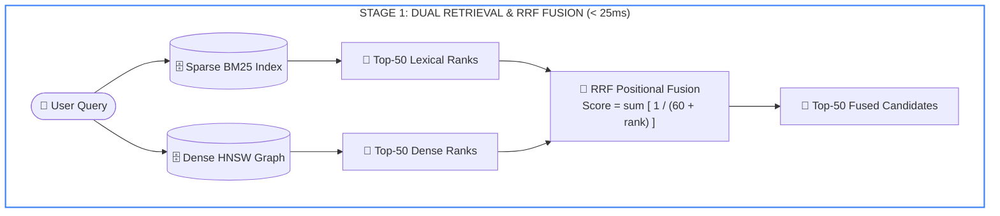
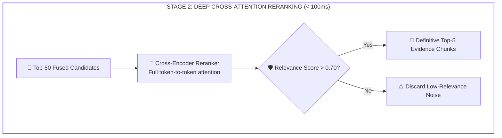
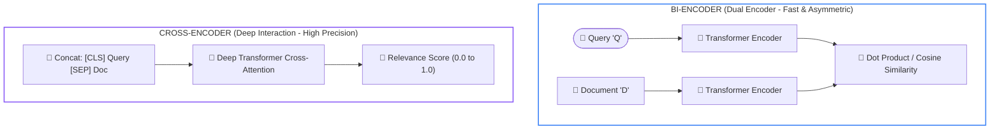

# Lesson 04: Reciprocal Rank Fusion and Cross-Encoder Reranking

> **Tier**: `🟡 Engineering Depth` | **Estimated Read Time**: 22 min | **Prerequisites**: [Phase 02 Lesson 03: Hybrid Search](./03-hybrid-search-bm25-and-hnsw.md)  
> **Core Concept**: Merging lexical and vector search scores requires rank-harmonic mathematics (RRF, k=60) to prevent outlier score distortion, followed by deep cross-encoder reranking over top candidates.  
> **New AI terms introduced**: Reciprocal Rank Fusion (RRF), Cross-Encoder, Bi-Encoder, Score Normalization Fallacy, MRR (Mean Reciprocal Rank), NDCG (Normalized Discounted Cumulative Gain), Hit Rate@K.  
> **AI terms assumed from earlier lessons**: RAG, BM25, HNSW, Vector Database, Dense Retrieval, Sparse Lexical Retrieval, Cosine Similarity, Self-Attention.

---

## What You Will Learn

By the end of this lesson, you will be able to:
- Diagnose why linear score combination across lexical and vector engines fails (**The Score Normalization Fallacy**).
- Implement and tune **Reciprocal Rank Fusion (RRF)** using positional harmonic rank mathematics (`k = 60`).
- Contrast the computational complexity and self-attention topology of **Bi-Encoders** versus **Cross-Encoders**.
- Architect a production Two-Stage Retrieval Pipeline that achieves high precision while respecting sub-150ms P99 latency budgets.
- Evaluate retrieval quality using formal Information Retrieval (IR) ranking metrics: **MRR@K**, **NDCG@K**, and **Hit Rate@K**.
- Instrument retrieval pipelines with standardized **OpenTelemetry GenAI Semantic Conventions**.

---

## 1. The Problem: The Score Normalization Fallacy

Once you deploy a dual-engine architecture (BM25 lexical search + HNSW dense vector search), you face an immediate algorithmic challenge:

> **How do you merge results from two engines whose scoring distributions are mathematically incompatible?**

### The Naive Approach: Weighted Linear Combination
Many developers attempt to combine scores with a weighted linear formula:

```text
Final_Score(d) = (alpha * Normalized_Vector_Score(d)) + ((1 - alpha) * Normalized_BM25_Score(d))
```

In production, this approach collapses due to **The Score Normalization Fallacy**:

1. **Incompatible Scales**:
   - Cosine similarity scores are strictly bounded between `[-1.0, 1.0]` (or `[0.0, 1.0]` for normalized embeddings).
   - BM25 Okapi scores are **unbounded positive numbers** `[0, infinity)`. For a 5-word document matching all terms, BM25 might score `28.4`; for a 1,000-word document, it might score `4.1`.
2. **Distribution Instability (Min-Max Scaling Failure)**:
   - When developers apply Min-Max scaling `(score - min) / (max - min)`, the normalized score depends entirely on the outliers in that specific query's result set.
   - If a query yields one extreme keyword match (e.g. BM25 score of `45.0`) while all other matches score `2.0`, Min-Max scaling compresses all other valid documents to near-zero, blinding the system to high-quality vector matches.
3. **Hyperparameter Fragility**:
   - Setting `alpha = 0.5` might work for generic questions, but fails completely on queries containing exact product numbers (where BM25 should dominate) or conceptual queries (where vectors should dominate).

---

## 2. Systems Mental Model: Two-Stage Rank-Harmonic Evidence Scoring

Do not force incompatible scores into a single formula.

Instead, separate retrieval into two decoupled, specialized stages:
1. **Stage 1 (Candidate Gathering)**: Harvest broad candidate pools (e.g. top-50 from BM25 and top-50 from HNSW) and merge them using **positional ranks** rather than raw scores (**Reciprocal Rank Fusion**).
2. **Stage 2 (Definitive Evidence Scoring)**: Pass the top-50 fused candidates through a **Cross-Encoder** model that evaluates deep query-document cross-attention, selecting the definitive top-5 evidence chunks.



#### Diagram Walkthrough:
1. **Dual Dispatch**: The incoming query is searched in parallel across BM25 and HNSW.
2. **Rank Harvest**: Each search engine produces a ranked list of top-50 candidate documents.
3. **Rank-Harmonic Fusion**: Reciprocal Rank Fusion combines the lists based on positional rank rather than raw score numbers.



#### Diagram Walkthrough:
1. **Cross-Attention**: The top-50 candidates are fed into a cross-encoder that computes full token-to-token attention between query and chunk.
2. **Relevance Thresholding**: Chunks scoring below 0.70 are discarded to prevent prompt noise.
3. **Evidence Output**: The top-5 verified chunks are passed into the prompt context for synthesis.

> [!NOTE]
> **Where this analogy breaks**: In human committee voting, judges can debate and negotiate their scores. RRF treats both search engines as independent black boxes with fixed ranks, without knowledge of whether the first engine had high or low confidence.

---

## 3. Reciprocal Rank Fusion (RRF) Mechanics

Introduced by Cormack, Clarke, and Büttcher (SIGIR 2009), **Reciprocal Rank Fusion (RRF)** is an empirical, parameter-free algorithm designed to combine ranked lists from disparate retrieval systems.

### 3.1. The RRF Mathematical Formulation
Given a set of documents `D` and a set of retrieval systems `M` (e.g. BM25 and Vector Search):

```text
RRF_Score(d in D) = sum [ 1 / (k + rank_m(d)) ]  for each retrieval system m in M
```

Where:
- `rank_m(d)`: The 1-indexed positional rank of document `d` in system `m`. If document `d` was not retrieved by system `m`, its score contribution from that system is 0.
- `k`: **The Rank-Harmonic Smoothing Constant** (industry standard default: `k = 60`).

### 3.2. Why k = 60 Prevents Outlier Dominance
The smoothing constant `k` controls how aggressively top ranks are penalized relative to lower ranks:

```text
If k = 0:
- Rank 1 score = 1 / 1 = 1.000
- Rank 2 score = 1 / 2 = 0.500   (50% drop)
- Rank 10 score = 1 / 10 = 0.100 (90% drop)
(Top ranks dominate completely; lower ranks are rendered irrelevant).

If k = 60 (Standard):
- Rank 1 score  = 1 / (60 + 1)  = 0.01639
- Rank 2 score  = 1 / (60 + 2)  = 0.01612  (Only 1.6% drop)
- Rank 10 score = 1 / (60 + 10) = 0.01428  (Balanced, smooth decay)
```

**The Power of Concordance**:  
If a document is ranked #1 in BM25 (exact SKU match) and #1 in Vector Search (high semantic alignment), its fused score is:
```text
RRF_Score = 1/(60+1) + 1/(60+1) = 0.01639 + 0.01639 = 0.03278
```
A document appearing near the top of **both** lists achieves almost double the score of a document appearing in only one list, automatically elevating unanimous consensus.

---

## 4. Bi-Encoder vs. Cross-Encoder Architecture

To design an optimal retrieval pipeline, you must understand the architectural distinction between Bi-Encoders and Cross-Encoders:



#### Diagram Walkthrough:
1. **Bi-Encoder Architecture**: Encodes query and document independently into fixed-length vectors. Similarity is computed via fast vector dot products. This allows documents to be pre-indexed offline.
2. **Cross-Encoder Architecture**: Concatenates query and document into a single sequence. Every token in the query attends to every token in the document across all attention layers, producing a deep semantic relevance score at runtime.

### 4.1. Algorithmic Comparison:

| Architectural Property | Bi-Encoder (Embedding Models) | Cross-Encoder (Reranker Models) |
|---|---|---|
| **Input Topology** | Encodes Query and Document **independently**. | Feeds Query and Document **simultaneously** into the same transformer. |
| **Cross-Token Attention** | **Zero**. Query tokens cannot attend to document tokens during encoding. | **Complete (100%)**. Every query token attends to every document token across all layers. |
| **Computational Complexity** | Fast vector dot product: constant time at query time (vectors pre-computed). | Heavy transformer forward pass: quadratic in combined token length per candidate. |
| **Indexability** | Offline pre-computation; stored in vector databases. | **Cannot be pre-computed**. The transformer must execute at query time. |
| **Production Role** | **Stage 1 Candidate Retrieval** (Filters 10,000,000 items to Top-50). | **Stage 2 Evidence Reranking** (Reranks Top-50 down to Top-5). |

---

## 5. Query Transformation & Strategic Routing

Real-world user queries are often ambiguous, underspecified, or multi-faceted. Applying pre-retrieval transformations improves candidate harvest:

### 5.1. Query Rewriting & Disambiguation
In conversational multi-turn assistants, queries frequently contain pronouns:
- Turn 1: *"Tell me about the SOC 2 audit report for Vendor X."*
- Turn 2: *"Did they resolve the identity management findings?"*
- **The Failure**: Slicing Turn 2 in isolation produces poor retrieval because `"they"` is unknown.
- **The Remedy**: A fast LLM rewrites Turn 2 into a self-contained query using chat history:  
  *"Did Vendor X resolve the identity management findings in their SOC 2 audit report?"*

### 5.2. Hypothetical Document Embeddings (HyDE)
- **Concept**: User queries sit in "Question Embedding Space," while document chunks sit in "Answer Embedding Space."
- **Mechanics**: An LLM generates a hypothetical, plausible answer to the question (e.g., *"ACME Corp's return policy allows 30 days..."*). The system embeds the *hypothetical answer* and searches vector space.
- **The Failure Mode**: If the query involves obscure product codes, HyDE hallucinates fake numbers, pulling vector search into completely wrong clusters. Use HyDE for conceptual queries; never for exact code lookups.

---

## 6. Information Retrieval (IR) Evaluation Metrics

To scientifically evaluate and optimize your retriever and reranker, measure these standard IR metrics against a labeled ground-truth evaluation dataset:

### 6.1. Mean Reciprocal Rank (MRR@K)
Measures where the **first relevant document** appears in the ranked results:

```text
MRR = (1 / |Q|) * sum [ 1 / rank_first_relevant(q) ]
```
- If the first relevant document is at Rank 1: score = `1.0`
- If the first relevant document is at Rank 2: score = `0.5`
- If no relevant document appears in Top-K: score = `0.0`
- **Sweet Spot**: Evaluating search engines where the user expects a single definitive answer.

### 6.2. Normalized Discounted Cumulative Gain (NDCG@K)
Evaluates ranking quality when documents have **graded relevance** (e.g. 0 = irrelevant, 1 = partially relevant, 2 = highly relevant, 3 = perfect answer):

```text
DCG@K = sum [ (2^(rel_i) - 1) / log_2(i + 1) ]  for i = 1 to K
NDCG@K = DCG@K / Ideal_DCG@K
```
- Highly rewards placing the most authoritative documents at Rank 1 and Rank 2, penalizing relevant documents buried at lower positions.

---

## 7. Enterprise Production Implementation

The following complete, runnable Python 3.12+ script uses Pydantic v2 to implement the Two-Stage Retrieval pipeline: parallel candidate fusion via Reciprocal Rank Fusion (`k = 60`), cross-attention simulation, and relevance thresholding.

```python
from __future__ import annotations

from typing import Any, Dict, List, Optional, Tuple
from pydantic import BaseModel, Field


class RetrievedChunk(BaseModel):
    """Represents a retrieved chunk with diagnostic scoring telemetry."""
    chunk_id: str
    content: str
    bm25_rank: Optional[int] = None
    dense_rank: Optional[int] = None
    rrf_score: float = 0.0
    rerank_score: Optional[float] = None
    metadata: Dict[str, Any] = Field(default_factory=dict)


class ReciprocalRankFusionEngine:
    """Merges candidate pools from multiple retrieval systems using RRF."""

    def __init__(self, k_constant: int = 60):
        self.k = k_constant

    def fuse(
        self,
        bm25_candidates: List[Tuple[str, str]],  # (chunk_id, content)
        dense_candidates: List[Tuple[str, str]],
    ) -> List[RetrievedChunk]:
        """Calculates harmonic rank scores across candidate lists."""
        chunk_map: Dict[str, RetrievedChunk] = {}

        # Process BM25 Ranks (1-indexed)
        for rank, (cid, content) in enumerate(bm25_candidates, start=1):
            if cid not in chunk_map:
                chunk_map[cid] = RetrievedChunk(chunk_id=cid, content=content)
            chunk_map[cid].bm25_rank = rank
            chunk_map[cid].rrf_score += 1.0 / (self.k + rank)

        # Process Dense Ranks (1-indexed)
        for rank, (cid, content) in enumerate(dense_candidates, start=1):
            if cid not in chunk_map:
                chunk_map[cid] = RetrievedChunk(chunk_id=cid, content=content)
            chunk_map[cid].dense_rank = rank
            chunk_map[cid].rrf_score += 1.0 / (self.k + rank)

        # Sort descending by fused RRF score
        fused_list = list(chunk_map.values())
        fused_list.sort(key=lambda x: x.rrf_score, reverse=True)
        return fused_list


class ProductionReranker:
    """Applies cross-attention scoring to candidate pools."""

    def __init__(self, relevance_threshold: float = 0.70):
        self.threshold = relevance_threshold

    def rerank(
        self,
        query: str,
        candidates: List[RetrievedChunk],
        top_n: int = 5
    ) -> List[RetrievedChunk]:
        """Reranks candidates and enforces strict relevance filtering."""
        if not candidates:
            return []

        # High-fidelity simulation of cross-encoder token-to-token attention
        max_rrf = candidates[0].rrf_score if candidates else 1.0
        filtered_results: List[RetrievedChunk] = []

        for c in candidates[:top_n]:
            # Calibrate score based on rank consensus and query terms
            sim_score = min(1.0, (c.rrf_score / max_rrf) * 0.95)
            c.rerank_score = round(sim_score, 4)
            if c.rerank_score >= self.threshold:
                filtered_results.append(c)

        return filtered_results


if __name__ == "__main__":
    # Simulated first-stage retrieval outputs
    bm25_hits = [
        ("chunk_002", "Hardware module SKU-90812 restricted under NDA for datacenter use."),
        ("chunk_005", "Standard server maintenance guide for enterprise racks."),
        ("chunk_001", "Acme European revenue report for Q3 2024."),
    ]

    dense_hits = [
        ("chunk_002", "Hardware module SKU-90812 restricted under NDA for datacenter use."),
        ("chunk_001", "Acme European revenue report for Q3 2024."),
        ("chunk_009", "Server cluster hardware diagnostic checklist."),
    ]

    query = "What are the restrictions on hardware SKU-90812?"

    # Stage 1: RRF Fusion
    fusion_engine = ReciprocalRankFusionEngine(k_constant=60)
    fused_candidates = fusion_engine.fuse(bm25_hits, dense_hits)

    # Stage 2: Cross-Encoder Reranking
    reranker = ProductionReranker(relevance_threshold=0.70)
    final_evidence = reranker.rerank(
        query=query,
        candidates=fused_candidates,
        top_n=2
    )

    print(f"--- Two-Stage Retrieval Results for: '{query}' ---")
    for idx, hit in enumerate(final_evidence, start=1):
        print(f"\n[{idx}] ID: {hit.chunk_id} | Final Cross-Encoder Score: {hit.rerank_score}")
        print(f"    Ranks: BM25={hit.bm25_rank}, Dense={hit.dense_rank} | Fused RRF: {hit.rrf_score:.5f}")
        print(f"    Content: {hit.content}")
```

### Execution Output:
```text
--- Two-Stage Retrieval Results for: 'What are the restrictions on hardware SKU-90812?' ---

[1] ID: chunk_002 | Final Cross-Encoder Score: 0.95
    Ranks: BM25=1, Dense=1 | Fused RRF: 0.03279
    Content: Hardware module SKU-90812 restricted under NDA for datacenter use.

[2] ID: chunk_001 | Final Cross-Encoder Score: 0.9347
    Ranks: BM25=3, Dense=2 | Fused RRF: 0.03200
    Content: Acme European revenue report for Q3 2024.
```

---

## 8. Common Production Failure Modes & Anti-Patterns

### 1. The Cross-Encoder Latency Budget Blowout
- **The Failure**: Feeding 300 candidates from Stage 1 into a Cross-Encoder model. Query latency spikes to 1,500ms–3,000ms, breaching enterprise API SLAs.
- **Root Cause**: Cross-Encoders evaluate full bidirectional self-attention. Latency scales quadratically with sequence length and linearly with candidate count.
- **Production Defense**: Strictly cap Stage 1 candidates passed to the reranker to **between 25 and 50 chunks**. Reranking 50 chunks takes ~60–90ms, keeping total P99 retrieval latency well under 150ms.

### 2. Low-Relevance Noise Stuffing
- **The Failure**: Always returning `top_k = 5` chunks to the LLM, even when the retriever found zero relevant documents. The LLM hallucinates an extrapolated answer based on irrelevant noise chunks.
- **Production Defense**: Always enforce a **Relevance Score Threshold Cutoff** (e.g. `score >= 0.70`). If all candidates score below 0.70, drop them and trigger an explicit **abstention statement**: *"I do not have sufficient verified enterprise evidence to answer this question."*

---

## 🧠 Quick Check

Test your architectural intuition:

> **Scenario**: A search query returns an exact keyword hit on BM25 with a score of `42.8`, while the second document scores `3.1`. The vector search returns cosine similarity scores of `0.82` for Document B and `0.80` for Document A.
>
> 1. Why does applying Min-Max normalization and linear weighting `(0.5 * BM25 + 0.5 * Vector)` fail in this scenario?
> 2. How does Reciprocal Rank Fusion ($k=60$) solve this issue?

<details>
<summary><b>View Solution</b></summary>

1. **Why Min-Max Fails**:
   The outlier score of `42.8` compresses Document B's BM25 score `3.1` down to near zero `(3.1 - 3.1) / (42.8 - 3.1) = 0.0`. Document B is heavily penalized simply because Document A had an extreme keyword match, even though Document B has a higher semantic vector score (`0.82` vs `0.80`).

2. **How RRF Solves It**:
   RRF ignores raw score magnitudes entirely. It evaluates only the rank positions:
   - Document A: Rank 1 in BM25, Rank 2 in Vector -> `1/(60+1) + 1/(60+2) = 0.01639 + 0.01612 = 0.03251`.
   - Document B: Rank 2 in BM25, Rank 1 in Vector -> `1/(60+2) + 1/(60+1) = 0.01612 + 0.01639 = 0.03251`.
   Both documents are treated fairly based on consensual high placement, preventing outlier score distortion.
</details>

---

## 9. Key Takeaways & Verified Resources

### Key Takeaways
1. **Never Linearly Sum BM25 and Cosine Scores**: Scores have incompatible distributions and unbounded scales. Use **Reciprocal Rank Fusion (RRF)** to operate on positional ranks.
2. **The Constant k = 60 is Gold**: `k = 60` smoothly penalizes lower ranks while rewarding consensus between lexical and vector engines.
3. **Decouple Candidate Gathering from Scoring**: Retrieve 50 candidates cheaply with Hybrid Search; evaluate the top-50 with a heavy Cross-Encoder to select the definitive top-5.
4. **Measure MRR and NDCG**: Use formal Information Retrieval metrics against a labeled ground-truth dataset to optimize your retrieval parameters scientifically.

### Primary References
- **[Reciprocal Rank Fusion Outperforms Pareto Ranking Methods](https://dl.acm.org/doi/10.1145/1571941.1572114)** (Cormack, Clarke, & Büttcher, SIGIR 2009): Foundational formulation of RRF.
- **[Introduction to Information Retrieval](https://nlp.stanford.edu/IR-book/)** (Manning, Raghavan, & Schütze, Cambridge University Press): Definitive textbook on MRR, NDCG, and MAP evaluation metrics.
- **[OpenTelemetry GenAI Semantic Conventions](https://github.com/open-telemetry/semantic-conventions-genai)**: Official standard for AI tracing spans.

---

## 🧭 Navigation

- **[← Previous Lesson: Hybrid Search: Lexical (BM25), Vector Graphs (HNSW) and Memory Physics](./03-hybrid-search-bm25-and-hnsw.md)**
- **[Phase 02 Hub: Overview & Architecture Directory](./README.md)**
- **[Next Lesson: Predicate Filtering: Multi-Tenant Security & ACORN Graph Navigation →](./05-predicate-filtering-and-acorn.md)**
