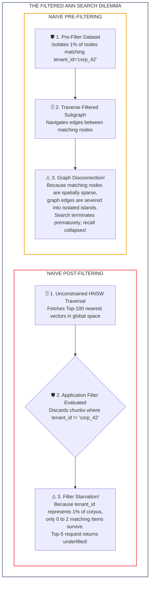
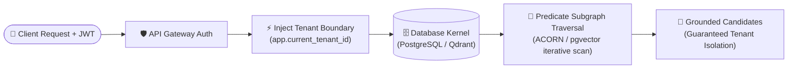
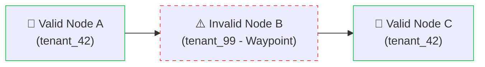
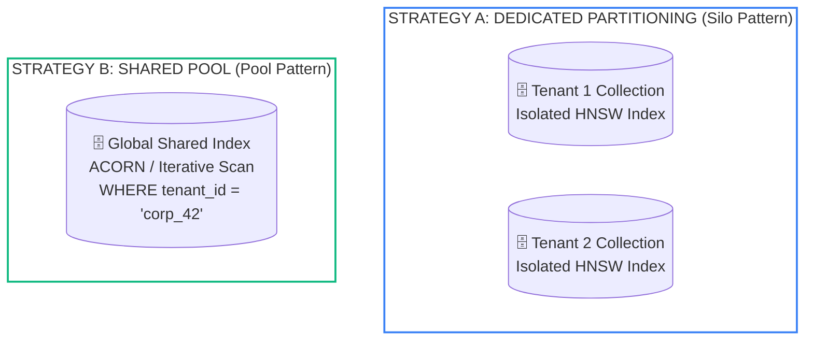

# Lesson 05: Predicate Filtering: Multi-Tenant Security and Augmented Connectivity Over Random Neighbors (ACORN) Graph Navigation

> **Tier**: `🔵 Advanced` | **Estimated Read Time**: 20 min | **Prerequisites**: [Phase 02 Lesson 03: Hybrid Search](./03-hybrid-search-bm25-and-hnsw.md), [Phase 02 Lesson 04: Reciprocal Rank Fusion and Cross-Encoder Reranking](./04-reciprocal-rank-fusion-and-cross-encoders.md)  
> **Core Concept**: Enforcing enterprise multi-tenant security predicates on vector indexes without suffering filter starvation or graph disconnection, using ACORN 2-hop graph exploration and PostgreSQL pgvector 0.8.0+ iterative scans and Row Level Security (RLS).  
> **New AI terms introduced**: Predicate Filtering, Filter Starvation, Graph Disconnection, ACORN (Augmented Connectivity Over Random Neighbors), 2-Hop Neighborhood Exploration, Iterative Scan, Row Level Security (RLS), Multi-Tenant Isolation.  
> **AI terms assumed from earlier lessons**: HNSW, Vector Database, Dense Retrieval, Dot Product, L2 Normalization, Cosine Similarity, Embedding.

---

## What You Will Learn

By the end of this lesson, you will be able to:
- Enforce strict enterprise multi-tenant isolation and Role-Based Access Control (RBAC) inside vector search engines.
- Diagnose and eliminate **Filter Starvation** (caused by naive post-filtering) and **Graph Disconnection** (caused by naive pre-filtering).
- Master the **ACORN (Augmented Connectivity Over Random Neighbors)** paradigm (Kraft et al., SIGMOD 2024), discovering how 2-hop neighborhood exploration preserves graph navigability under selective metadata filters.
- Configure production PostgreSQL with `pgvector 0.8.0+` using native **Row Level Security (RLS)**, `halfvec` (FP16), and **HNSW Iterative Scans** (`hnsw.iterative_scan = relaxed_order`).
- Architect a multi-tenant vector partitioning strategy balancing dedicated tenant collections against shared indexes with metadata predicates.

---

## 1. The Problem: The Filtered Vector Search Dilemma

In enterprise software engineering, an unfiltered search query almost never occurs. Real-world enterprise queries are bound to tenant IDs, user permissions, and compliance boundaries:

```sql
SELECT chunk_id, content 
FROM document_chunks 
WHERE tenant_id = 'corp_42' 
  AND department IN ('legal', 'finance') 
  AND access_clearance >= 3
ORDER BY embedding <=> query_embedding 
LIMIT 5;
```

When engineers integrate vector search with structured predicates, naive implementations encounter **The Filtered ANN Dilemma**:



#### Diagram Walkthrough:
1. **The Post-Filtering Trap**: Unconstrained HNSW traverses the global dataset and returns the 100 vectors closest to the query. Application code then applies the filter `tenant_id = 'corp_42'`. If Tenant 42 owns 1% of the database, on average only 1 matching document is returned. The model is starved of context (**Filter Starvation**).
2. **The Pre-Filtering Trap**: The engine isolates only the nodes matching the predicate *before* traversal. Because valid nodes are sparse across high-dimensional space, the bidirectional edges between them do not exist in the original HNSW index. The graph fractures into disconnected components. Traversal terminates prematurely after 2 hops, causing retrieval recall to collapse (**Graph Disconnection**).

---

## 2. Systems Mental Model: The Cryptographic Tenant Perimeter

In enterprise AI infrastructure, security cannot be implemented as a post-generation check. If an untrusted document chunk is passed to the LLM, the model can leak proprietary trade secrets, executive salaries, or competitor data through indirect prompt injection or context leakage.

Security must be enforced as a **Cryptographic Tenant Perimeter** inside the query execution plan of the retrieval storage engine itself:



#### Diagram Walkthrough:
1. **Authenticated Client Request**: User requests arrive at the gateway with verified enterprise identity tokens.
2. **Tenant Parameter Injection**: The gateway injects the caller's tenant identifier into the database session context.
3. **Database Kernel Enforcement**: Storage engines evaluate security predicates directly in the query plan.
4. **Predicate Traversal**: Subgraph routing algorithms navigate around non-matching nodes.
5. **Zero-Leakage Candidates**: Returned chunks strictly conform to the tenant boundary before reaching application code.

> [!NOTE]
> **Where this analogy breaks**: A physical security perimeter completely bars unauthorized visitors from entering the premises. In graph traversal algorithms like ACORN, the search algorithm is allowed to hop *through* non-matching nodes as navigational waypoints, but the data inside those waypoints is never read, copied, or returned to the caller.

---

## 3. The ACORN Paradigm: Solving Predicate-Filtered HNSW

Presented at SIGMOD 2024 by Kraft et al. (arXiv:2403.04871), **ACORN** (Augmented Connectivity Over Random Neighbors) resolves the Filtered ANN Dilemma by guaranteeing graph connectivity during traversal regardless of predicate selectivity.

### 3.1. ACORN-1: Query-Time 2-Hop Neighborhood Exploration
Instead of modifying the index or severing edges, ACORN-1 changes the traversal rule at query time:

- Standard HNSW only evaluates the immediate 1-hop neighbors of the current node. If an immediate neighbor violates the filter predicate, standard pre-filtering drops it and halts.
- **ACORN-1 Mechanics**: When traversal encounters a node `u` that violates the predicate, it does not stop. It evaluates the **neighbors of node `u` (the 2-hop neighborhood)**.
- Node `u` acts as an **unfiltered navigational waypoint**. The traversal travels *through* `u` to reach valid nodes on the other side of the graph, preserving topological navigability across the entire metric space without modifying the underlying index structure.



#### Diagram Walkthrough:
1. **Start at Valid Node**: Traversal begins at a verified node belonging to `tenant_42`.
2. **Hop Through Waypoint**: Node B violates the predicate (`tenant_99`), so its text content is hidden, but its outgoing links remain navigable.
3. **Reach Target Node**: The traversal steps across Node B to reach Node C, preserving graph continuity across tenant clusters.

### 3.2. ACORN-gamma: Index-Time Graph Densification
In environments requiring ultra-high query QPS, **ACORN-gamma** densifies the graph at construction time:
- During index build, each node maintains up to `gamma * M` edges (where `gamma >= 1`, typically `gamma = 2` to `4`).
- When adding edges, the algorithm prioritizes connecting nodes that share common metadata predicates.
- This guarantees that the subgraph induced by any common enterprise predicate remains topologically connected with high degree, delivering sub-linear query latencies with near-perfect recall.

---

## 4. Production Relational Enforcement: PostgreSQL `pgvector 0.8.0+`

For enterprises deploying RAG on PostgreSQL, `pgvector 0.8.0+` introduced native capabilities that implement predicate-aware traversal and cryptographic tenant isolation:

### 4.1. Row Level Security (RLS) Cryptographic Isolation
PostgreSQL Row Level Security ensures that even if an application engineer forgets to include `WHERE tenant_id = ...` in their SQL query, the database engine automatically restricts all disk reads and index scans to the authenticated tenant:

```sql
-- Step 1: Enable Row Level Security on the chunks table
ALTER TABLE document_chunks ENABLE ROW LEVEL SECURITY;

-- Step 2: Create strict isolation policy bound to transaction session variable
CREATE POLICY tenant_isolation_policy ON document_chunks
    FOR ALL
    USING (tenant_id = NULLIF(current_setting('app.current_tenant_id', true), '')::uuid);
```

### 4.2. HNSW Iterative Scans: Eliminating Filter Starvation
Prior to `pgvector 0.8.0`, applying a `WHERE` filter on an HNSW query used naive post-filtering. If the filter was selective, the query returned fewer rows than requested.

`pgvector 0.8.0+` introduced **HNSW Iterative Scanning**:

```sql
-- Enable iterative scanning for filtered HNSW queries (pgvector 0.8.0+)
SET hnsw.iterative_scan = relaxed_order;

-- Set upper bound on candidate exploration to prevent runaway query latency
SET hnsw.max_scan_tuples = 20000;
```

**How Iterative Scanning Works**:
When a query executes `ORDER BY embedding <=> query_vector LIMIT 5` with a selective `WHERE` clause, `pgvector 0.8.0+` does not stop at the first batch. It continues scanning deeper into the HNSW graph layers, dynamically expanding its candidate pool until it satisfies the `LIMIT 5` contract or reaches `hnsw.max_scan_tuples`.

### 4.3. Specialized High-Density Data Types

| Data Type | Bit Depth | Supported Max Dimensions | Memory Footprint (1M Vectors) | Production Role |
|---|---|---|---|---|
| `vector` | 32-bit float | 16,000 | ~6.14 GB (1536 dims) | Standard full-precision embeddings. |
| `halfvec` | 16-bit float | 4,000 | **~3.07 GB (50% reduction)** | **Production Gold Standard** (introduced in pgvector 0.7.0). Halves RAM requirements. |
| `sparsevec` | 32-bit float | 1,000 non-zero | Variable (<500 MB) | Native sparse vector storage for SPLADE or BM25 term weights. |
| `bit` | 1-bit | 64,000 | **~192 MB (32x reduction)** | Binary Quantization with Hamming distance for extreme scale. |

---

## 5. Enterprise Multi-Tenant Partitioning Strategies

When designing multi-tenant retrieval infrastructure, software architects must choose between two primary topologies:



#### Diagram Walkthrough:
1. **Dedicated Partitioning (Silo)**: Each tenant receives their own dedicated collection or table. This provides physical isolation, but managing thousands of separate indexes exhausts server memory.
2. **Shared Pool**: All tenants share a single global vector index with metadata predicates. Search relies on ACORN or iterative scans to filter by tenant ID at runtime.

### Strategy Comparison Matrix:

| Evaluation Dimension | Strategy A: Dedicated Collection / Index per Tenant | Strategy B: Shared Index with Metadata Predicate Filtering |
|---|---|---|
| **Security Isolation** | **Absolute (Physical / Namespace separation)**. Zero risk of cross-tenant leakage. | Logical (Enforced via Postgres RLS or vector DB filter queries). |
| **Filtered Search Overhead** | **Zero**. Every node in the index belongs to the tenant. No filter starvation. | Incurs ACORN 2-hop or iterative scan traversal overhead. |
| **Resource Scalability** | **Poor**. Managing 10,000 separate HNSW indexes exhausts file handles and OS memory. | **Exceptional**. Scales gracefully across millions of tenants in a single unified graph. |
| **Tenant Sizing Sweet Spot** | Large enterprise customers (>500,000 chunks per tenant). | SaaS / Mid-market customers (<100,000 chunks per tenant). |

---

## 6. Enterprise Production Implementation: ACORN 2-Hop Simulator

The following complete, runnable Python 3.12+ script uses Pydantic v2 to model an in-memory graph index. It demonstrates how ACORN 2-hop exploration traverses through invalid waypoint nodes to resolve the filtered ANN dilemma without external dependencies.

```python
from __future__ import annotations

from typing import Dict, List, Optional, Set
from pydantic import BaseModel, Field


class GraphNode(BaseModel):
    """Represents a node in an approximate nearest neighbor graph."""
    node_id: str
    tenant_id: str
    content: str
    neighbors: List[str] = Field(default_factory=list)
    vector_score: float = Field(description="Simulated similarity score to query")


class ACORNGraphSimulator:
    """Demonstrates ACORN 2-hop neighborhood exploration for filtered search."""

    def __init__(self) -> None:
        self.nodes: Dict[str, GraphNode] = {}

    def add_node(self, node: GraphNode) -> None:
        self.nodes[node.node_id] = node

    def search_naive_prefilter(
        self,
        entry_node_id: str,
        target_tenant: str,
        top_k: int = 2
    ) -> List[GraphNode]:
        """
        Naive Pre-filtering: Halts when hitting non-matching nodes.
        Vulnerable to Graph Disconnection!
        """
        visited: Set[str] = set()
        queue: List[str] = [entry_node_id]
        matches: List[GraphNode] = []

        while queue and len(matches) < top_k:
            curr_id = queue.pop(0)
            if curr_id in visited:
                continue
            visited.add(curr_id)

            curr = self.nodes.get(curr_id)
            if not curr:
                continue

            if curr.tenant_id == target_tenant:
                matches.append(curr)
                # Only add neighbors that match the filter (severed edges)
                for n_id in curr.neighbors:
                    neighbor = self.nodes.get(n_id)
                    if neighbor and neighbor.tenant_id == target_tenant and n_id not in visited:
                        queue.append(n_id)

        matches.sort(key=lambda n: n.vector_score, reverse=True)
        return matches[:top_k]

    def search_acorn_2hop(
        self,
        entry_node_id: str,
        target_tenant: str,
        top_k: int = 2
    ) -> List[GraphNode]:
        """
        ACORN 2-hop exploration: Allows non-matching nodes to act as
        navigational waypoints, bridging disconnected clusters.
        """
        visited: Set[str] = set()
        queue: List[str] = [entry_node_id]
        matches: List[GraphNode] = []

        while queue and len(matches) < top_k:
            curr_id = queue.pop(0)
            if curr_id in visited:
                continue
            visited.add(curr_id)

            curr = self.nodes.get(curr_id)
            if not curr:
                continue

            if curr.tenant_id == target_tenant:
                matches.append(curr)

            # Traverse through ALL neighbors to preserve global graph connectivity
            for n_id in curr.neighbors:
                if n_id not in visited:
                    queue.append(n_id)

        matches.sort(key=lambda n: n.vector_score, reverse=True)
        return matches[:top_k]


if __name__ == "__main__":
    sim = ACORNGraphSimulator()

    # Build a graph where Tenant A nodes are separated by a Tenant B node
    # N1 (Tenant A) -> N2 (Tenant B waypoint) -> N3 (Tenant A target)
    sim.add_node(GraphNode(
        node_id="N1",
        tenant_id="tenant_a",
        content="Acme corporate policy on data encryption.",
        neighbors=["N2"],
        vector_score=0.95
    ))
    sim.add_node(GraphNode(
        node_id="N2",
        tenant_id="tenant_b",
        content="Rival Corp confidential financial forecast.",
        neighbors=["N3"],
        vector_score=0.90
    ))
    sim.add_node(GraphNode(
        node_id="N3",
        tenant_id="tenant_a",
        content="Acme database failover SLA manual.",
        neighbors=[],
        vector_score=0.88
    ))

    print("--- 1. Testing Naive Pre-Filtering Traversal ---")
    naive_results = sim.search_naive_prefilter("N1", target_tenant="tenant_a", top_k=2)
    print(f"Naive Found {len(naive_results)} nodes: {[n.node_id for n in naive_results]}")
    print("Failure: Graph Disconnection prevented traversal from reaching N3!")

    print("\n--- 2. Testing ACORN 2-Hop Traversal ---")
    acorn_results = sim.search_acorn_2hop("N1", target_tenant="tenant_a", top_k=2)
    print(f"ACORN Found {len(acorn_results)} nodes: {[n.node_id for n in acorn_results]}")
    print("Success: Traversed through N2 as a waypoint without leaking its contents!")
```

### Execution Output:
```text
--- 1. Testing Naive Pre-Filtering Traversal ---
Naive Found 1 nodes: ['N1']
Failure: Graph Disconnection prevented traversal from reaching N3!

--- 2. Testing ACORN 2-Hop Traversal ---
ACORN Found 2 nodes: ['N1', 'N3']
Success: Traversed through N2 as a waypoint without leaking its contents!
```

---

## 7. Common Production Failure Modes & Anti-Patterns

### 1. The Post-Filtering "Silent Zero"
- **The Failure**: An application queries for `department = 'special_ops'`. The vector search returns 20 items; post-filtering discards all 20 because none belong to that department. The LLM receives zero context chunks and hallucinates.
- **Production Defense**: Never post-filter in application memory. Use **PostgreSQL `hnsw.iterative_scan = relaxed_order`** (pgvector 0.8.0+) or **ACORN-enabled vector databases** that dynamically explore deeper neighbors to guarantee top-K candidate delivery.

### 2. The Connection Pool RLS Session Leak
- **The Failure**: An application uses connection pooling (e.g. PgBouncer). Worker A sets `app.current_tenant_id = 'tenant_1'` and returns the connection to the pool without resetting it. Worker B checks out the connection and inadvertently queries as Tenant 1.
- **Production Defense**: Always use `SET LOCAL` within an explicit database transaction (`BEGIN ... COMMIT`). `SET LOCAL` automatically scopes the session variable to that specific transaction, instantly reverting when the transaction commits or rolls back.

---

## 🧠 Quick Check

Test your architectural intuition:

> **Scenario**: A multi-tenant SaaS application hosts 5,000 corporate customers in a single shared vector database. Tenant Acme represents 0.2% of the total dataset.
>
> 1. If the system uses naive post-filtering with `top_k = 10`, what will the user experience?
> 2. Why does ACORN 2-hop neighborhood exploration prevent this failure?

<details>
<summary><b>View Solution</b></summary>

1. **User Experience with Naive Post-Filtering**:
   The user experiences **Filter Starvation**. Unconstrained vector search finds the 10 closest vectors globally across all 5,000 tenants. When application code discards vectors where `tenant != 'Acme'`, on average only 10 * 0.002 = 0.02 chunks survive. The user receives zero results, and the assistant responds with a hallucination or failure.

2. **Why ACORN 2-Hop Exploration Prevents This**:
   ACORN does not halt or discard candidates in application memory. During graph traversal, when it encounters neighbor nodes belonging to other tenants, it uses them as navigational bridges (waypoints) to jump across the graph, continuing until 10 verified Acme chunks are harvested.
</details>

---

## 8. Key Takeaways & Verified Resources

### Key Takeaways
1. **Security Must Be In-Engine**: Never filter permissions post-generation. Enforce metadata predicates inside the search engine query plan.
2. **Beware the Filtered ANN Dilemma**: Naive post-filtering causes Filter Starvation; naive pre-filtering fractures graphs into isolated islands.
3. **Use ACORN & Iterative Scans**: ACORN 2-hop exploration and `pgvector 0.8.0+` iterative scans navigate around predicate-violating nodes without severing connectivity.
4. **Deploy Halfvec & RLS**: Cut PostgreSQL vector memory in half with `halfvec` (FP16) while enforcing cryptographic tenant boundaries via native Row Level Security.

### Primary References
- **[ACORN: Performant and Predicate-Agnostic Search Over Vector Embeddings and Structured Data](https://arxiv.org/abs/2403.04871)** (Kraft et al., SIGMOD 2024): The foundational paper establishing predicate subgraph traversal.
- **[pgvector Official Documentation](https://github.com/pgvector/pgvector)**: Reference documentation for `halfvec`, `sparsevec`, and `hnsw.iterative_scan` (pgvector 0.8.0+).
- **[PostgreSQL Row Level Security Documentation](https://www.postgresql.org/docs/current/ddl-rowsecurity.html)**: Enterprise guide to RLS security policies.

---

## 🧭 Navigation

- **[← Previous Lesson: Reciprocal Rank Fusion and Cross-Encoder Reranking](./04-reciprocal-rank-fusion-and-cross-encoders.md)**
- **[Phase 02 Hub: Overview & Architecture Directory](./README.md)**
- **[Next Lesson: Graph Retrieval-Augmented Generation (GraphRAG) and Entity Traversal →](./06-graphrag-and-entity-traversal.md)**
